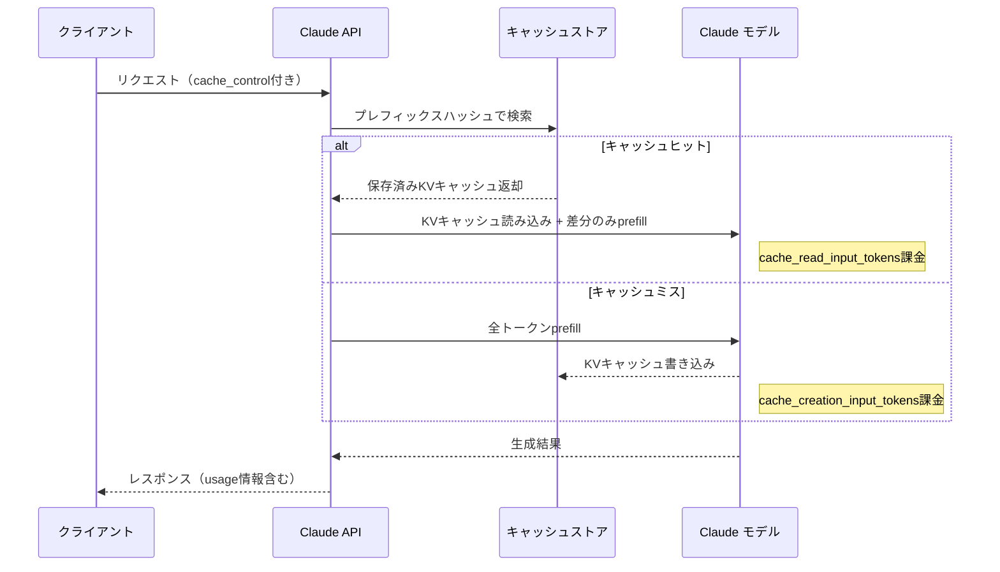
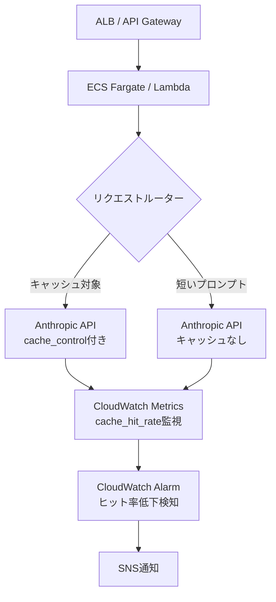
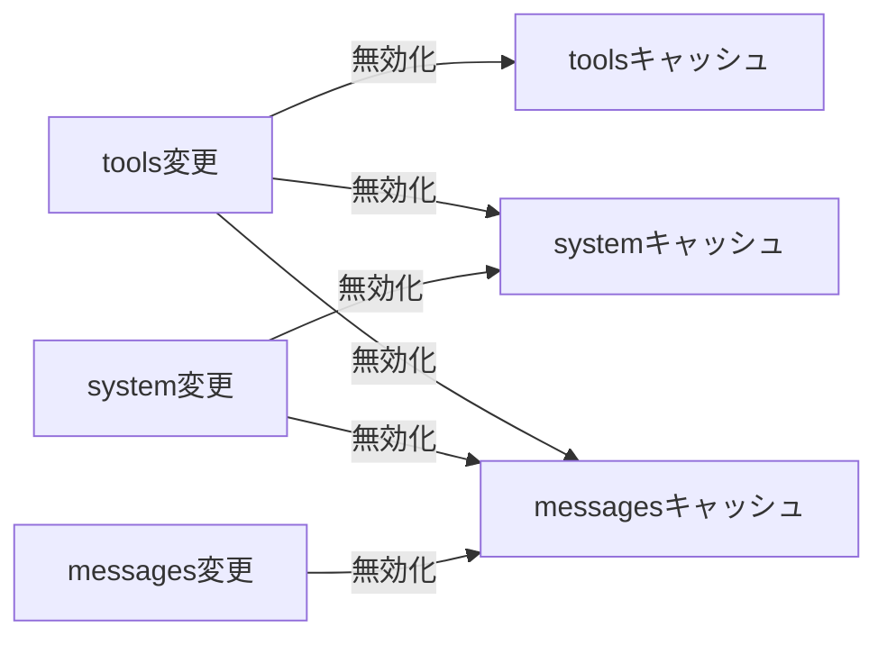

本記事は [Prompt caching with Claude](https://www.anthropic.com/news/prompt-caching) の解説記事です。

## ブログ概要（Summary）

Anthropicは2024年8月14日にClaude APIのPrompt Caching機能をパブリックベータとして公開し、同年12月17日にGeneral Availability（GA）とした。Prompt Cachingは、APIリクエスト間で共通するプロンプトプレフィックス（システムプロンプト、ツール定義、ドキュメントコンテキスト等）のKV（Key-Value）キャッシュをサーバー側に保持し、後続リクエストで再利用する機能である。Anthropicの公式ブログによると、長いプロンプトに対して**入力コストを最大90%**、**TTFT（Time To First Token）を最大85%**削減できると報告されている。

2026年に入り、デフォルトTTLが60分から5分に変更されるなど重要なアップデートがあった。本記事では最新の仕様に基づき、自動キャッシュと明示的キャッシュブレークポイントの使い分け、TTL戦略、Pre-warming、コスト計算まで実装レベルで解説する。

この記事は [Zenn記事: Anthropic Claude API実践活用：モデル選定からコスト最適化まで](https://zenn.dev/0h_n0/articles/7aa294dedf0f90) の深掘りです。

## 情報源

- **種別**: 企業テックブログ（Anthropic公式ブログ）
- **URL**: [https://www.anthropic.com/news/prompt-caching](https://www.anthropic.com/news/prompt-caching)
- **組織**: Anthropic
- **発表日**: 2024年8月14日（パブリックベータ）、2024年12月17日（GA）
- **公式ドキュメント**: [https://platform.claude.com/docs/en/build-with-claude/prompt-caching](https://platform.claude.com/docs/en/build-with-claude/prompt-caching)

## 技術的背景（Technical Background）

### KVキャッシュとは何か

Transformerモデルが入力トークン列を処理する際、各Attention層ではQueryベクトルに対して過去のKey・Valueベクトルとの内積を計算する。数式で表すと：

$$
\text{Attention}(Q, K, V) = \text{softmax}\left(\frac{QK^T}{\sqrt{d_k}}\right) V
$$

ここで$Q$はクエリ行列、$K$はキー行列、$V$はバリュー行列、$d_k$はキーの次元数である。推論時、入力トークン列のprefill（プロンプト処理）フェーズではすべてのトークンに対してK, Vを計算し、メモリに保持する。これがKVキャッシュである。

通常のAPIリクエストでは、リクエストごとにこのKVキャッシュを一から計算する。10万トークンのシステムプロンプトを含むリクエストを100回送信すれば、同一のプレフィックスに対するKVキャッシュ計算が100回繰り返される。

### なぜPrompt Cachingが必要か

LLMアプリケーションの典型的なプロンプト構造を考える：

1. **システムプロンプト**（数百〜数千トークン）: 全リクエストで同一
2. **ツール定義**（数百〜数千トークン）: 全リクエストで同一
3. **ドキュメントコンテキスト**（数千〜数万トークン）: セッション内で同一
4. **会話履歴**（増加する）: ターンごとに蓄積
5. **ユーザーメッセージ**（数十〜数百トークン）: 毎回変化

この構造において、項目1〜3は「静的プレフィックス」として高い再利用性を持つ。Prompt Cachingは、この静的プレフィックスのKVキャッシュをAnthropicのインフラストラクチャに保持し、後続リクエストでは保持済みKVキャッシュを読み込んで差分（項目4〜5）のみを計算する。これにより、prefillフェーズの計算量が大幅に削減される。

## 実装アーキテクチャ（Architecture）

### Prompt Cachingの内部動作

以下のダイアグラムは、Prompt Cachingの動作フローを示す。



### 自動キャッシュ（Automatic Caching）

2026年時点で推奨される最もシンプルな実装方式である。リクエストのトップレベルに`cache_control`を1つ指定するだけで、Anthropicが最後のキャッシュ可能ブロックに自動的にブレークポイントを配置する。

```python
"""自動キャッシュを使ったマルチターン会話の例。

Anthropic Python SDK >= 0.49 を使用。
リクエストトップレベルの cache_control により、
最後のキャッシュ可能ブロックまで自動的にキャッシュされる。
"""
import anthropic


def chat_with_auto_cache(
    client: anthropic.Anthropic,
    messages: list[dict],
    system_prompt: str,
    model: str = "claude-sonnet-5-20260514",
) -> anthropic.types.Message:
    """自動キャッシュを有効にしてメッセージを送信する。

    Args:
        client: Anthropic APIクライアント
        messages: 会話履歴のリスト
        system_prompt: システムプロンプト
        model: 使用するモデルID

    Returns:
        Claude APIのレスポンスメッセージ
    """
    response = client.messages.create(
        model=model,
        max_tokens=1024,
        cache_control={"type": "ephemeral"},  # 自動キャッシュ有効化
        system=system_prompt,
        messages=messages,
    )
    return response


def main() -> None:
    """自動キャッシュのデモ実行。"""
    client = anthropic.Anthropic()

    system = (
        "あなたはソフトウェアアーキテクチャの専門家です。"
        "ユーザーの設計相談に対して、具体的なコード例と"
        "トレードオフ分析を含む回答を提供してください。"
    )

    # ターン1: 初回はキャッシュ書き込み
    messages_turn1 = [
        {"role": "user", "content": "マイクロサービス間の通信パターンについて教えてください"}
    ]
    resp1 = chat_with_auto_cache(client, messages_turn1, system)
    usage1 = resp1.usage
    print(f"ターン1 - 書き込み: {usage1.cache_creation_input_tokens} tokens")
    print(f"ターン1 - 読み取り: {usage1.cache_read_input_tokens} tokens")

    # ターン2: システムプロンプト+ターン1がキャッシュヒット
    messages_turn2 = [
        {"role": "user", "content": "マイクロサービス間の通信パターンについて教えてください"},
        {"role": "assistant", "content": resp1.content[0].text},
        {"role": "user", "content": "gRPCとREST APIの使い分けは？"},
    ]
    resp2 = chat_with_auto_cache(client, messages_turn2, system)
    usage2 = resp2.usage
    print(f"ターン2 - 書き込み: {usage2.cache_creation_input_tokens} tokens")
    print(f"ターン2 - 読み取り: {usage2.cache_read_input_tokens} tokens")


if __name__ == "__main__":
    main()
```

自動キャッシュでは、マルチターン会話において**ブレークポイントが自動的に末尾に移動する**。ターンが進むたびに、前回までの会話履歴がキャッシュから読み取られ、新たに追加されたアシスタント応答とユーザーメッセージのみが書き込まれる。

### 明示的キャッシュブレークポイント

変更頻度の異なるコンテンツブロックを個別に制御したい場合は、最大4つのブレークポイントを明示的に配置できる。

```python
"""明示的キャッシュブレークポイントによるドキュメント処理の例。

システムプロンプト、ドキュメント、ツール定義を
異なるブレークポイントでキャッシュし、
変更頻度に応じた最適なキャッシュ戦略を実現する。
"""
import anthropic


def analyze_document_with_cache(
    client: anthropic.Anthropic,
    document_text: str,
    question: str,
    model: str = "claude-sonnet-5-20260514",
) -> anthropic.types.Message:
    """ドキュメントをキャッシュして質問に回答する。

    Args:
        client: Anthropic APIクライアント
        document_text: 分析対象のドキュメント全文
        question: ドキュメントに対する質問
        model: 使用するモデルID

    Returns:
        Claude APIのレスポンスメッセージ
    """
    response = client.messages.create(
        model=model,
        max_tokens=2048,
        system=[
            {
                "type": "text",
                "text": "あなたは法律文書の分析専門AIです。正確な引用と条文番号を含めて回答してください。",
            },
            {
                "type": "text",
                "text": f"以下は分析対象の法律文書です:\n\n{document_text}",
                "cache_control": {"type": "ephemeral"},  # ブレークポイント1
            },
        ],
        messages=[
            {
                "role": "user",
                "content": question,  # 質問は毎回変わるためキャッシュしない
            }
        ],
    )
    return response


def main() -> None:
    """明示的ブレークポイントのデモ実行。"""
    client = anthropic.Anthropic()

    # 大規模ドキュメントを模擬（実際には数万トークン）
    document = "第1条 本契約は...\n" * 500

    # 同じドキュメントに対して複数の質問
    questions = [
        "契約の解除条件を列挙してください",
        "損害賠償の上限額はいくらですか",
        "契約期間と更新条件を説明してください",
    ]

    for i, q in enumerate(questions):
        resp = analyze_document_with_cache(client, document, q)
        usage = resp.usage
        print(
            f"質問{i + 1}: "
            f"読み取り={usage.cache_read_input_tokens}, "
            f"書き込み={usage.cache_creation_input_tokens}, "
            f"非キャッシュ={usage.input_tokens}"
        )


if __name__ == "__main__":
    main()
```

### TTL選択の判断基準

Prompt Cachingでは2つのTTL（Time-To-Live）オプションが提供される。Anthropicの公式ドキュメントによると、料金体系は以下の通りである。

| TTL | 書き込みコスト倍率 | 読み取りコスト倍率 | 適するユースケース |
|-----|-------------------|-------------------|-------------------|
| 5分（デフォルト） | 基本入力の1.25倍 | 基本入力の0.1倍 | チャットボット、リアルタイム対話 |
| 1時間 | 基本入力の2.0倍 | 基本入力の0.1倍 | バッチ処理、エージェント、定期実行 |

**判断フレームワーク**: 同一プレフィックスに対する次回リクエストまでの間隔を基準とする。

- **5分以内に再利用**: 5分TTL（デフォルト）を使用。書き込みコストが低い
- **5分超〜1時間以内に再利用**: 1時間TTLを使用。書き込みコストは高いがキャッシュミスによる再計算を回避できる
- **1時間超**: キャッシュの恩恵が得られない。プロンプトの短縮やバッチ化を検討する

```python
"""TTL選択の実装例。

5分TTLと1時間TTLをユースケースに応じて切り替える。
"""
import anthropic


def create_cached_request(
    client: anthropic.Anthropic,
    system_prompt: str,
    user_message: str,
    ttl: str = "5m",
    model: str = "claude-sonnet-5-20260514",
) -> anthropic.types.Message:
    """指定したTTLでキャッシュ付きリクエストを送信する。

    Args:
        client: Anthropic APIクライアント
        system_prompt: システムプロンプト
        user_message: ユーザーメッセージ
        ttl: キャッシュTTL（"5m" または "1h"）
        model: 使用するモデルID

    Returns:
        Claude APIのレスポンスメッセージ

    Raises:
        ValueError: 無効なTTL値が指定された場合
    """
    if ttl not in ("5m", "1h"):
        msg = f"ttl must be '5m' or '1h', got '{ttl}'"
        raise ValueError(msg)

    response = client.messages.create(
        model=model,
        max_tokens=1024,
        system=[
            {
                "type": "text",
                "text": system_prompt,
                "cache_control": {"type": "ephemeral", "ttl": ttl},
            },
        ],
        messages=[{"role": "user", "content": user_message}],
    )
    return response
```

### Pre-warmingの実装

Pre-warmingは、`max_tokens=0`を指定してリクエストを送信し、出力トークンを生成せずにキャッシュだけを構築するテクニックである。Anthropicのドキュメントによると、アプリケーション起動時やユーザーリクエスト到着前にキャッシュを「暖めておく」ことで、初回リクエストのTTFTを大幅に短縮できる。

```python
"""Pre-warming実装。

アプリケーション起動時にキャッシュを構築し、
ユーザーリクエスト到着時のレイテンシを低減する。
"""
import anthropic


SYSTEM_PROMPT: list[dict] = [
    {
        "type": "text",
        "text": (
            "あなたはエンタープライズ向けコードレビューアシスタントです。"
            "以下のコーディング規約に従ってレビューしてください:\n"
            "1. 関数は単一責任原則に従う\n"
            "2. 型ヒントを必ず付与する\n"
            "3. Docstringはnumpyスタイルで記述する\n"
            # 実際には数千トークンの規約ドキュメントが入る
        ),
        "cache_control": {"type": "ephemeral"},
    },
]


def prewarm_cache(
    client: anthropic.Anthropic,
    model: str = "claude-sonnet-5-20260514",
) -> dict:
    """キャッシュをPre-warmする。

    max_tokens=0により出力トークンは生成されず、
    キャッシュ書き込みのみが実行される。

    Args:
        client: Anthropic APIクライアント
        model: 使用するモデルID

    Returns:
        usage情報の辞書
    """
    response = client.messages.create(
        model=model,
        max_tokens=0,  # 出力なし、キャッシュ書き込みのみ
        system=SYSTEM_PROMPT,
        messages=[{"role": "user", "content": "warmup"}],
    )
    # stop_reason は "max_tokens"、content は空配列
    return response.usage.model_dump()


def respond_with_warm_cache(
    client: anthropic.Anthropic,
    user_message: str,
    model: str = "claude-sonnet-5-20260514",
) -> anthropic.types.Message:
    """Pre-warm済みキャッシュを利用して応答する。

    Args:
        client: Anthropic APIクライアント
        user_message: ユーザーメッセージ
        model: 使用するモデルID

    Returns:
        Claude APIのレスポンスメッセージ
    """
    return client.messages.create(
        model=model,
        max_tokens=2048,
        system=SYSTEM_PROMPT,
        messages=[{"role": "user", "content": user_message}],
    )


def main() -> None:
    """Pre-warmingのデモ実行。"""
    client = anthropic.Anthropic()

    # アプリケーション起動時にキャッシュを構築
    warmup_usage = prewarm_cache(client)
    print(f"Pre-warm: cache_creation={warmup_usage['cache_creation_input_tokens']} tokens")

    # ユーザーリクエスト（キャッシュヒット）
    resp = respond_with_warm_cache(client, "このPythonコードをレビューしてください:\ndef add(a, b): return a+b")
    print(f"応答: cache_read={resp.usage.cache_read_input_tokens} tokens")
    print(f"TTFT短縮によりレスポンスが高速化")


if __name__ == "__main__":
    main()
```

**Pre-warmingの制約事項**（公式ドキュメントより）:
- `stream: true`と併用不可
- Extended Thinking有効時は使用不可
- Structured Outputs有効時は使用不可
- `tool_choice: {"type": "tool", ...}`や`{"type": "any"}`と併用不可
- Message Batches内では使用不可
- Pre-warm時のthinking設定とeffort設定は、後続リクエストと一致させる必要がある

### モデル別最小キャッシュトークン数

Anthropicの公式ドキュメントによると、キャッシュが有効になるための最小トークン数はモデルによって異なる。最小トークン数未満の場合、**エラーは返されず暗黙的にキャッシュがスキップされる**点に注意が必要である。

| モデル | 最小トークン数 | 基本入力 | 5分書き込み | 1時間書き込み | 読み取り |
|--------|--------------|---------|------------|-------------|---------|
| Claude Opus 5 | 512 | $5/MTok | $6.25/MTok | $10/MTok | $0.50/MTok |
| Claude Sonnet 5 | 1,024 | $3/MTok* | $3.75/MTok* | $6/MTok* | $0.30/MTok* |
| Claude Haiku 4.5 | 4,096 | $1/MTok | $1.25/MTok | $2/MTok | $0.10/MTok |
| Claude Opus 4.8 | 1,024 | $5/MTok | $6.25/MTok | $10/MTok | $0.50/MTok |

*Sonnet 5は2026年8月31日までの導入価格（公式ドキュメントより）

`usage`レスポンスの`cache_creation_input_tokens`と`cache_read_input_tokens`が両方とも0の場合、プロンプトがキャッシュされていないことを意味する。

### usageフィールドによるキャッシュヒット率の確認

```python
"""キャッシュヒット率の計算とモニタリングユーティリティ。

APIレスポンスのusageフィールドからキャッシュ効率を算出する。
"""
from dataclasses import dataclass, field


@dataclass
class CacheMetrics:
    """キャッシュメトリクスの集約クラス。

    Attributes:
        total_requests: 総リクエスト数
        total_cache_read: キャッシュ読み取りトークンの累計
        total_cache_write: キャッシュ書き込みトークンの累計
        total_uncached: 非キャッシュトークンの累計
    """

    total_requests: int = 0
    total_cache_read: int = 0
    total_cache_write: int = 0
    total_uncached: int = 0
    _costs: list[float] = field(default_factory=list)

    def record(self, usage: dict) -> None:
        """APIレスポンスのusage情報を記録する。

        Args:
            usage: response.usage.model_dump() の結果
        """
        self.total_requests += 1
        self.total_cache_read += usage.get("cache_read_input_tokens", 0)
        self.total_cache_write += usage.get("cache_creation_input_tokens", 0)
        self.total_uncached += usage.get("input_tokens", 0)

    @property
    def cache_hit_rate(self) -> float:
        """キャッシュヒット率を計算する。

        Returns:
            0.0〜1.0のキャッシュヒット率。
            キャッシュ関連トークンがない場合は0.0。
        """
        total_cacheable = self.total_cache_read + self.total_cache_write
        if total_cacheable == 0:
            return 0.0
        return self.total_cache_read / total_cacheable

    def estimate_cost_savings(
        self,
        base_input_price: float = 3.0,
        cache_write_multiplier: float = 1.25,
        cache_read_multiplier: float = 0.1,
    ) -> dict:
        """キャッシュによるコスト削減額を推定する。

        Args:
            base_input_price: 基本入力トークン価格（$/MTok）
            cache_write_multiplier: キャッシュ書き込みの価格倍率
            cache_read_multiplier: キャッシュ読み取りの価格倍率

        Returns:
            コスト比較の辞書
        """
        total_input = self.total_cache_read + self.total_cache_write + self.total_uncached

        # キャッシュなしの場合の推定コスト
        cost_without_cache = (total_input / 1_000_000) * base_input_price

        # 実際のコスト
        cost_uncached = (self.total_uncached / 1_000_000) * base_input_price
        cost_write = (self.total_cache_write / 1_000_000) * base_input_price * cache_write_multiplier
        cost_read = (self.total_cache_read / 1_000_000) * base_input_price * cache_read_multiplier
        actual_cost = cost_uncached + cost_write + cost_read

        return {
            "cost_without_cache_usd": round(cost_without_cache, 4),
            "actual_cost_usd": round(actual_cost, 4),
            "savings_usd": round(cost_without_cache - actual_cost, 4),
            "savings_percent": round(
                (1 - actual_cost / cost_without_cache) * 100, 1
            ) if cost_without_cache > 0 else 0.0,
            "cache_hit_rate": round(self.cache_hit_rate * 100, 1),
        }

    def summary(self) -> str:
        """メトリクスのサマリーを文字列で返す。

        Returns:
            人間が読めるサマリー文字列
        """
        savings = self.estimate_cost_savings()
        return (
            f"リクエスト数: {self.total_requests}\n"
            f"キャッシュヒット率: {savings['cache_hit_rate']}%\n"
            f"キャッシュなしコスト: ${savings['cost_without_cache_usd']}\n"
            f"実際のコスト: ${savings['actual_cost_usd']}\n"
            f"削減額: ${savings['savings_usd']} ({savings['savings_percent']}%削減)"
        )
```

## Production Deployment Guide

### AWSインフラ上でのPrompt Caching最適化

本番環境でPrompt Cachingの効果を最大化するには、インフラストラクチャレベルでの設計が重要である。以下にAWS上での推奨アーキテクチャを示す。



### キャッシュ効率を最大化するリクエストルーター

```python
"""本番環境向けPrompt Cachingルーター。

プロンプトサイズとアクセスパターンに基づいて
最適なキャッシュ戦略を自動選択する。
"""
import hashlib
import time
from dataclasses import dataclass

import anthropic


# モデル別最小キャッシュトークン数
# 公式ドキュメント: https://platform.claude.com/docs/en/build-with-claude/prompt-caching
MODEL_MIN_CACHE_TOKENS: dict[str, int] = {
    "claude-opus-5-20260514": 512,
    "claude-sonnet-5-20260514": 1024,
    "claude-haiku-4-5-20260514": 4096,
}


@dataclass
class CacheConfig:
    """キャッシュ設定。

    Attributes:
        enabled: キャッシュを有効にするか
        ttl: キャッシュTTL ("5m" or "1h")
        use_prewarm: Pre-warmingを使うか
    """

    enabled: bool
    ttl: str
    use_prewarm: bool


def estimate_token_count(text: str) -> int:
    """テキストのトークン数を概算する。

    日本語テキストは1文字あたり約1.5トークン、
    英語テキストは1単語あたり約1.3トークンとして概算する。

    Args:
        text: トークン数を概算するテキスト

    Returns:
        概算トークン数
    """
    # 簡易推定: 日本語文字+英語単語ベースの概算
    # 正確な計算にはanthropicのトークナイザを使用すべき
    return max(len(text) // 3, len(text.split()))


def select_cache_strategy(
    system_prompt: str,
    model: str,
    avg_request_interval_sec: float,
) -> CacheConfig:
    """アクセスパターンに基づいてキャッシュ戦略を選択する。

    Args:
        system_prompt: システムプロンプト
        model: モデルID
        avg_request_interval_sec: 平均リクエスト間隔（秒）

    Returns:
        最適なキャッシュ設定
    """
    est_tokens = estimate_token_count(system_prompt)
    min_tokens = MODEL_MIN_CACHE_TOKENS.get(model, 1024)

    # 最小トークン数未満: キャッシュ無効
    if est_tokens < min_tokens:
        return CacheConfig(enabled=False, ttl="5m", use_prewarm=False)

    # リクエスト間隔に基づくTTL選択
    if avg_request_interval_sec <= 300:  # 5分以内
        return CacheConfig(enabled=True, ttl="5m", use_prewarm=True)
    elif avg_request_interval_sec <= 3600:  # 1時間以内
        return CacheConfig(enabled=True, ttl="1h", use_prewarm=True)
    else:
        # 1時間超: キャッシュの恩恵は限定的だが有効化はする
        return CacheConfig(enabled=True, ttl="1h", use_prewarm=False)


def create_request_with_strategy(
    client: anthropic.Anthropic,
    system_prompt: str,
    messages: list[dict],
    model: str = "claude-sonnet-5-20260514",
    cache_config: CacheConfig | None = None,
) -> anthropic.types.Message:
    """キャッシュ戦略に基づいてリクエストを送信する。

    Args:
        client: Anthropic APIクライアント
        system_prompt: システムプロンプト
        messages: メッセージリスト
        model: モデルID
        cache_config: キャッシュ設定（Noneの場合は自動判定）

    Returns:
        Claude APIのレスポンスメッセージ
    """
    if cache_config is None:
        cache_config = select_cache_strategy(system_prompt, model, 60.0)

    if not cache_config.enabled:
        return client.messages.create(
            model=model,
            max_tokens=2048,
            system=system_prompt,
            messages=messages,
        )

    return client.messages.create(
        model=model,
        max_tokens=2048,
        system=[
            {
                "type": "text",
                "text": system_prompt,
                "cache_control": {"type": "ephemeral", "ttl": cache_config.ttl},
            },
        ],
        messages=messages,
    )
```

### CloudWatch メトリクス送信

```python
"""CloudWatchへのキャッシュメトリクス送信。

キャッシュヒット率の監視とアラーム設定に使用する。
"""
import boto3


def publish_cache_metrics(
    usage: dict,
    namespace: str = "Claude/PromptCaching",
    environment: str = "production",
) -> None:
    """APIレスポンスのusage情報をCloudWatchに送信する。

    Args:
        usage: response.usage.model_dump() の結果
        namespace: CloudWatchの名前空間
        environment: 環境名（production / staging等）
    """
    cloudwatch = boto3.client("cloudwatch")

    cache_read = usage.get("cache_read_input_tokens", 0)
    cache_write = usage.get("cache_creation_input_tokens", 0)
    total_cacheable = cache_read + cache_write

    hit_rate = (cache_read / total_cacheable * 100) if total_cacheable > 0 else 0.0

    cloudwatch.put_metric_data(
        Namespace=namespace,
        MetricData=[
            {
                "MetricName": "CacheHitRate",
                "Value": hit_rate,
                "Unit": "Percent",
                "Dimensions": [{"Name": "Environment", "Value": environment}],
            },
            {
                "MetricName": "CacheReadTokens",
                "Value": cache_read,
                "Unit": "Count",
                "Dimensions": [{"Name": "Environment", "Value": environment}],
            },
            {
                "MetricName": "CacheWriteTokens",
                "Value": cache_write,
                "Unit": "Count",
                "Dimensions": [{"Name": "Environment", "Value": environment}],
            },
        ],
    )
```

### Pre-warmingのスケジューリング

5分TTLを使用する場合、キャッシュが失効する前にPre-warmリクエストを定期的に送信する必要がある。Anthropicの公式ドキュメントによると、「キャッシュが5分以内にアクセスされた場合、追加料金なしで自動的にリフレッシュされる」ため、4分間隔でのPre-warmが推奨される。

```python
"""Pre-warmingスケジューラ（AWS Lambda用）。

EventBridge Schedulerで4分間隔で起動し、
キャッシュを維持する。
"""
import json
import logging

import anthropic

logger = logging.getLogger(__name__)


def lambda_handler(event: dict, context: object) -> dict:
    """AWS Lambda ハンドラ。EventBridge Schedulerから4分間隔で呼び出される。

    Args:
        event: Lambda イベント
        context: Lambda コンテキスト

    Returns:
        実行結果
    """
    client = anthropic.Anthropic()

    # 環境変数またはSSMパラメータストアからシステムプロンプトを取得
    system_prompt = event.get("system_prompt", "デフォルトプロンプト")

    try:
        response = client.messages.create(
            model="claude-sonnet-5-20260514",
            max_tokens=0,
            system=[
                {
                    "type": "text",
                    "text": system_prompt,
                    "cache_control": {"type": "ephemeral"},
                },
            ],
            messages=[{"role": "user", "content": "warmup"}],
        )

        usage = response.usage
        logger.info(
            "Pre-warm completed",
            extra={
                "cache_creation_input_tokens": usage.cache_creation_input_tokens,
                "cache_read_input_tokens": usage.cache_read_input_tokens,
            },
        )

        return {
            "statusCode": 200,
            "body": json.dumps({
                "cache_creation": usage.cache_creation_input_tokens,
                "cache_read": usage.cache_read_input_tokens,
            }),
        }
    except anthropic.APIError as e:
        logger.exception("Pre-warm failed")
        return {"statusCode": 500, "body": str(e)}
```

## パフォーマンス最適化（Performance）

### TTFT改善の実測値

Anthropicの公式ブログでは、以下のユースケース別パフォーマンスデータが報告されている。

| ユースケース | キャッシュトークン数 | TTFTの変化 | コスト削減率 |
|-------------|-------------------|-----------|------------|
| 書籍とのチャット | 100,000 | 11.5秒 → 2.4秒（-79%） | -90% |
| Many-shot prompting | 10,000 | 1.6秒 → 1.1秒（-31%） | -86% |
| マルチターン会話（10ターン） | 可変（累積） | 約10秒 → 約2.5秒（-75%） | -53% |

重要な点として、Anthropicは「コスト削減率はキャッシュされるトークン数の割合に依存する」と述べている。プロンプト全体に対するキャッシュ対象部分の比率が高いほど、削減効果が大きくなる。

### キャッシュ無効化の条件

公式ドキュメントに基づくキャッシュ無効化の階層構造を以下に示す。



Anthropicのドキュメントによると、無効化は`tools` → `system` → `messages`の階層で伝播する。上位レベルの変更は、そのレベル以降のすべてのキャッシュを無効化する。具体的には：

- **ツール定義の変更**: 全キャッシュが無効化される
- **Web検索トグル、Citations切り替え、Speed設定**: systemとmessagesのキャッシュが無効化される
- **tool_choice変更、画像の追加・削除**: messagesキャッシュのみ無効化される
- **thinking設定、effort設定の変更**: 常にmessagesキャッシュが無効化される

## 運用での学び（Operations）

### 2026年のTTL変更とその影響

2026年3月6日、Anthropicはデフォルトのキャッシュ TTLを60分から5分に変更した。DEV Communityの報告([参考](https://dev.to/whoffagents/anthropic-silently-dropped-prompt-cache-ttl-from-1-hour-to-5-minutes-16ao))によると、この変更は公式ブログやchangelogでの事前告知なく実施された。

**影響**:
- キャッシュヒット率の大幅な低下（リクエスト間隔が5分を超えるワークロード）
- 一部ユースケースで実効APIコストが30〜60%増加（DEV Communityの報告による）
- Claude Codeやlong-running RAGワーカー、夜間バッチジョブでの`cache_read_input_tokens`がゼロに急落

**対処法**:
- `cache_control`に`"ttl": "1h"`を明示的に指定する
- 1時間TTLの書き込みコストは基本入力の2倍であるため、コスト試算を更新する

```python
# 変更前: デフォルトTTL=60分で暗黙的に1時間キャッシュされていた
{"cache_control": {"type": "ephemeral"}}  # 2026年3月以降: 5分TTL

# 変更後: 1時間TTLを明示的に指定
{"cache_control": {"type": "ephemeral", "ttl": "1h"}}  # 明示的な1時間TTL
```

### キャッシュヒット率の監視とアラート

本番環境では、キャッシュヒット率の継続的な監視が不可欠である。以下の指標を追跡することを推奨する。

1. **キャッシュヒット率**: `cache_read_input_tokens / (cache_read_input_tokens + cache_creation_input_tokens)` が80%以上を維持しているか
2. **急激な低下の検知**: ヒット率が10%以上低下した場合にアラートを発火
3. **コスト効率**: キャッシュなしの場合と比較した実際のコスト削減率

前節のCloudWatchメトリクス送信コードと組み合わせ、CloudWatch Alarmでヒット率の閾値を設定する。Anthropicの公式ドキュメントでは「cache diagnostics（ベータ）」機能も提供されており、連続するリクエスト間でプロンプトがどの地点で分岐したかを自動検出できる。

### Workspace-level Isolation

Anthropicは2026年2月5日にWorkspace-level Isolationを導入した（公式ドキュメントより）。これにより、キャッシュはWorkspace単位で隔離され、異なるWorkspace間でキャッシュが共有されることはない。

- **Claude API / Claude Platform on AWS / Microsoft Foundry**: Workspace単位
- **Amazon Bedrock / Google Cloud**: Organization単位
- プロンプトの完全一致が必要（100%同一のバイト列）
- キャッシュは出力トークンの生成には影響しない

## 学術研究との関連（Academic Context）

Prompt Cachingの基盤となるKVキャッシュ再利用の研究は、学術分野で活発に進められている。

**Efficient Prompt Caching via Embedding Similarity**（arXiv:2311.04934）は、プロンプトの埋め込みベクトル類似度に基づいてKVキャッシュの再利用可能性を判定する手法を提案した。この研究では、プレフィックスの完全一致を要求する単純なキャッシュ方式に対して、意味的に類似するプロンプト間でもKVキャッシュを安全に共有できることを示した。

**vLLM: PagedAttention**（SOSP 2023）は、OSのページングに着想を得たGPUメモリ管理手法により、KVキャッシュの効率的な割り当てと共有を実現した。この研究は、Prompt Cachingの実装基盤として広く参照されている。

**CacheBlend**（arXiv:2405.16444）は、キャッシュされたKVステートと新しい入力のKVステートを選択的にブレンドする手法を提案し、プレフィックス一致の制約を緩和しつつ生成品質を維持するアプローチを示した。

Anthropicの商用実装は、プレフィックス完全一致によるシンプルで確実なキャッシュヒット判定を採用しており、学術研究で提案されている意味的類似度ベースの手法とは異なるアプローチを取っている。これは、APIサービスとして決定論的な動作を保証する設計判断と考えられる。

## まとめと実践への示唆

Anthropicの公式ブログおよびドキュメントに基づき、Prompt Cachingの実装ポイントを整理する。

**基本方針**:
1. マルチターン会話には**自動キャッシュ**を使用する（最もシンプルで推奨）
2. 変更頻度の異なるコンテンツブロックがある場合は**明示的ブレークポイント**を使用する
3. `cache_control`は**最後の静的ブロック**に配置する（変化するブロックに置かない）

**TTL選択**:
- リクエスト間隔5分以内: 5分TTL（デフォルト、書き込みコスト低）
- リクエスト間隔5分超〜1時間以内: 1時間TTL（明示的に`"ttl": "1h"`を指定）
- 2026年3月のデフォルトTTL変更に注意: 既存コードのTTL設定を見直す

**本番運用**:
- Pre-warmingでアプリケーション起動時のレイテンシを削減する
- `usage`フィールドでキャッシュヒット率を継続的に監視する
- `cache_creation_input_tokens`と`cache_read_input_tokens`が両方0の場合、最小トークン数未満の可能性を疑う
- キャッシュ無効化の階層（tools → system → messages）を理解し、不要な無効化を避ける

**コスト試算の目安**（Sonnet 5、公式ドキュメントの価格に基づく）:
- 10万トークンのシステムプロンプトを100回再利用する場合
  - キャッシュなし: $3 x 100 x 0.1 = $30.00
  - キャッシュあり（5分TTL）: 書き込み $0.375 + 読み取り $0.03 x 99 = $3.345
  - **削減率: 約89%**

## 参考文献

1. Anthropic, "Prompt caching with Claude," Anthropic Blog, 2024年8月14日. [https://www.anthropic.com/news/prompt-caching](https://www.anthropic.com/news/prompt-caching)
2. Anthropic, "Prompt caching - Claude Platform Docs," 2026年. [https://platform.claude.com/docs/en/build-with-claude/prompt-caching](https://platform.claude.com/docs/en/build-with-claude/prompt-caching)
3. "Anthropic Silently Dropped Prompt Cache TTL from 1 Hour to 5 Minutes," DEV Community, 2026年. [https://dev.to/whoffagents/anthropic-silently-dropped-prompt-cache-ttl-from-1-hour-to-5-minutes-16ao](https://dev.to/whoffagents/anthropic-silently-dropped-prompt-cache-ttl-from-1-hour-to-5-minutes-16ao)
4. Kwon et al., "Efficient Memory Management for Large Language Model Serving with PagedAttention," SOSP 2023. [https://arxiv.org/abs/2309.06180](https://arxiv.org/abs/2309.06180)
5. Yao et al., "Efficient Prompt Caching via Embedding Similarity," arXiv:2311.04934, 2023年.
6. Yao et al., "CacheBlend: Fast Large Language Model Serving with Composition of Pre-computed KV Caches," arXiv:2405.16444, 2024年.
7. Amazon Web Services, "Amazon Bedrock now supports 1-hour duration for prompt caching," 2026年1月. [https://aws.amazon.com/about-aws/whats-new/2026/01/amazon-bedrock-one-hour-duration-prompt-caching](https://aws.amazon.com/about-aws/whats-new/2026/01/amazon-bedrock-one-hour-duration-prompt-caching)

---

*本記事はAIによって生成されました。技術的な正確性については公式ドキュメントを参照してください。*
