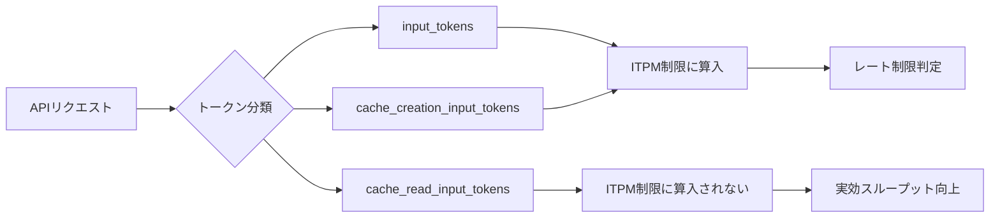

## ブログ概要

本記事は [Token-saving updates on the Anthropic API](https://www.anthropic.com/news/token-saving-updates) の解説記事です。

Anthropicは2025年3月13日、Claude APIにおけるトークン消費とコストを削減する4つのアップデートを発表した。(1) Cache-Aware Rate Limits: Prompt Cache読み取りトークンをITPM制限から除外、(2) Simplified Prompt Caching: 手動セグメント管理不要の自動キャッシュ、(3) Token-Efficient Tool Use: ツール呼び出し時の出力トークンを最大70%削減、(4) Text Editor Tool: テキストの部分編集による効率化である。

この記事は [Zenn記事: Anthropic Claude API実践活用：モデル選定からコスト最適化まで](https://zenn.dev/0h_n0/articles/7aa294dedf0f90) の関連1次情報です。

## 情報源

- **種別**: 企業テックブログ
- **URL**: [https://www.anthropic.com/news/token-saving-updates](https://www.anthropic.com/news/token-saving-updates)
- **組織**: Anthropic
- **発表日**: 2025年3月13日

## 技術的背景

LLM APIの運用コストにおいて、トークン消費は最も直接的な課題である。Claude APIでは入力トークンと出力トークンの両方が課金対象であり、特に以下の3つの場面でトークンが大量に消費される。

**入力トークンの肥大化**: エージェントやRAGシステムでは、システムプロンプト・ツール定義・ドキュメントコンテキストが毎リクエストで繰り返し送信される。数万トークンのコンテキストを持つアプリケーションでは、同一内容の再送信が支配的なコストとなる。

**出力トークンのオーバーヘッド**: ツール呼び出し時、モデルはJSON形式でツール名とパラメータを生成する。出力トークンは入力トークンの数倍の単価であるため、削減の経済的インパクトが大きい。

**レート制限によるスループット制約**: APIのInput Tokens Per Minute（ITPM）制限により、大量のドキュメントを処理するバッチワークロードではスループットが頭打ちになる。

## 実装アーキテクチャ

### 1. Cache-Aware Rate Limits

Anthropicは、Prompt Cache読み取りトークン（`cache_read_input_tokens`）をITPM制限の計算から除外する仕組みを導入した。ブログの発表時点ではClaude 3.7 Sonnetが対象であったが、Anthropicの公式ドキュメントによると、現在はClaude Haiku 3.5を除くほとんどのClaudeモデルでこの仕組みが適用されている。

| トークン種別 | ITPM算入 | 説明 |
|---|---|---|
| `input_tokens` | 算入される | 最後のキャッシュブレークポイント以降のトークン |
| `cache_creation_input_tokens` | 算入される | キャッシュに書き込まれるトークン |
| `cache_read_input_tokens` | 算入されない | キャッシュから読み取られたトークン |

Anthropicの公式ドキュメントでは以下の例を示している。ITPM制限が2,000,000トークンでキャッシュヒット率が80%の場合、実効的には毎分10,000,000トークン（2M非キャッシュ + 8Mキャッシュ）を処理できる。



### 2. Simplified Prompt Caching

ブログでは、Prompt Cachingの利用を簡素化するアップデートも紹介されている。従来はキャッシュセグメントの手動管理が必要であったが、最長のキャッシュ済みプレフィックスからの自動読み取りが行われるようになった。Anthropicは、コスト最大90%削減・レイテンシ最大85%改善と述べている。

Anthropicの公式ドキュメントによると、Prompt Cachingには「Automatic Caching」と「Explicit Cache Breakpoints」の2つの方式がある。Automatic Cachingはリクエストのトップレベルに`cache_control`フィールドを1つ追加するだけで、Explicit方式は個別ブロックに`cache_control`を配置して最大4つのブレークポイントを設定する。

```python
import anthropic

client = anthropic.Anthropic()


def create_explicit_cached_request(
    system_prompt: str,
    document_context: str,
    user_question: str,
    model: str = "claude-sonnet-4-5-20250514",
) -> anthropic.types.Message:
    """Explicit Cache Breakpointsを使用したリクエスト送信。

    Args:
        system_prompt: システムプロンプト（キャッシュ対象）
        document_context: ドキュメントコンテキスト（キャッシュ対象）
        user_question: ユーザーの質問（毎回変わる部分）
        model: 使用するモデルID

    Returns:
        Claude APIのレスポンス
    """
    response = client.messages.create(
        model=model,
        max_tokens=1024,
        system=[
            {
                "type": "text",
                "text": system_prompt,
                "cache_control": {"type": "ephemeral"},
            }
        ],
        messages=[
            {
                "role": "user",
                "content": [
                    {
                        "type": "text",
                        "text": document_context,
                        "cache_control": {"type": "ephemeral"},
                    },
                    {"type": "text", "text": user_question},
                ],
            }
        ],
    )
    return response
```

キャッシュの料金体系（Anthropic公式ドキュメントより）は、5分TTLキャッシュ書き込みが基本価格の1.25倍、1時間TTLが2.0倍、キャッシュ読み取り（ヒット時）が0.1倍である。キャッシュヒット時はベース価格の10%で済むため、繰り返し同じプレフィックスを送信するワークロードでは大幅なコスト削減が見込める。ただし、最小キャッシュ可能トークン数はモデルにより異なる（Claude Sonnet 4.5/4.6では1,024トークン以上）。

### 3. Token-Efficient Tool Use

ブログでは、ツール呼び出し時の出力トークン消費を最大70%削減する機能が紹介されている。Anthropicによると、初期ユーザーの平均削減率は14%である。

ブログ発表時点ではClaude 3.7 Sonnetが対象で、betaヘッダ`token-efficient-tools-2025-02-19`が必要であった。Anthropicの公式ドキュメントによると、Claude 4以降のモデルではビルトインで利用可能であり、betaヘッダは不要である。

```python
from anthropic.types import ToolParam

WEATHER_TOOL: ToolParam = {
    "name": "get_weather",
    "description": "指定された都市の現在の天気情報を取得する",
    "input_schema": {
        "type": "object",
        "properties": {
            "city": {"type": "string", "description": "都市名"},
            "unit": {"type": "string", "enum": ["celsius", "fahrenheit"]},
        },
        "required": ["city"],
    },
}


def call_with_tools(
    user_message: str,
    model: str = "claude-sonnet-4-5-20250514",
) -> anthropic.types.Message:
    """Token-Efficient Tool Useによるツール呼び出し。

    Claude 4以降はbetaヘッダ不要でトークン効率化が有効。
    Claude 3.7 Sonnetの場合はclient.beta.messages.createで
    betas=["token-efficient-tools-2025-02-19"]を指定する。

    Args:
        user_message: ユーザーメッセージ
        model: 使用するモデルID

    Returns:
        Claude APIのレスポンス
    """
    response = client.messages.create(
        model=model,
        max_tokens=1024,
        tools=[WEATHER_TOOL],
        messages=[{"role": "user", "content": user_message}],
    )
    return response
```

この機能はAnthropic API、Amazon Bedrock、Google Cloud Vertex AIで利用可能であるとブログで述べられている。

### 4. Text Editor Tool

ブログでは、テキストの特定部分を対象とした編集機能としてText Editor Toolも紹介されている。Anthropicの公式ドキュメントによると、`str_replace_based_edit_tool`という名前で提供され、`view`・`str_replace`・`create`・`insert`・`undo_edit`の5つのコマンドを持つ。テキスト全体を再生成する代わりに差分のみを指定するため、出力トークンの消費とレイテンシが削減される。

```python
def create_text_editor_request(
    user_message: str,
    model: str = "claude-sonnet-4-5-20250514",
) -> anthropic.types.Message:
    """Text Editor Toolを使用したリクエスト。

    Args:
        user_message: ユーザーメッセージ
        model: 使用するモデルID

    Returns:
        Claude APIのレスポンス
    """
    response = client.messages.create(
        model=model,
        max_tokens=4096,
        tools=[
            {
                "type": "text_editor_20250429",
                "name": "str_replace_based_edit_tool",
            }
        ],
        messages=[{"role": "user", "content": user_message}],
    )
    return response
```

## Production Deployment Guide

### AWS実装パターン（コスト最適化重視）

以下のコスト試算は2026年8月時点のAWS ap-northeast-1（東京）リージョン料金に基づく概算値である。実際のコストはトラフィックパターン、リージョン、バースト使用量により変動する。

| 構成 | トラフィック | 主要サービス | 月額概算 |
|---|---|---|---|
| Small（Serverless） | ~100 req/日 | Lambda + Bedrock + DynamoDB | $50-150 |
| Medium（Hybrid） | ~1,000 req/日 | ECS Fargate + Bedrock + ElastiCache | $300-800 |
| Large（Container） | 10,000+ req/日 | EKS + Spot + Bedrock + ElastiCache | $2,000-5,000 |

**Small構成**: Lambda（256MB, 30秒タイムアウト）~$5/月、Bedrock API ~$30-100/月、DynamoDB On-Demand ~$5/月。Prompt Caching有効化でBedrock費用を削減。

**Large構成**: EKS コントロールプレーン ~$72/月、EC2 Spot（m5.xlarge x 2）~$60/月、ElastiCache ~$50/月、Bedrock API ~$1,500-4,000/月。Karpenter + Spotで最大90%削減。

### Terraformインフラコード（Small構成）

```hcl
# Small構成: Lambda + Bedrock + DynamoDB（主要リソースのみ抜粋）

resource "aws_iam_role_policy" "lambda_policy" {
  name = "claude-api-proxy-policy"
  role = aws_iam_role.lambda_role.id
  policy = jsonencode({
    Version = "2012-10-17"
    Statement = [
      { Effect = "Allow"
        Action = ["bedrock:InvokeModel", "bedrock:InvokeModelWithResponseStream"]
        Resource = "arn:aws:bedrock:ap-northeast-1::foundation-model/anthropic.*" },
      { Effect = "Allow"
        Action = ["dynamodb:GetItem", "dynamodb:PutItem", "dynamodb:Query"]
        Resource = aws_dynamodb_table.cache_meta.arn },
    ]
  })
}

resource "aws_dynamodb_table" "cache_meta" {
  name         = "claude-cache-metadata"
  billing_mode = "PAY_PER_REQUEST"
  hash_key     = "prompt_hash"
  attribute { name = "prompt_hash"; type = "S" }
  ttl { attribute_name = "expires_at"; enabled = true }
  server_side_encryption { enabled = true }
}

resource "aws_lambda_function" "claude_proxy" {
  function_name    = "claude-api-proxy"
  role             = aws_iam_role.lambda_role.arn
  handler          = "handler.lambda_handler"
  runtime          = "python3.12"
  memory_size      = 256
  timeout          = 30
  filename         = "lambda_package.zip"
  source_code_hash = filebase64sha256("lambda_package.zip")
  environment {
    variables = { CACHE_TABLE = aws_dynamodb_table.cache_meta.name, ENABLE_PROMPT_CACHE = "true" }
  }
}
```

### 運用・監視設定

**CloudWatch Logs Insightsクエリ**（キャッシュヒット率とコスト監視）:

```
fields @timestamp, @message
| filter @message like /cache_read_input_tokens/
| stats sum(input_tokens) as uncached,
        sum(cache_read_input_tokens) as cached,
        sum(output_tokens) as output,
        (sum(cache_read_input_tokens) / (sum(input_tokens) + sum(cache_read_input_tokens) + sum(cache_creation_input_tokens))) * 100 as cache_hit_rate
  by bin(1h)
| sort @timestamp desc
```

**トークン使用量アラーム**:

```python
import boto3


def create_token_usage_alarm(
    function_name: str,
    threshold: int = 500000,
    sns_topic_arn: str = "",
) -> dict:
    """Bedrockトークン使用量スパイク検知アラームを作成する。

    Args:
        function_name: 監視対象のLambda関数名
        threshold: アラーム閾値（トークン数/5分）
        sns_topic_arn: 通知先SNSトピックARN

    Returns:
        CloudWatch put_metric_alarm のレスポンス
    """
    cw = boto3.client("cloudwatch", region_name="ap-northeast-1")
    return cw.put_metric_alarm(
        AlarmName=f"{function_name}-token-spike",
        MetricName="TotalInputTokens",
        Namespace="ClaudeAPIProxy",
        Statistic="Sum",
        Period=300,
        EvaluationPeriods=2,
        Threshold=threshold,
        ComparisonOperator="GreaterThanThreshold",
        AlarmActions=[sns_topic_arn] if sns_topic_arn else [],
    )
```

### コスト最適化チェックリスト

**アーキテクチャ選択**: トラフィック量に応じた構成選択 / レイテンシ要件に応じたリージョン選択

**リソース最適化**: EC2 Spot Instances優先（最大90%削減） / Reserved Instances 1年コミット（最大72%削減） / Savings Plans検討 / Lambda メモリサイズ最適化 / EKS Karpenterアイドル時スケールダウン / NAT Gateway代替にVPCエンドポイント

**LLMコスト削減**: Prompt Caching有効化（ヒット時90%削減） / Token-Efficient Tool Use（出力最大70%削減） / Bedrock Batch API（50%削減） / モデル選択ロジック（Haiku/Sonnet/Opus切替） / max_tokens制限 / Text Editor Toolで差分編集

**監視・アラート**: AWS Budgets月次予算アラート / CloudWatchトークンスパイク検知 / Cost Anomaly Detection / 日次コストレポートSNS通知 / キャッシュヒット率監視

**リソース管理**: 未使用リソース定期削除 / コスト配分タグ戦略 / 開発環境の夜間停止 / CloudTrail有効化

## パフォーマンス最適化

### usageフィールドの監視

4つの機能の効果を定量的に評価するには、APIレスポンスの`usage`フィールドを継続的に監視する。

```python
import json
import logging
from dataclasses import dataclass, asdict
from datetime import datetime, timezone

logger = logging.getLogger(__name__)


@dataclass
class TokenUsageMetrics:
    """トークン使用量メトリクス。"""

    timestamp: str
    model: str
    input_tokens: int
    cache_creation_tokens: int
    cache_read_tokens: int
    output_tokens: int
    cache_hit_rate: float
    tool_use_detected: bool


def log_usage_metrics(
    response: anthropic.types.Message,
    model: str,
) -> TokenUsageMetrics:
    """APIレスポンスからトークン使用量を構造化ログとして記録する。

    Args:
        response: Claude APIのレスポンス
        model: 使用したモデルID

    Returns:
        記録したメトリクス
    """
    usage = response.usage
    cache_creation = getattr(usage, "cache_creation_input_tokens", 0) or 0
    cache_read = getattr(usage, "cache_read_input_tokens", 0) or 0
    total_input = usage.input_tokens + cache_creation + cache_read
    hit_rate = cache_read / total_input if total_input > 0 else 0.0

    metrics = TokenUsageMetrics(
        timestamp=datetime.now(tz=timezone.utc).isoformat(),
        model=model,
        input_tokens=usage.input_tokens,
        cache_creation_tokens=cache_creation,
        cache_read_tokens=cache_read,
        output_tokens=usage.output_tokens,
        cache_hit_rate=round(hit_rate, 4),
        tool_use_detected=any(b.type == "tool_use" for b in response.content),
    )
    logger.info(json.dumps(asdict(metrics), ensure_ascii=False))
    return metrics
```

### Before/After比較

ブログおよび公式ドキュメントで示されている数値に基づく比較を以下に示す。

| 機能 | Before | After | 改善率 |
|---|---|---|---|
| Prompt Caching（コスト） | 基本価格 x 1.0 | 基本価格 x 0.1（ヒット時） | 最大90%削減 |
| Prompt Caching（レイテンシ） | フル処理 | プレフィックス再利用 | 最大85%削減 |
| Token-Efficient Tool Use | 出力トークン x 1.0 | 出力 x 0.30-0.86 | 最大70%（平均14%） |
| Cache-Aware Rate Limits | 2M ITPM（全算入） | 実効10M ITPM（80%ヒット時） | 5倍向上 |

## 運用での学び

**キャッシュヒット率のモニタリング**: Anthropic ConsoleのUsageページで確認可能。ヒット率が低い場合、キャッシュの最小トークン数要件を満たしていないか、プロンプト構造が頻繁に変更されている可能性がある。公式ドキュメントによると、キャッシュは完全一致（100%同一のプロンプトセグメント）が必要であり、わずかな差異でもミスとなる。

**キャッシュTTLの選択**: デフォルト5分TTLは高頻度アクセス向けで、ヒット時に自動更新される。アクセス間隔が5分超のワークロードでは1時間TTL（書き込みコスト2倍）を検討する。公式ドキュメントでは、エージェントの長時間タスクやレイテンシ重視アプリケーションに1時間TTLを推奨している。

**コスト監視の要点**: (1) キャッシュ書き込みが読み取りを大幅に上回っている場合はキャッシュが有効活用されていない、(2) Token-Efficient Tool Use導入前後の出力トークン数変化を追跡、(3) `(input_tokens + cache_creation_input_tokens) / ITPM_limit`で実効使用率を算出する。

## 学術研究との関連

**KVキャッシュ最適化**: Prompt Cachingの基盤技術であるKVキャッシュは活発に研究されている分野である。KVキャッシュは推論時のGPUメモリの最大70%を消費しうるとされ（arXiv:2603.20397）、キャッシュ退避・圧縮・ハイブリッドメモリ・新規Attention機構の4方向で最適化が研究されている。AnthropicのPrompt Cachingはモデルレベルのkv-cache最適化とは異なり、APIレイヤーでのプレフィックスキャッシュとして実装されている点が特徴的である。

**関数呼び出し最適化**: 「ToolACE: Winning the Points of LLM Function Calling」（ICLR 2025）はデータ合成によるツール呼び出し能力向上を提案し、「To Call or Not to Call」（arXiv:2605.00737）は合理的選択理論に基づくツール呼び出し最適化フレームワークを提案している。Anthropicのアプローチは出力フォーマット自体の効率化であり、呼び出し判断の最適化とは異なるレイヤーである。

## まとめと実践への示唆

Anthropicが発表した4つのトークン節約アップデートは、それぞれ異なるレイヤーでClaude APIの効率性を向上させる。Cache-Aware Rate Limitsはスループットの実効拡大、Simplified Prompt Cachingはコスト・レイテンシ削減、Token-Efficient Tool Useは出力トークン効率化、Text Editor Toolは差分編集による無駄の排除を担う。

実務で最大の効果を得るには、(1) システムプロンプトとツール定義にPrompt Cachingを適用、(2) Claude 4以降のモデルを選択しToken-Efficient Tool Useをデフォルト有効で活用、(3) Cache-Aware Rate Limitsによるスループット向上を前提にバッチ処理設計を見直す、という順序での導入が効果的と考えられる。

## 参考文献

- **Blog URL**: [https://www.anthropic.com/news/token-saving-updates](https://www.anthropic.com/news/token-saving-updates)
- **Prompt Caching Docs**: [https://docs.anthropic.com/en/docs/build-with-claude/prompt-caching](https://docs.anthropic.com/en/docs/build-with-claude/prompt-caching)
- **Rate Limits Docs**: [https://platform.claude.com/docs/en/api/rate-limits](https://platform.claude.com/docs/en/api/rate-limits)
- **Text Editor Tool Docs**: [https://platform.claude.com/docs/en/agents-and-tools/tool-use/text-editor-tool](https://platform.claude.com/docs/en/agents-and-tools/tool-use/text-editor-tool)
- **KV Cache Optimization Survey**: [https://arxiv.org/abs/2603.20397](https://arxiv.org/abs/2603.20397)
- **ToolACE (ICLR 2025)**: [https://arxiv.org/abs/2409.00920](https://arxiv.org/abs/2409.00920)
- **Related Zenn article**: [https://zenn.dev/0h_n0/articles/7aa294dedf0f90](https://zenn.dev/0h_n0/articles/7aa294dedf0f90)
