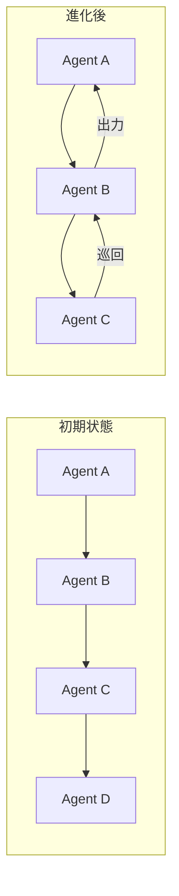

本記事は [arXiv: Multi-Agent Collaboration via Evolving Orchestration](https://arxiv.org/abs/2505.19591) の解説記事です。

## 論文概要（Abstract）

Dang, Qianら（2025）は、静的な組織構造に依存するマルチエージェントLLMシステムの限界に対し、強化学習で訓練された中央オーケストレーターがエージェントを動的に協調させる「Puppeteerパラダイム」を提案した。NeurIPS 2025に採択された本論文では、REINFORCEアルゴリズムによる方策勾配最適化により、エージェント間のコミュニケーショントポロジーが進化し、よりコンパクトで巡回的な推論構造が自発的に創発することを報告している。著者らは、性能向上と計算コスト削減が同時に達成されることを複数のベンチマークで実証している。

この記事は [Zenn記事: Agents SDK SessionsとHandoffで設計するマルチエージェント会話管理](https://zenn.dev/0h_n0/articles/0a13a0901b1752) の深掘りです。

## 情報源

- **arXiv ID**: 2505.19591
- **URL**: [https://arxiv.org/abs/2505.19591](https://arxiv.org/abs/2505.19591)
- **著者**: Yufan Dang, Chen Qian, Xueheng Luo et al.
- **採択**: NeurIPS 2025
- **分野**: cs.CL, cs.AI, cs.MA

## 背景と動機（Background & Motivation）

既存のマルチエージェントLLMシステムは、エージェント間の協調構造が事前に固定されているという根本的な制約を抱えている。静的なDAG（有向非巡回グラフ）ベースの手法（MacNet等）や、進化的最適化に基づく手法（EvoAgent等）は、タスクの状態変化に応じた適応的な協調を実現できない。

著者らは、この課題に対して「Puppeteer（操り人形師）」という比喩で、中央のオーケストレーターがタスクの進行状態に応じてエージェントの選択と順序付けを動的に制御するパラダイムを提案している。このアプローチは、Agents SDKのHandoffパターンにおける制御フローの設計と深く関連する。Handoffは静的な遷移規則でエージェント間の制御を移譲するが、Puppeteerは強化学習によりこの遷移を動的に最適化する。

## 主要な貢献（Key Contributions）

- **動的オーケストレーションフレームワーク**: タスク状態の進化に基づいてエージェントの選択と優先順位付けを適応的に制御する中央オーケストレーター
- **REINFORCEベースの方策最適化**: 解の品質と計算効率のバランスを取る報酬構造の設計
- **巡回的推論構造の自発的創発**: 学習過程でコンパクトかつ巡回的なエージェント間コミュニケーションが出現する発見
- **効率と性能の同時改善**: 従来手法が性能とコストのトレードオフに直面する中、両者の同時改善を実証

## 技術的詳細（Technical Details）

### エージェントの形式的定義

著者らは、各エージェントを以下の3要素の組として定義している。

$$
a = (m, r, t)
$$

ここで $m$ は基盤モデル（foundation model）、$r$ は推論パターン（reasoning pattern）、$t$ は利用可能なツール（tools）を表す。推論パターンには、タスク分解（decomposition）、反省（reflection）、洗練（refinement）、批評（critique）、要約（summarization）、終了（termination）等が含まれる。

この定義は、Agents SDKの`Agent`クラスの構成と直接対応する。

```python
from agents import Agent, function_tool

@function_tool
def web_search(query: str) -> str:
    """Web検索ツール"""
    ...

# 論文の a = (m, r, t) に対応
critique_agent = Agent(
    name="critique_agent",
    model="gpt-4o",                    # m: foundation model
    instructions="批評的に分析せよ",     # r: reasoning pattern
    tools=[web_search],                 # t: available tools
)
```

### Puppeteerオーケストレーション

マルチエージェントシステムは有向グラフとして直列化され、オーケストレーターが各ステップで次に実行するエージェントを選択する。方策 $\pi_\theta$ はパラメータ $\theta$ で制御され、REINFORCEアルゴリズムで最適化される。

**目的関数**:

$$
J(\theta) = \mathbb{E}_{\pi_\theta}[R(\tau)]
$$

**方策勾配**:

$$
\nabla_\theta J(\theta) \approx \frac{1}{N} \sum_{n=1}^{N} \left( \sum_{t=1}^{T} \nabla_\theta \log \pi_\theta(a_t | S_t) \right) \cdot R(\tau)
$$

ここで $N$ はサンプルサイズ、$T$ は軌跡あたりの推論ステップ数、$R(\tau)$ は完全な軌跡 $\tau$ に対する累積報酬を表す。パラメータは以下の更新則で最適化される。

$$
\theta \leftarrow \theta + \alpha \nabla_\theta J(\theta)
$$

### 報酬構造の設計

著者らは、解の品質と計算効率のバランスを取る報酬関数を設計している。

$$
R_t = \begin{cases}
r - \lambda \cdot C_T & \text{if } t = T \text{ (terminal)} \\
\gamma \cdot R_{t+1} - \lambda \cdot C_t & \text{if } t < T
\end{cases}
$$

コスト項は以下で定義される。

$$
C_t = F \cdot \log(1 + t / \varphi)
$$

各変数の定義:
- $r$: タスク報酬。閉ドメインでは $r \in \{0, 1\}$（正誤判定）、開ドメインでは $r \in [0, 1]$（品質スコア）
- $\lambda = 0.1$: 効率重み（デフォルト値）
- $\gamma = 0.99$: 割引率
- $F$: FLOPs/トークンのコスト指標
- $\varphi$: 最大ステップ予算

対数コスト $\log(1 + t/\varphi)$ の採用により、初期ステップのコストペナルティを抑制し、長い推論チェーンに対してのみ強いペナルティを課す設計になっている。

### 巡回的推論構造の創発



著者らは、学習過程でエージェント間のコミュニケーショントポロジーに2つの特徴的な変化が観察されると報告している。

**コンパクション（Compaction）**: グラフ密度が学習中に増加し、コミュニケーションが「ハブ」エージェントを中心とした密に相互接続されたサブネットワークに集中する。

**巡回性（Cyclicality）**: 閉ループの経路が段階的に出現し、エージェントが協力者を繰り返し訪問する巡回的構造が形成される。著者らは「巡回的トポロジーは再帰的な批評と持続的な内部議論を支援する」と述べており、非巡回ネットワークと比較して情報の再利用効率が向上すると報告している。

この巡回的構造は、Agents SDKのHandoffパターンでは実現が困難である。Handoffは制御を完全に移譲するため、移譲先から移譲元への戻りループを自然に表現できない。一方、`Agent.as_tool()`パターンでは、呼び出し元が制御を保持するため、結果に基づく再帰的な呼び出しが可能であり、Puppeteerの巡回的構造に近い動作を実現できる。

```python
from agents import Agent, Runner

async def cyclic_orchestration(
    query: str,
    max_rounds: int = 3,
) -> str:
    """巡回的推論を模倣するオーケストレーションパターン"""
    refiner = Agent(name="refiner", model="gpt-4o",
                    instructions="入力を洗練せよ")
    critic = Agent(name="critic", model="gpt-4o",
                   instructions="批評を返せ。十分なら'DONE'と返せ")

    current = query
    for round_idx in range(max_rounds):
        refined = await Runner.run(refiner, input=current)
        critique = await Runner.run(critic, input=refined.final_output)
        if "DONE" in critique.final_output:
            return refined.final_output
        current = f"批評: {critique.final_output}\n改善対象: {refined.final_output}"
    return refined.final_output
```

### 実験結果

著者らは、大規模モデル（Titan）と小規模モデル（Mimas）の2つの構成で実験を行い、以下の結果を報告している（論文Table 1より）。

**Titan構成（大規模モデル）**:

| 手法 | GSM-Hard | MMLU-Pro | SRDD | CommonGen-Hard | 平均 |
|------|---------|---------|------|---------------|------|
| MacNet（静的DAG） | - | - | - | - | 0.5187 |
| EvoAgent（進化的） | - | - | - | - | 0.4994 |
| Puppeteer（初期） | - | - | - | - | 0.6893 |
| **Puppeteer（進化後）** | - | - | - | - | **0.7731** |

**Mimas構成（小規模モデル）**:

| 手法 | 平均 |
|------|------|
| Self-Refine | 0.4695 |
| AFlow | 0.5364 |
| Puppeteer-Mono（初期） | 0.5068 |
| **Puppeteer-Mono（進化後）** | **0.6147** |
| **Puppeteer（進化後）** | **0.6324** |

Puppeteer（進化後）はすべてのベースラインを上回り、Titan構成では初期状態から12.2%の性能向上を達成している。著者らは「トークン指標は学習を通じてほぼすべての設定で一貫して減少する」と報告しており、性能向上と計算コスト削減の同時達成を実証している。

### ハイパーパラメータの影響

著者らは、チェーン深度と探索幅のトポロジー制約について非単調な関係を報告している（論文Figure 7より）。デフォルト設定のW4D2（幅4、深度2）が精度と効率の最適なトレードオフを達成し、深度や幅を増やすと冗長性と計算コストが増加する。

**計算リソース**: 8台のNVIDIA A800 GPU、ピークメモリ28.8-78.4 GB/GPU、訓練時間2-6時間（ベンチマークの複雑さによる変動）。

## Production Deployment Guide

### AWS実装パターン（動的オーケストレーション）

Puppeteerパラダイムに基づく動的エージェントオーケストレーションをAWSにデプロイする場合の推奨構成を示す。

| 規模 | 月間リクエスト | 推奨構成 | 月額コスト | 主要サービス |
|------|--------------|---------|-----------|------------|
| **Small** | ~3,000 (100/日) | Serverless | $150-350 | Step Functions + Lambda + Bedrock |
| **Medium** | ~30,000 (1,000/日) | Hybrid | $800-2,000 | ECS Fargate + Step Functions + Bedrock |
| **Large** | 300,000+ | Container | $5,000-15,000 | EKS + SageMaker Endpoint + Redis |

**コスト試算の注意事項**: 上記は2026年8月時点のAWS ap-northeast-1リージョン料金に基づく概算値です。動的オーケストレーションでは巡回的な推論により推論回数が増加するため、Bedrock APIコストに注意が必要です。最新料金は [AWS料金計算ツール](https://calculator.aws/) で確認してください。

### Terraformインフラコード

```hcl
resource "aws_sfn_state_machine" "puppeteer_orchestrator" {
  name     = "puppeteer-orchestrator"
  role_arn = aws_iam_role.sfn_role.arn

  definition = jsonencode({
    StartAt = "SelectAgent"
    States = {
      SelectAgent = {
        Type     = "Task"
        Resource = aws_lambda_function.orchestrator.arn
        Next     = "ExecuteAgent"
      }
      ExecuteAgent = {
        Type     = "Task"
        Resource = aws_lambda_function.agent_executor.arn
        Next     = "CheckTermination"
      }
      CheckTermination = {
        Type = "Choice"
        Choices = [{
          Variable     = "$.terminated"
          BooleanEquals = true
          Next         = "AggregateResults"
        }]
        Default = "SelectAgent"
      }
      AggregateResults = {
        Type = "Task"
        Resource = aws_lambda_function.aggregator.arn
        End  = true
      }
    }
  })
}

resource "aws_lambda_function" "orchestrator" {
  filename      = "orchestrator.zip"
  function_name = "puppeteer-select-agent"
  role          = aws_iam_role.lambda_role.arn
  handler       = "index.handler"
  runtime       = "python3.12"
  timeout       = 60
  memory_size   = 1024

  environment {
    variables = {
      MAX_ROUNDS     = "5"
      COST_WEIGHT    = "0.1"
      DISCOUNT_RATE  = "0.99"
    }
  }
}
```

### コスト最適化チェックリスト

- [ ] Step Functionsで巡回ループの最大ステップ数を制限（MAX_ROUNDS）
- [ ] エージェントごとにモデルティアを分離（オーケストレーター: Opus、ワーカー: Sonnet/Haiku）
- [ ] 巡回検出とタイムアウトでコスト暴走を防止
- [ ] CloudWatch Metricsでステップ数・トークン使用量をダッシュボード化
- [ ] AWS Budgets月額予算設定（80%で警告）

## まとめと実践への示唆

Puppeteerパラダイムは、静的なマルチエージェント協調構造の限界を強化学習による動的オーケストレーションで克服する手法である。巡回的推論構造の自発的創発という発見は、エージェント間の協調設計に新たな視点を提供する。Agents SDKでは、Handoffの静的な遷移規則を超えて、`Agent.as_tool()`パターンと明示的なループ構造を組み合わせることで、Puppeteerに近い動的な協調を実現できる。性能向上と計算コスト削減の同時達成という実験結果は、マルチエージェントシステムの実用化において重要な知見である。

## 参考文献

- **arXiv**: [https://arxiv.org/abs/2505.19591](https://arxiv.org/abs/2505.19591)
- **NeurIPS 2025**: [https://neurips.cc/](https://neurips.cc/)
- **Related Zenn article**: [https://zenn.dev/0h_n0/articles/0a13a0901b1752](https://zenn.dev/0h_n0/articles/0a13a0901b1752)
