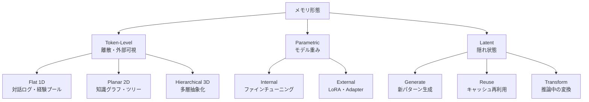

本記事は [arXiv: Memory in the Age of AI Agents](https://arxiv.org/abs/2512.13564) の解説記事です。

## 論文概要（Abstract）

Hu, Liuら（2025）は、基盤モデルベースのAIエージェントにおけるメモリシステムを体系的に整理したサーベイ論文を発表した。著者らは、エージェントメモリの実装が多岐にわたり用語も不統一であるという課題に対し、**形態（Forms）**・**機能（Functions）**・**動態（Dynamics）**の3つの視点から統一的なフレームワークを提案している。47名の著者による包括的な調査であり、メモリベンチマークとオープンソースフレームワークのカタログも含まれている。

この記事は [Zenn記事: Agents SDK SessionsとHandoffで設計するマルチエージェント会話管理](https://zenn.dev/0h_n0/articles/0a13a0901b1752) の深掘りです。

## 情報源

- **arXiv ID**: 2512.13564
- **URL**: [https://arxiv.org/abs/2512.13564](https://arxiv.org/abs/2512.13564)
- **著者**: Yuyang Hu, Shichun Liu, Guibin Zhang et al.（47名）
- **発表年**: 2025（v2: 2026年1月）
- **分野**: cs.CL, cs.AI

## 背景と動機（Background & Motivation）

LLMベースのエージェントが複雑なタスクを長期間にわたって遂行するためには、過去のやり取りや学習した知識を保持・活用するメモリ機構が不可欠である。しかし、既存のエージェントメモリ実装は、RAG（Retrieval-Augmented Generation）、コンテキストエンジニアリング、LLM内部の記憶機構など、隣接する概念と混同されることが多い。

著者らは、エージェントメモリを「持続的かつ自己進化するタスク横断的な状態管理」と定義し、静的な外部知識アクセス（RAG）やコンテキストウィンドウ内のリソース最適化（コンテキストエンジニアリング）とは明確に区別している。この区別は、Zenn記事で解説されているAgents SDKのSessionメカニズムが「エージェントメモリ」のどの層に対応するかを理解する上で重要である。

## 主要な貢献（Key Contributions）

- **3視点フレームワーク**: 形態（Forms）・機能（Functions）・動態（Dynamics）による統一的な分類体系
- **スコープの明確化**: エージェントメモリをLLMメモリ、RAG、コンテキストエンジニアリングから区別する定義
- **ベンチマーク・フレームワークカタログ**: StreamBench、LoCoMo、LongMemEval等のベンチマークとMem0、Zep AI等のフレームワークの体系的整理
- **研究フロンティアの特定**: 自動メモリ管理、強化学習統合、マルチモーダルメモリ等の未開拓領域

## 技術的詳細（Technical Details）

### 3つのメモリ形態（Forms）

著者らは、メモリの構造的な組織化を3つの形態に分類している。



**Token-Level Memory**は、テキスト・ベクトル・トークンといった離散的で外部から可視な単位で保存される。組織化の次元で3つに分かれる。

- **Flat（1D）**: トポロジーを持たない逐次的・独立的な単位。対話ログや経験プールが典型例
- **Planar（2D）**: グラフやツリーによる単一層の構造的関係。知識グラフがこれに該当
- **Hierarchical（3D）**: 多層の抽象化と層間リンクを持つ。ピラミッド型やレイヤード型の構成

**Parametric Memory**は、モデルの重みやそれに付随するパラメータに知識を埋め込む形態である。ファインチューニングで基盤モデルの重みに直接埋め込むInternal型と、LoRAやAdapterのように基盤モデルとは別のモジュールで保持するExternal型がある。

**Latent Memory**は、隠れ状態や連続的な内部表現として保存される形態である。新しい潜在パターンを生成するGenerate、キャッシュされた表現をタスク間で再利用するReuse、推論中に内部状態を変換するTransformの3メカニズムがある。

### 3つのメモリ機能（Functions）

著者らは、メモリの目的と役割を3つの機能に分類している。

**Factual Memory（事実記憶）**は、ユーザーや環境に関する知識を保存する。「ユーザーXはPythonを好む」「環境Yのタイムゾーンは JST」といった宣言的知識が該当する。Agents SDKでは、`RunContextWrapper`にユーザープロファイルを保持し、instructionsの動的関数でパーソナライゼーションに活用するパターンに対応する。

**Experiential Memory（経験記憶）**は、タスク実行から蓄積された学習を保存する。著者らはさらに3つのサブタイプに細分化している。

| サブタイプ | 内容 | SDK対応 |
|----------|------|---------|
| Case-based | 成功/失敗の軌跡（trajectory）を保存 | `Session`の会話履歴 |
| Strategy-based | 再利用可能な戦略・方法論 | `instructions`テンプレート |
| Skill-based | 実行可能な手続きのエンコーディング | `@function_tool`定義 |

**Working Memory（作業記憶）**は、タスク固有のコンテキストを維持する。単一ターン内の作業記憶と、複数ターンにわたる拡張的な作業記憶に分かれる。Agents SDKの`Session`は、まさにこの作業記憶の実装であり、`to_input_list()`で直近の会話コンテキストを構築し、`OpenAIResponsesCompactionSession`でコンテキスト圧縮を行う。

### メモリ動態（Dynamics）

著者らは、メモリのライフサイクル操作を3つの動態として形式化している。

**Formation（形成）**: タスク実行中のアーティファクトからメモリ候補を抽出する操作。

$$
M_{t+1}^{\text{form}} = F(M_t, \phi_t)
$$

ここで $M_t$ は時刻 $t$ のメモリ状態、$\phi_t$ はタスク実行中に生成されたアーティファクト（会話ログ、中間結果等）を表す。

**Evolution（進化）**: 形成されたメモリ候補を統合・更新・忘却する操作。

$$
M_{t+1} = E(M_{t+1}^{\text{form}})
$$

この操作は、重複する知識の統合（consolidation）、古い知識の更新（updating）、不要な知識の忘却（forgetting）を含む。Agents SDKでは、`SessionSettings(limit=N)`によるコンテキストウィンドウの制限や、`OpenAIResponsesCompactionSession`による要約圧縮がEvolutionに対応する。

**Retrieval（検索）**: クエリに基づいて関連するメモリ内容を取得する操作。

$$
m_t^i = R(M_t, o_t^i, Q)
$$

ここで $o_t^i$ は現在の観測、$Q$ はクエリ構築関数を表す。

### Agents SDKとの対応関係

本論文のフレームワークをOpenAI Agents SDKのコンポーネントにマッピングすると、以下のように整理できる。

```python
from agents import Agent, Runner
from agents.extensions.handoff_prompt import RECOMMENDED_PROMPT_PREFIX

class AgentMemoryMapping:
    """論文のフレームワークとAgents SDKの対応"""

    # Token-Level Memory (Flat 1D) → Session
    # session.to_input_list() で直近の会話ログを取得
    # conversation_id で会話系列を識別

    # Token-Level Memory (Planar 2D) → RunContextWrapper + 外部KG
    # RunContextWrapper.context にグラフ構造を保持

    # Parametric Memory → ファインチューニング済みモデルの選択
    # Agent(model="ft:gpt-4o:custom:...") で特定ドメイン適応

    # Working Memory → Session + to_input_list()
    # 単一ターン: Runner.run() の input パラメータ
    # 複数ターン: Session による状態永続化

    # Experiential Memory → Handoff + instructions
    # Case-based: previous_response_id で過去のやり取りを参照
    # Strategy-based: instructions の動的関数で戦略を注入
    # Skill-based: @function_tool でスキルを定義

    # Memory Formation → Session への書き込み
    # Memory Evolution → OpenAIResponsesCompactionSession
    # Memory Retrieval → to_input_list() + input_filter
    pass
```

### メモリベンチマークと評価

著者らは、エージェントメモリの評価に使用できるベンチマークを体系的に整理している。

| ベンチマーク | 評価対象 | 特徴 |
|------------|---------|------|
| StreamBench | 生涯学習 | ストリーミングデータでの適応能力 |
| LoCoMo | 長文脈対話 | 長い会話履歴からの情報抽出 |
| LongMemEval | 複数ターン対話 | マルチターン相互作用の評価 |
| SWE-bench Verified | コードタスク | ソフトウェア開発での記憶活用 |
| GAIA | 複合問題解決 | 汎用的なエージェント能力 |

### オープンソースフレームワーク

著者らが調査した代表的なメモリフレームワークを以下に示す。

- **Mem0**: ベクトルベースの検索によるメモリ管理。APIベースで導入が容易
- **Zep AI**: 時間的知識グラフ（Temporal Knowledge Graph）による関係性の追跡
- **cognee**: 知識グラフ構築の自動化。エンティティ抽出と関係推論
- **MemOS**: メモリオペレーティングシステムとしての統合的なメモリ管理
- **LangChain/AutoGen**: 既存のエージェントフレームワークへのメモリ統合

Agents SDKの`Session`は、Token-Level Memory（Flat 1D）の実装として位置付けられる。より高度なメモリ機能（Planar 2D の知識グラフ、Experiential Memory の戦略学習等）を実現するには、Mem0やZep AIとの組み合わせが有効である。

```python
from agents import Agent, Runner
from agents.sessions import SQLiteSession

async def memory_enhanced_agent():
    """Session + 外部メモリの統合パターン"""
    session = SQLiteSession("agent_memory.db")

    agent = Agent(
        name="memory_agent",
        instructions=lambda ctx, agent: (
            f"ユーザー情報: {ctx.context.get('user_profile', {})}\n"
            f"過去の戦略: {ctx.context.get('strategies', [])}\n"
            "上記のメモリを活用して応答してください。"
        ),
        model="gpt-4o",
    )

    result = await Runner.run(
        agent,
        input="前回の議論の続きをお願いします",
        session=session,
        context={"user_profile": {"lang": "ja"}, "strategies": []},
    )
    return result
```

## 研究フロンティア

著者らは、以下の5つの研究フロンティアを特定している。

1. **自動メモリ管理**: 手動設計から自己組織化するメモリシステムへの移行。Formation/Evolution/Retrievalの各操作をエージェント自身が最適化する
2. **強化学習統合**: メモリ操作の報酬設計と方策最適化。どの情報を記憶し、いつ忘却するかをRLで学習する
3. **マルチモーダルメモリ**: テキスト・画像・音声を統一的な表現で管理する。現在のフレームワークの多くはテキストのみをサポートしている
4. **共有メモリ（マルチエージェント）**: 複数エージェント間での協調的な知識ベース構築。Agents SDKのHandoffパターンでは、会話履歴がHandoff先に渡されるが、より高度な共有メモリメカニズムが求められている
5. **信頼性**: メモリの正確性保証とハルシネーション伝播の防止。誤った記憶が後続のタスクに悪影響を及ぼすリスクへの対処

## Production Deployment Guide

### AWS実装パターン（エージェントメモリ統合）

本論文のフレームワークに基づくメモリ統合エージェントをAWSにデプロイする場合の推奨構成を示す。

| 規模 | 月間リクエスト | 推奨構成 | 月額コスト | メモリバックエンド |
|------|--------------|---------|-----------|-----------------|
| **Small** | ~3,000 (100/日) | Serverless | $80-200 | DynamoDB + OpenSearch Serverless |
| **Medium** | ~30,000 (1,000/日) | Hybrid | $400-1,000 | ElastiCache Redis + OpenSearch |
| **Large** | 300,000+ | Container | $2,500-7,000 | Neptune (KG) + OpenSearch + Redis |

**コスト試算の注意事項**: 上記は2026年8月時点のAWS ap-northeast-1リージョン料金に基づく概算値です。Token-Level Memory のストレージ量に比例してOpenSearchコストが増加します。最新料金は [AWS料金計算ツール](https://calculator.aws/) で確認してください。

### Terraformインフラコード

```hcl
resource "aws_dynamodb_table" "factual_memory" {
  name         = "agent-factual-memory"
  billing_mode = "PAY_PER_REQUEST"
  hash_key     = "agent_id"
  range_key    = "memory_key"

  attribute {
    name = "agent_id"
    type = "S"
  }

  attribute {
    name = "memory_key"
    type = "S"
  }

  ttl {
    attribute_name = "expire_at"
    enabled        = true
  }
}

resource "aws_elasticache_replication_group" "working_memory" {
  replication_group_id = "agent-working-memory"
  description          = "Working memory cache for agent sessions"
  engine               = "redis"
  node_type            = "cache.r7g.large"
  num_cache_clusters   = 2

  at_rest_encryption_enabled = true
  transit_encryption_enabled = true
}
```

### コスト最適化チェックリスト

- [ ] Factual Memory: DynamoDB TTLで古い事実記憶を自動削除
- [ ] Working Memory: ElastiCache Redisでセッション有効期限を設定
- [ ] Experiential Memory: S3 Intelligent-Tieringで低頻度アクセスの経験を低コスト層に移行
- [ ] ベクトル検索: OpenSearch Serverlessでインデックスサイズに応じた従量課金
- [ ] メモリEvolution: Lambda Scheduled Eventで定期的な統合・忘却バッチを実行
- [ ] CloudWatch アラームでメモリストレージ使用量の異常検知

## まとめと実践への示唆

本論文の3視点フレームワーク（形態・機能・動態）は、エージェントメモリシステムの設計に統一的な指針を提供する。Agents SDKの`Session`はToken-Level Memory（Flat 1D）の Working Memory 実装として位置付けられるが、Factual MemoryやExperiential Memoryの実現にはMem0やZep AI等の外部フレームワークとの統合が必要である。Zenn記事で解説されているSessionの4つの状態管理戦略（`to_input_list`、`Session`、`conversation_id`、`previous_response_id`）は、本論文のRetrievalメカニズムの具体的実装として理解できる。メモリの形態・機能・動態を意識した設計により、エージェントの長期的な学習能力と信頼性を向上させることが期待される。

## 参考文献

- **arXiv**: [https://arxiv.org/abs/2512.13564](https://arxiv.org/abs/2512.13564)
- **Mem0**: [https://github.com/mem0ai/mem0](https://github.com/mem0ai/mem0)
- **Zep AI**: [https://www.getzep.com/](https://www.getzep.com/)
- **Related Zenn article**: [https://zenn.dev/0h_n0/articles/0a13a0901b1752](https://zenn.dev/0h_n0/articles/0a13a0901b1752)
