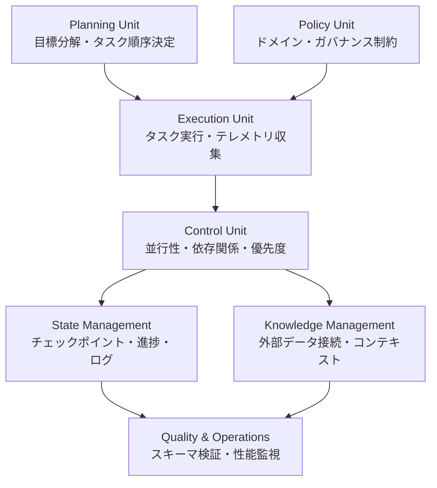
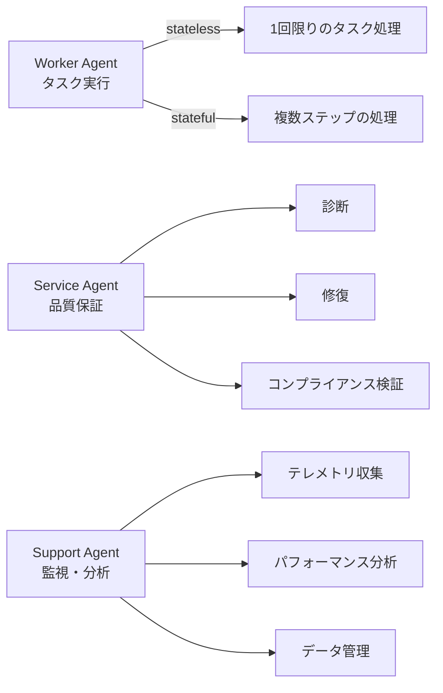

本記事は [arXiv:2601.13671 The Orchestration of Multi-Agent Systems](https://arxiv.org/abs/2601.13671) の解説記事です。

## 論文概要（Abstract）

Adimulam, Gupta, Kumar (2026) による本論文は、マルチエージェントシステムにおけるオーケストレーション層の統合フレームワークを提案している。著者らは、計画（Planning）、ポリシー管理（Policy Management）、状態追跡（Condition Tracking）、品質保証（Quality Assurance）を統合するオーケストレーション層を設計し、Model Context Protocol (MCP) とAgent-to-Agent (A2A) プロトコルという2つの通信プロトコルを通じてエージェント間の連携を実現する構成を示した。金融引受業務やソフトウェア開発などのエンタープライズ事例を通じて、実装レベルの設計原則を提示している。

この記事は [Zenn記事: Agents SDK SessionsとHandoffで設計するマルチエージェント会話管理](https://zenn.dev/0h_n0/articles/0a13a0901b1752) の深掘りです。

## 情報源

- **arXiv ID**: 2601.13671
- **URL**: [https://arxiv.org/abs/2601.13671](https://arxiv.org/abs/2601.13671)
- **著者**: Apoorva Adimulam, Rajesh Gupta, Sumit Kumar
- **発表年**: 2026（1月投稿）
- **分野**: cs.MA (Multiagent Systems), cs.AI (Artificial Intelligence)

## 背景と動機（Background & Motivation）

マルチエージェントシステム（MAS）の進化は、単一エージェント → 疎結合マルチエージェント → オーケストレーション型集団、という3段階で進行してきた。著者らは、現在のマルチエージェントシステムが直面する課題として、(1) エージェント間のタスク調整の複雑さ、(2) 状態管理とコンテキストの共有、(3) ガバナンスとコンプライアンスの確保、を挙げている。

Zenn記事で解説されているAgents SDKのSession/Handoff機構は、この論文が定義する「オーケストレーション層」の一部機能を実装したものと位置づけられる。SDKのSessionは「状態管理」に、Handoffは「タスク委譲」に、RunContextWrapperは「コンテキスト共有」にそれぞれ対応する。

## 主要な貢献（Key Contributions）

- **貢献1**: 計画・ポリシー・実行・制御・状態管理・知識管理・品質管理の7コンポーネントからなるオーケストレーション層の統合アーキテクチャを提案
- **貢献2**: MCP（Model Context Protocol）とA2A（Agent-to-Agent）プロトコルという2つの通信標準を体系的に整理し、エージェント-外部ツール間およびエージェント-エージェント間の通信を分離
- **貢献3**: 金融引受業務、ソフトウェア開発、カスタマーサービスにおけるエンタープライズ適用事例を通じて実装パターンを検証

## 技術的詳細（Technical Details）

### オーケストレーション層の7コンポーネント

著者らが提案するオーケストレーション層は、以下の7つのコンポーネントで構成される。



**Planning Unit** は目標分解エンジンとして機能し、高レベルの目標を実行可能なタスク列に変換する。著者らは「who performs which task, in what sequence, under what rules, and with what oversight（誰が、どの順序で、どのルールの下、どの監視体制で実行するか）」を決定すると説明している。

**State Management** は、チェックポイント、ワークフロー進捗、エージェント状態、活動ログを管理する。この機能は、Agents SDKのSessionバックエンド（SQLite/Redis/MongoDB）が担う役割と直接対応する。Sessionの`get_items()`と`add_items()`は、この論文のState Managementコンポーネントの取得・更新操作を実装したものである。

**Policy Unit** はドメイン固有のルールとガバナンス制約を定義する。Agents SDKでは、`Guardrail`（InputGuardrail/OutputGuardrail）がこの役割を部分的に担う。

### MCP（Model Context Protocol）の役割

MCPは、エージェントと外部ツール・データソース間の通信を標準化するクライアント-サーバーパターンである。著者らはMCPを「高レベルのオーケストレーション計画と低レベルのツール実行の間の運用ブリッジ（operational bridge）」と位置づけている。

MCPの主要特性を以下に整理する。

| 特性 | 説明 | Agents SDK対応 |
|------|------|---------------|
| スキーマ一貫性 | ツール呼び出しのスキーマを標準化 | `function_tool`デコレータ |
| アクセス制御 | ツールへのアクセス権限を管理 | Guardrail |
| 監査性 | ツール呼び出しをログ記録 | OpenTelemetryトレーシング |
| ステートフル交換 | コンテキスト継続性を維持 | Session |

著者らは、MCPの拡張として**ScaleMCP**（エージェント間でツールインベントリを動的に同期する機構）と**AgentMaster**（MCPとA2Aを統合するマルチモーダル協調機構）に言及している。

### A2A（Agent-to-Agent）プロトコルの設計

A2Aは、エージェント間のピアツーピア通信を標準化するプロトコルである。MaCPがエージェント-ツール間の垂直方向の通信を担うのに対し、A2Aはエージェント-エージェント間の水平方向の通信を担う。

著者らは、A2Aの通信パターンを3つの専門エージェント類型で説明している。

- **Worker Agent**: タスク実行を担当。サブタスクの委譲や中間結果の共有にA2Aを使用する。Agents SDKのHandoffにおける制御移譲に対応
- **Service Agent**: 品質保証・コンプライアンス・診断・修復を担当。Agents SDKのGuardrailの機能に対応
- **Support Agent**: 監視・分析・データ管理を担当。OpenTelemetryトレーシングの機能に対応

A2Aのセキュリティ面では、暗号署名とロールベースルーティングを組み込み、メッセージの完全性とポリシー準拠を保証している。重要な制約として、「A2Aはピア指向であるが、オーケストレーション層の監督下に置かれる」と著者らは述べている。つまり、エージェント間の自律的な通信であっても、グローバルなワークフローとの整合性が常に検証される。

### Handoffとの対応関係

Agents SDKのHandoffは、この論文のA2Aプロトコルの簡略化実装と理解できる。

$$
\text{Handoff}(A_i \to A_j) = \text{A2A}(\text{Worker}_i, \text{Worker}_j, \text{context}=\text{conversation\_history})
$$

ここで $A_i$ はHandoff元エージェント、$A_j$ はHandoff先エージェントを表す。Agents SDKの`input_filter`は、A2Aの「構造化ペイロード」に対するフィルタリング機能に対応し、`nest_handoff_history`は、A2Aの「メタデータ圧縮」に対応する。

### 状態管理の階層構造

著者らは状態管理を3つの階層で整理している。

1. **グローバルワークフロー状態**: 全エージェントにわたるタスク進捗とチェックポイント。Agents SDKではSessionバックエンド（SQLite/Redis等）が担う
2. **エージェントローカル状態**: 各エージェントの処理中間結果。SDKの`RunContextWrapper.context`に対応
3. **通信チャネル状態**: エージェント間メッセージの送受信状態。SDKのHandoff時の`HandoffInputData`（`input_history`、`pre_handoff_items`、`new_items`）に対応

この階層構造は、以下の数式で形式化できる。

$$
S_{\text{global}} = f(S_{\text{local}}^{(1)}, S_{\text{local}}^{(2)}, \ldots, S_{\text{local}}^{(n)}, S_{\text{channel}})
$$

ここで $S_{\text{global}}$ はグローバルワークフロー状態、$S_{\text{local}}^{(i)}$ はエージェント $i$ のローカル状態、$S_{\text{channel}}$ は通信チャネル状態、$f$ は集約関数を表す。

著者らは、状態の不整合を検出した場合に「Service Agentがチェックポイントの復元を行い、ワークフローの整合性を保持する」と述べている。Agents SDKの文脈では、Session内のアイテム不整合がRuntime例外として検出される仕組みに対応する。

### エージェントの分類体系

本論文では、エージェントを3つの類型に体系的に分類している。



Worker Agentのstateless/stateful区分は、Agents SDKにおけるAgent-as-Tool（stateless：タスク完了後に結果を返して終了）とHandoff（stateful：会話履歴を引き継いで処理を継続）の使い分けに直接対応する。

## 実装のポイント（Implementation）

### 並列実行モデル

著者らは、Worker Agentが並列に動作し、各エージェントが狭いサブドメインに特化する設計を推奨している。Control Unitが並行性を管理し、キーチェックポイントでの同期を実現する。

Agents SDKでこの設計を実現するには、`Agent.as_tool()`を使用して複数の専門エージェントを並列実行し、親エージェントが結果を集約するパターンが適している。Handoffでは制御が完全に移譲されるため、並列実行には向かない。

```python
from agents import Agent, function_tool, Runner

research_agent = Agent(name="research", instructions="情報検索を行う")
analysis_agent = Agent(name="analysis", instructions="データ分析を行う")

orchestrator = Agent(
    name="orchestrator",
    instructions="タスクを分解し、専門エージェントに委譲する",
    tools=[
        research_agent.as_tool(
            tool_name="search",
            tool_description="情報検索サブタスクを実行"
        ),
        analysis_agent.as_tool(
            tool_name="analyze",
            tool_description="データ分析サブタスクを実行"
        ),
    ],
)
```

### 品質検証パイプライン

Quality & Operationsコンポーネントは、「定義されたスキーマに対して集約出力を検証し、無効なデータがワークフローを通じて伝播するのを防ぐ」機能を提供する。著者らは、出力スキーマの検証がハンドオフ境界で行われることの重要性を強調しており、「あるエージェントの不正な出力が、下流の全エージェントを汚染する」リスクを指摘している。

Agents SDKでは、OutputGuardrailと`on_handoff`コールバックのPydanticバリデーション（`input_type`パラメータ）がこの役割を担う。

```python
from pydantic import BaseModel
from agents import Agent, handoff, RunContextWrapper

class HandoffPayload(BaseModel):
    reason: str
    priority: str
    customer_id: str

async def validate_handoff(
    ctx: RunContextWrapper, data: HandoffPayload
):
    if data.priority not in ("low", "medium", "high"):
        raise ValueError(f"Invalid priority: {data.priority}")

specialist = Agent(name="specialist", instructions="専門処理")

triage = Agent(
    name="triage",
    handoffs=[
        handoff(specialist, input_type=HandoffPayload, on_handoff=validate_handoff)
    ],
)
```

### ガバナンスとコンプライアンス

著者らは、エンタープライズ環境でのマルチエージェントシステムにおいて、ガバナンス層が不可欠であると主張している。具体的には以下の機構を挙げている。

- **内部監査**: 全エージェントの行動ログを記録し、事後検証を可能にする
- **イベントロギング**: MCP/A2Aの全通信を構造化ログとして記録する
- **最小権限ポリシー**: 各エージェントがアクセスできるツールとデータを制限する

Agents SDKでは、`Guardrail`でコンテンツフィルタリングを実装し、OpenTelemetryで通信ログを収集する構成がこの要件に対応する。

## 実験結果（Results）

著者らは、金融引受業務、ソフトウェア開発、カスタマーサービスの3つのエンタープライズ事例を通じてフレームワークの有効性を示している。

| 事例 | 改善指標 | 報告された値 |
|------|---------|------------|
| 保険引受 | 申請処理精度 | 95%以上（論文Section 5より） |
| 住宅ローン | 承認プロセス速度 | 20倍高速化（論文Section 5より） |
| 住宅ローン | 処理コスト | 80%削減（論文Section 5より） |
| ソフトウェア開発 | 開発時間・工数 | 50%以上削減（論文Section 5より） |
| カスタマーサービス | インシデント自動解決率 | 80%（論文Section 5より） |
| カスタマーサービス | 解決時間 | 60-90%短縮（論文Section 5より） |

これらの数値は著者らが引用した企業事例に基づくものであり、統制された実験環境での再現ではない点に注意が必要である。

## 実運用への応用（Practical Applications）

本論文のフレームワークは、Agents SDKを使ったマルチエージェントシステムの設計指針として活用できる。

- **Sessionバックエンド選定**: 本論文のState Managementコンポーネントの要件（チェックポイント、ワークフロー進捗、エージェント状態の管理）に基づき、Redis（低レイテンシ）、MongoDB（水平スケール）、PostgreSQL（トランザクション保証）を選定できる
- **Guardrail設計**: Policy UnitのガバナンスルールをAgents SDKのGuardrailとして実装し、金融・医療など規制産業での利用を想定した出力検証パイプラインを構築できる
- **可観測性**: 本論文のQuality & Operationsコンポーネントの要件に基づき、OpenTelemetryトレーシングと組み合わせたハンドオフ追跡・性能監視基盤を構築できる

## 関連研究（Related Work）

- **AutoGen** (Wu et al., 2023): 会話駆動型マルチエージェントフレームワーク。本論文のA2Aプロトコルと比較して、より柔軟なメッセージパッシングを提供するが、ガバナンス機構が限定的
- **CrewAI**: タスクベースのエージェント協調フレームワーク。本論文のPlanning Unitに相当する機能を提供するが、A2Aに相当するピアツーピア通信は限定的
- **LangGraph**: グラフベースのエージェントワークフロー定義。本論文のControl Unitに相当する並行性管理と状態遷移を提供する

## まとめと今後の展望

本論文は、マルチエージェントオーケストレーション層の包括的なフレームワークを提示し、MCP・A2Aプロトコルによる通信の標準化、7コンポーネントによる体系的な設計、エンタープライズ事例による検証を行った。Agents SDKのSession/Handoff/Guardrailは、本論文が定義するState Management/A2A/Policy Unitの実装例として位置づけられ、本番運用における設計判断の指針として本論文のフレームワークを活用できる。

## 参考文献

- **arXiv**: [https://arxiv.org/abs/2601.13671](https://arxiv.org/abs/2601.13671)
- **Related Zenn article**: [https://zenn.dev/0h_n0/articles/0a13a0901b1752](https://zenn.dev/0h_n0/articles/0a13a0901b1752)
