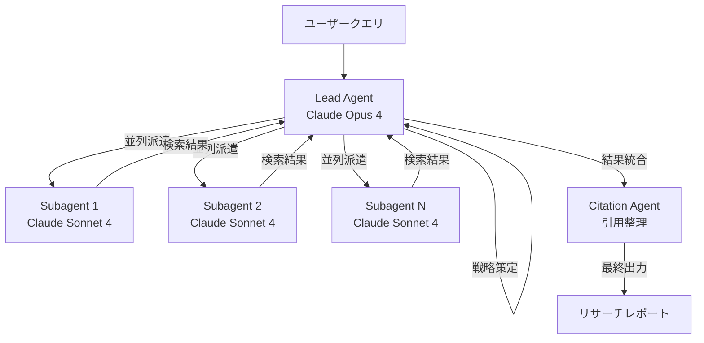

本記事は [Anthropic Engineering: How we built our multi-agent research system](https://www.anthropic.com/engineering/multi-agent-research-system) の解説記事です。

## ブログ概要（Summary）

Anthropicは2025年6月、自社のリサーチ機能を支えるマルチエージェントシステムの設計と開発過程を公開した。このブログ記事では、Lead Agent（オーケストレーター）が複数のSubagent（ワーカー）を並列に派遣し、Citation Agent（後処理）が引用を整理する3層構成を採用していること、内部評価でClaude Opus 4単体と比較して90.2%の性能向上を達成したこと、そしてトークン使用量が性能分散の80%を説明するという知見を報告している。エージェントの「ステートフルでエラーが累積する」性質への対処法や、20クエリの少数サンプルテストによる高速反復手法など、本番運用の実践知を含む内容である。

この記事は [Zenn記事: Agents SDK SessionsとHandoffで設計するマルチエージェント会話管理](https://zenn.dev/0h_n0/articles/0a13a0901b1752) の深掘りです。

## 情報源

- **種別**: 企業テックブログ（Anthropic Engineering）
- **URL**: [https://www.anthropic.com/engineering/multi-agent-research-system](https://www.anthropic.com/engineering/multi-agent-research-system)
- **組織**: Anthropic
- **発表日**: 2025年6月13日

## 技術的背景（Technical Background）

本番環境のAIエージェントは、数百ターンに及ぶ長い会話を処理する必要がある。単一エージェントでは、コンテキストウィンドウの制約により、大量の情報を同時に処理することが困難になる。Anthropicはこの課題に対して、複数のサブエージェントがそれぞれ独立したコンテキストウィンドウで並列に動作するOrchestrator-Worker構成を採用した。

この設計思想は、Zenn記事で解説されているAgents SDKのHandoffパターンと密接に関連する。ただし、AnthropicのシステムはHandoff（制御の完全移譲）ではなく、Agent-as-Tool（親が制御を保持し、子の結果を集約）パターンに近い。SDKの用語では、`Agent.as_tool()`を使って専門エージェントをツールとして呼び出し、Lead Agentが結果を統合する構成に対応する。

## 実装アーキテクチャ（Architecture）

### 3層エージェント構成

Anthropicのリサーチシステムは、以下の3つのエージェント層で構成される。



**Lead Agent（オーケストレーター）**: Claude Opus 4をバックエンドモデルとして使用。ユーザーのクエリを分析し、調査戦略を策定し、サブエージェントを派遣する。Extended Thinkingモードにより、複雑なクエリの分解と戦略決定を行う。

**Subagent（ワーカー）**: Claude Sonnet 4をバックエンドモデルとして使用。各サブエージェントは独立したコンテキストウィンドウで動作し、情報の検索と収集を並列に実行する。Anthropicの記事では、サブエージェントが「並列に独自のコンテキストウィンドウで動作し、異なる側面を同時に探索する」ことで圧縮を促進すると説明されている。

**Citation Agent（後処理）**: 収集された情報の引用元を検証し、適切なソース帰属を行う。

### コンテキスト管理戦略

Anthropicのブログ記事では、本番エージェントのコンテキスト管理について重要な実践知が共有されている。

**コンテキストの圧縮**: サブエージェントによる並列処理は、暗黙的にコンテキスト圧縮を実現する。Lead Agentは各サブエージェントの要約された結果のみを受け取るため、全情報を1つのコンテキストに収める必要がない。

**完了フェーズの要約**: エージェントが作業フェーズを完了した際に、重要な情報を外部メモリに保存してから次のタスクに移行するパターンが述べられている。

**コンテキスト限界時のサブエージェント派遣**: コンテキストの限界に近づいた場合、新しいサブエージェントをクリーンなコンテキストで起動し、ハンドオフを通じて継続性を維持するパターンが説明されている。

この戦略は、Agents SDKのSessionで提供される以下の機能と対応する。

| Anthropicの戦略 | Agents SDK対応機能 |
|----------------|-------------------|
| サブエージェントによる圧縮 | `Agent.as_tool()` |
| 完了フェーズの要約 | `OpenAIResponsesCompactionSession` |
| コンテキスト限界時の派遣 | `SessionSettings(limit=N)` |
| 外部メモリ保存 | `RunContextWrapper` |

### 性能評価とスケーリング特性

Anthropicのブログ記事では、マルチエージェントシステムの性能評価に関する重要な定量的知見が報告されている。

**90.2%の性能向上**: 内部リサーチ評価において、Claude Opus 4をLead Agent、Claude Sonnet 4をSubagentとするマルチエージェント構成が、Claude Opus 4単体と比較して90.2%の性能向上を達成したと報告されている（ブログ記事の評価セクションより）。

**トークン使用量と性能の関係**: 著者らは、トークン使用量が「性能分散の80%を説明する」と報告している。さらに、3つの要因が全体の性能分散の95%を説明するとされている。この知見は、マルチエージェントシステムのコスト最適化において、単純にトークン予算を増やすことが性能向上に直結する可能性を示唆している。

**並列ツール呼び出しによる高速化**: 並列ツール呼び出しの活用により、リサーチ時間を最大90%短縮できたと報告されている。

$$
T_{\text{parallel}} \approx \frac{T_{\text{sequential}}}{N_{\text{subagents}}} + T_{\text{overhead}}
$$

ここで $T_{\text{parallel}}$ は並列実行時間、$T_{\text{sequential}}$ は逐次実行時間、$N_{\text{subagents}}$ はサブエージェント数、$T_{\text{overhead}}$ はオーケストレーションのオーバーヘッドを表す。

### スケーリングルール

Anthropicのシステムでは、クエリの複雑さに応じてサブエージェント数を動的に調整する明示的なスケーリングルールがプロンプトに組み込まれている。この設計により、単純なクエリでは少数のサブエージェントで高速に応答し、複雑なクエリでは多数のサブエージェントで網羅的に調査するという適応的な動作を実現している。

Agents SDKでは、`Runner.run()`のinstructionsを動的関数として定義し、`RunContextWrapper`からクエリの複雑さを判定して、`Agent.as_tool()`で派遣するサブエージェント数を制御する実装が可能である。

## Production Deployment Guide

### AWS実装パターン（コスト最適化重視）

Anthropicのマルチエージェントリサーチシステムに類似する構成をAWSにデプロイする場合の推奨構成を示す。

| 規模 | 月間リクエスト | 推奨構成 | 月額コスト | 主要サービス |
|------|--------------|---------|-----------|------------|
| **Small** | ~3,000 (100/日) | Serverless | $100-250 | Lambda + Bedrock + DynamoDB |
| **Medium** | ~30,000 (1,000/日) | Hybrid | $500-1,200 | ECS Fargate + Bedrock + ElastiCache |
| **Large** | 300,000+ (10,000/日) | Container | $3,000-8,000 | EKS + Karpenter + EC2 Spot |

**コスト試算の注意事項**: 上記は2026年8月時点のAWS ap-northeast-1リージョン料金に基づく概算値です。マルチエージェント構成ではサブエージェント数に比例してBedrock APIコストが増加するため、スケーリングルールの設計がコスト制御の鍵となります。最新料金は [AWS料金計算ツール](https://calculator.aws/) で確認してください。

### Terraformインフラコード

```hcl
resource "aws_lambda_function" "lead_agent" {
  filename      = "lead_agent.zip"
  function_name = "multi-agent-lead"
  role          = aws_iam_role.agent_role.arn
  handler       = "index.handler"
  runtime       = "python3.12"
  timeout       = 300
  memory_size   = 2048

  environment {
    variables = {
      LEAD_MODEL_ID     = "anthropic.claude-opus-4-20250514-v1:0"
      SUBAGENT_MODEL_ID = "anthropic.claude-sonnet-4-20250514-v1:0"
      DYNAMODB_TABLE    = aws_dynamodb_table.sessions.name
      MAX_SUBAGENTS     = "5"
    }
  }
}

resource "aws_dynamodb_table" "sessions" {
  name         = "research-agent-sessions"
  billing_mode = "PAY_PER_REQUEST"
  hash_key     = "session_id"

  attribute {
    name = "session_id"
    type = "S"
  }

  ttl {
    attribute_name = "expire_at"
    enabled        = true
  }
}
```

### コスト最適化チェックリスト

- [ ] Lead Agent: Opus 4、Subagent: Sonnet 4/Haiku でモデル使い分け
- [ ] Prompt Caching有効化（Lead Agentのシステムプロンプト固定部分）
- [ ] サブエージェント数の上限設定（MAX_SUBAGENTS環境変数）
- [ ] DynamoDB TTLで古いセッション自動削除
- [ ] CloudWatch アラームでBedrock APIコスト異常検知
- [ ] AWS Budgets月額予算設定（80%で警告）

## パフォーマンス最適化（Performance）

Anthropicのブログ記事では、以下のパフォーマンス最適化手法が言及されている。

**並列ツール呼び出し**: 複数のWeb検索やデータ取得を並列に実行し、リサーチ時間を大幅に短縮する。Agents SDKではparallel function callingが自動的に活用される。

**20クエリ少数サンプルテスト**: 大規模な評価セットを用意する前に、20クエリの少数サンプルで高速に反復開発を行う手法が述べられている。LLM-as-Judgeによる自動評価とルーブリック（正確性、引用、完全性）を組み合わせることで、開発速度と評価品質のバランスを取っている。

**耐久実行パターン**: エージェントは「ステートフルでエラーが累積する」ため、単純なリトライではなく、チェックポイントベースの回復パターンが必要であるとAnthropicは指摘している。

## 運用での学び（Production Lessons）

Anthropicのブログ記事から得られる本番運用の教訓を以下に整理する。

1. **エージェントはステートフル**: 従来のステートレスなAPI呼び出しとは異なり、エージェントは内部状態を持ち、エラーが累積する。単純なリトライでは状態の不整合が解消されないため、チェックポイントからの再開が必要
2. **評価は初期段階から**: 20クエリの少数サンプルでも、プロンプト変更の影響を定量的に評価できる。大規模なベンチマーク構築を待つ必要はない
3. **トークン予算がスケーリングの鍵**: 性能分散の80%がトークン使用量で説明されるという知見は、コスト最適化と性能のトレードオフを定量的に管理する根拠となる
4. **人間によるテストが不可欠**: LLM-as-Judgeの自動評価だけでは捕捉できないエッジケースや行動バイアスが存在する

## 学術研究との関連（Academic Connection）

Anthropicのシステムは、以下の学術研究と関連する。

- **BrowseComp** (Anthropic, 2025): Webブラウジング能力の評価ベンチマーク。リサーチシステムのサブエージェントの検索性能評価に使用されている
- **Orchestrator-Worker** パターン: マルチエージェント協調の標準的なパターン。中央のオーケストレーターがタスクを分解し、ワーカーエージェントに配分する
- **Context Window Management**: 長いコンテキストにおけるLLMの性能低下（Lost in the Middle問題）への対処として、サブエージェントによるコンテキスト分散が有効

## まとめと実践への示唆

Anthropicのマルチエージェントリサーチシステムは、Orchestrator-Worker構成による本番運用の実践例として貴重な知見を提供している。特に、サブエージェントによるコンテキスト圧縮、トークン使用量と性能の定量的関係（分散の80%を説明）、少数サンプルによる高速評価手法は、Agents SDKを用いたマルチエージェントシステムの設計に直接応用できる。Zenn記事で解説されているAgent-as-Tool vs Handoffの選択において、本ブログ記事のOrchestrator-Worker構成はAgent-as-Toolパターンの代表的な成功事例である。

## 参考文献

- **Blog URL**: [https://www.anthropic.com/engineering/multi-agent-research-system](https://www.anthropic.com/engineering/multi-agent-research-system)
- **Claude Cookbook**: [https://github.com/anthropics/anthropic-cookbook](https://github.com/anthropics/anthropic-cookbook)
- **Related Zenn article**: [https://zenn.dev/0h_n0/articles/0a13a0901b1752](https://zenn.dev/0h_n0/articles/0a13a0901b1752)
