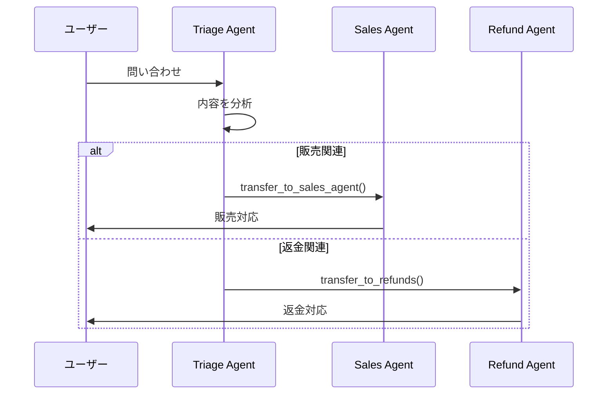

本記事は [OpenAI Cookbook: Orchestrating Agents](https://developers.openai.com/cookbook/examples/orchestrating_agents) の解説記事です。

## ブログ概要（Summary）

OpenAI Cookbookの「Orchestrating Agents」は、マルチエージェントシステムにおける2つの中核概念 — **Routines（ルーティン）**と**Handoffs（ハンドオフ）** — を提示し、エージェント間の制御移譲パターンを最小限のコードで実装する手法を解説している。このCookbook記事は、後にOpenAI Agents SDKとして正式リリースされるフレームワークの設計思想の原点であり、Swarmリファレンス実装を通じて「関数の戻り値の型によるエージェント切り替え」という手法を示した。Agents SDKの`handoff()`関数やSessionによる会話管理は、この記事で提示されたパターンを発展させたものである。

この記事は [Zenn記事: Agents SDK SessionsとHandoffで設計するマルチエージェント会話管理](https://zenn.dev/0h_n0/articles/0a13a0901b1752) の深掘りです。

## 情報源

- **種別**: 企業テックブログ（OpenAI Cookbook）
- **URL**: [https://developers.openai.com/cookbook/examples/orchestrating_agents](https://developers.openai.com/cookbook/examples/orchestrating_agents)
- **組織**: OpenAI
- **発表日**: 2024年（Swarmフレームワーク公開時）

## 技術的背景（Technical Background）

マルチエージェントシステムの構築において、従来のアプローチでは単一のLLMにすべてのタスクを処理させるか、複雑なオーケストレーション基盤を構築するかの二択を迫られていた。単一エージェントではプロンプトが肥大化し、ツール数が増加するほど性能が低下する。一方、オーケストレーション基盤の構築は開発コストが高く、柔軟性に欠ける場合がある。

OpenAIは、この問題に対して「Routines（自然言語で記述された手順＋ツールの組み合わせ）」と「Handoffs（エージェント間の会話転送）」という2つのプリミティブに分解するアプローチを提案した。このアプローチの学術的背景として、LLMの関数呼び出し（function calling）能力を活用し、エージェントの切り替え自体をツール呼び出しとして表現するという着想がある。

Zenn記事で解説されているAgents SDKの`handoff()`関数は、このCookbook記事のパターンを型安全かつ本番運用可能な形に昇華させたものである。

## 実装アーキテクチャ（Architecture）

### Routinesの定義と設計

Cookbookでは、Routineを「自然言語による指示リスト（システムプロンプト）と、それを完遂するために必要なツール群の組み合わせ」と定義している。従来のステートマシンや決定木と異なり、LLMが自然言語の指示を柔軟に解釈するため、エッジケースでの行き詰まりが発生しにくいという特性を持つ。

```python
from pydantic import BaseModel

class Agent(BaseModel):
    """エージェントの基本構造
    
    name: エージェント名（ハンドオフ時の識別に使用）
    model: 使用するLLMモデルID
    instructions: 自然言語による行動指示（Routine）
    tools: このエージェントが使用可能なツール関数リスト
    """
    name: str = "Agent"
    model: str = "gpt-4o-mini"
    instructions: str = "You are a helpful Agent"
    tools: list = []
```

この`Agent`クラスはPydanticの`BaseModel`を継承しており、シリアライズ・バリデーションが容易である。注目すべきは、`instructions`フィールドが静的な文字列であることだ。Agents SDKでは、これが`Callable`も受け付けるように拡張され、`RunContextWrapper`を引数とする動的な指示生成が可能になっている。

### Handoffメカニズムの実装

Handoffの実装は、記事中でも強調されているように、「関数の戻り値がAgent型であるかどうかをチェックする」という手法に集約される。

```python
def transfer_to_refunds():
    """返金処理担当エージェントに転送する"""
    return refund_agent

def transfer_to_sales_agent():
    """販売担当エージェントに転送する"""
    return sales_agent
```

これらの関数はLLMのtool callとして呼び出される。実行エンジン側では、ツール呼び出しの結果がAgent型かどうかで分岐する。

```python
def execute_tool_call(tool_call, tools_map):
    name = tool_call.function.name
    args = json.loads(tool_call.function.arguments)
    result = tools_map[name](**args)
    return result

# run_full_turn内の処理
if type(result) is Agent:
    current_agent = result
    result = f"Transferred to {current_agent.name}. Adopt persona immediately."
```

この設計には以下の特徴がある。

1. **型による制御フロー**: 戻り値の型（`str` vs `Agent`）でハンドオフの発生を判定する。明示的なフラグやステートマシンが不要
2. **会話履歴の完全引き継ぎ**: ハンドオフ時にメッセージ履歴はそのまま保持され、新しいエージェントのシステムプロンプトとツールのみが差し替えられる
3. **LLMによる自律的判断**: いつハンドオフすべきかの判断はLLM自身が行う。ルールベースのルーティングでは捕捉できない曖昧な要求にも対応可能



### 実行ループ（run_full_turn）の構造

Cookbook記事の核心は`run_full_turn()`関数にある。この関数は3つのフェーズで構成される。

**フェーズ1: モデル呼び出し**

現在のエージェントの`instructions`をシステムメッセージとして、会話履歴と利用可能なツールをLLMに送信する。

**フェーズ2: ツール呼び出し処理**

LLMのレスポンスにtool_callsが含まれる場合、対応するPython関数を`tools_map`から検索して実行する。戻り値がAgent型であれば現在のエージェントを切り替える。

**フェーズ3: 応答集約**

tool_callsが空になるまでフェーズ1-2を繰り返し、最終的な`Response`オブジェクト（更新後のエージェントと新規メッセージのリスト）を返却する。

```python
class Response(BaseModel):
    """実行結果を格納するレスポンスオブジェクト
    
    agent: ハンドオフが発生した場合は新しいエージェント、
           発生しなかった場合はNone
    messages: このターンで生成されたメッセージのリスト
    """
    agent: Optional[Agent]
    messages: list
```

このループ構造は、Agents SDKの`Runner.run()`の前身にあたる。SDKでは、Session統合、Guardrail検証、ストリーミング対応が追加されているが、基本的な実行フローはこのCookbook記事のパターンを踏襲している。

### Triageパターン — 階層型マルチエージェント

Cookbookでは、実践的な例としてカスタマーサポートのTriageパターンを示している。

- **Triage Agent**: ユーザーの問い合わせ内容を判断し、適切な専門エージェントに転送する
- **Sales Agent**: 商品照会や注文処理を担当。注文実行ツールを持つ
- **Issues and Repairs Agent**: 返金処理や技術的な問題解決を担当
- **Human Escalation**: 上記で対応できない場合は人間のオペレーターに転送

各エージェントは自身の専門領域に限定されたツールセットを持ち、`transfer_to_*`関数を通じて他のエージェントへの転送が可能である。この設計により、単一の巨大なエージェントを構築する場合と比較して、各エージェントのプロンプトとツールセットが小さく保たれ、精度が向上するとOpenAIは主張している。

## Production Deployment Guide

### AWS実装パターン（コスト最適化重視）

Cookbook記事のRoutines & Handoffsパターンをプロダクション環境にデプロイする場合のAWS構成を示す。

| 規模 | 月間リクエスト | 推奨構成 | 月額コスト | 主要サービス |
|------|--------------|---------|-----------|------------|
| **Small** | ~3,000 (100/日) | Serverless | $50-150 | Lambda + Bedrock + DynamoDB |
| **Medium** | ~30,000 (1,000/日) | Hybrid | $300-800 | Lambda + ECS Fargate + ElastiCache |
| **Large** | 300,000+ (10,000/日) | Container | $2,000-5,000 | EKS + Karpenter + EC2 Spot |

**Small構成の詳細** (月額$50-150):
- **Lambda**: 1GB RAM, 60秒タイムアウト ($20/月) — エージェント実行ループを処理
- **Bedrock**: Claude 3.5 Haiku, Prompt Caching有効 ($80/月) — Routineのシステムプロンプトをキャッシュ
- **DynamoDB**: On-Demand ($10/月) — 会話履歴（Session相当）を永続化
- **API Gateway**: REST API ($5/月)

**コスト削減テクニック**:
- Prompt Cachingで各エージェントのinstructionsをキャッシュし30-90%削減
- Bedrock Batch APIで非リアルタイム処理を50%削減
- Spot Instances使用で最大90%削減（EKS + Karpenter）

**コスト試算の注意事項**: 上記は2026年8月時点のAWS ap-northeast-1リージョン料金に基づく概算値です。最新料金は [AWS料金計算ツール](https://calculator.aws/) で確認してください。

### Terraformインフラコード

**Small構成 (Serverless): Lambda + Bedrock + DynamoDB**

```hcl
module "vpc" {
  source  = "terraform-aws-modules/vpc/aws"
  version = "~> 5.0"

  name = "agent-orchestration-vpc"
  cidr = "10.0.0.0/16"
  azs  = ["ap-northeast-1a", "ap-northeast-1c"]
  private_subnets = ["10.0.1.0/24", "10.0.2.0/24"]

  enable_nat_gateway   = false
  enable_dns_hostnames = true
}

resource "aws_iam_role" "lambda_agent" {
  name = "lambda-agent-orchestration-role"

  assume_role_policy = jsonencode({
    Version = "2012-10-17"
    Statement = [{
      Action = "sts:AssumeRole"
      Effect = "Allow"
      Principal = { Service = "lambda.amazonaws.com" }
    }]
  })
}

resource "aws_iam_role_policy" "bedrock_invoke" {
  role = aws_iam_role.lambda_agent.id
  policy = jsonencode({
    Version = "2012-10-17"
    Statement = [{
      Effect   = "Allow"
      Action   = ["bedrock:InvokeModel", "bedrock:InvokeModelWithResponseStream"]
      Resource = "arn:aws:bedrock:ap-northeast-1::foundation-model/anthropic.claude-3-5-haiku*"
    }]
  })
}

resource "aws_lambda_function" "agent_handler" {
  filename      = "lambda.zip"
  function_name = "agent-orchestration-handler"
  role          = aws_iam_role.lambda_agent.arn
  handler       = "index.handler"
  runtime       = "python3.12"
  timeout       = 60
  memory_size   = 1024

  environment {
    variables = {
      BEDROCK_MODEL_ID    = "anthropic.claude-3-5-haiku-20241022-v1:0"
      DYNAMODB_TABLE      = aws_dynamodb_table.sessions.name
      ENABLE_PROMPT_CACHE = "true"
    }
  }
}

resource "aws_dynamodb_table" "sessions" {
  name         = "agent-conversation-sessions"
  billing_mode = "PAY_PER_REQUEST"
  hash_key     = "conversation_id"

  attribute {
    name = "conversation_id"
    type = "S"
  }

  ttl {
    attribute_name = "expire_at"
    enabled        = true
  }
}
```

### セキュリティベストプラクティス

- IAMロール: 最小権限の原則（Bedrockモデル指定、DynamoDBテーブル指定）
- シークレット管理: AWS Secrets Manager使用
- 暗号化: DynamoDB/S3全てKMS暗号化
- CloudTrail: 全リージョンで有効化

### 運用・監視設定

```python
import boto3

cloudwatch = boto3.client('cloudwatch')

cloudwatch.put_metric_alarm(
    AlarmName='agent-handoff-latency',
    ComparisonOperator='GreaterThanThreshold',
    EvaluationPeriods=2,
    MetricName='Duration',
    Namespace='AWS/Lambda',
    Period=300,
    Statistic='Average',
    Threshold=30000,
    AlarmDescription='エージェントハンドオフ処理のレイテンシ異常'
)
```

### コスト最適化チェックリスト

- [ ] ~100 req/日 → Lambda + Bedrock (Serverless) - $50-150/月
- [ ] ~1000 req/日 → ECS Fargate + Bedrock (Hybrid) - $300-800/月
- [ ] 10000+ req/日 → EKS + Spot Instances (Container) - $2,000-5,000/月
- [ ] Prompt Caching有効化でシステムプロンプトのコスト30-90%削減
- [ ] Bedrock Batch API使用で非リアルタイム処理50%削減
- [ ] DynamoDB TTL設定で古いセッション自動削除
- [ ] Lambda Power Tuningでメモリサイズ最適化
- [ ] CloudWatch アラームでコスト異常即時検知
- [ ] AWS Budgets月額予算設定（80%で警告）
- [ ] タグ戦略で環境別コスト可視化

## パフォーマンス最適化（Performance）

Cookbook記事の実行ループはシンプルだが、本番環境ではいくつかのボトルネックが発生し得る。

**レイテンシ要因**:
- tool_callsの逐次実行: 1ターンで複数ツールが呼ばれる場合、逐次処理がレイテンシを増大させる
- ハンドオフ時のシステムプロンプト差し替え: エージェント切り替えごとにLLMへの完全なリクエストが発生する

**最適化手法**:
- 並列ツール呼び出し（parallel function calling）の活用。OpenAI APIはtool_callsを複数同時に返せるため、独立したツール呼び出しを並列処理可能
- Prompt Cachingの活用。各エージェントのシステムプロンプトが固定であれば、キャッシュにより入力トークンコストと初回レイテンシを削減

Agents SDKでは、`Runner.run()`内部でこれらの最適化が自動的に適用される。さらに、Sessionの`limit`パラメータで取得する履歴件数を制限することで、長時間会話でのトークン消費を制御できる。

## 運用での学び（Production Lessons）

Cookbook記事では、Swarmフレームワークを「educational purpose only, not intended for production」と明記している。この注意書きの背景には、本番運用で必要となる以下の要素が実装されていないことがある。

1. **エラーハンドリング**: ツール呼び出しが失敗した場合のリトライやフォールバック機構がない。本番では指数バックオフ付きリトライとcircuit breakerパターンが必要
2. **会話永続化**: メモリ上の履歴はプロセス終了で消失する。Agents SDKのSession機構（SQLite/Redis/MongoDB）はこの課題を解決した
3. **Guardrails**: 入出力の安全性検証機構がない。Agents SDKでは`InputGuardrail`と`OutputGuardrail`が追加された
4. **可観測性**: ツール呼び出しやハンドオフの追跡機構がない。Agents SDKではOpenTelemetry統合による自動トレーシングが提供される

## 学術研究との関連（Academic Connection）

Cookbook記事のHandoffパターンは、マルチエージェントシステム研究における**委譲（delegation）**の概念を実装したものである。

- **AutoGen** (Wu et al., 2023): Microsoftが提案した会話駆動型マルチエージェントフレームワーク。エージェント間のメッセージパッシングによる協調を重視するが、明示的なHandoff機構は持たない
- **MetaGPT** (Hong et al., 2023): SOP（Standard Operating Procedure）をエージェントの役割定義に組み込むアプローチ。Cookbookの「Routine」概念と共通点がある
- **CrewAI**: タスクの順序実行と役割分担を重視するフレームワーク。Handoffとは異なり、事前定義されたワークフローに従って実行される

Cookbookのアプローチの独自性は、Handoffをツール呼び出しの一種として表現し、LLMの判断に委ねる点にある。これにより、静的なワークフロー定義では対応できない動的なルーティングが可能になっている。

## まとめと実践への示唆

OpenAI Cookbookの「Orchestrating Agents」は、マルチエージェント会話管理の基本パターンを確立した文献である。Routines（自然言語指示＋ツール）とHandoffs（Agent型の戻り値による制御移譲）という2つのプリミティブは、Agents SDKの設計基盤となっている。Zenn記事で解説した`handoff()`関数、`input_filter`、`nest_handoff_history`は、このCookbook記事で示された基本パターンの上に、本番運用に必要な会話履歴制御とトークンコスト最適化を追加したものである。

## 参考文献

- **Blog URL**: [https://developers.openai.com/cookbook/examples/orchestrating_agents](https://developers.openai.com/cookbook/examples/orchestrating_agents)
- **Swarm Repository**: [https://github.com/openai/swarm](https://github.com/openai/swarm)
- **OpenAI Agents SDK**: [https://github.com/openai/openai-agents-python](https://github.com/openai/openai-agents-python)
- **Related Zenn article**: [https://zenn.dev/0h_n0/articles/0a13a0901b1752](https://zenn.dev/0h_n0/articles/0a13a0901b1752)
