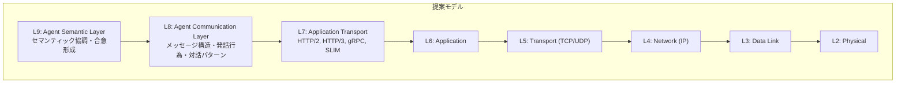

本記事は [https://arxiv.org/abs/2511.19699](https://arxiv.org/abs/2511.19699) の解説記事です。

## 論文概要（Abstract）

著者らは、LLMのコンテキストウィンドウには根本的な制約があり、単一エージェントの能力拡張ではなく分散協調によってスケーリングを実現すべきだと主張している。本論文では、従来のネットワーク7層モデルの上位に2つの新しいプロトコル層を提案する。Layer 8（Agent Communication Layer）はメッセージ構造・発話行為・対話パターンを標準化し、MCP・A2Aなどの既存プロトコルを統合する。Layer 9（Agent Semantic Layer）はセマンティックコンテキストの探索・ネゴシエーション・検証・合意形成の仕組みを形式化し、エージェント間の「意味レベル」での通信を可能にする。

この記事は [Zenn記事: Semantic Kernel × A2AプロトコルでAIエージェントの異種連携を実装する](https://zenn.dev/0h_n0/articles/4a7afb7286ce41) の深掘りです。

## 情報源

- **arXiv ID**: 2511.19699
- **URL**: [https://arxiv.org/abs/2511.19699](https://arxiv.org/abs/2511.19699)
- **著者**: Charles Fleming, Luca Muscariello, Vijoy Pandey, Ramana Kompella（Cisco Research）
- **発表年**: 2025（v3: 2026年1月20日）
- **分野**: cs.NI, cs.AI, cs.MA

## 背景と動機（Background & Motivation）

著者らは、現在のネットワークスタック（OSI・TCP/IP）はプロセス間の「データ配送」を目的として設計されており、自律的なインテリジェントエンティティ間の「セマンティック協調」には対応していないと指摘している。この設計上のギャップが、アドホックでアプリケーション固有のプロトコルの乱立を招いているという。

具体的な問題として、著者らは2つの障害モードを挙げている。第一に「構文はあるがセマンティックコンテキストがない」問題である。A2AやMCPはメッセージ構造を標準化するが、用語の共通理解を強制する仕組みがない。第二に「セマンティックの過小指定」の問題がある。「Book a ticket to New York」というリクエストは構文的には正しいが、空港（JFK/LGA/EWR）、日付、座席クラスなどのコンテキストが欠落しており、受信エージェントは処理できない。

著者らはHTTPの歴史的進化との類似を指摘している。TCP/IPは当初「ドキュメントを取得する」プリミティブを持たなかったが、HTTPがアドホックな解決策として登場し、状態管理やキャッシュを蓄積しながらトランスポートプロトコルへと進化した。著者らは「エージェントのインターネットについて、まさに同じ転換点に立っている」と主張している。

## 主要な貢献（Key Contributions）

- **Layer 8（Agent Communication Layer）の形式化**: メッセージ構造（エンベロープ）、発話行為（Performative）、対話パターン（Request-Reply、Pub-Sub、Aggregation、Collaboration Groups）を標準化し、A2A・MCP・SLIMの機能を統合するフレームワークを提案
- **Layer 9（Agent Semantic Layer）の新規提案**: セマンティックハンドシェイク（SL-HELLO/SL-SELECT/SL-LOCK）による共有コンテキストの探索・ネゴシエーション、セマンティックグラウンディング、セマンティック検証・曖昧性解消、合意形成プリミティブの4フェーズを形式化
- **セキュリティ脅威モデルの分析**: Semantic Injection、Context Poisoning、Semantic DoS、Semantic Downgrade Attackなど、L9固有の攻撃ベクトルを特定し、Semantic Firewallやauthenticated contextsによる防御策を提示
- **実装戦略の提示**: 既存プロトコル（A2A、MCP、SLIM）の拡張による段階的実装パスを提案

## 技術的詳細（Technical Details）

### プロトコル層構造

著者らが提案するアーキテクチャは、従来のOSI 7層モデルを再構成し、その上位に2つの新しい層を追加する。以下のMermaid図は、従来モデルと提案モデルの対応関係を示す。



論文のFigure 2では、既存プロトコルの位置付けが示されている。A2AとMCPは主にL8に位置し、HTTP/gRPC/SLIMはL7に位置する。L9はREP（Ripple Effect Protocol）が部分的にカバーするのみで、セマンティックネゴシエーションの仕組みは存在しないことが示されている。

### Layer 8: Agent Communication Layer

L8は「通信のhow」を担当し、3つのコアコンポーネントから構成される。

**メッセージ構造（エンベロープ）**: 送信者・受信者ID、メッセージID、performative（意図）、コンテンツのフィールドを持つ構造化メッセージを定義する。著者らはA2A/1.0形式のJSON例を示している。

```json
{
  "protocol": "A2A/1.0",
  "performative": "REQUEST",
  "sender_id": "agent-travel-7",
  "receiver_id": "agent-booking-4",
  "content": { "task": "book_flight", "destination": "New York" }
}
```

著者らはこのメッセージが「構文的には完璧だが、セマンティック的に不完全」だと指摘しており、L9の必要性を動機付けている。

**発話行為（Performatives）**: Searle（1969）の言語行為論に基づき、通信意図を形式化する。Transactional（REQUEST, AGREE, REFUSE, INFORM）、Negotiation（PROPOSE, ACCEPT, REJECT, COUNTER_PROPOSE）、Information（QUERY, SUBSCRIBE, PUBLISH）の3カテゴリに分類される。performativeはメッセージ内容から独立しており、セマンティック処理の前に意図を認識できる。

**対話パターン**: Request-Reply（1:1）、Publish-Subscribe（1:N）、Aggregation（N:1、リーダーが集団からデータ収集）、Collaboration Groups（N:N、暗号化された分散協調）の4パターンを定義する。A2AはRequest-Replyを実装済みであり、SLIMがPub-SubやストリーミングRPCに対応していると著者らは述べている。

### Layer 9: Agent Semantic Layer

L9は「通信のwhat（意味）」を担当し、4つのフェーズで動作する。これが本論文の主たる新規貢献である。

**Phase 1: コンテキスト探索・ネゴシエーション（セマンティックハンドシェイク）**

著者らはTLSハンドシェイクに類似した3ステップのプロトコルを提案している。

1. **SL-HELLO**: エージェントAが対応するShared Context（バージョン付きURN、例: `urn:contexts:travel:v2.1`）を広告する
2. **SL-SELECT**: エージェントBが共通のShared Contextを提案し、権威あるスキーマのURLを提示する
3. **SL-LOCK**: エージェントAがコンテキストのロックを確認し、以降のL8メッセージはこのコンテキストに対して検証される

ここでShared Contextとは、JSON Schema、RDF/OWL、Protocol Buffersなどで定義される、特定ドメインの概念・エンティティ・タスク・パラメータの形式的・機械可読な定義である。

**Phase 2: セマンティックグラウンディング**

ロックされたコンテキストに対して、エージェント内部のデータ（テキスト、数値、ベクトル）をShared Contextの形式定義にバインドする処理である。著者らは、L9が「セマンティック空間に限定されず、潜在空間やその他の圧縮空間でも動作可能」であると述べている。これにより、「エンベディングからセマンティック状態への変換、さらにエンベディングへの再変換」というコストの高い処理を回避できる可能性がある。

**Phase 3: セマンティック検証・曖昧性解消**

受信エージェントのSLが、ロックされたShared Contextに対してすべての受信L8コンテンツを検証する。未定義または曖昧な概念が検出された場合、SLは曖昧性解消を開始する。

著者らが示す航空券予約の例では、SLが`origin_code="LAX"`と`date="2025-11-04"`を正常にバインドする一方、`dest_code="New York"`の曖昧性（JFK/LGA/EWR/州）を検出し、曖昧なテキストをLLMに渡す代わりに形式的なL8 QUERYメッセージを生成する。これにより、曖昧なデータに対する高コストなLLM推論を回避できると著者らは主張している。

**Phase 4: 合意形成（Ripple Effect）**

大規模エージェント集団において、共有状態に対する集合的合意を形成するプリミティブである。著者らはRipple Effect Protocol（REP）を参照しており、これは「合意の波紋」を管理し、過半数またはクォーラムが同一のShared Context状態を検証・コミットしてからシステムアクションを実行する仕組みである。

### セキュリティ脅威モデル

著者らはL9固有の4つの攻撃ベクトルを特定している。

1. **Semantic Injection**: セマンティック的に有効だが悪意あるペイロードの注入。JSON Schema検証は通過するが、受信LLMを標的とする
2. **Context Poisoning/Spoofing**: 改竄されたShared Contextの配信。例えば、決済コンテキストのsender_idとreceiver_idの定義を入れ替える攻撃
3. **Semantic DoS（SDoS）**: 曖昧なパラメータを含む大量のQUERYメッセージを送信し、被害者の「LLM推論バジェット」を枯渇させる攻撃。ネットワーク帯域よりも高コストなリソースを標的とする
4. **Semantic Downgrade Attack**: TLSダウングレード攻撃のセマンティック版。SL-HELLOの能力広告を改竄し、既知の脆弱性を持つ古いバージョンへの交渉を強制する

防御策として、著者らはauthenticated contexts（暗号署名付きスキーマ定義）、最小バージョンネゴシエーション、Semantic Firewall（概念レベルの認可ポリシーを適用するL9層のフィルタ）を提案している。

## 実装のポイント（Implementation）

著者らは既存プロトコルの拡張による段階的実装を提案している。

L8の実装では、A2Aのメッセージ構造・タスク指向操作がperformativeに自然にマッピングされ、MCPのツール呼び出しモデルが意図表現に対応する。SLIMがPub-SubやグループコミュニケーションでA2Aの対話パターンを拡張する。

L9の実装では、JSON SchemaやProtocol Buffers（既にA2A・MCP・SLIMが使用）をShared Contextの構造定義に活用する。RDF/OWLなどの軽量オントロジーでShared Contextを構築し、プロトコル仕様インフラストラクチャを通じて配信する。

著者らが提示する実装戦略は4段階である。(1) A2AにSLハンドシェイクメッセージ（SL-HELLO/SL-SELECT/SL-LOCK）を標準拡張として組み込む、(2) SLIMのPub-SubとストリーミングRPCをL8の協調パターンに統合する、(3) L9 SLの参照実装をライブラリとして開発する、(4) 特定ドメイン（旅行、サプライチェーン）でSchema Authorityのパイロットを実施する。

## Production Deployment Guide

### AWS実装パターン（コスト最適化重視）

本論文のL8/L9プロトコルアーキテクチャを基にマルチエージェント通信基盤をAWSで構築する場合の推奨構成を示す。ここではエージェント間メッセージングとセマンティックコンテキスト管理に焦点を当てる。

**コスト試算の注意事項**: 以下は2026年8月時点のAWS ap-northeast-1（東京）リージョン料金に基づく概算値である。実際のコストはトラフィックパターン、リージョン、バースト使用量により変動する。最新料金はAWS料金計算ツールで確認を推奨する。

| 構成 | トラフィック | 主要サービス | 月額概算 |
|------|-------------|-------------|---------|
| Small | ~100 msg/日 | Lambda + SQS + DynamoDB + Bedrock | $50-150 |
| Medium | ~1,000 msg/日 | ECS Fargate + ElastiCache + DynamoDB + Bedrock | $300-800 |
| Large | 10,000+ msg/日 | EKS + Karpenter (Spot) + ElastiCache Cluster + Aurora | $2,000-5,000 |

**Small構成の詳細**:
- Lambda（メッセージルーティング + SL検証）: 256MB、タイムアウト30秒
- SQS（L8メッセージキュー）: エージェント間の非同期通信
- DynamoDB On-Demand（Shared Context / セマンティックセッション永続化）
- Bedrock（曖昧性解消時のLLM推論）: Claude Sonnet、月間~1000トークン/リクエスト

**Large構成の詳細**:
- EKSクラスタ + Karpenter（Spot優先で最大90%削減）
- ElastiCache Redis Cluster（セマンティックセッションキャッシュ、SL-LOCKの状態管理）
- Aurora Serverless v2（Shared Contextレジストリ、Schema Authority）
- Application Load Balancer（エージェントエンドポイントのルーティング）

**コスト削減テクニック**:
- Spot Instances活用（EKSワーカーノード）で最大90%削減
- Reserved Instances購入（ElastiCache）で最大72%削減
- Bedrock Batch API使用（非リアルタイムのセマンティック検証）で50%削減
- DynamoDB予約キャパシティで最大77%削減

### Terraformインフラコード

**Small構成（Serverless）: Lambda + SQS + DynamoDB**

```hcl
# --- VPC基盤（NAT Gateway不使用でコスト削減） ---
resource "aws_vpc" "agent_vpc" {
  cidr_block           = "10.0.0.0/16"
  enable_dns_hostnames = true
  tags = { Name = "agent-comm-vpc", Project = "internet-of-agents" }
}

resource "aws_subnet" "private" {
  count             = 2
  vpc_id            = aws_vpc.agent_vpc.id
  cidr_block        = "10.0.${count.index + 1}.0/24"
  availability_zone = data.aws_availability_zones.available.names[count.index]
  tags = { Name = "agent-private-${count.index}" }
}

# --- IAMロール（最小権限） ---
resource "aws_iam_role" "agent_lambda_role" {
  name = "agent-comm-lambda-role"
  assume_role_policy = jsonencode({
    Version = "2012-10-17"
    Statement = [{
      Action = "sts:AssumeRole"
      Effect = "Allow"
      Principal = { Service = "lambda.amazonaws.com" }
    }]
  })
}

resource "aws_iam_role_policy" "agent_lambda_policy" {
  name = "agent-comm-lambda-policy"
  role = aws_iam_role.agent_lambda_role.id
  policy = jsonencode({
    Version = "2012-10-17"
    Statement = [
      {
        Effect   = "Allow"
        Action   = ["sqs:SendMessage", "sqs:ReceiveMessage", "sqs:DeleteMessage"]
        Resource = aws_sqs_queue.agent_messages.arn
      },
      {
        Effect   = "Allow"
        Action   = ["dynamodb:GetItem", "dynamodb:PutItem", "dynamodb:Query"]
        Resource = aws_dynamodb_table.semantic_contexts.arn
      },
      {
        Effect   = "Allow"
        Action   = ["bedrock:InvokeModel"]
        Resource = "arn:aws:bedrock:ap-northeast-1::foundation-model/anthropic.claude-sonnet-*"
      }
    ]
  })
}

# --- SQS（L8メッセージキュー） ---
resource "aws_sqs_queue" "agent_messages" {
  name                       = "agent-l8-messages"
  visibility_timeout_seconds = 60
  message_retention_seconds  = 86400  # 1日
  sqs_managed_sse_enabled    = true   # KMS暗号化
  tags = { Layer = "L8" }
}

# --- DynamoDB（Shared Context永続化） ---
resource "aws_dynamodb_table" "semantic_contexts" {
  name         = "semantic-shared-contexts"
  billing_mode = "PAY_PER_REQUEST"  # On-Demandでコスト最適化
  hash_key     = "context_urn"
  range_key    = "version"

  attribute {
    name = "context_urn"
    type = "S"
  }
  attribute {
    name = "version"
    type = "S"
  }

  server_side_encryption { enabled = true }
  tags = { Layer = "L9" }
}

# --- Lambda（L8/L9メッセージ処理） ---
resource "aws_lambda_function" "agent_router" {
  function_name = "agent-message-router"
  runtime       = "python3.12"
  handler       = "handler.lambda_handler"
  role          = aws_iam_role.agent_lambda_role.arn
  memory_size   = 256
  timeout       = 30

  environment {
    variables = {
      CONTEXT_TABLE = aws_dynamodb_table.semantic_contexts.name
      MESSAGE_QUEUE = aws_sqs_queue.agent_messages.url
    }
  }
  tags = { Layer = "L8-L9" }
}

# --- CloudWatchアラーム（コスト監視） ---
resource "aws_cloudwatch_metric_alarm" "lambda_duration" {
  alarm_name          = "agent-router-high-duration"
  comparison_operator = "GreaterThanThreshold"
  evaluation_periods  = 3
  metric_name         = "Duration"
  namespace           = "AWS/Lambda"
  period              = 300
  statistic           = "Average"
  threshold           = 15000  # 15秒
  alarm_actions       = [aws_sns_topic.alerts.arn]
  dimensions = { FunctionName = aws_lambda_function.agent_router.function_name }
}
```

**Large構成（Container）: EKS + Karpenter + Spot**

```hcl
# --- EKSクラスタ ---
module "eks" {
  source          = "terraform-aws-modules/eks/aws"
  version         = "~> 20.0"
  cluster_name    = "agent-comm-cluster"
  cluster_version = "1.31"
  vpc_id          = aws_vpc.agent_vpc.id
  subnet_ids      = aws_subnet.private[*].id

  cluster_endpoint_public_access = false  # プライベートエンドポイントのみ
}

# --- Karpenter Provisioner（Spot優先） ---
resource "kubectl_manifest" "karpenter_nodepool" {
  yaml_body = yamlencode({
    apiVersion = "karpenter.sh/v1"
    kind       = "NodePool"
    metadata   = { name = "agent-workers" }
    spec = {
      template = {
        spec = {
          requirements = [
            { key = "karpenter.sh/capacity-type", operator = "In", values = ["spot", "on-demand"] },
            { key = "node.kubernetes.io/instance-type", operator = "In",
              values = ["m7i.large", "m7i.xlarge", "m6i.large", "m6i.xlarge"] }
          ]
        }
      }
      limits   = { cpu = "100", memory = "200Gi" }
      disruption = { consolidationPolicy = "WhenEmptyOrUnderutilized" }
    }
  })
}

# --- Secrets Manager（Bedrock設定） ---
resource "aws_secretsmanager_secret" "bedrock_config" {
  name       = "agent-comm/bedrock-config"
  kms_key_id = aws_kms_key.agent_key.arn
}

# --- AWS Budgets（予算アラート） ---
resource "aws_budgets_budget" "agent_monthly" {
  name         = "agent-comm-monthly"
  budget_type  = "COST"
  limit_amount = "5000"
  limit_unit   = "USD"
  time_unit    = "MONTHLY"

  notification {
    comparison_operator       = "GREATER_THAN"
    threshold                 = 80
    threshold_type            = "PERCENTAGE"
    notification_type         = "ACTUAL"
    subscriber_email_addresses = ["ops-team@example.com"]
  }
}
```

### 運用・監視設定

**CloudWatch Logs Insights クエリ（コスト異常検知）**:

```
fields @timestamp, @message
| filter @message like /bedrock.*InvokeModel/
| stats count() as invoke_count, sum(input_tokens) as total_tokens by bin(1h) as hour
| filter total_tokens > 100000
| sort hour desc
```

**CloudWatch Logs Insights クエリ（セマンティックハンドシェイクレイテンシ分析）**:

```
fields @timestamp, handshake_type, duration_ms
| filter handshake_type in ["SL-HELLO", "SL-SELECT", "SL-LOCK"]
| stats avg(duration_ms) as avg_ms, pct(duration_ms, 95) as p95_ms, pct(duration_ms, 99) as p99_ms
  by handshake_type
```

**CloudWatchアラーム設定（Python）**:

```python
import boto3

cloudwatch = boto3.client("cloudwatch", region_name="ap-northeast-1")

def create_bedrock_token_alarm(sns_topic_arn: str) -> None:
    """Bedrockトークン使用量スパイク検知アラームを作成する。"""
    cloudwatch.put_metric_alarm(
        AlarmName="agent-bedrock-token-spike",
        MetricName="InputTokenCount",
        Namespace="AWS/Bedrock",
        Statistic="Sum",
        Period=3600,
        EvaluationPeriods=2,
        Threshold=50000,
        ComparisonOperator="GreaterThanThreshold",
        AlarmActions=[sns_topic_arn],
    )
```

**X-Ray トレーシング設定（Python）**:

```python
from aws_xray_sdk.core import xray_recorder, patch_all

# boto3を含む全ライブラリを自動計装
patch_all()

@xray_recorder.capture("process_l8_message")
def process_message(message: dict) -> dict:
    """L8メッセージを処理し、必要に応じてL9検証を行う。"""
    subsegment = xray_recorder.current_subsegment()
    subsegment.put_annotation("performative", message.get("performative", "UNKNOWN"))
    subsegment.put_metadata("sender_id", message.get("sender_id"), "agent")
    # ... メッセージ処理ロジック
    return {"status": "processed"}
```

**Cost Explorer自動レポート（Python）**:

```python
import boto3
from datetime import datetime, timedelta

ce = boto3.client("ce", region_name="us-east-1")
sns = boto3.client("sns", region_name="ap-northeast-1")

def daily_cost_report(sns_topic_arn: str) -> dict:
    """日次コストレポートを取得し、閾値超過時にSNS通知する。"""
    end = datetime.utcnow().strftime("%Y-%m-%d")
    start = (datetime.utcnow() - timedelta(days=1)).strftime("%Y-%m-%d")
    resp = ce.get_cost_and_usage(
        TimePeriod={"Start": start, "End": end},
        Granularity="DAILY",
        Metrics=["UnblendedCost"],
        Filter={
            "Tags": {"Key": "Project", "Values": ["internet-of-agents"]}
        },
        GroupBy=[{"Type": "DIMENSION", "Key": "SERVICE"}],
    )
    total = sum(
        float(g["Metrics"]["UnblendedCost"]["Amount"])
        for r in resp["ResultsByTime"]
        for g in r["Groups"]
    )
    if total > 100:
        sns.publish(
            TopicArn=sns_topic_arn,
            Subject="Agent Comm Cost Alert",
            Message=f"Daily cost ${total:.2f} exceeds $100 threshold",
        )
    return {"date": start, "total_cost": total}
```

### コスト最適化チェックリスト

**アーキテクチャ選択**:
- [ ] トラフィック量でServerless/Hybrid/Container構成を選択
- [ ] セマンティックセッションのキャッシュ戦略を決定（TTL、容量）

**リソース最適化**:
- [ ] EC2/EKS: Spot Instances優先（Karpenter consolidation有効化）
- [ ] Reserved Instances: ElastiCache Redisで1年コミット
- [ ] Savings Plans: Lambda/Fargateの実行時間に対して適用検討
- [ ] Lambda: メモリサイズをPower Tuningで最適化
- [ ] ECS/EKS: アイドル時にKarpenterでスケールダウン
- [ ] VPC: NAT Gateway不使用（VPCエンドポイント活用で$30-50/月削減）

**LLMコスト削減**:
- [ ] Bedrock Batch API: 非リアルタイムのセマンティック検証に使用（50%削減）
- [ ] Prompt Caching: 同一Shared Contextの検証プロンプトをキャッシュ（30-90%削減）
- [ ] モデル選択ロジック: 曖昧性解消の複雑度に応じてHaiku/Sonnet/Opusを切替
- [ ] トークン数制限: セマンティックグラウンディング結果の圧縮

**監視・アラート**:
- [ ] AWS Budgets: 月次予算アラート設定
- [ ] CloudWatch アラーム: Bedrock InvokeModel呼び出し数・トークン数
- [ ] Cost Anomaly Detection: 自動異常検知有効化
- [ ] 日次コストレポート: SNS通知設定

**リソース管理**:
- [ ] 未使用リソース削除: 孤立したセマンティックセッション（TTL管理）
- [ ] タグ戦略: Project/Layer/Environment タグの統一
- [ ] ライフサイクルポリシー: CloudWatch Logs保持期間設定（30日）
- [ ] 開発環境夜間停止: EKSノード/Fargateタスクのスケジュール停止

## 実験結果（Results）

本論文は理論的フレームワークの提案論文であり、定量的なベンチマーク実験は含まれていない。著者らは具体的なユースケースシナリオ（航空券予約、サプライチェーン協調）を通じて、L8/L9の動作を定性的に示している。

著者らが示す主な分析結果は以下の通りである。

**セマンティック解消のコスト**: 著者らは、形式的なセマンティック層がない場合、「計算コストは構文解析からではなく、プロトコルレベルで確立されるべきだった反復的なセマンティック解決から生じる」と主張している。L9のセマンティックハンドシェイクにより、このコストをセッション確立時に一度だけ支払う形に転換できるとしている。

**セキュリティ分析**: 著者らは4種のL9固有の攻撃ベクトルを特定し、各攻撃に対する防御機構を提示しているが、攻撃シミュレーションや防御の有効性に関する定量評価は行われていない。

**制約**: 著者ら自身が認めている通り、セマンティックハンドシェイクと合意形成ラウンドはレイテンシを導入する。また、Shared Contextの初期レジストリをどう構築するかという「ブートストラップ問題」、異なるエンベディングモデルを使うエージェント間の「表現アライメント問題」は未解決の課題として残されている。

## 実運用への応用（Practical Applications）

### A2AプロトコルのL8/L9への位置付け

GoogleのA2Aプロトコルは、本論文のフレームワークではL8に位置付けられる。A2Aのタスク指向操作、アーティファクト交換、ステータス更新はperformativeに自然にマッピングされる。一方で、著者らが指摘する「構文はあるがセマンティックコンテキストがない」問題はA2A単体では解決されない。L9のセマンティックハンドシェイクをA2Aの拡張として組み込むことで、エージェント間の共通理解を確立できる可能性がある。

### Semantic Kernelとの接続点

Semantic Kernelのプラグインアーキテクチャは、MCPのツール呼び出しモデルと対応しており、L8のメッセージ構造と親和性が高い。Zenn記事で解説されているSemantic Kernel + A2Aの実装は、L8レベルでの異種エージェント連携を実現している。本論文のL9を追加することで、エージェント間のセマンティック不整合を事前に検出し、曖昧なリクエストの自動解消が可能になると考えられる（筆者の解釈）。

### プロダクション適用時の考慮事項

著者らが指摘するセマンティックハンドシェイクのレイテンシオーバーヘッドは、persistent semantic sessions（複数のL8メッセージ交換にわたって持続するキャッシュ）で償却できるとしている。ただし、ブートストラップ問題（初期Shared Contextレジストリの構築）は産業横断的な標準化作業を要し、即座のプロダクション適用は困難な領域が残る。

## 関連研究（Related Work）

- **FIPA-ACL（2002）**: 知的物理エージェント基盤のエージェント通信言語。Searleの言語行為論に基づくperformativeを導入し、:ontologyパラメータで共有語彙の必要性を認識したが、オントロジー交渉のプロトコルレベルの仕組みを持たなかった。著者らは「FIPAは問題を特定したがプロトコルレベルの解決策を提示しなかった」と評価している
- **MCP（Model Context Protocol）**: Anthropicが提案するエージェントのコンテキスト共有・能力呼び出しプロトコル。構文的な標準化に重点を置き、本論文のL8に位置付けられる
- **REP（Ripple Effect Protocol）**: Chopraら（2025）が提案する大規模エージェント集団の協調・合意形成プロトコル。共有エンベディング空間での協調を実現するが、セマンティックネゴシエーション機能は含まない。本論文のL9のPhase 4（合意形成）に対応する

## まとめと今後の展望

著者らは、従来のネットワーク7層モデルがデータ配送を目的としており、自律エージェント間のセマンティック協調には不十分であるという問題意識のもと、Layer 8（通信構造）とLayer 9（セマンティック協調）の2層を提案した。既存プロトコル（A2A、MCP、SLIM）を置き換えるのではなく、それらの上位に形式的なセマンティック層を追加する実用的なアプローチを取っている。

今後の課題として、異なるエンベディングモデル間の表現アライメント、セマンティックインジェクションの検出技術、Shared Contextレジストリのブートストラップ問題が挙げられている。これらは著者ら自身が認める未解決の研究課題であり、マルチエージェントシステムの標準化が進む中で重要な研究テーマとなると考えられる。

## 参考文献

- **arXiv**: [https://arxiv.org/abs/2511.19699](https://arxiv.org/abs/2511.19699)
- **Related Zenn article**: [https://zenn.dev/0h_n0/articles/4a7afb7286ce41](https://zenn.dev/0h_n0/articles/4a7afb7286ce41)
- **FIPA-ACL Specification**: [http://www.fipa.org/specs/fipa00061/](http://www.fipa.org/specs/fipa00061/)
- **A2A Protocol**: [https://github.com/google/A2A](https://github.com/google/A2A)
- **MCP (Model Context Protocol)**: [https://modelcontextprotocol.io/](https://modelcontextprotocol.io/)
