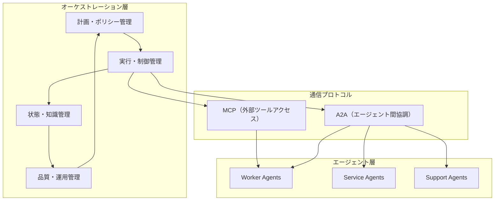

本記事は [https://arxiv.org/abs/2601.13671](https://arxiv.org/abs/2601.13671) の解説記事です。

## 論文概要（Abstract）

本論文は、自律エージェントが構造化された調整・通信を通じて協調し、複雑な共有目標を達成するオーケストレーション型マルチエージェントシステム（MAS）の統合アーキテクチャフレームワークを提示している。著者らは、計画策定（Planning）、ポリシー強制（Policy Enforcement）、状態管理（State Management）、品質運用（Quality Operations）の4要素を統合したアーキテクチャを設計し、通信プロトコルとしてModel Context Protocol（MCP）とAgent-to-Agent（A2A）プロトコルの2つを詳細に分析している。エンタープライズ規模のAIアプリケーションにおけるガバナンス・可観測性の実現方法についても論じている。

この記事は [Zenn記事: Semantic Kernel × A2AプロトコルでAIエージェントの異種連携を実装する](https://zenn.dev/0h_n0/articles/4a7afb7286ce41) の深掘りです。

## 情報源

- **arXiv ID**: 2601.13671
- **URL**: [https://arxiv.org/abs/2601.13671](https://arxiv.org/abs/2601.13671)
- **著者**: Apoorva Adimulam, Rajesh Gupta, Sumit Kumar
- **発表年**: 2026
- **分野**: cs.MA（マルチエージェントシステム）, cs.AI（人工知能）

## 背景と動機（Background & Motivation）

単一エージェントによるAIシステムは、カスタマーサポートチャットボットや財務レポート生成といった狭いタスクには適しているものの、複雑な環境でのスケーラビリティや適応性に限界がある。著者らは、エージェント型AI開発が3段階で進化してきたと整理している。第1段階は単一エージェント（モノリシック）、第2段階は疎結合な複数エージェント（専門化と集団行動を実現）、そして第3段階がオーケストレーション型集団である。

第3段階では、構造化されたガバナンスと通信プロトコルを通じて一貫性・規模・信頼性を確保する必要がある。しかし、既存研究では計画策定・ポリシー管理・状態管理・品質運用の4要素を統合的に扱うフレームワークが不足していた。著者らはこのギャップを埋めるべく、MCP・A2Aプロトコルを軸にした統合アーキテクチャを提案し、エンタープライズでの実運用に耐えうる設計指針を示している。

## 主要な貢献（Key Contributions）

- **統合アーキテクチャフレームワーク**: 計画策定、ポリシー強制、状態管理、品質運用の4層を統合し、マルチエージェントオーケストレーションの全体像を提示
- **デュアルプロトコルスタック分析**: MCP（外部ツールアクセス）とA2A（エージェント間協調）の役割分担を明確化し、相互補完的な通信基盤として定式化
- **エージェント分類体系**: Worker、Service、Supportの3カテゴリに分類し、各エージェントの責務とライフサイクルを形式化
- **エンタープライズ向けガバナンス設計**: 安全性、可観測性、コンプライアンスを統合した運用機構を提示し、BFSI（銀行・金融・保険）やソフトウェア工学での導入事例を報告
- **課題と将来方向の整理**: 通信オーバーヘッド、導入コスト、分散自律性に伴うガバナンス複雑性、LLM由来のリスク（幻覚、バイアス、データ漏洩）の増幅を指摘

## 技術的詳細（Technical Details）

### 統合アーキテクチャの4要素

著者らが提示するアーキテクチャは、以下の4つの管理層から構成されている。

**1. 計画・ポリシー管理層（Planning & Policy Management）**

高レベルの目標を構造化された実行計画に変換する。計画ユニットがゴールを実行可能なサブタスクに分解し、ポリシーユニットがドメイン・ガバナンス制約を埋め込む。タスク実行パラメータの定義もここで行われる。

**2. 実行・制御管理層（Execution & Control Management）**

分散制御システムとして、エージェントの初期化・実行・検証・完了の各フェーズを管理する。実行ユニットがタスク運用とテレメトリ収集を担い、制御ユニットが並行処理・依存関係・動的リソース割り当てを制御する。

**3. 状態・知識管理層（State & Knowledge Management）**

チェックポイント、ワークフロー進捗、エージェント状態、アクティビティログを維持する状態ユニットと、外部データソースへの接続を通じてコンテキスト情報・ドメイン固有知識を管理する知識ユニットで構成される。

**4. 品質・運用管理層（Quality & Operations Management）**

集約された出力をスキーマに対して検証し、矛盾を検出する。レイテンシ・スループット・成功率などのパフォーマンス指標を監視し、進化するコンポーネントの制御されたデプロイとテストを支援する。



### MCPとA2Aの役割分担

著者らは、2つのプロトコルが相互補完的な関係にあると分析している。

**Model Context Protocol（MCP）** は、エージェントと外部システム（ツール、データサービス、コンテキストリポジトリ）間の通信を標準化するプロトコルである。クライアント-サーバーアーキテクチャに基づき、エージェントやオーケストレータが外部機能をリクエストし、接続されたシステムが標準化されたCallableサービスを公開する。著者らは以下の特徴を挙げている。

- スキーマ整合性、アクセス制御、監査可能性を強制
- ステートレス・ステートフル両方の交換をサポートし、コンテキストの継続性を実現
- すべての交換をオーケストレーション状態と同期してログ記録
- ScaleMCPのような拡張により、エージェント間でツールインベントリを動的に同期

**Agent-to-Agent Protocol（A2A）** は、専門エージェント間の通信を標準化するプロトコルである。交渉、委譲、分散エコシステム間の調整をサポートする。

- Workerエージェントがサブタスクを委譲し中間結果を共有
- Serviceエージェントが診断情報やリカバリ状態を通信
- Supportエージェントがテレメトリやパフォーマンスインサイトをブロードキャスト
- 暗号署名とロールベースルーティングによるセキュリティ確保
- オーケストレーション層の監督下でポリシー整合性を維持

つまり、MCPは「エージェントが外部の道具をどう使うか」を規定し、A2Aは「エージェント同士がどう協調するか」を規定する。この分離により、各プロトコルを独立に進化させつつ、全体の一貫性を保つことが可能となる。

### エージェント分類体系

著者らは、マルチエージェントエコシステムを構成するエージェントを3つのカテゴリに分類している。

- **Worker Agents**: 特定の役割に特化したタスクを実行する。RAG（検索拡張生成）などの具体的な処理を担う。ステートレスに動作するものとステートフルに動作するものがある
- **Service Agents**: 品質保証、コンプライアンス強制、診断、自動リカバリといった共有運用機能を提供する。ワークフロー実行中に再利用可能なユーティリティとして機能する
- **Support Agents**: 監督・分析レベルで動作し、システム動作の監視、結果の分析、オーケストレーションに情報を提供するデータフローの管理を行う

## 実装のポイント（Implementation）

本論文はアーキテクチャフレームワークの提示が主であり、具体的な実装コードは含まれていない。ただし、著者らはいくつかの実装上の考慮事項を示している。

**オーケストレーション設計時の注意点として**、計画ユニットと制御ユニットの分離が重要である。計画はタスク分解と順序付けに集中し、制御は並行実行と依存関係解決を担うべきだと著者らは主張している。これは関心の分離原則に沿った設計であり、Semantic KernelのようなフレームワークでPlannerとExecutorを分離する設計パターンに対応する。

**プロトコル実装では**、MCPのスキーマ整合性検証をすべてのツール呼び出しに適用し、A2Aではメッセージの暗号署名とロールベースルーティングを組み込む必要がある。Zenn記事で解説されているSemantic KernelのA2A連携実装は、この論文のA2Aプロトコル仕様と整合する具体例となる。

**状態管理では**、チェックポイントとワークフロー進捗の永続化が必須である。エージェント障害時のリカバリには、最新チェックポイントからの再開が基本戦略となる。

## Production Deployment Guide

### AWS実装パターン（コスト最適化重視）

本論文のマルチエージェントオーケストレーションアーキテクチャをAWS上で実現するための構成を、トラフィック量別に示す。以下のコスト試算は2026年8月時点のAWS ap-northeast-1（東京）リージョン料金に基づく概算値であり、実際のコストはトラフィックパターン、リージョン、バースト使用量により変動する。最新料金はAWS料金計算ツールで確認を推奨する。

| 構成 | トラフィック | アーキテクチャ | 月額コスト |
|------|-------------|---------------|-----------|
| Small | ~100 req/日 | Lambda + Step Functions + Bedrock + DynamoDB | $50-150 |
| Medium | ~1,000 req/日 | ECS Fargate + Step Functions + Bedrock + Aurora Serverless | $300-800 |
| Large | 10,000+ req/日 | EKS + Karpenter + Spot + Bedrock Batch | $2,000-5,000 |

**Small構成の詳細**:
- Lambda（オーケストレータ）: 128MB-512MB, 最大15分タイムアウト, ~$5/月
- Step Functions（ワークフロー管理）: Standard Workflow, ~$10/月
- Bedrock（LLM推論）: Claude Sonnet on-demand, ~$20-100/月
- DynamoDB（状態・チェックポイント管理）: On-Demandモード, ~$5/月
- CloudWatch（可観測性）: ~$10/月

**Large構成の詳細**:
- EKS（コントロールプレーン）: ~$73/月
- EC2 Spot Instances（Worker/Service/Supportエージェント）: c6i.xlarge x 3-5, ~$200-400/月（Spot割引後）
- Bedrock Batch API: 50%コスト削減, ~$500-2,000/月
- Aurora PostgreSQL（状態管理）: db.r6g.large, ~$200/月
- ElastiCache Redis（エージェント間メッセージブローカー）: cache.r6g.large, ~$150/月

**コスト削減テクニック**:
- Spot Instancesの活用でEC2コストを最大90%削減（ただしワーカー中断時のチェックポイントリカバリが必須）
- Reserved Instancesの1年コミットで最大72%削減（Aurora, ElastiCache向け）
- Bedrock Batch APIの利用でLLM推論コストを50%削減
- Prompt Cachingの有効化で同一プロンプトパターンのコストを30-90%削減

### Terraformインフラコード

**Small構成（Serverless）**:

```hcl
# マルチエージェントオーケストレーション - Small構成
# Lambda + Step Functions + Bedrock + DynamoDB

terraform {
  required_version = ">= 1.9"
  required_providers {
    aws = { source = "hashicorp/aws", version = "~> 5.60" }
  }
}

provider "aws" {
  region = "ap-northeast-1"
  default_tags {
    tags = {
      Project     = "multi-agent-orchestration"
      Environment = "production"
      ManagedBy   = "terraform"
    }
  }
}

# --- IAM: 最小権限の原則 ---
resource "aws_iam_role" "orchestrator_lambda" {
  name = "mas-orchestrator-lambda"
  assume_role_policy = jsonencode({
    Version = "2012-10-17"
    Statement = [{
      Action = "sts:AssumeRole"
      Effect = "Allow"
      Principal = { Service = "lambda.amazonaws.com" }
    }]
  })
}

resource "aws_iam_role_policy" "orchestrator_permissions" {
  name = "mas-orchestrator-permissions"
  role = aws_iam_role.orchestrator_lambda.id
  policy = jsonencode({
    Version = "2012-10-17"
    Statement = [
      {
        Effect   = "Allow"
        Action   = ["bedrock:InvokeModel", "bedrock:InvokeModelWithResponseStream"]
        Resource = "arn:aws:bedrock:ap-northeast-1::foundation-model/anthropic.claude-*"
      },
      {
        Effect   = "Allow"
        Action   = ["dynamodb:GetItem", "dynamodb:PutItem", "dynamodb:UpdateItem", "dynamodb:Query"]
        Resource = aws_dynamodb_table.agent_state.arn
      },
      {
        Effect   = "Allow"
        Action   = ["logs:CreateLogGroup", "logs:CreateLogStream", "logs:PutLogEvents"]
        Resource = "arn:aws:logs:ap-northeast-1:*:*"
      },
      {
        Effect   = "Allow"
        Action   = ["states:StartExecution", "states:DescribeExecution"]
        Resource = "*"
      }
    ]
  })
}

# --- DynamoDB: エージェント状態管理 ---
resource "aws_dynamodb_table" "agent_state" {
  name         = "mas-agent-state"
  billing_mode = "PAY_PER_REQUEST" # On-Demandでコスト最適化
  hash_key     = "workflow_id"
  range_key    = "agent_id"

  attribute {
    name = "workflow_id"
    type = "S"
  }
  attribute {
    name = "agent_id"
    type = "S"
  }

  ttl {
    attribute_name = "expires_at"
    enabled        = true
  }

  point_in_time_recovery { enabled = true }

  server_side_encryption {
    enabled = true # KMS暗号化
  }
}

# --- Lambda: オーケストレータ ---
resource "aws_lambda_function" "orchestrator" {
  function_name = "mas-orchestrator"
  runtime       = "python3.12"
  handler       = "orchestrator.handler"
  role          = aws_iam_role.orchestrator_lambda.arn
  timeout       = 900 # 15分（マルチステップ処理対応）
  memory_size   = 512

  environment {
    variables = {
      STATE_TABLE    = aws_dynamodb_table.agent_state.name
      BEDROCK_REGION = "ap-northeast-1"
    }
  }

  tracing_config { mode = "Active" } # X-Ray有効化
}

# --- CloudWatch: コスト監視アラーム ---
resource "aws_cloudwatch_metric_alarm" "lambda_cost_alarm" {
  alarm_name          = "mas-lambda-high-invocations"
  comparison_operator = "GreaterThanThreshold"
  evaluation_periods  = 1
  metric_name         = "Invocations"
  namespace           = "AWS/Lambda"
  period              = 3600
  statistic           = "Sum"
  threshold           = 1000 # 1時間1000回超過で通知
  alarm_description   = "Lambda invocations exceed expected rate"
  dimensions = {
    FunctionName = aws_lambda_function.orchestrator.function_name
  }
}
```

**Large構成（Container）**:

```hcl
# マルチエージェントオーケストレーション - Large構成
# EKS + Karpenter + Spot Instances

module "eks" {
  source  = "terraform-aws-modules/eks/aws"
  version = "~> 20.24"

  cluster_name    = "mas-orchestration"
  cluster_version = "1.31"

  vpc_id     = module.vpc.vpc_id
  subnet_ids = module.vpc.private_subnets

  # Karpenter用設定
  enable_cluster_creator_admin_permissions = true

  cluster_addons = {
    coredns    = { most_recent = true }
    kube-proxy = { most_recent = true }
    vpc-cni    = { most_recent = true }
  }
}

# --- Karpenter: Spot優先の自動スケーリング ---
resource "kubectl_manifest" "karpenter_node_pool" {
  yaml_body = yamlencode({
    apiVersion = "karpenter.sh/v1"
    kind       = "NodePool"
    metadata   = { name = "mas-workers" }
    spec = {
      template = {
        spec = {
          requirements = [
            { key = "karpenter.sh/capacity-type", operator = "In", values = ["spot", "on-demand"] },
            { key = "node.kubernetes.io/instance-type", operator = "In",
              values = ["c6i.xlarge", "c6i.2xlarge", "c7i.xlarge", "c7i.2xlarge"] },
          ]
          nodeClassRef = { name = "default" }
        }
      }
      limits   = { cpu = "64", memory = "128Gi" }
      disruption = {
        consolidationPolicy = "WhenEmptyOrUnderutilized"
        consolidateAfter    = "30s"
      }
    }
  })
}

# --- Secrets Manager: Bedrock設定 ---
resource "aws_secretsmanager_secret" "bedrock_config" {
  name                    = "mas/bedrock-config"
  recovery_window_in_days = 7
}

# --- AWS Budgets: 予算アラート ---
resource "aws_budgets_budget" "monthly" {
  name         = "mas-monthly-budget"
  budget_type  = "COST"
  limit_amount = "5000"
  limit_unit   = "USD"
  time_unit    = "MONTHLY"

  notification {
    comparison_operator       = "GREATER_THAN"
    threshold                 = 80
    threshold_type            = "PERCENTAGE"
    notification_type         = "ACTUAL"
    subscriber_email_addresses = ["ops-team@example.com"]
  }
}
```

### 運用・監視設定

**CloudWatch Logs Insights クエリ**:

```
# コスト異常検知: 1時間あたりのBedrock トークン使用量
fields @timestamp, @message
| filter @message like /bedrock/
| stats sum(input_tokens) as total_input, sum(output_tokens) as total_output by bin(1h)
| sort @timestamp desc

# レイテンシ分析: P95, P99
fields @timestamp, duration_ms
| filter event = "agent_task_complete"
| stats percentile(duration_ms, 95) as p95, percentile(duration_ms, 99) as p99 by bin(5m)
```

**CloudWatch アラーム設定（Python）**:

```python
import boto3

cloudwatch = boto3.client("cloudwatch", region_name="ap-northeast-1")

def create_bedrock_token_alarm() -> None:
    """Bedrockトークン使用量スパイク検知アラーム"""
    cloudwatch.put_metric_alarm(
        AlarmName="mas-bedrock-token-spike",
        MetricName="InputTokenCount",
        Namespace="AWS/Bedrock",
        Statistic="Sum",
        Period=3600,
        EvaluationPeriods=1,
        Threshold=500000,  # 1時間50万トークン超過
        ComparisonOperator="GreaterThanThreshold",
        AlarmActions=["arn:aws:sns:ap-northeast-1:ACCOUNT:ops-alerts"],
    )
```

**X-Ray トレーシング設定（Python）**:

```python
from aws_xray_sdk.core import xray_recorder, patch_all

patch_all()  # boto3自動計装

@xray_recorder.capture("orchestrate_agents")
def orchestrate(workflow_id: str, goal: str) -> dict:
    """マルチエージェントオーケストレーション実行"""
    subsegment = xray_recorder.current_subsegment()
    subsegment.put_annotation("workflow_id", workflow_id)
    subsegment.put_metadata("goal", goal, "orchestration")
    # ... オーケストレーション処理 ...
    return {"status": "complete"}
```

**Cost Explorer 自動レポート（Python）**:

```python
import boto3
from datetime import date, timedelta

ce = boto3.client("ce", region_name="us-east-1")
sns = boto3.client("sns", region_name="ap-northeast-1")

def daily_cost_report() -> None:
    """日次コストレポート取得・通知"""
    today = date.today()
    yesterday = today - timedelta(days=1)

    response = ce.get_cost_and_usage(
        TimePeriod={"Start": str(yesterday), "End": str(today)},
        Granularity="DAILY",
        Metrics=["UnblendedCost"],
        GroupBy=[{"Type": "DIMENSION", "Key": "SERVICE"}],
    )
    total = sum(
        float(g["Metrics"]["UnblendedCost"]["Amount"])
        for g in response["ResultsByTime"][0]["Groups"]
    )
    if total > 100:
        sns.publish(
            TopicArn="arn:aws:sns:ap-northeast-1:ACCOUNT:cost-alerts",
            Subject=f"MAS Daily Cost Alert: ${total:.2f}",
            Message=f"Daily cost exceeded $100: ${total:.2f}",
        )
```

### コスト最適化チェックリスト

**アーキテクチャ選択**:
- [ ] トラフィック量に応じた構成選択（~100 req/日: Serverless, ~1,000 req/日: Hybrid, 10,000+ req/日: Container）
- [ ] エージェント数とタスク複雑度に基づくリソースサイジング

**リソース最適化**:
- [ ] EC2: Spot Instances優先（最大90%削減、Karpenterで自動切替）
- [ ] Reserved Instances: Aurora/ElastiCacheに1年コミット（最大72%削減）
- [ ] Savings Plans: Compute Savings Plans検討（汎用的な割引）
- [ ] Lambda: メモリサイズ最適化（Power Tuningツール使用）
- [ ] ECS/EKS: アイドル時のスケールダウン（Karpenter consolidation設定）
- [ ] Step Functions: Express Workflowで短時間タスクのコスト削減

**LLMコスト削減**:
- [ ] Bedrock Batch APIの活用（非同期処理で50%削減）
- [ ] Prompt Cachingの有効化（繰り返しパターンで30-90%削減）
- [ ] モデル選択ロジック（タスク複雑度に応じてHaiku/Sonnet/Opus切替）
- [ ] トークン数制限（max_tokens設定で無駄な出力抑制）
- [ ] 入力プロンプトの最適化（不要なコンテキスト除去）

**監視・アラート**:
- [ ] AWS Budgets設定（月額予算の80%到達で通知）
- [ ] CloudWatch アラーム（トークン使用量・Lambda実行時間）
- [ ] Cost Anomaly Detection有効化（異常支出の自動検知）
- [ ] 日次コストレポート（Cost Explorer API + SNS通知）
- [ ] X-Rayトレーシング（エージェント間レイテンシ可視化）

**リソース管理**:
- [ ] 未使用リソースの定期削除（Lambda旧バージョン、未使用ENI等）
- [ ] タグ戦略の徹底（Project/Environment/CostCenterタグ必須）
- [ ] S3ライフサイクルポリシー（ログの30日Glacier移行）
- [ ] 開発環境の夜間・週末停止（EventBridge Schedulerで自動化）
- [ ] DynamoDB TTLによる古い状態データの自動削除

## 実験結果（Results）

本論文はフレームワーク提案型の論文であり、独自のベンチマーク実験は含まれていない。ただし、著者らは複数の業界事例から定量的な効果を報告している。

**BFSI（銀行・金融・保険）分野**では、保険引受業務において自律エージェントネットワークが申請書・添付書類の解析で「95%以上の精度」を達成し、迅速なポリシー発行を実現したと報告されている。住宅ローン処理では、Document AIとDecision AIのエージェント統合により「承認プロセスの20倍高速化」と「処理コスト80%削減」が達成されたと著者らは記載している。

**ソフトウェア工学分野**では、大手銀行のデジタルファクトリーアプローチにおいて、レガシーコードの自動文書化、新モジュール生成、ピアコードレビュー、統合テストに特化したエージェントを配備し、早期導入チームで「開発時間と工数の50%以上の削減」が確認されたと報告されている。

**カスタマーサービス分野**では、ルーティンな問い合わせの「最大80%」がAIエージェントで対応可能であり、「解決時間60-90%短縮」が示唆されている。

これらの数値はいずれも論文中の事例引用であり、著者ら自身が実施した制御実験の結果ではない点に留意が必要である。

## 実運用への応用（Practical Applications）

本論文のアーキテクチャは、Zenn記事で解説されているSemantic Kernel + A2Aプロトコルの実装と直接対応する。Semantic KernelのPlugin機構はMCPのツールアクセス標準化に相当し、A2Aプロトコルによる異種エージェント間連携は本論文のA2Aプロトコル仕様を実装レベルで具現化している。

**プロダクション展開時の考慮事項**として、著者らは以下の課題を指摘している。通信オーバーヘッドとメッセージ渋滞がパフォーマンスボトルネックになりうること、オーケストレーションソフトウェア・エンジニアリングチーム・監視インフラへの投資が必要であること、分散自律性に伴うガバナンスの複雑化、そしてLLM由来のリスク（幻覚、バイアス、データ漏洩）がエージェント間相互作用で増幅される可能性があることである。

これらの制約を踏まえると、段階的な導入が現実的である。まず少数のWorkerエージェントとMCPによるツールアクセスから始め、A2Aによるエージェント間協調を徐々に追加し、ガバナンスと可観測性を整備しながらスケールアウトするアプローチが望ましい。

## 関連研究（Related Work）

- **AutoGen (Wu et al., 2023)**: Microsoftが提案したマルチエージェント会話フレームワーク。エージェント間の対話を通じてタスクを解決するアプローチを採用している。本論文はAutoGenの会話型協調をA2Aプロトコルの文脈で位置づけ、より構造化されたオーケストレーション機構を提案している
- **CrewAI**: ロールベースのマルチエージェントフレームワーク。エージェントに役割を割り当てて協調させる点で、本論文のWorker/Service/Supportの分類体系と類似するが、本論文はより包括的なガバナンスとプロトコル標準化に踏み込んでいる
- **LangGraph**: グラフベースのエージェントワークフロー管理フレームワーク。状態管理とワークフロー制御に強みを持ち、本論文の状態・知識管理層の機能と対応する。ただし、LangGraphは単一フレームワーク内のエージェント協調に焦点を当てており、本論文のような異種プロトコル間連携の視点は限定的である
- **Semantic Kernel (Microsoft)**: Zenn記事で取り上げられているフレームワーク。Plugin機構とA2Aプロトコルサポートにより、本論文のデュアルプロトコルスタックを実装レベルで具現化している

## まとめと今後の展望

著者らは、オーケストレーション型マルチエージェントシステムを単一エージェントからの進化的発展と位置づけ、計画策定・ポリシー強制・状態管理・品質運用の4要素とMCP・A2Aのデュアルプロトコルスタックを統合したフレームワークを提示した。BFSI・ソフトウェア工学・カスタマーサービスでの導入事例により、実用性を示している。

今後の方向性として、著者らはハイブリッド・フェデレーテッド設計（集中制御と分散柔軟性のバランス）、セマンティックオーケストレーション（動的なタスク-エージェント能力マッチング）、連合学習によるドメイン間協調、標準化されたベンチマーク・シミュレーション環境の整備を挙げている。エージェントが動的に形成・解散・再編成される動的エコシステムの実現が、長期的なビジョンとして示されている。

## 参考文献

- **arXiv**: [https://arxiv.org/abs/2601.13671](https://arxiv.org/abs/2601.13671)
- **Related Zenn article**: [https://zenn.dev/0h_n0/articles/4a7afb7286ce41](https://zenn.dev/0h_n0/articles/4a7afb7286ce41)
