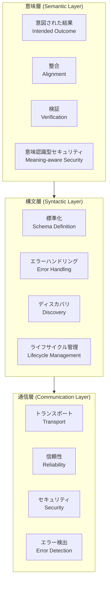

本記事は [https://arxiv.org/abs/2604.02369](https://arxiv.org/abs/2604.02369) の解説記事です。

## 論文概要（Abstract）

大規模言語モデル（LLM）システムがツール利用・エージェント間連携・異種環境横断を行う上で、エージェント通信プロトコルは不可欠なインフラとなりつつある。著者らは人間のコミュニケーションに着想を得た3層フレームワーク（通信層・構文層・意味層）を提示し、18の代表的プロトコルを体系的に分析している。著者らの分析によれば、現行プロトコルの多くはトランスポート・ストリーミング・スキーマ定義・ライフサイクル管理では成熟した支援を提供する一方、意味レベルでの明確化・コンテキスト整合・検証メカニズムはプロトコル層で十分にサポートされていないと報告している。

この記事は [Zenn記事: Semantic Kernel × A2AプロトコルでAIエージェントの異種連携を実装する](https://zenn.dev/0h_n0/articles/4a7afb7286ce41) の深掘りです。

## 情報源

- **arXiv ID**: 2604.02369
- **URL**: [https://arxiv.org/abs/2604.02369](https://arxiv.org/abs/2604.02369)
- **著者**: Dun Yuan, Fuyuan Lyu, Ye Yuan, et al.
- **発表年**: 2026（v1: 2026年3月30日、v3: 2026年4月13日）
- **分野**: cs.NI（コンピュータネットワーク）、cs.AI（人工知能）

## 背景と動機（Background & Motivation）

LLMベースのエージェントが実用システムに組み込まれるにつれ、異なるフレームワーク・ベンダー・実行環境のエージェント同士が協調する必要性が急速に高まっている。Google A2A、Anthropic MCP、Cisco ACP-AGNTCYなど多数のプロトコルが2025年から2026年にかけて登場したが、著者らはこれらの乱立がエコシステムの断片化を招いていると指摘している。

著者らが注目するのは、人間のコミュニケーションとの対比である。人間は発話の物理的伝達（通信層）、文法規則の共有（構文層）、そして意図の相互理解（意味層）という3つの階層を同時に運用している。ShannonとWeaverの通信モデル、Griceの協調原理、Clarkの共通基盤理論を参照しつつ、著者らは現行のエージェント通信プロトコルが通信層と構文層には成熟したサポートを提供する一方、意味層への対応が不十分であることを問題提起している。この不均衡により、意味的な責任がプロンプトやラッパー、アプリケーション固有のオーケストレーションロジックに押し出され、隠れた相互運用性コストと保守コストが生じていると著者らは主張している。

## 主要な貢献（Key Contributions）

- **3層分析フレームワークの提示**: 通信層（Communication）・構文層（Syntactic）・意味層（Semantic）の3層でエージェント通信プロトコルを体系的に評価する枠組みを構築
- **18プロトコルの網羅的比較**: MCP、A2A、Agent Protocol、ACP-AGNTCY、ACP-IBM、ACP-AgentUnion、ACN、Agora、ANP、Coral Protocol、AITP、LMOS、CrowdES、SPPs、PXP、WAP、agents.json、LOKAを横断的に分析
- **意味層の不均衡の定量的指摘**: 明確化（Clarification）・コンテキスト整合（Context Alignment）・検証（Verification）の3次元でほとんどのプロトコルがサポート不足であることを可視化
- **技術的負債の分類**: エコシステム断片化・通信層・構文層・意味層の各レベルで蓄積される負債を体系的に整理
- **展開シナリオ別プロトコル選定ガイダンス**: 7つの実運用シナリオに基づく意思決定フレームワークを提示

## 技術的詳細（Technical Details）

### 3層フレームワークの構造

著者らが提示するフレームワークは、人間のコミュニケーション理論を基盤とし、各層を以下のように定義している。



**通信層（Communication Layer）** はShannonの通信モデルに対応し、信号の確実な伝達を担う。具体的にはトランスポート機構（stdio、WebSocket、HTTP）、配信保証（at-least-once、at-most-once、effectively-once）、TLS/相互TLS、ハートビート、再開トークンなどを含む。

**構文層（Syntactic Layer）** はメッセージの共有文法と構造を規定する。JSON-RPC 2.0ベースのスキーマ定義、標準化されたエラーコード、ケイパビリティの登録と広告、タスク/セッション/ステップの状態管理を含む。

**意味層（Semantic Layer）** はGriceの協調原理とClarkの共通基盤理論に対応し、意味の整合と共有理解を扱う。著者らはこの層を4つのサブカテゴリに分類している。

1. **意図された結果（Intended Outcome）**: 機械検証可能なタスク仕様、事前条件・事後条件、効果保証
2. **整合（Alignment）**: スキーマ変換、値の正規化、名前空間を越えたアイデンティティ解決
3. **検証（Verification）**: 計画・結果のチェック、ポリシー強制、不変条件の検証
4. **意味認識型セキュリティ**: アーティファクトの分類、意図ベースのホワイトリスト、ガードレール、系譜追跡

### 18プロトコル比較の主要知見

著者らの分析結果（論文Table 1）から、各層のサポート状況を以下にまとめる（✓: 明示的サポート、△: 部分的/実装依存、×: 最小限/未対応）。

**通信層**では、ほとんどのプロトコルが✓を示している。MCP、Agent Protocol、ACP各バリアント、A2A、ANPなどはトランスポート・セキュリティの両面で成熟した対応を提供している。ACN（Fetch.ai）は分散ハッシュテーブル（DHT）ベースのP2Pオーバーレイと暗号的エージェント識別子を特徴とし、パーミッションレスかつ検閲耐性のある設計を採用している。

**構文層**では、スキーマ定義が18プロトコル中17で✓となっており、ほぼユニバーサルなサポートを達成している。ライフサイクル管理ではAgent Protocol、ACP各バリアント、Coral、PXPが✓を示す一方、MCPやACP-AgentUnionは△にとどまっている。

**意味層**が論文の核心的発見である。明確化メカニズムを✓で提供するのはA2A、Agora、PXPの3プロトコルのみである。コンテキスト整合ではAgent Protocol、ACP-AGNTCY、Agora、ANP、Coral、LMOS、PXPが✓を示す。検証ではA2A、Agora、PXP、LMOS、SPPsが✓を示すが、過半数のプロトコルは×である。

### A2AとMCPの位置づけ

著者らの分析では、A2AとMCPは異なる設計哲学を持つ補完的プロトコルとして位置づけられている。

**MCP（Model Context Protocol）** はミニマリストな設計思想で、JSON-RPC 2.0ベースのstdio/HTTPストリーミングとスキーマベースのケイパビリティ登録を提供する。著者らはMCPについて「エージェントが互いに『聞こえる』ことは保証するが、互いの『意図を理解する』ことは保証しない」と評している。通信層と構文層では成熟したサポートを提供するが、意味層の明確化・共有コンテキスト・意図検証メカニズムは未対応である。

**A2A（Agent-to-Agent Protocol）** は、セキュアなアイデンティティ管理、ケイパビリティネゴシエーション、明示的な明確化サポート、コンテキスト整合、検証の全3次元で✓を獲得しており、著者らの分析では意味層のカバレッジがエコシステム中で最も高いプロトコルであると報告されている。

## 実装のポイント（Implementation）

### プロトコル選定ガイダンス

著者らは7つの展開シナリオに基づく選定フレームワークを提示している。

1. **シングルテナント・制御されたエンドポイント**: MCP、Agent Protocolが適切。軽量なツール統合に向く
2. **組織内ストリーミング・ネスト呼び出し**: ACP-AGNTCY（Threadsメカニズム、SSEストリーミング）
3. **組織横断・オープンWeb・ディスカバリ重視**: ACP-AgentUnion（連合メッシュ、セマンティックケイパビリティインデキシング）
4. **反復的なやり取り・コスト/曖昧性の削減**: Agora（セマンティックネゴシエーション）
5. **信頼境界を越えた取引・決済・証明**: AITPまたはACP-AgentUnion
6. **Webグラウンデッドエージェント**: WAP
7. **倫理的ガバナンス・検証可能な合意**: SPPs、Coral

### 技術的負債の回避

著者らが特定した主要な技術的負債は以下の通りである。

- **エコシステム断片化**: 約18のプロトコルそれぞれにカスタムアダプタが必要で、ベンダーロックインのリスクがある。プロトコルの選定時には、標準化の見通しとガバナンス構造を評価すべきである
- **セッション管理の不完全さ**: エージェント境界を越えたコンテキスト保持が弱い。ACP-AGNTCYのThreadsメカニズムのような会話コンテキスト保存機構の有無を確認すべきである
- **意味的曖昧性**: 明確化メカニズムの欠如をプロンプトエンジニアリングで補うと、隠れた複雑性と保守コストが増大する。A2AやAgoraのようにプロトコル層で明確化をサポートする設計を優先すべきである

## Production Deployment Guide

本論文はサーベイ論文であるが、マルチエージェント通信基盤のデプロイという観点で実装に直結する知見を含むため、以下にAWS上でのA2A/MCPベースのマルチエージェント通信基盤のデプロイガイドを示す。

### AWS実装パターン（コスト最適化重視）

マルチエージェント通信基盤では、エージェント間メッセージングのレイテンシとスループットが重要な設計指標となる。

**Small構成（~100 req/日）: Serverless**
- API Gateway (WebSocket) + Lambda + DynamoDB + SQS
- Lambda: エージェントメッセージルーティング、A2Aプロトコルハンドリング
- DynamoDB: エージェント登録、ケイパビリティスキーマ、セッション状態
- SQS: 非同期エージェント間メッセージキュー
- 月額試算: $30-100（API Gateway $5、Lambda $10-30、DynamoDB $10-30、SQS $5-10）
- コスト試算はAWS ap-northeast-1（東京）リージョンの2026年8月時点の概算値。実際のコストはトラフィックパターンにより変動する

**Medium構成（~1,000 req/日）: Hybrid**
- ECS Fargate + ALB + ElastiCache (Redis) + DynamoDB
- Fargate: A2Aメッセージブローカー、MCPツールプロキシ（各0.5vCPU / 1GB RAM）
- ElastiCache: セッション状態キャッシュ、ケイパビリティキャッシュ
- 月額試算: $250-600（Fargate $100-200、ALB $20-40、ElastiCache $50-150、DynamoDB $50-100、その他 $30-110）

**Large構成（10,000+ req/日）: Container**
- EKS + Karpenter + Spot Instances + Amazon MSK (Kafka) + ElastiCache
- EKS: A2Aメッセージブローカークラスタ、MCPゲートウェイ、プロトコル変換レイヤー
- MSK: 高スループットエージェント間メッセージストリーミング
- Karpenter: Spot優先の自動スケーリング（m6i.xlarge / c6i.xlarge）
- 月額試算: $1,500-4,000（EKS $70、EC2 Spot $400-1,200、MSK $300-800、ElastiCache $150-400、その他 $580-1,530）

**コスト削減テクニック**:
- Spot Instances活用でEC2コストを最大90%削減（ただしメッセージブローカーの中断耐性設計が必要）
- Reserved Instances（1年コミット）でオンデマンド比最大72%削減
- DynamoDB On-Demandモードで低トラフィック時のコスト最適化
- ElastiCacheのReservedノード購入で最大55%削減

### Terraformインフラコード

**Small構成（Serverless）** -- 主要リソースの抜粋:

```hcl
provider "aws" { region = "ap-northeast-1" }
variable "project_name" { default = "agent-comm-hub" }

# DynamoDB: エージェント登録 & セッション管理（On-Demand: 低トラフィック時コスト最適）
resource "aws_dynamodb_table" "agent_registry" {
  name         = "${var.project_name}-agent-registry"
  billing_mode = "PAY_PER_REQUEST"
  hash_key     = "agent_id"
  attribute { name = "agent_id"; type = "S" }
  attribute { name = "capability_type"; type = "S" }
  global_secondary_index {
    name = "capability-index"; hash_key = "capability_type"; projection_type = "ALL"
  }
  point_in_time_recovery { enabled = true }
  server_side_encryption  { enabled = true } # KMS暗号化
}

# SQS: エージェント間メッセージキュー（DLQ付き）
resource "aws_sqs_queue" "agent_messages" {
  name = "${var.project_name}-messages"
  visibility_timeout_seconds = 300
  sqs_managed_sse_enabled    = true
  redrive_policy = jsonencode({
    deadLetterTargetArn = aws_sqs_queue.agent_messages_dlq.arn
    maxReceiveCount     = 3
  })
}

# Lambda: A2Aメッセージルーター（最小権限IAM、X-Ray有効）
resource "aws_lambda_function" "message_router" {
  function_name = "${var.project_name}-router"
  runtime       = "python3.12"
  handler       = "router.handler"
  role          = aws_iam_role.lambda_role.arn
  timeout       = 30
  memory_size   = 256
  tracing_config { mode = "Active" }
  environment {
    variables = {
      AGENT_TABLE_NAME  = aws_dynamodb_table.agent_registry.name
      MESSAGE_QUEUE_URL = aws_sqs_queue.agent_messages.url
    }
  }
}
```

**Large構成（Container）** -- EKS + Karpenter（Spot優先）の抜粋:

```hcl
module "eks" {
  source          = "terraform-aws-modules/eks/aws"
  version         = "~> 20.0"
  cluster_name    = "${var.project_name}-cluster"
  cluster_version = "1.31"
  vpc_id          = module.vpc.vpc_id
  subnet_ids      = module.vpc.private_subnets
  enable_irsa     = true
  cluster_endpoint_public_access = false # プライベートアクセスのみ
}

# Karpenter NodePool: Spot優先、m6i/c6iファミリー
resource "kubectl_manifest" "karpenter_nodepool" {
  yaml_body = yamlencode({
    apiVersion = "karpenter.sh/v1"
    kind       = "NodePool"
    metadata   = { name = "agent-broker" }
    spec = {
      template.spec.requirements = [
        { key = "karpenter.sh/capacity-type", operator = "In", values = ["spot", "on-demand"] },
        { key = "node.kubernetes.io/instance-type", operator = "In",
          values = ["m6i.xlarge", "m6i.2xlarge", "c6i.xlarge", "c6i.2xlarge"] }
      ]
      disruption = { consolidationPolicy = "WhenEmptyOrUnderutilized", consolidateAfter = "30s" }
      limits     = { cpu = "64", memory = "128Gi" }
    }
  })
}
```

### 運用・監視設定

**CloudWatch Logs Insights クエリ（メッセージルーティング分析）**:

```
# エージェント間メッセージのレイテンシ分析（P95, P99）
fields @timestamp, agent_id, protocol_type, duration_ms
| filter event = "message_routed"
| stats percentile(duration_ms, 95) as p95, percentile(duration_ms, 99) as p99,
        avg(duration_ms) as avg_latency, count(*) as total_messages
  by bin(1h) as time_bucket
```

**X-Ray トレーシング設定（Python）**:

```python
from aws_xray_sdk.core import xray_recorder, patch_all

patch_all()  # boto3, requests等を自動計装

@xray_recorder.capture("route_agent_message")
def route_message(source_agent: str, target_agent: str, protocol: str, payload: dict) -> dict:
    """エージェント間メッセージをルーティングし、トレース情報を記録する。"""
    subsegment = xray_recorder.current_subsegment()
    subsegment.put_annotation("protocol", protocol)
    subsegment.put_annotation("source_agent", source_agent)
    subsegment.put_metadata("payload_size", len(str(payload)))
    return {"status": "routed", "protocol": protocol}
```

**Cost Explorer日次レポート（Python）**:

```python
import boto3
from datetime import datetime, timedelta

def daily_cost_report(sns_topic_arn: str, threshold_usd: float = 100.0) -> dict:
    """日次コストレポートを取得し、閾値超過時にSNS通知する。"""
    ce = boto3.client("ce", region_name="ap-northeast-1")
    end = datetime.utcnow().strftime("%Y-%m-%d")
    start = (datetime.utcnow() - timedelta(days=1)).strftime("%Y-%m-%d")
    response = ce.get_cost_and_usage(
        TimePeriod={"Start": start, "End": end}, Granularity="DAILY",
        Metrics=["UnblendedCost"],
        Filter={"Tags": {"Key": "Project", "Values": ["agent-comm-hub"]}},
        GroupBy=[{"Type": "DIMENSION", "Key": "SERVICE"}],
    )
    total = sum(float(g["Metrics"]["UnblendedCost"]["Amount"])
                for r in response["ResultsByTime"] for g in r["Groups"])
    if total > threshold_usd:
        boto3.client("sns", region_name="ap-northeast-1").publish(
            TopicArn=sns_topic_arn,
            Subject=f"Agent Infra Cost Alert: ${total:.2f}/day",
            Message=f"Daily cost ${total:.2f} exceeded ${threshold_usd} threshold.",
        )
    return {"date": start, "total_usd": total}
```

### コスト最適化チェックリスト

**アーキテクチャ選択**:
- [ ] トラフィック量に応じた構成選択（~100 req/日: Serverless、~1,000: Hybrid、10,000+: Container）
- [ ] WebSocket常時接続 vs HTTPポーリングの評価
- [ ] プロトコル変換レイヤーの必要性評価（A2A↔MCP等）

**リソース最適化**:
- [ ] EC2/EKS: Spot Instances優先（Karpenter設定でspot, on-demandの順）
- [ ] Reserved Instances: ベースロードに1年コミット
- [ ] Lambda: Power Tuningでメモリサイズ最適化（256-512MBが多くのケースで最適）
- [ ] ECS/EKS: 夜間・休日のスケールダウン

**メッセージングコスト削減**:
- [ ] SQS: ロングポーリング有効化
- [ ] DynamoDB: On-Demandモード
- [ ] ElastiCache: ケイパビリティスキーマキャッシュ
- [ ] MSK: Tiered Storage有効化

**監視・アラート**:
- [ ] AWS Budgets: 月次予算アラート（80%/100%閾値）
- [ ] CloudWatch: レイテンシ・エラー率アラーム
- [ ] Cost Anomaly Detection有効化
- [ ] Cost Explorer日次レポート・SNS通知

**リソース管理**:
- [ ] DynamoDB TTLでエージェント登録を定期削除
- [ ] Project/Environment/CostCenterタグを全リソースに付与
- [ ] SQSメッセージ保持期間の最適化（1日等）
- [ ] CloudWatch Logs保持期間を30日に設定
- [ ] 開発環境の夜間・休日停止

## 実験結果（Results）

本論文は実験ベンチマークを含むものではなく、18プロトコルの体系的な比較分析がその中核的成果である。著者らがTable 1で示した分析結果によれば、通信層では大半のプロトコルが成熟したサポートを提供しており、トランスポートとセキュリティは事実上の標準となっている。構文層ではスキーマ定義が18プロトコル中17で明示的にサポートされている一方、ライフサイクル管理のサポートはプロトコルによってばらつきがある。

最も顕著な発見は意味層の不均衡である。明確化メカニズムを明示的にサポートするのは18プロトコル中3つ（A2A、Agora、PXP）のみであり、検証メカニズムをサポートするのも5つ（A2A、Agora、PXP、LMOS、SPPs）にとどまる。著者らはこの結果から、「意味的な責任がプロンプトやラッパー、アプリケーション固有のオーケストレーションロジックに押し出されている」と結論づけている。この意味層の不足は、エージェントが互いのメッセージを受信・解析できても、意図の共有理解を達成できないリスクを示唆している。

なお、著者らは各プロトコルの性能（レイテンシ、スループット等）の定量的ベンチマークは実施していない点に留意が必要である。分析はプロトコル仕様書と公開ドキュメントに基づく定性的評価であると著者ら自身が述べている。

## 実運用への応用（Practical Applications）

Zenn記事「Semantic Kernel × A2AプロトコルでAIエージェントの異種連携を実装する」で扱われているSemantic KernelとA2Aの組み合わせは、本論文の知見と直接的に関連する。著者らの3層フレームワークに照らすと、Semantic Kernelはオーケストレーション層として構文層と意味層の一部を担い、A2Aはクロスプラットフォームのエージェント間通信で意味層を含む包括的なサポートを提供する構成となる。

実運用での応用としては、以下のパターンが考えられる。

- **ツール統合（低複雑性）**: MCPによるLLMとAPIの統合。著者らの分析ではMCPは通信層・構文層で成熟しており、単一テナント環境での軽量統合に適している
- **マルチエージェント協調（中複雑性）**: A2Aによるクロスプラットフォームエージェント連携。意味層のサポートにより、異なるフレームワークのエージェント間で意図の明確化と検証が可能である
- **大規模エージェントネットワーク（高複雑性）**: ACP-AgentUnionの連合メッシュによる分散エージェントネットワーク。ただし、著者らが指摘する通りエコシステム断片化の技術的負債に注意が必要である

いずれのパターンでも、意味層の不足をアプリケーション層で補う必要があるという著者らの指摘は、実装設計時に考慮すべき重要な制約である。

## 関連研究（Related Work）

- **Shannon-Weaver Communication Model (1948)**: 通信の数学的理論。著者らはこれを通信層の基盤理論として参照し、信号伝達の信頼性をエージェント通信の最下層に位置づけている
- **Clark, H. H. "Using Language" (1996)**: 共通基盤理論。著者らが意味層の設計で参照し、エージェント間の共有知識の重要性を理論的に裏付けている
- **Grice, H. P. "Logic and Conversation" (1975)**: 協調原理と会話の格率。著者らは意味層での協調的コミュニケーション規範としてこの理論を援用している

## まとめと今後の展望

著者らは、エージェント通信プロトコルのエコシステムが通信層と構文層では成熟しつつあるが、意味層では依然として大きなギャップがあることを体系的に示した。この不均衡は、エージェントが「メッセージを渡す」ことはできても「共有理解に到達する」ことが困難であることを意味しており、プロトコル選定時にはこの制約を認識した上で、アプリケーション層での補完設計が不可欠である。

今後の研究方向として、著者らはプロトコル標準化の推進、コンテキスト永続化メカニズム、形式化された意図整合フレームワーク、高リスク判断でのヒューマンインザループ検証、オントロジー/語彙の橋渡しインフラの構築を提言している。エージェントシステムが「メッセージパッシングを超えて共有理解へ」と進化するためには、これらの意味層の課題解決が不可欠であると著者らは結論づけている。

## 参考文献

- **arXiv**: [https://arxiv.org/abs/2604.02369](https://arxiv.org/abs/2604.02369)
- **Related Zenn article**: [https://zenn.dev/0h_n0/articles/4a7afb7286ce41](https://zenn.dev/0h_n0/articles/4a7afb7286ce41)
- Shannon, C. E. & Weaver, W. (1948). "A Mathematical Theory of Communication"
- Clark, H. H. (1996). "Using Language." Cambridge University Press
- Grice, H. P. (1975). "Logic and Conversation"
