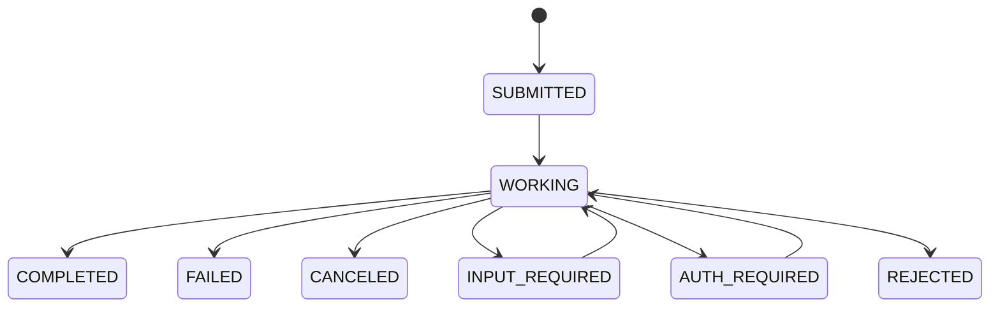

本記事は [https://developers.googleblog.com/en/a2a-a-new-era-of-agent-interoperability/](https://developers.googleblog.com/en/a2a-a-new-era-of-agent-interoperability/) の解説記事です。

## ブログ概要（Summary）

GoogleのRao Surapaneni（VP/GM）、Miku Jha（Director AI/ML）、Michael Vakoc（PM）、Todd Segal（Principal Engineer）らは2025年4月、AIエージェント間の相互運用を実現するオープンプロトコル「Agent2Agent（A2A）」を発表した。A2Aは、異なるフレームワークやベンダーで構築されたエージェント同士がHTTP・SSE・JSON-RPCという既存のWeb標準上で安全に通信し、タスクを委譲・協調するための仕組みを定義している。発表時点で50社以上のテクノロジーパートナーが参画しており、Atlassian、Salesforce、SAP、ServiceNow、LangChainなどがエコシステムに名を連ねている。AnthropicのModel Context Protocol（MCP）がエージェントとツール間の接続を担うのに対し、A2Aはエージェント同士の水平通信を標準化する位置づけであると著者らは説明している。

この記事は [Zenn記事: Semantic Kernel × A2AプロトコルでAIエージェントの異種連携を実装する](https://zenn.dev/0h_n0/articles/4a7afb7286ce41) の深掘りです。

## 情報源

- **種別**: 企業テックブログ（Google Developers Blog）
- **URL**: [https://developers.googleblog.com/en/a2a-a-new-era-of-agent-interoperability/](https://developers.googleblog.com/en/a2a-a-new-era-of-agent-interoperability/)
- **組織**: Google Cloud / Business Application Platform
- **発表日**: 2025年4月9日

## 技術的背景（Technical Background）

現在のAIエージェント開発では、各フレームワーク（LangChain、Semantic Kernel、CrewAI、AutoGen等）が独自のエージェント定義・通信方式を持ち、フレームワーク横断の連携が困難な状況にある。企業環境では部門ごとに異なるベンダーのエージェントが導入されることが一般的であり、これらが互いのスキルを発見し、タスクを委譲し合うための共通プロトコルが存在しなかった。

Googleの著者らは、この問題を「エージェントのサイロ化」として位置づけている。各エージェントが内部ツールや知識にはアクセスできても、別のエージェントの専門能力を活用できないという構造的課題である。A2Aはこの課題に対し、エージェントの内部実装を一切公開せず（opaque execution）、外部インタフェースのみを標準化するアプローチを採用した。

MCPがエージェントとツール・データソース間の「垂直」接続を提供するのに対し、A2Aはエージェント同士の「水平」通信を担う。著者らは両プロトコルを補完関係にあると述べており、同一のエージェントがMCPでツールに接続しつつ、A2Aで他エージェントと協調するアーキテクチャを想定している。

## 実装アーキテクチャ（Architecture）

### 5つの設計原則

著者らは以下の設計原則を掲げている。

1. **Embrace agentic capabilities**: エージェント同士が共有メモリ・ツール・コンテキストなしに、非構造的なモダリティで協調できる
2. **Build on existing standards**: HTTP、SSE、JSON-RPCという既存のIT基盤で即座に統合可能
3. **Secure by default**: OpenAPIの認証スキームと同等のエンタープライズ認証・認可をサポート
4. **Support for long-running tasks**: 数秒のタスクから数時間～数日に及ぶリサーチまで、リアルタイムフィードバックと状態更新を伴って処理
5. **Modality agnostic**: テキスト・音声・映像のストリーミングに対応

### Agent Card — 能力の宣言と発見

Agent Cardは、A2Aサーバが自身の能力を宣言するJSON形式のメタデータドキュメントである。クライアントエージェントはAgent Cardを参照して、タスクの委譲先として最適なリモートエージェントを特定する。

```json
{
  "id": "hiring-agent-001",
  "name": "Candidate Sourcing Agent",
  "description": "Searches candidate databases and returns qualified profiles",
  "provider": {"name": "HR Platform Inc."},
  "skills": [
    {
      "name": "candidate_search",
      "description": "Search for candidates matching job requirements"
    }
  ],
  "capabilities": {
    "streaming": true,
    "pushNotifications": true,
    "extendedAgentCard": false
  },
  "interfaces": [
    {
      "type": "json-rpc",
      "url": "https://hr-agent.example.com/a2a"
    }
  ],
  "securitySchemes": {
    "oauth2": {
      "type": "oauth2",
      "flows": {
        "clientCredentials": {
          "tokenUrl": "https://auth.example.com/token",
          "scopes": {"agent:read": "Read access", "agent:write": "Write access"}
        }
      }
    }
  }
}
```

Agent Cardの主要フィールドは以下の通りである。

- `skills`: エージェントが実行可能なスキルの配列。クライアント側のルーティング判断に使用される
- `capabilities`: ストリーミング対応、プッシュ通知対応、拡張Agent Card対応のフラグ
- `interfaces`: JSON-RPC等のプロトコルバインディングとエンドポイントURL
- `securitySchemes`: OAuth2、APIキー、HTTP Bearer、mTLS等の認証方式宣言

### タスクライフサイクル

A2Aにおける通信はタスクを中心に構成される。タスクは以下の状態遷移をたどる。



- **SUBMITTED**: タスクが受理された初期状態
- **WORKING**: エージェントが処理中
- **COMPLETED / FAILED / CANCELED / REJECTED**: 終端状態（terminal state）
- **INPUT_REQUIRED / AUTH_REQUIRED**: 中断状態（interrupted state）。ユーザ入力や認証を待機

タスクオブジェクトの構造は以下の通りである。

```json
{
  "id": "task-456",
  "contextId": "ctx-789",
  "status": {
    "state": "TASK_STATE_WORKING",
    "timestamp": "2025-04-09T10:00:00Z"
  },
  "artifacts": [],
  "history": [
    {
      "messageId": "msg-123",
      "role": "ROLE_USER",
      "parts": [{"text": "Find candidates for Senior ML Engineer"}]
    }
  ]
}
```

タスクの出力は**Artifact**として返される。Artifactは`TextPart`（テキスト）、`FilePart`（ファイル）、`DataPart`（構造化JSON）のいずれかを含み、複数のArtifactを1つのタスクに関連付けることが可能である。

### JSON-RPCメソッドとSSEストリーミング

A2AはJSON-RPC 2.0をプロトコル層として採用している。主要なメソッドは以下の通りである。

| メソッド | HTTP | 用途 |
|---------|------|------|
| `a2a.SendMessage` | `POST /tasks/send` | メッセージ送信・タスク作成 |
| `a2a.SendStreamingMessage` | `POST /tasks/sendSubscribe` | SSEストリーミング付きメッセージ送信 |
| `a2a.GetTask` | `GET /tasks/{id}` | タスク状態取得 |
| `a2a.ListTasks` | `GET /tasks` | タスク一覧取得（ページネーション対応） |
| `a2a.CancelTask` | `POST /tasks/{id}/cancel` | タスクキャンセル |
| `a2a.SubscribeToTask` | `GET /tasks/{id}/subscribe` | SSEによるタスク監視 |

ストリーミングレスポンスは`StreamResponse`というOneOfラッパーで返され、`task`、`message`、`statusUpdate`、`artifactUpdate`の4種類のイベントが含まれる。複数のクライアントが同一タスクに対して並行してSSE接続を張ることが可能であり、すべてのストリームに同じ順序でイベントが配信される。

### エンタープライズ認証

著者らは「Secure by default」を設計原則として掲げており、A2AはOpenAPIの認証スキームと同等の方式をサポートしている。

- **APIキー認証**: ヘッダまたはクエリパラメータによるAPIキー
- **HTTP認証**: BearerトークンまたはBasic認証
- **OAuth2**: Authorization Code、Client Credentials、Device Codeフロー
- **OpenID Connect**: 標準的なOIDCフロー
- **Mutual TLS**: 双方向TLS認証

これらの認証方式はAgent Cardの`securitySchemes`フィールドで宣言され、クライアントエージェントは接続前に必要な認証情報を確認できる。

## Production Deployment Guide

A2Aプロトコル対応のマルチエージェント基盤をAWS上に構築する場合の実装パターンを示す。以下はブログで紹介されているアーキテクチャ（HTTP + JSON-RPC + SSE）をAWSサービスにマッピングした構成である。

### AWS実装パターン（コスト最適化重視）

#### Small構成（~100 req/日）: Serverless

| サービス | 用途 | 月額概算 |
|---------|------|---------|
| API Gateway (REST) | A2A JSON-RPCエンドポイント | ~$5 |
| Lambda (256MB, ARM64) | エージェントロジック実行 | ~$10 |
| DynamoDB (On-Demand) | タスク・Artifact永続化 | ~$15 |
| Bedrock (Claude Haiku) | LLM推論 | ~$30-80 |
| CloudWatch | ログ・メトリクス | ~$5 |
| **合計** | | **$65-115/月** |

Agent Card配信はS3 + CloudFront経由で静的ホスティングし、`/.well-known/agent.json`パスで公開する。API GatewayでJSON-RPCリクエストをLambdaにルーティングし、タスク状態はDynamoDBに保存する。

#### Medium構成（~1000 req/日）: Hybrid

| サービス | 用途 | 月額概算 |
|---------|------|---------|
| ALB | ロードバランシング | ~$25 |
| ECS Fargate (0.5vCPU, 1GB) x2 | エージェントサービス | ~$60 |
| ElastiCache (Redis t4g.micro) | タスクステート・SSEセッション | ~$15 |
| DynamoDB (On-Demand) | 永続タスクストア | ~$30 |
| Bedrock (Claude Sonnet) | LLM推論 | ~$200-500 |
| **合計** | | **$330-630/月** |

SSEストリーミングはALB + ECS Fargateの長時間接続で処理する。Redisでタスクステートをキャッシュし、複数のFargateタスク間でSSEイベントをPub/Sub配信する。

#### Large構成（10000+ req/日）: Container

| サービス | 用途 | 月額概算 |
|---------|------|---------|
| EKS (コントロールプレーン) | Kubernetesオーケストレーション | ~$75 |
| EC2 Spot (m7g.xlarge) x3-10 | ワーカーノード | ~$200-700 |
| ElastiCache (Redis r7g.large) | タスクステート・Pub/Sub | ~$150 |
| Aurora Serverless v2 | タスク・Artifact永続化 | ~$200-400 |
| Bedrock (Claude Sonnet) | LLM推論 | ~$1,500-3,000 |
| CloudFront + S3 | Agent Card配信 | ~$10 |
| **合計** | | **$2,135-4,335/月** |

Karpenter Provisionerでspot優先のノードスケーリングを行い、ピーク時のみオンデマンドにフォールバックする。

**コスト削減テクニック**:
- Spot Instances活用でEC2コストを最大90%削減（m7g.xlarge spot: ~$0.04/h vs on-demand: ~$0.20/h）
- Reserved Instances（1年コミット）でElastiCache/Auroraを最大40%削減
- Bedrock Batch APIで非同期タスクのLLMコストを50%削減
- Prompt Caching有効化で繰り返しのAgent Card解析コストを30-90%削減

**コスト試算の注意事項**: 上記は2026年8月時点のAWS ap-northeast-1（東京）リージョン料金に基づく概算値である。実際のコストはトラフィックパターン、リージョン、バースト使用量により変動する。最新料金はAWS料金計算ツールで確認を推奨する。

### Terraformインフラコード

#### Small構成（Serverless）

```hcl
# A2A Protocol - Serverless構成
# API Gateway + Lambda + DynamoDB

terraform {
  required_version = ">= 1.9"
  required_providers {
    aws = { source = "hashicorp/aws", version = "~> 5.60" }
  }
}

provider "aws" {
  region = "ap-northeast-1"
}

# --- DynamoDB: タスク永続化 ---
resource "aws_dynamodb_table" "a2a_tasks" {
  name         = "a2a-tasks"
  billing_mode = "PAY_PER_REQUEST"  # On-Demand: 低トラフィック時のコスト最適
  hash_key     = "task_id"

  attribute {
    name = "task_id"
    type = "S"
  }

  # contextIdでの検索用GSI
  global_secondary_index {
    name            = "context-index"
    hash_key        = "context_id"
    projection_type = "ALL"
  }

  attribute {
    name = "context_id"
    type = "S"
  }

  point_in_time_recovery { enabled = true }
  server_side_encryption { enabled = true }  # KMS暗号化

  tags = { Service = "a2a-protocol", Env = "prod" }
}

# --- IAMロール: Lambda用（最小権限） ---
resource "aws_iam_role" "a2a_lambda" {
  name = "a2a-lambda-role"
  assume_role_policy = jsonencode({
    Version = "2012-10-17"
    Statement = [{
      Action    = "sts:AssumeRole"
      Effect    = "Allow"
      Principal = { Service = "lambda.amazonaws.com" }
    }]
  })
}

resource "aws_iam_role_policy" "a2a_lambda_policy" {
  name = "a2a-lambda-policy"
  role = aws_iam_role.a2a_lambda.id
  policy = jsonencode({
    Version = "2012-10-17"
    Statement = [
      {
        Effect   = "Allow"
        Action   = ["dynamodb:GetItem", "dynamodb:PutItem", "dynamodb:UpdateItem", "dynamodb:Query"]
        Resource = [aws_dynamodb_table.a2a_tasks.arn, "${aws_dynamodb_table.a2a_tasks.arn}/index/*"]
      },
      {
        Effect   = "Allow"
        Action   = ["bedrock:InvokeModel"]
        Resource = ["arn:aws:bedrock:ap-northeast-1::foundation-model/anthropic.claude-3-haiku*"]
      },
      {
        Effect   = "Allow"
        Action   = ["logs:CreateLogGroup", "logs:CreateLogStream", "logs:PutLogEvents"]
        Resource = "arn:aws:logs:*:*:*"
      }
    ]
  })
}

# --- Lambda: A2Aエージェント ---
resource "aws_lambda_function" "a2a_agent" {
  function_name = "a2a-agent"
  runtime       = "python3.12"
  handler       = "handler.lambda_handler"
  role          = aws_iam_role.a2a_lambda.arn
  architectures = ["arm64"]  # Graviton: x86比20%安価
  memory_size   = 256
  timeout       = 60

  environment {
    variables = {
      TASKS_TABLE = aws_dynamodb_table.a2a_tasks.name
      BEDROCK_MODEL_ID = "anthropic.claude-3-haiku-20240307-v1:0"
    }
  }

  tracing_config { mode = "Active" }  # X-Ray有効化

  filename         = "lambda.zip"
  source_code_hash = filebase64sha256("lambda.zip")
}

# --- CloudWatch アラーム: コスト監視 ---
resource "aws_cloudwatch_metric_alarm" "lambda_duration" {
  alarm_name          = "a2a-lambda-high-duration"
  comparison_operator = "GreaterThanThreshold"
  evaluation_periods  = 3
  metric_name         = "Duration"
  namespace           = "AWS/Lambda"
  period              = 300
  statistic           = "Average"
  threshold           = 30000  # 30秒
  alarm_actions       = []     # SNSトピックARNを指定
  dimensions = { FunctionName = aws_lambda_function.a2a_agent.function_name }
}
```

#### Large構成（Container）

```hcl
# A2A Protocol - EKS + Karpenter構成
# Spot Instances優先で大規模トラフィックに対応

module "eks" {
  source          = "terraform-aws-modules/eks/aws"
  version         = "~> 20.24"
  cluster_name    = "a2a-cluster"
  cluster_version = "1.31"

  vpc_id     = module.vpc.vpc_id
  subnet_ids = module.vpc.private_subnets

  cluster_endpoint_public_access = false  # プライベートアクセスのみ

  eks_managed_node_groups = {
    system = {
      instance_types = ["m7g.medium"]
      min_size       = 2
      max_size       = 3
      desired_size   = 2
      capacity_type  = "ON_DEMAND"  # システムノードはON_DEMAND
    }
  }
}

# --- Karpenter: Spot優先オートスケーリング ---
resource "kubectl_manifest" "karpenter_nodepool" {
  yaml_body = yamlencode({
    apiVersion = "karpenter.sh/v1"
    kind       = "NodePool"
    metadata   = { name = "a2a-workers" }
    spec = {
      template = {
        spec = {
          requirements = [
            { key = "karpenter.sh/capacity-type", operator = "In", values = ["spot", "on-demand"] },
            { key = "node.kubernetes.io/instance-type", operator = "In",
              values = ["m7g.xlarge", "m7g.2xlarge", "m6g.xlarge", "c7g.xlarge"] },
            { key = "kubernetes.io/arch", operator = "In", values = ["arm64"] }
          ]
        }
      }
      limits   = { cpu = "160", memory = "640Gi" }
      disruption = {
        consolidationPolicy = "WhenEmptyOrUnderutilized"
        consolidateAfter    = "30s"
      }
    }
  })
}

# --- Secrets Manager: Bedrock設定 ---
resource "aws_secretsmanager_secret" "bedrock_config" {
  name = "a2a/bedrock-config"
  kms_key_id = aws_kms_key.a2a_encryption.arn
}

# --- AWS Budgets: 月額予算アラート ---
resource "aws_budgets_budget" "a2a_monthly" {
  name         = "a2a-monthly-budget"
  budget_type  = "COST"
  limit_amount = "5000"
  limit_unit   = "USD"
  time_unit    = "MONTHLY"

  notification {
    comparison_operator       = "GREATER_THAN"
    threshold                 = 80
    threshold_type            = "PERCENTAGE"
    notification_type         = "ACTUAL"
    subscriber_email_addresses = ["ops@example.com"]
  }
}
```

### 運用・監視設定

#### CloudWatch Logs Insights クエリ

```
# A2Aタスク処理のレイテンシ分析（P95, P99）
fields @timestamp, task_id, duration_ms, status
| filter event = "a2a.task.completed"
| stats percentile(duration_ms, 95) as p95,
        percentile(duration_ms, 99) as p99,
        avg(duration_ms) as avg_ms,
        count(*) as total
  by bin(1h)
| sort @timestamp desc

# Bedrockトークン使用量の異常検知（1時間あたり）
fields @timestamp, model_id, input_tokens, output_tokens
| filter event = "bedrock.invocation"
| stats sum(input_tokens) as total_input,
        sum(output_tokens) as total_output
  by bin(1h), model_id
| filter total_input > 500000 or total_output > 100000
```

#### CloudWatch アラーム設定

```python
import boto3

cloudwatch = boto3.client("cloudwatch", region_name="ap-northeast-1")

def create_a2a_alarms(sns_topic_arn: str) -> None:
    """A2Aプロトコル用CloudWatchアラームを作成する

    Args:
        sns_topic_arn: 通知先SNSトピックARN
    """
    # Bedrockトークン使用量スパイク検知
    cloudwatch.put_metric_alarm(
        AlarmName="a2a-bedrock-token-spike",
        MetricName="InputTokenCount",
        Namespace="AWS/Bedrock",
        Statistic="Sum",
        Period=3600,
        EvaluationPeriods=2,
        Threshold=200000,
        ComparisonOperator="GreaterThanThreshold",
        AlarmActions=[sns_topic_arn],
    )

    # Lambda実行時間異常検知
    cloudwatch.put_metric_alarm(
        AlarmName="a2a-lambda-timeout-risk",
        MetricName="Duration",
        Namespace="AWS/Lambda",
        Statistic="p99",
        Period=300,
        EvaluationPeriods=3,
        Threshold=45000,
        ComparisonOperator="GreaterThanThreshold",
        AlarmActions=[sns_topic_arn],
        Dimensions=[{"Name": "FunctionName", "Value": "a2a-agent"}],
    )
```

#### X-Ray トレーシング設定

```python
from aws_xray_sdk.core import xray_recorder, patch_all

# boto3自動計装
patch_all()

@xray_recorder.capture("a2a_send_message")
def handle_send_message(request: dict) -> dict:
    """A2A SendMessageリクエストを処理する

    Args:
        request: JSON-RPCリクエストボディ

    Returns:
        タスクオブジェクトまたはメッセージオブジェクト
    """
    subsegment = xray_recorder.current_subsegment()
    subsegment.put_annotation("task_id", request.get("taskId", "new"))
    subsegment.put_annotation("method", "a2a.SendMessage")
    subsegment.put_metadata("request_parts_count", len(request.get("message", {}).get("parts", [])))

    # タスク処理ロジック
    result = process_task(request)

    subsegment.put_annotation("result_state", result["status"]["state"])
    return result
```

#### Cost Explorer自動レポート

```python
import boto3
from datetime import date, timedelta

ce = boto3.client("ce", region_name="us-east-1")
sns = boto3.client("sns", region_name="ap-northeast-1")

def daily_cost_report(sns_topic_arn: str) -> dict:
    """日次コストレポートを取得しSNS通知する

    Args:
        sns_topic_arn: 通知先SNSトピックARN

    Returns:
        サービス別コスト辞書
    """
    today = date.today()
    yesterday = today - timedelta(days=1)

    response = ce.get_cost_and_usage(
        TimePeriod={"Start": yesterday.isoformat(), "End": today.isoformat()},
        Granularity="DAILY",
        Metrics=["UnblendedCost"],
        GroupBy=[{"Type": "DIMENSION", "Key": "SERVICE"}],
        Filter={
            "Tags": {"Key": "Service", "Values": ["a2a-protocol"]}
        },
    )

    costs = {}
    total = 0.0
    for group in response["ResultsByTime"][0]["Groups"]:
        service = group["Keys"][0]
        amount = float(group["Metrics"]["UnblendedCost"]["Amount"])
        costs[service] = amount
        total += amount

    # $100/日超過でアラート
    if total > 100.0:
        sns.publish(
            TopicArn=sns_topic_arn,
            Subject=f"A2A Cost Alert: ${total:.2f}/day",
            Message=f"Daily cost exceeded $100: ${total:.2f}\n\n"
                    + "\n".join(f"  {k}: ${v:.2f}" for k, v in sorted(costs.items(), key=lambda x: -x[1])),
        )

    return costs
```

### コスト最適化チェックリスト

**アーキテクチャ選択**:
- [ ] トラフィック量でServerless/Hybrid/Containerを判断（100 req/日未満ならServerless一択）
- [ ] SSEストリーミング要件がある場合はFargate以上を選択（Lambda単体ではSSE長時間接続が困難）
- [ ] Agent Card配信はS3+CloudFrontで静的ホスティング（Lambda不要）

**リソース最適化**:
- [ ] EC2/EKS: Spot Instances優先（Karpenter consolidation設定）
- [ ] Reserved Instances: ElastiCache・Aurora等の常時稼働サービスに1年コミット
- [ ] Savings Plans: Fargate/Lambda Compute Savings Plans検討
- [ ] Lambda: ARM64（Graviton）でx86比20%コスト削減
- [ ] ECS/EKS: アイドル時のスケールダウン設定（最小レプリカ数の調整）

**LLMコスト削減**:
- [ ] Bedrock Batch API: 非同期タスク（バックグラウンドリサーチ等）に使用して50%削減
- [ ] Prompt Caching有効化: Agent Card解析・システムプロンプト部分のキャッシュで30-90%削減
- [ ] モデル選択ロジック: タスク複雑度に応じてHaiku/Sonnet/Opusを動的切替
- [ ] トークン数制限: `SendMessageConfiguration`でmaxTokensを適切に設定

**監視・アラート**:
- [ ] AWS Budgets: 月額上限設定（80%到達でアラート）
- [ ] CloudWatch アラーム: Bedrockトークン使用量・Lambda実行時間
- [ ] Cost Anomaly Detection: 異常コストパターンの自動検出
- [ ] 日次コストレポート: Cost Explorer APIで自動取得・SNS通知

**リソース管理**:
- [ ] 未使用リソース削除: 完了タスクのDynamoDB TTL設定（30日）
- [ ] タグ戦略: `Service=a2a-protocol`タグで全リソースをコスト追跡
- [ ] ライフサイクルポリシー: CloudWatch Logsの保持期間設定（90日）
- [ ] 開発環境夜間停止: ECS desired_count=0 のスケジュール設定
- [ ] ECRイメージ: 未使用イメージのライフサイクルポリシー設定

## パフォーマンス最適化（Performance）

A2Aプロトコルのパフォーマンスは、JSON-RPCの処理オーバーヘッド、SSEストリーミングの接続維持、LLM推論のレイテンシの3つの要素に依存する。

**通信レイヤの最適化**:
- Agent Cardのキャッシュ: クライアント側でAgent Cardを一定期間キャッシュし、毎回の取得を避ける。A2A仕様ではAgent Cardの更新頻度は低いため、HTTP `Cache-Control`ヘッダと組み合わせて効果的にキャッシュできる
- SSE接続プーリング: 同一エージェントへの複数タスクで接続を再利用する。ALBのidle timeout（デフォルト60秒）をタスク想定時間に応じて延長する
- JSON-RPCバッチリクエスト: JSON-RPC 2.0はバッチリクエストをサポートしており、複数のタスク状態取得を1回のHTTPリクエストにまとめることが可能である

**タスク処理の最適化**:
- `returnImmediately: true`の活用: 長時間タスクでは即座にタスクIDを返し、クライアントがSSEまたはポーリングで進捗を監視するパターンを推奨。クライアントの接続タイムアウトを回避できる
- プッシュ通知の活用: ポーリングに代わりWebhookベースのプッシュ通知を設定することで、不要なHTTPリクエストを削減し、サーバ負荷を軽減する

## 運用での学び（Production Lessons）

### プロトコル導入のベストプラクティス

著者らのブログでは、A2Aの採用にあたって以下のユースケースが示されている。候補者採用ワークフローの例では、プライマリエージェントが求人要件に基づいて候補者検索エージェント・面接スケジューリングエージェント・バックグラウンドチェックエージェントと連携し、サイロ化された各システムを横断して処理を完了する。

**段階的導入の推奨**:
1. まずAgent Cardの設計から着手する。既存エージェントのスキルを棚卸しし、外部に公開可能な機能をAgent Cardとして定義する
2. 単一のAgent-to-Agent連携から開始し、タスクライフサイクルの状態遷移とエラーハンドリングの実装を検証する
3. SSEストリーミングとプッシュ通知は、短時間タスクの安定運用を確認してから段階的に導入する

### 50+パートナーのエコシステム

著者らによれば、A2A発表時点で50社以上のテクノロジーパートナーが参画している。Atlassian、Box、Salesforce、SAP、ServiceNow、Workday等のエンタープライズSaaS企業に加え、LangChain、Cohere、DataStax、Weights & Biases等のAI/MLインフラ企業が含まれる。また、Accenture、BCG、Deloitte、McKinsey等の大手コンサルティングファームもサービスプロバイダとして参加しており、エンタープライズ導入の支援体制が整備されつつある。

ただし、著者らはブログ発表時点でA2Aを「draft specification」と位置づけており、プロダクション対応バージョンは2025年中のリリースを予定すると述べている。この点は導入を検討する際の重要な考慮事項である。仕様が確定するまで、破壊的変更が入る可能性がある。

## 学術研究との関連（Academic Connection）

A2Aプロトコルの設計は、マルチエージェントシステム（MAS）研究の長い歴史を実用化したものと位置づけられる。FIPA（Foundation for Intelligent Physical Agents）が1997年に策定したAgent Communication Language（ACL）は、エージェント間通信の標準化を目指した先駆的な取り組みであった。A2AはFIPAのような学術的フレームワークとは異なり、HTTP/JSON-RPCという既存のWeb標準の上に構築されている点が特徴的である。

また、LLMベースのマルチエージェント協調に関しては、AutoGen（Microsoft Research, 2023）やCrewAI等のフレームワークがフレームワーク内部でのエージェント協調を実現しているが、A2Aはフレームワーク横断の相互運用性に焦点を当てており、これらの研究とは相補的な関係にある。

## まとめと実践への示唆

GoogleのA2Aプロトコルは、AIエージェント間の相互運用をHTTP・SSE・JSON-RPCという既存Web標準上で実現するオープン仕様である。Agent Cardによる能力発見、タスクライフサイクルによる状態管理、エンタープライズ認証の標準サポートという3つの柱を持つ。Zenn記事で解説されているSemantic Kernel × A2Aの実装は、このプロトコルを具体的なフレームワーク上で動作させる実践例であり、本記事で解説した仕様の理解が実装の基盤となる。導入にあたっては、仕様がまだドラフト段階であることを考慮し、Agent Cardの設計から段階的に着手することを推奨する。

## 参考文献

- **Blog URL**: [https://developers.googleblog.com/en/a2a-a-new-era-of-agent-interoperability/](https://developers.googleblog.com/en/a2a-a-new-era-of-agent-interoperability/)
- **A2A Specification**: [https://github.com/google/A2A](https://github.com/google/A2A)
- **A2A Protocol Documentation**: [https://a2a-protocol.org](https://a2a-protocol.org)
- **Related Zenn article**: [https://zenn.dev/0h_n0/articles/4a7afb7286ce41](https://zenn.dev/0h_n0/articles/4a7afb7286ce41)
