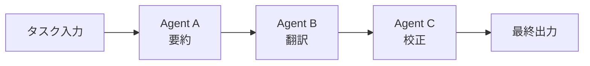
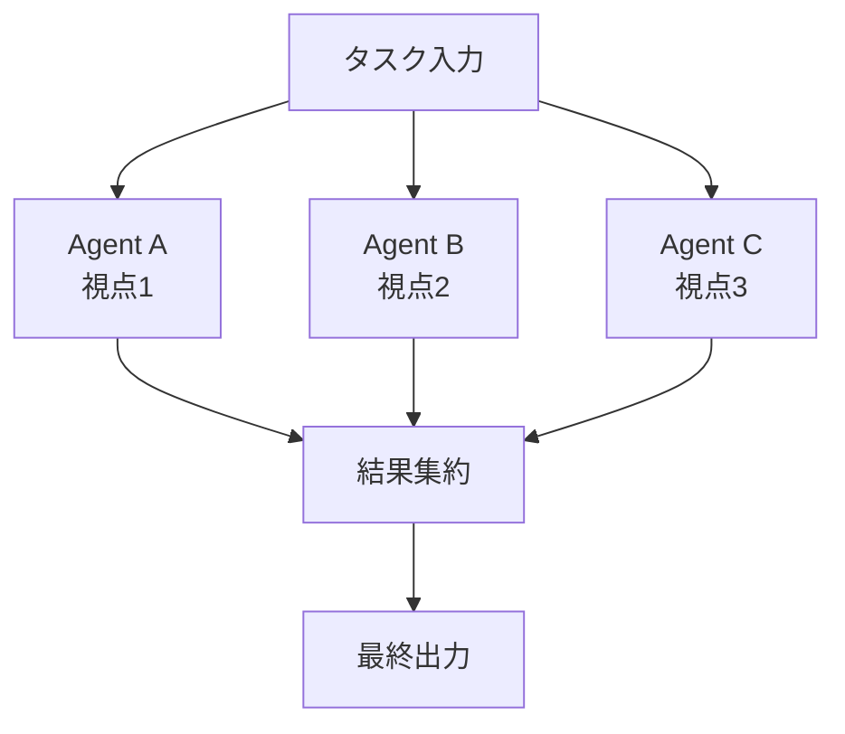
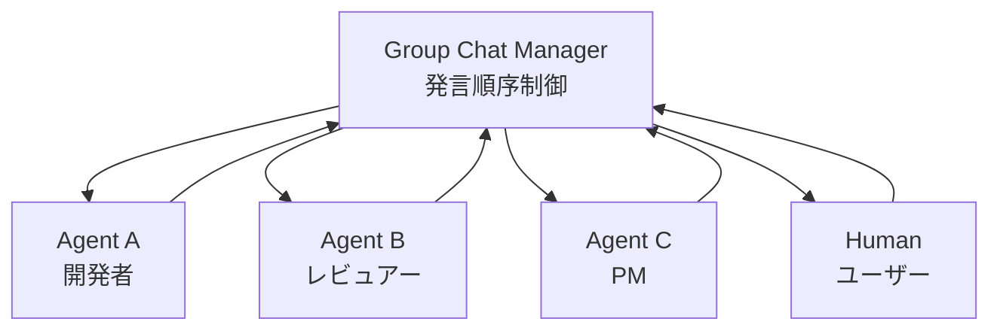
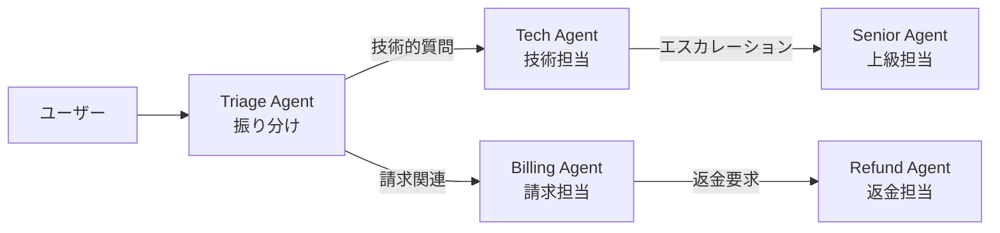
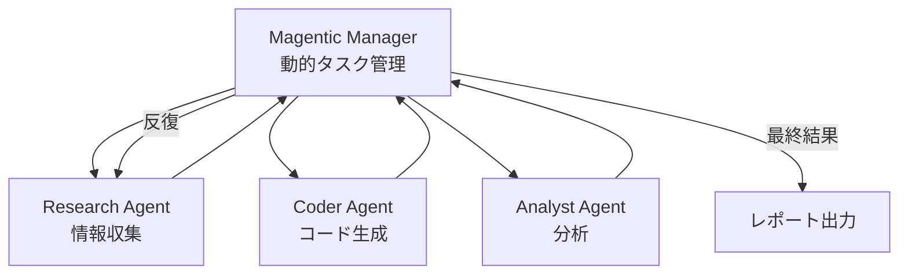

本記事は [Semantic Kernel: Multi-agent Orchestration](https://devblogs.microsoft.com/agent-framework/semantic-kernel-multi-agent-orchestration/) の解説記事です。

## ブログ概要（Summary）

Microsoft Agent Frameworkチームの Tao Chen（Senior Software Engineer）と Chris Rickman（Principal Software Engineer）は、2025年5月27日のブログ記事において、Semantic Kernel（以下SK）のマルチエージェントオーケストレーション機能として5つの協調パターンを発表した。Sequential（逐次）、Concurrent（並行）、Group Chat（グループチャット）、Handoff（制御移譲）、Magentic（動的協調）の各パターンは、統一されたAPIを通じて切り替え可能であり、エージェントロジックの書き直しなしにオーケストレーション戦略を変更できる設計となっている。Pythonおよび.NETの両言語に対応し、Microsoft Agent Framework全体のエージェント基盤として位置づけられている。

この記事は [Zenn記事: Semantic Kernel × A2Aプロトコルで異種AIエージェントのクロスプラットフォーム連携を実装する](https://zenn.dev/0h_n0/articles/4a7afb7286ce41) の深掘りです。

## 情報源

- **種別**: 企業テックブログ
- **URL**: [https://devblogs.microsoft.com/agent-framework/semantic-kernel-multi-agent-orchestration/](https://devblogs.microsoft.com/agent-framework/semantic-kernel-multi-agent-orchestration/)
- **組織**: Microsoft Agent Framework チーム
- **著者**: Tao Chen（Senior Software Engineer）、Chris Rickman（Principal Software Engineer）
- **発表日**: 2025年5月27日

## 技術的背景（Technical Background）

単一エージェントによるタスク処理は、ツール数やプロンプトサイズの増大に伴って性能が劣化する。複数の専門エージェントに役割を分担させるマルチエージェントアーキテクチャは、この問題への対策として広く研究されてきた。しかし、エージェント間の通信プロトコル、タスク分配、結果集約、会話管理といったオーケストレーション層の実装はフレームワークごとに大きく異なり、開発者は特定のパターンに密結合したコードを書かざるを得なかった。

SKのマルチエージェントオーケストレーションは、この課題に対して統一APIという設計方針で対処している。著者らは「開発者がエージェントのビジネスロジックとオーケストレーション戦略を分離できることが重要だ」と述べており、エージェント定義は不変のまま、オーケストレーションクラスの差し替えだけでパターンを切り替えられる構造を採用した。これはMicrosoftがAutoGenで培ったマルチエージェント研究の知見をSDKレベルに落とし込んだものであり、特にMagenticパターンはAutoGenのMagenticOneに基づいている。

なお、Zenn記事で扱われているA2A（Agent-to-Agent）プロトコルは、異なるフレームワーク間でのエージェント連携を実現する標準プロトコルであり、SKのオーケストレーションは単一フレームワーク内での協調を担当する。両者は補完的な関係にある。

## 実装アーキテクチャ（Architecture）

### 統一APIの設計思想

SKの5つのオーケストレーションパターンは、すべて同一のインターフェースで構築・実行できる。著者らは以下の5ステップの統一フローを提示している。

1. **エージェント定義**: 各エージェントの能力（instructions, tools）を定義
2. **オーケストレーション生成**: エージェントリストとオプションのマネージャーを渡してオーケストレーションを生成
3. **コールバック設定**: 入出力変換のカスタムハンドラを必要に応じて設定
4. **ランタイム起動**: `InProcessRuntime`を起動
5. **タスク実行**: `invoke()`で非同期実行し、結果を`get()`で取得

```python
from semantic_kernel.agents.orchestration import (
    SequentialOrchestration,  # パターンを変えるにはこのクラスを差し替えるだけ
)
from semantic_kernel.agents.runtime import InProcessRuntime

# 1. エージェント定義（全パターン共通）
# agent_a, agent_b は事前に定義済みのChatCompletionAgent

# 2. オーケストレーション生成
orchestration = SequentialOrchestration(members=[agent_a, agent_b])

# 3-4. ランタイム起動
runtime = InProcessRuntime()
runtime.start()

# 5. タスク実行
result = await orchestration.invoke(task="Your task here", runtime=runtime)
final_output = await result.get()

await runtime.stop_when_idle()
```

この設計により、`SequentialOrchestration`を`ConcurrentOrchestration`や`HandoffOrchestration`に変更するだけで、エージェントコードに一切手を加えずにオーケストレーション戦略を切り替えられる。著者らは「新しいAPIを学び直したりエージェントロジックを書き直す必要なく、パターン間を簡単に切り替えられる」と説明している。

### 5つのオーケストレーションパターン

#### 1. Sequential Orchestration（逐次オーケストレーション）

タスクをパイプライン処理する。各エージェントの出力が次のエージェントの入力として渡される。



**ユースケース**: ドキュメントレビュー（要約 → 翻訳 → 校正）、データ処理パイプライン（抽出 → 変換 → 検証）、多段推論タスク。

**特性**: 各エージェントの処理順序が明確であり、デバッグが容易である。ただし、後段のエージェントが前段の出力品質に依存するため、1つのエージェントの失敗がパイプライン全体に波及するリスクがある。

#### 2. Concurrent Orchestration（並行オーケストレーション）

複数のエージェントが同一のタスクを独立・並行に処理し、すべての結果を集約して返す。



**ユースケース**: ブレインストーミング（複数視点からのアイデア生成）、アンサンブル推論（多数決やスコア統合）、多角的レビュー（セキュリティ・パフォーマンス・UXの同時評価）。

**特性**: 処理時間は最も遅いエージェントに律速される。各エージェントは互いの出力を参照しないため、独立性が高い反面、エージェント間の文脈共有はできない。

#### 3. Group Chat Orchestration（グループチャットオーケストレーション）

複数のエージェントがマネージャーの調整のもとで協調的な会話を行う。



**ユースケース**: 部門横断の意思決定シミュレーション、コードレビュー（著者・レビュアー・アーキテクトの対話）、ディベート形式の議論。

**特性**: マネージャーが次に発言するエージェントを動的に決定する。人間の参加も可能であり、必要に応じてユーザー入力を求められる。著者らは、従来の`Agent Group Chat`から本パターンへの移行を推奨しており、移行ガイドも提供している。なお、`Agent Group Chat`は今後メンテナンスされない旨が明記されている。

#### 4. Handoff Orchestration（ハンドオフオーケストレーション）

エージェントが文脈と専門性に基づいて、別のエージェントに制御を移譲する。



**ユースケース**: カスタマーサポートのルーティング（一般 → 技術 → 上級）、専門家システム（初期診断 → 詳細分析 → 解決策提示）、動的な委任シナリオ。

**特性**: Zenn記事で解説されているA2Aプロトコルのハンドオフ概念と類似しているが、SKのHandoffはフレームワーク内部での制御移譲である点が異なる。各エージェントが自律的に移譲先を判断する設計であり、移譲のトポロジーはエージェントの定義時に宣言的に設定できる。

#### 5. Magentic Orchestration（マグネティックオーケストレーション）

AutoGenのMagenticOneパターンに基づく、動的かつ柔軟なマルチエージェント協調パターン。



**ユースケース**: 解決経路が事前に不明な複合タスク（例: 複数のMLモデルのCO2排出量比較レポート作成）、データ分析（調査 → コーディング → 分析の多ラウンド反復）、包括的レポーティング。

**特性**: 著者らは「解決経路が事前にわからない場合に適する」と述べている。Magentic Managerが共有コンテキストを維持しながら、タスクの進捗状況に応じて次に行動すべきエージェントをリアルタイムに選択する。Group Chatとの違いは、Magenticでは会話の流れよりもタスク完遂に焦点が当たっている点である。MagenticOneパターンの原設計はAutoGenチームによるものであり、SKはこれを統一APIに組み込んだ形である。

### パターン選択の指針

| パターン | 実行モデル | エージェント間通信 | マネージャー | 適用シナリオ |
|---------|-----------|-----------------|------------|------------|
| Sequential | 直列 | 前段→後段の一方向 | 不要 | 確定的パイプライン |
| Concurrent | 並列 | なし（独立） | 不要 | 多視点評価・アンサンブル |
| Group Chat | 対話型 | マネージャー経由 | 必須 | 協調的議論 |
| Handoff | 委任型 | 移譲先への一方向 | 不要 | 専門家ルーティング |
| Magentic | 動的反復 | マネージャー経由 | 必須 | 探索的タスク |

## Production Deployment Guide

SKマルチエージェントシステムをAWS上にデプロイする場合の構成を以下に示す。SKはPythonおよび.NETに対応しているが、ここではPython構成を前提とする。なお、以下のコスト試算は2026年8月時点のAWS ap-northeast-1（東京）リージョン料金に基づく概算値であり、実際のコストはトラフィックパターン、リージョン、バースト使用量により変動する。最新料金はAWS料金計算ツールで確認を推奨する。

### AWS実装パターン（コスト最適化重視）

**Small構成（~100 req/日）: Serverless — 月額$80-180**

| サービス | 用途 | 月額概算 |
|---------|------|---------|
| Lambda | SKオーケストレーション実行 | $5-15 |
| Amazon Bedrock (Claude Sonnet) | LLMバックエンド | $30-80 |
| DynamoDB | 会話履歴・エージェント状態 | $5-10 |
| API Gateway | REST/WebSocket API | $5-10 |
| S3 | タスク入出力ログ | $1-3 |
| CloudWatch | 監視・ログ | $5-10 |

Lambda関数のタイムアウトは、マルチエージェントの逐次実行を考慮して15分に設定する。Concurrent/Magenticパターンでは複数LLM呼び出しが並行するため、Lambdaの同時実行数制限（デフォルト1000）に留意する。

**Medium構成（~1000 req/日）: ECS Fargate — 月額$400-900**

| サービス | 用途 | 月額概算 |
|---------|------|---------|
| ECS Fargate | SKランタイム（2vCPU, 4GB RAM） | $120-250 |
| Amazon Bedrock | LLMバックエンド | $200-450 |
| ElastiCache (Redis) | 会話状態キャッシュ | $50-80 |
| ALB | ロードバランサ | $25-40 |
| DynamoDB | 永続ストレージ | $10-30 |

Fargateタスクは最低2台でAZ分散し、オーケストレーションのランタイムをコンテナ内で常駐させる。InProcessRuntimeはプロセス内で完結するため、コンテナ間のエージェント通信は不要である。

**Large構成（10000+ req/日）: EKS + Spot — 月額$2,500-5,500**

| サービス | 用途 | 月額概算 |
|---------|------|---------|
| EKS | コンテナオーケストレーション | $75 |
| EC2 Spot (m6i.xlarge) | ワーカーノード | $300-600 |
| Amazon Bedrock | LLMバックエンド | $1,500-3,500 |
| ElastiCache (Redis) | 会話状態・キャッシュ | $150-250 |
| ALB + WAF | 負荷分散・セキュリティ | $80-120 |

**コスト削減テクニック**:
- Spot Instances活用でEC2コストを最大90%削減
- Reserved Instancesの1年コミットでオンデマンド比最大72%削減
- Bedrock Batch APIの利用で同期APIの50%コスト削減（バッチ処理可能なタスク）
- Prompt Caching有効化で反復的なシステムプロンプトのコストを30-90%削減

### Terraformインフラコード

**Small構成（Serverless）**:

```hcl
# --- VPC基盤（NAT Gateway不使用でコスト削減）---
resource "aws_vpc" "sk_agents" {
  cidr_block           = "10.0.0.0/16"
  enable_dns_hostnames = true
  tags = { Name = "sk-multi-agent-vpc" }
}

resource "aws_subnet" "private" {
  count             = 2
  vpc_id            = aws_vpc.sk_agents.id
  cidr_block        = "10.0.${count.index + 1}.0/24"
  availability_zone = data.aws_availability_zones.available.names[count.index]
  tags = { Name = "sk-agents-private-${count.index}" }
}

# --- IAMロール（最小権限）---
resource "aws_iam_role" "lambda_sk_agent" {
  name = "sk-agent-orchestration-lambda"
  assume_role_policy = jsonencode({
    Version = "2012-10-17"
    Statement = [{
      Action    = "sts:AssumeRole"
      Effect    = "Allow"
      Principal = { Service = "lambda.amazonaws.com" }
    }]
  })
}

resource "aws_iam_role_policy" "lambda_sk_permissions" {
  name = "sk-agent-permissions"
  role = aws_iam_role.lambda_sk_agent.id
  policy = jsonencode({
    Version = "2012-10-17"
    Statement = [
      {
        Effect   = "Allow"
        Action   = ["bedrock:InvokeModel", "bedrock:InvokeModelWithResponseStream"]
        Resource = "arn:aws:bedrock:ap-northeast-1::foundation-model/anthropic.claude-*"
      },
      {
        Effect   = "Allow"
        Action   = ["dynamodb:PutItem", "dynamodb:GetItem", "dynamodb:Query"]
        Resource = aws_dynamodb_table.agent_state.arn
      },
      {
        Effect   = "Allow"
        Action   = ["logs:CreateLogGroup", "logs:CreateLogStream", "logs:PutLogEvents"]
        Resource = "arn:aws:logs:ap-northeast-1:*:*"
      }
    ]
  })
}

# --- Lambda関数 ---
resource "aws_lambda_function" "sk_orchestration" {
  function_name = "sk-multi-agent-orchestration"
  runtime       = "python3.12"
  handler       = "handler.lambda_handler"
  role          = aws_iam_role.lambda_sk_agent.arn
  timeout       = 900  # 15分: マルチエージェント逐次実行対応
  memory_size   = 1024 # Concurrent実行時のメモリ確保

  environment {
    variables = {
      DYNAMODB_TABLE     = aws_dynamodb_table.agent_state.name
      ORCHESTRATION_TYPE = "sequential"  # 環境変数でパターン切替
      LOG_LEVEL          = "INFO"
    }
  }

  tracing_config {
    mode = "Active"  # X-Rayトレーシング有効化
  }
}

# --- DynamoDB（On-Demand）---
resource "aws_dynamodb_table" "agent_state" {
  name         = "sk-agent-state"
  billing_mode = "PAY_PER_REQUEST"
  hash_key     = "session_id"
  range_key    = "timestamp"

  attribute {
    name = "session_id"
    type = "S"
  }
  attribute {
    name = "timestamp"
    type = "N"
  }

  server_side_encryption {
    enabled = true  # KMS暗号化
  }

  point_in_time_recovery {
    enabled = true
  }
}

# --- CloudWatchアラーム（コスト監視）---
resource "aws_cloudwatch_metric_alarm" "lambda_duration" {
  alarm_name          = "sk-agent-lambda-duration-high"
  comparison_operator = "GreaterThanThreshold"
  evaluation_periods  = 2
  metric_name         = "Duration"
  namespace           = "AWS/Lambda"
  period              = 300
  statistic           = "p95"
  threshold           = 600000  # 10分超過でアラート
  alarm_actions       = [aws_sns_topic.alerts.arn]
  dimensions = {
    FunctionName = aws_lambda_function.sk_orchestration.function_name
  }
}
```

**Large構成（EKS + Karpenter + Spot）**:

```hcl
# --- EKSクラスタ ---
module "eks" {
  source          = "terraform-aws-modules/eks/aws"
  version         = "~> 20.0"
  cluster_name    = "sk-multi-agent-cluster"
  cluster_version = "1.31"
  vpc_id          = aws_vpc.sk_agents.id
  subnet_ids      = aws_subnet.private[*].id

  cluster_endpoint_public_access = false  # プライベートアクセスのみ
}

# --- Karpenter Provisioner（Spot優先）---
resource "kubectl_manifest" "karpenter_nodepool" {
  yaml_body = yamlencode({
    apiVersion = "karpenter.sh/v1"
    kind       = "NodePool"
    metadata   = { name = "sk-agents" }
    spec = {
      template = {
        spec = {
          requirements = [
            { key = "karpenter.sh/capacity-type", operator = "In", values = ["spot", "on-demand"] },
            { key = "node.kubernetes.io/instance-type", operator = "In",
              values = ["m6i.xlarge", "m6i.2xlarge", "m7i.xlarge", "m7i.2xlarge"] }
          ]
        }
      }
      disruption = {
        consolidationPolicy = "WhenEmptyOrUnderutilized"
        consolidateAfter    = "30s"
      }
      limits = { cpu = "64", memory = "256Gi" }
    }
  })
}

# --- Secrets Manager ---
resource "aws_secretsmanager_secret" "bedrock_config" {
  name        = "sk-agent/bedrock-config"
  description = "Bedrock model configuration for SK agents"
  kms_key_id  = aws_kms_key.sk_agents.arn
}

# --- AWS Budgets（月額予算アラート）---
resource "aws_budgets_budget" "sk_agents" {
  name         = "sk-multi-agent-monthly"
  budget_type  = "COST"
  limit_amount = "5000"
  limit_unit   = "USD"
  time_unit    = "MONTHLY"

  notification {
    comparison_operator       = "GREATER_THAN"
    threshold                 = 80
    threshold_type            = "PERCENTAGE"
    notification_type         = "ACTUAL"
    subscriber_email_addresses = ["ops-team@example.com"]
  }
}
```

### 運用・監視設定

**CloudWatch Logs Insights クエリ**:

```
# コスト異常検知: 1時間あたりのBedrock呼び出し回数
fields @timestamp, @message
| filter @message like /InvokeModel/
| stats count(*) as invocations by bin(1h)
| sort invocations desc

# レイテンシ分析: オーケストレーションパターン別P95
fields @timestamp, orchestration_type, duration_ms
| stats percentile(duration_ms, 95) as p95,
        percentile(duration_ms, 99) as p99
  by orchestration_type
| sort p95 desc
```

**CloudWatch アラーム設定コード（Python）**:

```python
import boto3

cloudwatch = boto3.client("cloudwatch", region_name="ap-northeast-1")

def create_bedrock_token_alarm(sns_topic_arn: str) -> None:
    """Bedrockトークン使用量スパイク検知アラーム"""
    cloudwatch.put_metric_alarm(
        AlarmName="sk-agent-bedrock-token-spike",
        MetricName="InputTokenCount",
        Namespace="AWS/Bedrock",
        Statistic="Sum",
        Period=3600,
        EvaluationPeriods=1,
        Threshold=500000,  # 1時間あたり50万トークン超過
        ComparisonOperator="GreaterThanThreshold",
        AlarmActions=[sns_topic_arn],
    )
```

**X-Ray トレーシング設定（Python）**:

```python
from aws_xray_sdk.core import xray_recorder, patch_all

patch_all()  # boto3自動計装

@xray_recorder.capture("sk_orchestration_invoke")
async def run_orchestration(
    task: str,
    pattern: str,
) -> str:
    """SKオーケストレーション実行をX-Rayでトレース"""
    subsegment = xray_recorder.current_subsegment()
    subsegment.put_annotation("orchestration_pattern", pattern)
    subsegment.put_metadata("task_preview", task[:200])

    result = await orchestration.invoke(task=task, runtime=runtime)
    output = await result.get()

    subsegment.put_annotation("output_length", len(str(output)))
    return str(output)
```

**Cost Explorer 日次レポート（Python）**:

```python
import boto3
from datetime import date, timedelta

ce = boto3.client("ce", region_name="us-east-1")
sns = boto3.client("sns", region_name="ap-northeast-1")

def daily_cost_report(sns_topic_arn: str) -> dict:
    """日次コストレポート取得、$100/日超過でSNS通知"""
    today = date.today()
    yesterday = today - timedelta(days=1)

    response = ce.get_cost_and_usage(
        TimePeriod={"Start": str(yesterday), "End": str(today)},
        Granularity="DAILY",
        Metrics=["UnblendedCost"],
        Filter={
            "Tags": {
                "Key": "Project",
                "Values": ["sk-multi-agent"],
            }
        },
        GroupBy=[{"Type": "DIMENSION", "Key": "SERVICE"}],
    )

    total = sum(
        float(g["Metrics"]["UnblendedCost"]["Amount"])
        for r in response["ResultsByTime"]
        for g in r["Groups"]
    )

    if total > 100.0:
        sns.publish(
            TopicArn=sns_topic_arn,
            Subject="SK Multi-Agent: Daily cost exceeded $100",
            Message=f"Yesterday's cost: ${total:.2f}",
        )

    return {"date": str(yesterday), "total_cost": total}
```

### コスト最適化チェックリスト

**アーキテクチャ選択**:
- [ ] トラフィック量に応じた構成選択（~100 req/日: Serverless、~1000: Fargate、10000+: EKS）
- [ ] SKオーケストレーションパターンの処理特性を考慮（Concurrent/Magenticは並列LLM呼び出しが発生）

**リソース最適化**:
- [ ] EC2: Spot Instances優先（m6i/m7iファミリー、最大90%削減）
- [ ] Reserved Instances: 1年コミットで最大72%削減
- [ ] Savings Plans: Compute Savings Plans検討
- [ ] Lambda: メモリサイズ最適化（Power Tuningで検証）
- [ ] ECS/EKS: Karpenterで未使用ノード自動削除

**LLMコスト削減**:
- [ ] Bedrock Batch API使用（非リアルタイム処理に適用、50%削減）
- [ ] Prompt Caching有効化（エージェントのシステムプロンプトは反復的、30-90%削減）
- [ ] モデル選択ロジック（Sequentialの初段はHaiku級、最終段はSonnet級に分離）
- [ ] トークン数制限（max_tokensを各エージェントに設定）
- [ ] 不要なラウンドトリップ削減（Magentic Managerの最大反復回数を設定）

**監視・アラート**:
- [ ] AWS Budgets設定（月額上限、80%/100%でアラート）
- [ ] CloudWatch アラーム（Bedrock呼び出し数、Lambda duration）
- [ ] Cost Anomaly Detection有効化
- [ ] 日次コストレポート自動配信

**リソース管理**:
- [ ] 未使用リソース削除（定期的なリソース棚卸し）
- [ ] タグ戦略（Project, Environment, Orchestration-Patternタグ）
- [ ] S3ライフサイクルポリシー（ログは90日でGlacier移行）
- [ ] 開発環境夜間停止（ECS/EKSのタスク数を0にスケールダウン）
- [ ] Lambdaプロビジョニング済み同時実行の見直し（過剰設定回避）

## パフォーマンス最適化（Performance）

SKのマルチエージェントオーケストレーションのパフォーマンスは、主にLLM呼び出し回数とネットワークレイテンシに律速される。各パターンのLLM呼び出し回数を$n$（エージェント数）、$r$（Magenticの反復ラウンド数）として整理すると以下の通りである。

| パターン | LLM呼び出し回数 | 壁時計時間の目安 |
|---------|----------------|----------------|
| Sequential | $n$ 回（直列） | $n \times t_{\text{llm}}$ |
| Concurrent | $n$ 回（並列） | $\max(t_{\text{llm}_1}, \ldots, t_{\text{llm}_n})$ |
| Group Chat | $n \times k$ 回（$k$: ラウンド数） | 累積 |
| Handoff | $1 \sim n$ 回 | 経路依存 |
| Magentic | $n \times r$ 回（$r$: 反復数） | 累積 |

**最適化手法**:
- **Concurrent活用**: 独立タスクは並行処理で壁時計時間を削減
- **ストリーミング応答**: `InvokeModelWithResponseStream`で最初のトークン到着を高速化
- **キャッシュ層**: Redis/ElastiCacheにエージェント応答をキャッシュし、同一入力の再実行を回避
- **モデル階層化**: 全エージェントに同一モデルを使う必要はない。トリアージ用エージェントには軽量モデル（Haiku級）、最終判断エージェントにはSonnet級を割り当てるとコストとレイテンシのバランスが取れる

## 運用での学び（Production Lessons）

著者らのブログ記事および関連ドキュメントから、SKマルチエージェントシステムの運用上の考慮事項を以下に整理する。

**Agent Group Chatからの移行**: 著者らはGroup Chat Orchestrationへの移行を明確に推奨しており、Agent Group Chatは今後メンテナンスされないと述べている。既存コードの移行ガイドが提供されているが、APIの非互換性があるため計画的な移行が必要である。

**ランタイムの選択**: 現時点で提供されているのは`InProcessRuntime`であり、プロセス内で完結する。分散ランタイム（プロセス間・マシン間通信）が必要な場合は、アプリケーション層でメッセージキュー（SQS, Service Bus）を介した連携を設計する必要がある。

**エラーハンドリング**: マルチエージェントでは1つのエージェントの障害がオーケストレーション全体に波及する。Sequentialでは前段の失敗で後段が実行不能になり、Magenticでは反復ループが無限に陥る可能性がある。タイムアウト設定と最大反復回数の設定が不可欠である。

**オブザーバビリティ**: 複数エージェントの実行トレースを追跡するには、リクエストIDをオーケストレーション全体で一貫させ、各エージェントの入出力をログに記録する設計が重要である。SKは`LoggerFactory`を各オーケストレーションに渡せる設計であり、構造化ログとの親和性が高い。

## 学術研究との関連（Academic Connection）

MagenticパターンはAutoGenのMagenticOneに基づいている。MagenticOneは、Microsoft Researchが提案したマルチエージェントフレームワークであり、汎用的なタスク解決を目的とした動的エージェント協調のアーキテクチャである。SKのオーケストレーションは、この研究成果をプロダクションSDKに組み込んだ形と言える。

また、Handoffパターンに関しては、OpenAIのSwarmフレームワーク（Routines & Handoffs）やAgents SDKの`handoff()`関数と同様の概念を扱っている。各社がそれぞれの実装でハンドオフを提供しており、A2Aプロトコルはこれらの異種実装間を橋渡しする標準プロトコルとして位置づけられる。

## まとめと実践への示唆

SKの5つのオーケストレーションパターンは、マルチエージェントシステムの主要な協調形態を網羅している。統一APIにより、エージェントのビジネスロジックを変更することなくオーケストレーション戦略を実験・切り替えできる点が設計上の強みである。ただし、InProcessRuntimeに限定される現時点では、分散環境への適用にはアプリケーション層での工夫が必要であり、フレームワークの成熟度を見極めながら導入する判断が求められる。Zenn記事で解説されているA2Aプロトコルと組み合わせることで、異種フレームワーク間のエージェント連携も視野に入る。

## 参考文献

- **Blog URL**: [Semantic Kernel: Multi-agent Orchestration](https://devblogs.microsoft.com/agent-framework/semantic-kernel-multi-agent-orchestration/)
- **Python Samples**: [semantic-kernel/python/samples/getting_started_with_agents/multi_agent_orchestration](https://github.com/microsoft/semantic-kernel/tree/main/python/samples/getting_started_with_agents/multi_agent_orchestration)
- **.NET Samples**: [semantic-kernel/dotnet/samples/GettingStartedWithAgents/Orchestration](https://github.com/microsoft/semantic-kernel/tree/main/dotnet/samples/GettingStartedWithAgents/Orchestration)
- **AutoGen MagenticOne**: [Microsoft Research AutoGen](https://github.com/microsoft/autogen)
- **Related Zenn article**: [Semantic Kernel × A2Aプロトコルで異種AIエージェントのクロスプラットフォーム連携を実装する](https://zenn.dev/0h_n0/articles/4a7afb7286ce41)
