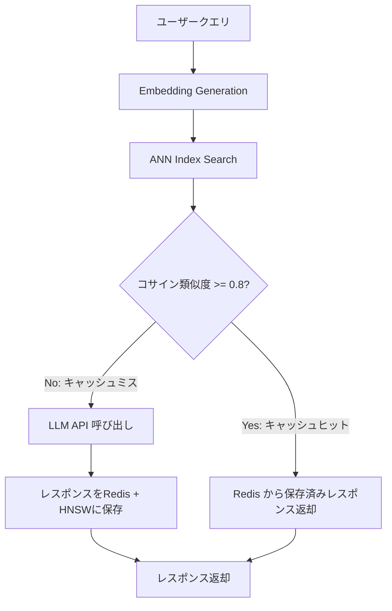

## 論文概要（Abstract）

本記事は [https://arxiv.org/abs/2411.05276](https://arxiv.org/abs/2411.05276) の解説記事です。

GPT Semantic Cacheは、LLM APIへのクエリを埋め込みベクトルに変換し、意味的に類似した過去のクエリに対してキャッシュ済みレスポンスを返却することで、API呼び出し回数とレイテンシを削減するシステムである。著者らは、OpenAI text-embedding-ada-002による1536次元埋め込み、Redis上のHNSW（Hierarchical Navigable Small World）インデックスによる近似最近傍探索、コサイン類似度閾値0.8によるヒット判定を組み合わせたアーキテクチャを提案している。8,000件のQAペアを用いた評価では、最大68.8%のキャッシュヒット率と97%超の正確ヒット率を達成したと報告されている。

この記事は [Zenn記事: Portkey AIゲートウェイで複数LLMを統合する本番構築ガイド2026](https://zenn.dev/0h_n0/articles/c184032fcd6908) の深掘りです。

## 情報源

- **arXiv ID**: 2411.05276
- **URL**: [https://arxiv.org/abs/2411.05276](https://arxiv.org/abs/2411.05276)
- **著者**: Sajal Regmi, Chetan Phakami Pun
- **発表年**: 2024
- **分野**: cs.LG（機械学習）

## 背景と動機（Background & Motivation）

大規模言語モデル（LLM）のAPI利用においては、トークン単位の従量課金とレスポンス生成に伴うレイテンシが、本番環境での大きなコスト要因となっている。特にカスタマーサポートやFAQシステムでは、同一もしくは意味的に類似したクエリが繰り返し発生するが、従来の完全一致キャッシュ（exact-match cache）では表記の揺れや言い回しの違いに対応できず、キャッシュヒット率が低い問題があった。

著者らはこの課題に対し、クエリの文字列一致ではなく意味的類似性に基づくキャッシュ機構を提案している。埋め込みベクトル空間上でのコサイン類似度比較により、「Pythonでリストをソートする方法は？」と「Pythonのリストを並び替えるには？」のように表現が異なるが意図が同じクエリを同一のキャッシュエントリにマッチさせる。この手法により、LLM APIの呼び出し回数を削減し、コストとレイテンシの両方を改善することを目指している。

## 主要な貢献（Key Contributions）

- **セマンティックキャッシュアーキテクチャの設計**: 埋め込み生成、インメモリキャッシュ（Redis）、HNSW近似最近傍探索の3コンポーネントからなるシステムを統合的に構成
- **閾値ベースのヒット判定メカニズム**: コサイン類似度閾値0.8を経験的に設定し、偽陽性と偽陰性のバランスを取るキャッシュヒット判定を実現
- **4カテゴリ8,000ペアでの定量評価**: Python Programming、Network Support、Order/Shipping、Customer Shopping QAの各ドメインで61.6%〜68.8%のキャッシュヒット率と97%超の正確ヒット率を報告
- **ONNX互換ローカルモデルへの対応**: OpenAI APIに依存しない埋め込み生成パスを提供し、オフライン環境やコスト制約の厳しい環境でも利用可能な設計

## 技術的詳細（Technical Details）

### アーキテクチャ

GPT Semantic Cacheは以下の3コンポーネントで構成される。



**1. Embedding Generation**: ユーザークエリをベクトル表現に変換する。OpenAI text-embedding-ada-002（1536次元）を標準とし、ONNX互換のローカルモデルも選択可能である。

**2. In-Memory Caching（Redis）**: 埋め込みベクトルとLLMレスポンスのペアをRedis上に保存する。TTL（Time-To-Live）によるエントリの自動失効管理を行い、古くなった情報がキャッシュに残り続けることを防ぐ。

**3. Similarity Search（HNSWインデックス）**: HNSW（Hierarchical Navigable Small World）グラフを用いた近似最近傍探索により、新しいクエリの埋め込みに最も近いキャッシュエントリを検索する。HNSWの計算量は $O(\log n)$ であり、$n$ はインデックス内のエントリ数を表す。線形探索の $O(n)$ と比較して大規模データセットでの検索が高速である。

### 類似度測定

キャッシュヒットの判定にはコサイン類似度を使用する。2つの埋め込みベクトル $\mathbf{u}$ と $\mathbf{v}$ に対して、コサイン類似度は以下の式で定義される。

$$
\text{cosine\_similarity}(\mathbf{u}, \mathbf{v}) = \frac{\mathbf{u} \cdot \mathbf{v}}{\|\mathbf{u}\| \|\mathbf{v}\|}
$$

ここで、
- $\mathbf{u}$: 新規クエリの埋め込みベクトル（1536次元）
- $\mathbf{v}$: キャッシュ済みクエリの埋め込みベクトル（1536次元）
- $\mathbf{u} \cdot \mathbf{v}$: ベクトルの内積
- $\|\mathbf{u}\|$, $\|\mathbf{v}\|$: 各ベクトルのL2ノルム

コサイン類似度の値域は $[-1, 1]$ であり、1に近いほどベクトルが同じ方向を向いている（意味的に類似している）ことを示す。著者らは閾値を0.8に設定しており、この値は経験的な調整によって偽陽性（意味が異なるのにヒットする）と偽陰性（意味が同じなのにミスする）のバランスが取れる値として選定されたと報告している。

### HNSWアルゴリズムの概要

HNSW（Hierarchical Navigable Small World）は、Malkovらが2018年に提案した近似最近傍探索アルゴリズムである。多層のスキップリスト構造を持ち、上位層では粗い探索で候補領域を絞り込み、下位層で精密な探索を行う。

探索の計算量は $O(\log n)$ であり、これは以下の性質による。

$$
T_{\text{search}} = O\left(\sum_{l=0}^{L} k_l\right) \approx O(\log n)
$$

ここで、
- $L$: グラフの最大層数（$L \propto \log n$）
- $k_l$: 層 $l$ での探索ステップ数（各層で定数オーダー）
- $n$: インデックス内の総エントリ数

### アルゴリズム

セマンティックキャッシュのクエリ処理を擬似コードで示す。

```python
import numpy as np
from typing import Optional


def cosine_similarity(u: np.ndarray, v: np.ndarray) -> float:
    """2つのベクトル間のコサイン類似度を計算する。

    Args:
        u: クエリの埋め込みベクトル (shape: (d,))
        v: キャッシュ済みの埋め込みベクトル (shape: (d,))

    Returns:
        コサイン類似度 [-1, 1]
    """
    dot_product = np.dot(u, v)
    norm_u = np.linalg.norm(u)
    norm_v = np.linalg.norm(v)
    if norm_u == 0.0 or norm_v == 0.0:
        return 0.0
    return float(dot_product / (norm_u * norm_v))


def semantic_cache_lookup(
    query_embedding: np.ndarray,
    hnsw_index: "HNSWIndex",
    cache_store: dict[str, str],
    threshold: float = 0.8,
) -> Optional[str]:
    """HNSWインデックスを用いたセマンティックキャッシュ検索。

    Args:
        query_embedding: 新規クエリの埋め込みベクトル
        hnsw_index: HNSW近似最近傍探索インデックス
        cache_store: キャッシュID -> LLMレスポンスの辞書
        threshold: キャッシュヒット判定のコサイン類似度閾値

    Returns:
        キャッシュヒット時は保存済みレスポンス、ミス時はNone
    """
    # O(log n) での近似最近傍探索
    nearest_id, nearest_embedding = hnsw_index.search(query_embedding, k=1)

    similarity = cosine_similarity(query_embedding, nearest_embedding)

    if similarity >= threshold:
        # キャッシュヒット: 保存済みレスポンスを返却
        return cache_store.get(nearest_id)

    # キャッシュミス: Noneを返し、呼び出し元でLLM APIに転送
    return None
```

## 実装のポイント（Implementation）

実際にセマンティックキャッシュを構築する際の重要なポイントを以下に示す。

**Redis + ベクトルインデックスの統合**: Redis Stack（旧RediSearch）はベクトル類似度検索をネイティブでサポートしており、HNSWインデックスの作成・検索をRedisコマンドとして実行できる。これにより、キャッシュストレージとベクトル検索を単一のインフラで運用可能となる。

**埋め込みモデルの選択**: OpenAI text-embedding-ada-002は1536次元の高品質な埋め込みを生成するが、API呼び出しコストが発生する。ONNX互換のローカルモデル（例: all-MiniLM-L6-v2、384次元）を使用すれば埋め込み生成コストをゼロにできるが、ベクトルの表現力が低下する可能性がある。ドメインやコスト要件に応じた選択が必要である。

**TTL設定の戦略**: 情報の鮮度要件によってTTLを調整する。FAQのような静的コンテンツは長いTTL（24時間〜7日）を設定でき、リアルタイム情報を扱う場合は短いTTL（1時間〜6時間）が適切である。著者らは、急速に変化する情報に対してTTLメカニズムだけでは不十分であることを制限事項として挙げている。

**閾値のチューニング**: 固定閾値0.8はドメインによって最適値が異なる。著者らも、多様なクエリタイプでは0.8が最適でない場合があると指摘している。本番環境ではA/Bテストやオフライン評価で閾値を調整し、偽陽性率と偽陰性率のトレードオフを確認することが重要である。

```python
import redis
import json
import hashlib
import numpy as np
from typing import Optional


class SemanticCache:
    """Redis Stackを使ったセマンティックキャッシュの実装例。

    Attributes:
        client: Redisクライアント
        index_name: ベクトルインデックス名
        threshold: キャッシュヒット判定閾値
        ttl_seconds: キャッシュエントリのTTL（秒）
    """

    def __init__(
        self,
        redis_url: str = "redis://localhost:6379",
        index_name: str = "semantic_cache_idx",
        threshold: float = 0.8,
        ttl_seconds: int = 86400,
    ) -> None:
        self.client = redis.from_url(redis_url)
        self.index_name = index_name
        self.threshold = threshold
        self.ttl_seconds = ttl_seconds

    def _make_key(self, query: str) -> str:
        """クエリ文字列からRedisキーを生成する。

        Args:
            query: ユーザークエリ文字列

        Returns:
            ハッシュベースのRedisキー
        """
        return f"cache:{hashlib.sha256(query.encode()).hexdigest()[:16]}"

    def store(
        self,
        query: str,
        embedding: np.ndarray,
        response: str,
    ) -> None:
        """クエリ・埋め込み・レスポンスをキャッシュに保存する。

        Args:
            query: 元のクエリ文字列
            embedding: クエリの埋め込みベクトル (shape: (1536,))
            response: LLMのレスポンス文字列
        """
        key = self._make_key(query)
        self.client.hset(
            key,
            mapping={
                "query": query,
                "embedding": embedding.tobytes(),
                "response": response,
            },
        )
        self.client.expire(key, self.ttl_seconds)

    def search(
        self,
        query_embedding: np.ndarray,
        top_k: int = 1,
    ) -> Optional[str]:
        """ベクトル類似度検索でキャッシュを検索する。

        Args:
            query_embedding: 新規クエリの埋め込みベクトル
            top_k: 返却する最近傍の数

        Returns:
            閾値以上の類似度を持つキャッシュエントリのレスポンス、
            または該当なしの場合None
        """
        # Redis Stackのベクトル検索クエリ
        # FT.SEARCH で HNSW インデックスを使用
        results = self.client.ft(self.index_name).search(
            f"*=>[KNN {top_k} @embedding $vec AS score]",
            query_params={"vec": query_embedding.tobytes()},
        )

        if results.total == 0:
            return None

        # コサイン距離をコサイン類似度に変換
        # Redis は距離（0が最も近い）を返すため
        best = results.docs[0]
        similarity = 1.0 - float(best.score)

        if similarity >= self.threshold:
            return str(best.response)

        return None
```

## Production Deployment Guide

### AWS実装パターン（コスト最適化重視）

セマンティックキャッシュをAWS上に構築する場合、トラフィック量に応じた3つの構成パターンを以下に示す。コスト試算は2026年8月時点のAWS ap-northeast-1（東京）リージョン料金に基づく概算値であり、実際のコストはトラフィックパターンやバースト使用量により変動する。最新料金は[AWS料金計算ツール](https://calculator.aws/)で確認を推奨する。

| 構成 | トラフィック | 主要サービス | 月額概算 |
|------|------------|-------------|---------|
| Small | ~100 req/日 | Lambda + ElastiCache Serverless + Bedrock | $80-180 |
| Medium | ~1,000 req/日 | ECS Fargate + ElastiCache (r7g.large) + Bedrock | $400-900 |
| Large | 10,000+ req/日 | EKS + ElastiCache Cluster + Bedrock Batch | $2,500-5,500 |

**Small構成（~100 req/日）**: Lambda関数がクエリを受け取り、Bedrock（Titan Embeddings V2）で埋め込み生成、ElastiCache Serverless for Redis上のHNSWインデックスで類似度検索を実行する。キャッシュミス時はBedrock（Claude 3.5 Sonnet等）でレスポンスを生成しキャッシュに保存する。月額内訳はLambda $5-10、ElastiCache Serverless $30-60、Bedrock Embeddings $5-15、Bedrock LLM $40-95程度。

**Medium構成（~1,000 req/日）**: ECS Fargateでアプリケーションコンテナを常時稼働させ、ElastiCache r7g.largeノードでRedis Stackを運用する。Fargateの最小構成（0.5 vCPU, 1GB RAM）で$30-50/月、ElastiCache r7g.large $180-220/月、Bedrock $190-630/月程度。

**Large構成（10,000+ req/日）**: EKS上にアプリケーションPodをデプロイし、Karpenterによる自動スケーリングでSpot Instances（最大90%割引）を活用する。ElastiCacheは3ノードクラスタ（r7g.xlarge）でリードレプリカを配置し、読み取りスループットを向上させる。Bedrock Batch APIの利用で推論コストを50%削減可能。

**コスト削減テクニック**:
- **セマンティックキャッシュ自体がコスト削減策**: キャッシュヒット率60-68%により、LLM APIコールを大幅に削減
- **Spot Instances**: EKSワーカーノードに適用し、オンデマンド比で最大90%のコスト削減
- **Reserved Instances**: ElastiCacheノードに1年リザーブドを適用し、最大40%の割引
- **Bedrock Batch API**: リアルタイム性不要のバッチ処理に適用し50%削減
- **Prompt Caching**: Bedrock側のキャッシュ機能と組み合わせ、さらに30-90%削減

### Terraformインフラコード

**Small構成（Serverless）**:

```hcl
# semantic_cache_small/main.tf
# セマンティックキャッシュ Small構成 (Lambda + ElastiCache Serverless + Bedrock)

terraform {
  required_version = ">= 1.9"
  required_providers {
    aws = {
      source  = "hashicorp/aws"
      version = "~> 5.60"
    }
  }
}

provider "aws" {
  region = "ap-northeast-1"
}

# --- VPC ---
resource "aws_vpc" "main" {
  cidr_block           = "10.0.0.0/16"
  enable_dns_support   = true
  enable_dns_hostnames = true
  tags = { Name = "semantic-cache-vpc" }
}

resource "aws_subnet" "private" {
  count             = 2
  vpc_id            = aws_vpc.main.id
  cidr_block        = cidrsubnet(aws_vpc.main.cidr_block, 8, count.index)
  availability_zone = data.aws_availability_zones.available.names[count.index]
  tags = { Name = "semantic-cache-private-${count.index}" }
}

data "aws_availability_zones" "available" {
  state = "available"
}

# --- ElastiCache Serverless for Redis ---
resource "aws_elasticache_serverless_cache" "semantic_cache" {
  engine = "redis"
  name   = "semantic-cache"
  # コスト最適化: Serverlessは使用量に応じた課金
  cache_usage_limits {
    data_storage {
      maximum = 5  # GB
      unit    = "GB"
    }
    ecpu_per_second {
      maximum = 5000
    }
  }
  subnet_ids         = aws_subnet.private[*].id
  security_group_ids = [aws_security_group.cache.id]
}

resource "aws_security_group" "cache" {
  name_prefix = "semantic-cache-"
  vpc_id      = aws_vpc.main.id
  ingress {
    from_port       = 6379
    to_port         = 6379
    protocol        = "tcp"
    security_groups = [aws_security_group.lambda.id]
  }
}

# --- Lambda ---
resource "aws_security_group" "lambda" {
  name_prefix = "semantic-cache-lambda-"
  vpc_id      = aws_vpc.main.id
  egress {
    from_port   = 0
    to_port     = 0
    protocol    = "-1"
    cidr_blocks = ["0.0.0.0/0"]
  }
}

resource "aws_iam_role" "lambda" {
  name = "semantic-cache-lambda-role"
  assume_role_policy = jsonencode({
    Version = "2012-10-17"
    Statement = [{
      Action    = "sts:AssumeRole"
      Effect    = "Allow"
      Principal = { Service = "lambda.amazonaws.com" }
    }]
  })
}

# 最小権限: Bedrock invoke + VPC + CloudWatch Logs のみ
resource "aws_iam_role_policy" "lambda_policy" {
  name = "semantic-cache-lambda-policy"
  role = aws_iam_role.lambda.id
  policy = jsonencode({
    Version = "2012-10-17"
    Statement = [
      {
        Effect   = "Allow"
        Action   = ["bedrock:InvokeModel"]
        Resource = "arn:aws:bedrock:ap-northeast-1::foundation-model/*"
      },
      {
        Effect = "Allow"
        Action = [
          "logs:CreateLogGroup",
          "logs:CreateLogStream",
          "logs:PutLogEvents"
        ]
        Resource = "arn:aws:logs:*:*:*"
      },
      {
        Effect = "Allow"
        Action = [
          "ec2:CreateNetworkInterface",
          "ec2:DescribeNetworkInterfaces",
          "ec2:DeleteNetworkInterface"
        ]
        Resource = "*"
      }
    ]
  })
}

resource "aws_lambda_function" "semantic_cache" {
  function_name = "semantic-cache-handler"
  runtime       = "python3.12"
  handler       = "handler.lambda_handler"
  role          = aws_iam_role.lambda.arn
  timeout       = 30
  memory_size   = 512  # 埋め込みベクトル処理に十分なメモリ

  filename         = "lambda.zip"
  source_code_hash = filebase64sha256("lambda.zip")

  vpc_config {
    subnet_ids         = aws_subnet.private[*].id
    security_group_ids = [aws_security_group.lambda.id]
  }

  environment {
    variables = {
      REDIS_ENDPOINT      = aws_elasticache_serverless_cache.semantic_cache.endpoint[0].address
      SIMILARITY_THRESHOLD = "0.8"
      CACHE_TTL_SECONDS   = "86400"
    }
  }
}

# --- CloudWatch アラーム（コスト監視） ---
resource "aws_cloudwatch_metric_alarm" "lambda_duration" {
  alarm_name          = "semantic-cache-lambda-high-duration"
  comparison_operator = "GreaterThanThreshold"
  evaluation_periods  = 3
  metric_name         = "Duration"
  namespace           = "AWS/Lambda"
  period              = 300
  statistic           = "Average"
  threshold           = 10000  # 10秒
  alarm_description   = "Lambda実行時間が10秒を超過"
  dimensions = {
    FunctionName = aws_lambda_function.semantic_cache.function_name
  }
}
```

**Large構成（Container）**:

```hcl
# semantic_cache_large/main.tf
# セマンティックキャッシュ Large構成 (EKS + Karpenter + ElastiCache Cluster)

# --- EKS Cluster ---
module "eks" {
  source  = "terraform-aws-modules/eks/aws"
  version = "~> 20.24"

  cluster_name    = "semantic-cache-cluster"
  cluster_version = "1.30"
  vpc_id          = aws_vpc.main.id
  subnet_ids      = aws_subnet.private[*].id

  # コスト最適化: パブリックエンドポイントのみ（NAT Gateway不要）
  cluster_endpoint_public_access  = true
  cluster_endpoint_private_access = true
}

# --- Karpenter (Spot優先で最大90%コスト削減) ---
resource "kubectl_manifest" "karpenter_node_pool" {
  yaml_body = yamlencode({
    apiVersion = "karpenter.sh/v1"
    kind       = "NodePool"
    metadata   = { name = "semantic-cache-pool" }
    spec = {
      template = {
        spec = {
          requirements = [
            { key = "karpenter.sh/capacity-type", operator = "In", values = ["spot", "on-demand"] },
            { key = "node.kubernetes.io/instance-type", operator = "In", values = ["m7i.large", "m7a.large", "m6i.large"] },
          ]
          nodeClassRef = { name = "default" }
        }
      }
      limits   = { cpu = "32", memory = "128Gi" }
      # Spot優先: spot -> on-demand フォールバック
      disruption = {
        consolidationPolicy = "WhenEmptyOrUnderutilized"
        consolidateAfter    = "30s"
      }
    }
  })
}

# --- ElastiCache Cluster (3ノード, リードレプリカ) ---
resource "aws_elasticache_replication_group" "semantic_cache" {
  replication_group_id = "semantic-cache-cluster"
  description          = "Semantic cache Redis cluster with read replicas"
  node_type            = "cache.r7g.xlarge"
  num_cache_clusters   = 3  # 1 primary + 2 read replicas
  engine               = "redis"
  engine_version       = "7.1"
  port                 = 6379

  # KMS暗号化
  at_rest_encryption_enabled = true
  transit_encryption_enabled = true

  subnet_group_name  = aws_elasticache_subnet_group.main.name
  security_group_ids = [aws_security_group.cache_large.id]
}

# --- AWS Budgets (月額予算アラート) ---
resource "aws_budgets_budget" "semantic_cache" {
  name         = "semantic-cache-monthly"
  budget_type  = "COST"
  limit_amount = "5500"
  limit_unit   = "USD"
  time_unit    = "MONTHLY"

  notification {
    comparison_operator       = "GREATER_THAN"
    threshold                 = 80
    threshold_type            = "PERCENTAGE"
    notification_type         = "ACTUAL"
    subscriber_email_addresses = ["ops-team@example.com"]
  }
}
```

### 運用・監視設定

**CloudWatch Logs Insights クエリ**:

```
# コスト異常検知: 1時間あたりのキャッシュミス（= LLM APIコール）数
fields @timestamp, @message
| filter event = "cache_miss"
| stats count(*) as miss_count by bin(1h)
| sort miss_count desc

# レイテンシ分析: P95/P99
fields @timestamp, duration_ms, cache_hit
| stats
    percentile(duration_ms, 95) as p95,
    percentile(duration_ms, 99) as p99,
    avg(duration_ms) as avg_ms
  by cache_hit
```

**CloudWatch アラーム設定コード**:

```python
import boto3


def create_cache_miss_alarm(
    function_name: str,
    sns_topic_arn: str,
    threshold: float = 500.0,
) -> dict:
    """キャッシュミス率急増を検知するCloudWatchアラームを作成する。

    Args:
        function_name: 監視対象のLambda関数名
        sns_topic_arn: 通知先SNSトピックARN
        threshold: 5分間のキャッシュミス数閾値

    Returns:
        CloudWatch put_metric_alarm レスポンス
    """
    client = boto3.client("cloudwatch", region_name="ap-northeast-1")
    return client.put_metric_alarm(
        AlarmName=f"{function_name}-high-cache-miss",
        MetricName="CacheMissCount",
        Namespace="SemanticCache",
        Statistic="Sum",
        Period=300,
        EvaluationPeriods=3,
        Threshold=threshold,
        ComparisonOperator="GreaterThanThreshold",
        AlarmActions=[sns_topic_arn],
    )
```

**X-Ray トレーシング設定**:

```python
from aws_xray_sdk.core import xray_recorder, patch_all
import boto3


# boto3自動計装
patch_all()


def traced_cache_lookup(
    query: str,
    cache: "SemanticCache",
    bedrock_client: boto3.client,
) -> str:
    """X-Rayトレーシング付きのキャッシュ検索を実行する。

    Args:
        query: ユーザークエリ
        cache: SemanticCacheインスタンス
        bedrock_client: Bedrock Runtimeクライアント

    Returns:
        LLMレスポンス文字列
    """
    with xray_recorder.in_subsegment("embedding_generation") as seg:
        embedding = generate_embedding(query, bedrock_client)
        seg.put_annotation("query_length", len(query))

    with xray_recorder.in_subsegment("cache_search") as seg:
        cached = cache.search(embedding)
        seg.put_annotation("cache_hit", cached is not None)
        seg.put_metadata("similarity_threshold", cache.threshold)

    if cached:
        return cached

    with xray_recorder.in_subsegment("llm_inference") as seg:
        response = invoke_llm(query, bedrock_client)
        seg.put_annotation("response_tokens", len(response.split()))
        cache.store(query, embedding, response)
        return response
```

**Cost Explorer日次レポート**:

```python
import boto3
from datetime import datetime, timedelta


def get_daily_cost_report() -> dict[str, float]:
    """前日のサービス別コストを取得する。

    Returns:
        サービス名 -> コスト（USD）の辞書
    """
    client = boto3.client("ce", region_name="us-east-1")
    yesterday = (datetime.utcnow() - timedelta(days=1)).strftime("%Y-%m-%d")
    today = datetime.utcnow().strftime("%Y-%m-%d")

    resp = client.get_cost_and_usage(
        TimePeriod={"Start": yesterday, "End": today},
        Granularity="DAILY",
        Metrics=["UnblendedCost"],
        Filter={
            "Or": [
                {"Dimensions": {"Key": "SERVICE", "Values": ["Amazon Bedrock"]}},
                {"Dimensions": {"Key": "SERVICE", "Values": ["Amazon ElastiCache"]}},
                {"Dimensions": {"Key": "SERVICE", "Values": ["AWS Lambda"]}},
                {"Dimensions": {"Key": "SERVICE", "Values": ["Amazon Elastic Kubernetes Service"]}},
            ]
        },
        GroupBy=[{"Type": "DIMENSION", "Key": "SERVICE"}],
    )

    costs: dict[str, float] = {}
    for group in resp["ResultsByTime"][0]["Groups"]:
        service = group["Keys"][0]
        amount = float(group["Metrics"]["UnblendedCost"]["Amount"])
        costs[service] = amount

    total = sum(costs.values())
    # $100/日超過で警告（SNS通知はCloudWatch側で設定）
    if total > 100.0:
        notify_cost_spike(total, costs)

    return costs
```

### コスト最適化チェックリスト

**アーキテクチャ選択**:
- [ ] トラフィック ~100 req/日以下 → Serverless構成（Lambda + ElastiCache Serverless）
- [ ] トラフィック ~1,000 req/日 → Hybrid構成（ECS Fargate + ElastiCache）
- [ ] トラフィック 10,000+ req/日 → Container構成（EKS + Karpenter + ElastiCache Cluster）

**リソース最適化**:
- [ ] EC2/EKSワーカー: Spot Instances優先（最大90%削減）
- [ ] ElastiCache: Reserved Nodes 1年コミット（最大40%割引）
- [ ] Savings Plans: Compute Savings Plans検討（Lambda + Fargate横断）
- [ ] Lambda: メモリサイズ最適化（Power Tuningツール活用）
- [ ] EKS: Karpenter consolidation設定でアイドルノード自動削除

**LLMコスト削減**:
- [ ] セマンティックキャッシュ自体がLLM APIコールを60-68%削減
- [ ] Bedrock Batch API: 非リアルタイム処理に適用し50%削減
- [ ] Bedrock Prompt Caching: システムプロンプト部分をキャッシュし30-90%削減
- [ ] モデル選択ロジック: 単純クエリはHaiku、複雑クエリはSonnetに振り分け
- [ ] max_tokensパラメータ: 必要最小限に設定しトークン消費を抑制

**監視・アラート**:
- [ ] AWS Budgets: 月額上限アラート設定（80%到達で通知）
- [ ] CloudWatch Alarms: キャッシュミス率急増、Lambda実行時間異常
- [ ] Cost Anomaly Detection: 自動異常検知有効化
- [ ] 日次コストレポート: Cost Explorer APIで自動取得、$100/日超過で通知

**リソース管理**:
- [ ] 未使用ElastiCacheノード・Lambda関数の定期棚卸し
- [ ] タグ戦略: `project:semantic-cache`, `env:prod/dev`の徹底
- [ ] キャッシュデータのライフサイクルポリシー: TTL設定の定期見直し
- [ ] 開発環境: 夜間・週末のElastiCache/EKSワーカー停止
- [ ] CloudTrail: API操作の監査ログ有効化

## 実験結果（Results）

著者らは4カテゴリの合計8,000件のQAペアをキャッシュデータとして登録し、2,000件のテストクエリで評価を実施したと報告している（論文Table 1, Table 2相当）。

| カテゴリ | テストクエリ数 | キャッシュヒット率 | API削減率 | 正確ヒット数 / 全ヒット数 |
|---------|-------------|-----------------|----------|------------------------|
| Python Programming | 500 | 67.0% | 33.0% | 310 / 335 |
| Network Support | 500 | 67.0% | 33.0% | 326 / 335 |
| Order/Shipping | 500 | 68.8% | 31.2% | 331 / 344 |
| Customer Shopping QA | 500 | 61.6% | 38.4% | 298 / 308 |

**正確ヒット率（positive hit rate）**: 全カテゴリで97%を超えたと報告されている。これは、キャッシュヒットと判定されたクエリのうち、返却されたレスポンスが実際に適切であった割合を示す。

**カテゴリ間の差異**: Customer Shopping QAのヒット率（61.6%）が他カテゴリ（67-68.8%）より低い。著者らはこれについて、ショッピング関連クエリは商品名やブランド名など固有表現のバリエーションが大きく、埋め込み空間上での距離が広がりやすいことが一因と考察している。

**制限事項として著者らが挙げている点**: 固定閾値0.8は全カテゴリで同一値を使用しており、カテゴリごとに最適な閾値が異なる可能性がある。また、大規模データセット（数百万エントリ以上）でのHNSWインデックスのメンテナンスに伴う計算オーバーヘッドや、マルチターン会話でのコンテキスト管理には対応していない点が挙げられている。

## 実運用への応用（Practical Applications）

本論文のセマンティックキャッシュ手法は、関連Zenn記事で解説されているPortkey AIゲートウェイのキャッシュ戦略と直接的に関連している。PortkeyはSimple Cache（完全一致）とSemantic Cache（意味的類似度）の2種類のキャッシュモードを提供しているが、後者はまさに本論文で解説されているような埋め込みベースの類似度マッチングを内部で使用していると考えられる。

**カスタマーサポートチャットボット**: FAQベースのサポートシステムでは、同一トピックに対する多様な表現のクエリが発生する。著者らの実験ではNetwork SupportやOrder/Shippingカテゴリで67-68.8%のヒット率が得られており、API呼び出しの3分の1を削減できる。ただし、マルチターン会話への対応は未実装であり、会話コンテキストを考慮したキャッシュキーの設計が追加で必要となる。

**RAGシステムとの統合**: Retrieval-Augmented Generation（RAG）パイプラインにおいて、同一チャンクセットに対する同様のクエリが繰り返される場合、LLM生成ステップのキャッシュとして有効である。ただし、RAGの検索結果が動的に変化する場合はTTLの適切な設定が重要となる。

**コスト見積もりの目安**: GPT-4oの入力トークンコストが$2.50/1M tokensの場合、1日1,000クエリ（平均500トークン/クエリ）で月額$37.50のLLMコストが発生する。キャッシュヒット率67%を適用すると月額$12.38に削減でき、約67%のコスト削減となる。キャッシュインフラ（Redis）のコストを加味しても、一定のトラフィック量以上で純コスト削減が見込める。

## 関連研究（Related Work）

- **MeanCache**（Saadら, 2024）: ユーザーのローカルデバイス上でFederated Learningを用いたセマンティックキャッシュを構築する手法。プライバシー保護とキャッシュ精度のバランスを取る点で本論文と異なるアプローチを採用している。
- **GPTCache**（Bang, 2023）: LangChain等と統合可能なオープンソースのセマンティックキャッシュライブラリ。本論文のアーキテクチャと類似したアプローチだが、複数のベクトルDBバックエンドをサポートする点で汎用性が高い。
- **ContextCache**: キャッシュエントリにクエリのコンテキスト情報（会話履歴等）を含めることで、マルチターン会話でのキャッシュ精度を向上させるアプローチ。本論文がシングルターンに限定している点を補完する研究方向である。
- **Exact-match caching**（従来手法）: Redis等のキーバリューストアで文字列完全一致のキャッシュを行う手法。実装が単純だが、表記揺れに対応できない根本的な制約がある。

## まとめと今後の展望

GPT Semantic Cacheは、埋め込みベクトルとHNSWインデックスを組み合わせたセマンティックキャッシュにより、LLM APIコストの60-68%削減と97%超の正確ヒット率を両立する手法を提示した。Redis Stackのベクトル検索機能を活用することで、単一インフラ上でキャッシュと類似度検索を実現できる実用的なアーキテクチャである。

今後の研究方向として、著者らはカテゴリ別の動的閾値調整、マルチターン会話への対応、大規模データセットでのインデックス効率化を挙げている。Portkeyのようなプロダクション環境では、これらの課題に対する実装が進んでおり、研究と実務の両面からセマンティックキャッシュ技術の成熟が期待される。

## 参考文献

- **arXiv**: [https://arxiv.org/abs/2411.05276](https://arxiv.org/abs/2411.05276)
- **Related Zenn article**: [Portkey AIゲートウェイで複数LLMを統合する本番構築ガイド2026](https://zenn.dev/0h_n0/articles/c184032fcd6908)
- **HNSW原論文**: Malkov, Y. A., & Yashunin, D. A. (2018). Efficient and robust approximate nearest neighbor search using Hierarchical Navigable Small World graphs. IEEE TPAMI.
- **Redis Stack Vector Search**: [https://redis.io/docs/latest/develop/interact/search-and-query/advanced-concepts/vectors/](https://redis.io/docs/latest/develop/interact/search-and-query/advanced-concepts/vectors/)
- **GPTCache**: [https://github.com/zilliztech/GPTCache](https://github.com/zilliztech/GPTCache)
