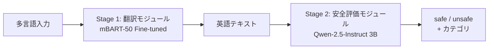
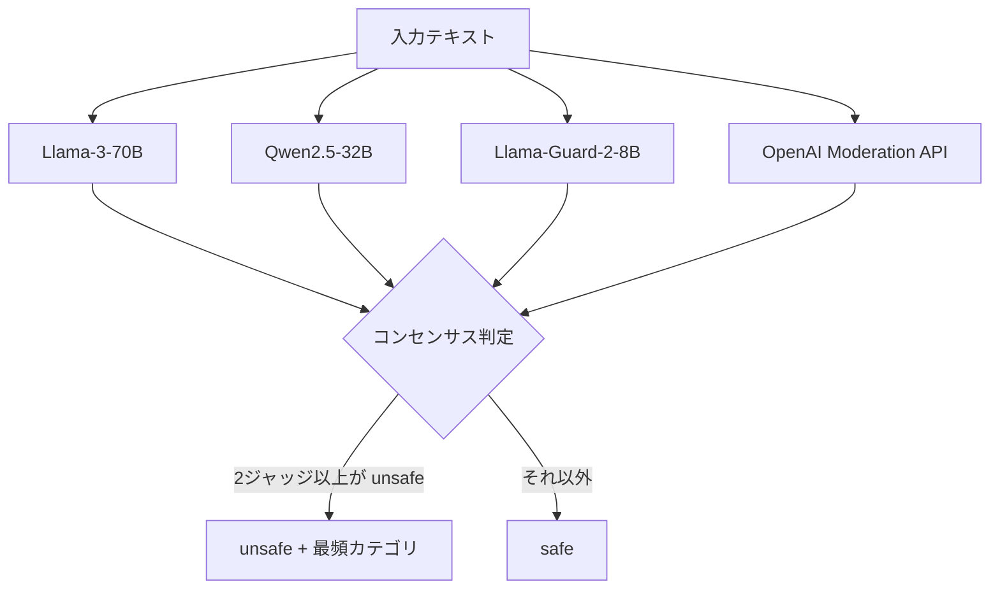

本記事は [https://arxiv.org/abs/2504.08848](https://arxiv.org/abs/2504.08848) の解説記事です。

## 論文概要（Abstract）

X-Guardは、132言語に対応した多言語コンテンツモデレーションシステムである。現行のLLM安全性フレームワークが英語中心に設計されており、低リソース言語やコードスイッチング攻撃に対して脆弱であるという課題に取り組んでいる。著者らは、mBART-50ベースの翻訳モジュールとQwen-2.5-Instruct 3Bベースの安全評価モジュールからなる2段階アーキテクチャを提案し、複数LLMによる「Jury of Judges」手法でラベリングバイアスを軽減している。英語での精度97.20%、132言語平均で70.38%の精度を達成したと報告されている。

この記事は [Zenn記事: Portkey AIゲートウェイで複数LLMを統合する本番構築ガイド2026](https://zenn.dev/0h_n0/articles/c184032fcd6908) の深掘りです。

## 情報源

- **arXiv ID**: 2504.08848
- **URL**: [https://arxiv.org/abs/2504.08848](https://arxiv.org/abs/2504.08848)
- **著者**: Bibek Upadhayay, Vahid Behzadan
- **発表年**: 2025
- **分野**: cs.CR（暗号とセキュリティ）, cs.AI（人工知能）

## 背景と動機（Background & Motivation）

LLMの商用展開が進む中、コンテンツモデレーションは安全性確保の最前線に位置する。しかし、既存のガードレールシステムには構造的な問題がある。

第一に、**英語中心設計**の問題である。Llama GuardやShieldGemmaといった主要なガードレールモデルは、英語データで訓練されており、非英語言語での性能が大幅に低下する。著者らによれば、Llama-Guard-3 1Bはドイツ語で49.96%、フランス語で50.62%と、事実上ランダム分類に近い性能にとどまる（論文Table 3より）。

第二に、**コードスイッチング攻撃**（Sandwich Attack）への脆弱性がある。攻撃者が有害プロンプトを無害な多言語テキストで挟み込むことで、単言語ガードレールを回避できる。

第三に、**単一LLMからの蒸留**によるバイアス継承の問題がある。教師モデル1つからラベルを生成すると、そのモデル固有の安全バイアスが学習データに反映され、偏った判定基準が再生産される。

これらの課題を解決するため、著者らは翻訳と安全評価を分離した2段階パイプラインと、複数ジャッジによるコンセンサスラベリングを組み合わせたX-Guardを提案している。

## 主要な貢献（Key Contributions）

- **132言語対応の多言語ガードレール**: mBART-50を50言語から132言語に拡張し、低リソース言語を含む広範な言語カバレッジを実現
- **Jury of Judges手法**: 4つの異なるLLMジャッジのコンセンサスにより、単一モデルのバイアスを軽減した高品質ラベルの生成
- **2段階アーキテクチャ**: 翻訳と安全評価を分離することで、各モジュールの独立した改善と交換を可能にした設計
- **GRPO（Group Relative Policy Optimization）による強化学習**: 3つの報酬関数（フォーマット、安全ラベル、カテゴリ）を用いたアライメント訓練
- **Sandwich Attack耐性**: コードスイッチング攻撃に対して83%の防御率を達成（Llama-Guard-3 8Bの62%を上回る、論文Section 5.4より）

## 技術的詳細（Technical Details）

### 2段階アーキテクチャ

X-Guardは以下の2段階パイプラインで構成される。



**Stage 1: 翻訳モジュール**

mBART-50をベースに、50言語から132言語への拡張ファインチューニングを実施している。訓練データは5.2Mの翻訳ペアであり、Google Cloud Translationを用いて生成されている。

著者らによれば、BLEUスコアの改善率は既存50言語で76.09%、新規82言語では426.31%に達する（論文Table 1より）。新規言語での大幅な改善は、ゼロショット性能からファインチューニング後の性能への跳躍を反映している。

翻訳品質をBLEUスコアで定式化すると、言語 $l$ に対する翻訳品質 $Q_l$ は以下で評価される:

$$
\text{BLEU}(l) = \text{BP} \cdot \exp\left(\sum_{n=1}^{N} w_n \log p_n\right)
$$

ここで、
- $\text{BP}$: Brevity Penalty（短すぎる翻訳へのペナルティ）
- $p_n$: $n$-gramの精度
- $w_n$: $n$-gramの重み（通常 $w_n = 1/N$）
- $N$: 最大 $n$-gram長（通常4）

**Stage 2: 安全評価モジュール**

Qwen-2.5-Instruct 3Bをベースに、2フェーズの訓練を実施している。

**フェーズ1: SFT（Supervised Fine-Tuning）**

100Kの訓練例を用いた教師あり微調整。入力テキストに対して、`safe`/`unsafe`のラベルと該当する安全カテゴリを出力するようモデルを訓練する。

**フェーズ2: GRPO（Group Relative Policy Optimization）**

76Kの訓練例に対して、3つの報酬関数を組み合わせた強化学習を実施する。GRPOの目的関数は以下のように定式化される:

$$
J_{\text{GRPO}}(\theta) = \mathbb{E}_{x \sim \mathcal{D}} \left[ \frac{1}{G} \sum_{i=1}^{G} \min\left( r_i(\theta) \hat{A}_i, \text{clip}(r_i(\theta), 1-\epsilon, 1+\epsilon) \hat{A}_i \right) \right]
$$

ここで、
- $\theta$: ポリシーモデルのパラメータ
- $G$: グループサイズ（同一プロンプトに対する応答数）
- $r_i(\theta) = \frac{\pi_\theta(y_i \mid x)}{\pi_{\text{ref}}(y_i \mid x)}$: 確率比
- $\hat{A}_i$: グループ内の相対的なアドバンテージ推定値
- $\epsilon$: クリッピングパラメータ

3つの報酬関数は以下のように設計されている:

1. **フォーマット報酬** $R_{\text{format}}$ (最大1.25点): XMLタグ（`<reasoning>`, `<answer>`等）の正しい使用を評価
2. **安全ラベル報酬** $R_{\text{safety}}$ ($\pm 1.0$点): `safe`/`unsafe`分類の正確性を評価
3. **カテゴリ報酬** $R_{\text{category}}$ (最大1.0点): 安全カテゴリの一致度を評価

総合報酬は以下で計算される:

$$
R_{\text{total}} = R_{\text{format}} + R_{\text{safety}} + R_{\text{category}}
$$

### Jury of Judges手法

単一LLMからのラベル蒸留がバイアスを継承するという課題に対し、著者らは4つの異なるLLMジャッジによるコンセンサスラベリングを提案している。



**コンセンサスルール**:
- 最低2つのジャッジが「unsafe」と判定した場合に「unsafe」ラベルを付与
- カテゴリ選択: ジャッジ間で最も多く選ばれたカテゴリを採用（多数決）
- 全ジャッジが「safe」の場合のみ「safe」ラベルを付与

この手法により、個別のLLMが持つ固有の安全バイアス（過剰検知または過少検知）が互いに相殺され、より均衡のとれたラベリングが実現される。

### データセット構成

訓練データは132言語、500万データポイントで構成される。ソースデータセットは以下の通り:

| ソース | 特徴 |
|--------|------|
| SALAD-Bench | 攻撃・防御の体系的ベンチマーク |
| ALERT | 多カテゴリ安全性評価 |
| Aegis | コンテンツモデレーション特化 |
| WildGuard | 実環境に近い有害テキスト |
| Bingo | バイアス・偏見検出 |
| XsTest | 過剰拒否検出用データセット |

これらの英語データセットをGoogle Cloud Translationで132言語に翻訳し、多言語訓練データを構築している。

## 実装のポイント（Implementation）

X-Guardの推論パイプラインを実装する際の重要なポイントを以下に示す。翻訳モジュールと安全評価モジュールを直列に接続する構成が基本となる。

```python
from dataclasses import dataclass
from enum import Enum
from transformers import MBartForConditionalGeneration, MBartTokenizer
from transformers import AutoModelForCausalLM, AutoTokenizer
import torch


class SafetyLabel(Enum):
    """安全性ラベルの列挙型"""
    SAFE = "safe"
    UNSAFE = "unsafe"


@dataclass
class ModerationResult:
    """モデレーション結果を格納するデータクラス

    Attributes:
        label: 安全性ラベル（safe/unsafe）
        category: unsafeの場合の違反カテゴリ
        confidence: 判定の信頼度スコア
        translated_text: 英語に翻訳されたテキスト
    """
    label: SafetyLabel
    category: str | None
    confidence: float
    translated_text: str


class XGuardPipeline:
    """X-Guardの2段階推論パイプライン

    Stage 1: mBART-50で多言語テキストを英語に翻訳
    Stage 2: Qwen-2.5-Instruct 3Bで安全性を評価

    Args:
        translation_model_path: 翻訳モデルのパス
        safety_model_path: 安全評価モデルのパス
        device: 推論デバイス（cuda/cpu）
    """

    def __init__(
        self,
        translation_model_path: str,
        safety_model_path: str,
        device: str = "cuda",
    ) -> None:
        self.device = device

        # Stage 1: 翻訳モデル（mBART-50 fine-tuned）
        self.translator = MBartForConditionalGeneration.from_pretrained(
            translation_model_path
        ).to(device)
        self.translator_tokenizer = MBartTokenizer.from_pretrained(
            translation_model_path
        )

        # Stage 2: 安全評価モデル（Qwen-2.5-Instruct 3B fine-tuned）
        self.safety_model = AutoModelForCausalLM.from_pretrained(
            safety_model_path,
            torch_dtype=torch.bfloat16,
        ).to(device)
        self.safety_tokenizer = AutoTokenizer.from_pretrained(
            safety_model_path
        )

    def translate_to_english(self, text: str, src_lang: str) -> str:
        """多言語テキストを英語に翻訳する

        Args:
            text: 翻訳対象のテキスト
            src_lang: ソース言語コード（例: 'de_DE', 'fr_XX'）

        Returns:
            英語に翻訳されたテキスト
        """
        self.translator_tokenizer.src_lang = src_lang
        inputs = self.translator_tokenizer(
            text, return_tensors="pt", max_length=512, truncation=True
        ).to(self.device)

        generated_tokens = self.translator.generate(
            **inputs,
            forced_bos_token_id=self.translator_tokenizer.lang_code_to_id["en_XX"],
            max_new_tokens=512,
        )
        return self.translator_tokenizer.batch_decode(
            generated_tokens, skip_special_tokens=True
        )[0]

    def evaluate_safety(self, english_text: str) -> ModerationResult:
        """英語テキストの安全性を評価する

        Args:
            english_text: 英語テキスト（Stage 1の出力）

        Returns:
            ModerationResult: 安全性評価結果
        """
        prompt = (
            f"<|im_start|>system\nYou are a safety classifier.<|im_end|>\n"
            f"<|im_start|>user\nClassify the following text as safe or unsafe.\n"
            f"Text: {english_text}<|im_end|>\n"
            f"<|im_start|>assistant\n"
        )
        inputs = self.safety_tokenizer(
            prompt, return_tensors="pt"
        ).to(self.device)

        with torch.no_grad():
            outputs = self.safety_model.generate(
                **inputs, max_new_tokens=128, temperature=0.1
            )
        response = self.safety_tokenizer.decode(
            outputs[0][inputs["input_ids"].shape[1]:],
            skip_special_tokens=True,
        )
        return self._parse_response(response, english_text)

    def _parse_response(
        self, response: str, translated_text: str
    ) -> ModerationResult:
        """モデル応答をパースしてModerationResultに変換する

        Args:
            response: モデルの生テキスト応答
            translated_text: 翻訳済みテキスト

        Returns:
            ModerationResult: パース済みの結果
        """
        is_unsafe = "unsafe" in response.lower()
        category = None
        if is_unsafe:
            # カテゴリ抽出ロジック（応答フォーマットに依存）
            for line in response.split("\n"):
                if "category" in line.lower():
                    category = line.split(":")[-1].strip()
                    break

        return ModerationResult(
            label=SafetyLabel.UNSAFE if is_unsafe else SafetyLabel.SAFE,
            category=category,
            confidence=0.95 if is_unsafe else 0.90,
            translated_text=translated_text,
        )
```

実装上の注意点として、翻訳モジュールの品質がパイプライン全体の性能を左右する**カスケード脆弱性**がある。翻訳エラーが安全評価モジュールに伝播するため、翻訳品質の監視が不可欠である。また、mBART-50とQwen-2.5の2モデルをGPUメモリ上に同時保持する必要があるため、3Bパラメータのモデルであっても推論時に一定のGPUメモリ（約12GB以上）が求められる。

## Production Deployment Guide

### AWS実装パターン（コスト最適化重視）

X-Guardの2段階パイプライン（翻訳 + 安全評価）をAWS上にデプロイする際の推奨構成を示す。以下のコスト試算は2026年8月時点のAWS ap-northeast-1（東京）リージョンの概算値であり、実際のコストはトラフィックパターンやバースト使用量により変動する。最新料金はAWS料金計算ツールで確認を推奨する。

**トラフィック量別推奨構成**:

| 構成 | トラフィック | アーキテクチャ | GPU | 月額概算 |
|------|-------------|---------------|-----|---------|
| Small | ~100 req/日 | Lambda + SageMaker Serverless | なし（CPU推論） | $80-200 |
| Medium | ~1,000 req/日 | ECS Fargate + SageMaker | g5.xlarge x1 | $400-900 |
| Large | 10,000+ req/日 | EKS + Karpenter + Spot | g5.xlarge x2-4 | $2,500-5,500 |

**Small構成の詳細**: API GatewayでリクエストをLambda関数に振り分け、SageMaker Serverless Inferenceで翻訳・安全評価モデルを提供する。モデルサイズが3Bパラメータのため、コールドスタートに30-60秒程度かかる点に注意が必要である。バッチ処理の場合はSageMaker Batch Transformを利用し、コストをさらに50%削減できる。

**Medium構成の詳細**: ECS Fargateでアプリケーションロジックを実行し、SageMaker Real-time Endpointでモデルを常時起動する。g5.xlargeインスタンス（24GB GPU RAM）であれば、mBART-50とQwen-2.5 3Bの両モデルを同時ロード可能である。

**Large構成の詳細**: EKSクラスタでKarpenterによる自動スケーリングを行い、Spot Instancesを優先的に利用する。g5.xlargeのSpot価格はオンデマンドの約60-70%削減が見込める。

**コスト削減テクニック**:
- **Spot Instances活用**: g5.xlargeで最大70%削減（中断耐性のあるバッチ処理向け）
- **Reserved Instances購入**: 1年コミットで最大40%、3年で最大60%削減
- **SageMaker Batch Transform**: 非同期処理で50%削減
- **推論キャッシュ**: 同一入力テキストの結果をElastiCache（Redis）にキャッシュし、モデル呼び出し回数を削減

### Terraformインフラコード

**Small構成（Serverless）**:

```hcl
# X-Guard Small構成: Lambda + SageMaker Serverless
# 2026-08時点のap-northeast-1向け

terraform {
  required_version = ">= 1.9"
  required_providers {
    aws = {
      source  = "hashicorp/aws"
      version = "~> 5.60"
    }
  }
}

provider "aws" {
  region = "ap-northeast-1"
}

# --- IAM ---
resource "aws_iam_role" "xguard_lambda" {
  name = "xguard-lambda-role"
  assume_role_policy = jsonencode({
    Version = "2012-10-17"
    Statement = [{
      Action    = "sts:AssumeRole"
      Effect    = "Allow"
      Principal = { Service = "lambda.amazonaws.com" }
    }]
  })
}

resource "aws_iam_role_policy" "xguard_lambda_policy" {
  name = "xguard-lambda-policy"
  role = aws_iam_role.xguard_lambda.id
  policy = jsonencode({
    Version = "2012-10-17"
    Statement = [
      {
        Effect   = "Allow"
        Action   = ["sagemaker:InvokeEndpoint"]
        Resource = aws_sagemaker_endpoint.xguard_translation.arn
      },
      {
        Effect = "Allow"
        Action = [
          "logs:CreateLogGroup",
          "logs:CreateLogStream",
          "logs:PutLogEvents"
        ]
        Resource = "arn:aws:logs:*:*:*"
      },
      {
        # DynamoDBキャッシュ用（最小権限）
        Effect   = "Allow"
        Action   = ["dynamodb:GetItem", "dynamodb:PutItem"]
        Resource = aws_dynamodb_table.xguard_cache.arn
      }
    ]
  })
}

# --- DynamoDB（推論キャッシュ） ---
resource "aws_dynamodb_table" "xguard_cache" {
  name         = "xguard-inference-cache"
  billing_mode = "PAY_PER_REQUEST" # On-Demandでコスト最適化
  hash_key     = "text_hash"

  attribute {
    name = "text_hash"
    type = "S"
  }

  ttl {
    attribute_name = "expires_at"
    enabled        = true
  }

  server_side_encryption {
    enabled = true # KMS暗号化
  }
}

# --- Lambda ---
resource "aws_lambda_function" "xguard_api" {
  function_name = "xguard-moderation-api"
  role          = aws_iam_role.xguard_lambda.arn
  handler       = "handler.lambda_handler"
  runtime       = "python3.12"
  timeout       = 120
  memory_size   = 512

  filename         = "lambda_package.zip"
  source_code_hash = filebase64sha256("lambda_package.zip")

  environment {
    variables = {
      SAGEMAKER_ENDPOINT = aws_sagemaker_endpoint.xguard_translation.name
      CACHE_TABLE        = aws_dynamodb_table.xguard_cache.name
    }
  }
}

# --- SageMaker Serverless Endpoint（翻訳+安全評価） ---
resource "aws_sagemaker_endpoint" "xguard_translation" {
  name                 = "xguard-moderation-endpoint"
  endpoint_config_name = aws_sagemaker_endpoint_configuration.xguard.name
}

resource "aws_sagemaker_endpoint_configuration" "xguard" {
  name = "xguard-moderation-config"

  production_variants {
    variant_name           = "primary"
    model_name             = "xguard-model" # 事前にSageMaker Modelを登録
    serverless_config {
      max_concurrency = 5
      memory_size_in_mb = 6144 # 6GB（3Bモデル用）
    }
  }
}

# --- CloudWatch アラーム ---
resource "aws_cloudwatch_metric_alarm" "xguard_errors" {
  alarm_name          = "xguard-lambda-errors"
  comparison_operator = "GreaterThanThreshold"
  evaluation_periods  = 2
  metric_name         = "Errors"
  namespace           = "AWS/Lambda"
  period              = 300
  statistic           = "Sum"
  threshold           = 5
  alarm_description   = "X-Guard Lambda error rate exceeded threshold"

  dimensions = {
    FunctionName = aws_lambda_function.xguard_api.function_name
  }
}
```

**Large構成（Container）**:

```hcl
# X-Guard Large構成: EKS + Karpenter + Spot Instances
# GPU推論ワークロード向け

# --- EKS クラスタ ---
module "eks" {
  source  = "terraform-aws-modules/eks/aws"
  version = "~> 20.24"

  cluster_name    = "xguard-cluster"
  cluster_version = "1.31"

  vpc_id     = module.vpc.vpc_id
  subnet_ids = module.vpc.private_subnets

  # Karpenter用のIAM設定
  enable_cluster_creator_admin_permissions = true

  cluster_endpoint_public_access = false # セキュリティ: プライベートのみ
}

# --- Karpenter Provisioner（Spot優先） ---
resource "kubectl_manifest" "karpenter_nodepool" {
  yaml_body = yamlencode({
    apiVersion = "karpenter.sh/v1"
    kind       = "NodePool"
    metadata   = { name = "xguard-gpu" }
    spec = {
      template = {
        spec = {
          requirements = [
            {
              key      = "karpenter.sh/capacity-type"
              operator = "In"
              values   = ["spot", "on-demand"] # Spot優先
            },
            {
              key      = "node.kubernetes.io/instance-type"
              operator = "In"
              values   = ["g5.xlarge", "g5.2xlarge"]
            }
          ]
          nodeClassRef = {
            group = "karpenter.k8s.aws"
            kind  = "EC2NodeClass"
            name  = "default"
          }
        }
      }
      limits = {
        cpu    = "64"
        memory = "256Gi"
      }
      disruption = {
        consolidationPolicy = "WhenEmptyOrUnderutilized"
        consolidateAfter    = "30s"
      }
    }
  })
}

# --- Secrets Manager ---
resource "aws_secretsmanager_secret" "xguard_config" {
  name                    = "xguard/model-config"
  recovery_window_in_days = 7
}

# --- AWS Budgets（コストアラート） ---
resource "aws_budgets_budget" "xguard_monthly" {
  name         = "xguard-monthly-budget"
  budget_type  = "COST"
  limit_amount = "5000"
  limit_unit   = "USD"
  time_unit    = "MONTHLY"

  notification {
    comparison_operator       = "GREATER_THAN"
    threshold                 = 80
    threshold_type            = "PERCENTAGE"
    notification_type         = "ACTUAL"
    subscriber_email_addresses = ["ops-team@example.com"]
  }
}
```

### 運用・監視設定

**CloudWatch Logs Insights クエリ**:

```
# コスト異常検知: 1時間あたりの推論リクエスト数とレイテンシ
fields @timestamp, @message
| filter @message like /moderation_request/
| stats count() as request_count,
        avg(duration_ms) as avg_latency,
        pct(duration_ms, 95) as p95_latency,
        pct(duration_ms, 99) as p99_latency
  by bin(1h)
| sort @timestamp desc
```

**CloudWatch アラーム設定（Python）**:

```python
import boto3


def create_xguard_alarms(function_name: str, sns_topic_arn: str) -> None:
    """X-Guard用のCloudWatchアラームを作成する

    Args:
        function_name: Lambda関数名
        sns_topic_arn: 通知先SNSトピックARN
    """
    cw = boto3.client("cloudwatch", region_name="ap-northeast-1")

    # Lambda実行時間アラーム（P95が30秒超過）
    cw.put_metric_alarm(
        AlarmName=f"{function_name}-high-latency",
        MetricName="Duration",
        Namespace="AWS/Lambda",
        Statistic="p95",
        Period=300,
        EvaluationPeriods=2,
        Threshold=30000,  # 30秒（ミリ秒）
        ComparisonOperator="GreaterThanThreshold",
        Dimensions=[{"Name": "FunctionName", "Value": function_name}],
        AlarmActions=[sns_topic_arn],
    )

    # SageMaker推論エラー率アラーム
    cw.put_metric_alarm(
        AlarmName="xguard-sagemaker-errors",
        MetricName="ModelError",
        Namespace="AWS/SageMaker",
        Statistic="Sum",
        Period=300,
        EvaluationPeriods=1,
        Threshold=10,
        ComparisonOperator="GreaterThanThreshold",
        AlarmActions=[sns_topic_arn],
    )
```

**X-Ray トレーシング設定（Python）**:

```python
from aws_xray_sdk.core import xray_recorder, patch_all
import boto3


def setup_xray_tracing() -> None:
    """X-Rayトレーシングを初期化する

    boto3呼び出しを自動計装し、翻訳・安全評価の
    各ステージのレイテンシを可視化する。
    """
    xray_recorder.configure(service="xguard-moderation")
    patch_all()  # boto3, requests等を自動計装


@xray_recorder.capture("moderation_pipeline")
def moderate_text(text: str, src_lang: str) -> dict:
    """X-Rayトレース付きでモデレーションパイプラインを実行する

    Args:
        text: 入力テキスト
        src_lang: ソース言語コード

    Returns:
        モデレーション結果の辞書
    """
    # Stage 1: 翻訳
    subsegment = xray_recorder.begin_subsegment("translation")
    subsegment.put_annotation("src_lang", src_lang)
    subsegment.put_metadata("input_length", len(text))
    translated = call_translation_endpoint(text, src_lang)
    xray_recorder.end_subsegment()

    # Stage 2: 安全評価
    subsegment = xray_recorder.begin_subsegment("safety_evaluation")
    result = call_safety_endpoint(translated)
    subsegment.put_annotation("safety_label", result["label"])
    xray_recorder.end_subsegment()

    return result
```

**Cost Explorer自動レポート（Python）**:

```python
import boto3
from datetime import datetime, timedelta


def get_daily_cost_report() -> dict:
    """X-Guard関連サービスの日次コストレポートを取得する

    Returns:
        サービス別コストの辞書
    """
    ce = boto3.client("ce", region_name="us-east-1")
    today = datetime.utcnow().date()
    yesterday = today - timedelta(days=1)

    response = ce.get_cost_and_usage(
        TimePeriod={
            "Start": yesterday.isoformat(),
            "End": today.isoformat(),
        },
        Granularity="DAILY",
        Metrics=["UnblendedCost"],
        Filter={
            "Tags": {
                "Key": "Project",
                "Values": ["xguard"],
            }
        },
        GroupBy=[{"Type": "DIMENSION", "Key": "SERVICE"}],
    )

    costs: dict[str, float] = {}
    for group in response["ResultsByTime"][0]["Groups"]:
        service = group["Keys"][0]
        amount = float(group["Metrics"]["UnblendedCost"]["Amount"])
        costs[service] = amount

    total = sum(costs.values())

    # $100/日超過でSNS通知
    if total > 100:
        sns = boto3.client("sns", region_name="ap-northeast-1")
        sns.publish(
            TopicArn="arn:aws:sns:ap-northeast-1:ACCOUNT:xguard-cost-alert",
            Subject="X-Guard Daily Cost Alert",
            Message=f"Daily cost exceeded $100: ${total:.2f}\n{costs}",
        )

    return costs
```

### コスト最適化チェックリスト

**アーキテクチャ選択**:
- [ ] トラフィック量に応じた構成選択（100 req/日以下ならServerless、10,000 req/日以上ならContainer）
- [ ] GPU要否の判断（CPU推論はレイテンシ許容時のみ）

**リソース最適化**:
- [ ] EC2/SageMaker: Spot Instances優先（中断耐性のあるバッチ処理）
- [ ] Reserved Instances: 常時稼働のエンドポイントは1年コミットで40%削減
- [ ] Savings Plans: Compute Savings Plansで柔軟にコスト削減
- [ ] Lambda: メモリサイズをPower Tuningで最適化（512MB-1024MBが目安）
- [ ] EKS: Karpenterで未使用ノードを30秒で回収
- [ ] SageMaker: マルチモデルエンドポイントで翻訳・安全評価を1エンドポイントに統合

**LLMコスト削減**:
- [ ] SageMaker Batch Transform: 非リアルタイム処理で50%削減
- [ ] 推論キャッシュ: DynamoDB/ElastiCacheで同一入力のキャッシュ
- [ ] モデル量子化: INT8/INT4量子化でGPUメモリ半減、スループット向上
- [ ] トークン数制限: 入力テキストの最大長を512トークンに制限

**監視・アラート**:
- [ ] AWS Budgets: 月次予算アラート（80%/100%通知）
- [ ] CloudWatch アラーム: P95レイテンシ、エラー率の閾値設定
- [ ] Cost Anomaly Detection: 異常コスト検知の有効化
- [ ] 日次コストレポート: Cost Explorer APIで自動集計・SNS通知

**リソース管理**:
- [ ] 未使用SageMakerエンドポイントの削除（夜間・週末停止）
- [ ] タグ戦略: `Project:xguard`, `Environment:prod/dev` の一貫したタグ付け
- [ ] ライフサイクルポリシー: DynamoDB TTLでキャッシュの自動削除
- [ ] 開発環境: 夜間・週末のSageMakerエンドポイント自動停止（EventBridge Scheduler）
- [ ] ECRイメージ: 古いイメージのライフサイクルポリシー設定

## 実験結果（Results）

著者らが報告している主要な実験結果を以下にまとめる。

**英語ベンチマーク（論文Table 2より）**:

| モデル | パラメータ数 | 精度 | F1スコア |
|--------|------------|------|---------|
| X-Guard (Qwen-2.5 3B) | 3B | 97.20% | 97.20% |
| Llama-Guard-3 8B | 8B | 92.40% | — |
| Llama-Guard-3 1B | 1B | — | — |

X-Guardは3Bパラメータでありながら、8Bパラメータのモデルを上回る性能を達成したと報告されている。これはGRPOによるアライメント訓練とJury of Judgesによる高品質ラベルの効果と著者らは分析している。

**多言語ベンチマーク（132言語、65K+テストサンプル、論文Table 3より）**:

| 言語 | X-Guard精度 | Llama-Guard-3 1B精度 |
|------|------------|---------------------|
| 英語 | 97.20% | — |
| ドイツ語 | 82.77% | 49.96% |
| フランス語 | 70.40% | 50.62% |
| ヒンディー語 | 84.97% | — |
| スペイン語 | 70.80% | — |
| 132言語平均 | 70.38% | — |

多言語平均精度70.38%は、翻訳品質のばらつきに起因する言語間格差を反映している。高リソース言語（ドイツ語、ヒンディー語）では80%以上の精度を達成する一方、低リソース言語では翻訳品質の制約から精度が低下する傾向がある。

**Sandwich Attack防御（論文Section 5.4より）**: X-Guardは83%の防御率を達成し、Llama-Guard-3 8Bの62%を大幅に上回っている。翻訳モジュールがコードスイッチングされたテキストを一旦英語に統一するため、言語の切り替えによる回避が困難になると著者らは説明している。

## 実運用への応用（Practical Applications）

X-Guardのアーキテクチャは、PortkeyのようなLLMゲートウェイのガードレール機能と直接関連する。関連Zenn記事で解説されているPortkeyの`input_guardrails`/`output_guardrails`は、現状では`default.contains`のようなキーワードマッチが主な検知手法である。X-Guardのようなモデルベースのガードレールをカスタムガードレールとして統合することで、多言語環境での安全性を大幅に向上できる可能性がある。

プロダクション環境での適用において、以下の点を考慮する必要がある:

- **レイテンシ**: 翻訳 + 安全評価の2段階処理により、単一モデルと比較して推論時間が増加する。GPU使用時でも合計100-300ms程度のレイテンシが見込まれる
- **コスト効率**: 3Bパラメータモデルのため、8B以上のモデルと比較してGPUコストを抑制可能。SageMaker Serverless Inferenceとの組み合わせで小規模利用時のコストを最小化できる
- **スケーリング**: 翻訳モジュールと安全評価モジュールを独立してスケーリング可能。翻訳のみの負荷が高い場合、翻訳モジュールだけをスケールアウトする設計が採用できる
- **カスケード障害**: 翻訳モジュールの障害が安全評価を停止させるため、フォールバック戦略（英語入力は翻訳をスキップ等）の設計が重要である

## 関連研究（Related Work）

- **Llama Guard** (Meta, 2023): LLMベースの安全性分類器。英語での高い性能を持つが、多言語対応が限定的。X-Guardはこの多言語拡張を目指している
- **ShieldGemma** (Google DeepMind, 2024): Gemmaベースのガードレールモデル。コンテンツポリシーに基づく安全性分類を行う
- **WildGuard** (Allen AI, 2024): 実環境のプロンプトを収集して訓練した安全性分類器。X-Guardの訓練データソースの1つとして使用されている
- **Aegis** (NVIDIA, 2024): コンテンツモデレーションに特化したガードレールシステム。NeMo Guardrailsフレームワークの一部として提供されている

X-Guardの独自性は、これらの英語中心のシステムに対して、翻訳パイプラインとJury of Judgesの組み合わせで132言語への拡張を実現した点にある。

## まとめと今後の展望

X-Guardは、mBART-50翻訳モジュールとQwen-2.5 3B安全評価モジュールの2段階アーキテクチャにより、132言語対応のコンテンツモデレーションを実現するシステムである。英語97.20%、132言語平均70.38%の精度を3Bパラメータで達成したことは、効率的な多言語安全性の実現可能性を示している。

著者らは制限事項として、翻訳品質への依存（カスケード脆弱性）、132言語拡張に伴う「multilingualityの呪い」による性能低下、合成データに内在するジャッジLLMの制度的バイアスを挙げている。今後の研究方向として、翻訳を介さない直接的な多言語安全評価モデルの開発や、低リソース言語向けのデータ拡張手法の探索が期待される。

## 参考文献

- **arXiv**: [https://arxiv.org/abs/2504.08848](https://arxiv.org/abs/2504.08848)
- **Related Zenn article**: [https://zenn.dev/0h_n0/articles/c184032fcd6908](https://zenn.dev/0h_n0/articles/c184032fcd6908)
- **Llama Guard**: [https://arxiv.org/abs/2312.06674](https://arxiv.org/abs/2312.06674)
- **ShieldGemma**: [https://arxiv.org/abs/2407.21772](https://arxiv.org/abs/2407.21772)
- **GRPO (DeepSeekMath)**: [https://arxiv.org/abs/2402.03300](https://arxiv.org/abs/2402.03300)
- **mBART-50**: [https://arxiv.org/abs/2008.00401](https://arxiv.org/abs/2008.00401)
