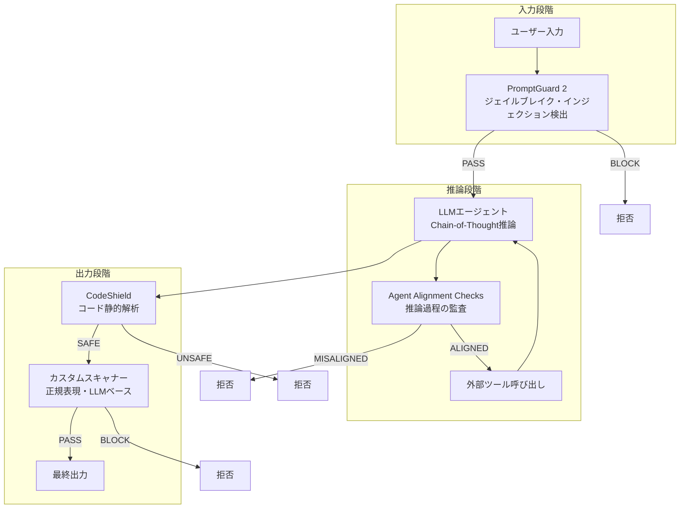

本記事は [https://arxiv.org/abs/2505.03574](https://arxiv.org/abs/2505.03574) の解説記事です。

## 論文概要（Abstract）

著者らは、LLMベースのAIエージェントが複雑なタスクを自律的に実行する能力を獲得する一方で、プロンプトインジェクション、ゴールハイジャック、安全でないコード生成といったセキュリティリスクが深刻化していると指摘している。本論文では、これらの脅威に対する包括的なオープンソースのガードレールシステムであるLlamaFirewallを提案する。LlamaFirewallは、PromptGuard 2（入力フィルタリング）、Agent Alignment Checks（推論過程の監査）、CodeShield（コード安全性の静的解析）の3つのコアコンポーネントで構成され、AIエージェントパイプラインの複数のポイントでリアルタイムにセキュリティチェックを実施する。

この記事は [Zenn記事: OWASP×NISTで体系化するプロンプトインジェクション：攻撃分類とリスク評価](https://zenn.dev/0h_n0/articles/cd7ffbe0cec21e) の深掘りです。

## 情報源

- **arXiv ID**: 2505.03574
- **URL**: [https://arxiv.org/abs/2505.03574](https://arxiv.org/abs/2505.03574)
- **著者**: Sahana Chennabasappa, Cyrus Nikolaidis, Daniel Song, David Molnar et al.（Meta、19名）
- **発表年**: 2025
- **分野**: cs.CR, cs.AI

## 背景と動機（Background & Motivation）

著者らは、LLMの能力向上に伴いAIエージェントが外部ツール呼び出し、コード生成、マルチステップ推論を含む複雑なワークフローを実行するようになったことで、攻撃面（attack surface）が従来のLLMアプリケーションと比較して大幅に拡大していると指摘している。

従来のガードレールアプローチには3つの構造的な課題がある。第一に、入力・出力のフィルタリングのみに依存するシステムでは、エージェントの中間推論過程で発生するゴールドリフト（目標の逸脱）やプロンプトインジェクションの伝播を検出できない。第二に、コーディングエージェントが生成するコードの安全性をリアルタイムで検証する仕組みが欠如している。第三に、組織固有のセーフティポリシーをガードレールとして迅速に定義・展開する手段が限られている。

著者らは、これらの課題に対して「最終防御層」（last line of defense）として機能するフレームワークを設計すべきだと主張している。アプリケーション開発者がプロンプトエンジニアリングやRAGの最適化で防御を構築する一方、LlamaFirewallはそれらの防御をすり抜けた攻撃を捕捉するセーフティネットとして機能する。

## 主要な貢献（Key Contributions）

- **PromptGuard 2の開発**: 86Mパラメータの多言語対応分類モデルで、ジェイルブレイクおよびプロンプトインジェクション攻撃を高精度に検出する。PromptGuard 1と比較してF1スコアが大幅に向上し、特に間接的プロンプトインジェクションの検出に優れている
- **Agent Alignment Checksの提案**: エージェントのChain-of-Thought推論を監査するLLMベースの検査機構。入出力のみではなく、エージェントの思考過程そのものを分析することで、ゴールハイジャックや間接的プロンプトインジェクションの影響を検出する
- **CodeShieldの統合**: LLMが生成するコードをリアルタイムで静的解析し、CWE（Common Weakness Enumeration）に基づく脆弱性パターンを検出する。不完全なコードスニペットにも対応可能な設計としている
- **カスタマイズ可能なスキャナーフレームワーク**: 正規表現ベース、LLMベースのカスタムスキャナーを開発者が迅速に追加できるプラグインアーキテクチャを提供する

## 技術的詳細（Technical Details）

### LlamaFirewallのアーキテクチャ

LlamaFirewallは、AIエージェントパイプラインの入力・中間推論・出力の各段階にガードレールを配置するリアルタイム監視フレームワークである。以下のMermaid図は、全体のアーキテクチャとデータフローを示す。



### PromptGuard 2の設計と検出メカニズム

PromptGuard 2は、mDeBERTa-v3-baseアーキテクチャ（86Mパラメータ）をベースとした多言語テキスト分類モデルである。著者らはこのモデルを3クラス分類タスクとして訓練している。

- **Benign（良性）**: 通常のユーザー入力
- **Injection（インジェクション）**: プロンプトインジェクション攻撃
- **Jailbreak（ジェイルブレイク）**: ジェイルブレイク攻撃

著者らは、直接的プロンプトインジェクション（ユーザーがLLMの指示を上書きしようとする攻撃）と間接的プロンプトインジェクション（外部データソースに埋め込まれた悪意ある指示）の両方に対応するよう訓練データを構築している。

モデルの推論時には、入力テキストに対してソフトマックス確率を計算し、閾値ベースの判定を行う。

$$
P(y = c \mid x) = \frac{\exp(z_c)}{\sum_{k \in \{benign, injection, jailbreak\}} \exp(z_k)}
$$

ここで $x$ は入力テキスト、$z_c$ はクラス $c$ に対するロジット値、$P(y = c \mid x)$ はクラス $c$ の事後確率である。閾値 $\tau$ を調整することで、精度と再現率のトレードオフを制御できる。

著者らは、PromptGuard 2がPromptGuard 1と比較して以下の改善を達成したと報告している。間接的インジェクション検出のF1スコアが0.94から0.99に向上し、多言語対応（英語以外の言語）での性能低下が大幅に抑制された。

### Agent Alignment Checksの推論監査メカニズム

Agent Alignment Checksは、エージェントのChain-of-Thought（CoT）推論を監査するLLMベースの検査機構である。著者らは、入出力のフィルタリングだけではエージェントの中間推論過程で発生する攻撃を検出できないと指摘し、推論過程そのものを監査対象とする手法を提案している。

監査のアプローチは以下の通りである。

1. **コンテキスト収集**: エージェントのシステムプロンプト、ユーザーの元のリクエスト、外部ツールからの応答、エージェントの現在のCoT推論を収集する
2. **アライメント判定**: 収集したコンテキストを監査用LLMに入力し、エージェントの推論がユーザーの元の意図と整合しているかを判定する
3. **不整合検出**: ゴールドリフト（ユーザーの意図からの逸脱）、外部データに埋め込まれたインジェクション指示への追従、権限の不正なエスカレーションを検出する

著者らは、この手法が特にマルチステップのエージェントワークフローで有効であると説明している。外部APIやウェブページからの応答に間接的プロンプトインジェクションが含まれている場合、入力段階のPromptGuard 2では検出できないケースがあるが、Agent Alignment Checksはエージェントの推論がその悪意ある指示に従おうとしているかどうかを検出できる。

### CodeShieldの静的解析エンジン

CodeShieldは、LLMが生成するコードをリアルタイムで静的解析し、セキュリティ脆弱性を検出するエンジンである。対応言語はPython、C、C++、JavaScript、TypeScript、Java、Rustの7言語である。

著者らは、CodeShieldの設計において以下の技術的課題に対処している。

**不完全なコードへの対応**: LLMが生成するコードはしばしば不完全なスニペットであり、通常のコンパイラや静的解析ツールではパースできない。CodeShieldはInsecure Code Detector（ICD）を用いて、不完全なコードに対してもCWEパターンマッチングを実行する。

**CWEカバレッジ**: CWE-78（OSコマンドインジェクション）、CWE-79（XSS）、CWE-89（SQLインジェクション）、CWE-502（安全でないデシリアライゼーション）など、主要な脆弱性パターンを検出する。

**ストリーミング対応**: コード生成がストリーミングで行われる場合でも、部分的なコードに対して解析を実行し、脆弱性が検出された時点で生成を中断できる。

### カスタマイズ可能なスキャナー

LlamaFirewallは、開発者が独自のガードレールを迅速に追加できるプラグインアーキテクチャを提供する。以下の2種類のカスタムスキャナーがサポートされている。

**正規表現ベースのスキャナー**: PII（個人情報）の検出、特定のキーワードやパターンのフィルタリングなど、ルールベースのチェックに使用する。

**LLMベースのスキャナー**: カスタムプロンプトとLLMを組み合わせた柔軟なセキュリティチェック。組織固有のポリシー（例: 特定のトピックに関する応答の制限）を定義し、LLMによる判定を行う。

```python
from llamafirewall import LlamaFirewall, ScannerType
from llamafirewall.scanners import RegexScanner, LLMScanner


def create_custom_firewall() -> LlamaFirewall:
    """カスタムスキャナーを含むLlamaFirewallインスタンスを生成する。

    Returns:
        LlamaFirewall: 設定済みのファイアウォールインスタンス
    """
    firewall = LlamaFirewall(
        scanners=[
            ScannerType.PROMPT_GUARD,
            ScannerType.AGENT_ALIGNMENT,
            ScannerType.CODE_SHIELD,
        ]
    )

    # PII検出用の正規表現スキャナーを追加
    pii_scanner = RegexScanner(
        name="pii_detector",
        patterns=[
            r"\b\d{3}-\d{2}-\d{4}\b",  # SSN
            r"\b[A-Za-z0-9._%+-]+@[A-Za-z0-9.-]+\.[A-Z|a-z]{2,}\b",  # Email
        ],
        action="block",
    )
    firewall.add_scanner(pii_scanner)

    return firewall
```

## 実装のポイント（Implementation）

LlamaFirewallの実装において、著者らが強調しているポイントは以下の通りである。

**リアルタイム推論の遅延管理**: PromptGuard 2は86Mパラメータの小型モデルであり、推論レイテンシは数ミリ秒程度に抑えられている。一方、Agent Alignment ChecksはLLM呼び出しを伴うため、数百ミリ秒から数秒のレイテンシが発生する。著者らは、チェックの優先度と非同期実行により、全体のレイテンシを管理することを推奨している。

**閾値の調整**: PromptGuard 2の閾値 $\tau$ は、デプロイ環境に応じて調整が必要である。セキュリティ重視の環境では低い閾値（高再現率）、ユーザー体験重視の環境では高い閾値（高精度）を設定する。著者らは、ROC曲線に基づく閾値選択を推奨している。

**スキャナーの実行順序**: 計算コストの低いスキャナー（正規表現、PromptGuard 2）を先に実行し、コストの高いスキャナー（Agent Alignment Checks、LLMベースカスタムスキャナー）を後に実行することで、不要なLLM呼び出しを削減できる。

**エージェントパイプラインへの統合**: LlamaFirewallは、エージェントの各ステップの前後にフック（hook）として挿入する設計となっている。以下は典型的な統合パターンを示す。

```python
from llamafirewall import LlamaFirewall, UserMessage, AgentMessage, ScanResult


async def agent_step(
    firewall: LlamaFirewall,
    user_input: str,
    agent_reasoning: str,
    generated_code: str | None = None,
) -> ScanResult:
    """エージェントの各ステップでLlamaFirewallによるチェックを実行する。

    Args:
        firewall: LlamaFirewallインスタンス
        user_input: ユーザーの入力テキスト
        agent_reasoning: エージェントのChain-of-Thought推論
        generated_code: エージェントが生成したコード（任意）

    Returns:
        ScanResult: スキャン結果（PASS/BLOCK）
    """
    # 入力段階: PromptGuard 2によるインジェクション検出
    input_result = await firewall.scan(
        UserMessage(content=user_input),
        scanners=["prompt_guard"],
    )
    if input_result.decision == "BLOCK":
        return input_result

    # 推論段階: Agent Alignment Checksによる推論監査
    reasoning_result = await firewall.scan(
        AgentMessage(
            content=agent_reasoning,
            original_user_request=user_input,
        ),
        scanners=["agent_alignment"],
    )
    if reasoning_result.decision == "BLOCK":
        return reasoning_result

    # 出力段階: CodeShieldによるコード安全性チェック
    if generated_code is not None:
        code_result = await firewall.scan(
            AgentMessage(content=generated_code),
            scanners=["code_shield"],
        )
        return code_result

    return ScanResult(decision="PASS")
```

## Production Deployment Guide

### AWS実装パターン（コスト最適化重視）

LlamaFirewallの3コンポーネント（PromptGuard 2、Agent Alignment Checks、CodeShield）をAWSで運用する場合の推奨構成を示す。PromptGuard 2は86Mパラメータの推論モデルを必要とし、Agent Alignment ChecksはLLM呼び出しを伴うため、構成選定はこれらの計算要件に依存する。

**コスト試算の注意事項**: 以下は2026年8月時点のAWS ap-northeast-1（東京）リージョン料金に基づく概算値である。実際のコストはトラフィックパターン、リージョン、バースト使用量により変動する。最新料金はAWS料金計算ツールで確認を推奨する。

| 構成 | トラフィック | 主要サービス | 月額概算 |
|------|-------------|-------------|---------|
| Small | ~100 req/日 | Lambda + SageMaker Endpoint (PromptGuard 2) + DynamoDB | $50-150 |
| Medium | ~1,000 req/日 | ECS Fargate + SageMaker + ElastiCache | $300-800 |
| Large | 10,000+ req/日 | EKS + GPU Instances (PromptGuard 2推論) + Karpenter | $2,000-5,000 |

**Small構成の詳細**:
- Lambda（スキャンリクエストのルーティング + CodeShield実行）: 512MB、タイムアウト60秒
- SageMaker Serverless Endpoint（PromptGuard 2推論）: ml.g5.xlargeベースのサーバーレス
- DynamoDB On-Demand（スキャン結果ログ、カスタムスキャナー設定の永続化）
- Bedrock（Agent Alignment ChecksのLLM推論）: Claude Sonnet

**Large構成の詳細**:
- EKSクラスタ + Karpenter（Spot優先で最大90%削減）
- GPU Instances（PromptGuard 2の高スループット推論）: g5.xlarge Spot
- ElastiCache Redis Cluster（スキャン結果キャッシュ、レート制限管理）
- Application Load Balancer（スキャンリクエストのルーティング）
- Bedrock / SageMaker Endpoint（Agent Alignment Checks用LLM）

**コスト削減テクニック**:
- Spot Instances活用（EKSワーカーノード、GPU推論）で最大90%削減
- Reserved Instances購入（SageMaker Endpoint）で最大72%削減
- Bedrock Batch API使用（非リアルタイムのAgent Alignment Checks）で50%削減
- PromptGuard 2推論のバッチ化（複数リクエストを集約）でGPU利用効率向上

### Terraformインフラコード

**Small構成（Serverless）: Lambda + SageMaker Serverless + DynamoDB**

```hcl
# --- VPC基盤（VPCエンドポイント活用でNAT Gateway不使用） ---
resource "aws_vpc" "firewall_vpc" {
  cidr_block           = "10.0.0.0/16"
  enable_dns_hostnames = true
  tags = { Name = "llamafirewall-vpc", Project = "llamafirewall" }
}

resource "aws_subnet" "private" {
  count             = 2
  vpc_id            = aws_vpc.firewall_vpc.id
  cidr_block        = "10.0.${count.index + 1}.0/24"
  availability_zone = data.aws_availability_zones.available.names[count.index]
  tags = { Name = "firewall-private-${count.index}" }
}

# --- IAMロール（最小権限） ---
resource "aws_iam_role" "firewall_lambda_role" {
  name = "llamafirewall-lambda-role"
  assume_role_policy = jsonencode({
    Version = "2012-10-17"
    Statement = [{
      Action    = "sts:AssumeRole"
      Effect    = "Allow"
      Principal = { Service = "lambda.amazonaws.com" }
    }]
  })
}

resource "aws_iam_role_policy" "firewall_lambda_policy" {
  name = "llamafirewall-lambda-policy"
  role = aws_iam_role.firewall_lambda_role.id
  policy = jsonencode({
    Version = "2012-10-17"
    Statement = [
      {
        Effect   = "Allow"
        Action   = ["sagemaker:InvokeEndpoint"]
        Resource = aws_sagemaker_endpoint.prompt_guard.arn
      },
      {
        Effect   = "Allow"
        Action   = ["dynamodb:GetItem", "dynamodb:PutItem", "dynamodb:Query"]
        Resource = aws_dynamodb_table.scan_results.arn
      },
      {
        Effect   = "Allow"
        Action   = ["bedrock:InvokeModel"]
        Resource = "arn:aws:bedrock:ap-northeast-1::foundation-model/anthropic.claude-sonnet-*"
      }
    ]
  })
}

# --- SageMaker Serverless Endpoint（PromptGuard 2） ---
resource "aws_sagemaker_endpoint" "prompt_guard" {
  name                 = "promptguard2-endpoint"
  endpoint_config_name = aws_sagemaker_endpoint_configuration.prompt_guard.name
  tags = { Component = "PromptGuard2" }
}

resource "aws_sagemaker_endpoint_configuration" "prompt_guard" {
  name = "promptguard2-config"
  production_variants {
    variant_name           = "default"
    model_name             = aws_sagemaker_model.prompt_guard.name
    serverless_config {
      max_concurrency = 5
      memory_size_in_mb = 4096
    }
  }
}

# --- DynamoDB（スキャン結果ログ） ---
resource "aws_dynamodb_table" "scan_results" {
  name         = "llamafirewall-scan-results"
  billing_mode = "PAY_PER_REQUEST"
  hash_key     = "request_id"
  range_key    = "timestamp"

  attribute {
    name = "request_id"
    type = "S"
  }
  attribute {
    name = "timestamp"
    type = "S"
  }

  server_side_encryption { enabled = true }
  ttl {
    attribute_name = "ttl"
    enabled        = true
  }
  tags = { Component = "ScanLog" }
}

# --- Lambda（スキャンルーティング + CodeShield） ---
resource "aws_lambda_function" "firewall_router" {
  function_name = "llamafirewall-router"
  runtime       = "python3.12"
  handler       = "handler.lambda_handler"
  role          = aws_iam_role.firewall_lambda_role.arn
  memory_size   = 512
  timeout       = 60

  environment {
    variables = {
      PROMPT_GUARD_ENDPOINT = aws_sagemaker_endpoint.prompt_guard.name
      SCAN_LOG_TABLE        = aws_dynamodb_table.scan_results.name
    }
  }
  tags = { Component = "Router" }
}

# --- CloudWatchアラーム（コスト監視） ---
resource "aws_cloudwatch_metric_alarm" "lambda_errors" {
  alarm_name          = "llamafirewall-lambda-errors"
  comparison_operator = "GreaterThanThreshold"
  evaluation_periods  = 2
  metric_name         = "Errors"
  namespace           = "AWS/Lambda"
  period              = 300
  statistic           = "Sum"
  threshold           = 5
  alarm_actions       = [aws_sns_topic.alerts.arn]
  dimensions = { FunctionName = aws_lambda_function.firewall_router.function_name }
}
```

**Large構成（Container）: EKS + GPU Instances + Karpenter**

```hcl
# --- EKSクラスタ ---
module "eks" {
  source          = "terraform-aws-modules/eks/aws"
  version         = "~> 20.0"
  cluster_name    = "llamafirewall-cluster"
  cluster_version = "1.31"
  vpc_id          = aws_vpc.firewall_vpc.id
  subnet_ids      = aws_subnet.private[*].id

  cluster_endpoint_public_access = false
}

# --- Karpenter NodePool（GPU Spot優先） ---
resource "kubectl_manifest" "karpenter_gpu_nodepool" {
  yaml_body = yamlencode({
    apiVersion = "karpenter.sh/v1"
    kind       = "NodePool"
    metadata   = { name = "promptguard-gpu-workers" }
    spec = {
      template = {
        spec = {
          requirements = [
            { key = "karpenter.sh/capacity-type", operator = "In", values = ["spot", "on-demand"] },
            { key = "node.kubernetes.io/instance-type", operator = "In",
              values = ["g5.xlarge", "g5.2xlarge", "g6.xlarge"] }
          ]
          taints = [{ key = "nvidia.com/gpu", value = "true", effect = "NoSchedule" }]
        }
      }
      limits   = { cpu = "64", memory = "256Gi", "nvidia.com/gpu" = "8" }
      disruption = { consolidationPolicy = "WhenEmptyOrUnderutilized" }
    }
  })
}

# --- Karpenter NodePool（CPUワーカー） ---
resource "kubectl_manifest" "karpenter_cpu_nodepool" {
  yaml_body = yamlencode({
    apiVersion = "karpenter.sh/v1"
    kind       = "NodePool"
    metadata   = { name = "firewall-cpu-workers" }
    spec = {
      template = {
        spec = {
          requirements = [
            { key = "karpenter.sh/capacity-type", operator = "In", values = ["spot", "on-demand"] },
            { key = "node.kubernetes.io/instance-type", operator = "In",
              values = ["m7i.large", "m7i.xlarge", "m6i.large", "m6i.xlarge"] }
          ]
        }
      }
      limits   = { cpu = "100", memory = "200Gi" }
      disruption = { consolidationPolicy = "WhenEmptyOrUnderutilized" }
    }
  })
}

# --- Secrets Manager（モデル設定・API鍵） ---
resource "aws_secretsmanager_secret" "firewall_config" {
  name       = "llamafirewall/model-config"
  kms_key_id = aws_kms_key.firewall_key.arn
}

# --- AWS Budgets（予算アラート） ---
resource "aws_budgets_budget" "firewall_monthly" {
  name         = "llamafirewall-monthly"
  budget_type  = "COST"
  limit_amount = "5000"
  limit_unit   = "USD"
  time_unit    = "MONTHLY"

  notification {
    comparison_operator        = "GREATER_THAN"
    threshold                  = 80
    threshold_type             = "PERCENTAGE"
    notification_type          = "ACTUAL"
    subscriber_email_addresses = ["ops-team@example.com"]
  }
}
```

### 運用・監視設定

**CloudWatch Logs Insights クエリ（スキャンブロック率分析）**:

```
fields @timestamp, scanner_type, decision, latency_ms
| filter decision = "BLOCK"
| stats count() as block_count by scanner_type, bin(1h) as hour
| sort hour desc
```

**CloudWatch Logs Insights クエリ（PromptGuard 2レイテンシ分析）**:

```
fields @timestamp, scanner_type, latency_ms
| filter scanner_type = "prompt_guard"
| stats avg(latency_ms) as avg_ms, pct(latency_ms, 95) as p95_ms, pct(latency_ms, 99) as p99_ms
  by bin(1h) as hour
```

**CloudWatchアラーム設定（Python）**:

```python
import boto3


cloudwatch = boto3.client("cloudwatch", region_name="ap-northeast-1")


def create_scan_block_rate_alarm(sns_topic_arn: str) -> None:
    """スキャンブロック率の異常上昇を検知するアラームを作成する。

    Args:
        sns_topic_arn: 通知先SNSトピックのARN
    """
    cloudwatch.put_metric_alarm(
        AlarmName="llamafirewall-high-block-rate",
        MetricName="BlockCount",
        Namespace="LlamaFirewall",
        Statistic="Sum",
        Period=3600,
        EvaluationPeriods=2,
        Threshold=100,
        ComparisonOperator="GreaterThanThreshold",
        AlarmActions=[sns_topic_arn],
    )
```

**X-Ray トレーシング設定（Python）**:

```python
from aws_xray_sdk.core import xray_recorder, patch_all

# boto3・requestsを含む全ライブラリを自動計装
patch_all()


@xray_recorder.capture("llamafirewall_scan")
def scan_request(request_id: str, content: str, scanner_type: str) -> dict:
    """LlamaFirewallスキャンリクエストをX-Rayでトレースする。

    Args:
        request_id: リクエストの一意識別子
        content: スキャン対象のコンテンツ
        scanner_type: 使用するスキャナーの種別

    Returns:
        dict: スキャン結果（decision, scanner_type, latency_ms）
    """
    subsegment = xray_recorder.current_subsegment()
    subsegment.put_annotation("scanner_type", scanner_type)
    subsegment.put_annotation("request_id", request_id)
    subsegment.put_metadata("content_length", len(content), "scan")
    # ... スキャン処理ロジック
    return {"decision": "PASS", "scanner_type": scanner_type}
```

**Cost Explorer自動レポート（Python）**:

```python
import boto3
from datetime import datetime, timedelta


ce = boto3.client("ce", region_name="us-east-1")
sns = boto3.client("sns", region_name="ap-northeast-1")


def daily_cost_report(sns_topic_arn: str) -> dict:
    """日次コストレポートを取得し、閾値超過時にSNS通知する。

    Args:
        sns_topic_arn: 通知先SNSトピックのARN

    Returns:
        dict: 日次コストレポート（日付、合計コスト）
    """
    end = datetime.utcnow().strftime("%Y-%m-%d")
    start = (datetime.utcnow() - timedelta(days=1)).strftime("%Y-%m-%d")
    resp = ce.get_cost_and_usage(
        TimePeriod={"Start": start, "End": end},
        Granularity="DAILY",
        Metrics=["UnblendedCost"],
        Filter={
            "Tags": {"Key": "Project", "Values": ["llamafirewall"]}
        },
        GroupBy=[{"Type": "DIMENSION", "Key": "SERVICE"}],
    )
    total = sum(
        float(g["Metrics"]["UnblendedCost"]["Amount"])
        for r in resp["ResultsByTime"]
        for g in r["Groups"]
    )
    if total > 100:
        sns.publish(
            TopicArn=sns_topic_arn,
            Subject="LlamaFirewall Cost Alert",
            Message=f"Daily cost ${total:.2f} exceeds $100 threshold",
        )
    return {"date": start, "total_cost": total}
```

### コスト最適化チェックリスト

**アーキテクチャ選択**:
- [ ] トラフィック量でServerless/Hybrid/Container構成を選択
- [ ] PromptGuard 2の推論モードを選択（SageMaker Serverless vs GPU Instance）
- [ ] Agent Alignment Checksの実行頻度を設定（全リクエスト vs サンプリング）

**リソース最適化**:
- [ ] EC2/EKS: GPU Spot Instances優先（Karpenter consolidation有効化）
- [ ] Reserved Instances: SageMaker Endpointで1年コミット
- [ ] Savings Plans: Lambda/Fargateの実行時間に対して適用検討
- [ ] Lambda: メモリサイズをPower Tuningで最適化（CodeShield実行用）
- [ ] ECS/EKS: アイドル時にKarpenterでスケールダウン
- [ ] VPC: NAT Gateway不使用（VPCエンドポイント活用で$30-50/月削減）

**LLMコスト削減**:
- [ ] Bedrock Batch API: 非リアルタイムのAgent Alignment Checksに使用（50%削減）
- [ ] Prompt Caching: Agent Alignment Checksのシステムプロンプトをキャッシュ（30-90%削減）
- [ ] モデル選択ロジック: リスクレベルに応じてHaiku/Sonnet/Opusを切替
- [ ] トークン数制限: CoT推論の要約によるAgent Alignment Checks入力の圧縮

**監視・アラート**:
- [ ] AWS Budgets: 月次予算アラート設定（GPU/SageMakerコスト監視）
- [ ] CloudWatch アラーム: スキャンブロック率、PromptGuard 2レイテンシ
- [ ] Cost Anomaly Detection: 自動異常検知有効化
- [ ] 日次コストレポート: SNS通知設定

**リソース管理**:
- [ ] 未使用リソース削除: SageMakerエンドポイントの夜間停止
- [ ] タグ戦略: Project/Component/Environment タグの統一
- [ ] ライフサイクルポリシー: CloudWatch Logs保持期間設定（30日）
- [ ] スキャンログTTL: DynamoDB TTLによる古いスキャン結果の自動削除

## 実験結果（Results）

著者らは、LlamaFirewallの各コンポーネントについてベンチマーク評価を実施している。

### PromptGuard 2の評価

著者らは、複数の公開ベンチマークでPromptGuard 2を評価し、以下の結果を報告している。

| ベンチマーク | PromptGuard 1 F1 | PromptGuard 2 F1 | 改善幅 |
|-------------|-----------------|-----------------|--------|
| 直接インジェクション | 0.96 | 0.99 | +0.03 |
| 間接インジェクション | 0.94 | 0.99 | +0.05 |
| ジェイルブレイク | 0.93 | 0.97 | +0.04 |

著者らは、PromptGuard 2が特に間接的プロンプトインジェクションの検出で大幅な改善を達成したと報告している。また、多言語対応について、英語以外の言語（中国語、ドイツ語、フランス語等）での性能低下がPromptGuard 1と比較して大幅に抑制されたとしている。

### Agent Alignment Checksの評価

著者らは、CyberSecEvalベンチマークのエージェントセキュリティタスクでAgent Alignment Checksを評価している。間接的プロンプトインジェクションを含むマルチステップエージェントシナリオにおいて、Agent Alignment Checksが攻撃を検出し、エージェントの安全でない行動を阻止できることを示している。

### 制約と限界

著者ら自身が認めている制約は以下の通りである。

- **レイテンシのトレードオフ**: Agent Alignment ChecksはLLM呼び出しを伴うため、リアルタイム性が求められるアプリケーションではレイテンシが課題となる
- **適応的攻撃への脆弱性**: PromptGuard 2は訓練データに含まれない新しい攻撃パターンに対して脆弱である可能性があり、継続的なモデル更新が必要である
- **CodeShieldのカバレッジ**: 現在7言語に対応しているが、すべての脆弱性パターンをカバーしているわけではない。特にビジネスロジックレベルの脆弱性は検出対象外である
- **Agent Alignment Checksの精度**: 監査用LLM自体がプロンプトインジェクションの影響を受ける可能性があり、メタレベルのセキュリティ課題が残る

## 実運用への応用（Practical Applications）

### Zenn記事の7層防御との対応関係

Zenn記事「OWASP×NISTで体系化するプロンプトインジェクション：攻撃分類とリスク評価」で整理されている防御層とLlamaFirewallの対応関係は以下の通りである。

| 防御層 | LlamaFirewallの対応コンポーネント |
|--------|-------------------------------|
| 入力検証・サニタイズ | PromptGuard 2（入力フィルタリング） |
| プロンプト設計（指示の分離） | 対象外（アプリケーション層の責務） |
| 出力検証 | CodeShield + カスタムスキャナー |
| 権限制御・サンドボックス | 対象外（インフラ層の責務） |
| 監視・ログ | スキャン結果のログ記録 |
| モデルの堅牢化 | PromptGuard 2（専用モデルによる検出） |
| 推論過程の監査 | Agent Alignment Checks |

LlamaFirewallは7層すべてをカバーするものではなく、特に入力検証、出力検証、推論監査の3層に強みを持つ。プロンプト設計や権限制御はアプリケーション開発者の責務であり、LlamaFirewallはそれらの防御を補完する「最終防御層」として位置付けられる。

### OWASPプロンプトインジェクション分類との対応

OWASP LLM Top 10で定義されるプロンプトインジェクション攻撃に対して、LlamaFirewallは以下のように対応する。

- **直接的プロンプトインジェクション**: PromptGuard 2が入力段階で検出
- **間接的プロンプトインジェクション**: PromptGuard 2（外部データの事前スキャン）+ Agent Alignment Checks（推論への影響検出）の二段構えで対応
- **ジェイルブレイク攻撃**: PromptGuard 2の3クラス分類で直接検出

## 関連研究（Related Work）

- **Llama Guard（Meta, 2023）**: LLMの入出力に対するコンテンツ安全性分類モデル。プロンプトインジェクションではなく、有害コンテンツ（暴力、差別等）の検出に焦点を当てている。LlamaFirewallはLlama Guardと相補的な関係にあり、コンテンツ安全性とセキュリティの両面をカバーする
- **NeMo Guardrails（NVIDIA, 2023）**: LLMアプリケーション向けのプログラマブルなガードレールフレームワーク。Colangという独自の対話定義言語を用いて、LLMの振る舞いを制御する。LlamaFirewallと比較して、セキュリティよりもLLMの振る舞い制御に重点を置いている
- **Rebuff（2023）**: プロンプトインジェクション検出に特化したオープンソースフレームワーク。LLMベースの検出、類似度ベースの検出、カナリアトークンの3手法を組み合わせる。LlamaFirewallのPromptGuard 2は専用の分類モデルによるアプローチであり、LLM呼び出しなしで高速に検出できる点が異なる

## まとめと今後の展望

著者らは、AIエージェントのセキュリティにおける構造的な課題に対して、入力フィルタリング（PromptGuard 2）、推論監査（Agent Alignment Checks）、コード安全性（CodeShield）の3層でガードレールを構成するLlamaFirewallを提案した。特にAgent Alignment Checksによるエージェントの推論過程の監査は、従来の入出力フィルタリングでは対処できなかったゴールハイジャックや間接的プロンプトインジェクションの検出を可能にする手法として注目に値する。

今後の課題として、適応的攻撃への対応（継続的なモデル更新とベンチマーク拡充）、Agent Alignment Checksのレイテンシ最適化、CodeShieldの言語カバレッジ拡大が挙げられる。また、著者ら自身が認めている通り、監査用LLM自体のセキュリティ（メタレベルのプロンプトインジェクション）は未解決の研究課題であり、ガードレールシステムの信頼性を根本的に担保するためには、この課題への取り組みが不可欠である。

## 参考文献

- **arXiv**: [https://arxiv.org/abs/2505.03574](https://arxiv.org/abs/2505.03574)
- **Code**: [https://github.com/meta-llama/LlamaFirewall](https://github.com/meta-llama/LlamaFirewall)
- **Related Zenn article**: [https://zenn.dev/0h_n0/articles/cd7ffbe0cec21e](https://zenn.dev/0h_n0/articles/cd7ffbe0cec21e)
- **OWASP LLM Top 10**: [https://owasp.org/www-project-top-10-for-large-language-model-applications/](https://owasp.org/www-project-top-10-for-large-language-model-applications/)
- **CyberSecEval**: [https://github.com/meta-llama/PurpleLlama/tree/main/CyberSecEval](https://github.com/meta-llama/PurpleLlama/tree/main/CyberSecEval)
