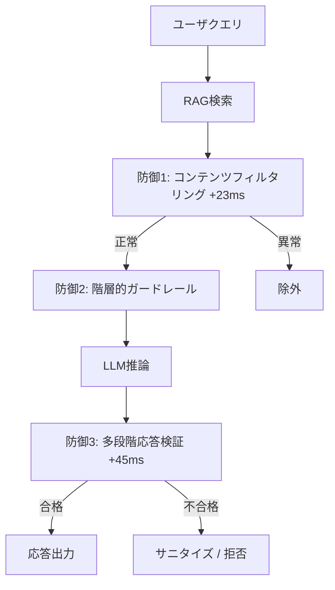

本記事は [https://arxiv.org/abs/2511.15759](https://arxiv.org/abs/2511.15759) の解説記事です。

## 論文概要（Abstract）

RAGシステムはLLMの能力を拡張する一方、検索結果を介したプロンプトインジェクション攻撃という脆弱性をもたらす。著者らは847の敵対的テストケースを5攻撃カテゴリに分類し、コンテンツフィルタリング・階層的ガードレール・多段階応答検証の3防御機構を統合した多層防御フレームワークを提案している。7つのLLMでの評価の結果、ASRを73.2%から8.7%に低減しつつタスク性能の94.3%を維持したと報告している。

この記事は [Zenn記事: OWASP×NISTで体系化するプロンプトインジェクション：攻撃分類とリスク評価](https://zenn.dev/0h_n0/articles/cd7ffbe0cec21e) の深掘りです。

## 情報源

- **arXiv ID**: 2511.15759
- **URL**: [https://arxiv.org/abs/2511.15759](https://arxiv.org/abs/2511.15759)
- **著者**: Badrinath Ramakrishnan, Akshaya Balaji
- **発表年**: 2025（2025年11月19日投稿）
- **分野**: cs.CR（暗号とセキュリティ）、cs.AI（人工知能）

## 背景と動機（Background & Motivation）

RAGシステムは外部知識ベースから検索した文書をLLMのコンテキストに注入する設計であり、攻撃者が検索コーパスに悪意のあるコンテンツを混入させることでLLMの挙動を操作できるという攻撃面を生む。

著者らは、先行研究が個別の防御を孤立して評価しており複数防御の組み合わせ効果の体系的検証が不足していると指摘している。入力前処理（Hines et al., 2023）や制約付きデコーディング（Liu et al., 2023）は単独では不十分であり、多層防御の統合評価が必要であるとしている。

## 主要な貢献（Key Contributions）

- **体系的ベンチマーク**: 200基本テンプレート + 647変異 = 847テストケースと500良性コンテキストを5カテゴリ・3難易度で分類
- **多層防御フレームワーク**: 3防御機構の統合でASRを73.2%から8.7%に低減
- **7モデル横断評価**: GPT-4からオープンソースまで7 LLMでモデル固有の脆弱性を定量的に検証
- **再現性**: ベンチマークデータセットと防御実装を公開

## 技術的詳細（Technical Details）

### 5つの攻撃カテゴリ

著者らのベンチマークは以下の5カテゴリで構成されている（論文より）。

| カテゴリ | テストケース数 | 概要 |
|---------|-------------|------|
| Direct Injection | 177（基本45 + 変異132） | 明示的命令でシステム挙動を上書き |
| Context Manipulation | 157（基本38 + 変異119） | 文脈フレーミングで役割認識を操作 |
| Instruction Override | 169（基本42 + 変異127） | エージェントの主目的を再定義 |
| Data Exfiltration | 172（基本41 + 変異131） | システムプロンプトや対話履歴を漏洩 |
| Cross-Context | 172（基本34 + 変異138） | 複数検索ラウンド間で永続的挙動変化 |

### 3防御機構の設計と実装

#### 防御1: コンテンツフィルタリング（埋め込みベース異常検出）

検索文書の埋め込みベクトルを良性参照セットおよび既知攻撃パターンセットと比較し、異常スコアを算出する（論文Equation 1より）。

$$
\text{score}(p) = \alpha \cdot d_{\min}(\mathbf{e}_p, \mathcal{R}) - \beta \cdot d_{\min}(\mathbf{e}_p, \mathcal{A})
$$

ここで、
- $\mathbf{e}_p$: 検索された文書$p$の埋め込みベクトル
- $\mathcal{R}$: 良性コンテキストの参照埋め込みセット
- $\mathcal{A}$: 既知攻撃パターンの埋め込みセット
- $d_{\min}$: セット内の最も近い埋め込みとのコサイン距離
- $\alpha, \beta$: 重み付けハイパーパラメータ

閾値超過の文書は二次検証にかけられる。「ignore」「override」「system prompt」などの既知シグネチャのパターンマッチングも併用する。計算オーバーヘッドは合計約23ms（埋め込み15ms + 異常検出8ms）である（論文より）。

#### 防御2: 階層的システムプロンプトガードレール

システムプロンプトを階層化し、検索結果がシステム指示を上書きできない構造にする。

1. **コア不変指示** $\pi_{\text{core}}$: 変更不可のシステム指示
2. **インジェクション警戒指令** $\pi_{\text{guard}}$: 攻撃の可能性をモデルに認識させるメタ指示
3. **コンテキスト組立** $\pi_{\text{context}}$: 各文書を`[DOCUMENT START]`/`[DOCUMENT END]`で区切り
4. **ユーザクエリ** $\pi_{\text{query}}$

最終プロンプトは $\pi_{\text{core}} \to \pi_{\text{guard}} \to \pi_{\text{context}} \to \pi_{\text{query}}$ の順で連結される。境界設定・権限分離・インジェクション認識の3原則に基づき、コンテキスト操作と指示上書き攻撃に対して62-67%の低減を達成している（論文より）。計算オーバーヘッドはほぼゼロである。

#### 防御3: 多段階応答検証

LLMの出力を送出前に検証する2段階のパイプラインである。

**Stage 1 - 挙動一貫性チェック**: 応答長分布、センチメント整合、予期しないコンテンツタイプ（システム情報開示等）を検出する。

**Stage 2 - 二次モデル評価**: 専用分類器が指示追従言語の矛盾、情報漏洩パターン、応答構造の逸脱を検証する。問題応答はサニタイズまたは拒否される。

計算オーバーヘッドは応答あたり45ms（GPT-4生成時間3.2秒の2.1%）。メモリは検証分類器250MB + 埋め込みストレージ180MBである（論文より）。

### 防御アーキテクチャ全体像



### 組み合わせ戦略

著者らは段階的追加の累積効果を検証している。フィルタリング単独で73.2%→41.0%、ガードレール追加で23.4%、全3機構で8.7%に到達した（論文Table 2より）。各層が異なる攻撃ベクトルに特化し、補完的に機能している。

## 実装のポイント

著者らの防御フレームワークを実装する際の注意点を以下に整理する。

**参照セット管理**: $\mathcal{R}$はドメイン固有データで構築する。汎用セットでは偽陽性率が上昇する（全防御で5.7%、約18件に1件が誤検出）。

**プロンプト長増加**: 階層的構造はトークン消費を増加させ、コンテキストウィンドウに制約のあるモデルでは検索結果挿入量が減少するトレードオフがある。

**検証分類器の脆弱性**: Stage 2分類器は攻撃特化の訓練データが必要で、著者らは検証モデル自体が攻撃対象となりうることを認めている。

**レイテンシ**: 合計約68ms（23ms + 0ms + 45ms）。チャットボットでは許容範囲内だがバッチ処理では累積コスト考慮が必要。

## Production Deployment Guide

本論文の3層防御フレームワークをAWS上にデプロイする構成を示す。

### AWS実装パターン（コスト最適化重視）

**トラフィック量別の推奨構成**

| 構成 | トラフィック | コンピュート | LLM | ストレージ | 月額目安 |
|------|-------------|-------------|-----|-----------|---------|
| Small | ~100 req/日 | Lambda | Bedrock (Claude) | DynamoDB | $50-150 |
| Medium | ~1,000 req/日 | ECS Fargate | Bedrock (Claude) | ElastiCache + DynamoDB | $300-800 |
| Large | 10,000+ req/日 | EKS + Karpenter | Bedrock / Self-hosted | ElastiCache + Aurora | $2,000-5,000 |

**Small内訳**: Lambda（$5-15）+ Bedrock推論（$20-80）+ DynamoDB（$5-10）+ CloudWatch（$5-10）+ S3（$1-5）。埋め込み計算・異常検出はLambda内で実行し、応答検証用分類器はSageMaker Serverless Endpointも選択肢となる。

**Medium内訳**: ECS Fargate（$80-200）+ Bedrock（$100-400）+ ElastiCache（$50-100）+ DynamoDB（$10-30）+ ALB（$20-30）。検証分類器を常時起動コンテナにしてコールドスタート回避。

**Large内訳**: EKS CP（$73）+ EC2 Spot（$500-1,500）+ Bedrock/Self-hosted（$800-2,500）+ ElastiCache（$200-400）+ Aurora v2（$100-300）。Karpenterで Spot優先の自動スケーリング。

**コスト削減テクニック**: Spot活用で最大90%削減、RI 1年コミットで最大72%、Bedrock Batch APIで50%、Prompt Cachingで30-90%削減が見込める。

**注意**: 上記は2026年8月時点のAWS ap-northeast-1料金に基づく概算値。実際のコストはトラフィックパターン・リージョン・バースト使用量で変動する。最新料金はAWS料金計算ツールで確認を推奨する。

### Terraformインフラコード

**Small構成（Serverless）**: VPC + IAM（最小権限）+ Lambda + DynamoDB + CloudWatch

```hcl
# IAMロール（最小権限原則: Bedrock/DynamoDB/Logsのみ許可）
resource "aws_iam_role" "lambda_defense" {
  name = "prompt-defense-lambda-role"
  assume_role_policy = jsonencode({
    Version = "2012-10-17"
    Statement = [{ Action = "sts:AssumeRole", Effect = "Allow",
      Principal = { Service = "lambda.amazonaws.com" } }]
  })
}

resource "aws_iam_role_policy" "lambda_policy" {
  name = "prompt-defense-policy"
  role = aws_iam_role.lambda_defense.id
  policy = jsonencode({
    Version = "2012-10-17"
    Statement = [
      { Effect = "Allow", Action = ["bedrock:InvokeModel"],
        Resource = "arn:aws:bedrock:*::foundation-model/anthropic.*" },
      { Effect = "Allow", Action = ["dynamodb:PutItem", "dynamodb:GetItem", "dynamodb:Query"],
        Resource = aws_dynamodb_table.defense_logs.arn },
      { Effect = "Allow", Action = ["logs:CreateLogGroup", "logs:CreateLogStream", "logs:PutLogEvents"],
        Resource = "arn:aws:logs:*:*:*" }
    ]
  })
}

# Lambda（埋め込み計算に最低512MB, X-Ray有効化）
resource "aws_lambda_function" "defense_pipeline" {
  function_name = "prompt-defense-pipeline"
  runtime       = "python3.12"
  handler       = "handler.lambda_handler"
  role          = aws_iam_role.lambda_defense.arn
  timeout       = 60
  memory_size   = 512
  filename      = "lambda_package.zip"
  environment {
    variables = {
      ANOMALY_THRESHOLD = "0.75"
      BEDROCK_MODEL_ID  = "anthropic.claude-3-5-sonnet-20241022-v2:0"
    }
  }
  tracing_config { mode = "Active" }
}

# DynamoDB（On-Demand, KMS暗号化, PITR有効）
resource "aws_dynamodb_table" "defense_logs" {
  name         = "prompt-defense-logs"
  billing_mode = "PAY_PER_REQUEST"
  hash_key     = "request_id"
  range_key    = "timestamp"
  attribute { name = "request_id"; type = "S" }
  attribute { name = "timestamp"; type = "S" }
  server_side_encryption { enabled = true }
  point_in_time_recovery { enabled = true }
}
```

**Large構成（Container）**: EKS + Karpenter（Spot優先）+ Secrets Manager + Budgets

```hcl
module "eks" {
  source          = "terraform-aws-modules/eks/aws"
  version         = "~> 20.0"
  cluster_name    = "prompt-defense-cluster"
  cluster_version = "1.31"
  vpc_id          = aws_vpc.main.id
  subnet_ids      = aws_subnet.private[*].id
  cluster_endpoint_public_access = false  # プライベートのみ
  enable_irsa                    = true
}

# Karpenter NodePool（Spot優先, 未使用ノード60sで統合）
resource "kubectl_manifest" "karpenter_nodepool" {
  yaml_body = yamlencode({
    apiVersion = "karpenter.sh/v1"
    kind       = "NodePool"
    metadata   = { name = "defense-workers" }
    spec = {
      template.spec.requirements = [
        { key = "karpenter.sh/capacity-type", operator = "In", values = ["spot", "on-demand"] },
        { key = "node.kubernetes.io/instance-type", operator = "In",
          values = ["m6i.xlarge", "m6a.xlarge", "m5.xlarge"] }
      ]
      limits     = { cpu = "100", memory = "400Gi" }
      disruption = { consolidationPolicy = "WhenEmptyOrUnderutilized", consolidateAfter = "60s" }
    }
  })
}

# Secrets Manager（KMS暗号化）+ Budgets（80%で警告）
resource "aws_secretsmanager_secret" "bedrock_config" {
  name       = "prompt-defense/bedrock-config"
  kms_key_id = aws_kms_key.secrets.arn
}

resource "aws_budgets_budget" "monthly" {
  name = "prompt-defense-monthly"
  budget_type  = "COST"
  limit_amount = "5000"
  limit_unit   = "USD"
  time_unit    = "MONTHLY"
  notification {
    comparison_operator        = "GREATER_THAN"
    threshold                  = 80
    threshold_type             = "PERCENTAGE"
    notification_type          = "ACTUAL"
    subscriber_email_addresses = ["ops-team@example.com"]
  }
}
```

### 運用・監視設定

**CloudWatch Logs Insights クエリ**

```
# コスト異常検知（1時間あたりのBedrock呼び出し量）
fields @timestamp, @message
| filter @message like /bedrock/
| stats count() as invocations, sum(input_tokens) as total_tokens by bin(1h)
| filter invocations > 500 or total_tokens > 100000

# 防御レイヤー別レイテンシ分析（P95, P99）
fields @timestamp, defense_layer, duration_ms
| stats percentile(duration_ms, 95) as p95, percentile(duration_ms, 99) as p99 by defense_layer
```

**CloudWatch アラーム + X-Ray トレーシング（Python）**

```python
import boto3
from aws_xray_sdk.core import xray_recorder, patch_all

patch_all()  # boto3自動計装

def create_defense_alarms() -> None:
    """防御パイプラインの監視アラームを設定する."""
    cloudwatch = boto3.client("cloudwatch")
    cloudwatch.put_metric_alarm(
        AlarmName="bedrock-token-spike",
        MetricName="InputTokenCount", Namespace="AWS/Bedrock",
        Statistic="Sum", Period=3600, EvaluationPeriods=1,
        Threshold=100000, ComparisonOperator="GreaterThanThreshold",
        AlarmActions=["arn:aws:sns:ap-northeast-1:123456789:ops-alerts"],
    )

@xray_recorder.capture("defense_pipeline")
def run_defense_pipeline(query: str, documents: list[str]) -> dict:
    """3層防御パイプラインを実行し、X-Rayでトレースする."""
    subsegment = xray_recorder.current_subsegment()
    subsegment.put_annotation("defense_version", "v1.0")
    subsegment.put_metadata("document_count", len(documents))
    # ... 防御ロジック実行
```

**Cost Explorer 日次レポート（Python）**

```python
import boto3
from datetime import date, timedelta

def daily_cost_report() -> dict:
    """日次コストレポートを取得し、$100/日超過でSNS通知する."""
    ce = boto3.client("ce")
    today = date.today()
    result = ce.get_cost_and_usage(
        TimePeriod={"Start": str(today - timedelta(days=1)), "End": str(today)},
        Granularity="DAILY", Metrics=["UnblendedCost"],
        Filter={"Tags": {"Key": "Project", "Values": ["prompt-defense"]}},
    )
    cost = float(result["ResultsByTime"][0]["Total"]["UnblendedCost"]["Amount"])
    if cost > 100:
        boto3.client("sns").publish(
            TopicArn="arn:aws:sns:ap-northeast-1:123456789:cost-alerts",
            Message=f"Daily cost alert: ${cost:.2f} exceeds $100 threshold",
        )
    return {"date": str(today), "cost_usd": cost}
```

### コスト最適化チェックリスト

**アーキテクチャ選択**
- [ ] ~100 req/日: Serverless（Lambda + Bedrock）
- [ ] ~1,000 req/日: Hybrid（ECS Fargate + Bedrock）
- [ ] 10,000+ req/日: Container（EKS + Karpenter）

**リソース最適化**
- [ ] EC2/EKSワーカーはSpot優先（最大90%削減）
- [ ] 安定ワークロードにはRI 1年コミット（最大72%削減）
- [ ] Savings Plans検討（Compute/EC2 Instance）
- [ ] Lambda メモリ512MB-1024MBで最適化
- [ ] ECS/EKSアイドル時スケールダウン（Karpenter consolidation 60s）

**LLMコスト削減**
- [ ] Bedrock Batch APIで非リアルタイム検証を50%削減
- [ ] Prompt Caching有効化（ガードレール共通部分キャッシュ、30-90%削減）
- [ ] モデル選択ロジック（簡易: Haiku、複雑: Sonnet）
- [ ] トークン数制限で検索結果のプロンプトコスト抑制
- [ ] 異常検出で除外した文書はLLMに送信しない

**監視・アラート**
- [ ] AWS Budgets（月額上限80%で警告）
- [ ] CloudWatch アラーム（Bedrock呼び出し数、Lambda実行時間）
- [ ] Cost Anomaly Detection有効化
- [ ] 日次コストレポート（SNS通知）

**リソース管理**
- [ ] 未使用リソース定期削除
- [ ] タグ戦略（Project/Environment/CostCenter必須）
- [ ] S3ライフサイクルポリシー（古い埋め込みデータ自動削除）
- [ ] 開発環境の夜間・週末自動停止
- [ ] CloudTrail/Config有効化

## 実験結果（Results）

著者らは4つの構成で847テストケースを評価している（論文Table 2より）。

| 攻撃カテゴリ | ベースライン | +フィルタリング | +ガードレール | 全防御 |
|-------------|-------------|---------------|-------------|-------|
| Direct Injection | 84.7% | 41.2% | 22.8% | 7.3% |
| Context Manipulation | 68.4% | 38.6% | 19.4% | 9.2% |
| Instruction Override | 71.0% | 43.7% | 25.1% | 10.8% |
| Data Exfiltration | 79.6% | 36.9% | 21.5% | 8.1% |
| Cross-Context | 62.3% | 44.8% | 28.3% | 8.1% |
| **全体** | **73.2%** | **41.0%** | **23.4%** | **8.7%** |

モデル別ではClaude 2.1が最も耐性が高く（ASR 61.4%）、Mistral 7B Instructが最も脆弱（82.3%）であった。偽陽性率は全防御で5.7%、タスク性能保持率は94.3%である（論文より）。

アブレーション分析では、フィルタリングがLevel 1攻撃に78%の低減効果を示す一方Level 3には42%にとどまり、ガードレールは難易度問わず62-67%、応答検証は前2層突破の60%を追加阻止している。残存8.7%は主にLevel 3攻撃であった。

## 実運用への応用（Practical Applications）

本論文の5攻撃カテゴリは、Zenn記事のOWASP×NISTリスク分類における具体的な攻撃ベクトルを実証的に示しており、リスク評価のインプットとして活用できる。

脅威モデルは「攻撃者が検索コーパスに影響可能だがモデル・システムプロンプトは変更不可」が前提であり、ユーザ生成ナレッジベースやWebスクレイピングソースが主な適用対象である。実運用では社内KBにはガードレールのみ、外部ソース含む環境には全3層を適用するといった段階的導入が現実的である。

## 関連研究（Related Work）

- **Perez et al. (2022)**: LLMが命令とデータの区別に苦慮することを実証。ベンチマーク設計の動機
- **Greshake et al. (2023)**: Web経由の間接的インジェクション脅威を体系化。RAG固有の攻撃面を指摘
- **Hines et al. (2023)**: 入力前処理による異常検出を試みたが効果は限定的。埋め込みベース検出の前身
- **Zhang et al. (2023)**: 敵対的訓練による防御。未知パターンへの汎化が課題

## まとめと今後の展望

著者らは847テストケースのベンチマークと3層防御フレームワークにより、ASRを73.2%から8.7%に低減しつつタスク性能の94.3%を維持できることを示した。各防御層が補完的に機能する点が本研究の核心的知見である。

限界として、ベンチマークは英語のみが対象であり多言語攻撃は未検証であること、適応的敵対者への脆弱性、テキスト以外のモダリティへの未対応が挙げられている。多言語対応、敵対者と防御の共進化モデリング、形式的検証の確立が今後の方向として示されている。

## 参考文献

- **arXiv**: [https://arxiv.org/abs/2511.15759](https://arxiv.org/abs/2511.15759)
- **Related Zenn article**: [https://zenn.dev/0h_n0/articles/cd7ffbe0cec21e](https://zenn.dev/0h_n0/articles/cd7ffbe0cec21e)
