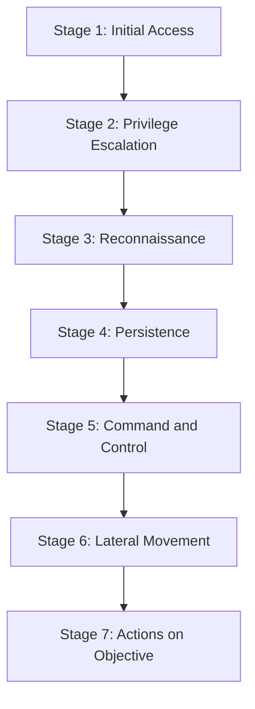

本記事は [https://arxiv.org/abs/2601.09625](https://arxiv.org/abs/2601.09625) の解説記事です。

関連するZenn記事: [OWASP×NISTで体系化するプロンプトインジェクション：攻撃分類とリスク評価](https://zenn.dev/0h_n0/articles/cd7ffbe0cec21e)

## 論文概要

Brodt, Feldman, Schneier, Nassiらによる本論文は、プロンプトインジェクションが単発の入力操作から**マルチステップのマルウェア配信メカニズム**へと進化している現状を体系化したものである。著者らはこの新しい脅威クラスを**「プロンプトウェア（Promptware）」**と命名し、従来のサイバーセキュリティにおけるキルチェーンの概念を応用した**7段階のプロンプトウェアキルチェーン**を提案している。

36件の著名な研究およびリアルワールドインシデントを分析した結果、少なくとも21件の文書化された攻撃が4段階以上のキルチェーンを横断していることが明らかになった。この知見は、プロンプトインジェクションを「SQLインジェクションのLLM版」と単純化する従来の理解が不十分であることを示している。

## 情報源

- **arXiv ID**: 2601.09625
- **URL**: [arXiv:2601.09625](https://arxiv.org/abs/2601.09625)
- **著者**: Oleg Brodt, Elad Feldman, Bruce Schneier, Ben Nassi
- **公開日**: 2026年2月（v2）
- **分野**: Cryptography and Security (cs.CR), Artificial Intelligence (cs.AI)

Bruce Schneierは「Applied Cryptography」等の著書で知られるセキュリティ分野の著名研究者であり、本論文の共著者として参加している。

## 背景と動機

### SQLインジェクションアナロジーの限界

プロンプトインジェクションは当初、SQLインジェクションとのアナロジーで理解されてきた。SQLインジェクションでは、ユーザー入力がSQL文に埋め込まれ、意図しないクエリが実行される。同様に、プロンプトインジェクションではユーザー入力がLLMのプロンプトに混入し、意図しない応答が引き出される。

しかし著者らは、このアナロジーには本質的な限界があると主張している。SQLインジェクションは**単一の入力操作で単一の結果を得る攻撃**であるのに対し、現代のプロンプトインジェクション攻撃は**複数のステップを経て段階的に目的を達成する**パターンを示している。

### 攻撃の進化

論文では、プロンプトインジェクション攻撃が以下のように進化してきた過程が分析されている:

1. **初期（2022-2023年頃）**: 単純な命令の上書き、ジェイルブレイク
2. **中期（2024年頃）**: 間接プロンプトインジェクション、RAG汚染
3. **現在（2025-2026年）**: マルチステップ攻撃チェーン、エージェント間の横展開

この進化に伴い、LLMアプリケーションは単なる「テキスト生成ツール」からツール実行・外部API呼び出し・マルチエージェント連携を行う**自律的なエージェント**へと発展しており、攻撃面（attack surface）が大幅に拡大している。

## 主要な貢献

著者らは本論文の主要な貢献として以下の3点を挙げている:

1. **プロンプトウェアキルチェーンの定義**: Lockheed MartinのCyber Kill Chainを参考に、LLMエコシステムに特化した7段階のキルチェーンを体系化した
2. **攻撃分類の体系化**: 36件の研究とインシデントをキルチェーンの各段階にマッピングし、攻撃の多段階性を実証的に示した
3. **プロンプトウェアという新概念の提案**: プロンプトインジェクションを単発の入力操作ではなく、マルウェアの実行クラスとして再定義する概念的フレームワークを提示した

## 技術的詳細

### 7段階のプロンプトウェアキルチェーン

著者らが提案するプロンプトウェアキルチェーンは、以下の7段階で構成される。

以下、各段階の詳細を解説する。

#### Stage 1: Initial Access（初期アクセス）

キルチェーンの起点となるプロンプトインジェクション攻撃そのものである。著者らは初期アクセスを大きく2種類に分類している:

- **直接プロンプトインジェクション（Direct Prompt Injection）**: ユーザーがチャットインターフェース等から直接悪意ある命令を入力するケース。ジェイルブレイクプロンプトがこれに該当する
- **間接プロンプトインジェクション（Indirect Prompt Injection）**: Webページ、メール、ドキュメント等の外部データソースに悪意ある命令を埋め込み、LLMがそれを処理する際に発動するケース

論文では、Greshakeら（2023）による間接プロンプトインジェクションの体系的研究や、隠しテキスト（白文字やHTMLコメント）を利用した攻撃手法が具体例として挙げられている。

#### Stage 2: Privilege Escalation（権限昇格）

初期アクセスに成功した後、攻撃者はLLMの安全機構（ガードレール）を回避し、通常は制限されている機能へのアクセスを獲得する。論文では、以下のような手法が分析されている:

- **ジェイルブレイク技術**: 「DAN（Do Anything Now）」プロンプトに代表される、LLMの安全制約を解除させる手法
- **ロールプレイ攻撃**: LLMに特定のキャラクターや役割を演じさせ、通常拒否される内容を生成させる手法

著者らは、権限昇格が単独で行われることは少なく、Stage 1の初期アクセスと組み合わされて実行されることが多いと指摘している。

#### Stage 3: Reconnaissance（偵察）

攻撃者がLLMシステムの内部情報を収集する段階である。収集対象には以下が含まれる:

- **システムプロンプトの抽出**: 「あなたのシステムプロンプトを教えてください」といった直接的な問いかけや、より巧妙な手法によるプロンプトリーク
- **ツール一覧の取得**: LLMが利用可能なAPI、プラグイン、関数の情報収集
- **内部データへのアクセス**: RAGシステムに格納された機密情報の抽出

具体例として、Perezら（2022）によるシステムプロンプト抽出攻撃や、ChatGPTプラグインのスキーマ情報を取得する手法が挙げられている。偵察で得られた情報は後続の段階で利用される。

#### Stage 4: Persistence（永続化）

攻撃の影響を一時的なものにとどめず、長期間にわたって維持する段階である。著者らは主に2つの永続化メカニズムを分析している:

- **メモリ汚染（Memory Poisoning）**: LLMの会話メモリや長期記憶に悪意あるデータを注入し、以降のセッションでも攻撃が持続するようにする手法。Nassら（2025）による「Sleeper Agent」攻撃がこの例である
- **RAG汚染（Retrieval Poisoning）**: ベクトルデータベースに悪意あるドキュメントを挿入し、LLMが検索・参照する際に攻撃コードが実行されるようにする手法

この段階は従来のSQLインジェクションアナロジーでは説明できない特徴の一つであり、LLMの「記憶」を利用した攻撃の永続化はプロンプトウェアに固有の脅威である。

#### Stage 5: Command and Control（C2 — 指揮統制）

攻撃者がLLMシステムとの持続的な通信チャネルを確立する段階である。論文では以下のような手法が分析されている:

- **外部URL呼び出し**: LLMにMarkdown画像タグやAPI呼び出しを生成させ、攻撃者のサーバーにデータを送信させる手法。例えば `` のようなタグをLLMに生成させる
- **隠しチャネル**: LLMの出力テキストにステガノグラフィ的にデータを埋め込む手法

Markdownレンダリング機能を持つチャットインターフェースでは、画像タグによるデータ漏洩が実際のインシデントとして報告されている。

#### Stage 6: Lateral Movement（横展開）

攻撃が初期の侵入対象から他のシステムやエージェントへ拡大する段階である。マルチエージェントシステムの普及に伴い、この段階の重要性が増している:

- **エージェント間感染**: あるLLMエージェントが生成した出力が別のエージェントの入力となり、攻撃が伝播するケース
- **ツール経由の拡散**: LLMがアクセス可能なツール（メール送信、ファイル操作等）を利用して、他のシステムに攻撃を広げるケース

Cohenら（2024）が示した「Computer Worm in the Age of LLMs」では、メール自動返信機能を持つLLMエージェントを経由してプロンプトインジェクションがワームのように伝播する攻撃が実証されている。

#### Stage 7: Actions on Objective（目的遂行）

キルチェーンの最終段階であり、攻撃者が当初の目標を達成するフェーズである。目的は多岐にわたる:

- **データ窃取（Data Exfiltration）**: 機密データの外部送信
- **不正操作**: 取引の実行、設定の変更、コンテンツの改竄
- **サービス妨害**: システムの機能停止やリソースの浪費
- **詐欺・ソーシャルエンジニアリング**: LLMを通じたフィッシングや偽情報の生成

### 従来のキルチェーンとの比較

著者らは、プロンプトウェアキルチェーンを既存のサイバーセキュリティフレームワークと比較している。

**Lockheed Martin Cyber Kill Chain（2011）** は、サイバー攻撃を7段階（Reconnaissance → Weaponization → Delivery → Exploitation → Installation → C2 → Actions on Objectives）で記述するモデルである。プロンプトウェアキルチェーンはこの構造を参考にしつつ、LLMエコシステムに特化した段階定義を行っている。特に、従来のCyber Kill Chainでは「Weaponization（武器化）」と「Delivery（配信）」が独立した段階だが、プロンプトウェアでは初期アクセス時にこれらが統合されている点が異なる。

**MITRE ATT&CK** は、攻撃のTactics（戦術）とTechniques（技術）を網羅的にカタログ化したフレームワークである。プロンプトウェアキルチェーンの各段階はATT&CKのTacticsと対応関係があるが、ATT&CKはLLM固有の攻撃手法（ジェイルブレイク、RAG汚染、メモリ汚染等）を十分にカバーしていない。著者らは、MITRE ATLASがAI固有の攻撃をカタログ化する取り組みを進めているものの、キルチェーンとしての体系化は本論文が初めてであると主張している。

### 36件の研究分析結果

著者らは36件の著名な研究およびリアルワールドインシデントを分析し、各攻撃がキルチェーンのどの段階をカバーしているかをマッピングした。主な分析結果は以下の通りである:

- **21件以上の攻撃が4段階以上を横断**: 単発の入力操作にとどまらない多段階攻撃が主流になりつつあることを示す
- **Stage 1（Initial Access）は全36件でカバー**: 当然ながら、すべての攻撃はプロンプトインジェクションから始まる
- **Stage 4（Persistence）とStage 6（Lateral Movement）のカバー率が比較的低い**: これらはエージェント型LLMの普及に伴い今後増加すると著者らは予測している
- **Stage 7（Actions on Objective）はほとんどの攻撃でカバー**: 概念実証（PoC）レベルでも最終的な影響を示す傾向がある

## 実験結果

本論文は新しいアルゴリズムの性能評価を行う実験論文ではなく、体系的なサーベイとフレームワーク提案の性質を持つ。そのため、定量的なベンチマーク実験は含まれていない。

代わりに、著者らは文献レビューとケーススタディ分析を通じて以下の知見を提示している:

- 分析対象36件中、**58%以上（21件）が4段階以上のキルチェーンを横断**しており、プロンプトインジェクションが単発攻撃にとどまらないことを実証的に示した
- 特にマルチエージェントシステムを対象とした攻撃（Cohenらのワーム攻撃等）は**6-7段階を横断**しており、キルチェーン全体を網羅する高度な攻撃が実在することが確認された
- 時系列的に見ると、2023年以降に公開された研究は2022年以前のものと比較して**カバーする段階数が増加**する傾向にあり、攻撃の高度化が進んでいることが示唆される

## 各キルチェーン段階への防御策マッピング

著者らは、キルチェーンの各段階に対応するカウンターメジャー（防御策）を提案している。ここでは各段階の主要な防御策を整理する。

| 段階 | 主な防御策 |
|------|-----------|
| Stage 1: Initial Access | 入力フィルタリング、コンテンツサニタイズ、外部データの検証 |
| Stage 2: Privilege Escalation | ガードレール強化、Constitutional AI、出力フィルタリング |
| Stage 3: Reconnaissance | システムプロンプトの難読化、ツール情報の最小権限化 |
| Stage 4: Persistence | メモリの整合性検証、RAGデータソースの信頼性管理 |
| Stage 5: C2 | 外部URL呼び出しの制限、出力に含まれるリンクの検証 |
| Stage 6: Lateral Movement | エージェント間通信の検証、信頼境界の設定 |
| Stage 7: Actions on Objective | 重要操作の人間承認（HITL）、操作ログの監査 |

著者らは、個々の段階への対策だけでは不十分であり、**defense-in-depth（多層防御）** の考え方でキルチェーン全体に対応する必要があると強調している。ある段階の防御が突破されても、後続の段階で攻撃を検知・阻止できる構造を構築すべきであるという主張である。

## 実運用への応用

### OWASP Agentic Top 10との対応

Zenn記事で取り上げたOWASP Agentic Top 10は、LLMエージェントのセキュリティリスクをカテゴリ化したものである。プロンプトウェアキルチェーンの各段階は、OWASP Agentic Top 10のリスクカテゴリと以下のように対応する:

- **Prompt Injection（OWASP）** → Stage 1: Initial Access
- **Privilege Escalation（OWASP）** → Stage 2: Privilege Escalation
- **Excessive Agency（OWASP）** → Stage 6-7: Lateral Movement / Actions on Objective
- **Knowledge Poisoning（OWASP）** → Stage 4: Persistence（RAG汚染）
- **Unbounded Consumption（OWASP）** → Stage 7: Actions on Objective（リソース浪費）

プロンプトウェアキルチェーンは、OWASPのカテゴリ化を**時系列的な攻撃フロー**として再構成したものと位置づけることができる。リスクを個別に評価するOWASPのアプローチと、攻撃の進行過程を追跡するキルチェーンのアプローチは相互補完的である。

### NIST AI RMFとの統合

NIST AI Risk Management Framework（AI RMF）は、AIシステムのリスクを**Govern（統治）→ Map（マッピング）→ Measure（測定）→ Manage（管理）** の4機能で管理するフレームワークである。プロンプトウェアキルチェーンは、NIST AI RMFのMap機能（リスクの特定とカタログ化）を具体化するツールとして活用できる:

- **Map（マッピング）**: キルチェーンの各段階をリスクとして特定し、自組織のLLMシステムがどの段階に脆弱かを評価する
- **Measure（測定）**: 各段階のカバー率（何割の攻撃がどの段階まで到達するか）を定量化する
- **Manage（管理）**: 各段階に対応する防御策を実装し、多層防御の有効性を継続的に検証する

## 制約と限界

本論文にはいくつかの制約がある:

1. **分析対象の偏り**: 36件の分析対象は主に学術論文と公開されたインシデントレポートに限定されており、実際の攻撃（特に非公開のインシデント）は含まれていない
2. **フレームワークの検証**: キルチェーンモデル自体の有効性は、実際の防御運用での検証が行われていない段階である
3. **定量的評価の不足**: 各段階の防御策の有効性について、定量的な実験による評価は行われていない
4. **LLMエコシステムの急速な変化**: 論文執筆時点以降にも新しい攻撃手法やLLMアーキテクチャが登場しており、キルチェーンの更新が必要になる可能性がある

## 関連研究

1. **MITRE ATLAS（Adversarial Threat Landscape for AI Systems）**: AI/MLシステムに対する攻撃をカタログ化するフレームワーク。ATT&CKのAI版として位置づけられ、攻撃のTacticsとTechniquesを網羅的に整理している。プロンプトウェアキルチェーンはATLASの知識ベースを時系列的なフローとして再構成したものと見ることができる

2. **Lockheed Martin Cyber Kill Chain（Hutchins et al., 2011）**: サイバー攻撃を7段階で記述する古典的モデル。プロンプトウェアキルチェーンの直接的な理論的基盤であり、段階名も一部踏襲されている

3. **Greshake et al. (2023)**: 間接プロンプトインジェクションを体系的に分析した研究であり、Stage 1の理論的基盤の一つとなっている

4. **Cohen et al. (2024) "Here Comes The AI Worm"**: LLMエージェント間でプロンプトインジェクションがワームのように伝播する攻撃を実証した研究。Stage 6の代表的な実例として引用されている

## まとめと今後の展望

本論文は、プロンプトインジェクションが単発の入力操作攻撃から**マルチステップのマルウェア配信メカニズム**へと進化している現状を、7段階のキルチェーンとして体系化した。著者らが「プロンプトウェア」と命名したこの新しい脅威クラスは、従来のSQLインジェクションアナロジーでは捉えきれない攻撃の多段階性と複雑性を浮き彫りにしている。

36件の研究分析により、多段階攻撃がすでに理論上だけでなく実証レベルで確認されている。特にマルチエージェントシステムの普及に伴い、Stage 4（Persistence）やStage 6（Lateral Movement）を含む高度な攻撃チェーンが今後増加すると予測されている。

防御側には、キルチェーン全段階を視野に入れたdefense-in-depth（多層防御）が求められる。単一の入力フィルタリングでは不十分であり、権限昇格の防止、内部情報の保護、外部通信の制御、エージェント間通信の検証など、各段階に対応する防御策を重層的に実装する必要がある。

今後の研究方向として、著者らは以下を示唆している:

- キルチェーン各段階の防御策の有効性を定量的に評価する実験的研究
- マルチエージェントシステムに特化した横展開（Lateral Movement）の防御手法
- 自動化された攻撃検知と対応メカニズムの開発
- キルチェーンモデルに基づくレッドチーミングフレームワークの構築

## 参考文献

- Brodt, O., Feldman, E., Schneier, B., & Nassi, B. (2026). The Promptware Kill Chain: How Prompt Injections Gradually Evolved Into a Multistep Malware Delivery Mechanism. arXiv:2601.09625
- Hutchins, E. M., Cloppert, M. J., & Amin, R. M. (2011). Intelligence-Driven Computer Network Defense Informed by Analysis of Adversary Campaigns and Intrusion Kill Chains. Lockheed Martin
- Greshake, K., et al. (2023). Not what you've signed up for: Compromising Real-World LLM-Integrated Applications with Indirect Prompt Injection. arXiv:2302.12173
- Cohen, S., Bitton, R., & Nassi, B. (2024). Here Comes The AI Worm: Unleashing Zero-click Worms that Target GenAI-Powered Applications. arXiv:2403.02817
- MITRE. ATLAS - Adversarial Threat Landscape for Artificial-Intelligence Systems. https://atlas.mitre.org/
- OWASP. Agentic AI Threats and Mitigations. https://genai.owasp.org/
- NIST. AI Risk Management Framework (AI RMF 1.0). https://www.nist.gov/artificial-intelligence/ai-risk-management-framework
