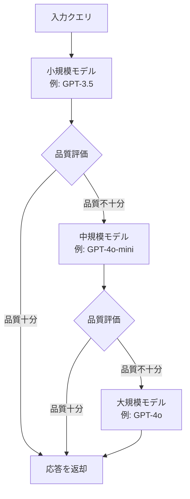
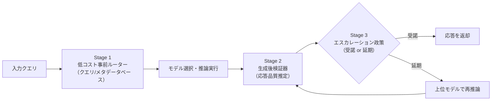

本記事は [https://arxiv.org/abs/2603.04445](https://arxiv.org/abs/2603.04445) の解説記事です。

## 論文概要（Abstract）

大規模言語モデル（LLM）の推論コストとレイテンシは、プロダクション環境での大きな課題となっている。本サーベイ論文は、複数のLLMを動的に選択・切り替える「モデルルーティング」と、小規模モデルから大規模モデルへ段階的にエスカレーションする「カスケーディング」の手法を体系的に整理したものである。著者らは6つのルーティングパラダイムを特定し、When（決定タイミング）・What（使用情報）・How（計算方法）の3次元設計空間としてこれらの手法を分類している。適切に設計されたルーティングシステムは、最も強力な個別モデル単体をも上回る性能を発揮しうるという知見が示されている。

この記事は [Zenn記事: Portkey AIゲートウェイで複数LLMを統合する本番構築ガイド2026](https://zenn.dev/0h_n0/articles/c184032fcd6908) の深掘りです。

## 情報源

- **arXiv ID**: 2603.04445
- **URL**: [https://arxiv.org/abs/2603.04445](https://arxiv.org/abs/2603.04445)
- **著者**: Yasmin Moslem, John D. Kelleher
- **分野**: cs.NI, cs.CL, cs.PF
- **支援**: ADAPT Centre, Trinity College Dublin, Huawei Ireland

## 背景と動機（Background & Motivation）

LLMの性能は急速に向上しているが、それに伴い推論コストも増大している。GPT-4クラスの大規模モデルはあらゆるタスクで高品質な応答を返す一方、単純な質問応答や定型的なテキスト生成であれば小規模モデルでも十分な品質を達成できる。この性能とコストのトレードオフに着目し、タスクの性質に応じて適切なモデルを動的に選択する「モデルルーティング」の研究が活発化している。

著者らは、既存のルーティング手法が個別に提案されており、統一的な分類体系が存在しないことを課題として指摘している。手法間の比較が困難であり、実務者がどの手法を採用すべきか判断する指針も不足していた。本サーベイは、この散在する研究群を体系的に整理し、3次元設計空間として統一的に分類することで、研究者と実務者の双方に見通しの良いマップを提供することを目的としている。

## 主要な貢献（Key Contributions）

- **6つのルーティングパラダイムの特定と体系化**: Difficulty-Aware、Human Preference-Aligned、Clustering-Based、RL Routing、Uncertainty-Based、Cascadingの6パラダイムに既存手法を分類
- **3次元設計空間（When / What / How）の提示**: ルーティング決定のタイミング、使用する情報、計算方法の3軸で手法を位置づける統一フレームワーク
- **評価フレームワークの整理**: RouterBench、RouterEval、LLMRouterBenchなど主要ベンチマークの比較と、性能・効率・コストの3カテゴリにわたる評価メトリクスの整理
- **研究ギャップの明確化**: 汎化性能、多段カスケード、マルチモーダルルーティングなど未解決の課題を特定

## 技術的詳細 — 6つのルーティングパラダイム

本サーベイが特定した6つのパラダイムは、LLMルーティングのアプローチを網羅的にカバーしている。以下に各パラダイムの原理と代表的手法を解説する。

### 1. Difficulty-Aware Routing（難易度認識型）

入力クエリのタスク難易度を推定し、難易度に応じてモデルを振り分けるアプローチである。基本的な発想は明快で、簡単なタスクにはコストの低い小規模モデルを、難しいタスクには高性能な大規模モデルを割り当てる。

難易度推定にはDeBERTaベースの分類器が多く用いられると著者らは報告している。入力テキストをエンコードし、難易度スコア $d(x)$ を算出する。閾値 $\tau$ に基づき、ルーティング決定 $r(x)$ は以下のように定式化できる。

$$
r(x) = \begin{cases} M_{\text{small}} & \text{if } d(x) < \tau \\ M_{\text{large}} & \text{otherwise} \end{cases}
$$

ここで、$x$ は入力クエリ、$M_{\text{small}}$ は小規模モデル、$M_{\text{large}}$ は大規模モデルを表す。閾値 $\tau$ はコストと品質のトレードオフを制御するハイパーパラメータである。

このアプローチの利点は実装の単純さにあるが、「難易度」の定義がタスクやドメインに依存するため、汎化が課題となる。

### 2. Human Preference-Aligned Routing（人間嗜好整合型）

人間の嗜好データに基づいてルーティングを学習するアプローチである。代表的な手法であるRouteLLMは、Chatbot Arenaの嗜好データ（ユーザーがどちらのモデルの応答を好むか）を訓練データとして利用する。

RouteLLMでは、クエリ $x$ に対してモデルペア $(M_i, M_j)$ の嗜好確率 $p(M_i \succ M_j \mid x)$ を推定する分類器を訓練する。著者らによれば、この手法はユーザー満足度と直接相関するルーティングを実現できるが、嗜好データの収集コストが高いという課題がある。

一方、Arch-Routerのようにユーザー定義ポリシーに基づくルーティングも提案されている。これは嗜好データへの依存を排除し、運用者が明示的にルーティングルールを設定できるアプローチである。

### 3. Clustering-Based Routing（クラスタリング型）

クエリの埋め込み表現をクラスタリングし、クラスタごとに最適なモデルを割り当てるアプローチである。代表的な手法であるUniRouteは、K-meansクラスタリングを基盤としている。

手順は以下の通りである。まず、訓練データのクエリ埋め込みに対してK-meansクラスタリングを実行し、$K$ 個のクラスタ $\{C_1, C_2, \ldots, C_K\}$ を形成する。次に、各クラスタ内のサンプルについて各モデルの性能を評価し、クラスタ $C_k$ に対する最適モデル $M^*_k$ を決定する。

$$
M^*_k = \arg\min_{M \in \mathcal{M}} \sum_{x \in C_k} \left[ \ell(M, x) + \lambda \cdot \text{cost}(M) \right]
$$

ここで、$\ell(M, x)$ はモデル $M$ のクエリ $x$ に対するエラー、$\text{cost}(M)$ はモデルのAPI呼び出しコスト、$\lambda$ はコスト重みパラメータである。推論時は、新しいクエリを最近傍クラスタに割り当て、そのクラスタの最適モデルにルーティングする。

このアプローチは、明示的なラベル付けを必要としないという利点があり、コスト調整エラー最小化により品質とコストのバランスを自動的に最適化できる。

### 4. RL Routing（強化学習型）

強化学習（RL）を用いてルーティングポリシーを学習するアプローチである。著者らは、PPO（Proximal Policy Optimization）やGRPO（Group Relative Policy Optimization）を用いた手法と、バンディットアルゴリズムを用いた手法に大別している。

**PPO/GRPO系**: Router-R1やR2-Reasonerが代表的である。これらはルーティング決定を「行動」、タスク性能とコスト削減を「報酬」として定式化する。報酬関数は一般に以下の形式をとる。

$$
R(a, x) = \alpha \cdot Q(M_a, x) - \beta \cdot \text{cost}(M_a)
$$

ここで、$a$ はルーティング行動（モデル選択）、$Q(M_a, x)$ はモデル $M_a$ のクエリ $x$ に対する品質スコア、$\alpha$ と $\beta$ は品質とコストの重みである。

**バンディット系**: MetaLLM、PILOT、GreenServが代表的である。バンディットアルゴリズムは探索と活用のトレードオフを明示的に扱えるため、新しいモデルの追加や環境変化への適応に優れる。

RL系手法の強みは、事前の教師データなしに環境との相互作用を通じて最適なルーティングポリシーを発見できることにある。一方、訓練の不安定性やサンプル効率の低さが課題として指摘されている。

### 5. Uncertainty-Based Routing（不確実性型）

モデルの出力に対する不確実性を推定し、不確実性が高い場合により強力なモデルにエスカレーションするアプローチである。

隠れ状態分類器（hidden state classifier）は、モデルの内部表現から出力の信頼度を推定する。具体的には、中間層の隠れ状態 $\mathbf{h}_l$ から信頼度スコア $c(x)$ を算出する分類器 $f$ を訓練する。

$$
c(x) = f(\mathbf{h}_l(x))
$$

CP-Router（Conformal Prediction Router）は、統計的に保証された不確実性推定を提供する点でとりわけ注目に値する。Conformal Predictionの枠組みを用いることで、ユーザーが指定したカバレッジ率（例: 95%）を確率的に保証しながらルーティングを行える。予測集合のサイズが大きい場合、モデルの不確実性が高いと判断し、より大きなモデルにルーティングする。

### 6. Cascading（カスケーディング）

小規模モデルから順にクエリを処理し、応答品質が不十分な場合により大規模なモデルにエスカレーションする逐次的なアプローチである。前述の5つのパラダイムが「最初からどのモデルに振り分けるか」を決定するのに対し、カスケーディングは「まず安いモデルで試し、必要なら上位モデルに回す」という点で異なる。

代表的な手法は以下の通りである。

- **FrugalGPT**: 応答品質を自動評価するスコアリング関数を用い、品質が閾値を下回る場合に次のモデルにエスカレーションする。著者らは、GPT-4と同等の品質をコスト最大98%削減で達成可能と報告している
- **AutoMix**: 小規模モデルの自己検証（self-verification）機能を活用し、自身の応答の正確性を自己評価して、不確実な場合にのみ大規模モデルにエスカレーションする
- **Self-REF**: 自己参照型のエスカレーション判断を行い、応答の一貫性に基づいてエスカレーションの要否を決定する

カスケーディングの全体フローを以下に示す。

### パラダイム比較表

各パラダイムの特性を以下の表にまとめる。

| パラダイム | 決定タイミング | 必要データ | 長所 | 短所 |
|:---|:---|:---|:---|:---|
| Difficulty-Aware | 生成前 | 難易度ラベル付きデータ | 実装が単純、低レイテンシ | 「難易度」の定義がドメイン依存 |
| Human Preference-Aligned | 生成前 | 人間嗜好データ | ユーザー満足度と直接相関 | 嗜好データ収集コストが高い |
| Clustering-Based | 生成前 | クエリ埋め込み | ラベル不要、自動最適化 | クラスタ数の設定が困難 |
| RL Routing | 生成前/後 | 環境との相互作用 | 教師データ不要、適応的 | 訓練不安定、サンプル効率低 |
| Uncertainty-Based | 生成後 | モデル内部状態 | 統計的保証が可能 | モデル内部へのアクセスが必要 |
| Cascading | 多段階 | 品質評価関数 | コスト削減効果が大きい | レイテンシ増加リスク |

## 3次元設計空間の解説

著者らは、ルーティング手法を統一的に理解するために、3つの設計軸からなるフレームワークを提案している。

### When — 決定タイミング

ルーティング決定がいつ行われるかを表す軸である。

- **生成前（Pre-generation）**: クエリの特徴のみに基づいて決定する。レイテンシのオーバーヘッドは最小だが、クエリだけからモデルの適性を判断する必要がある
- **生成後（Post-generation）**: モデルの応答を確認してからエスカレーションの要否を判断する。応答品質を直接評価できるが、不要な生成コストが発生しうる
- **多段階（Multi-stage）**: 上記を組み合わせ、事前フィルタリングと事後検証を併用する。最も柔軟だが、システム全体の複雑性が増す

### What — 使用情報

ルーティング決定に使用する情報の種類を表す軸である。

- **クエリ属性**: テキスト長、トピック、埋め込み表現など
- **モデルメタデータ**: モデルサイズ、API料金、得意分野など
- **応答シグナル**: 生成されたトークンの確率分布、隠れ状態、自己検証スコアなど
- **蓄積フィードバック**: 過去のルーティング結果、ユーザーフィードバックの履歴など

### How — 計算方法

ルーティング決定の計算手法を表す軸である。

- **ヒューリスティック**: ルールベースの決定（例: テキスト長が100トークン未満なら小モデル）
- **教師あり分類器**: ラベル付きデータで訓練された分類モデル（DeBERTa、BERTなど）
- **バンディット**: 探索と活用のトレードオフを逐次最適化するアルゴリズム
- **RL政策**: 報酬最大化のための方策勾配法やQ学習

3次元空間での位置づけを以下に視覚化する。

この3次元設計空間により、任意のルーティング手法を（When, What, How）の3タプルとして位置づけることが可能となる。例えば、Difficulty-Awareルーティングは（生成前, クエリ属性, 教師あり分類器）、FrugalGPTのカスケーディングは（多段階, 応答シグナル, ヒューリスティック）として分類される。

## 3段パイプライン

著者らは、実用的なルーティングシステムの構成として3段パイプラインを提示している。

- **Stage 1（低コスト事前ルーター）**: クエリの特徴量やモデルのメタデータに基づき、候補モデルを絞り込む。この段階では軽量な分類器やルールベースの判定が用いられ、レイテンシのオーバーヘッドを最小に抑える
- **Stage 2（生成後検証器）**: 選択されたモデルの応答品質を推定する。自己検証スコアや外部評価器の出力が用いられる
- **Stage 3（エスカレーション政策）**: 検証結果に基づき、応答を受諾するか上位モデルにエスカレーションするかを判断する。この判断は品質閾値やコスト制約に基づいて行われる

## 評価フレームワーク

ルーティング手法の評価には、標準化されたベンチマークが不可欠である。著者らは主要な3つのベンチマークを整理している。

| ベンチマーク | 出力規模 | モデル数 | 特徴 |
|:---|:---|:---|:---|
| RouterBench | 405K+ 出力 | 11 LLM | 多様なタスクカテゴリをカバー |
| RouterEval | 200M+ レコード | 8,500+ LLM | 大規模な網羅性が特徴 |
| LLMRouterBench | 400K+ インスタンス | 非公開 | 実用シナリオに焦点 |

### 主要メトリクス

ルーティング手法の評価は、3つのカテゴリに分類される。

**性能メトリクス**:
- ルーティング精度: 正しいモデルに振り分けられた割合
- タスク性能: ルーティング後のダウンストリームタスクでの精度
- 勝率: 単一モデル使用時と比較した品質改善率

**効率メトリクス**:
- TTFT（Time to First Token）: 最初のトークンが出力されるまでの時間
- TPOT（Time Per Output Token）: 出力トークンあたりの時間
- TPS / QPS: トークン/クエリスループット

**コストメトリクス**:
- API料金: モデル呼び出しにかかるドル単位のコスト
- エネルギー消費: GPU使用量に基づく電力消費
- 品質-コストパレートフロンティア: 品質を維持しつつコストを最小化する最適トレードオフ曲線

## 実運用への応用 — AIゲートウェイとの関連

本サーベイが整理する6つのルーティングパラダイムは、PortkeyなどのAIゲートウェイプラットフォームの機能と直接的に対応する。

Portkey AIゲートウェイでは、JSON宣言的設定（Gateway Config）によりルーティング戦略を定義する。この設定は本サーベイの分類に照らすと、以下のように位置づけられる。

- **フォールバック設定**: Cascadingパラダイムの直接的な実装である。プライマリモデルが失敗した場合にセカンダリモデルにフォールバックする構成は、FrugalGPTのカスケーディングと同じ原理に基づいている
- **負荷分散設定**: 複数モデル間でリクエストを重み付き分散する構成は、Clustering-Basedルーティングの簡易版として捉えることができる
- **条件付きルーティング**: リクエストのメタデータ（ヘッダー、パラメータ）に基づくルーティングは、Difficulty-Awareルーティングのヒューリスティック実装に該当する

本サーベイの知見を活用することで、Portkey等のAIゲートウェイの設定を、学術的に裏付けられたルーティング戦略に基づいて設計できる。例えば、コスト削減を最優先する場合はCascading戦略を採用し、ユーザー満足度を重視する場合はHuman Preference-Alignedの考え方を取り入れることが考えられる。

## 関連研究と研究ギャップ

### 既存研究の限界

著者らは、現在のルーティング研究における3つの主要な研究ギャップを特定している。

**1. 汎化の困難さ**: 既存手法の多くは固定のLLMセットに対して評価されており、新しいモデルやドメインが追加された場合の適応性が未検証である。モデルのラインナップが頻繁に更新される実運用環境では、ルーターの再訓練コストが無視できない問題となる。

**2. 多段カスケードの未探索**: 現在の研究は主に2段階（小モデル→大モデル）の単段ルーティングに限定されている。3段以上のカスケードや、タスクの途中で動的にモデルを切り替えるアプローチの研究は限定的であると著者らは指摘している。

**3. マルチモーダル対応の欠如**: Vision-Languageモデルのルーティングはほぼ未開拓の領域である。画像とテキストの両方を考慮したルーティング決定や、モダリティごとに異なるモデルを割り当てるアプローチは今後の重要な研究方向となる。

### 核心的知見

著者らが強調する核心的知見は、「適切に設計されたルーティングシステムは、最も強力な個別モデルをも上回る性能を発揮可能である」という点である。これは、異なるモデルが異なるタスクで強みを持つという補完性を活用することで、コストを削減しながら品質を向上させるという、一見矛盾する目標を同時に達成できることを示唆している。この知見は、「常に最大のモデルを使えばよい」という素朴な発想に対する重要な反論となっている。

## まとめと今後の展望

本サーベイは、LLM推論における動的モデルルーティングとカスケーディングの手法を、6つのパラダイムと3次元設計空間として体系化した重要な貢献である。特に、When / What / Howの3軸フレームワークは、新しいルーティング手法を既存研究の中に位置づけるための有用な道具立てを提供している。

今後の研究方向として、モデルの頻繁な更新に追従可能な汎化性の高いルーター、3段以上の多段カスケード最適化、Vision-Languageモデルを含むマルチモーダルルーティングが挙げられる。実務面では、PortkeyのようなAIゲートウェイが本サーベイの知見を取り入れることで、よりインテリジェントなルーティングエンジンの実現が期待される。

## 参考文献

- **arXiv**: [https://arxiv.org/abs/2603.04445](https://arxiv.org/abs/2603.04445)
- **RouteLLM**: [https://github.com/lm-sys/RouteLLM](https://github.com/lm-sys/RouteLLM)
- **FrugalGPT**: [https://arxiv.org/abs/2305.05176](https://arxiv.org/abs/2305.05176)
- **RouterBench**: [https://arxiv.org/abs/2403.12031](https://arxiv.org/abs/2403.12031)
- **Related Zenn article**: [https://zenn.dev/0h_n0/articles/c184032fcd6908](https://zenn.dev/0h_n0/articles/c184032fcd6908)
