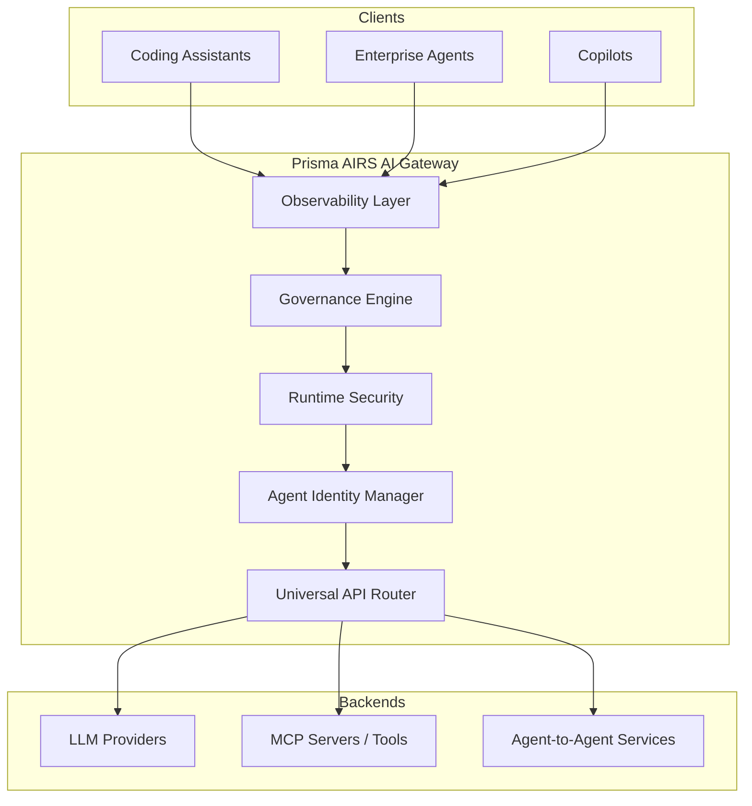

## ブログ概要（Summary）

本記事は [Announcing the General Availability of Prisma AIRS AI Gateway](https://www.paloaltonetworks.com/blog/2026/07/announcing-general-availability-of-prisma-airs-ai-gateway/) の解説記事です。

Palo Alto Networksは2026年5月29日にAIゲートウェイ企業Portkeyの買収を完了し、わずか6週間後の7月16日にPortkeyの技術をPrisma AIRSプラットフォームに統合した「Prisma AIRS AI Gateway」のGA（一般提供開始）を発表した。同ゲートウェイは月間68兆トークン以上を処理し、サブミリ秒のルーティングレイテンシと99.999%の可用性を提供すると同社は述べている。LLM、MCP（Model Context Protocol）、A2A（Agent-to-Agent）の統合ゲートウェイとして、エンタープライズAIのセキュリティ・ガバナンス・可観測性を単一のインフラ層で実現する。

この記事は [Zenn記事: Portkey AIゲートウェイで複数LLMを統合する本番構築ガイド2026](https://zenn.dev/0h_n0/articles/c184032fcd6908) の深掘りです。

## 情報源

- **種別**: 企業テックブログ
- **URL**: [https://www.paloaltonetworks.com/blog/2026/07/announcing-general-availability-of-prisma-airs-ai-gateway/](https://www.paloaltonetworks.com/blog/2026/07/announcing-general-availability-of-prisma-airs-ai-gateway/)
- **組織**: Palo Alto Networks
- **発表日**: 2026年7月16日

## 技術的背景（Technical Background）

### AIゲートウェイが必要な理由

2026年現在、エンタープライズにおけるAI利用は急速に拡大しており、それに伴うセキュリティリスクが深刻化している。Palo Alto Networksのブログによれば、MCP（Model Context Protocol）アクティビティは2025年末の11%から2026年中期に41.4%へ急増し、月間AIトランザクション量は6ヶ月間で12倍に成長したとされる。さらに、一部のAIセッションでは数百MBの企業データが外部に送信されるケースが確認されている。

このような状況下で、企業はAIの利用を3つのリスクカテゴリに分類して管理する必要があるとPalo Alto Networksは指摘している。

1. **コーディングアシスタント**: コードリポジトリ、ファイルシステム、認証情報へのアクセス権を持ち、ソースコードや秘密鍵がフロンティアモデルに送信されるリスクがある
2. **エンタープライズエージェント**: 広範なアクセス権と永続的権限を持ち、単一エージェントの誤動作がデータ侵害につながり得る
3. **コパイロット**: SaaS・生産性プラットフォームに組み込まれ、過剰な権限設定により本来アクセスできないデータを表示する可能性がある

これらのリスクに対して、個別ツールごとのセキュリティ対策では不十分であり、全AIインタラクションを横断的に制御するインフラ層が必要とされている。AIゲートウェイはまさにこの役割を担い、APIプロキシとしてのルーティング機能に加え、セキュリティポリシーの一元適用、コスト管理、可観測性を提供する統合制御ポイントとして機能する。

## 実装アーキテクチャ（Architecture）

### 統合LLM/MCP/A2Aゲートウェイ

Prisma AIRS AI Gatewayの中核的な設計思想は、「全AIインタラクションのインラインコントロールポイント」として機能することにある。従来のAPIゲートウェイがHTTPリクエストのルーティングとレート制限に特化していたのに対し、本ゲートウェイは3種類のプロトコルを統一的に扱う。



Palo Alto Networksは、このアーキテクチャの特徴として以下の3点を挙げている。

**プロトコル統合**: LLMプロバイダへのAPI呼び出し、MCPツールコール、Agent-to-Agent通信を単一のゲートウェイで処理する。これにより、異なるプロトコルごとに別々のセキュリティ対策を講じる必要がなくなる。

**インフラ層での適用**: エンフォースメント（ポリシー強制）はアプリケーション層ではなくインフラ層で行われる。これはプラットフォームチーム（インフラ運用チーム）の管轄下に置かれ、開発者は既存ツール・ワークフローを変更する必要がないとされている。

**インライン検査**: 通過する全てのプロンプトとレスポンスに対して、リアルタイムでセキュリティ検査を実行する。Prisma AIRS AI Runtime Securityモジュールがこの検査を担当し、OWASP LLM Top 10に対応した脅威検出を行う。

### Portkeyとの技術統合

Zenn記事で紹介されているPortkeyのOSSゲートウェイが提供していたルーティング、キャッシュ、ガードレール機能は、Prisma AIRSのエンタープライズセキュリティ基盤と統合された。具体的には、PortkeyのUniversal APIルーティング技術がトラフィック分散・フェイルオーバーの基盤として組み込まれ、そこにPalo Alto Networksのセキュリティインスペクション能力が加わった形となっている。

## Production Deployment Guide

本セクションでは、Prisma AIRS AI Gatewayと同等の機能を持つAIゲートウェイをAWS上で自前構築する場合のアーキテクチャパターンを解説する。Prisma AIRSはマネージドサービスとして提供されるが、そのアーキテクチャの考え方を自社環境に応用する際の参考情報として記載する。

### AWS実装パターン（コスト最適化重視）

AIゲートウェイは全てのLLMリクエストをプロキシする特性上、レイテンシとスループットが最重要指標となる。トラフィック量に応じた3段階の構成を示す。

**コスト試算の注意事項**: 以下は2026年8月時点のAWS ap-northeast-1（東京）リージョン料金に基づく概算値である。実際のコストはトラフィックパターン、リージョン、バースト使用量により変動する。最新料金はAWS料金計算ツールで確認を推奨する。

| 構成 | トラフィック | 主要サービス | 月額概算 |
|------|-------------|-------------|---------|
| Small | ~100 req/日 | Lambda + API Gateway + DynamoDB | $50-150 |
| Medium | ~1,000 req/日 | ECS Fargate + ALB + ElastiCache | $300-800 |
| Large | 10,000+ req/日 | EKS + Karpenter + Spot Instances | $2,000-5,000 |

**Small構成（~100 req/日）**:
- API Gateway: HTTPリクエスト受付・認証、$3.50/100万リクエスト
- Lambda: ルーティング・ポリシー評価、512MB/30秒タイムアウト、$0.20/100万呼出
- DynamoDB: ポリシー・監査ログ格納、On-Demandモード、$1.25/WCU
- S3: 長期ログ保管、$0.025/GB

**Medium構成（~1,000 req/日）**:
- ECS Fargate: ゲートウェイプロセス常駐、0.5vCPU/1GB RAM x 2タスク
- ALB: ロードバランシング、$22/月 + $5.60/LCU
- ElastiCache (Redis): ポリシーキャッシュ・レスポンスキャッシュ、cache.t3.micro
- CloudWatch: メトリクス・ログ集約

**Large構成（10,000+ req/日）**:
- EKS: コントロールプレーン、$72/月
- Karpenter + Spot Instances: 自動スケーリング、最大90%コスト削減
- Application Load Balancer: SSL終端・ルーティング
- ElastiCache (Redis) Cluster: ポリシーキャッシュ、マルチAZ
- Secrets Manager: プロバイダAPIキー管理
- WAF: DDoS対策・IPフィルタリング

**コスト削減テクニック**:
- Spot Instances活用: On-Demand比で最大90%削減（中断耐性のあるワーカーノードに適用）
- Reserved Instances: 1年コミットで最大72%削減（EKSコントロールプレーン、ElastiCache）
- Prompt Caching: 同一プロンプトパターンのキャッシュにより、LLMプロバイダへの課金を30-90%削減
- レスポンスキャッシュ: 同一リクエストに対するLLM応答をElastiCacheに保存し、再利用

### Terraformインフラコード

#### Small構成（Serverless）

```hcl
# AI Gateway - Small構成（Serverless）
# Lambda + API Gateway + DynamoDB
# 想定: ~100 req/日、月額$50-150

terraform {
  required_version = ">= 1.9.0"
  required_providers {
    aws = {
      source  = "hashicorp/aws"
      version = "~> 5.60"
    }
  }
}

provider "aws" {
  region = "ap-northeast-1"
}

# --- IAMロール（最小権限） ---
resource "aws_iam_role" "gateway_lambda" {
  name = "ai-gateway-lambda-role"
  assume_role_policy = jsonencode({
    Version = "2012-10-17"
    Statement = [{
      Action = "sts:AssumeRole"
      Effect = "Allow"
      Principal = { Service = "lambda.amazonaws.com" }
    }]
  })
}

resource "aws_iam_role_policy" "gateway_lambda_policy" {
  name = "ai-gateway-lambda-policy"
  role = aws_iam_role.gateway_lambda.id
  policy = jsonencode({
    Version = "2012-10-17"
    Statement = [
      {
        # DynamoDBアクセス（ポリシー読取・監査ログ書込）
        Effect   = "Allow"
        Action   = ["dynamodb:GetItem", "dynamodb:PutItem", "dynamodb:Query"]
        Resource = [
          aws_dynamodb_table.policies.arn,
          aws_dynamodb_table.audit_logs.arn
        ]
      },
      {
        # Secrets Managerからプロバイダキー取得
        Effect   = "Allow"
        Action   = ["secretsmanager:GetSecretValue"]
        Resource = [aws_secretsmanager_secret.provider_keys.arn]
      },
      {
        # CloudWatch Logsへのログ出力
        Effect   = "Allow"
        Action   = ["logs:CreateLogGroup", "logs:CreateLogStream", "logs:PutLogEvents"]
        Resource = "arn:aws:logs:ap-northeast-1:*:*"
      }
    ]
  })
}

# --- DynamoDB（ポリシーストア） ---
resource "aws_dynamodb_table" "policies" {
  name         = "ai-gateway-policies"
  billing_mode = "PAY_PER_REQUEST"  # On-Demand: 低トラフィック向けコスト最適
  hash_key     = "policy_id"

  attribute {
    name = "policy_id"
    type = "S"
  }

  server_side_encryption {
    enabled = true  # KMS暗号化
  }

  point_in_time_recovery {
    enabled = true
  }
}

# --- DynamoDB（監査ログ） ---
resource "aws_dynamodb_table" "audit_logs" {
  name         = "ai-gateway-audit-logs"
  billing_mode = "PAY_PER_REQUEST"
  hash_key     = "request_id"
  range_key    = "timestamp"

  attribute {
    name = "request_id"
    type = "S"
  }

  attribute {
    name = "timestamp"
    type = "S"
  }

  ttl {
    attribute_name = "ttl"
    enabled        = true  # 90日でログ自動削除（コスト最適化）
  }

  server_side_encryption {
    enabled = true
  }
}

# --- Secrets Manager（プロバイダAPIキー） ---
resource "aws_secretsmanager_secret" "provider_keys" {
  name        = "ai-gateway/provider-keys"
  description = "LLM provider API keys (OpenAI, Anthropic, etc.)"
}

# --- Lambda関数 ---
resource "aws_lambda_function" "gateway" {
  function_name = "ai-gateway-router"
  role          = aws_iam_role.gateway_lambda.arn
  handler       = "main.handler"
  runtime       = "python3.12"
  timeout       = 30
  memory_size   = 512  # ポリシー評価に十分なメモリ

  filename         = "lambda_package.zip"
  source_code_hash = filebase64sha256("lambda_package.zip")

  environment {
    variables = {
      POLICY_TABLE    = aws_dynamodb_table.policies.name
      AUDIT_TABLE     = aws_dynamodb_table.audit_logs.name
      SECRET_ARN      = aws_secretsmanager_secret.provider_keys.arn
      LOG_LEVEL       = "INFO"
    }
  }

  tracing_config {
    mode = "Active"  # X-Rayトレーシング有効化
  }
}

# --- CloudWatchアラーム（コスト監視） ---
resource "aws_cloudwatch_metric_alarm" "lambda_duration" {
  alarm_name          = "ai-gateway-lambda-duration-high"
  comparison_operator = "GreaterThanThreshold"
  evaluation_periods  = 3
  metric_name         = "Duration"
  namespace           = "AWS/Lambda"
  period              = 300
  statistic           = "Average"
  threshold           = 10000  # 10秒超過で警告
  alarm_description   = "Lambda duration exceeds 10s average"

  dimensions = {
    FunctionName = aws_lambda_function.gateway.function_name
  }
}
```

#### Large構成（Container）

```hcl
# AI Gateway - Large構成（Container）
# EKS + Karpenter + Spot Instances
# 想定: 10,000+ req/日、月額$2,000-5,000

# --- EKSクラスタ ---
module "eks" {
  source  = "terraform-aws-modules/eks/aws"
  version = "~> 20.24"

  cluster_name    = "ai-gateway-cluster"
  cluster_version = "1.31"

  vpc_id     = module.vpc.vpc_id
  subnet_ids = module.vpc.private_subnets

  # パブリックアクセス最小化
  cluster_endpoint_public_access  = true
  cluster_endpoint_private_access = true

  # EKS Addons
  cluster_addons = {
    coredns    = { most_recent = true }
    kube-proxy = { most_recent = true }
    vpc-cni    = { most_recent = true }
  }

  # マネージドノードグループ（システムコンポーネント用）
  eks_managed_node_groups = {
    system = {
      instance_types = ["m7i.large"]
      min_size       = 2
      max_size       = 3
      desired_size   = 2
      labels = { role = "system" }
    }
  }
}

# --- Karpenter Provisioner（Spot優先） ---
# Karpenter v1 NodePool定義
resource "kubectl_manifest" "karpenter_nodepool" {
  yaml_body = <<-YAML
    apiVersion: karpenter.sh/v1
    kind: NodePool
    metadata:
      name: ai-gateway-workers
    spec:
      template:
        metadata:
          labels:
            role: gateway-worker
        spec:
          requirements:
            - key: karpenter.sh/capacity-type
              operator: In
              values: ["spot", "on-demand"]  # Spot優先
            - key: node.kubernetes.io/instance-type
              operator: In
              values: ["m7i.xlarge", "m7i.2xlarge", "m6i.xlarge", "m6i.2xlarge"]
          nodeClassRef:
            group: karpenter.k8s.aws
            kind: EC2NodeClass
            name: default
      limits:
        cpu: "100"
        memory: "400Gi"
      disruption:
        consolidationPolicy: WhenEmptyOrUnderutilized
        consolidateAfter: 60s
  YAML
}

# --- AWS Budgets（予算アラート） ---
resource "aws_budgets_budget" "ai_gateway" {
  name         = "ai-gateway-monthly"
  budget_type  = "COST"
  limit_amount = "5000"
  limit_unit   = "USD"
  time_unit    = "MONTHLY"

  notification {
    comparison_operator       = "GREATER_THAN"
    threshold                 = 80
    threshold_type            = "PERCENTAGE"
    notification_type         = "ACTUAL"
    subscriber_email_addresses = ["platform-team@example.com"]
  }

  notification {
    comparison_operator       = "GREATER_THAN"
    threshold                 = 100
    threshold_type            = "PERCENTAGE"
    notification_type         = "FORECASTED"
    subscriber_email_addresses = ["platform-team@example.com"]
  }
}
```

### 運用・監視設定

#### CloudWatch Logs Insights クエリ

```
# コスト異常検知: 1時間あたりのトークン使用量
fields @timestamp, @message
| filter event = "llm_request"
| stats sum(total_tokens) as hourly_tokens by bin(1h)
| sort hourly_tokens desc
| limit 24
```

```
# レイテンシ分析: P95/P99
fields @timestamp, duration_ms, provider, model
| filter event = "gateway_request"
| stats percentile(duration_ms, 95) as p95,
        percentile(duration_ms, 99) as p99,
        avg(duration_ms) as avg_ms
  by provider, model
| sort p99 desc
```

#### CloudWatch アラーム設定

```python
import boto3
from typing import Any


def create_token_spike_alarm(
    function_name: str,
    threshold: int = 100000,
    sns_topic_arn: str = "",
) -> dict[str, Any]:
    """トークン使用量スパイク検知アラームを作成する。

    Args:
        function_name: 監視対象のLambda関数名
        threshold: 5分間のトークン使用量閾値
        sns_topic_arn: 通知先SNSトピックARN

    Returns:
        CloudWatch put_metric_alarm のレスポンス
    """
    client = boto3.client("cloudwatch", region_name="ap-northeast-1")
    return client.put_metric_alarm(
        AlarmName=f"{function_name}-token-spike",
        MetricName="TotalTokens",
        Namespace="AIGateway/Custom",
        Statistic="Sum",
        Period=300,
        EvaluationPeriods=2,
        Threshold=threshold,
        ComparisonOperator="GreaterThanThreshold",
        AlarmActions=[sns_topic_arn] if sns_topic_arn else [],
    )
```

#### X-Ray トレーシング設定

```python
from aws_xray_sdk.core import xray_recorder, patch_all
from aws_xray_sdk.core.models.subsegment import Subsegment


def init_xray_tracing(service_name: str = "ai-gateway") -> None:
    """X-Rayトレーシングを初期化する。

    boto3、requests等の主要ライブラリを自動計装し、
    全てのLLMプロバイダ呼び出しをトレース可能にする。

    Args:
        service_name: X-Rayサービス名
    """
    xray_recorder.configure(service=service_name)
    patch_all()  # boto3, requests, httplib 等を自動計装


def trace_llm_request(
    provider: str,
    model: str,
    token_count: int,
) -> Subsegment:
    """LLMリクエストのサブセグメントを作成する。

    Args:
        provider: LLMプロバイダ名（例: "openai", "anthropic"）
        model: モデル名（例: "gpt-4o", "claude-sonnet-4"）
        token_count: 合計トークン数

    Returns:
        X-Ray サブセグメント
    """
    subsegment = xray_recorder.begin_subsegment(f"llm-{provider}")
    subsegment.put_annotation("provider", provider)
    subsegment.put_annotation("model", model)
    subsegment.put_metadata("token_count", token_count, "llm")
    return subsegment
```

#### Cost Explorer 自動レポート

```python
import boto3
from datetime import datetime, timedelta
from typing import Any


def get_daily_cost_report(
    days_back: int = 1,
    threshold_usd: float = 100.0,
    sns_topic_arn: str = "",
) -> dict[str, Any]:
    """日次コストレポートを取得し、閾値超過時にSNS通知する。

    Args:
        days_back: 何日前のコストを取得するか
        threshold_usd: 日次コスト閾値（USD）
        sns_topic_arn: 通知先SNSトピックARN

    Returns:
        サービス別コスト情報の辞書
    """
    ce = boto3.client("ce", region_name="us-east-1")
    end = datetime.utcnow().strftime("%Y-%m-%d")
    start = (datetime.utcnow() - timedelta(days=days_back)).strftime("%Y-%m-%d")

    response = ce.get_cost_and_usage(
        TimePeriod={"Start": start, "End": end},
        Granularity="DAILY",
        Metrics=["UnblendedCost"],
        GroupBy=[{"Type": "DIMENSION", "Key": "SERVICE"}],
        Filter={
            "Tags": {
                "Key": "Project",
                "Values": ["ai-gateway"],
            }
        },
    )

    total_cost = 0.0
    service_costs: dict[str, float] = {}
    for group in response["ResultsByTime"][0]["Groups"]:
        service = group["Keys"][0]
        cost = float(group["Metrics"]["UnblendedCost"]["Amount"])
        service_costs[service] = cost
        total_cost += cost

    if total_cost > threshold_usd and sns_topic_arn:
        sns = boto3.client("sns", region_name="ap-northeast-1")
        sns.publish(
            TopicArn=sns_topic_arn,
            Subject=f"AI Gateway Cost Alert: ${total_cost:.2f}/day",
            Message=f"Daily cost exceeded ${threshold_usd}: ${total_cost:.2f}",
        )

    return {"total_cost": total_cost, "services": service_costs}
```

### コスト最適化チェックリスト

**アーキテクチャ選択**:
- [ ] トラフィック量でServerless/Hybrid/Containerを選択
- [ ] 100 req/日以下ならLambda + API Gateway（最安）
- [ ] 1,000 req/日以上ならECS Fargate（コールドスタート回避）
- [ ] 10,000 req/日以上ならEKS + Spot（スケーラビリティ重視）

**リソース最適化**:
- [ ] EC2/EKSワーカー: Spot Instances優先（最大90%削減）
- [ ] Reserved Instances: ElastiCache、RDSに1年コミット（最大72%削減）
- [ ] Savings Plans: Fargate/Lambda向けCompute Savings Plans検討
- [ ] Lambda: メモリサイズをPower Tuningで最適化（256-1024MB）
- [ ] ECS/EKS: Karpenterで未使用ノード自動回収（consolidateAfter: 60s）
- [ ] NAT Gateway: 不要ならVPCエンドポイントに置換（月額$32節約/AZ）

**LLMコスト削減**:
- [ ] レスポンスキャッシュ: ElastiCacheで同一リクエストをキャッシュ
- [ ] Prompt Caching: プロバイダ側のキャッシュ機能を活用（30-90%削減）
- [ ] モデル選択ロジック: リクエスト内容に応じて低コストモデルにルーティング
- [ ] トークン数制限: max_tokensを用途に応じて設定
- [ ] バッチ処理: リアルタイム性不要ならBatch API活用（50%削減）

**監視・アラート**:
- [ ] AWS Budgets: 月額上限設定と80%/100%通知
- [ ] CloudWatch アラーム: トークンスパイク検知
- [ ] Cost Anomaly Detection: 異常コスト自動検知
- [ ] 日次コストレポート: Cost Explorer APIで自動取得
- [ ] タグベース集計: Project/Team/Environmentタグ必須

**リソース管理**:
- [ ] 未使用リソース: 月次で未使用EC2/EBS/ENIを棚卸し
- [ ] タグ戦略: 全リソースにProject/Team/Environmentタグ付与
- [ ] ライフサイクルポリシー: S3ログ90日でGlacier移行、180日で削除
- [ ] 開発環境夜間停止: EventBridgeで平日8-20時のみ稼働
- [ ] ECRイメージ: ライフサイクルポリシーで古いイメージ自動削除

## パフォーマンス最適化（Performance）

Palo Alto Networksはブログにおいて、Prisma AIRS AI Gatewayの以下のパフォーマンス指標を公表している。

| 指標 | 値 |
|------|-----|
| 月間トークン処理量 | 68兆+ |
| ルーティングレイテンシ | サブミリ秒 |
| 可用性 | 99.999% |

月間68兆トークンという処理量は、1秒あたり約2,600万トークンの平均スループットに相当する。サブミリ秒のルーティングレイテンシは、インライン検査（プロンプト・レスポンスのセキュリティスキャン）を含めた値であるとブログには記載されている。これは、ゲートウェイの導入によるユーザー体験への影響が実質的にないことを意味する。

99.999%の可用性（Five Nines）は、年間ダウンタイムが約5.26分に相当する。エンタープライズAIワークロードにおいて、全てのリクエストがゲートウェイを経由する設計では、ゲートウェイ自体の可用性がシステム全体のSLAを左右するため、この水準は不可欠とされている。

PortkeyのOSSゲートウェイが元々備えていたUniversal APIルーティング技術が、このパフォーマンスの基盤となっている。プロバイダ間のトラフィック分散、フェイルオーバー、リトライロジックがインフラ層で処理されることで、個々のアプリケーションがプロバイダ障害を意識する必要がなくなる。

## 運用での学び（Production Lessons）

Palo Alto Networksはブログにおいて、エンタープライズAIの運用で直面する3つの核心的課題を指摘している。

### Shadow AI

Palo Alto Networksは、チーム間でのAIツールの隠れた利用（Shadow AI）が深刻な問題であると述べている。開発者が個人のAPIキーで外部LLMを利用するケースでは、企業はどのデータが外部に送信されているかを把握できない。Prisma AIRS AI Gatewayでは、Observability機能により全AIインタラクションの使用量、ユーザー、プロジェクト、トークン数、レイテンシ、コストを統合的に可視化し、未承認のAI利用を検出可能にするとされている。

### Data Exposure（データ流出）

AIインタラクションを通じた機密データ流出について、ブログでは「検出なしの機密データ流出」が課題であると指摘されている。Runtime Security機能がプロンプトとレスポンスのインライン検査を行い、ソースコード、秘密鍵、顧客データの外部送信を検知・ブロックする設計となっている。OWASP LLM Top 10およびAgentic Applicationsフレームワークに準拠した脅威検出を提供するとPalo Alto Networksは述べている。

### Agent Overstep（エージェントの権限逸脱）

エンタープライズエージェントがID・権限・説明責任なしにアクションを実行するリスクについて、Agent Identity Security機能でエフェメラル（一時的な）IDをエージェントにバインドし、認証済みエージェントのみがツール呼び出しやAgent-to-Agent通信を行えるように制御する。これにより、エージェントの行動に対する監査証跡が確保される。

## 学術研究との関連（Academic Connection）

Prisma AIRS AI Gatewayが対処するセキュリティ課題は、学術研究の知見と密接に関連している。OWASP LLM Top 10（2025年改訂版）は、プロンプトインジェクション、データリーケージ、過剰権限エージェントなど、本ゲートウェイが検出対象とする脅威を体系的に分類している。また、MCP（Model Context Protocol）のセキュリティに関する研究は、ツールコールを介した間接的なデータ流出経路の分析を進めており、ゲートウェイによるMCPトラフィックの検査はこの研究の実装面での応用と位置づけられる。GartnerがPalo Alto Networksを「AI Security PlatformsのCategory Leader」と評価している点は、同社のアプローチが業界標準となりつつあることを示唆している。

## まとめと実践への示唆

Prisma AIRS AI Gatewayは、Portkey買収から6週間というスピードでGA到達を実現し、LLM・MCP・A2Aの3プロトコルを統合的に制御するエンタープライズAIゲートウェイとして発表された。Shadow AI、Data Exposure、Agent Overstepという3つの核心的課題に対し、インフラ層での一元的な制御という設計思想で対処している。月間68兆トークン、サブミリ秒レイテンシ、99.999%可用性という数値は、ゲートウェイの導入がAIワークロードのパフォーマンスに実質的な影響を与えないことを示すものである。自社でAIゲートウェイを構築する場合も、本記事で示したAWSアーキテクチャパターンを参考に、セキュリティポリシーの一元管理とコスト最適化を両立した設計を検討されたい。

## 参考文献

- **Blog URL**: [Announcing the General Availability of Prisma AIRS AI Gateway](https://www.paloaltonetworks.com/blog/2026/07/announcing-general-availability-of-prisma-airs-ai-gateway/)
- **OWASP LLM Top 10**: [https://owasp.org/www-project-top-10-for-large-language-model-applications/](https://owasp.org/www-project-top-10-for-large-language-model-applications/)
- **Related Zenn article**: [Portkey AIゲートウェイで複数LLMを統合する本番構築ガイド2026](https://zenn.dev/0h_n0/articles/c184032fcd6908)
