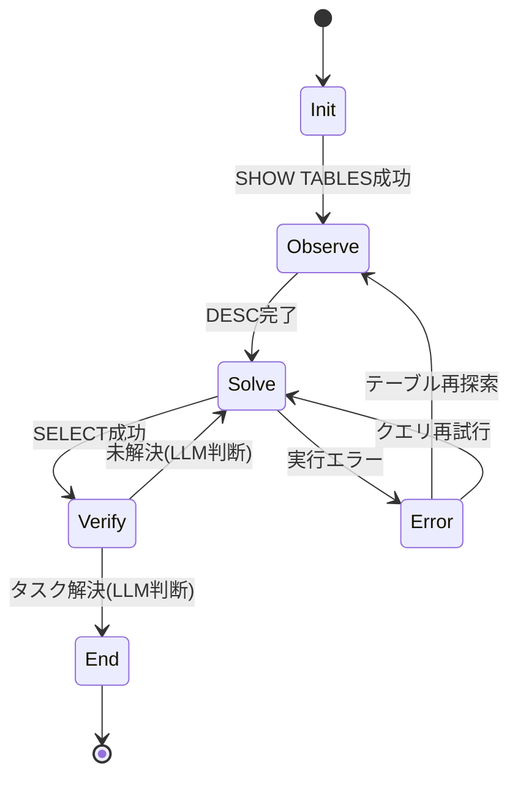

本記事は [StateFlow: Enhancing LLM Task-Solving through State-Driven Workflows](https://arxiv.org/abs/2403.11322) の解説記事です。

## 論文概要（Abstract）

StateFlowは、LLMベースの複雑なタスク解決プロセスを**有限状態マシン（FSM）**として概念化する新しいパラダイムである。従来のReActパターンが単一のモノリシックなプロンプトで推論と行動を制御するのに対し、StateFlowは「プロセスの制御（process grounding）」と「サブタスクの実行（sub-task solving）」を分離する。著者らは、InterCode SQLベンチマークでReAct比+13%の成功率向上と5倍のコスト削減、ALFWorldで+28%の成功率向上と3倍のコスト削減を報告している（論文Table 1, 3より）。

この記事は [Zenn記事: LangGraph Command APIで設計する宣言的ステートマシン実装パターン](https://zenn.dev/0h_n0/articles/b0d404e4bc8675) の深掘りです。

## 情報源

- **arXiv ID**: 2403.11322
- **URL**: [https://arxiv.org/abs/2403.11322](https://arxiv.org/abs/2403.11322)
- **著者**: Yiran Wu, Tianwei Yue, Shaokun Zhang, Chi Wang, Qingyun Wu
- **発表年**: 2024年（COLM 2024採択）
- **分野**: cs.CL（Computation and Language）, cs.AI（Artificial Intelligence）
- **ライセンス**: CC BY 4.0

## 背景と動機（Background & Motivation）

LLMをエージェントとして活用する際、ReActパターンは「Thought-Action-Observation」の逐次ループで推論と行動を交互に実行する。しかしこの設計には構造的な問題がある。第一に、プロセス全体を単一のプロンプトで制御するため、タスクが複雑化するとプロンプトが肥大化し制御困難になる。第二に、ReActのプロンプトには通常4つ程度の例示軌跡が必要で（論文によれば約2,043トークン）、APIコストが累積呼び出しで急増する。第三に、エラー発生時のリカバリ戦略を自然言語の指示だけで記述することは信頼性に欠ける。

StateFlowは、これらの課題を有限状態マシン（FSM）の形式的な枠組みで解決する。各状態に専用のプロンプトと行動を割り当てることで、プロンプトを短く保ちつつ、状態遷移によってプロセス全体の制御を明示的に行う。この「状態による制御」と「状態内の行動によるタスク実行」の分離が、StateFlowの核心的なアイデアである。

## 主要な貢献（Key Contributions）

- **FSMによるLLMタスク解決の形式化**: LLMのタスク解決プロセスを6つ組$\langle S, s_0, F, \delta, \Gamma, \Omega \rangle$として定式化し、プロセス制御（process grounding）とサブタスク解決（sub-task solving）を明確に分離した
- **コスト効率の大幅改善**: ReActと比較してInterCode SQLで5倍、ALFWorldで3倍のAPIコスト削減を達成。これは状態ごとの短いプロンプト設計とトークン累積の抑制によるものである
- **既存手法との直交的な組み合わせ**: Reflexionのような反復改善手法と組み合わせることでALFWorldの成功率を94.8%まで向上できることを実証し、StateFlowが他の手法と補完的に機能することを示した

## 技術的詳細（Technical Details）

### StateFlowの形式的定義

StateFlowは以下の6つ組として定式化される。

$$
\text{StateFlow} = \langle S, s_0, F, \delta, \Gamma, \Omega \rangle
$$

ここで、
- $S$: 状態の有限集合。タスク解決プロセスの各フェーズを表現する
- $s_0 \in S$: 初期状態
- $F \subseteq S$: 最終状態の集合
- $\delta: S \times \Gamma^* \rightarrow S$: 状態遷移関数。現在の状態とコンテキスト履歴から次の状態を決定する
- $\Gamma$: 出力アルファベット。プロンプト$P$、LLMの出力$C$、ツールの観測$O$から構成される
- $\Omega$: 出力関数の集合。各$\omega: \Gamma^* \rightarrow \Gamma$はコンテキスト履歴から新しい出力を生成する

### 状態遷移の設計

状態遷移関数$\delta$は2つの方式で実装できる。

**1. ヒューリスティックルール（静的遷移）**: ツール出力やLLMの応答に対する文字列マッチングで遷移先を決定する。例えばSQL実行の成功パターンを検出して次の状態に遷移する。決定的で高速だが、柔軟性に欠ける。

**2. LLM判断（動的遷移）**: コンテキストが複雑で文字列マッチングでは判断困難な場合、LLMに明示的に状態判定を依頼する。Verify状態で「このタスクは解決されたか？」とLLMに問い合わせるケースがこれに該当する。

この2つの遷移方式は、LangGraphにおける`add_conditional_edges`（条件関数による静的ルーティング）と`Command(goto=..., update=...)`（ノード内での動的ルーティング）にそれぞれ対応する。StateFlowの学術的な状態遷移設計が、LangGraphのAPI設計に直結していることがわかる。

### InterCode SQLの状態マシン設計

論文のFigure 1で示されているSQL向けの状態マシンは以下の5状態で構成される。



各状態の出力関数は以下の通りである。

| 状態 | 実行内容 | 遷移条件 |
|------|---------|---------|
| Init | `SHOW TABLES`を実行 | 成功 -> Observe |
| Observe | `DESC <table>`でスキーマ探索 | 完了 -> Solve |
| Solve | LLMがSELECTクエリを生成・実行 | 成功 -> Verify, エラー -> Error |
| Verify | LLMが結果を自己評価 | 解決済み -> End, 未解決 -> Solve |
| Error | エラー内容に基づき復帰戦略を選択 | 再探索 -> Observe, 再試行 -> Solve |

### アルゴリズム

論文のAlgorithm 1に基づくStateFlowの実行ループを以下に示す。

```python
from dataclasses import dataclass, field
from typing import Callable, Protocol


class OutputFunction(Protocol):
    """状態内で実行される出力関数のプロトコル"""
    def __call__(self, context: list[str]) -> str: ...


@dataclass
class State:
    """StateFlowの状態定義

    Attributes:
        name: 状態名
        output_functions: この状態で実行する出力関数のリスト
        transition: コンテキスト履歴から次の状態名を返す遷移関数
    """
    name: str
    output_functions: list[OutputFunction]
    transition: Callable[[list[str]], str]


@dataclass
class StateFlowEngine:
    """StateFlowの実行エンジン

    Attributes:
        states: 状態名から状態オブジェクトへのマッピング
        initial_state: 初期状態名
        final_states: 最終状態名の集合
        max_transitions: 最大遷移回数（無限ループ防止）
    """
    states: dict[str, State]
    initial_state: str
    final_states: set[str]
    max_transitions: int = 25

    def run(self, task: str) -> tuple[str, list[str]]:
        """タスクを実行して最終状態とコンテキスト履歴を返す

        Args:
            task: 解決するタスクの記述

        Returns:
            (最終状態名, コンテキスト履歴)のタプル
        """
        context: list[str] = [task]
        current = self.initial_state
        steps = 0

        while current not in self.final_states and steps < self.max_transitions:
            state = self.states[current]
            # 状態内の出力関数を順次実行
            for omega in state.output_functions:
                output = omega(context)
                context.append(output)
            # 遷移関数で次の状態を決定
            current = state.transition(context)
            steps += 1

        return current, context
```

## 実装のポイント（Implementation）

StateFlowを実装する際の要点を以下にまとめる。

**状態の粒度設計**: 著者らのablation study（論文Table 2）によると、Observe状態を除去すると成功率が63.73%から57.83%に低下し、エラー率が6.82%から17.0%に急増する。テーブルスキーマの事前探索がクエリ生成の精度に直結するため、データ探索フェーズを独立した状態として設計することが重要である。

**プロンプトの分離**: ReActが2,043トークンのプロンプトを毎回送信するのに対し、StateFlowは状態ごとに約400トークンの短いプロンプトを使用する。この設計がAPI呼び出しごとのトークンコストを大幅に削減する。

**エラーリカバリの明示化**: Error状態を除去するとエラー率が6.82%から11.6%に増加し（論文Table 2）、連鎖的な失敗が発生する。エラー状態を独立して設け、Observe（テーブル再探索）またはSolve（クエリ再試行）への復帰パスを明示的に定義することが堅牢性の鍵である。

以下にLangGraphでのStateFlow的パターンの実装例を示す。

```python
from typing import TypedDict, Literal

from langgraph.graph import StateGraph, END
from langgraph.types import Command


class SQLTaskState(TypedDict):
    """SQL タスクの状態定義

    Attributes:
        task: 解決するSQLタスクの記述
        tables: 発見したテーブル名のリスト
        schema_info: テーブルスキーマ情報
        query_result: 最後のクエリ実行結果
        error_count: 連続エラー回数
        messages: LLMとのメッセージ履歴
    """
    task: str
    tables: list[str]
    schema_info: str
    query_result: str
    error_count: int
    messages: list[dict]


def init_node(state: SQLTaskState) -> Command[Literal["observe"]]:
    """Init状態: SHOW TABLESを実行してテーブル一覧を取得する

    StateFlowのInit状態に対応。データベース内のテーブルを
    列挙し、Observe状態への遷移をCommandで指示する。
    """
    tables = execute_sql("SHOW TABLES")
    return Command(
        goto="observe",
        update={"tables": tables},
    )


def observe_node(state: SQLTaskState) -> Command[Literal["solve"]]:
    """Observe状態: テーブルスキーマを探索する

    DESCコマンドでテーブル構造を取得し、Solve状態に遷移。
    StateFlowのablation studyで最も重要と判明した状態。
    """
    schema = explore_table_schemas(state["tables"])
    return Command(
        goto="solve",
        update={"schema_info": schema},
    )


def solve_node(
    state: SQLTaskState,
) -> Command[Literal["verify", "error"]]:
    """Solve状態: LLMがSQLクエリを生成・実行する

    ヒューリスティックルール（実行成功/失敗）で遷移先を決定。
    StateFlowの静的遷移に対応する。
    """
    query = generate_sql_query(state)
    try:
        result = execute_sql(query)
        return Command(
            goto="verify",
            update={"query_result": result, "error_count": 0},
        )
    except SQLError:
        return Command(
            goto="error",
            update={"error_count": state["error_count"] + 1},
        )


def verify_node(
    state: SQLTaskState,
) -> Command[Literal["solve", "__end__"]]:
    """Verify状態: LLMが結果を自己評価する

    LLM判断による動的遷移。StateFlowのLLMベース遷移に対応し、
    LangGraphのCommand(goto=...)で実装する。
    """
    is_solved = llm_evaluate_result(state)
    if is_solved:
        return Command(goto=END)
    return Command(goto="solve")


# StateGraph構築
graph = StateGraph(SQLTaskState)
graph.add_node("init", init_node)
graph.add_node("observe", observe_node)
graph.add_node("solve", solve_node)
graph.add_node("verify", verify_node)
graph.set_entry_point("init")
app = graph.compile()
```

この実装では、LangGraphの`Command`がStateFlowの状態遷移関数$\delta$に対応する。`solve_node`はヒューリスティックルール（例外の有無）で遷移先を決定し、`verify_node`はLLM判断で動的に遷移先を選択する。この2つの遷移方式の使い分けがStateFlowの設計原則そのものである。

## Production Deployment Guide

### AWS実装パターン（コスト最適化重視）

StateFlowベースのLLMエージェントをAWS上にデプロイする際の構成を、トラフィック量別に示す。コスト試算は2026年8月時点のap-northeast-1（東京）リージョン料金に基づく概算値であり、実際のコストはトラフィックパターンやバースト使用量により変動する。最新料金はAWS料金計算ツールで確認を推奨する。

| 構成 | トラフィック | 主要サービス | 月額概算 |
|------|-------------|-------------|---------|
| Small | ~100 req/日 | Lambda + Bedrock + DynamoDB | $50-150 |
| Medium | ~1,000 req/日 | ECS Fargate + Bedrock + ElastiCache | $300-800 |
| Large | 10,000+ req/日 | EKS + Karpenter + Spot + Bedrock | $2,000-5,000 |

**Small構成**: Lambda関数でStateFlowエンジンを実行し、状態遷移の履歴をDynamoDBに保存する。Bedrock（Claude 3.5 Sonnet）でLLM呼び出しを行う。状態ごとの短いプロンプト設計により、Bedrockのトークンコストを抑制できる。月額内訳はLambda $5-10、Bedrock $30-100、DynamoDB $5-15、CloudWatch $5-10程度。

**Medium構成**: ECS Fargateで常駐サービスとして稼働させ、ElastiCacheでプロンプトテンプレートと頻出スキーマ情報をキャッシュする。vCPU 0.5、メモリ1GBのタスク定義で十分。

**Large構成**: EKSクラスタにKarpenterを導入し、Spot Instancesを優先的に割り当てる。高頻度のLLM呼び出しにはBedrock Batch APIを活用して50%のコスト削減を図る。

**コスト削減テクニック**:
- Spot Instances活用で最大90%のEC2コスト削減
- Reserved Instances（1年コミット）で最大72%削減
- Bedrock Batch APIで50%削減（非同期処理が許容される場合）
- Prompt Caching有効化で30-90%削減（状態ごとのプロンプトはキャッシュヒット率が高い）

### Terraformインフラコード

**Small構成（Serverless）**: Lambda + Bedrock + DynamoDB

```hcl
# StateFlow Agent - Small構成（Serverless）
# 月額 $50-150 / ~100 req/日

# --- DynamoDB: 状態遷移履歴の永続化 ---
resource "aws_dynamodb_table" "stateflow_history" {
  name         = "stateflow-transition-history"
  billing_mode = "PAY_PER_REQUEST" # On-Demand でコスト最適化
  hash_key     = "task_id"
  range_key    = "transition_seq"

  attribute {
    name = "task_id"
    type = "S"
  }
  attribute {
    name = "transition_seq"
    type = "N"
  }

  server_side_encryption {
    enabled = true # KMS暗号化
  }

  point_in_time_recovery {
    enabled = true
  }

  tags = {
    Project     = "stateflow-agent"
    Environment = "production"
    CostCenter  = "llm-agent"
  }
}

# --- IAMロール: 最小権限の原則 ---
resource "aws_iam_role" "stateflow_lambda" {
  name = "stateflow-lambda-role"
  assume_role_policy = jsonencode({
    Version = "2012-10-17"
    Statement = [{
      Action    = "sts:AssumeRole"
      Effect    = "Allow"
      Principal = { Service = "lambda.amazonaws.com" }
    }]
  })
}

resource "aws_iam_role_policy" "stateflow_permissions" {
  name = "stateflow-permissions"
  role = aws_iam_role.stateflow_lambda.id
  policy = jsonencode({
    Version = "2012-10-17"
    Statement = [
      {
        Effect   = "Allow"
        Action   = ["bedrock:InvokeModel"]
        Resource = "arn:aws:bedrock:ap-northeast-1::foundation-model/anthropic.claude-3-5-sonnet-*"
      },
      {
        Effect = "Allow"
        Action = [
          "dynamodb:PutItem",
          "dynamodb:GetItem",
          "dynamodb:Query"
        ]
        Resource = aws_dynamodb_table.stateflow_history.arn
      },
      {
        Effect = "Allow"
        Action = [
          "logs:CreateLogGroup",
          "logs:CreateLogStream",
          "logs:PutLogEvents"
        ]
        Resource = "arn:aws:logs:*:*:*"
      }
    ]
  })
}

# --- Lambda関数: StateFlowエンジン ---
resource "aws_lambda_function" "stateflow_engine" {
  function_name = "stateflow-engine"
  runtime       = "python3.12"
  handler       = "handler.lambda_handler"
  role          = aws_iam_role.stateflow_lambda.arn
  timeout       = 300 # 状態遷移の最大25ステップを考慮
  memory_size   = 512

  environment {
    variables = {
      DYNAMODB_TABLE    = aws_dynamodb_table.stateflow_history.name
      MAX_TRANSITIONS   = "25"
      BEDROCK_MODEL_ID  = "anthropic.claude-3-5-sonnet-20241022-v2:0"
    }
  }

  tracing_config {
    mode = "Active" # X-Rayトレーシング有効化
  }

  tags = {
    Project = "stateflow-agent"
  }
}

# --- CloudWatchアラーム: コスト監視 ---
resource "aws_cloudwatch_metric_alarm" "bedrock_token_spike" {
  alarm_name          = "stateflow-bedrock-token-spike"
  comparison_operator = "GreaterThanThreshold"
  evaluation_periods  = 1
  metric_name         = "InputTokenCount"
  namespace           = "AWS/Bedrock"
  period              = 3600
  statistic           = "Sum"
  threshold           = 100000 # 1時間あたり10万トークン超過で警告
  alarm_actions       = [aws_sns_topic.alerts.arn]
}

resource "aws_sns_topic" "alerts" {
  name = "stateflow-alerts"
}
```

**Large構成（Container）**: EKS + Karpenter + Spot Instances

```hcl
# StateFlow Agent - Large構成（Container）
# 月額 $2,000-5,000 / 10,000+ req/日

# --- EKSクラスタ ---
module "eks" {
  source          = "terraform-aws-modules/eks/aws"
  version         = "~> 20.0"
  cluster_name    = "stateflow-cluster"
  cluster_version = "1.31"

  vpc_id     = module.vpc.vpc_id
  subnet_ids = module.vpc.private_subnets

  cluster_endpoint_public_access = false # プライベートアクセスのみ

  tags = {
    Project     = "stateflow-agent"
    Environment = "production"
  }
}

# --- Karpenter: Spot優先の自動スケーリング ---
resource "kubectl_manifest" "karpenter_nodepool" {
  yaml_body = yamlencode({
    apiVersion = "karpenter.sh/v1"
    kind       = "NodePool"
    metadata   = { name = "stateflow-pool" }
    spec = {
      template = {
        spec = {
          requirements = [
            { key = "karpenter.sh/capacity-type", operator = "In", values = ["spot", "on-demand"] },
            { key = "node.kubernetes.io/instance-type", operator = "In",
              values = ["m6i.large", "m6i.xlarge", "m7i.large", "m7i.xlarge"] },
          ]
        }
      }
      limits   = { cpu = "100", memory = "400Gi" }
      disruption = {
        consolidationPolicy = "WhenEmptyOrUnderutilized"
        consolidateAfter    = "30s"
      }
    }
  })
}

# --- Secrets Manager: Bedrock設定 ---
resource "aws_secretsmanager_secret" "bedrock_config" {
  name                    = "stateflow/bedrock-config"
  recovery_window_in_days = 7
}

# --- AWS Budgets: 予算アラート ---
resource "aws_budgets_budget" "stateflow_monthly" {
  name         = "stateflow-monthly-budget"
  budget_type  = "COST"
  limit_amount = "5000"
  limit_unit   = "USD"
  time_unit    = "MONTHLY"

  cost_filter {
    name   = "TagKeyValue"
    values = ["user:Project$stateflow-agent"]
  }

  notification {
    comparison_operator       = "GREATER_THAN"
    threshold                 = 80
    threshold_type            = "PERCENTAGE"
    notification_type         = "FORECASTED"
    subscriber_sns_topic_arns = [aws_sns_topic.alerts.arn]
  }
}
```

### 運用・監視設定

**CloudWatch Logs Insights クエリ**: 状態遷移の異常検知とコスト分析

```
# 状態遷移回数が閾値を超えるタスクの検出
fields @timestamp, task_id, transition_count, total_tokens
| filter transition_count > 15
| sort transition_count desc
| limit 20

# 1時間あたりのBedrock トークン使用量トレンド
fields @timestamp, input_tokens, output_tokens
| stats sum(input_tokens) as total_input, sum(output_tokens) as total_output by bin(1h)
| sort @timestamp desc
```

**CloudWatch アラーム設定（Python）**:

```python
import boto3


def setup_stateflow_alarms(sns_topic_arn: str) -> None:
    """StateFlowエージェント用のCloudWatchアラームを設定する

    Args:
        sns_topic_arn: 通知先のSNSトピックARN
    """
    cw = boto3.client("cloudwatch", region_name="ap-northeast-1")

    # Bedrock トークン使用量スパイク検知
    cw.put_metric_alarm(
        AlarmName="stateflow-bedrock-token-spike",
        MetricName="InputTokenCount",
        Namespace="AWS/Bedrock",
        Statistic="Sum",
        Period=3600,
        EvaluationPeriods=1,
        Threshold=100000,
        ComparisonOperator="GreaterThanThreshold",
        AlarmActions=[sns_topic_arn],
    )

    # Lambda 実行時間異常検知
    cw.put_metric_alarm(
        AlarmName="stateflow-lambda-duration",
        MetricName="Duration",
        Namespace="AWS/Lambda",
        Dimensions=[{"Name": "FunctionName", "Value": "stateflow-engine"}],
        Statistic="p99",
        Period=300,
        EvaluationPeriods=3,
        Threshold=280000,  # 280秒 (タイムアウト300秒の93%)
        ComparisonOperator="GreaterThanThreshold",
        AlarmActions=[sns_topic_arn],
    )
```

**X-Ray トレーシング設定（Python）**:

```python
from aws_xray_sdk.core import xray_recorder, patch_all


def configure_xray_tracing() -> None:
    """X-Rayトレーシングを設定しboto3を自動計装する"""
    xray_recorder.configure(service="stateflow-engine")
    patch_all()  # boto3, requests等を自動計装


def trace_state_transition(
    task_id: str,
    from_state: str,
    to_state: str,
    tokens_used: int,
) -> None:
    """状態遷移をX-Rayにアノテーションとして記録する

    Args:
        task_id: タスク識別子
        from_state: 遷移元の状態名
        to_state: 遷移先の状態名
        tokens_used: この遷移で使用したトークン数
    """
    segment = xray_recorder.current_segment()
    segment.put_annotation("task_id", task_id)
    segment.put_annotation("from_state", from_state)
    segment.put_annotation("to_state", to_state)
    segment.put_metadata("tokens_used", tokens_used)
```

**Cost Explorer日次レポート（Python）**:

```python
import datetime

import boto3


def get_daily_stateflow_cost() -> dict[str, float]:
    """StateFlowエージェントの日次コストレポートを取得する

    Returns:
        サービス名をキー、コスト(USD)を値とする辞書
    """
    ce = boto3.client("ce", region_name="us-east-1")
    today = datetime.date.today()
    yesterday = today - datetime.timedelta(days=1)

    response = ce.get_cost_and_usage(
        TimePeriod={
            "Start": yesterday.isoformat(),
            "End": today.isoformat(),
        },
        Granularity="DAILY",
        Metrics=["UnblendedCost"],
        Filter={
            "Tags": {
                "Key": "Project",
                "Values": ["stateflow-agent"],
            }
        },
        GroupBy=[{"Type": "DIMENSION", "Key": "SERVICE"}],
    )

    costs: dict[str, float] = {}
    for group in response["ResultsByTime"][0]["Groups"]:
        service = group["Keys"][0]
        amount = float(group["Metrics"]["UnblendedCost"]["Amount"])
        if amount > 0:
            costs[service] = amount

    # $100/日超過でSNS通知
    total = sum(costs.values())
    if total > 100.0:
        sns = boto3.client("sns", region_name="ap-northeast-1")
        sns.publish(
            TopicArn="arn:aws:sns:ap-northeast-1:ACCOUNT:stateflow-alerts",
            Subject=f"StateFlow daily cost alert: ${total:.2f}",
            Message=f"Daily cost exceeded $100: ${total:.2f}\n{costs}",
        )
    return costs
```

### コスト最適化チェックリスト

**アーキテクチャ選択**:
- [ ] トラフィック量に応じた構成選択（~100: Serverless / ~1,000: Hybrid / 10,000+: Container）
- [ ] 非同期処理可能なタスクはBatch API経由で実行

**リソース最適化**:
- [ ] EC2/EKS: Spot Instances優先（最大90%削減）
- [ ] Reserved Instances: 1年コミットで最大72%削減
- [ ] Savings Plans: コンピューティング全体で検討
- [ ] Lambda: メモリサイズをPower Tuningで最適化（512MB推奨）
- [ ] ECS/EKS: Karpenterでアイドル時スケールダウン（consolidateAfter: 30s）
- [ ] NAT Gateway: VPCエンドポイント活用で削減

**LLMコスト削減**:
- [ ] Bedrock Batch API使用（非同期で50%削減）
- [ ] Prompt Caching有効化（状態ごとのプロンプトはキャッシュ効率が高い）
- [ ] モデル選択ロジック（簡易タスクはHaikuクラス、複雑タスクはSonnetクラス）
- [ ] トークン数制限（max_transitions=25で無限ループ防止）
- [ ] 状態ごとのプロンプト最適化（400トークン以下を目標）

**監視・アラート**:
- [ ] AWS Budgets設定（月次予算の80%で予測アラート）
- [ ] CloudWatch アラーム（トークンスパイク、Lambda実行時間）
- [ ] Cost Anomaly Detection有効化
- [ ] 日次コストレポート自動送信（$100/日閾値）

**リソース管理**:
- [ ] 未使用リソース定期削除（月次棚卸し）
- [ ] タグ戦略統一（Project, Environment, CostCenter）
- [ ] DynamoDB TTL設定（古い遷移履歴の自動削除）
- [ ] CloudWatch Logsライフサイクルポリシー（90日保持）
- [ ] 開発環境の夜間・週末自動停止

## 実験結果（Results）

### InterCode SQLベンチマーク

論文Table 1より、GPT-3.5-Turboを用いた結果を示す。

| 手法 | 成功率 | ターン数 | エラー率 | コスト ($) |
|------|--------|---------|---------|-----------|
| Plan & Solve | 47.68% | 4.31 | 12.5% | 2.38 |
| ReAct | 50.68% | 5.58 | 16.3% | 17.73 |
| ReAct (Refined) | 57.74% | 5.47 | 3.82% | 18.05 |
| **StateFlow** | **63.73%** | 5.67 | 6.82% | **3.82** |

StateFlowはReActに対して成功率で+13.05ポイント、コストで約4.6倍の削減を達成している。GPT-4-Turboでも同様の傾向が確認されており、StateFlowは69.34%、ReActは60.16%、コストは$36対$147と約4倍の差が報告されている。

### ALFWorldベンチマーク

論文Table 3より、6種類のタスクにわたる結果を示す。

| 手法 | Pick | Clean | Heat | Cool | Look | Pick2 | 全体 | コスト ($) |
|------|------|-------|------|------|------|-------|------|-----------|
| ReAct | 83.3% | 36.6% | 53.6% | 58.7% | 63.0% | 41.2% | 55.5% | 6.6 |
| ALFChat (3 agents) | 84.7% | 60.2% | 69.6% | 77.8% | 68.5% | 41.2% | 67.7% | 6.1 |
| **StateFlow** | **91.7%** | **83.9%** | **85.5%** | **79.4%** | **92.6%** | **62.7%** | **83.3%** | **2.6** |

StateFlowはReActに対して全体成功率で+27.8ポイント、コストで約2.5倍の削減を達成している。特にClean（+47.3pp）やLook（+29.6pp）タスクでの改善が顕著であり、これは状態マシンによる手順の明示化がマルチステップタスクで有効であることを示唆している。

### Reflexionとの組み合わせ

StateFlowにReflexionを統合した実験（論文Table 4相当）では、ALFWorldの成功率が初回84.3%から6イテレーション後に94.8%まで向上している。一方、ReAct+Reflexionは55.2%から74.6%にとどまり、累計コストも$27.9とStateFlow+Reflexionの$8.6の約3.2倍である。StateFlowが反復改善手法と直交的に組み合わせ可能であることが確認されている。

## 実運用への応用（Practical Applications）

StateFlowのFSMアプローチは、以下の実運用シナリオで有効である。

**データベース対話エージェント**: 論文のSQL実験が直接的に示すように、テーブル探索 -> クエリ生成 -> 結果検証 -> エラー修正のワークフローをFSMで明示的に管理することで、成功率とコスト効率を同時に改善できる。LangGraphの`Command` APIを用いれば、各ノードが状態に対応する宣言的な実装が可能である。

**カスタマーサポート自動化**: ユーザーの問い合わせを「意図分類 -> 情報収集 -> 回答生成 -> 満足度確認」の状態マシンとして設計することで、ReActの逐次推論よりも制御性の高いシステムを構築できる。StateFlowの静的遷移（ヒューリスティック）と動的遷移（LLM判断）の使い分けにより、定型的な処理は高速に、複雑な判断はLLMに委譲できる。

**CI/CDパイプライン自動化**: ビルド -> テスト -> デプロイ -> 検証 -> ロールバックの各フェーズを状態として定義し、テスト失敗時のリカバリパスを明示的に設計できる。論文のablation studyが示すように、Error状態の存在が連鎖的失敗を防止する。

## 関連研究（Related Work）

- **ReAct** (Yao et al., 2023): Thought-Action-Observationループによる逐次推論。StateFlowはReActを状態マシンの特殊ケース（単一状態でのループ）として包含する位置づけにある
- **Reflexion** (Shinn et al., 2023): 過去の失敗からの反省と改善を反復する手法。StateFlowと直交的であり、組み合わせによりALFWorldで94.8%を達成
- **Tree of Thoughts** (Yao et al., 2024): 推論を木構造で探索する手法。外部ツール連携を前提としたStateFlowとは設計目的が異なる
- **AutoGen** (Wu et al., 2023): マルチエージェント会話フレームワーク。StateFlowの実装はAutoGen v0.2.17上で行われており、同フレームワークに統合されている

## まとめと今後の展望

StateFlowは、LLMのタスク解決プロセスを有限状態マシンとして形式化し、プロセス制御とサブタスク解決の分離という明確な設計原則を提示した。実験結果は、この分離が成功率の向上とAPIコストの削減を同時に実現することを示している。

LangGraphのCommand APIは、StateFlowが提唱する「ノード内での状態更新と動的ルーティングの統合」をPythonの型安全なAPIとして実装したものと位置づけられる。StateFlowの学術的知見を理解することで、LangGraphを用いたエージェント設計のパターン選択がより適切になるだろう。

今後の研究方向としては、著者らは状態設計の自動化（現在はドメイン知識に基づく手動設計）や、マルチエージェント環境への拡張を示唆している。

## 参考文献

- **arXiv**: [https://arxiv.org/abs/2403.11322](https://arxiv.org/abs/2403.11322)
- **Code**: [https://github.com/yiranwu0/StateFlow](https://github.com/yiranwu0/StateFlow)
- **Related Zenn article**: [https://zenn.dev/0h_n0/articles/b0d404e4bc8675](https://zenn.dev/0h_n0/articles/b0d404e4bc8675)
