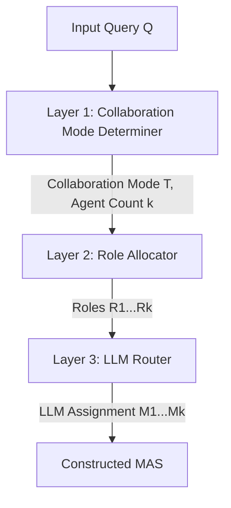

本記事は [MasRouter: Learning to Route LLMs for Multi-Agent Systems](https://arxiv.org/abs/2502.11133) の解説記事です。

関連するZenn記事: [LangGraph Command APIで設計する宣言的ステートマシン実装パターン](https://zenn.dev/0h_n0/articles/b0d404e4bc8675)

## 論文概要

Yue, Zhangらによる本論文は、マルチエージェントシステム（MAS）において「どのコラボレーション形態を選ぶか」「どの役割を割り当てるか」「どのLLMを各エージェントに配置するか」という3つの判断を統合的に最適化する**Multi-Agent System Routing（MASR）**問題を定式化し、その解法として**MasRouter**を提案している。MasRouterは3層カスケード型コントローラネットワークにより、タスクの特性に応じて動的にMASを構成する。MBPPベンチマークで既存手法比1.8-8.2%の精度向上、HumanEvalでコストを最大52.07%削減することが報告されている。本論文はACL 2025に採択されている。

## 情報源

- **arXiv ID**: 2502.11133
- **URL**: [arXiv:2502.11133](https://arxiv.org/abs/2502.11133)
- **著者**: Yanwei Yue, Guibin Zhang, Boyang Liu et al.
- **発表年**: 2025年2月（ACL 2025採択）
- **分野**: Computation and Language (cs.CL), Artificial Intelligence (cs.AI)
- **コード**: [https://github.com/yanweiyue/masrouter](https://github.com/yanweiyue/masrouter)

## 背景と動機

### 単一エージェントルーティングの限界

LLMベースのアプリケーションでは、タスクの難易度に応じて適切なモデルを選択する「LLMルーティング」が研究されてきた。RouteLLMやRouterDCといった手法は、単一のクエリに対して最適なLLMを選択することでコストを削減する。しかしこれらの手法は、1つのクエリを1つのLLMで処理する**単一エージェントシナリオ**を前提としている。

### マルチエージェントシステムの組合せ爆発

一方、実運用のMASでは複数のエージェントが連携してタスクを解く。コラボレーション形態（Chain, Tree, Graph, Debate等）、各エージェントの役割（プログラマー、テスター、アナリスト等）、そして各エージェントに割り当てるLLMという3つの次元での組合せが存在し、その探索空間は膨大になる。著者らは、既存のLLMルーティング手法がこの3次元の同時最適化を扱えない点を課題として指摘している。

LangGraphのSupervisorパターンでは、中央ノードが`Command(goto=...)`によりワーカーにタスクを動的に振り分けるが、どのモデルをどのエージェントに割り当てるか、何人のエージェントで協調させるかは開発者が事前に決定する必要がある。MasRouterはこれらの判断を学習ベースで自動化するアプローチである。

## 主要な貢献

著者らは以下の3つを本論文の主要な貢献として挙げている:

1. **MASR問題の定式化**: コラボレーションモード選択・役割割当・LLM選択を統合した新しいルーティング問題を定義し、単一エージェントルーティングをMASに拡張する枠組みを確立した
2. **カスケード型コントローラネットワーク**: 3層の確率的カスケードにより、入力クエリに応じてMASをend-to-endで構成する手法を提案した。方策勾配法による学習でコストと精度のトレードオフを最適化する
3. **帰納的汎化能力**: 未知のLLM（学習時に含まれなかったモデル）に対しても再学習なしでルーティングを行えるinductive generalization能力を実証した

## 技術的詳細

### MASR問題の定式化

MASR問題は以下のように定式化される。利用可能なLLMプール $\mathcal{M}$、エージェント役割の集合 $\mathcal{R}$、コラボレーションモードの集合 $\mathcal{T}$ から構成される探索空間 $\mathcal{S} = (\mathcal{M}, \mathcal{R}, \mathcal{T})$ に対し、最適なMAS構成を求める:

$$
\max_{P(\mathcal{S}|Q)} \mathbb{E}_{\mathcal{S} \sim P(\mathcal{S}|Q)} \left[ U(\mathcal{S}; Q, a) - \lambda \cdot C(\mathcal{S}; Q) \right]
$$

ここで $Q$ は入力クエリ、$a$ は正解ラベル、$U(\cdot)$ はMASの性能を測るユーティリティ関数、$C(\cdot)$ はトークン消費量に基づくコスト関数、$\lambda$ は精度とコストのトレードオフを制御するハイパーパラメータである。

### 3層カスケード型コントローラネットワーク

MasRouterのコントローラネットワークは3つのモジュール $F_\theta = F_{\theta_m} \circ F_{\theta_r} \circ F_{\theta_t}$ から構成される。



#### Layer 1: Collaboration Mode Determiner ($F_{\theta_t}$)

入力クエリからコラボレーションモード（Chain, Tree, Graph, Debate等）とエージェント数を決定する。変分潜在変数モデルを用いて、クエリ条件付きガウス分布から潜在表現をサンプリングする:

$$
p_h(H|Q) = \mathcal{N}(H; \mu_t(Q), \text{diag}(\sigma_t^2(Q)))
$$

デコード確率は以下のように計算される:

$$
p(T|Q) \propto \exp\left(\frac{f_\psi(Q)^\top \tilde{H}_T}{\tau}\right)
$$

エージェント数 $k$ は潜在変数のノルムから決定される: $k = \lceil \delta(H) \cdot \gamma \rceil$（$\gamma$ は最大エージェント数）。

#### Layer 2: Role Allocator ($F_{\theta_r}$)

決定されたコラボレーションモードとエージェント数に基づき、26種類の事前定義された役割プールから逐次的に役割を割り当てる:

$$
P(R_1, \ldots, R_k | Q, T) = \prod_{\ell=1}^{k} \pi_{r_\ell}(R_\ell | Q, \{R_j\}_{j=1}^{\ell-1}, T)
$$

各役割の選択確率は以下で計算される:

$$
\pi_{r_\ell} \propto \exp\left(\frac{H_{R_{\ell-1}}^\top \tilde{H}_{R_\ell}}{\tau}\right)
$$

#### Layer 3: LLM Router ($F_{\theta_m}$)

各エージェントに割り当てるLLMを多項分布としてモデル化する:

$$
P(M_1, \ldots, M_k | Q, T, R) = \prod_{\ell=1}^{k} \pi_m(M_\ell | Q, T, \{R_i\})
$$

互換性スコアに基づく選択確率:

$$
\pi_m(M_\ell) \propto \exp\left(\frac{H_M^\top \tilde{H}_{M_\ell}}{\tau}\right)
$$

### 学習方法

3つのモジュールを方策勾配法によりend-to-endで学習する。損失関数は以下の通り:

$$
\min_\theta \mathbb{E}_{(Q,a) \sim \mathcal{D},\, \mathcal{S} \sim P_\theta} \left[ -p(a|Q) + \lambda \cdot C(\mathcal{S}; Q) \right]
$$

MAS全体の出力は非微分可能であるため、REINFORCE系の方策勾配で最適化を行う。

### LangGraph Supervisorパターンとの対比

LangGraphのSupervisorパターンでは、開発者がSupervisorノードの判断ロジック（どのワーカーにタスクを送るか）を設計する。`Command(goto=["researcher", "coder"])`のように動的ルーティングは可能だが、以下の判断は静的に設計される:

- **コラボレーション形態**: Chain型かTree型かはグラフ定義時に決定
- **ワーカーの種類**: 事前に定義したノード群から選択
- **各ワーカーのLLM**: 通常、全ワーカーで同一モデルを使用

MasRouterのアプローチは、これら3つの判断をクエリごとに動的に最適化する点で、LangGraphの静的グラフ設計を補完する位置づけにある。

## 実装のポイント

MasRouterのコア概念をPythonで表現すると、以下のような構造になる。実際の実装は[公式リポジトリ](https://github.com/yanweiyue/masrouter)を参照されたい。

```python
from dataclasses import dataclass
from enum import Enum
from typing import Sequence

import numpy as np


class CollaborationMode(Enum):
    """マルチエージェントのコラボレーション形態."""

    CHAIN = "chain"
    TREE = "tree"
    GRAPH = "graph"
    DEBATE = "debate"
    SINGLE = "single"


@dataclass(frozen=True)
class MASConfiguration:
    """MasRouterが出力するMAS構成."""

    mode: CollaborationMode
    roles: tuple[str, ...]
    llm_assignments: tuple[str, ...]

    @property
    def agent_count(self) -> int:
        """割り当てられたエージェント数を返す."""
        return len(self.roles)


def route_query(
    query: str,
    mode_determiner: "ModeNetwork",
    role_allocator: "RoleNetwork",
    llm_router: "LLMNetwork",
    llm_pool: Sequence[str],
    role_pool: Sequence[str],
    temperature: float = 1.0,
    max_agents: int = 6,
) -> MASConfiguration:
    """入力クエリからMAS構成を決定する3層カスケードルーティング.

    Args:
        query: 入力テキスト
        mode_determiner: コラボレーションモード判定ネットワーク
        role_allocator: 役割割当ネットワーク
        llm_router: LLM選択ネットワーク
        llm_pool: 利用可能なLLMの一覧
        role_pool: 利用可能な役割の一覧
        temperature: softmax温度パラメータ
        max_agents: 最大エージェント数

    Returns:
        最適なMAS構成
    """
    # Layer 1: コラボレーションモードとエージェント数の決定
    mode, agent_count = mode_determiner.predict(
        query, temperature=temperature, max_agents=max_agents
    )

    # Layer 2: 逐次的な役割割当
    roles: list[str] = []
    for i in range(agent_count):
        role = role_allocator.predict(
            query, mode=mode, assigned_roles=tuple(roles),
            role_pool=role_pool, temperature=temperature,
        )
        roles.append(role)

    # Layer 3: 各エージェントへのLLM割当
    llm_assignments: list[str] = []
    for i, role in enumerate(roles):
        llm = llm_router.predict(
            query, mode=mode, roles=tuple(roles),
            llm_pool=llm_pool, temperature=temperature,
        )
        llm_assignments.append(llm)

    return MASConfiguration(
        mode=mode,
        roles=tuple(roles),
        llm_assignments=tuple(llm_assignments),
    )
```

実装上の注意点として、著者らはテキストエンコーダにSentenceBERTまたはMiniLMを使用しており、学習率 $\alpha = 0.01$、温度 $\tau = 1.0$、コストペナルティ $\lambda \in \{5, 15, 25\}$ を報告している。最大エージェント数は $\gamma = 6$ に設定されている。

## Production Deployment Guide

MasRouterの3層ルーティングを実運用環境に導入する際のAWSベースの構成を示す。

### AWS実装パターン（コスト最適化重視）

MasRouterは推論時に3層のネットワーク評価とMAS実行の2段階が必要であり、トラフィック量に応じた構成選択が重要である。

| 項目 | Small (~100 req/日) | Medium (~1000 req/日) | Large (10000+ req/日) |
|------|--------------------|-----------------------|----------------------|
| **ルーティング層** | Lambda + SageMaker Serverless | ECS Fargate | EKS + Karpenter |
| **LLM呼び出し** | Bedrock | Bedrock + SageMaker | Bedrock + SageMaker + vLLM on EKS |
| **キャッシュ** | DynamoDB | ElastiCache Redis | ElastiCache Redis Cluster |
| **モニタリング** | CloudWatch | CloudWatch + X-Ray | Prometheus + Grafana |
| **月額概算** | $50-200 | $400-1,200 | $3,000-8,000 |

コスト概算はap-northeast-1（東京）リージョンの2026年8月時点の料金に基づく。実際のコストはトラフィックパターンやLLMの呼び出し頻度により変動する。

### Terraformインフラコード

#### Small構成（Serverless）

```hcl
# MasRouter Serverless構成
# Lambda (ルーティング推論) + Bedrock (LLM) + DynamoDB (キャッシュ)

terraform {
  required_version = ">= 1.5"
  required_providers {
    aws = {
      source  = "hashicorp/aws"
      version = "~> 5.0"
    }
  }
}

provider "aws" {
  region = "ap-northeast-1"
}

# ---------- IAM ----------
resource "aws_iam_role" "masrouter_lambda" {
  name = "masrouter-lambda-role"
  assume_role_policy = jsonencode({
    Version = "2012-10-17"
    Statement = [{
      Action = "sts:AssumeRole"
      Effect = "Allow"
      Principal = { Service = "lambda.amazonaws.com" }
    }]
  })
}

resource "aws_iam_role_policy" "masrouter_lambda_policy" {
  name = "masrouter-lambda-policy"
  role = aws_iam_role.masrouter_lambda.id
  policy = jsonencode({
    Version = "2012-10-17"
    Statement = [
      {
        Effect = "Allow"
        Action = [
          "bedrock:InvokeModel",
          "bedrock:InvokeModelWithResponseStream"
        ]
        Resource = "arn:aws:bedrock:ap-northeast-1::foundation-model/*"
      },
      {
        Effect = "Allow"
        Action = [
          "dynamodb:GetItem",
          "dynamodb:PutItem",
          "dynamodb:Query"
        ]
        Resource = aws_dynamodb_table.routing_cache.arn
      },
      {
        Effect = "Allow"
        Action = [
          "logs:CreateLogGroup",
          "logs:CreateLogStream",
          "logs:PutLogEvents"
        ]
        Resource = "arn:aws:logs:ap-northeast-1:*:*"
      },
      {
        Effect = "Allow"
        Action = [
          "xray:PutTraceSegments",
          "xray:PutTelemetryRecords"
        ]
        Resource = "*"
      }
    ]
  })
}

# ---------- DynamoDB (ルーティングキャッシュ) ----------
resource "aws_dynamodb_table" "routing_cache" {
  name         = "masrouter-routing-cache"
  billing_mode = "PAY_PER_REQUEST"
  hash_key     = "query_hash"

  attribute {
    name = "query_hash"
    type = "S"
  }

  ttl {
    attribute_name = "expires_at"
    enabled        = true
  }

  point_in_time_recovery {
    enabled = true
  }

  tags = {
    Project = "masrouter"
    Env     = "production"
  }
}

# ---------- Lambda ----------
resource "aws_lambda_function" "masrouter" {
  function_name = "masrouter-router"
  role          = aws_iam_role.masrouter_lambda.arn
  handler       = "handler.lambda_handler"
  runtime       = "python3.12"
  timeout       = 300
  memory_size   = 1024

  filename         = "lambda_package.zip"
  source_code_hash = filebase64sha256("lambda_package.zip")

  environment {
    variables = {
      CACHE_TABLE    = aws_dynamodb_table.routing_cache.name
      COST_LAMBDA    = "15"
      MAX_AGENTS     = "6"
      TEMPERATURE    = "1.0"
      LOG_LEVEL      = "INFO"
    }
  }

  tracing_config {
    mode = "Active"
  }

  tags = {
    Project = "masrouter"
  }
}

# ---------- CloudWatch Alarms ----------
resource "aws_cloudwatch_metric_alarm" "lambda_errors" {
  alarm_name          = "masrouter-lambda-errors"
  comparison_operator = "GreaterThanThreshold"
  evaluation_periods  = 2
  metric_name         = "Errors"
  namespace           = "AWS/Lambda"
  period              = 300
  statistic           = "Sum"
  threshold           = 5
  alarm_description   = "MasRouter Lambda error rate alarm"

  dimensions = {
    FunctionName = aws_lambda_function.masrouter.function_name
  }

  alarm_actions = [aws_sns_topic.alerts.arn]
}

resource "aws_sns_topic" "alerts" {
  name = "masrouter-alerts"
}
```

#### Large構成（Container: EKS + Spot）

```hcl
# MasRouter Container構成
# EKS + Karpenter (Spot優先) + Secrets Manager

# ---------- EKS Cluster ----------
module "eks" {
  source  = "terraform-aws-modules/eks/aws"
  version = "~> 20.0"

  cluster_name    = "masrouter-cluster"
  cluster_version = "1.30"

  vpc_id     = module.vpc.vpc_id
  subnet_ids = module.vpc.private_subnets

  cluster_endpoint_public_access = false

  eks_managed_node_groups = {
    system = {
      instance_types = ["m6i.large"]
      min_size       = 2
      max_size       = 3
      desired_size   = 2
    }
  }

  tags = {
    Project = "masrouter"
    Env     = "production"
  }
}

# ---------- Karpenter (Spot優先) ----------
resource "kubectl_manifest" "karpenter_nodepool" {
  yaml_body = yamlencode({
    apiVersion = "karpenter.sh/v1"
    kind       = "NodePool"
    metadata   = { name = "masrouter-inference" }
    spec = {
      template = {
        spec = {
          requirements = [
            {
              key      = "karpenter.sh/capacity-type"
              operator = "In"
              values   = ["spot", "on-demand"]
            },
            {
              key      = "node.kubernetes.io/instance-type"
              operator = "In"
              values   = ["m6i.xlarge", "m6a.xlarge", "m5.xlarge"]
            }
          ]
        }
      }
      limits = {
        cpu    = "100"
        memory = "400Gi"
      }
      disruption = {
        consolidationPolicy = "WhenEmptyOrUnderutilized"
        consolidateAfter    = "30s"
      }
    }
  })
}

# ---------- Secrets Manager ----------
resource "aws_secretsmanager_secret" "llm_api_keys" {
  name        = "masrouter/llm-api-keys"
  description = "API keys for LLM providers (OpenAI, Anthropic, Google)"

  tags = {
    Project = "masrouter"
  }
}

# ---------- Cost Explorer Alert ----------
resource "aws_budgets_budget" "masrouter_monthly" {
  name         = "masrouter-monthly-budget"
  budget_type  = "COST"
  limit_amount = "5000"
  limit_unit   = "USD"
  time_unit    = "MONTHLY"

  cost_filter {
    name   = "TagKeyValue"
    values = ["user:Project$masrouter"]
  }

  notification {
    comparison_operator       = "GREATER_THAN"
    threshold                 = 80
    threshold_type            = "PERCENTAGE"
    notification_type         = "ACTUAL"
    subscriber_sns_topic_arns = [aws_sns_topic.alerts.arn]
  }

  notification {
    comparison_operator       = "GREATER_THAN"
    threshold                 = 100
    threshold_type            = "PERCENTAGE"
    notification_type         = "FORECASTED"
    subscriber_sns_topic_arns = [aws_sns_topic.alerts.arn]
  }
}
```

### セキュリティベストプラクティス

MasRouterのデプロイでは、複数のLLMプロバイダーのAPIキーを扱うため、以下のセキュリティ対策が必要である:

- **APIキー管理**: AWS Secrets Managerに集約し、Lambda/ECSからIAMロール経由でアクセス。環境変数にAPIキーを直接設定しない
- **ネットワーク分離**: VPC内にデプロイし、LLMプロバイダーへのアクセスはVPC Endpoint（Bedrock）またはNAT Gateway経由に限定
- **入力検証**: ルーティング層への入力クエリに対してトークン数上限（8192等）とコンテンツフィルタリングを適用
- **監査ログ**: CloudTrailでBedrock呼び出しとSecrets Managerアクセスを記録。S3に90日以上保持

### 運用・監視設定

#### CloudWatch Logs Insights クエリ

```
# ルーティング判定のレイテンシ分析
fields @timestamp, routing_latency_ms, collaboration_mode, agent_count, total_cost_usd
| filter routing_latency_ms > 0
| stats avg(routing_latency_ms) as avg_latency,
        p95(routing_latency_ms) as p95_latency,
        avg(total_cost_usd) as avg_cost
  by collaboration_mode
| sort avg_cost desc
```

```
# コスト異常検知（直近1時間で前日比200%超）
fields @timestamp, total_cost_usd
| stats sum(total_cost_usd) as hourly_cost by bin(1h)
| sort @timestamp desc
| limit 48
```

#### X-Ray トレーシング設定

```python
from aws_xray_sdk.core import xray_recorder, patch_all

patch_all()


@xray_recorder.capture("masrouter_routing")
def route_and_execute(query: str) -> dict:
    """ルーティング判定とMAS実行をトレーシング付きで実行する.

    Args:
        query: 入力クエリ

    Returns:
        MAS実行結果
    """
    subsegment = xray_recorder.current_subsegment()
    subsegment.put_annotation("query_length", len(query))

    # Layer 1: Mode determination
    with xray_recorder.in_subsegment("mode_determination"):
        mode, agent_count = determine_mode(query)
        xray_recorder.current_subsegment().put_metadata(
            "mode", mode.value
        )

    # Layer 2: Role allocation
    with xray_recorder.in_subsegment("role_allocation"):
        roles = allocate_roles(query, mode, agent_count)

    # Layer 3: LLM routing
    with xray_recorder.in_subsegment("llm_routing"):
        assignments = route_llms(query, mode, roles)
        xray_recorder.current_subsegment().put_metadata(
            "assignments", assignments
        )

    # MAS execution
    with xray_recorder.in_subsegment("mas_execution"):
        result = execute_mas(query, mode, roles, assignments)

    subsegment.put_annotation("total_agents", agent_count)
    subsegment.put_annotation("collaboration_mode", mode.value)

    return result
```

### コスト最適化チェックリスト

- **アーキテクチャ選択**: 日次リクエスト量でServerless/Container構成を判断。100 req/日以下ならLambdaが最もコスト効率が高い
- **Spot Instances活用**: EKS構成ではKarpenterでSpot優先（最大90%削減）。中断時のgraceful shutdownとリトライ機構を実装
- **LLMコスト削減**: MasRouter自体がコスト最適化を行うが、加えてBedrock Batch APIの活用（50%削減）、同一クエリパターンのルーティング結果キャッシュ（DynamoDBのTTL: 1時間）が有効
- **Reserved/Savings Plans**: EKS常時起動ノードはCompute Savings Plans（最大66%削減）を検討
- **監視・アラート**: AWS Budgetsで月次予算の80%到達時にアラート。Cost Anomaly Detectionを有効化し、異常なLLM呼び出しパターンを検知

## 実験結果

著者らは5つのベンチマーク（MMLU, GSM8K, MATH, HumanEval, MBPP）で評価を行っている。使用したLLMプールにはgpt-4o-mini、claude-3.5-haiku、gemini-1.5-flash、llama-3.1-70bが含まれる。

### 精度

| ベンチマーク | RouterDC (SOTA) | MasRouter | 改善 |
|-------------|----------------|-----------|------|
| MMLU | 82.01% | 84.25% | +2.24% |
| GSM8K | 93.68% | 95.45% | +1.77% |
| MATH | 73.46% | 75.42% | +1.96% |
| HumanEval | 87.75% | 90.62% | +2.87% |
| MBPP | 82.20% (AFlow) | 84.00% | +1.80% |
| **平均** | 82.42% | **85.93%** | **+3.51%** |

### コスト削減

HumanEvalにおいて、SOTAの$0.363から$0.185へ、約49.0%のコスト削減が報告されている。また既存のMASフレームワーク（MAD: Multi-Agent Debate）への統合では、17.21-28.17%のオーバーヘッド削減を達成している。

### アブレーション

各コンポーネントの寄与を検証するアブレーション実験では、LLM Router ($F_{\theta_m}$) の除去が精度に最も大きな影響（-2.09%~-4.34%）を与え、コスト関数 $C(\cdot)$ の除去はトークン消費を54.09%増加させることが報告されている。

## 実運用への応用

### LangGraphとの統合シナリオ

MasRouterの知見をLangGraphベースのアプリケーションに応用するシナリオとして、以下が考えられる:

1. **動的モデル選択**: Supervisorノードの判断ロジックにMasRouterのLLM Routerを組み込み、ワーカーごとに異なるLLMを動的に割り当てる。簡易なサブタスクにはclaude-3.5-haiku、複雑な推論にはclaude-3.5-sonnetを選択する等
2. **コスト制約付きルーティング**: $\lambda$ パラメータによるコスト・精度トレードオフを活用し、バッチ処理ではコスト重視（$\lambda=25$）、リアルタイム応答では精度重視（$\lambda=5$）に切り替える
3. **エージェント数の適応的決定**: 単純なクエリには単一エージェント、複雑なタスクには複数エージェント協調を自動判定し、不要なエージェント起動によるレイテンシとコストの増加を抑制する

### 導入時の考慮事項

MasRouterのルーティング推論自体のレイテンシは報告されていないが、3層のネットワーク評価はSentenceBERTベースの軽量な推論であるため、LLM呼び出しと比較すればオーバーヘッドは小さいと考えられる。一方、ルーティングモデルの学習には対象タスクのデータセットと複数LLMの応答が必要であり、初期セットアップのコストを考慮する必要がある。

## 関連研究

- **RouteLLM** (Ong et al., 2024): 2つのLLM間でクエリをルーティングする手法。MasRouterはこれをMASに拡張した位置づけ
- **RouterDC** (2024): データ中心のアプローチでLLMルーティングを行う。MasRouterの直接的な比較対象であり、全ベンチマークで上回っている
- **AFlow** (2024): LLMワークフローの自動探索。MBPP上でMasRouterに最も近い精度を達成している
- **GPTSwarm** (Zhuge et al., 2024): グラフベースのMAS最適化。MasRouterは平均4.33%上回ることが報告されている

## まとめと今後の展望

MasRouterは、マルチエージェントシステムにおけるコラボレーションモード・役割割当・LLM選択の3つの判断を統合的に最適化する初の手法である。5つのベンチマークで平均3.51%の精度向上と最大52.07%のコスト削減を達成し、既存MASフレームワークへのプラグアンドプレイ統合も実証されている。

今後の展望として、著者らは未知のLLMへの帰納的汎化能力（DeepSeek-v3での検証で12.17-27.19%の採用率向上）に言及しており、新しいモデルが頻繁にリリースされる現在のLLMエコシステムにおいて、再学習なしで最新モデルを活用できる点は実用上の大きな利点である。LangGraphのようなフレームワークにおいても、静的なグラフ設計と学習ベースの動的ルーティングを組み合わせるアプローチが、MASの効率化に寄与する可能性がある。

## 参考文献

- **arXiv**: [https://arxiv.org/abs/2502.11133](https://arxiv.org/abs/2502.11133)
- **Code**: [https://github.com/yanweiyue/masrouter](https://github.com/yanweiyue/masrouter)
- **Related Zenn article**: [https://zenn.dev/0h_n0/articles/b0d404e4bc8675](https://zenn.dev/0h_n0/articles/b0d404e4bc8675)

---

*本記事はAIによって生成されました。内容の正確性については原論文を参照してください。*
