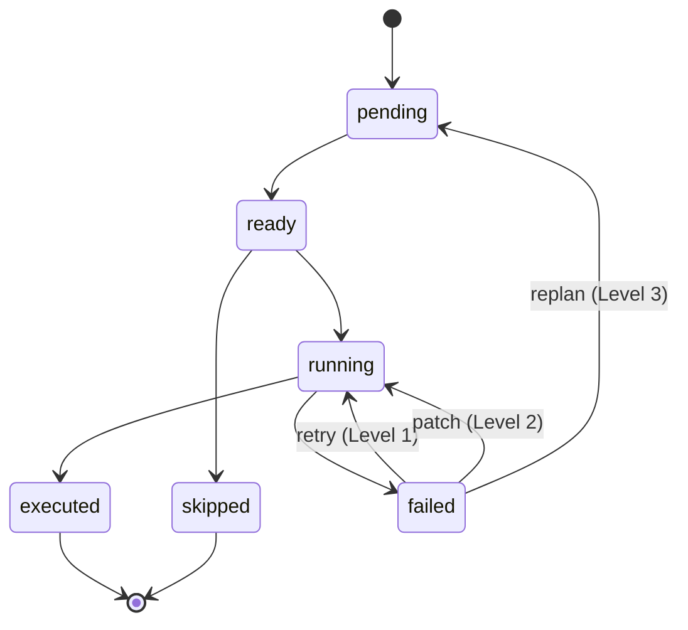
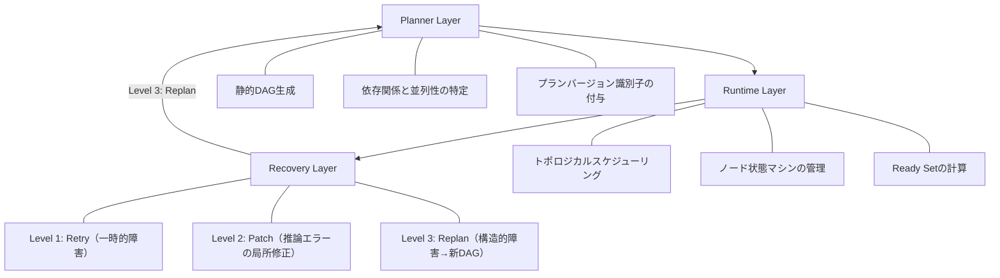

本記事は [From Agent Loops to Structured Graphs: A Scheduler-Theoretic Framework for LLM Agent Execution](https://arxiv.org/abs/2604.11378) の解説記事です。

## 論文概要（Abstract）

LLMエージェントの支配的な実行パラダイムであるAgent Loop（反復的にLLMが次のアクションを決定するサイクル）には、ステップ間の暗黙的な依存関係、無限回復ループ、ミュータブルな実行履歴という3つの構造的問題が存在する。著者はAgent Loopを古典的なスケジューリング理論における「単一ready unitスケジューラ」として形式化し、グラフベースの実行エンジンとAgent Loopが1つのセマンティック連続体上にあることを示している。その上で、イミュータブルな実行計画、計画・実行・回復の3層分離、厳格なエスカレーションプロトコルを設計原則とするSGH（Structured Graph Harness）フレームワークを提案している。本論文はポジションペーパーであり、理論的フレームワークの提案と70システムの調査に基づく設計分析が主な貢献である。

この記事は [Zenn記事: LangGraph Command APIで設計する宣言的ステートマシン実装パターン](https://zenn.dev/0h_n0/articles/b0d404e4bc8675) の深掘りです。

## 情報源

- **arXiv ID**: 2604.11378
- **URL**: [https://arxiv.org/abs/2604.11378](https://arxiv.org/abs/2604.11378)
- **著者**: Hu Wei
- **発表年**: 2026年（2026年4月13日公開）
- **分野**: cs.AI（人工知能）, eess.SY（システム工学）
- **ページ数**: 51ページ、4図

## 背景と動機（Background & Motivation）

現在のLLMエージェントシステムの大半は、Agent Loopと呼ばれるパラダイムに基づいている。Agent Loopでは、LLMが1ステップずつ次のアクションを選択し、ツール呼び出しや推論を反復的に実行する。ReAct、Chain-of-Thought、AutoGPTなどの代表的なシステムがこのパターンを採用している。

著者は、70のエージェントシステムを調査した結果、そのうち42システム（60%）がAgent Loopパターンを採用していることを報告している。そして、このパラダイムには以下の3つの構造的問題があると指摘している。

1. **暗黙的な依存関係**: ステップ間の実行順序やデータ依存関係が構造的に表現されず、コンテキストウィンドウ内の暗黙的な情報に依存する
2. **無限回復ループ**: 失敗時の回復に対する契約がなく、システムが繰り返し再計画を行うが進展しない「失敗ループ」病理が観察される
3. **ミュータブルな実行履歴**: 実行計画が動的に変更されるため、監査証跡の追跡やデバッグが困難になる

著者は、これらの問題に対処するために、古典的なDAGスケジューリング理論をLLMエージェント実行に適用することを提案している。古典的なスケジューリング理論では、タスクの依存関係、並列性、リソース割当を形式的に扱う手法が確立されているが、LLMノードの非決定性という特有の課題が存在するため、既存理論をそのまま適用することはできない。SGHはこのギャップを埋めるフレームワークとして位置付けられている。

## 主要な貢献（Key Contributions）

- **スケジューラ統一フレームワーク**: Agent Loopを「単一ready unitスケジューラ」（$\|\mathcal{U}\| \leq 1$）として形式化し、グラフベースエンジンを「多重ready unitスケジューラ」（$\|\mathcal{U}\| \geq 1$）として位置付ける理論的基盤を構築
- **70システムのトレードオフ分析**: 制御性（controllability）、表現力（expressiveness）、実装性（implementability）の3軸で70の既存システムを分類・比較
- **ノード状態マシンの形式仕様**: 終了保証と健全性保証を備えた状態マシンを定義し、各ノードが必ず終了状態に到達することを証明
- **7グループ実験プロトコル設計**: 各設計判断の寄与を分離するための実験計画を設計（ただし実験結果は未報告）

## 技術的詳細（Technical Details）

### Agent Loopの形式化: 実行システムの定義

著者は、エージェント実行システムを以下の5つ組として定義している（Definition 3.1）。

$$
\mathcal{E} = (\mathcal{S}, \mathcal{U}, \mathcal{P}, \mathcal{O}, \Delta)
$$

ここで各要素は以下の通りである。

- $\mathcal{S}$: ノード状態の集合（pending, ready, running, executed, failed）
- $\mathcal{U}$: ready set関数。現在の状態から実行可能なノードの集合を返す
- $\mathcal{P}$: スケジューリングポリシー。ready setから実行するノードを選択する関数
- $\mathcal{O}$: 結果空間 $\{success, failure, retry, escalate\}$
- $\Delta$: 状態遷移関数

この定義に基づき、Agent Loopは「任意の到達可能な状態$s$において$\|\mathcal{U}(s)\| \leq 1$を満たすスケジューラ」として特性化される（Definition 3.2）。すなわち、Agent Loopでは常に最大1つのノードしか実行可能でない。ポリシー$\mathcal{P}$はLLMによる非決定的な選択であり、これが構造的な予測不可能性の原因となっている。

### スケジューラ連続体

著者は、Agent Loopとグラフベースエンジンを1つの連続体上に配置するフレームワークを提示している。

| 特性 | Naive Loop | Parallel Loop | Planner Loop | Graph Harness |
|------|-----------|---------------|-------------|---------------|
| Ready Set | $\|\mathcal{U}\|=1$ | $\|\mathcal{U}\|\geq 1$ | $\|\mathcal{U}\|=1$ | $\|\mathcal{U}\|\geq 1$ |
| ポリシー | 非決定的 | 非決定的 | 非決定的 | 決定的 |
| 並列性 | なし | LLM判断 | なし | 構造的 |

この分類により、Agent Loopからグラフベースエンジンへの移行が、ready set のサイズとポリシーの決定性という2つの軸で特性化できることが示されている。

### SGHの設計原則

SGHは以下の設計原則に基づいている。

**原則1: 制御性優先（Controllability First）**

依存関係を明示的なDAGトポロジとして表現し、ノードのdispatch前に依存関係の充足を強制する。調査した70システムのうち、構造的ガードのないシステムで依存関係違反が頻繁に発生していることがこの原則の根拠とされている。

**原則2: 安定した実行コミットメント（Stable Execution Commitment）**

実行計画はプランバージョン内でイミュータブルとする。変更が必要な場合は新しいバージョンを作成する。調査対象の60%のシステムでミュータブルな実行計画が監査証跡を妨げていたことが報告されている。

**原則3: 制限付き回復（Bounded Recovery）**

回復は3段階のエスカレーションプロトコルに従い、各段階に明示的な予算を設ける。

**原則4: 副作用分類（Side-Effect Classification）**

ノードを純粋（冪等）または副作用あり（非冪等）に分類し、リトライの安全性を保証する。

### ノード状態マシン

著者は、各ノードの状態遷移を以下の状態マシンとして定義している（Definition 6.1）。



終了状態の集合 $\Sigma_{term} = \{executed, skipped, permanently\_failed\}$ が定義され、終了状態への遷移は不可逆であることが証明されている。著者はすべての実行パスが終了状態に到達することを示しており、これによりSGHの実行が必ず終了することが保証されている。

### 3層分離アーキテクチャ

SGHは以下の3つのレイヤーで構成される。



**Planner Layer**は実行前に静的DAGを生成し、並列性と依存関係を特定する。**Runtime Layer**はトポロジカルスケジューリングによりノードを実行し、依存関係からready setを計算する。**Recovery Layer**は3段階のエスカレーションプロトコルを管理する。

### 回復プロトコル: 3段階エスカレーション

| レベル | 対象障害 | メカニズム | エスカレーション条件 |
|--------|----------|------------|----------------------|
| Level 1: Retry | 一時的障害（タイムアウト、レート制限） | 予算内での再実行 | トークン予算を超過 |
| Level 2: Patch | 契約検証エラー（推論の誤り） | 補助LLMによる局所的診断・修正 | パッチ失敗または新規エラー発生 |
| Level 3: Replan | 系統的障害 | 構造を変更した新しいDAGの生成 | Level 1, 2が全て失敗した場合のみ |

各ノードには出力契約 $\kappa_v$ が定義されており、構文的検証（出力形式の正当性）と意味的検証（ドメイン制約の充足）の2段階で検証される。契約違反は推論エラーを示すものとして扱われ、Level 2の回復対象となる。

### 制御性・表現力・実装性のトレードオフ三角形

著者は、LLMエージェント設計における根本的なトレードオフを3つの軸で整理している。

**制御性 vs. 表現力**: SGHは制御性を最大化するために表現力を制限しており、competitive parallelism（first_of結合）、動的トポロジ、再帰的展開などは除外されている。

**表現力 vs. 実装性**: LangGraphのようなシステムは表現力を最大化しているが、ミュータブルなランタイムグラフにより複雑な状態管理が必要となる。

**制御性 vs. 実装性**: イミュータブルな計画は実装を単純化するが、正確な事前計画が要求される。また、3段階の回復プロトコルは実装の複雑性を増加させる。

### LangGraphとの対比

SGHの概念は、LangGraphの設計要素と以下のように対応している。

| SGHの概念 | LangGraphの対応要素 | 差異 |
|-----------|---------------------|------|
| 静的DAG | `StateGraph` | LangGraphはランタイム時のグラフ変更が可能 |
| 決定的ポリシー | `Command(goto=...)` | `Command`は動的だが明示的な遷移指定 |
| イミュータブルプラン | チェックポイント | チェックポイントは状態のスナップショットであり計画の不変性とは異なる |
| 3段階回復 | `RemainingSteps` + エラーリカバリ | LangGraphの回復は開発者の実装に依存 |
| 契約検証 | 状態スキーマ（`TypedDict`） | 構文的検証のみで意味的検証は未提供 |
| Ready Set | `add_conditional_edges` / `Command` | 構造的並列性ではなくルーティング制御 |

著者は、LangGraphをSGHとAgent Loopの中間に位置するシステムとして特性化している。LangGraphは $\|\mathcal{U}\| \geq 1$（多重ready unit）だが半決定的ポリシーであり、制限付き回復メカニズムを持たないと述べている。

## 実装のポイント

### LangGraphでSGH原則を適用する

本論文はポジションペーパーであり、SGHのリファレンス実装は提供されていない。ただし、SGHの設計原則はLangGraphの既存機能を用いて部分的に適用できる。

**原則2（安定した実行コミットメント）の適用例**: チェックポイントによる状態の不変性確保

```python
from langgraph.graph import StateGraph, START, END
from langgraph.types import Command
from langgraph.checkpoint.memory import InMemorySaver
from typing import TypedDict, Annotated, Literal

class PlanVersionedState(TypedDict):
    plan_version: int
    current_phase: str  # "planning" | "execution" | "recovery"
    task_results: dict
    error_log: list[str]

def planner_node(state: PlanVersionedState) -> Command[Literal["executor"]]:
    """Planner Layer: 実行計画を生成しバージョンを付与"""
    return Command(
        update={
            "plan_version": state.get("plan_version", 0) + 1,
            "current_phase": "execution",
        },
        goto="executor",
    )

def executor_node(
    state: PlanVersionedState,
) -> Command[Literal["recovery", "__end__"]]:
    """Runtime Layer: 計画に基づきタスクを実行"""
    try:
        result = execute_task(state)
        return Command(
            update={
                "task_results": result,
                "current_phase": "execution",
            },
            goto=END,
        )
    except Exception as e:
        return Command(
            update={
                "current_phase": "recovery",
                "error_log": state.get("error_log", []) + [str(e)],
            },
            goto="recovery",
        )

def recovery_node(
    state: PlanVersionedState,
) -> Command[Literal["executor", "planner", "__end__"]]:
    """Recovery Layer: 3段階エスカレーション"""
    error_count = len(state.get("error_log", []))
    if error_count <= 1:
        # Level 1: Retry
        return Command(update={"current_phase": "execution"}, goto="executor")
    elif error_count <= 3:
        # Level 2: Patch (ここでは簡略化)
        return Command(update={"current_phase": "execution"}, goto="executor")
    else:
        # Level 3: Replan
        return Command(update={"current_phase": "planning"}, goto="planner")
```

この実装例では、`Command`の`goto`パラメータによる明示的な遷移指定がSGHの「決定的ポリシー」に対応し、`plan_version`フィールドによるバージョン管理がSGHの「安定した実行コミットメント」の簡易的な実現となっている。ただし、SGHが要求するイミュータブルな実行計画や形式的な契約検証はLangGraphの標準機能では完全には実現できない。

## 実験結果/分析

### 70システムの調査結果

著者は70のエージェントシステムを以下のように分類している。

| パラダイム | システム数 | 割合 | 代表例 |
|-----------|-----------|------|--------|
| Agent Loop | 41 | 60% | ReAct, AutoGPT, Chain-of-Thought |
| イベント駆動 | 11 | 16% | （詳細は論文参照） |
| ハイブリッド | 7 | 10% | （詳細は論文参照） |
| グラフ/フロー | 5 | 7% | LangGraph, GPTSwarm, AFlow |
| ステートマシン | 4 | 6% | （詳細は論文参照） |
| Plan-Then-Execute | 2 | 3% | Task-Decoupled Planning |

この調査から、LLMエージェントシステムの大半がAgent Loopの構造的制約を受けていることが示されている。

### フレームワーク間の比較

著者は、主要なフレームワークを以下の6つの観点で比較している。

| 次元 | Agent Loop | LangGraph | TDP | SGH |
|------|-----------|-----------|-----|-----|
| 多重Ready Unit | No | Yes | No | Yes |
| 決定的ポリシー | No | Semi | No | Yes |
| 制限付き回復 | No | No | No | Yes |
| イミュータブル計画 | No | No | Mutable | Yes |
| 契約検証 | なし | オプション | オプション | 必須 |
| 成熟度 | 成熟 | 成熟 | 新興 | 設計のみ |

著者は、SGHが「制御性」の軸で最も高い位置にあるが、「表現力」と「成熟度」では既存システムに劣ると述べている。SGHはエンジニアリングタスク（決定論的な制御が重要な場面）を対象としており、探索的タスクにはLangGraphのような柔軟なシステムが適していると位置付けている。

### LLM固有のスケジューリング課題

著者は、古典的なDAGスケジューリングには存在しないLLM固有の5つの課題を特定している。

1. **非決定的ノード出力**: 同一入力に対してLLMが異なる出力を返す。契約検証で対処
2. **推論エラーが主要な障害モード**: インフラ障害ではなく推論の誤りが主因。3段階回復で対処
3. **非冪等リトライ**: リトライが異なる結果を生む。副作用分類と予算制限で対処
4. **コンテキスト汚染**: 推論履歴が後続ステップを汚染する。実行/診断コンテキストの分離で対処
5. **検証ギャップ**: 契約を構文的に満たすが意味的に誤っている場合がある。条件付き信頼性評価で対処

### 具体例: バグ修正タスクの比較

著者は、Pythonの認証バグ修正タスクを例として、Agent LoopとSGHの実行効率を比較している。Agent Loopでは11回の逐次ターンを要するが、SGHでは6ラウンド（10ノード）で完了する。SGHでは`search_auth`と`search_utils`の並列実行（$\|\mathcal{U}\|=2$）や、`fix_A`と`fix_B`の並列試行（`any_of`結合による早期終了）が可能であり、構造的な並列性と制限付き回復により実行効率が向上すると主張されている。ただし、この比較は理論的な分析に基づくものであり、実測値は報告されていない。

## 実運用への応用

### LangGraphの既存機能とSGHの対応

SGHの理論的概念は、LangGraphの既存機能と以下のように対応している。

**チェックポイント**: LangGraphの`PostgresSaver`や`InMemorySaver`によるチェックポイントは、SGHの「安定した実行コミットメント」の部分的な実現と見なせる。チェックポイントは各ステップの状態スナップショットを保存し、障害時に特定の時点から再開できるようにする。ただし、SGHが要求する「プランバージョン内でのイミュータブル性」とは異なり、LangGraphのチェックポイントは状態のスナップショットであって実行計画の不変性を保証するものではない。

**RemainingSteps**: Zenn記事で紹介されている`RemainingSteps`による再帰制限の事前検知は、SGHの「制限付き回復」における予算管理の具体例と見なせる。SGHのLevel 1回復ではトークン予算を監視し、予算超過時にLevel 2へエスカレーションする。LangGraphの`RemainingSteps`は実行ステップ数に基づく制限であり、`GraphRecursionError`が発生する前に処理を安全に終了させる機構を提供している。

**Command APIによる明示的遷移**: Zenn記事で解説されている`Command(goto=..., update=...)`による動的ルーティングは、SGHが指摘するAgent Loopの「暗黙的依存関係」の問題を部分的に解消するアプローチである。`Command`は遷移先をコード上で明示的に指定するため、Agent Loopのようにコンテキストウィンドウ内の暗黙的情報に遷移が依存する問題を回避できる。ただし、SGHの「決定的ポリシー」が要求する静的DAGに基づく遷移とは異なり、`Command`の遷移先はランタイム時のLLM判断に依存し得る。

**エラーリカバリパターン**: Zenn記事のエラーリカバリ実装（`retry_count`を管理し、閾値超過で終了するパターン）は、SGHの3段階エスカレーションプロトコルの簡略版と位置付けられる。SGHではLevel 1（Retry）、Level 2（Patch）、Level 3（Replan）が明確に分離されているが、LangGraphでの典型的な実装ではこれらが1つのノード内に混在する傾向がある。

## 関連研究

著者は、SGHの理論的位置付けを明確にするために、以下の関連研究分野を引用している。

- **古典的DAGスケジューリング**: Apache Airflow、Luigi、Prefectなどのワークフローエンジンは決定的ノード（Pythonコード）を前提としているが、LLMノードの非決定性に対応する回復メカニズムを持たない
- **Plan-Then-Execute**: Task-Decoupled Planning（TDP）は計画と実行を分離するが、単一ready unit（$\|\mathcal{U}\|=1$）であり並列性を活用できない。また、サブタスクがミュータブルであり、回復プロトコルもノード局所的である
- **マルチエージェントフレームワーク**: AutoGenやCrewAIはエージェント間の協調を支援するが、著者はこれらも本質的にはAgent Loopの拡張であり、SGHが指摘する構造的問題を共有していると述べている
- **グラフベースシステム**: LangGraph、GPTSwarm、AFlowがこのカテゴリに分類され、SGHと設計空間を共有するが、イミュータブル計画や形式的な回復プロトコルは提供していない

## まとめと今後の展望

本論文は、Agent LoopとStructured Graph Harnessをスケジューリング理論の枠組みで統一的に分析するポジションペーパーである。著者はAgent Loopを単一ready unitスケジューラとして形式化し、SGHの3つの設計原則（制御性優先、安定した実行コミットメント、制限付き回復）を提示することで、LLMエージェント実行システムの設計空間を整理している。

著者が認めているように、本論文にはいくつかの限界がある。実験的検証が行われておらず、理論的予測は未検証である。また、静的DAGの仮定はランタイム時の構造的適応を必要とするタスクには適用できない。LLMによる計画エラーの伝播問題や、初回計画のコールドスタート問題も未解決である。

今後の方向性として、著者はフォールトトレラントな永続化を備えたプロトタイプ実装、既知の並列構造を持つタスクスイートでのベンチマーク、計画精度と計画品質のトレードオフの研究を挙げている。LangGraphのようなグラフベースフレームワークの実装者にとって、SGHの設計原則は回復メカニズムの体系化や実行計画の検証可能性を検討する際の理論的指針となり得る。

## 参考文献

- [Hu Wei, "From Agent Loops to Structured Graphs: A Scheduler-Theoretic Framework for LLM Agent Execution," arXiv:2604.11378, April 2026](https://arxiv.org/abs/2604.11378)
- [LangGraph Graph API Overview](https://docs.langchain.com/oss/python/langgraph/graph-api)
- [LangGraph Interrupts](https://docs.langchain.com/oss/python/langgraph/interrupts)
- [Zenn記事: LangGraph Command APIで設計する宣言的ステートマシン実装パターン](https://zenn.dev/0h_n0/articles/b0d404e4bc8675)

---

:::message
この記事はAI（Claude Code）により自動生成されました。内容の正確性については複数の情報源で検証していますが、実際の利用時は論文原文もご確認ください。
:::
