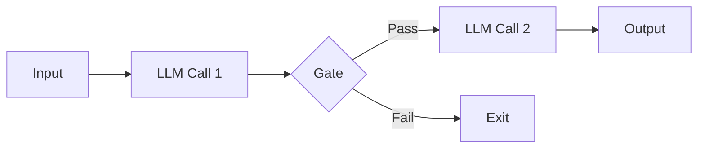
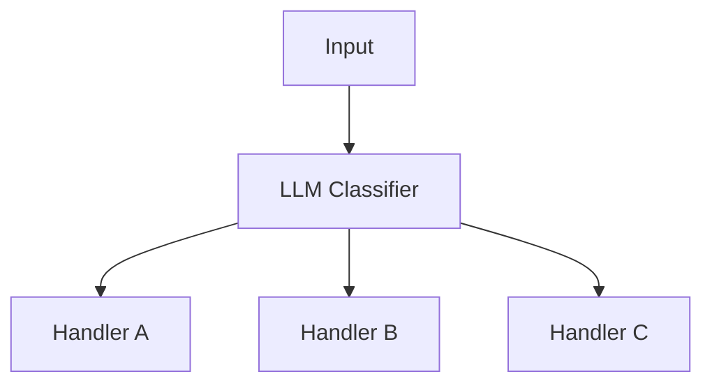
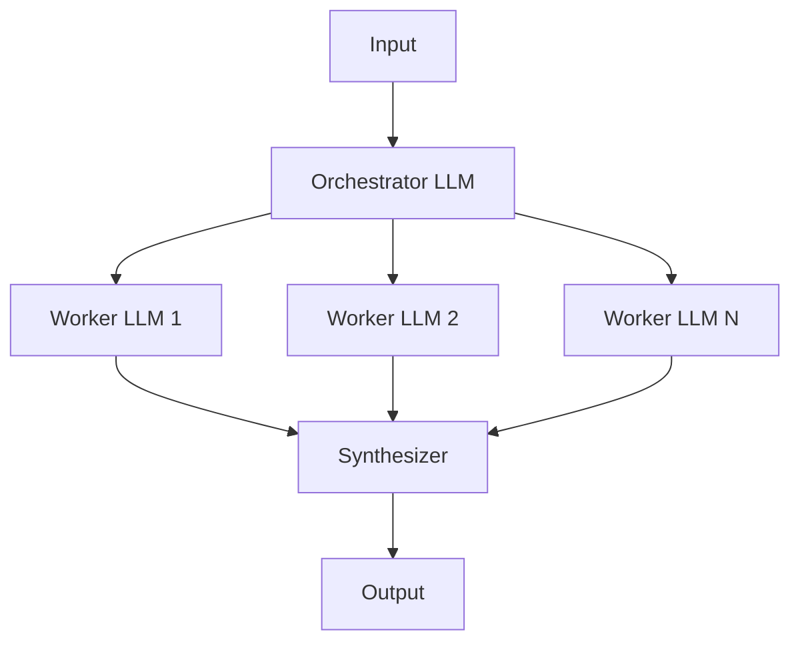
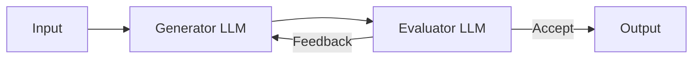

## ブログ概要（Summary）

本記事は [Building Effective Agents](https://www.anthropic.com/engineering/building-effective-agents) の解説記事です。Anthropicが2024年12月に公開したこのブログでは、LLMエージェントを構築する際の設計原則として「シンプルさ」「透明性」「ツール設計への投資」を掲げ、5つのワークフローパターン（Prompt Chaining, Routing, Parallelization, Orchestrator-Workers, Evaluator-Optimizer）を体系的に整理しています。本記事ではこれらのパターンを修士学生レベルで解説し、LangGraph Command APIとの対応関係を明示します。

この記事は [Zenn記事: LangGraph Command APIで設計する宣言的ステートマシン実装パターン](https://zenn.dev/0h_n0/articles/b0d404e4bc8675) の深掘りです。

## 情報源

- **種別**: 企業テックブログ
- **URL**: [https://www.anthropic.com/engineering/building-effective-agents](https://www.anthropic.com/engineering/building-effective-agents)
- **組織**: Anthropic
- **発表日**: 2024年12月

## 技術的背景（Technical Background）

LLMエージェントの開発では、「どこまでをコードで制御し、どこからLLMに判断を委ねるか」が設計上の分岐点となる。Anthropicはこの問題に対して**ワークフローとエージェントの明確な区別**を提案している。

ブログによると、**ワークフロー**とは「LLMとツールが事前定義されたコードパスで orchestrate されるシステム」であり、**エージェント**とは「LLMが動的に自身のプロセスとツール利用を指揮するシステム」である。この定義は、制御の主体がコード側にあるかLLM側にあるかという軸で2つを区別している。

多くの場面では完全な自律エージェントよりもワークフローの組み合わせで十分な成果が得られるとAnthropicは述べている。ワークフローの方が予測可能でデバッグが容易であり、開発者はシンプルなパターンから始めて段階的に複雑さを追加すべきだという知見に基づく。

## 実装アーキテクチャ（Architecture）

### 拡張LLM（Augmented LLM）: 基本構成要素

Anthropicは、すべてのワークフロー・エージェントの基本単位として**拡張LLM（Augmented LLM）**を定義している。素のLLMに**検索（Retrieval）**、**ツール（Tools）**、**メモリ（Memory）**を付加したものであり、ブログでは「これらの機能をユースケースに合わせて調整し、LLMにとって使いやすく文書化されたインターフェースを確保すべき」と述べている。

### 5つのワークフローパターン

#### 1. Prompt Chaining（逐次連鎖）

タスクを複数のステップに分解し、各LLM呼び出しが前のステップの出力を処理する。ステップ間にはプログラマティックなチェックポイント（ゲート）を挟み、品質を担保する。



**適用場面**: マーケティングコピー生成後の翻訳、アウトライン生成後の本文執筆など固定的な逐次処理。

**LangGraphとの対応**: `add_edge` による静的ノード接続に相当する。

#### 2. Routing（ルーティング）

入力を分類し、専門化された下流処理に振り分ける。入力の種類に応じて異なるプロンプトや処理パイプラインを適用できる。



**適用場面**: カスタマーサポートの問い合わせ振り分け、質問難易度に応じたモデル使い分け（Haiku/Sonnet）によるコスト最適化など。

**LangGraphとの対応**: `add_conditional_edges` がRoutingの実装手段。`Command(goto=...)` なら分類結果の保存とルーティングを1つのreturnに統合できる。

#### 3. Parallelization（並列化）

LLMタスクを同時に実行し結果を集約する。**セクショニング**（独立サブタスクの並列実行）と**ボーティング**（同一タスクの多数決判定）の2バリエーションがある。

**LangGraphとの対応**: `Send` APIや `Command(goto=["node_a", "node_b"])` のリスト指定で並列実行を実現する。

#### 4. Orchestrator-Workers（オーケストレーター・ワーカー）

中央のLLMがタスクを動的にサブタスクに分割し、ワーカーLLMに委任して結果を統合する。サブタスクが事前定義されていない点がParallelizationとの違いである。



**適用場面**: 複数ファイルにまたがるコード変更、複数ソースからの情報収集・分析など。

**LangGraphとの対応**: Zenn記事のSupervisor+Workerパターンがこれに該当する。`Command(goto="researcher")` で動的にワーカーへ振り分け、ワーカーは `Command(goto="supervisor")` で結果を戻す。

#### 5. Evaluator-Optimizer（評価・最適化ループ）

一方のLLMが応答を生成し、もう一方のLLMが評価とフィードバックを提供する反復ループ。



**適用場面**: 文学翻訳での反復改善、複数ラウンド分析が必要な検索タスクなど。明確な評価基準が存在する場合に有効。

**LangGraphとの対応**: `Command` でGenerator-Evaluator間をループし、合格時に `Command(goto=END)` で終了する。Zenn記事で推奨される `iteration` カウンタとの組み合わせで無限ループを防止する。

### ワークフロー vs エージェントの判断基準

| 観点 | ワークフロー | エージェント |
|------|-------------|-------------|
| 制御の主体 | コード（事前定義されたパス） | LLM（動的な判断） |
| 予測可能性 | 高い | 低い |
| デバッグの容易さ | 容易 | 困難 |
| コスト | 低い（呼び出し回数が固定） | 高い（呼び出し回数が不定） |
| 適用場面 | 固定的な処理フロー | オープンエンドな問題 |
| LangGraph対応 | `add_edge`, `add_conditional_edges` | `Command(goto=...)` による動的ルーティング |

Anthropicは「エージェントはコストが高くエラーが累積する可能性がある」とし、「シンプルなプロンプトから始めて、複雑さは成果が実証された場合にのみ追加すべき」と述べている。

## Production Deployment Guide

### AWS実装パターン（コスト最適化重視）

Anthropicのワークフローパターンに基づくエージェントシステムをAWSにデプロイする場合の推奨構成を示す。

**コスト試算の注意事項**: 以下の料金は2026年8月時点のAWS ap-northeast-1（東京）リージョンの概算値である。実際のコストはトラフィックパターン、リージョン、バースト使用量により変動する。最新料金はAWS料金計算ツールで確認を推奨する。

| 構成 | トラフィック量 | 主要サービス | 月額概算 |
|------|---------------|-------------|---------|
| Small | ~100 req/日 | Lambda + Bedrock + DynamoDB | $50-150 |
| Medium | ~1,000 req/日 | ECS Fargate + Bedrock + ElastiCache | $300-800 |
| Large | 10,000+ req/日 | EKS + Karpenter + Spot Instances | $2,000-5,000 |

**コスト削減テクニック**: Spot Instances活用で最大90%削減、Reserved Instances 1年コミットで最大72%削減、Bedrock Batch API使用で50%削減、Prompt Caching有効化で30-90%削減。

### Terraformインフラコード

**Small構成（Serverless: Lambda + Bedrock + DynamoDB）**:

```hcl
# Small構成: Lambda + Bedrock + DynamoDB (月額$50-150)
terraform {
  required_version = ">= 1.9"
  required_providers {
    aws = { source = "hashicorp/aws", version = "~> 5.60" }
  }
}

provider "aws" { region = "ap-northeast-1" }

# DynamoDB: チェックポイント保存（On-Demand + TTL + KMS暗号化）
resource "aws_dynamodb_table" "workflow_state" {
  name         = "agent-workflow-state"
  billing_mode = "PAY_PER_REQUEST"
  hash_key     = "thread_id"
  range_key    = "checkpoint_id"
  attribute { name = "thread_id";     type = "S" }
  attribute { name = "checkpoint_id"; type = "S" }
  ttl { attribute_name = "expires_at"; enabled = true }
  server_side_encryption { enabled = true }
}

# IAMロール: 最小権限（Bedrock + DynamoDB + CloudWatch Logsのみ）
resource "aws_iam_role" "lambda_agent" {
  name               = "agent-workflow-lambda"
  assume_role_policy = jsonencode({
    Version = "2012-10-17"
    Statement = [{ Action = "sts:AssumeRole", Effect = "Allow",
                    Principal = { Service = "lambda.amazonaws.com" } }]
  })
}

resource "aws_iam_role_policy" "lambda_policy" {
  name = "agent-workflow-policy"
  role = aws_iam_role.lambda_agent.id
  policy = jsonencode({
    Version = "2012-10-17"
    Statement = [
      { Effect = "Allow", Action = ["bedrock:InvokeModel"],
        Resource = "arn:aws:bedrock:ap-northeast-1::foundation-model/anthropic.claude-*" },
      { Effect = "Allow", Action = ["dynamodb:GetItem","dynamodb:PutItem","dynamodb:Query"],
        Resource = aws_dynamodb_table.workflow_state.arn },
      { Effect = "Allow", Action = ["logs:CreateLogGroup","logs:CreateLogStream","logs:PutLogEvents"],
        Resource = "arn:aws:logs:ap-northeast-1:*:*" },
    ]
  })
}

# Lambda: Routing + Prompt Chaining（60秒タイムアウト、512MB）
resource "aws_lambda_function" "agent_router" {
  function_name = "agent-workflow-router"
  runtime       = "python3.12"
  handler       = "handler.lambda_handler"
  role          = aws_iam_role.lambda_agent.arn
  timeout       = 60
  memory_size   = 512
  environment { variables = { DYNAMODB_TABLE = aws_dynamodb_table.workflow_state.name,
                              MODEL_ID = "anthropic.claude-sonnet-4-20250514" } }
  filename = "lambda_package.zip"
}
```

**Large構成（Container: EKS + Karpenter + Spot Instances）**:

```hcl
# Large構成: EKS + Karpenter + Spot (月額$2,000-5,000)
module "eks" {
  source          = "terraform-aws-modules/eks/aws"
  version         = "~> 20.24"
  cluster_name    = "agent-workflow-cluster"
  cluster_version = "1.31"
  vpc_id          = module.vpc.vpc_id
  subnet_ids      = module.vpc.private_subnets
  cluster_endpoint_public_access = false
  eks_managed_node_groups = {
    system = { instance_types = ["m6i.large"], min_size = 2, max_size = 3, desired_size = 2 }
  }
}

# Karpenter NodePool: Spot優先、複数インスタンスファミリーで可用性確保
resource "kubectl_manifest" "karpenter_nodepool" {
  yaml_body = yamlencode({
    apiVersion = "karpenter.sh/v1", kind = "NodePool"
    metadata = { name = "agent-workers" }
    spec = {
      template = { spec = {
        requirements = [
          { key = "karpenter.sh/capacity-type", operator = "In", values = ["spot","on-demand"] },
          { key = "node.kubernetes.io/instance-type", operator = "In",
            values = ["m6i.xlarge","m6a.xlarge","m5.xlarge"] },
        ]
        nodeClassRef = { group = "karpenter.k8s.aws", kind = "EC2NodeClass", name = "default" }
      }}
      limits     = { cpu = "100", memory = "400Gi" }
      disruption = { consolidationPolicy = "WhenEmptyOrUnderutilized", consolidateAfter = "30s" }
    }
  })
}

# AWS Budgets: 月額$5,000でアラート（80%到達時に通知）
resource "aws_budgets_budget" "agent_workflow" {
  name = "agent-workflow-monthly", budget_type = "COST"
  limit_amount = "5000", limit_unit = "USD", time_unit = "MONTHLY"
  notification {
    comparison_operator = "GREATER_THAN", threshold = 80, threshold_type = "PERCENTAGE"
    notification_type = "ACTUAL", subscriber_email_addresses = ["ops-team@example.com"]
  }
}
```

### 運用・監視設定

**CloudWatch Logs Insights: コスト異常検知クエリ**:

```
# 1時間あたりのBedrockトークン使用量を監視
fields @timestamp, @message
| filter @message like /input_tokens/
| stats sum(input_tokens) as total_input, sum(output_tokens) as total_output by bin(1h)
| sort @timestamp desc
| limit 24
```

**CloudWatch Logs Insights: レイテンシ分析クエリ**:

```
# ワークフローパターン別のP95/P99レイテンシ
fields @timestamp, workflow_pattern, duration_ms
| stats percentile(duration_ms, 95) as p95, percentile(duration_ms, 99) as p99
  by workflow_pattern
| sort p99 desc
```

**X-Ray トレーシング設定（Python）**:

```python
from aws_xray_sdk.core import xray_recorder, patch_all

patch_all()  # boto3自動計装: Bedrock/DynamoDB呼び出しを自動追跡

def invoke_workflow(thread_id: str, pattern: str, payload: dict) -> dict:
    """ワークフローパターンを実行し、X-Rayでトレースする。"""
    subsegment = xray_recorder.begin_subsegment(f"workflow-{pattern}")
    subsegment.put_annotation("thread_id", thread_id)
    subsegment.put_annotation("pattern", pattern)
    try:
        result = _execute_pattern(pattern, payload)
        return result
    except Exception as e:
        subsegment.add_exception(e, stack=True)
        raise
    finally:
        xray_recorder.end_subsegment()
```

**Cost Explorer自動レポート（Python）**:

```python
import boto3
from datetime import datetime, timedelta

def get_daily_cost_report() -> dict[str, float]:
    """日次コストレポートをサービス別に取得し、$100/日超過でアラートする。"""
    ce = boto3.client("ce", region_name="ap-northeast-1")
    yesterday = (datetime.now() - timedelta(days=1)).strftime("%Y-%m-%d")
    today = datetime.now().strftime("%Y-%m-%d")
    response = ce.get_cost_and_usage(
        TimePeriod={"Start": yesterday, "End": today},
        Granularity="DAILY", Metrics=["UnblendedCost"],
        Filter={"Tags": {"Key": "Service", "Values": ["agent-workflow"]}},
        GroupBy=[{"Type": "DIMENSION", "Key": "SERVICE"}],
    )
    costs = {g["Keys"][0]: float(g["Metrics"]["UnblendedCost"]["Amount"])
             for g in response["ResultsByTime"][0]["Groups"]}
    if sum(costs.values()) > 100.0:
        print(f"ALERT: Daily cost ${sum(costs.values()):.2f} exceeds $100")
    return costs
```

### コスト最適化チェックリスト

**アーキテクチャ選択**:
- [ ] トラフィック量に応じた構成を選択（~100 req/日: Serverless, ~1,000 req/日: Hybrid, 10,000+ req/日: Container）
- [ ] Prompt ChainingやRoutingなど単純パターンはLambdaで処理し、Orchestrator-Workersのみコンテナ化を検討

**リソース最適化**:
- [ ] EC2 Spot Instances優先（Karpenter設定）
- [ ] Reserved Instances 1年コミット（常時稼働分）
- [ ] Savings Plans適用（Fargate, Lambda）
- [ ] Lambdaメモリ最適化（Power Tuning Tool）
- [ ] ECS/EKSアイドル時スケールダウン

**LLMコスト削減**:
- [ ] Bedrock Batch API（非リアルタイムで50%削減）
- [ ] Prompt Caching（同一プロンプトで30-90%削減）
- [ ] Routingでモデル使い分け（Haiku/Sonnet）
- [ ] max_tokensでトークン数制限
- [ ] Evaluator-Optimizer反復回数上限

**監視・アラート**:
- [ ] AWS Budgets月額上限
- [ ] CloudWatch Bedrockトークン量アラーム
- [ ] Cost Anomaly Detection
- [ ] 日次コストレポート（SNS + Lambda）

**リソース管理**:
- [ ] 未使用リソース削除
- [ ] タグ戦略統一（Environment, Service, Owner）
- [ ] DynamoDB TTL自動削除
- [ ] CloudWatch Logs保持期間30日
- [ ] 開発環境夜間・週末停止

## パフォーマンス最適化（Performance）

各パターンのパフォーマンス特性をブログの記述に基づき整理する。

**レイテンシ**: Prompt Chainingは逐次実行で合計レイテンシが増加するが、ゲートによる早期打ち切りで効率改善が可能。Parallelization（セクショニング）は同時実行でレイテンシを短縮する。

**スループット**: Routingでモデルを使い分け、簡単なタスクに高コストモデルを使う無駄を排除する。Evaluator-Optimizerは反復回数上限の設定が重要である。

LangGraphでは `RemainingSteps` で再帰制限を事前検知し、グレースフルに処理を終了するパターンが推奨されている。

## 運用での学び（Production Lessons）

### ACI（Agent-Computer Interface）設計のポカヨケ原則

Anthropicは、エージェント開発において**ACI（Agent-Computer Interface）設計にHCI（Human-Computer Interface）と同等の投資をすべき**と述べている。具体的なプラクティスとして以下が挙げられている。

- ツールの仕様と説明文に十分な投資をする
- 使用例、エッジケース、ツール間の境界を明確にする
- パラメータ名と説明をモデルが理解しやすいように設計する
- ワークベンチで広範にテストし、モデルがミスするパターンを特定する
- **ポカヨケ原則**を適用し、引数の設計でミスを起こしにくくする

### SWE-benchでの教訓

ブログによると、AnthropicがSWE-bench向けエージェントを構築する際、全体のプロンプトよりもツールの最適化に多くの時間を費やしたとされている。特に、**相対パスを使用するとエージェントがルートディレクトリから移動した後にミスを起こす**問題が発見され、**絶対パスを使用するように変更**することで改善された。この事例は、ポカヨケの原則がLLMエージェント開発にも適用できることを実証している。

LangGraphの `Command` APIも同様の設計思想を体現している。`Command(goto=..., update=...)` は遷移先と状態更新を1つの操作に統合することで、「状態を更新したがルーティングを忘れる」「ルーティングしたが状態更新を忘れる」というミスを構造的に防止している。

## 学術研究との関連（Academic Connection）

Anthropicのワークフローパターンは、学術研究における以下のフレームワークと関連がある。

- **ReAct**（Yao et al., 2023）: 推論（Reasoning）と行動（Acting）を交互に実行するパターン。Anthropicの「エージェント」定義における「LLMが動的に自身のプロセスを指揮する」概念の学術的先行研究に位置づけられる
- **Reflexion**（Shinn et al., 2023）: タスク失敗後に自己反省を行い改善計画を生成する手法。Evaluator-Optimizerパターンの学術的基盤の一つとして捉えられる
- **StateFlow**（Wu et al., 2024）: LLMタスク解決をステートマシンとして定式化するフレームワーク。Anthropicのワークフローパターンの体系化と同様に、状態遷移ベースのエージェント設計を提唱しており、ReActに対して13-28%高い成功率を報告している

## まとめと実践への示唆

Anthropicのブログが提示する設計指針は明確である。「シンプルに始め、複雑さは成果が実証された場合にのみ追加する」。5つのワークフローパターンは、Prompt ChainingやRoutingのような単純な構成から、Orchestrator-WorkersやEvaluator-Optimizerのような動的な構成まで段階的に整理されている。LangGraphの `Command` APIは、特にRoutingとOrchestrator-Workersパターンの実装においてAnthropicの推奨する「状態更新とルーティングの統合」を自然に実現する。まずは固定的なワークフローから始め、LLMによる動的判断が必要な箇所にのみ `Command` を導入するアプローチが実践的である。

## 参考文献

- **Blog URL**: [Building Effective Agents - Anthropic](https://www.anthropic.com/engineering/building-effective-agents)
- **Related Papers**:
  - Yao, S. et al. (2023). "ReAct: Synergizing Reasoning and Acting in Language Models." [arXiv:2210.03629](https://arxiv.org/abs/2210.03629)
  - Shinn, N. et al. (2023). "Reflexion: Language Agents with Verbal Reinforcement Learning." [arXiv:2303.11366](https://arxiv.org/abs/2303.11366)
  - Wu, Y. et al. (2024). "StateFlow: Enhancing LLM Task-Solving through State-Driven Workflows." [arXiv:2403.11322](https://arxiv.org/abs/2403.11322)
- **Related Zenn article**: [LangGraph Command APIで設計する宣言的ステートマシン実装パターン](https://zenn.dev/0h_n0/articles/b0d404e4bc8675)
