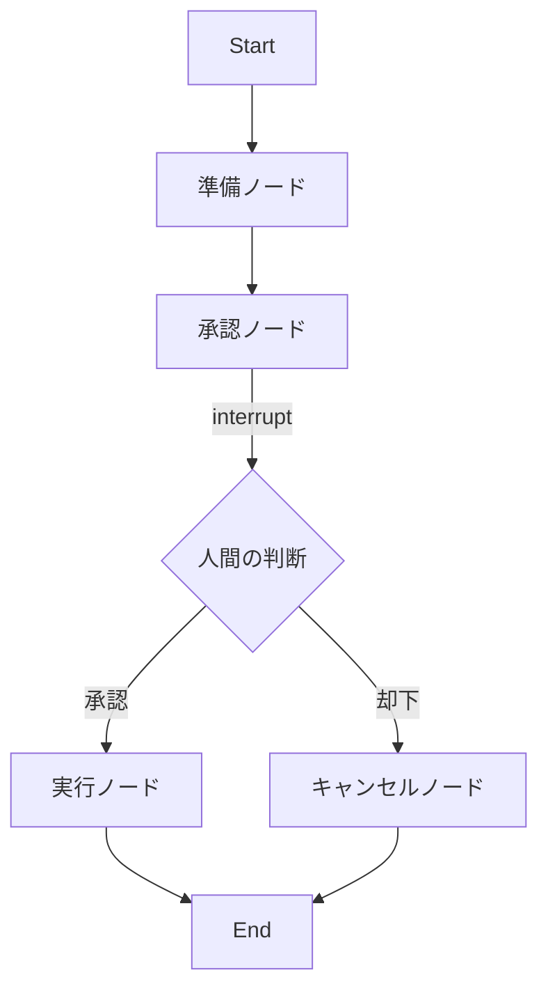
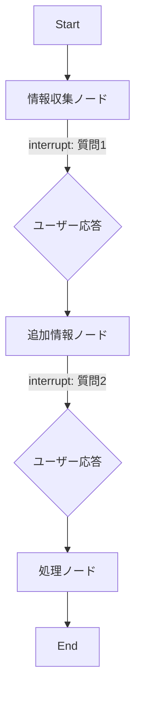

## ブログ概要（Summary）

本記事は [Making it easier to build human-in-the-loop agents with interrupt](https://www.langchain.com/blog/making-it-easier-to-build-human-in-the-loop-agents-with-interrupt) の解説記事です。

LangChainは、LangGraphにおけるHuman-in-the-Loop（HITL）ワークフローの構築を簡素化する`interrupt()`関数と`Command(resume=...)`を公式ブログで紹介している。`interrupt()`はPythonの`input()`に似た構文でグラフ実行を一時停止し、チェックポイント永続化レイヤーに状態を保存する。`Command(resume=...)`で中断された実行を再開でき、月単位で別マシンからの再開にも対応する。本ブログでは、承認/却下、状態レビュー・編集、ツール呼び出し確認、マルチターン会話の4つの実装パターンが解説されている。

この記事は [Zenn記事: LangGraph Command APIで設計する宣言的ステートマシン実装パターン](https://zenn.dev/0h_n0/articles/b0d404e4bc8675) の深掘りです。

## 情報源

- **種別**: 企業テックブログ
- **URL**: [https://www.langchain.com/blog/making-it-easier-to-build-human-in-the-loop-agents-with-interrupt](https://www.langchain.com/blog/making-it-easier-to-build-human-in-the-loop-agents-with-interrupt)
- **組織**: LangChain
- **発表日**: 2025年

## 技術的背景（Technical Background）

LLMエージェントが外部ツール（API呼び出し、データベース操作、決済処理など）を自律的に実行する場面では、誤った操作が取り返しのつかない結果を招くリスクがある。安全性の確保、出力品質の保証、コンプライアンス要件への対応のため、エージェントの意思決定プロセスに人間の判断を組み込むHITLパターンが求められている。

従来のHITL実装では、ワークフローの一時停止と再開を開発者が独自に実装する必要があった。状態管理、永続化、非同期再開の仕組みをアプリケーション側で構築するため、コードが複雑化しやすく、特にプロダクション環境での長期間にわたる中断と再開の信頼性確保が課題となっていた。LangChainは、この課題に対してフレームワークレベルで解決策を提供するために`interrupt()`APIを設計したと説明している。

## 実装アーキテクチャ（Architecture）

### interrupt()の内部動作メカニズム

LangChainの公式ドキュメントによると、`interrupt()`関数はグラフ実行を一時停止するために内部的に`GraphInterrupt`例外をraiseする。この例外はLangGraphランタイムが捕捉し、現在のグラフ状態をチェックポイントとして永続化レイヤーに保存する。

interrupt IDは、チェックポイントのnamespaceとカウンターに基づいて決定論的に生成される。これにより、リトライ時にも一貫したID体系が維持される。

```python
from langgraph.types import interrupt, Command

def approval_node(state: State) -> Command:
    """承認ノード: 人間の判断を待って次のステップへ遷移する.

    interrupt()でグラフ実行を一時停止し、外部からの入力を受け取る。
    内部的にはGraphInterrupt例外がraiseされ、
    チェックポイント永続化レイヤーに状態が保存される。

    Args:
        state: 現在のグラフ状態

    Returns:
        Command: 承認結果に基づく遷移先ノード指定
    """
    decision = interrupt({
        "question": "この操作を承認しますか？",
        "details": state["action_details"],
    })

    if decision:
        return Command(goto="proceed")
    else:
        return Command(goto="cancel")
```

### チェックポイント永続化レイヤーの仕組み

LangGraphはチェックポイントを「第一級オブジェクト（first class citizen）」として扱う。グラフの各ステップが、チェックポイントから状態を読み取り、処理後に書き戻す。interruptが発生すると、中断情報は特別な`INTERRUPT`チャネルのpending writesとしてチェックポイントに格納される。

`get_state()`メソッドで`StateSnapshot`を取得でき、`values`（現在の状態値）、`next`（次に実行されるノード）、`tasks`（タスク情報）、`interrupts`（中断情報）のフィールドを参照できる。これにより、中断されたスレッドのリソース消費はストレージのみとなり、月単位で別マシンからでも再開が可能になるとLangChainは説明している。

### Command(resume=...)の再開フロー

再開時、ノードは最初から再実行される。ただし`interrupt()`呼び出しに到達した時点で、スクラッチパッドに格納されたresume値を検出し、例外をraiseする代わりにその値を返す。

```python
from langgraph.checkpoint.memory import MemorySaver
from langgraph.types import Command

# チェックポインターは必須（状態永続化のため）
checkpointer = MemorySaver()
graph = builder.compile(checkpointer=checkpointer)

config = {"configurable": {"thread_id": "approval-thread-001"}}

# Phase 1: 初回実行 -- interrupt()で一時停止
result = graph.invoke(
    {"action_details": "500ドルの送金", "status": "pending"},
    config=config,
)
# result["__interrupt__"] に中断情報が格納される

# Phase 2: 人間の判断後に再開
resumed = graph.invoke(Command(resume=True), config=config)
print(resumed["status"])  # "approved"
```

resume値の渡し方には複数の方法がある。

| 方式 | パターン | 用途 |
|------|---------|------|
| 単一値 | `Command(resume="approved")` | 単純な承認/却下 |
| 辞書マッピング | `Command(resume={"id_1": "val1"})` | 複数interrupt対応 |
| None渡し | `graph.invoke(None, config)` | 静的interrupt再開 |

### 4つの実装パターン

LangChainのブログでは、HITLの4つの代表的なパターンが紹介されている。

#### パターン1: 承認/却下（Approve or Reject）

APIコールや決済処理など、リスクの高い操作の前に人間の承認を要求するパターンである。



#### パターン2: 状態レビュー・編集（Review & Edit State）

人間がグラフの中間状態を検査し、必要に応じて値を修正してから処理を続行するパターンである。

```python
from typing import TypedDict, Optional
from langgraph.types import interrupt, Command

class ReviewState(TypedDict):
    """レビュー対象の状態定義."""

    draft_content: str
    reviewed_content: Optional[str]
    reviewer_notes: Optional[str]

def review_node(state: ReviewState) -> dict:
    """人間がドラフト内容をレビュー・編集するノード.

    interrupt()で一時停止し、修正内容と
    レビューコメントを受け取る。

    Args:
        state: レビュー対象のドラフトを含む状態

    Returns:
        レビュー済みコンテンツとコメントを含む辞書
    """
    human_review = interrupt({
        "question": "以下の内容をレビューしてください",
        "draft": state["draft_content"],
    })

    return {
        "reviewed_content": human_review.get("edited_content", state["draft_content"]),
        "reviewer_notes": human_review.get("notes", ""),
    }
```

#### パターン3: ツール呼び出し確認（Review Tool Calls）

LLMが生成したツール呼び出し（SQLクエリ、API呼び出しなど）を、実行前に人間が確認・修正するパターンである。

```python
from typing import Union
from langchain.tools import tool
from langgraph.types import interrupt

@tool
def run_query_with_approval(**tool_input: dict) -> str:
    """人間の承認を経てSQLクエリを実行するツール.

    interrupt()で一時停止し、3つのアクションを受け付ける:
    - accept: そのまま実行
    - edit: 修正して実行
    - response: 実行せずに人間の回答を返す

    Args:
        **tool_input: ツールへの入力パラメータ

    Returns:
        クエリ実行結果または人間の回答
    """
    request = {
        "action": "run_query",
        "args": tool_input,
        "description": "以下のSQLクエリを確認してください",
    }

    response = interrupt([request])

    if response["type"] == "accept":
        return _execute_query(tool_input)
    elif response["type"] == "edit":
        modified_input = response["args"]
        return _execute_query(modified_input)
    elif response["type"] == "response":
        return response["args"]
    else:
        raise ValueError(f"不明なレスポンスタイプ: {response['type']}")


def _execute_query(params: dict) -> str:
    """SQLクエリを実行する内部関数.

    Args:
        params: クエリパラメータ

    Returns:
        クエリ実行結果
    """
    # 実際のクエリ実行ロジック
    return f"Query executed with params: {params}"
```

#### パターン4: マルチターン会話（Multi-turn Conversations）

複数回のやり取りを通じて情報を段階的に収集するパターンである。マルチエージェント構成において、会話ステージをまたぐ対話に適用される。



### 完全な実装例

以下に、4つのパターンを統合した完全なグラフ構築例を示す。

```python
from typing import Literal, Optional, TypedDict

from langgraph.checkpoint.memory import MemorySaver
from langgraph.graph import END, START, StateGraph
from langgraph.types import Command, interrupt


class WorkflowState(TypedDict):
    """HITLワークフローの状態定義.

    Attributes:
        action: 実行対象のアクション名
        params: アクションのパラメータ
        status: 処理ステータス
        result: 実行結果
    """

    action: str
    params: dict
    status: Optional[Literal["pending", "approved", "rejected", "completed"]]
    result: Optional[str]


def validate_node(state: WorkflowState) -> dict:
    """入力パラメータを検証するノード.

    Args:
        state: ワークフロー状態

    Returns:
        ステータス更新
    """
    # バリデーションロジック（interrupt前の副作用は冪等に）
    return {"status": "pending"}


def approval_node(state: WorkflowState) -> Command[Literal["execute", "cancel"]]:
    """人間の承認を待つノード.

    Args:
        state: ワークフロー状態

    Returns:
        承認結果に基づく遷移先
    """
    decision = interrupt({
        "question": f"アクション '{state['action']}' を承認しますか？",
        "params": state["params"],
        "risk_level": "HIGH",
    })

    if decision.get("approved", False):
        return Command(goto="execute", update={"status": "approved"})
    return Command(goto="cancel", update={"status": "rejected"})


def execute_node(state: WorkflowState) -> dict:
    """承認済みアクションを実行するノード.

    Args:
        state: ワークフロー状態

    Returns:
        実行結果
    """
    return {
        "status": "completed",
        "result": f"Action '{state['action']}' executed with {state['params']}",
    }


def cancel_node(state: WorkflowState) -> dict:
    """却下されたアクションを処理するノード.

    Args:
        state: ワークフロー状態

    Returns:
        キャンセル結果
    """
    return {"result": f"Action '{state['action']}' was rejected"}


# グラフ構築
builder = StateGraph(WorkflowState)
builder.add_node("validate", validate_node)
builder.add_node("approval", approval_node)
builder.add_node("execute", execute_node)
builder.add_node("cancel", cancel_node)

builder.add_edge(START, "validate")
builder.add_edge("validate", "approval")
builder.add_edge("execute", END)
builder.add_edge("cancel", END)

# チェックポインターは必須
checkpointer = MemorySaver()
graph = builder.compile(checkpointer=checkpointer)

# 実行例
config = {"configurable": {"thread_id": "workflow-001"}}

# Phase 1: 初回実行（approvalノードで一時停止）
result = graph.invoke(
    {"action": "delete_user", "params": {"user_id": "u-123"}},
    config=config,
)

# Phase 2: 人間の判断を反映して再開
resumed = graph.invoke(
    Command(resume={"approved": True}),
    config=config,
)
print(resumed["status"])   # "completed"
print(resumed["result"])   # "Action 'delete_user' executed with {'user_id': 'u-123'}"
```

## Production Deployment Guide

### AWS実装パターン（コスト最適化重視）

LangGraphのHITLワークフローをAWS上でプロダクション運用する場合、トラフィック量に応じた構成を選択する。チェックポイント永続化にはDynamoDBまたはPostgreSQL（RDS）が適している。

| 構成 | トラフィック | 主要サービス | 月額目安 |
|------|-------------|-------------|---------|
| Small | ~100 req/日 | Lambda + DynamoDB + SQS | $50-150 |
| Medium | ~1,000 req/日 | ECS Fargate + RDS PostgreSQL + SQS | $300-800 |
| Large | 10,000+ req/日 | EKS + RDS Aurora + SQS + ElastiCache | $2,000-5,000 |

**コスト試算の注意事項**: 上記は2026年8月時点のAWS ap-northeast-1（東京）リージョン料金に基づく概算値である。実際のコストはトラフィックパターン、リージョン、バースト使用量により変動する。最新料金は[AWS料金計算ツール](https://calculator.aws/)で確認を推奨する。

**Small構成の詳細**:
- AWS Lambda（256MB, 30秒タイムアウト）: グラフ実行ランタイム
- DynamoDB（On-Demand）: チェックポイント永続化
- SQS: interrupt通知キュー（人間への承認リクエスト配信）
- API Gateway: REST API エンドポイント
- 月額内訳: Lambda $5-15 / DynamoDB $10-30 / SQS $1-5 / API Gateway $5-15 / その他 $30-85

**Large構成の詳細**:
- EKS（m5.large x 2, Spot優先）: LangGraphサーバー
- RDS Aurora PostgreSQL（db.r6g.large）: チェックポイント永続化（高スループット）
- ElastiCache Redis: セッションキャッシュ、レート制限
- SQS + SNS: interrupt通知とファンアウト
- 月額内訳: EKS $200-400 / RDS Aurora $400-800 / ElastiCache $150-300 / SQS/SNS $50-100 / その他 $1,200-3,400

**コスト削減テクニック**:
- Spot Instancesの活用でEKSワーカーノードコストを最大90%削減
- Reserved Instancesの1年コミットでRDS Auroraを最大72%削減
- DynamoDB On-Demandモードで低トラフィック時のコストを自動最適化
- Lambda Power Tuningでメモリサイズを最適化し、実行時間とコストのバランスを調整

### Terraformインフラコード

#### Small構成（Serverless: Lambda + DynamoDB）

```hcl
# LangGraph HITL - Small構成 (Serverless)
# 2026-08 時点の設定。Terraformモジュールは最新安定版を使用。

terraform {
  required_version = ">= 1.9"
  required_providers {
    aws = {
      source  = "hashicorp/aws"
      version = "~> 5.60"
    }
  }
}

provider "aws" {
  region = "ap-northeast-1"
}

# --- DynamoDB: チェックポイント永続化 ---
resource "aws_dynamodb_table" "checkpoints" {
  name         = "langgraph-hitl-checkpoints"
  billing_mode = "PAY_PER_REQUEST"  # On-Demand: 低トラフィック時コスト最適
  hash_key     = "thread_id"
  range_key    = "checkpoint_id"

  attribute {
    name = "thread_id"
    type = "S"
  }
  attribute {
    name = "checkpoint_id"
    type = "S"
  }

  # TTL: 90日未操作のチェックポイントを自動削除（コスト削減）
  ttl {
    attribute_name = "expires_at"
    enabled        = true
  }

  # KMS暗号化
  server_side_encryption {
    enabled = true
  }

  tags = {
    Project     = "langgraph-hitl"
    Environment = "production"
    CostCenter  = "ai-platform"
  }
}

# --- IAMロール: Lambda用（最小権限） ---
resource "aws_iam_role" "lambda_exec" {
  name = "langgraph-hitl-lambda-role"

  assume_role_policy = jsonencode({
    Version = "2012-10-17"
    Statement = [{
      Action = "sts:AssumeRole"
      Effect = "Allow"
      Principal = { Service = "lambda.amazonaws.com" }
    }]
  })
}

resource "aws_iam_role_policy" "lambda_policy" {
  name = "langgraph-hitl-lambda-policy"
  role = aws_iam_role.lambda_exec.id

  policy = jsonencode({
    Version = "2012-10-17"
    Statement = [
      {
        Effect = "Allow"
        Action = [
          "dynamodb:GetItem",
          "dynamodb:PutItem",
          "dynamodb:UpdateItem",
          "dynamodb:Query",
        ]
        Resource = aws_dynamodb_table.checkpoints.arn
      },
      {
        Effect = "Allow"
        Action = [
          "sqs:SendMessage",
          "sqs:ReceiveMessage",
          "sqs:DeleteMessage",
        ]
        Resource = aws_sqs_queue.interrupt_queue.arn
      },
      {
        Effect = "Allow"
        Action = [
          "logs:CreateLogGroup",
          "logs:CreateLogStream",
          "logs:PutLogEvents",
        ]
        Resource = "arn:aws:logs:*:*:*"
      },
    ]
  })
}

# --- SQS: interrupt通知キュー ---
resource "aws_sqs_queue" "interrupt_queue" {
  name                       = "langgraph-hitl-interrupts"
  message_retention_seconds  = 1209600  # 14日間保持
  visibility_timeout_seconds = 300      # 5分のロック

  # KMS暗号化
  sqs_managed_sse_enabled = true

  tags = {
    Project = "langgraph-hitl"
  }
}

# --- Lambda関数 ---
resource "aws_lambda_function" "graph_runner" {
  function_name = "langgraph-hitl-runner"
  role          = aws_iam_role.lambda_exec.arn
  handler       = "handler.lambda_handler"
  runtime       = "python3.12"
  timeout       = 30
  memory_size   = 256

  filename         = "lambda_package.zip"
  source_code_hash = filebase64sha256("lambda_package.zip")

  environment {
    variables = {
      CHECKPOINT_TABLE = aws_dynamodb_table.checkpoints.name
      INTERRUPT_QUEUE  = aws_sqs_queue.interrupt_queue.url
      LOG_LEVEL        = "INFO"
    }
  }

  tags = {
    Project = "langgraph-hitl"
  }
}

# --- CloudWatchアラーム: コスト監視 ---
resource "aws_cloudwatch_metric_alarm" "lambda_duration" {
  alarm_name          = "langgraph-hitl-lambda-duration-high"
  comparison_operator = "GreaterThanThreshold"
  evaluation_periods  = 3
  metric_name         = "Duration"
  namespace           = "AWS/Lambda"
  period              = 300
  statistic           = "Average"
  threshold           = 25000  # 25秒（タイムアウト30秒の83%）
  alarm_description   = "Lambda execution duration approaching timeout"

  dimensions = {
    FunctionName = aws_lambda_function.graph_runner.function_name
  }
}
```

#### Large構成（Container: EKS + Karpenter + Spot）

```hcl
# LangGraph HITL - Large構成 (EKS + Spot)
# 2026-08 時点の設定

# --- EKSクラスタ ---
module "eks" {
  source  = "terraform-aws-modules/eks/aws"
  version = "~> 20.24"

  cluster_name    = "langgraph-hitl-cluster"
  cluster_version = "1.31"

  vpc_id     = module.vpc.vpc_id
  subnet_ids = module.vpc.private_subnets

  # パブリックアクセス最小化
  cluster_endpoint_public_access  = false
  cluster_endpoint_private_access = true

  # KMS暗号化
  cluster_encryption_config = {
    provider_key_arn = aws_kms_key.eks.arn
    resources        = ["secrets"]
  }

  tags = {
    Project     = "langgraph-hitl"
    Environment = "production"
  }
}

# --- Karpenter: Spot優先の自動スケーリング ---
resource "kubectl_manifest" "karpenter_nodepool" {
  yaml_body = yamlencode({
    apiVersion = "karpenter.sh/v1"
    kind       = "NodePool"
    metadata   = { name = "langgraph-hitl" }
    spec = {
      template = {
        spec = {
          requirements = [
            { key = "karpenter.sh/capacity-type", operator = "In", values = ["spot", "on-demand"] },
            { key = "node.kubernetes.io/instance-type", operator = "In", values = ["m5.large", "m5.xlarge", "m6i.large", "m6i.xlarge"] },
          ]
          nodeClassRef = {
            group = "karpenter.k8s.aws"
            kind  = "EC2NodeClass"
            name  = "default"
          }
        }
      }
      limits   = { cpu = "100", memory = "200Gi" }
      disruption = {
        consolidationPolicy = "WhenEmptyOrUnderutilized"
        consolidateAfter    = "30s"
      }
    }
  })
}

# --- Secrets Manager: 設定管理 ---
resource "aws_secretsmanager_secret" "langgraph_config" {
  name        = "langgraph-hitl/config"
  description = "LangGraph HITL configuration"

  tags = {
    Project = "langgraph-hitl"
  }
}

# --- AWS Budgets: 予算アラート ---
resource "aws_budgets_budget" "monthly" {
  name         = "langgraph-hitl-monthly"
  budget_type  = "COST"
  limit_amount = "5000"
  limit_unit   = "USD"
  time_unit    = "MONTHLY"

  notification {
    comparison_operator       = "GREATER_THAN"
    threshold                 = 80
    threshold_type            = "PERCENTAGE"
    notification_type         = "ACTUAL"
    subscriber_email_addresses = ["ops-team@example.com"]
  }

  notification {
    comparison_operator       = "GREATER_THAN"
    threshold                 = 100
    threshold_type            = "PERCENTAGE"
    notification_type         = "FORECASTED"
    subscriber_email_addresses = ["ops-team@example.com"]
  }
}
```

### セキュリティベストプラクティス

HITLワークフローでは、中断されたスレッドに機密情報（API引数、ユーザーデータ）が含まれる可能性があるため、以下のセキュリティ対策が重要となる。

- **IAM最小権限**: Lambda/ECSタスクロールには必要なDynamoDB/SQS操作のみ許可
- **KMS暗号化**: DynamoDB、SQS、EBS、S3の全ストレージをKMSで暗号化
- **VPCエンドポイント**: DynamoDB、SQS、Secrets ManagerへのアクセスはVPCエンドポイント経由
- **CloudTrail**: 全APIコールの監査ログを有効化
- **TTL設定**: 長期間放置されたチェックポイントの自動削除（情報漏洩リスク軽減）

### 運用・監視設定

#### CloudWatch Logs Insights クエリ

```
# interrupt発生頻度と平均待機時間の分析
fields @timestamp, thread_id, interrupt_id, duration_ms
| filter event = "interrupt_created" OR event = "interrupt_resumed"
| stats count() as total,
        avg(duration_ms) as avg_wait_ms,
        pct(duration_ms, 95) as p95_wait_ms,
        pct(duration_ms, 99) as p99_wait_ms
  by bin(1h) as time_bucket
| sort time_bucket desc
```

```
# 放棄されたinterruptの検知（24時間以上未再開）
fields @timestamp, thread_id, interrupt_id, action
| filter event = "interrupt_created"
| filter ispresent(resumed_at) = 0
| filter @timestamp < ago(24h)
| stats count() as abandoned_count by action
| sort abandoned_count desc
```

#### CloudWatch アラーム設定

```python
import boto3

cloudwatch = boto3.client("cloudwatch", region_name="ap-northeast-1")


def create_hitl_alarms() -> None:
    """HITL固有のCloudWatchアラームを設定する.

    interrupt放棄率とresume失敗率を監視する。
    """
    # interrupt放棄率アラーム
    cloudwatch.put_metric_alarm(
        AlarmName="langgraph-hitl-abandoned-interrupts",
        MetricName="AbandonedInterrupts",
        Namespace="LangGraph/HITL",
        Statistic="Sum",
        Period=3600,
        EvaluationPeriods=6,
        Threshold=50,
        ComparisonOperator="GreaterThanThreshold",
        AlarmDescription="24時間以内に50件以上のinterruptが放棄された",
        AlarmActions=["arn:aws:sns:ap-northeast-1:ACCOUNT:hitl-alerts"],
    )

    # resume失敗率アラーム
    cloudwatch.put_metric_alarm(
        AlarmName="langgraph-hitl-resume-failures",
        MetricName="ResumeFailures",
        Namespace="LangGraph/HITL",
        Statistic="Sum",
        Period=300,
        EvaluationPeriods=3,
        Threshold=10,
        ComparisonOperator="GreaterThanThreshold",
        AlarmDescription="5分間にresume失敗が10件以上発生",
        AlarmActions=["arn:aws:sns:ap-northeast-1:ACCOUNT:hitl-alerts"],
    )
```

#### X-Ray トレーシング設定

```python
from aws_xray_sdk.core import xray_recorder, patch_all

# boto3の自動計装
patch_all()


@xray_recorder.capture("process_interrupt")
def process_interrupt(thread_id: str, interrupt_data: dict) -> dict:
    """interrupt処理をX-Rayでトレースする.

    Args:
        thread_id: スレッドID
        interrupt_data: interrupt時のデータ

    Returns:
        処理結果
    """
    subsegment = xray_recorder.current_subsegment()
    subsegment.put_annotation("thread_id", thread_id)
    subsegment.put_metadata("interrupt_data", interrupt_data, "hitl")

    # チェックポイント保存処理
    result = save_checkpoint(thread_id, interrupt_data)

    subsegment.put_annotation("checkpoint_saved", True)
    return result
```

#### Cost Explorer自動レポート

```python
import datetime
import json

import boto3

ce_client = boto3.client("ce", region_name="ap-northeast-1")
sns_client = boto3.client("sns", region_name="ap-northeast-1")


def daily_cost_report() -> dict:
    """HITL関連の日次コストレポートを生成する.

    DynamoDB、Lambda、EKSのコストを抽出し、
    閾値超過時にSNS通知を送信する。

    Returns:
        サービス別コスト辞書
    """
    today = datetime.date.today()
    yesterday = today - datetime.timedelta(days=1)

    response = ce_client.get_cost_and_usage(
        TimePeriod={
            "Start": yesterday.isoformat(),
            "End": today.isoformat(),
        },
        Granularity="DAILY",
        Metrics=["UnblendedCost"],
        Filter={
            "Tags": {
                "Key": "Project",
                "Values": ["langgraph-hitl"],
            }
        },
        GroupBy=[{"Type": "DIMENSION", "Key": "SERVICE"}],
    )

    costs = {}
    total = 0.0
    for group in response["ResultsByTime"][0]["Groups"]:
        service = group["Keys"][0]
        amount = float(group["Metrics"]["UnblendedCost"]["Amount"])
        costs[service] = amount
        total += amount

    # $100/日を超過した場合はSNS通知
    if total > 100:
        sns_client.publish(
            TopicArn="arn:aws:sns:ap-northeast-1:ACCOUNT:hitl-cost-alerts",
            Subject=f"[HITL] Daily cost alert: ${total:.2f}",
            Message=json.dumps(costs, indent=2),
        )

    return costs
```

### コスト最適化チェックリスト

#### アーキテクチャ選択

- [ ] トラフィック量に応じた構成を選択（Small: Serverless / Medium: Hybrid / Large: Container）
- [ ] interrupt平均待機時間を計測し、Lambda vs ECS の判断根拠にする
- [ ] チェックポイントストレージはDynamoDB（Small/Medium）またはAurora（Large）

#### リソース最適化

- [ ] EKS: Spot Instances優先（Karpenter設定で`spot`を先頭に）
- [ ] RDS: Reserved Instances 1年コミットで最大72%削減
- [ ] Savings Plans: Compute Savings Plansの検討
- [ ] Lambda: Power Tuningでメモリサイズ最適化（128MB-1024MB範囲で検証）
- [ ] ECS/EKS: アイドル時のスケールダウン設定（Karpenter `consolidateAfter: 30s`）
- [ ] DynamoDB: On-Demandモードで低トラフィック時コスト自動削減

#### LLMコスト削減

- [ ] Bedrock Batch API使用で非リアルタイム処理を50%削減
- [ ] Prompt Caching有効化でリピートクエリを30-90%削減
- [ ] モデル選択ロジック: リスク低のinterruptはHaiku、高リスクはSonnetで処理
- [ ] トークン数制限: interrupt表示テキストの最大長を設定

#### 監視・アラート

- [ ] AWS Budgets: 月額上限の80%でアラート
- [ ] CloudWatch アラーム: Lambda実行時間、DynamoDB消費キャパシティ
- [ ] Cost Anomaly Detection: 日次異常検知の有効化
- [ ] 日次コストレポート: Cost Explorer APIで自動取得、SNS通知

#### リソース管理

- [ ] 未使用チェックポイントの自動削除: DynamoDB TTLで90日後に自動削除
- [ ] タグ戦略: `Project`, `Environment`, `CostCenter` タグを全リソースに付与
- [ ] ライフサイクルポリシー: S3バケット（ログ保管）に90日後Glacier移行設定
- [ ] 開発環境の夜間停止: EKSノードプールのスケジュールスケーリング
- [ ] CloudWatch Logsの保持期間: 本番30日、開発7日に設定

## パフォーマンス最適化（Performance）

### チェックポイントサイズの最適化

チェックポイントにはグラフ状態全体が保存されるため、状態に大きなオブジェクト（画像データ、長文テキストなど）を含めるとストレージコストとI/Oレイテンシが増大する。LangChainの公式ドキュメントでは、状態には参照（S3キー、ドキュメントIDなど）のみを保持し、実データは外部ストレージに配置することが推奨されている。

DynamoDB使用時のチェックポイントサイズ上限は400KBである。これを超える場合はS3への退避が必要になる。Aurora PostgreSQL使用時にはこの制約はないが、チェックポイントの読み書きレイテンシはサイズに比例して増大する。

### 再開レイテンシの削減

`Command(resume=...)`による再開時、ノードは最初から再実行される。このため、interrupt前に重い処理（API呼び出し、データベースクエリなど）がある場合、再開のたびにその処理が再実行される。これを軽減するには、重い処理の結果を状態に保存しておき、再実行時にキャッシュヒットさせる設計が有効である。

```python
def heavy_processing_node(state: WorkflowState) -> dict:
    """重い処理を冪等に実行するノード.

    再開時の再実行コストを削減するため、
    処理結果を状態にキャッシュする。

    Args:
        state: ワークフロー状態

    Returns:
        処理結果を含む状態更新
    """
    # キャッシュチェック: 既に処理済みならスキップ
    if state.get("processed_data") is not None:
        processed = state["processed_data"]
    else:
        processed = expensive_api_call(state["params"])

    # interrupt: 人間の確認を待つ
    decision = interrupt({
        "question": "処理結果を確認してください",
        "data": processed,
    })

    return {"processed_data": processed, "approved": decision}
```

## 運用での学び（Production Lessons）

LangChainの公式ドキュメントおよびコミュニティの知見から、以下の運用上の注意点が報告されている。

### try/exceptでinterruptを囲まない

`interrupt()`は内部的に`GraphInterrupt`例外をraiseするため、`try/except`ブロックで囲むとこの例外が捕捉され、interruptがグラフランタイムに伝播しない。これはLangChainの公式ドキュメントで明示的に警告されている。

```python
# NG: interruptがtry/exceptで捕捉されてしまう
def bad_node(state):
    try:
        result = interrupt("確認してください")  # GraphInterruptがここで捕捉される
    except Exception:
        result = "default"  # interruptが機能しない
    return {"result": result}

# OK: try/exceptはinterruptの外に配置
def good_node(state):
    result = interrupt("確認してください")
    try:
        processed = process_result(result)
    except ValueError as e:
        processed = handle_error(e)
    return {"result": processed}
```

### JSONシリアライズ可能な値のみ渡す

`interrupt()`に渡す値と`Command(resume=...)`で返す値は、いずれもJSONシリアライズ可能でなければならない。カスタムクラスのインスタンスや関数オブジェクトは使用できない。辞書、リスト、文字列、数値、真偽値を使用する。

### 副作用の冪等性

ノードは再開時に最初から再実行されるため、`interrupt()`より前に実行される副作用（API呼び出し、メール送信など）は冪等に設計する必要がある。冪等性を確保できない場合は、副作用を`interrupt()`の後に配置するか、実行済みフラグを状態に保持して二重実行を防止する。

### interrupt()の呼び出し順序

ノード内の`interrupt()`呼び出しの順序は固定でなければならない。resume値のマッチングはインデックスベースで行われるため、条件分岐によって`interrupt()`の呼び出し順序が変わると、誤ったresume値が返される可能性がある。

## 学術研究との関連（Academic Connection）

HITLパターンは、人間とAIの協調（Human-AI Collaboration）に関する研究分野と密接に関連している。特に、LangGraphのinterrupt機構は、混合主導型対話（Mixed-Initiative Interaction）の概念を実装レベルで具現化したものと位置づけられる。人間がエージェントの意思決定プロセスに介入し、修正・承認できる仕組みは、AIシステムの信頼性と説明可能性（Explainability）を高める手段として研究されている。チェックポイント永続化による長期中断・再開のメカニズムは、非同期協調ワークフローの実現基盤として、今後のマルチエージェントシステム研究にも応用が期待される。

## まとめと実践への示唆

LangChainが公開した`interrupt()`と`Command(resume=...)`は、HITLワークフローの実装を大幅に簡素化するAPIである。チェックポイント永続化レイヤーとの統合により、プロダクション環境での長期中断・再開にも対応する。承認/却下、状態レビュー、ツール確認、マルチターンの4パターンを組み合わせることで、安全性と柔軟性を両立したエージェントシステムを構築できる。導入時は、try/exceptの回避、JSONシリアライズ、副作用の冪等性の3点に注意が必要である。

## 参考文献

- **Blog URL**: [Making it easier to build human-in-the-loop agents with interrupt](https://www.langchain.com/blog/making-it-easier-to-build-human-in-the-loop-agents-with-interrupt)
- **LangGraph Interrupts Documentation**: [https://docs.langchain.com/oss/python/langgraph/interrupts](https://docs.langchain.com/oss/python/langgraph/interrupts)
- **LangGraph Human-in-the-Loop Concepts**: [https://langchain-ai.github.io/langgraph/concepts/human_in_the_loop/](https://langchain-ai.github.io/langgraph/concepts/human_in_the_loop/)
- **Related Zenn article**: [LangGraph Command APIで設計する宣言的ステートマシン実装パターン](https://zenn.dev/0h_n0/articles/b0d404e4bc8675)
