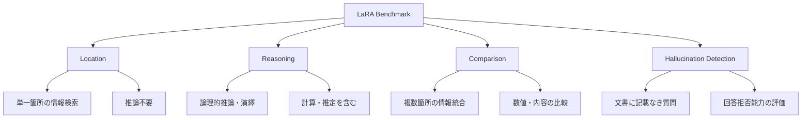
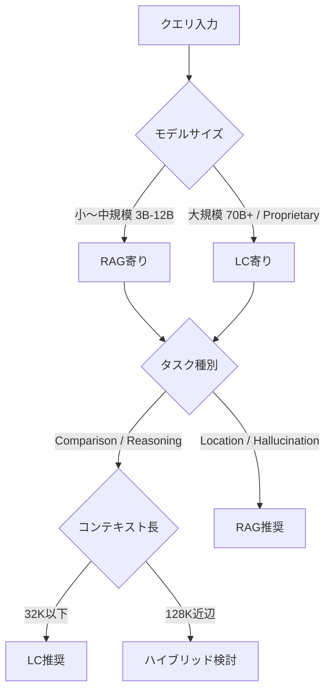
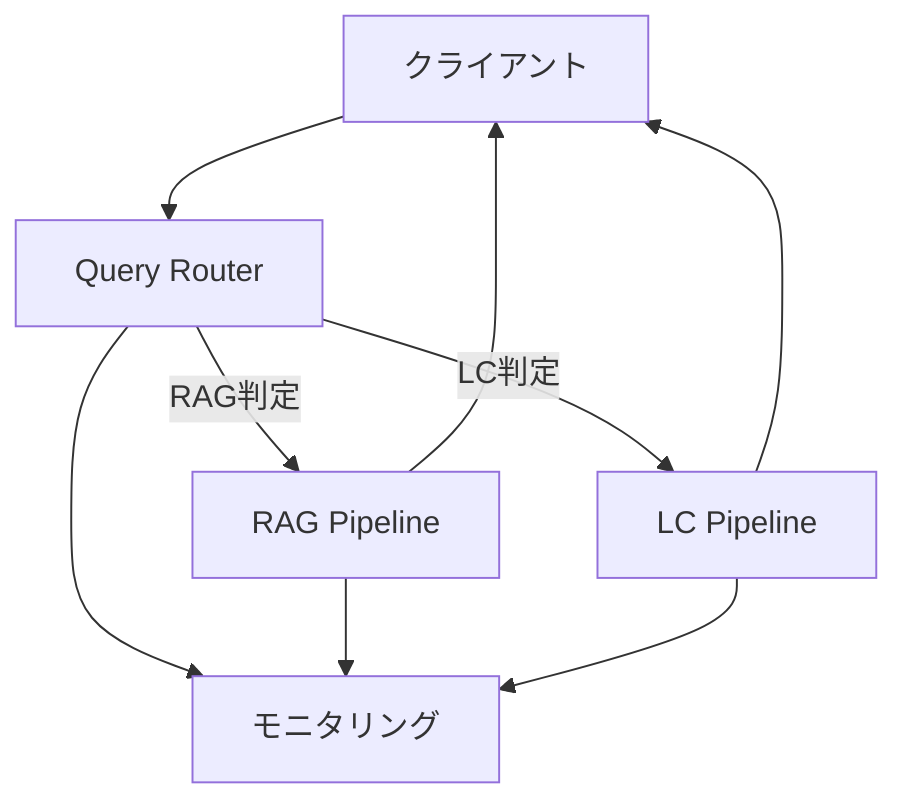

本記事は [LaRA: Benchmarking Retrieval-Augmented Generation and Long-Context LLMs (arXiv:2502.09977)](https://arxiv.org/abs/2502.09977) の解説記事です。

関連するZenn記事: [LLMロングコンテキスト活用の実装戦略：圧縮・配置・キャッシュの最適解](https://zenn.dev/0h_n0/articles/2f22a86203839b)

## 論文概要

Li, Zhangらによる本論文は、Retrieval-Augmented Generation（RAG）とロングコンテキスト（LC）LLMのどちらが長文理解タスクに適しているかを体系的に評価するベンチマーク「**LaRA**」を提案している。LaRAは4種類のQAタスクカテゴリと3種類のテキストタイプにまたがる2,326件のテストケースで構成され、7つのオープンソースモデルと4つのプロプライエタリモデルを対象に評価を行っている。著者らは、RAGとLCの最適な選択がモデルのパラメータサイズ、ロングテキスト処理能力、コンテキスト長、タスク種別、検索特性の複雑な相互作用に依存し、いずれか一方が普遍的に優れるわけではないと報告している。本論文はICML 2025にPosterとして採択されている。

## 情報源

- **arXiv ID**: 2502.09977
- **URL**: [arXiv:2502.09977](https://arxiv.org/abs/2502.09977)
- **著者**: Kuan Li, Liwen Zhang, Yong Jiang, Pengjun Xie, Fei Huang, Shuai Wang, Minhao Cheng
- **発表年**: 2025年2月（ICML 2025採択）
- **分野**: Computation and Language (cs.CL), Artificial Intelligence (cs.AI)
- **コード・データセット**: [https://github.com/Alibaba-NLP/LaRA](https://github.com/Alibaba-NLP/LaRA)（MIT License）

## カンファレンス情報

**ICML（International Conference on Machine Learning）2025** は機械学習分野のトップカンファレンスの一つであり、理論からアプリケーションまで幅広い研究が発表される。LaRAはPosterセッションとして採択されており、RAGとロングコンテキストLLMの比較という実務的にも重要なテーマが査読プロセスを経て認められた。ICML 2025はバンクーバー（カナダ）にて2025年7月に開催された。

## 背景と動機

### RAG vs ロングコンテキスト：未解決の問い

LLMのコンテキストウィンドウは急速に拡大し、GPT-4oは128Kトークン、Claude 3.5 Sonnetは200Kトークンに対応している。この拡大に伴い「コンテキストウィンドウが十分に大きければRAGは不要になるのか」という問いが実務者の間で議論されてきた。

しかし著者らは、既存の比較研究がベンチマーク設計上の制約を抱えていると指摘している。具体的には、(1) 合成的に生成された「Needle-in-a-Haystack」型のタスクが実際のユースケースを反映していない、(2) テキストの種類やタスクの多様性が不足している、(3) RAGの検索品質による影響が十分に制御されていない、といった問題がある。LaRAはこれらの制約を克服するために設計されたベンチマークである。

### 実務上の意義

コンテキストウィンドウの拡大に伴うAPIコストの増加、RAGパイプラインの構築・運用コスト、そしてレイテンシの違いを考慮すると、タスクに応じた適切な戦略選択は直接的なコスト最適化に繋がる。本論文は、この選択を定量的に支援するエビデンスを提供している。

## 主要な貢献

著者らは以下を本論文の主要な貢献として挙げている:

1. **実用的なベンチマーク設計**: 小説・学術論文・財務報告という3種類の実テキストと、Location・Reasoning・Comparison・Hallucination Detectionの4タスクカテゴリで構成される2,326件のテストケースを構築した
2. **包括的モデル評価**: 7つのオープンソースモデル（Llama-3.1-8B, Llama-3.2-3B, Qwen-2.5-7B/72B, Mistral-Nemo-12B等）と4つのプロプライエタリモデル（GPT-4o, Claude-3.5-Sonnet等）を32Kおよび128Kコンテキスト長で体系的に評価した
3. **多因子分析**: モデルサイズ、タスク種別、テキスト種別、コンテキスト長、チャンク特性など多角的な要因が性能に与える影響を分離して分析した
4. **実務指針の提示**: RAGとLCの使い分けに関する条件付き推奨を導出した

## 技術的詳細 - ベンチマーク設計

### テキストタイプの選択と前処理

LaRAで使用される3種類のテキストは、実務で遭遇する文書タイプの多様性をカバーするために選択されている。

| テキストタイプ | 特徴 | 前処理 |
|---|---|---|
| 小説（Novels） | 非構造的、エンティティ関係が複雑 | GPT-4oによる3段階パイプラインでエンティティ置換（学習データ汚染防止） |
| 学術論文（Papers） | 半構造的、引用による連結 | 2024年のarXiv論文を使用 |
| 財務報告（Financial） | 高度に構造的、数値データ中心 | 2024年の米国上場企業報告書 |

エンティティ置換パイプラインは以下の3段階で構成される:

1. **セグメンテーション**: 原文を意味的なセグメントに分割
2. **エンティティ抽出**: 各セグメントから人名・地名・組織名などのエンティティを抽出
3. **エイリアス解消**: 同一エンティティの異なる表記（略称・愛称等）を統一し、一貫した置換を実施

この手法により、学習データに含まれる可能性のある古典文学からの質問に対し、モデルが記憶に頼った回答をすることを防止している。

### 4つのQAタスクカテゴリ



各タスクカテゴリの設計意図は以下の通りである:

- **Location**: コンテキスト内の特定情報を正確に見つける能力を評価する。回答は単一の文・段落に含まれ、推論を必要としない
- **Reasoning**: 論理的推論、演繹、または計算が必要なタスク。複数の情報を組み合わせた判断が求められる
- **Comparison**: コンテキスト内の複数箇所から情報を集約し、内容や数値を比較する能力を評価する。グローバルなコンテキスト理解が必要
- **Hallucination Detection**: コンテキストに記載されていない質問に対して回答を拒否できるかを評価する。RAGシステムでは検索結果に関連情報がない場合の挙動が問われる

### コンテキスト長の制御

32Kおよび128Kの2つのコンテキスト長を設定し、テキストの切り詰め（truncation）を行わずに自然な文書長を維持している。これにより、コンテキスト長の拡大がRAGとLCそれぞれの性能にどのように影響するかを公正に比較できる。

### 検索設定

RAG条件の検索パイプラインは以下のパラメータで構成される:

- **チャンクサイズ**: 600トークン
- **チャンク重複**: 100トークン
- **検索チャンク数**: 5件/文書
- **埋め込みモデル**: GTE-large-en-v1.5
- **検索戦略**: 埋め込み類似度とBM25のハイブリッド検索

### 評価指標

従来のF1スコアやExact Matchに代えて、GPT-4oを評価器として使用している。著者らは自然言語生成タスクにおいてこれらの自動指標が不正確になる場合があると主張しており、クエリ・正解・モデル予測の3つ組を入力としてLLM評価を行っている。人間評価とのCohenのKappa係数は約0.95であり、高い一致率が報告されている。

## 実験結果

### 32Kコンテキストでの結果

論文Table 2より、32Kコンテキストにおける主要な傾向を以下に示す。

| 傾向 | 詳細 |
|---|---|
| オープンソースモデル | 大多数でLCがRAGを上回る（Llama-3.2-3BとMistral-Nemo-12Bを除く） |
| プロプライエタリモデル | 一貫してLCが優位 |
| タスク別差分（LC - RAG） | Location: +0.08%, Reasoning: +4.66%, Comparison: +15.22%, Hallucination: -10.38% |

Comparisonタスクでは、グローバルなコンテキスト理解が必要なため、全文を入力するLCが+15.22%の大差でRAGを上回っている。一方、Hallucination DetectionではRAGが-10.38%（RAGが優位）と逆転しており、検索結果に関連情報がない場合にRAGベースのシステムがより適切に回答拒否を行えることが示されている。

### 128Kコンテキストでの結果

コンテキスト長が128Kに拡大すると、傾向が変化する:

| 傾向 | 詳細 |
|---|---|
| オープンソースモデル | 大多数でRAGが優位に転換 |
| RAG改善幅 | Llama-3.1-8B: +0.15%, Qwen-2.5-7B: +7.39% |
| プロプライエタリモデル | 引き続きLCが優位 |
| タスク別差分（LC - RAG） | Location: -5.25%, Reasoning: -1.39%, Comparison: +14.30%, Hallucination: -22.36% |

特筆すべきは、Mistral-Nemo-12Bでは128K条件でRAGがLCを38.12%上回る結果となったことである。これは、ロングコンテキスト処理能力が不十分なモデルでは、コンテキスト長の拡大に伴い性能劣化が顕著になることを示唆している。

### モデルサイズと性能の関係

著者らは、モデルサイズの拡大が一貫して性能を向上させることを報告している。パラメータ数の増加に伴い、改善幅は7.35%から16.2%の範囲にある。注目すべきは、小規模モデルではコンテキスト長の拡大に伴う性能劣化がより急激に発生する点である。

### Lost in the Middleの影響

LCモデルでは、回答が文書の中央部分に位置する場合に精度が低下する「Lost in the Middle」現象が確認されている。一方、RAGでは回答位置に依存しない安定した性能が報告されている。この知見は、LCで処理する場合に重要情報の配置を考慮する必要があることを示唆している。

### チャンク数の影響

検索チャンク数の増加に対する反応はモデルサイズに依存する:

- **大規模モデル**: チャンク数の増加に伴い性能が向上する傾向
- **小規模モデル**: 中程度のチャンク数でピークに達し、それ以上ではノイズによる性能劣化が発生

## 実装のポイント - RAG/LCルーティング戦略

論文の知見を実装に落とし込むと、以下のルーティング判断フレームワークが導出される。

### RAGを選択すべき条件

- **モデルサイズが小〜中規模**（3B-12Bパラメータ帯）: ロングコンテキスト処理能力が限定的
- **コンテキスト長がモデル上限に近い**（128K領域）: 性能劣化のリスクが高い
- **Hallucination Detectionが重要**: 回答拒否の精度がRAGで有意に高い
- **非構造的テキスト**（小説、会話ログ等）: RAGによる情報絞り込みが効果的
- **コスト効率重視**: 入力トークン数の削減により推論コストを抑制

### LCを選択すべき条件

- **大規模モデルまたはプロプライエタリモデル**（70B+, GPT-4o, Claude等）: ロングコンテキスト処理能力が高い
- **Reasoning・Comparisonタスク**: グローバルなコンテキスト理解が必要
- **構造化テキスト**（学術論文、財務報告等）: LCの優位性が大きい
- **十分な計算リソースがある場合**: トークン単価よりも精度を重視



## Production Deployment Guide

LaRAの知見をAWS上の本番システムに実装するための具体的なアーキテクチャを示す。

### アーキテクチャ概要

RAG/LCルーティングを動的に行うシステムは、以下の3層で構成する。



1. **Query Router**: クエリの特徴量（タスク種別推定、テキスト構造、長さ）に基づきRAGまたはLCパイプラインへルーティング
2. **RAG Pipeline**: 埋め込み生成 → ベクトル検索 → チャンク取得 → LLM推論
3. **LC Pipeline**: 全文入力 → LLM推論

### Small構成: Lambda + Bedrock

月間リクエスト数が10万件以下の小〜中規模ワークロード向け。

```hcl
# --- Query Router (Lambda) ---
resource "aws_lambda_function" "query_router" {
  function_name = "lara-query-router"
  runtime       = "python3.12"
  handler       = "router.handler"
  timeout       = 30
  memory_size   = 512

  environment {
    variables = {
      RAG_FUNCTION_ARN     = aws_lambda_function.rag_pipeline.arn
      LC_FUNCTION_ARN      = aws_lambda_function.lc_pipeline.arn
      ROUTING_CONFIG_TABLE = aws_dynamodb_table.routing_config.name
    }
  }
}

# --- RAG Pipeline (Lambda + Bedrock + OpenSearch Serverless) ---
resource "aws_lambda_function" "rag_pipeline" {
  function_name = "lara-rag-pipeline"
  runtime       = "python3.12"
  handler       = "rag.handler"
  timeout       = 120
  memory_size   = 1024

  environment {
    variables = {
      OPENSEARCH_ENDPOINT = aws_opensearchserverless_collection.vectors.collection_endpoint
      BEDROCK_MODEL_ID    = "anthropic.claude-sonnet-4-20250514"
      CHUNK_SIZE          = "600"
      CHUNK_OVERLAP       = "100"
      TOP_K               = "5"
    }
  }
}

resource "aws_opensearchserverless_collection" "vectors" {
  name = "lara-vectors"
  type = "VECTORSEARCH"
}

# --- LC Pipeline (Lambda + Bedrock) ---
resource "aws_lambda_function" "lc_pipeline" {
  function_name = "lara-lc-pipeline"
  runtime       = "python3.12"
  handler       = "lc.handler"
  timeout       = 300
  memory_size   = 1024

  environment {
    variables = {
      BEDROCK_MODEL_ID = "anthropic.claude-sonnet-4-20250514"
      MAX_CONTEXT_LEN  = "128000"
    }
  }
}

# --- Routing Config (DynamoDB) ---
resource "aws_dynamodb_table" "routing_config" {
  name         = "lara-routing-config"
  billing_mode = "PAY_PER_REQUEST"
  hash_key     = "task_type"

  attribute {
    name = "task_type"
    type = "S"
  }
}
```

ルーティングロジックの実装例:

```python
import json
import boto3
from enum import Enum
from typing import TypedDict


class TaskType(str, Enum):
    LOCATION = "location"
    REASONING = "reasoning"
    COMPARISON = "comparison"
    HALLUCINATION = "hallucination"


class RoutingDecision(TypedDict):
    pipeline: str  # "rag" or "lc"
    reason: str
    confidence: float


def classify_task(query: str, context_length: int) -> TaskType:
    """クエリからタスク種別を推定する。

    本番環境では軽量な分類モデル（DistilBERT等）の
    fine-tunedバージョンを使用することを推奨する。
    ここではルールベースの簡易実装を示す。
    """
    query_lower = query.lower()
    comparison_keywords = ["compare", "difference", "比較", "違い", "どちらが"]
    hallucination_keywords = ["本当", "事実", "正しい", "記載されて"]
    reasoning_keywords = ["なぜ", "理由", "計算", "推定", "explain", "why"]

    if any(kw in query_lower for kw in comparison_keywords):
        return TaskType.COMPARISON
    if any(kw in query_lower for kw in hallucination_keywords):
        return TaskType.HALLUCINATION
    if any(kw in query_lower for kw in reasoning_keywords):
        return TaskType.REASONING
    return TaskType.LOCATION


def route_query(
    query: str,
    context_length: int,
    model_size: str = "medium",
) -> RoutingDecision:
    """LaRAの知見に基づくルーティング判定。

    Args:
        query: ユーザクエリ
        context_length: コンテキストのトークン数
        model_size: "small" (3-12B), "medium" (70B), "large" (proprietary)

    Returns:
        RoutingDecision: パイプライン選択と根拠
    """
    task_type = classify_task(query, context_length)

    # LaRA Table 2に基づくルーティングルール
    if task_type == TaskType.HALLUCINATION:
        return RoutingDecision(
            pipeline="rag",
            reason="Hallucination detection: RAG is 10-22% more accurate",
            confidence=0.85,
        )

    if task_type == TaskType.COMPARISON:
        return RoutingDecision(
            pipeline="lc",
            reason="Comparison tasks require global context (+14-15% for LC)",
            confidence=0.80,
        )

    if model_size == "small" and context_length > 64_000:
        return RoutingDecision(
            pipeline="rag",
            reason="Small model + long context: RAG avoids degradation",
            confidence=0.75,
        )

    if model_size == "large":
        return RoutingDecision(
            pipeline="lc",
            reason="Large/proprietary models consistently favor LC",
            confidence=0.78,
        )

    # デフォルト: コンテキスト長に基づく判定
    if context_length <= 32_000:
        return RoutingDecision(
            pipeline="lc",
            reason="Short context: LC generally sufficient",
            confidence=0.65,
        )
    return RoutingDecision(
        pipeline="rag",
        reason="Long context with medium model: RAG recommended",
        confidence=0.60,
    )
```

### Large構成: EKS + Bedrock

月間リクエスト数が100万件を超える大規模ワークロード向け。

```hcl
# --- EKS Cluster ---
module "eks" {
  source  = "terraform-aws-modules/eks/aws"
  version = "~> 20.0"

  cluster_name    = "lara-routing-cluster"
  cluster_version = "1.31"

  vpc_id     = module.vpc.vpc_id
  subnet_ids = module.vpc.private_subnets

  eks_managed_node_groups = {
    router = {
      instance_types = ["m7i.xlarge"]
      min_size       = 2
      max_size       = 10
      desired_size   = 3

      labels = {
        workload = "router"
      }
    }

    rag_worker = {
      instance_types = ["m7i.2xlarge"]
      min_size       = 2
      max_size       = 20
      desired_size   = 4

      labels = {
        workload = "rag"
      }
    }
  }
}

# --- OpenSearch Serverless for Vector Store ---
resource "aws_opensearchserverless_collection" "vectors" {
  name = "lara-vectors-prod"
  type = "VECTORSEARCH"
}

resource "aws_opensearchserverless_security_policy" "encryption" {
  name = "lara-encryption"
  type = "encryption"
  policy = jsonencode({
    Rules = [{
      ResourceType = "collection"
      Resource     = ["collection/lara-vectors-prod"]
    }]
    AWSOwnedKey = true
  })
}

# --- HPA for Router ---
resource "kubernetes_horizontal_pod_autoscaler_v2" "router_hpa" {
  metadata {
    name = "query-router-hpa"
  }

  spec {
    scale_target_ref {
      api_version = "apps/v1"
      kind        = "Deployment"
      name        = "query-router"
    }

    min_replicas = 3
    max_replicas = 30

    metric {
      type = "Resource"
      resource {
        name = "cpu"
        target {
          type                = "Utilization"
          average_utilization = 60
        }
      }
    }

    metric {
      type = "Pods"
      pods {
        metric {
          name = "requests_per_second"
        }
        target {
          type          = "AverageValue"
          average_value = "100"
        }
      }
    }
  }
}
```

### 運用・監視設定

CloudWatchによるルーティング精度と各パイプラインの性能を監視する構成例を示す。

```hcl
# --- CloudWatch Dashboard ---
resource "aws_cloudwatch_dashboard" "lara_routing" {
  dashboard_name = "lara-routing-dashboard"
  dashboard_body = jsonencode({
    widgets = [
      {
        type   = "metric"
        x      = 0
        y      = 0
        width  = 12
        height = 6
        properties = {
          title   = "Routing Distribution (RAG vs LC)"
          metrics = [
            ["LaRA", "rag_requests", { stat = "Sum", period = 300 }],
            ["LaRA", "lc_requests", { stat = "Sum", period = 300 }]
          ]
          view   = "timeSeries"
          region = "ap-northeast-1"
        }
      },
      {
        type   = "metric"
        x      = 12
        y      = 0
        width  = 12
        height = 6
        properties = {
          title   = "Pipeline Latency (p50/p99)"
          metrics = [
            ["LaRA", "rag_latency", { stat = "p50", period = 300 }],
            ["LaRA", "rag_latency", { stat = "p99", period = 300 }],
            ["LaRA", "lc_latency", { stat = "p50", period = 300 }],
            ["LaRA", "lc_latency", { stat = "p99", period = 300 }]
          ]
          view   = "timeSeries"
          region = "ap-northeast-1"
        }
      },
      {
        type   = "metric"
        x      = 0
        y      = 6
        width  = 12
        height = 6
        properties = {
          title   = "Task Type Distribution"
          metrics = [
            ["LaRA", "task_location", { stat = "Sum", period = 3600 }],
            ["LaRA", "task_reasoning", { stat = "Sum", period = 3600 }],
            ["LaRA", "task_comparison", { stat = "Sum", period = 3600 }],
            ["LaRA", "task_hallucination", { stat = "Sum", period = 3600 }]
          ]
          view   = "bar"
          region = "ap-northeast-1"
        }
      }
    ]
  })
}

# --- CloudWatch Alarms ---
resource "aws_cloudwatch_metric_alarm" "high_latency_rag" {
  alarm_name          = "lara-rag-high-latency"
  comparison_operator = "GreaterThanThreshold"
  evaluation_periods  = 3
  metric_name         = "rag_latency"
  namespace           = "LaRA"
  period              = 300
  statistic           = "p99"
  threshold           = 10000
  alarm_description   = "RAG pipeline p99 latency exceeds 10 seconds"

  alarm_actions = [aws_sns_topic.alerts.arn]
}

resource "aws_cloudwatch_metric_alarm" "routing_error_rate" {
  alarm_name          = "lara-routing-error-rate"
  comparison_operator = "GreaterThanThreshold"
  evaluation_periods  = 2
  metric_name         = "routing_errors"
  namespace           = "LaRA"
  period              = 300
  statistic           = "Sum"
  threshold           = 50
  alarm_description   = "Routing errors exceed 50 in 5 minutes"

  alarm_actions = [aws_sns_topic.alerts.arn]
}

resource "aws_sns_topic" "alerts" {
  name = "lara-routing-alerts"
}
```

メトリクス送信のPython実装例:

```python
import time
import boto3
from typing import Any


cloudwatch = boto3.client("cloudwatch", region_name="ap-northeast-1")


def emit_routing_metrics(
    pipeline: str,
    task_type: str,
    latency_ms: float,
    success: bool,
) -> None:
    """ルーティング結果のメトリクスをCloudWatchに送信する。

    Args:
        pipeline: "rag" or "lc"
        task_type: タスク種別（location, reasoning, comparison, hallucination）
        latency_ms: レイテンシ（ミリ秒）
        success: 処理成功フラグ
    """
    metric_data: list[dict[str, Any]] = [
        {
            "MetricName": f"{pipeline}_requests",
            "Value": 1,
            "Unit": "Count",
            "Dimensions": [
                {"Name": "TaskType", "Value": task_type},
            ],
        },
        {
            "MetricName": f"{pipeline}_latency",
            "Value": latency_ms,
            "Unit": "Milliseconds",
            "Dimensions": [
                {"Name": "TaskType", "Value": task_type},
            ],
        },
        {
            "MetricName": f"task_{task_type}",
            "Value": 1,
            "Unit": "Count",
        },
    ]

    if not success:
        metric_data.append({
            "MetricName": "routing_errors",
            "Value": 1,
            "Unit": "Count",
            "Dimensions": [
                {"Name": "Pipeline", "Value": pipeline},
            ],
        })

    cloudwatch.put_metric_data(
        Namespace="LaRA",
        MetricData=metric_data,
    )
```

### コスト最適化チェックリスト

LaRAの知見を踏まえたコスト最適化の指針を以下に示す。

| チェック項目 | 推奨アクション | 削減見込み |
|---|---|---|
| Hallucination Detection系クエリをRAGに集約 | ルーティングルールの追加 | LC推論コスト 20-30%削減 |
| 128K超のコンテキストで小規模モデルを使用している | RAGへの切り替えまたはモデルアップグレード | 精度向上 + コスト削減 |
| Comparisonタスクで不必要にRAGを使用している | LCへの切り替え | 精度 +14%改善 |
| OpenSearch Serverlessの利用パターン確認 | OCU設定の最適化 | ストレージ/検索コスト最適化 |
| Bedrock推論のPrompt Caching活用 | 同一コンテキストの再利用時にキャッシュ有効化 | 最大90%のトークンコスト削減 |
| Lambda関数のメモリ・タイムアウト設定 | Power Tuningツールで最適化 | 実行コスト10-40%削減 |

特に重要なのは、全クエリを一律にRAGまたはLCで処理するのではなく、タスク特性に応じたルーティングを行うことである。LaRAの結果が示すように、Comparisonタスクでは一貫してLCが優位（+14-15%）であり、Hallucination DetectionではRAGが優位（-10〜-22%）である。この差を活用するだけでも、システム全体の精度とコストの両方を改善できる。

## 実運用への応用

LaRAの知見は、以下のような実運用シナリオに直接適用可能である。

**カスタマーサポートシステム**: FAQの検索（Location型）にはRAGが適しており、複雑な契約条件の比較（Comparison型）にはLCが適している。単一のシステム内でタスク種別に応じたルーティングを実装することで、回答精度とコストの両方を最適化できる。

**法務文書レビュー**: 契約書全文の整合性チェック（Comparison型）にはLCを使用し、特定条項の検索（Location型）にはRAGを使用するハイブリッド構成が有効である。

**金融分析**: 財務報告書の数値比較（Comparison型）ではLCが14-15%の精度優位を示しており、財務データ分析にはLCベースのアプローチが推奨される。一方、過去の決算情報の参照（Location型）にはRAGが適している。

**コンテンツモデレーション**: 回答の根拠確認やHallucination DetectionにはRAGが10-22%優位であり、事実確認が重要なユースケースではRAGベースの検証パイプラインが効果的である。

## 関連研究

LaRAの位置づけを理解するため、関連するベンチマークおよび研究を以下に挙げる。

- **RULER** (Hsieh et al., 2024): ロングコンテキストLLMの評価に特化したベンチマーク。合成タスク（Needle-in-a-Haystack等）で構成されているが、LaRAの著者らはこの合成的なアプローチの限界を指摘している
- **LongBench** (Bai et al., 2024): 複数のNLPタスクにまたがるロングコンテキスト評価ベンチマーク。LaRAとは異なり、RAGとの明示的な比較は設計に含まれていない
- **FACTS Grounding** (Google DeepMind, 2024): 事実に基づいた回答のグラウンディングを評価するベンチマーク。Hallucination Detectionの側面でLaRAと補完的な位置づけにある
- **RouteLLM** (Ong et al., 2024): コストと性能のトレードオフを最適化するLLMルーティングフレームワーク。LaRAのルーティング知見は、RouteLLMのようなシステムにRAG/LC分岐を追加する拡張として活用可能である

## まとめと今後の展望

LaRAは、RAGとロングコンテキストLLMの使い分けに関して「銀の弾丸は存在しない」ことを2,326件のテストケースで実証した。最適な戦略はモデルサイズ、タスク種別、コンテキスト長、テキスト構造の複合的な要因に依存する。

今後の方向性として、著者らは(1) より多様なタスクカテゴリの追加、(2) マルチモーダルコンテキストへの拡張、(3) 動的ルーティングシステムの構築を挙げている。特に、クエリ特徴量に基づいてRAGとLCを自動的に切り替えるルーティングシステムは、LaRAの知見を直接活用できる応用として有望である。

実務者にとっては、本論文のTable 2に示されたタスク別・モデル別の性能差を参照し、自身のユースケースに合致する条件でのRAG/LC選択を行うことが推奨される。

## 参考文献

- Li, K., Zhang, L., Jiang, Y., Xie, P., Huang, F., Wang, S., & Cheng, M. (2025). LaRA: Benchmarking Retrieval-Augmented Generation and Long-Context LLMs -- No Silver Bullet for LC or RAG Routing. *ICML 2025*. arXiv:2502.09977.
- Hsieh, C.-P., et al. (2024). RULER: What's the Real Context Size of Your Long-Context Language Models? arXiv:2404.06654.
- Bai, Y., et al. (2024). LongBench: A Bilingual, Multitask Benchmark for Long Context Understanding. *ACL 2024*.
- Ong, I., et al. (2024). RouteLLM: Learning to Route LLMs with Preference Data. arXiv:2406.18665.
