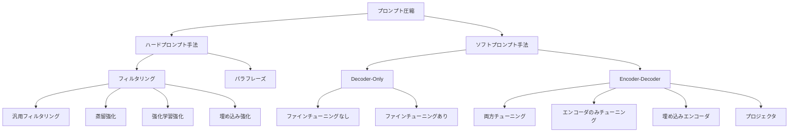

本記事は [Prompt Compression for Large Language Models: A Survey (NAACL 2025)](https://aclanthology.org/2025.naacl-long.368/) の解説記事です。

## 論文概要（Abstract）

本サーベイは、LLMのプロンプト圧縮技術を**ハードプロンプト手法**と**ソフトプロンプト手法**の2大カテゴリに体系的に分類し、各手法の技術的アプローチを比較した上で、注意機構の最適化、Parameter-Efficient Fine-Tuning（PEFT）、モダリティ統合、合成言語という4つの観点からメカニズムを分析している。著者らは、現行手法の限界を整理し、圧縮エンコーダの最適化、ハード・ソフト手法の統合、マルチモーダルからの知見活用という3つの将来方向を提示している。NAACL 2025 Main Conference（Oral選出）に採択され、全14ページ（pp. 7182-7195）の包括的なサーベイである。

この記事は [Zenn記事: LLMロングコンテキスト活用の実装戦略：圧縮・配置・キャッシュの最適解](https://zenn.dev/0h_n0/articles/2f22a86203839b) の深掘りです。

## 情報源

- **タイトル**: Prompt Compression for Large Language Models: A Survey
- **arXiv ID**: 2410.12388
- **URL**: [https://aclanthology.org/2025.naacl-long.368/](https://aclanthology.org/2025.naacl-long.368/)
- **著者**: Zongqian Li, Yinhong Liu, Yixuan Su, Nigel Collier
- **DOI**: 10.18653/v1/2025.naacl-long.368
- **GitHub**: [ZongqianLi/Prompt-Compression-Survey](https://github.com/ZongqianLi/Prompt-Compression-Survey)

## カンファレンス情報

- **会議名**: NAACL 2025（Nations of the Americas Chapter of the Association for Computational Linguistics: Human Language Technologies）
- **開催地**: Albuquerque, New Mexico
- **開催時期**: 2025年4月
- **カテゴリ**: Volume 1: Long Papers（pp. 7182-7195）
- **選出**: Oral Presentation（Selected Oral）
- **ISBN**: 979-8-89176-189-6

NAACL 2025のLong Paper（Oral）に採択されたことは、プロンプト圧縮という分野がNLPコミュニティにおいて重要なトピックとして認知されていることを示している。

## 背景と動機（Background & Motivation）

LLMを活用した自然言語処理タスクでは、詳細な要件や参考情報を伝えるために長いプロンプトを用いることが一般的である。しかし、プロンプト長の増大は2つの深刻な問題を引き起こす。第一に、**メモリ使用量の増大**である。Transformerの自己注意機構は入力長$n$に対して$O(n^2)$の計算量と$O(n)$のKVキャッシュメモリを要するため、長いプロンプトは推論コストを直線的に増加させる。第二に、**APIコストの増大**である。商用LLM APIは入力トークン数に基づく従量課金が主流であり、RAG（Retrieval-Augmented Generation）のように複数の検索文書をコンテキストに含める用途では、1回の推論あたりのコストが無視できない水準に達する。

これらの課題に対し、コンテキストウィンドウの拡張（Longformer、BigBird等）やFlashAttention等の効率的注意機構の研究が進む一方、**プロンプト側を圧縮する**アプローチが注目を集めている。著者らは、既存のサーベイがプロンプト圧縮の一部側面のみを扱っていたことを指摘し、ハード・ソフト両方のプロンプト圧縮手法を統一的な分類体系の下で網羅する初の包括的サーベイとして本論文を位置づけている。

## 主要な貢献（Key Contributions）

- **統一的な分類体系の提示**: プロンプト圧縮手法をハードプロンプト（トークン削除・言い換え）とソフトプロンプト（学習済み表現への圧縮）に大別し、さらに細分類を設けた体系的なタクソノミーを構築した
- **4つの理解フレームワーク**: 注意機構の最適化、PEFT、モダリティ統合、合成言語という4つの視点から、異なる手法間の理論的つながりを明示した
- **下流タスクへの適用分析**: RAG、エージェント、ドメイン特化タスクなど、圧縮手法がどのようなアプリケーションに適用されているかを整理した
- **将来方向の提示**: 40以上の手法を分析した上で、圧縮エンコーダの最適化、ハード・ソフト手法の統合、マルチモーダル知見の活用という3つの研究方向を示した

## 技術的詳細（Technical Details）

### 分類体系の全体像

著者らが提示する分類体系を以下に示す。

### ハードプロンプト手法

ハードプロンプト手法は、元のプロンプトから**自然言語トークンを直接削除または言い換える**ことで圧縮を実現する。出力は依然として自然言語であり、圧縮後のプロンプトは人間が読解可能である点が特徴である。

#### フィルタリング手法

フィルタリング手法は、プロンプト中の冗長なトークンを検出・削除する。

**Selective Context（Li et al., 2023, EMNLP）** は、小規模な因果言語モデル（CLM）を用いて各トークンの自己情報量（self-information）を計算し、情報量の低いトークンを削除する。自己情報量$I(x_i)$は以下で定義される。

$$
I(x_i) = -\log P(x_i \mid x_{<i})
$$

自己情報量が低いトークンは文脈から予測しやすい（冗長な）トークンであり、これを除去しても情報損失が小さいという仮説に基づく。ただし、著者らはSelective Contextが文全体のセマンティクスではなくトークン単位の統計量に依存するため、文脈依存の重要性を捉えきれない場合があると指摘している。

**LLMLingua（Jiang et al., 2023, EMNLP）** は、Selective Contextの限界を克服するため、予算制御戦略（budget controller）と反復トークンレベル圧縮（iterative token-level compression）を導入した。まずデモンストレーション、指示、質問の各セグメントに対して粗粒度の圧縮率を割り当て、次に各セグメント内でトークンレベルの細粒度圧縮を行う。圧縮対象トークンの選択にはperplexityが用いられる。

**LongLLMLingua（Jiang et al., 2024, ACL）** は、LLMLinguaを長文コンテキスト（RAGシナリオ等）に拡張した手法である。質問条件付きperplexity（question-aware perplexity）を導入し、質問との関連性が低い文書やトークンを優先的に除去する。これにより、単純なperplexityベースの手法と比較して、回答に必要な情報の保持率が向上したと報告されている。

**LLMLingua-2（Pan et al., 2024, ACL Findings）** は、従来のLLMLinguaファミリーが因果言語モデルの出力確率に依存していた点を改善し、データ蒸留（data distillation）によるトークン分類器を訓練する。GPT-4等の大規模モデルによる圧縮結果を教師データとし、小規模なBERTベースの分類器がトークンの保持/削除を二値分類する。これにより、因果モデルの左から右への逐次処理の制約から解放され、双方向の文脈を活用した圧縮が可能になった。

#### 強化学習・埋め込み強化手法

**TACO-RL（2024）** と**PCRL**は、強化学習を用いてトークン選択ポリシーを最適化する。圧縮後のプロンプトに対するLLMの応答品質を報酬として、トークン選択の方策を学習する。

**CPC（2024）** と**TCRA-LLM（2023, EMNLP Findings）** は、トークンの埋め込み表現を活用して圧縮対象を決定する。CPCはコントラスティブ学習により情報量の高いトークンの埋め込みを学習し、TCRA-LLMはテキスト検索と圧縮を統合的に行う。

#### パラフレーズ手法

フィルタリングがトークンの削除による圧縮であるのに対し、パラフレーズ手法は元のプロンプトを**より短い自然言語表現に言い換える**ことで圧縮する。

**Nano-Capsulator（2024, NAACL）** は、LLM自身に「元のプロンプトの要約を生成せよ」と指示し、生成された要約を圧縮済みプロンプトとして使用する。**CompAct（2024, EMNLP）** は、RAGコンテキストに特化し、検索文書を質問に関連する短い回答文に圧縮する。**FAVICOMP（2024）** は、事実整合性（factual consistency）を保ちつつ圧縮する手法である。

### ソフトプロンプト手法

ソフトプロンプト手法は、自然言語トークンを**連続的なベクトル表現（ソフトトークン）に圧縮**する。圧縮後の表現は人間には読解不可能だが、LLMの中間表現空間で直接処理できるため、より高い圧縮率を達成できる可能性がある。

#### Decoder-Only型

**Context Compression（CC, Chevalier et al., 2022, EMNLP Findings）** は、ファインチューニングなしでソフトプロンプト圧縮を実現する初期の手法である。LLMの中間層から得られるhidden stateをそのまま圧縮表現として使用する。

**GIST（Mu et al., OpenReview）** は、学習可能なGISTトークンを導入し、これをプロンプトの先頭に挿入して通常のLanguage Modeling目的関数で訓練する。GISTトークンのhidden stateがプロンプト全体の情報を集約するよう学習される。圧縮率はGISTトークン数に依存し、著者らは1-10個のGISTトークンで有効な圧縮が達成されると報告している。

**AutoCompressor（Chevalier et al., 2023, EMNLP）** は、長い文書を固定長のセグメントに分割し、各セグメントを逐次的に処理してsummary vectorに圧縮する。これにより、コンテキストウィンドウを超える長さの文書を扱える。

#### Encoder-Decoder型

Encoder-Decoder型は、専用のエンコーダでプロンプトを圧縮表現に変換し、デコーダ（ターゲットLLM）がこれを条件として生成を行う。

**ICAE（In-context Autoencoder, OpenReview）** は、LoRAアダプタを用いてLLMをエンコーダとして訓練し、元のプロンプトをメモリスロット（memory slots）と呼ばれる少数のソフトトークンに圧縮する。圧縮目的関数は、メモリスロットを条件として元のプロンプトを再構成する自己符号化損失である。

$$
\mathcal{L}_{\text{AE}} = -\sum_{t=1}^{T} \log P_{\theta}(x_t \mid \text{mem}(x_{<t}), x_{<t})
$$

ここで$\text{mem}(\cdot)$はエンコーダによるメモリスロットへの圧縮関数、$\theta$はデコーダのパラメータである。

**500xCompressor（2024）** は、ICAEの圧縮率をさらに向上させ、最大500倍の圧縮を目指す。ペアワイズの圧縮損失とグループ単位の圧縮を組み合わせ、段階的に圧縮率を上げる訓練戦略を採用している。

**COCOM（2024）** は、エンコーダとデコーダの両方をファインチューニングし、検索文書の圧縮表現をデコーダの中間層に注入する。**LLoCO（2024, EMNLP）** は、LoRAとコンテキスト蒸留を組み合わせ、長いコンテキストを効率的に圧縮する。

**xRAG（OpenReview）** は、埋め込みエンコーダ（例: BGE等の汎用テキスト埋め込みモデル）を用いて検索文書をベクトルに変換し、プロジェクタを通じてLLMの入力空間にマッピングする。検索文書のテキストを直接プロンプトに含めるのではなく、埋め込みベクトルとして渡すことで大幅なトークン数削減を実現する。

## メカニズムの理解フレームワーク

著者らは、表面的な手法分類にとどまらず、プロンプト圧縮を理解するための4つの視点を提示している。

### 1. 注意機構の最適化としての理解

ハードプロンプト手法のトークン削除は、Transformerの注意機構において注意重みの低いトークンを除去する操作と見なせる。注意重み$\alpha_{ij}$が低いトークン$j$は、出力表現への寄与が小さいため、削除しても生成品質への影響が限定的であるという解釈である。LLMLinguaファミリーのperplexityベース選択は、この直感を近似的に実装したものと位置づけられる。

### 2. PEFTとの関連

ソフトプロンプト手法のGISTトークンは、Prompt Tuning（Lester et al., 2021）と構造的に類似している。Prompt Tuningが学習可能なソフトトークンをタスク適応のために導入するのに対し、GISTトークンはプロンプト圧縮のために導入される。両者はPEFTの枠組みの中でパラメータ効率的な入力変換として統一的に理解できる。

### 3. モダリティ統合としての理解

ソフトプロンプト手法において、圧縮されたベクトル表現はテキストとは異なる「モダリティ」と見なすことができる。xRAGのように埋め込みエンコーダとプロジェクタを用いてLLMの入力空間にマッピングする手法は、Vision-Language Model（VLM）における画像エンコーダとプロジェクタの構造と類似している。この視点は、マルチモーダルLLMの知見をプロンプト圧縮に転用できる可能性を示唆している。

### 4. 合成言語としての理解

ソフトプロンプト手法の出力は、自然言語ではないが情報を保持するベクトル列であり、一種の「合成言語」と解釈できる。この合成言語は、自然言語の冗長性を排除して情報を効率的に符号化したものとみなせる。

## 手法間比較

以下に、主要な手法の特性を比較する。

| 手法 | カテゴリ | 圧縮方式 | 追加学習 | 可読性 | 主な適用先 |
|------|---------|---------|---------|--------|-----------|
| Selective Context | ハード/フィルタリング | 自己情報量ベース削除 | 不要 | あり | 汎用 |
| LLMLingua | ハード/フィルタリング | Perplexityベース削除 | 不要 | あり | 汎用 |
| LongLLMLingua | ハード/フィルタリング | 質問条件付き削除 | 不要 | あり | RAG |
| LLMLingua-2 | ハード/蒸留強化 | 二値分類器 | 要（分類器） | あり | 汎用 |
| Nano-Capsulator | ハード/パラフレーズ | LLMによる要約 | 不要 | あり | 汎用 |
| CompAct | ハード/パラフレーズ | 回答文圧縮 | 不要 | あり | RAG |
| GIST | ソフト/Decoder-Only | GISTトークン | 要（LM） | なし | 汎用 |
| AutoCompressor | ソフト/Decoder-Only | Summary vector | 要（LM） | なし | 長文書 |
| ICAE | ソフト/Encoder-Decoder | メモリスロット | 要（LoRA） | なし | 汎用 |
| 500xCompressor | ソフト/Encoder-Decoder | 段階圧縮 | 要（LoRA） | なし | 高圧縮 |
| COCOM | ソフト/Encoder-Decoder | 中間層注入 | 要（両方） | なし | RAG |
| xRAG | ソフト/埋め込みEncoder | プロジェクタ | 要（プロジェクタ） | なし | RAG |

### ハード vs ソフトのトレードオフ

**ハードプロンプト手法の利点**: (1) 追加学習が不要または軽量な分類器の学習のみで済む、(2) 圧縮後のプロンプトが人間可読であるため、デバッグや品質検証が容易、(3) ブラックボックスAPI（GPT-4等）にそのまま適用可能。

**ハードプロンプト手法の限界**: (1) 圧縮率に上限がある（トークン削除は元のトークン数を超えて圧縮できない）、(2) トークン単位の削除が文法的な不自然さを生む場合がある。

**ソフトプロンプト手法の利点**: (1) 理論上、任意の圧縮率を達成可能（500xCompressorのように数百倍の圧縮も可能）、(2) 連続空間での情報集約により、離散トークンの制約を受けない。

**ソフトプロンプト手法の限界**: (1) 専用のエンコーダやプロジェクタの訓練が必要、(2) 圧縮表現が不透明であり解釈性に欠ける、(3) ターゲットLLMのアーキテクチャに依存するため、APIサービスには適用が困難。

## 下流タスクへの適用

著者らは、プロンプト圧縮手法の下流適用先を以下の4カテゴリに整理している。

**RAG（Retrieval-Augmented Generation）**: 検索文書の圧縮はRAGの主要な適用先である。xRAG、COCOM、CompAct等が検索文書を圧縮してLLMに渡すことで、多数の検索結果を効率的に活用する。RECOMPは選択的増強（selective augmentation）を導入し、検索文書が有用でない場合は圧縮ではなく除外を選択する。

**エージェント**: HD-Gistは、API呼び出しを行うLLMエージェントのプロンプト圧縮に特化し、APIドキュメントの階層的・動的な圧縮を実現する。エージェントのプロンプトにはツール定義やシステム指示が含まれるため、圧縮による情報損失の影響が特に重要である。

**ドメイン特化タスク**: Tag-llmやCoLLEGe等の手法が、特定ドメイン（医療、法律等）の長文コンテキストに対する圧縮を行う。

**その他**: In-context Learning（ICL）のデモンストレーション圧縮、スタイルカスタマイズ、function vectorの操作等が報告されている。

## 実装のポイント

本サーベイの分析に基づき、手法選択の指針を以下に整理する。

**APIベースのLLMを使用する場合**: ハードプロンプト手法（特にLLMLingua-2）が適している。APIの入出力インターフェースがテキストに限定されるため、ソフトプロンプト手法は原理的に適用できない。LLMLingua-2はBERTベースの軽量な分類器で動作し、推論時のオーバーヘッドが小さい。

**オープンソースLLMを自己ホスティングする場合**: ソフトプロンプト手法（ICAE、GIST等）が高い圧縮率を達成できる。モデルの中間表現にアクセスできるため、圧縮表現の直接注入が可能である。

**RAGパイプラインの場合**: LongLLMLingua（ハード）またはxRAG/COCOM（ソフト）が適している。検索文書の圧縮は、多数のパッセージを効率的に処理するために有用である。

**圧縮後の検証が必要な場合**: ハードプロンプト手法を選択すべきである。圧縮後のプロンプトが人間可読であるため、重要な情報が失われていないかを目視で確認できる。

## 関連研究

- **Efficient Transformers**: FlashAttention（Dao et al., 2022）やLinear Attention（Katharopoulos et al., 2020）等の効率的注意機構は、プロンプト圧縮とは直交的なアプローチでLLMの効率化を実現する。プロンプト圧縮は入力側の最適化であるのに対し、これらはモデル側の最適化である
- **KVキャッシュ圧縮**: H2O（Zhang et al., 2024）やScissorHands等のKVキャッシュ圧縮手法は、推論時のメモリ効率を改善する。プロンプト圧縮がプリフィル段階のトークン数を削減するのに対し、KVキャッシュ圧縮はデコード段階のメモリ使用量を削減する
- **Long-Context LLM**: LongRoPE、YaRN等のコンテキスト長拡張手法は、より多くの情報をプロンプトに含めることを可能にする。これらは圧縮とは逆方向のアプローチだが、拡張されたコンテキストウィンドウに効率的に情報を詰め込むためにプロンプト圧縮と組み合わせて使用できる
- **Prompt Engineering**: Chain-of-Thought（Wei et al., 2022）やTree-of-Thought等のプロンプト設計手法は、プロンプト長を増加させる方向の研究である。プロンプト圧縮は、これらの手法で生成された長いプロンプトのコスト削減手段として位置づけられる

## まとめと今後の展望

本サーベイは、プロンプト圧縮の分野を体系的に整理し、40以上の手法をハード・ソフトの2大カテゴリとそのサブカテゴリに分類した。著者らは以下の3つの将来方向を示している。

第一に、**圧縮エンコーダの最適化**である。現行のソフトプロンプト手法では、圧縮率の向上に伴い情報損失が増大するトレードオフが存在する。より効率的なエンコーダアーキテクチャの設計が求められる。

第二に、**ハードとソフトの統合**である。ハード手法による粗粒度の圧縮（不要なトークンの除去）とソフト手法による細粒度の圧縮（残存トークンのベクトル化）を組み合わせることで、両者の利点を活かした圧縮が実現できる可能性がある。

第三に、**マルチモーダルからの知見活用**である。VLMにおける画像トークンの圧縮技術をテキストプロンプトの圧縮に転用する方向性が示唆されている。

## 参考文献

1. Li, Z., Liu, Y., Su, Y., & Collier, N. (2025). Prompt Compression for Large Language Models: A Survey. *Proceedings of NAACL 2025*, 7182-7195.
2. Li, X., et al. (2023). Compressing Context to Enhance Inference Efficiency of Large Language Models (Selective Context). *EMNLP 2023*.
3. Jiang, H., et al. (2023). LLMLingua: Compressing Prompts for Accelerated Inference of Large Language Models. *EMNLP 2023*.
4. Jiang, H., et al. (2024). LongLLMLingua: Accelerating and Enhancing LLMs in Long Context Scenarios via Prompt Compression. *ACL 2024*.
5. Pan, Z., et al. (2024). LLMLingua-2: Data Distillation for Efficient and Faithful Task-Agnostic Prompt Compression. *ACL 2024 Findings*.
6. Ge, T., et al. (2024). In-context Autoencoder for Context Compression in a Large Language Model (ICAE). *OpenReview*.
7. Mu, J., et al. (2024). Learning to Compress Prompts with Gist Tokens (GIST). *OpenReview*.
8. Chevalier, A., et al. (2023). Adapting Language Models to Compress Contexts (AutoCompressor). *EMNLP 2023*.
9. Cheng, Z., et al. (2024). xRAG: Extreme Context Compression for Retrieval-augmented Generation with One Token. *OpenReview*.
