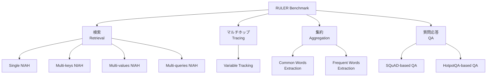

本記事は [RULER: What's the Real Context Size of Your Long-Context Language Models? (arXiv:2404.06654)](https://arxiv.org/abs/2404.06654) の解説記事です。

## 論文概要（Abstract）

RULERは、ロングコンテキストLLMの能力を体系的に評価するための合成ベンチマークである。従来広く利用されてきたNeedle-in-a-Haystack（NIAH）テストが「表面的な長文理解のみを測定している」という問題意識から出発し、検索・マルチホップトレーシング・集約・質問応答の4カテゴリ計13タスクへと評価範囲を拡張した。著者らは17のロングコンテキストLLMを4Kから128Kトークンまでの範囲で評価し、バニラNIAHではほぼ全モデルが95-100%の精度を達成するにもかかわらず、RULER全体では文脈長の増加に伴い大幅な性能低下が生じることを報告している。32K以上のコンテキスト長を公称するモデルのうち、32Kで十分な性能を維持できたのは半数程度にとどまった。

この記事は [Zenn記事: LLMロングコンテキスト活用の実装戦略 -- 圧縮・配置・キャッシュの最適解](https://zenn.dev/0h_n0/articles/2f22a86203839b) の深掘りです。

## 情報源

- **論文タイトル**: RULER: What's the Real Context Size of Your Long-Context Language Models?
- **arXiv ID**: 2404.06654
- **URL**: [https://arxiv.org/abs/2404.06654](https://arxiv.org/abs/2404.06654)
- **著者**: Cheng-Ping Hsieh, Simeng Sun, Samuel Kriman, Shantanu Acharya, Dima Rekesh, Fei Jia, Yang Zhang, Boris Ginsburg
- **分野**: cs.CL（Computation and Language）
- **コード**: [https://github.com/hsiehjackson/RULER](https://github.com/hsiehjackson/RULER)

## カンファレンス情報（COLM 2024）

RULERは**COLM 2024**（Conference on Language Modeling）に採択された論文である。COLMは言語モデルの理論・評価・応用を対象とする会議で、2024年が初回開催である。ロングコンテキスト評価という言語モデルの基本性能に直結するテーマは、まさにCOLMの中心的な関心領域に位置する。

## 背景と動機（Background & Motivation）

近年のLLMは急速にコンテキストウィンドウを拡大しており、128Kトークン（GPT-4）や1Mトークン（Gemini-1.5-Pro）を公称するモデルが登場している。しかし、これらの公称値が実際の利用場面でどの程度機能するのかを検証する方法論は十分に確立されていなかった。

従来最も広く使われてきた評価手法がNeedle-in-a-Haystack（NIAH）テストである。NIAHは長い文脈中にランダムに埋め込まれた1つの「針」（特定の事実）を検索させるタスクで、実装が容易なため業界標準のベンチマークとなっている。しかし著者らは、NIAHには以下の本質的な限界があると指摘する。

第一に、NIAHは単一の情報片の検索しかテストしない。実際のRAGやドキュメント分析では、複数の情報を同時に取得し、関連付け、集約する能力が求められる。第二に、ほぼ全てのモデルがNIAHで95%以上のスコアを達成するため、モデル間の差異を識別する弁別力に欠ける。第三に、NIAHの高スコアが「ロングコンテキスト能力がある」という誤った安心感を与え、実際の応用場面での性能低下を見落とす原因となっている。

RULERはこれらの限界を克服するため、NIAHを基盤としつつ、針の種類と数量を多様化し、検索を超えた推論・集約能力を測定するベンチマークとして設計された。

## 主要な貢献（Key Contributions）

- **4カテゴリ13タスクの体系的ベンチマーク**: バニラNIAHを拡張し、Multi-key NIAH、Multi-value NIAH、マルチホップトレーシング、集約タスクを含む包括的な評価フレームワークを構築した
- **17モデルの大規模比較評価**: 公称コンテキスト長32K-1Mの17モデルを統一的に評価し、公称値と実効的コンテキスト長のギャップを定量的に示した
- **実効的コンテキスト長の定義**: Llama2-7Bの4Kトークン時の性能（85.6%）をベースラインとし、この水準を維持できる最大長を「実効的コンテキスト長」として定義した
- **モデルサイズ・アーキテクチャの影響分析**: 訓練コンテキスト長・モデルサイズ・アーキテクチャ（Transformer vs. 非Transformer）がロングコンテキスト性能に与える影響を系統的に分析した
- **オープンソース公開**: ベンチマークコードを公開し、シーケンス長やタスク複雑度のカスタマイズを可能にした

## 技術的詳細（Technical Details）

### 4つのタスクカテゴリと13タスクの設計

RULERのタスクは4つのカテゴリに分類される。各カテゴリは、ロングコンテキスト処理に必要な異なる能力次元を測定する。

#### カテゴリ1: 検索（Retrieval） -- 4タスク

検索カテゴリはバニラNIAHを基盤として、針の数量と種類を変化させた4つのバリエーションで構成される。

**Single NIAH（S-NIAH）**: 従来のバニラNIAHと同等。長い文脈中に埋め込まれた1つのキー-バリューペアを検索する。ベースラインとして機能する。

**Multi-keys NIAH（MK-NIAH）**: 文脈中に複数のキー-バリューペアを挿入し、指定された1つのキーに対応するバリューを検索させる。注意散漫要素（ディストラクタ）への耐性を測定する。

**Multi-values NIAH（MV-NIAH）**: 1つのキーに対して複数のバリューが存在する設定。モデルが文脈中の関連情報を漏れなく収集できるかを測定する。

**Multi-queries NIAH（MQ-NIAH）**: 複数の異なるキー-バリューペアを同時に検索させる。複数の情報要求を並行処理する能力を測定する。

#### カテゴリ2: マルチホップトレーシング（Multi-hop Tracing） -- 1タスク

**Variable Tracking（VT）**: 変数の代入チェーンを追跡するタスクで、最小限の共参照解決（coreference resolution）をエミュレートする。例えば「X = Y, Y = Z」のような代入連鎖において、最終的な値を求める。文脈中に散在する情報を論理的に連結する推論能力を測定する。

#### カテゴリ3: 集約（Aggregation） -- 2タスク

**Common Words Extraction（CWE）**: 一様分布からサンプリングされた単語群から、出現頻度の高い上位10語を抽出する。文脈全体の情報を統計的に集約する能力を測定する。

**Frequent Words Extraction（FWE）**: ゼータ分布からサンプリングされた単語群から、最頻出の3語を抽出する。CWEと分布特性を変えることで、異なる集約パターンへの対応力を検証する。

#### カテゴリ4: 質問応答（Question Answering） -- QAタスク群

SQuADおよびHotpotQAデータセットを拡張し、注意散漫用の段落を大量に挿入した設定で質問応答を行う。パラメトリック知識と文脈内情報の統合能力、および長文中の関連段落の特定能力を測定する。

### ベンチマーク構造

### 評価メトリクスの定義

RULERでは以下のメトリクスが使用される。

**精度（Accuracy）**: リコールベースの測定で、ターゲット出力がモデルの応答に含まれるかを判定する。部分一致（substring match）を基本とし、複数回答が必要なタスクでは個別の一致率の平均を取る。

**実効的コンテキスト長（Effective Context Length）**: モデルの性能がベースライン閾値（Llama2-7Bの4Kトークン時の性能 = 85.6%）を上回る最大のシーケンス長として定義される。この閾値は「最小限のロングコンテキスト能力を持つモデルの基準性能」を意味し、これを下回る場合はコンテキスト長を拡張した意味がないことを示す。

**重み付き平均スコア**: 2つのバリエーションが用意されている。

$$
\text{wAvg}_{inc} = \sum_{l} w_{inc}(l) \cdot \text{score}(l), \quad w_{inc}(l) \propto l
$$

$$
\text{wAvg}_{dec} = \sum_{l} w_{dec}(l) \cdot \text{score}(l), \quad w_{dec}(l) \propto \frac{1}{l}
$$

$\text{wAvg}_{inc}$は長いコンテキストでの使用を重視する場合のスコア、$\text{wAvg}_{dec}$は短いコンテキストでの使用を重視する場合のスコアである。両者の差がモデルの「長文耐性」を直接反映する。

### 合成タスクの設計原則

RULERが合成タスクを採用する理由について、著者らは3点を挙げている。第一に、シーケンス長やタスク複雑度を任意に制御できる柔軟性がある。第二に、パラメトリック知識（事前学習で獲得した知識）への依存を排除できるため、純粋なコンテキスト内処理能力を測定できる。第三に、自動生成による大量の評価インスタンスの作成が可能で、統計的に安定した評価が実現できる。

## 実験結果（Experimental Results）

### 17モデルの評価結果

著者らが報告した主要な実験結果を以下の表にまとめる（論文Table 3に基づく）。性能はRULER全13タスクの平均精度であり、実効的コンテキスト長はベースライン閾値85.6%を維持できる最大長を示す。

| モデル | 公称コンテキスト長 | 実効的コンテキスト長 | 32K時の平均性能 |
|:---|:---|:---|:---|
| Gemini-1.5-Pro | 1M | >128K | 95%超 |
| GPT-4-1106-preview | 128K | 64K | 93.2% |
| Llama3.1-70B | 128K | 64K | 94.8% |
| Qwen2-72B | 128K | 32K | 94.1% |
| Command-R-plus | 128K | 32K | 92.0% |
| Yi-34B-200K | 200K | 32K | 87.5% |
| Mixtral-8x7B | 32K | 32K | 90%台 |
| Mistral-7B-v0.2 | 32K | 16K | 75.4% |
| DBRX-instruct | 32K | 8K | 63.1% |
| Together-32K | 32K | 4K | 63.0% |
| LWM-1M | 1M | <4K | 69.1% |
| LongChat-7B | 32K | <4K | 59.3% |
| LongAlpaca-7B | 32K | <4K | 43.6% |

### NIAHとRULERの性能乖離

最も注目すべき結果は、バニラNIAHとRULER全体の性能の乖離である。バニラNIAHではほぼ全モデルが95-100%の精度を達成したのに対し、RULER全体（13タスク平均）では以下のような結果となった。

- **Gemini-1.5-Pro**: 95.8%（NIAHとほぼ同等の性能を維持）
- **GPT-4**: 91.6%
- **Llama3.1-70B**: 89.6%
- **Qwen2-72B**: 85.9%

上位モデルでさえ5-10ポイント程度の低下が見られ、下位モデルでは30-50ポイント以上の低下が生じた。著者らは「NIAHの近完璧なスコアがロングコンテキスト能力の保証にはならない」と結論付けている。

### Yi-34B-200Kの詳細分析

著者らはYi-34B-200K（公称200Kトークン）を対象とした詳細な失敗モード分析を行い、7つの典型的な失敗パターンを同定している。

1. **針の種類への非堅牢性**: UUID形式の検索でパスキー形式と比較して大幅な性能低下が発生した
2. **ディストラクタ無視の失敗**: 注意散漫要素を含む完全なhaystack環境では約40ポイントの性能低下が見られた
3. **不完全な情報返却**: 複数アイテムの同時検索で顕著な精度低下が生じた
4. **コンテキストコピー傾向**: 128Kトークン時に出力の80%以上がデモンストレーションからのコピーとなった
5. **追跡の不安定性**: 変数チェーンのトレーシングにおいて空の返答やチェーン間の混同が発生した
6. **集約の失敗**: パラメトリック知識の干渉と不正確な頻度カウントが観察された
7. **QAでの幻覚**: 性能がコンテキストなしのベースラインに近づき、クエリと無関係な回答が生成された

### モデルサイズとアーキテクチャの影響

著者らはYiモデルファミリー（6B/9B/34B）を用いたモデルサイズの影響分析を実施している。同一データで訓練されたモデルにおいて、34Bモデルは6B/9Bモデルを大幅に上回る性能を示した。著者らはこれを「モデルサイズがロングコンテキスト能力の上限を規定する」要因として報告している。

非Transformerアーキテクチャ（MambaおよびRWKV）に関しては、「両モデルはコンテキストサイズを8Kに拡張した時点で顕著な性能低下を示す」と報告されており、Transformerベースラインを大幅に下回った。これは状態空間モデルや線形アテンションモデルのロングコンテキスト処理における現時点での限界を示唆する結果である。

訓練コンテキスト長の影響については、一般に訓練長が長いほど性能が向上する傾向が確認されたが、単調な改善ではないことも報告されている。LWM-1Mは、LWM-512Kよりも256Kトークン時点で低い性能を示しており、著者らはこれを「新しいRoPEベース周波数への適応が不十分であった可能性」として分析している。

## 実装のポイント（Implementation Notes）

### RULERベンチマークの利用方法

RULERはGitHub上でオープンソース公開されており、以下の3つの特徴により実務での活用が容易に設計されている。

**シーケンス長の制御**: 評価対象のシーケンス長を4K/8K/16K/32K/64K/128Kと任意に設定できる。自社ユースケースに合わせた長さでの評価が可能である。

**タスク複雑度のカスタマイズ**: 針の数量やディストラクタの比率を調整することで、タスク難易度を段階的に変化させた評価ができる。例えばMK-NIAHのキー数を増やすことで、実際のRAGシステムに近い複雑度を再現できる。

**自動データ生成**: 合成タスクのため、評価データの生成が完全に自動化されている。新しいモデルのリリース時に即座にベンチマークを実施できる。

### 評価実施時の注意点

著者らの実験設計から、以下の実践的な知見が得られる。

第一に、NIAHテストのみでロングコンテキスト能力を判断することは避けるべきである。著者らが示したように、NIAHで100%近いスコアを出すモデルであっても、マルチホップやアグリゲーションタスクでは大幅に性能が低下する。

第二に、モデルの公称コンテキスト長は実効的な性能保証ではない。32K+を公称するモデルの約半数が32Kで性能閾値を下回った事実は、公称値の2分の1から4分の1程度を実効的な利用上限として見積もるべきであることを示唆する。

第三に、モデルサイズはロングコンテキスト能力と正の相関がある。同一系列のモデルであれば、より大きなパラメータ数のモデルが一般にロングコンテキストタスクで優位であることが確認されている。

## 実運用への応用（Practical Applications）

### モデル選定への活用

RULERの結果は、ロングコンテキストを必要とするアプリケーションでのモデル選定に直接的な示唆を与える。

**RAGシステム**: 大量の検索結果を文脈に含めるRAGでは、MV-NIAH（複数バリュー検索）やMQ-NIAH（複数クエリ検索）の性能が特に重要になる。これらのタスクで高い性能を示すモデルは、RAGにおいて検索結果の見落としが少ないと期待できる。

**コード解析**: リポジトリ全体を文脈に入れるコード理解タスクでは、Variable Tracking（変数追跡）の性能が参考になる。コード中の変数の流れを追跡する能力は、コードの依存関係分析に直結する。

**文書要約**: 長文の要約タスクでは、CWE/FWE（頻出語抽出）の性能が文書全体の統計的理解力を反映する。集約タスクで低い性能を示すモデルは、長文の要約において重要な情報を見落とすリスクが高い。

### 公称値と実効値のギャップへの対処

実運用では、モデルの公称コンテキスト長をそのまま信頼するのではなく、以下のアプローチが推奨される。

1. **自社タスクでの検証**: RULERのフレームワークを参考に、自社のユースケースに近い合成タスクで性能を測定する
2. **段階的な長さでの評価**: 4K/8K/16K/32Kと段階的に文脈長を増やし、性能低下の閾値を特定する
3. **安全マージンの確保**: 実効的コンテキスト長の80%程度を実運用の上限として設計する

## 関連研究（Related Work）

ロングコンテキストLLMの評価に関しては、RULERのほかにもいくつかのベンチマークが提案されている。LongBenchやL-Evalは現実的なタスク（要約、QAなど）でロングコンテキスト能力を測定するが、パラメトリック知識の影響を排除することが困難である。InfiniteBenchは100K+トークンの超長文評価を対象とするが、タスクの多様性に限界がある。SCROLLS/ZeroSCROLLSはゼロショット設定での長文理解を評価するが、文脈長の細かい制御が難しい。

RULERの独自性は、合成タスクによるパラメトリック知識の排除、シーケンス長とタスク複雑度の独立した制御、そしてNIAHからの段階的な拡張によるモデル弱点の特定という3点にある。著者らは、RULERと現実的ベンチマークの併用が最も包括的な評価を実現すると述べている。

## まとめ（Summary）

RULERは、ロングコンテキストLLMの評価におけるNIAH偏重の問題を解決する体系的なベンチマークである。4カテゴリ13タスクによる評価の結果、17モデル中の過半数がバニラNIAHでは近完璧なスコアを達成するにもかかわらず、複合的なタスクでは大幅な性能低下を示すことが明らかになった。公称コンテキスト長32K以上のモデルのうち、32Kで十分な性能を維持できたのは半数にとどまり、公称値と実効的な能力の間には顕著なギャップが存在する。

実務的には、NIAHテストのみによるモデル評価は不十分であり、検索・追跡・集約・QAを含む多面的な評価が不可欠である。RULERのオープンソース公開により、研究者および実務者は自社のユースケースに合わせたカスタマイズ可能な評価を実施できる。ロングコンテキストLLMの選定と運用において、公称値ではなく実効的コンテキスト長に基づく判断が求められることを、RULERは定量的に示している。

## 参考文献

1. Hsieh, C.-P., Sun, S., Kriman, S., Acharya, S., Rekesh, D., Jia, F., Zhang, Y., & Ginsburg, B. (2024). RULER: What's the Real Context Size of Your Long-Context Language Models? *COLM 2024*. [arXiv:2404.06654](https://arxiv.org/abs/2404.06654)
2. Kamradt, G. (2023). Needle in a Haystack - Pressure Testing LLMs. [GitHub](https://github.com/gkamradt/LLMTest_NeedleInAHaystack)
3. Bai, Y., et al. (2024). LongBench: A Bilingual, Multitask Benchmark for Long Context Understanding. *ACL 2024*. [arXiv:2308.14508](https://arxiv.org/abs/2308.14508)
4. An, C., et al. (2024). L-Eval: Instituting Standardized Evaluation for Long Context Language Models. *ACL 2024*. [arXiv:2307.11088](https://arxiv.org/abs/2307.11088)
5. Zhang, X., et al. (2024). InfiniteBench: Extending Long Context Benchmark Beyond 100K Tokens. [arXiv:2402.13718](https://arxiv.org/abs/2402.13718)
