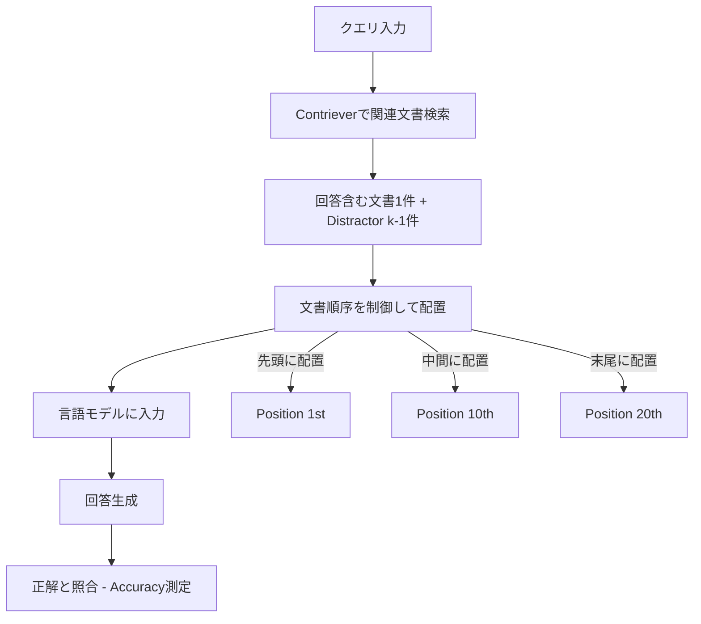

本記事は [Lost in the Middle: How Language Models Use Long Contexts (Liu et al., TACL 2024)](https://aclanthology.org/2024.tacl-1.9/) の解説記事です。

## 論文概要（Abstract）

近年の言語モデルはロングコンテキストを入力として受け取る能力を持つが、実際にその長い入力コンテキストをどの程度活用できているかは十分に理解されていない。著者らは、multi-document question answering（複数文書質問応答）とkey-value retrieval（キー値検索）という2つのタスクで言語モデルの性能を分析した。その結果、関連情報の配置位置を変更するだけで性能が大幅に低下することを発見し、現在の言語モデルがロングコンテキスト中の情報を頑健に利用できていないことを示した。具体的には、関連情報が入力コンテキストの先頭または末尾にある場合に性能が最も高く、中間部に位置する場合に性能が著しく低下するU字型の性能曲線が観察された（論文Figure 1, Figure 5より）。

この記事は [Zenn記事: LLMロングコンテキスト活用の実装戦略：圧縮・配置・キャッシュの最適解](https://zenn.dev/0h_n0/articles/2f22a86203839b) の深掘りです。

## 情報源

- **arXiv ID**: 2307.03172
- **URL**: [https://arxiv.org/abs/2307.03172](https://arxiv.org/abs/2307.03172)
- **著者**: Nelson F. Liu (Stanford University), Kevin Lin (UC Berkeley), John Hewitt (Stanford University), Ashwin Paranjape (Samaya AI), Michele Bevilacqua (Samaya AI), Fabio Petroni (Samaya AI), Percy Liang (Stanford University)
- **発表**: Transactions of the Association for Computational Linguistics (TACL), 2024年, Volume 12, Pages 157-173
- **分野**: cs.CL（Computation and Language）
- **ライセンス**: CC BY 4.0

## 背景と動機（Background & Motivation）

言語モデルは会話インターフェース、検索・要約、協調執筆など多様な自然言語技術の基盤となっている。これらのモデルはプロンプトを通じてタスクを実行するため、入力コンテキストには数千トークンに及ぶ情報が含まれることがある。特に、法律文書や科学論文の処理、検索拡張生成（RAG）における検索結果の統合など、長い入力コンテキストの効果的な利用はますます重要になっている。

Transformerベースの言語モデルは、メモリと計算量がシーケンス長に対して二次的に増加するため、従来は512-2048トークン程度の比較的短いコンテキストウィンドウで訓練されてきた。近年のハードウェア改良やFlashAttention（Dao et al., 2022）、ALiBi（Press et al., 2022）などのアルゴリズム的進歩により、4096, 16K, さらに100Kトークンのコンテキストウィンドウを持つモデルが登場している。しかし、これらの拡張コンテキストモデルが実際にロングコンテキストをどの程度有効に活用できるかは不明であった。

著者らはこの疑問に対し、制御された実験を通じて体系的な分析を行った。具体的には、入力コンテキストの長さと関連情報の位置を独立に制御し、それらが言語モデルの性能に与える影響を定量的に測定した。

## 主要な貢献（Key Contributions）

- **U字型性能曲線の発見**: 関連情報が入力の先頭（primacy bias）または末尾（recency bias）にある場合に性能が最も高く、中間部に位置する場合に著しく低下するパターンを、複数のモデルとタスクにわたって体系的に実証した
- **拡張コンテキストモデルの限界の指摘**: コンテキストウィンドウを拡張したモデル（GPT-3.5-Turbo (16K), Claude-1.3 (100K)など）が、元のモデルと比較して入力コンテキストの利用効率で必ずしも優位でないことを示した
- **モデルアーキテクチャの影響分析**: Decoder-onlyモデルとEncoder-decoderモデルの比較、query-aware contextualization、instruction fine-tuningの影響を予備的に調査し、位置バイアスの原因に関する知見を提供した
- **オープンドメインQAでの実践的知見**: retriever-readerパイプラインにおいて、reader（言語モデル）の性能がretrieverのrecallよりもはるかに早く飽和することを示し、検索文書数の増加が必ずしも性能向上に直結しないことを明らかにした
- **新たな評価プロトコルの提案**: 将来のロングコンテキストモデルの評価において、関連情報の位置を変化させたときの性能安定性を測定すべきであるという基準を確立した

## 技術的詳細（Technical Details）

### 実験タスク1: Multi-Document Question Answering

著者らの第一の実験設定は、複数文書質問応答タスクである。このタスクは、検索拡張生成（RAG）の典型的なユースケースを模している。

**データセット**: NaturalQuestions-Open（Lee et al., 2019; Kwiatkowski et al., 2019）から、回答が段落形式である2655件のクエリを使用した。これらはGoogleの検索エンジンに発行された実際のクエリと、Wikipediaから抽出された人間によるアノテーション付き回答のペアである。

**実験設計**: 各クエリに対して、（i）回答を含む1つの文書と（ii）回答を含まない$k-1$個のdistractor文書を入力コンテキストとして与える。distractor文書はContriever（Izacard et al., 2021）を用いてMS-MARCOでfine-tuningされた検索システムにより取得された、クエリに対して関連度の高いWikipediaチャンク（最大100トークン）である。

**位置の制御**: 回答を含む文書の位置を、先頭から末尾まで系統的に変化させることで、情報の配置位置が性能に与える影響を測定した（論文Figure 3に例示）。

**コンテキスト長の制御**: 文書総数$k$を10, 20, 30と変化させ、それぞれ約2K, 4K, 6Kトークンの入力コンテキストを生成した。

### 実験タスク2: Key-Value Retrieval

第二の実験は合成的なキー値検索タスクである。このタスクは、自然言語の意味的な要素を排除し、入力コンテキストからトークンを純粋に検索する基本能力を測定するために設計された。

**タスク設計**: 入力として（i）$k$個のJSONフォーマットのキー値ペア（キーと値はいずれもランダムに生成された128ビットUUID）と（ii）検索対象のキーが与えられる。モデルは指定されたキーに対応する値を出力する必要がある。$k$個のうち1つが関連するキー値ペアであり、残り$k-1$個はdistractor（無関係なキー値ペア）である。

**実験条件**: キー値ペア数を75（約4Kトークン）、140（約8Kトークン）、300（約16Kトークン）と変化させ、各条件で500例ずつ評価した。

### 評価対象モデル

著者らは以下のオープンモデルとクローズドモデルを評価した（論文Section 2.2, Table 1より）。

| モデル | コンテキスト長 | タイプ | Closed-Book | Oracle |
|--------|-------------|--------|------------|--------|
| MPT-30B-Instruct | 8,192 | Open (Decoder-only) | 31.5% | 81.9% |
| LongChat-13B (16K) | 16,384 | Open (Decoder-only) | 35.0% | 83.4% |
| GPT-3.5-Turbo | 4,096 | Closed (Decoder-only) | 56.1% | 88.3% |
| GPT-3.5-Turbo (16K) | 16,384 | Closed (Decoder-only) | 56.0% | 88.6% |
| Claude-1.3 | 8,192 | Closed (Decoder-only) | 48.3% | 76.1% |
| Claude-1.3 (100K) | 100,000 | Closed (Decoder-only) | 48.2% | 76.4% |

ここでClosed-Bookは入力文書なしでモデルのパラメトリック記憶のみで回答する性能、Oracleは回答を含む単一文書のみを与えた場合の性能を示す。

### U字型性能曲線の詳細

論文Figure 5は、10, 20, 30文書の各条件における6モデルの位置別性能を示している。著者らはこの結果について以下の知見を報告している。

**GPT-3.5-Turboの性能変動**: 20文書条件において、回答を含む文書が先頭にある場合の正解率は約75%であるのに対し、中間部（10番目付近）では約55%まで低下する。この20ポイント以上の低下は、Closed-Book性能（56.1%）を下回るレベルであり、中間位置の文書に関しては文書を与えないほうがむしろ性能が高いことを意味する（論文Section 2.3）。

**拡張コンテキストモデルの非優位性**: GPT-3.5-TurboとGPT-3.5-Turbo (16K)の比較では、10文書および20文書条件（いずれも4Kトークン以下でGPT-3.5-Turboのコンテキストウィンドウ内）において、両モデルの位置別性能曲線がほぼ重なった。著者らは、拡張コンテキストモデルが入力コンテキストの利用効率において非拡張モデルに対して必ずしも優位でないと結論付けている。

**モデル間の共通パターン**: 6モデルすべてにおいてU字型の性能曲線が観察され、このパターンが特定のモデルに固有ではなく、現在の言語モデルに広く存在する構造的な問題であることが示唆された。

### アーキテクチャの影響（Section 4）

著者らは位置バイアスの原因を探るため、3つの要因について予備調査を行った。

#### Decoder-only vs. Encoder-decoder

Flan-T5-XXLとFlan-UL2というencoder-decoderモデルを用いた実験（論文Figure 8）では、エンコーダの訓練時最大シーケンス長（Flan-T5-XXL: 512トークン、Flan-UL2: 2048トークン）以下の入力長ではU字型バイアスが軽減されることが確認された。しかし、訓練時のシーケンス長を超える入力では、encoder-decoderモデルでもU字型曲線が出現した。著者らは、encoder-decoderモデルの双方向エンコーダが各文書を後続文書のコンテキストで処理できるため、文書間の相対的重要度の推定が改善される可能性があると仮説を述べている。

$$
\text{Encoder-decoder:} \quad h_i = \text{BiAttn}(x_i, x_{1:n}) \quad \text{vs.} \quad \text{Decoder-only:} \quad h_i = \text{CausalAttn}(x_i, x_{1:i})
$$

Decoder-onlyモデルは各トークンが先行トークンにのみ注意を向けるため、クエリのトークンは文書やキー値ペアのトークンを文脈化する際に参照できない。これが位置バイアスの一因である可能性がある。

#### Query-Aware Contextualization

クエリを文書の前後の両方に配置するquery-aware contextualizationの効果を調査した（論文Figure 9）。キー値検索タスクでは劇的な改善が見られ、GPT-3.5-Turbo (16K)は300キー値ペア条件で完全な性能を達成した（query-aware contextualなしでは最悪ケースで45.6%）。しかし、multi-document QAタスクではquery-aware contextualizationの効果は限定的であり、先頭位置で若干の改善が見られたものの、他の位置では若干の性能低下が観察された。

#### Instruction Fine-tuningの影響

MPT-30BとMPT-30B-Instruct（instruction fine-tuning済み）の比較（論文Figure 10）では、両モデルともにU字型の性能曲線を示した。instruction fine-tuningは絶対的な性能を向上させるものの、位置バイアスのパターン自体は本質的に変化しなかった。ベストケースとワーストケースの性能差は、ベースモデルで約10%、instruction fine-tuning後で約4%に縮小したが、バイアスは依然として存在した。

### モデルスケールの影響（Appendix E）

Llama-2の7B, 13B, 70Bモデルを用いた追加実験（論文Figure 16）では、U字型の性能曲線が十分に大きなモデル（13B以上）でのみ出現することが確認された。7Bモデルはrecency biasのみを示し、primacy biasは観察されなかった。著者らは、先行研究（Khandelwal et al., 2018; Sun et al., 2021）がprimacy biasを報告しなかったのは、研究対象のモデルが1Bパラメータ未満と小規模であったためではないかと推測している。

## 実験結果（Results & Discussion）

### Multi-Document QAの主要結果

論文Figure 5に示された結果を以下にまとめる。

| 条件 | 先頭配置（最良） | 中間配置（最悪） | 末尾配置 | 性能低下幅 |
|------|--------------|--------------|---------|----------|
| GPT-3.5-Turbo, 20文書 | 約75% | 約55% | 約72% | 約20pt |
| Claude-1.3, 20文書 | 約63% | 約50% | 約60% | 約13pt |
| MPT-30B-Instruct, 20文書 | 約63% | 約55% | 約62% | 約8pt |

特筆すべきは、GPT-3.5-Turboの中間位置での性能（約55%）がClosed-Book性能（56.1%）を下回る点である。これは、関連文書を中間に配置した場合、文書を一切与えない場合よりも性能が低下することを意味し、入力コンテキスト中の無関係な文書がモデルの注意を分散させる悪影響が示唆される。

### Key-Value Retrievalの結果

論文Figure 7に示されたキー値検索の結果では、モデル間で大きな差異が見られた。

- **Claude-1.3 / Claude-1.3 (100K)**: 75, 140, 300のすべてのキー値ペア条件でほぼ完全な性能を維持した
- **GPT-3.5-Turbo / GPT-3.5-Turbo (16K)**: 75ペア条件では比較的高い性能を示したが、140および300ペア条件では中間位置で大幅に低下した
- **MPT-30B-Instruct**: すべての条件で中間位置の性能が低下するU字型パターンを示した

multi-document QAと同様のU字型パターンが確認されたが、キー値検索は純粋な情報検索タスクであるため、自然言語の意味理解ではなくトークンマッチングの能力自体に限界があることが示唆された。

### オープンドメインQA: "More Context Is Always Better?"

論文Section 5では、NaturalQuestions-Openを用いたretriever-readerパイプラインの実験が報告されている（論文Figure 11）。検索文書数$k$を5から50まで増加させた場合、retrieverのrecallは$k$の増加に伴い一貫して改善するが、reader（言語モデル）の性能は$k=20$付近で飽和した。$k=20$から$k=50$への増加による改善は、GPT-3.5-Turboで約1.5%、Claude-1.3で約1%にとどまった。

この結果は、RAGシステムにおいてコンテキストに含める検索文書数を単純に増やすことが最善の戦略ではないことを示唆している。

## 実装のポイント（Practical Guidelines）

論文の知見から導かれる実践的なガイドラインを以下に整理する。

### 情報配置の原則

1. **重要情報は先頭または末尾に配置する**: U字型バイアスを踏まえ、RAGパイプラインにおいてはrerankerを用いて最も関連度の高い文書をコンテキストの先頭に配置することが有効である
2. **検索文書数の適切な制限**: 50文書を与えても20文書と比較して性能改善は1-2%程度であり、レイテンシとコストの増加に見合わない場合が多い。著者らの結果は$k=20$程度が実用的な上限であることを示唆している
3. **中間部の情報に依存しない設計**: コンテキストの中間部に配置された情報は十分に活用されない可能性があるため、長い入力を分割して複数回の推論を行う戦略も検討に値する

### 評価時の注意点

著者らが提案する新たな評価プロトコルとして、ロングコンテキストモデルの性能を主張する際には、関連情報の位置を系統的に変化させたときの性能安定性（best-caseとworst-caseの差）を報告すべきである。単にコンテキストウィンドウが大きいことは、そのコンテキストを効果的に利用できることを意味しない。

## 実運用への応用（Applications）

### RAGシステムでの対策

本論文の知見は、RAGシステムの設計において直接的に応用可能である。

1. **Reranking戦略**: 検索された文書をrerankerでスコアリングし、最も関連度の高い文書をプロンプトの先頭（または末尾）に配置するreranking戦略が有効である。著者らも論文の結論部で "effective reranking of retrieved documents (pushing relevant information closer to the start of the input context)" を改善策として挙げている
2. **Ranked list truncation**: 関連度の低い文書をコンテキストから除外する ranked list truncation（Arampatzis et al., 2009）も有効な戦略である。情報量を増やすことのトレードオフ（性能向上 vs. 中間部バイアスによる性能低下）を考慮し、適切な文書数を決定する必要がある
3. **チャンク分割と反復処理**: 長いコンテキストを複数の短いチャンクに分割し、それぞれに対して推論を行った後に結果を統合するmap-reduceアプローチにより、中間部バイアスの影響を軽減できる可能性がある

### Serial-Position Effectとの関連

著者らは論文Section 6.3で、観察されたU字型性能曲線が心理学のserial-position effect（Ebbinghaus, 1913; Murdock, 1962）と類似していることを指摘している。これは、人間がリストの先頭（primacy effect）と末尾（recency effect）の要素を最もよく記憶するという現象である。Transformerの自己注意機構はすべてのトークンに等しく注意を向けることが技術的に可能であるにもかかわらず、このような位置バイアスが出現することは注目に値する。

## 関連研究（Related Work）

- **Khandelwal et al. (2018)** "Sharp Nearby, Fuzzy Far Away": 小規模なLSTM言語モデルが長距離コンテキストを粗い粒度でしか利用しないことを示した。本論文はこの知見を大規模Transformerモデルに拡張し、primacy biasという新たなパターンを発見した
- **Ivgi et al. (2023)** "Efficient Long-Text Understanding with Short-Text Models": 関連情報が入力の先頭にある場合とランダムな位置にある場合のQA性能を比較し、encoder-decoderモデルで先頭配置が有利であることを示した。本論文はより細かい粒度で位置の影響を分析している
- **Li et al. (2023)** "How Long Can Open-Source LLMs Truly Promise on Context Length?": オープンソースLLMのロングコンテキスト性能を評価するfine-grained line retrievalタスクを提案した
- **Qin et al. (2023)** "The NLP Task Effectiveness of Long-Range Transformers": 長距離Transformerが下流NLPタスクでrecency-biasedであり、ロングコンテキストを効果的に利用していないことを報告した

## まとめと今後の展望（Conclusion & Future Directions）

本論文は、制御された実験を通じて現在の言語モデルがロングコンテキスト中の情報を頑健に利用できていないことを体系的に実証した。U字型の性能曲線（primacy biasとrecency bias）は、オープンモデル・クローズドモデルの双方で、また複数のタスクにわたって一貫して観察された。

今後の研究方向として、以下が考えられる。著者らはモデルアーキテクチャ（encoder-decoderの双方向注意）、query-aware contextualization、instruction fine-tuningの3つの要因を予備調査したが、いずれも位置バイアスの完全な解消には至っていない。RoPEの長距離外挿やFlashAttentionなどのハードウェア・アルゴリズム最適化がコンテキストウィンドウの拡張を可能にする一方で、モデルが拡張されたコンテキストを実質的に活用する能力の向上は別の課題として残されている。本論文が提案した評価プロトコル（位置別性能の安定性測定）は、今後のロングコンテキストモデル開発における重要な基準となることが期待される。

## 参考文献

1. Liu, N. F., Lin, K., Hewitt, J., Paranjape, A., Bevilacqua, M., Petroni, F., & Liang, P. (2024). Lost in the Middle: How Language Models Use Long Contexts. *Transactions of the Association for Computational Linguistics*, 12, 157-173. [https://aclanthology.org/2024.tacl-1.9/](https://aclanthology.org/2024.tacl-1.9/)
2. Khandelwal, U., He, H., Qi, P., & Jurafsky, D. (2018). Sharp Nearby, Fuzzy Far Away: How Neural Language Models Use Context. *Proceedings of ACL*.
3. Dao, T., Fu, D. Y., Ermon, S., Rudra, A., & Re, C. (2022). FlashAttention: Fast and Memory-Efficient Exact Attention with IO-Awareness. *arXiv:2205.14135*.
4. Ivgi, M., Shaham, U., & Berant, J. (2023). Efficient Long-Text Understanding with Short-Text Models. *Transactions of the Association for Computational Linguistics*, 11, 284-299.
5. Kwiatkowski, T., et al. (2019). Natural Questions: A Benchmark for Question Answering Research. *Transactions of the Association for Computational Linguistics*, 7, 452-466.
6. Izacard, G., Caron, M., Hosseini, L., Riedel, S., Bojanowski, P., Joulin, A., & Grave, E. (2021). Unsupervised Dense Information Retrieval with Contrastive Learning. *arXiv:2112.09118*.
7. Press, O., Smith, N. A., & Lewis, M. (2022). Train Short, Test Long: Attention with Linear Biases Enables Input Length Extrapolation. *Proceedings of ICLR*.
8. Ebbinghaus, H. (1913). Memory: A Contribution to Experimental Psychology.
9. Murdock, B. B. (1962). The Serial Position Effect of Free Recall. *Journal of Experimental Psychology*, 64(5), 482.
