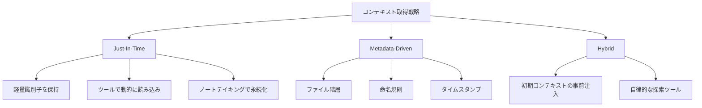
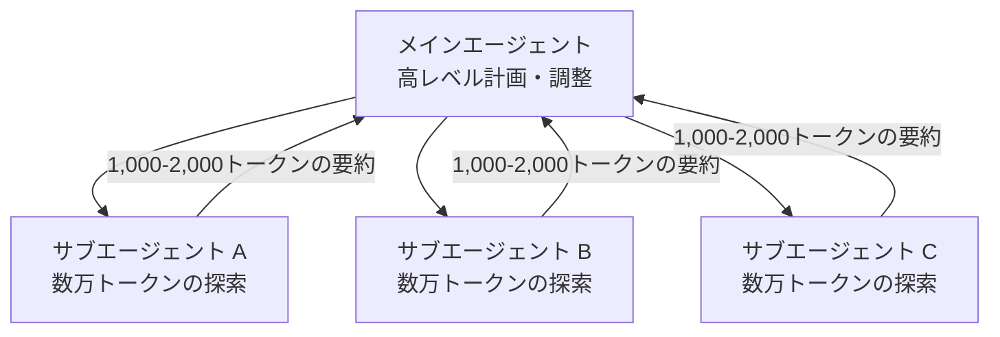

## ブログ概要（Summary）

本記事は [Effective context engineering for AI agents (Anthropic Engineering Blog)](https://www.anthropic.com/engineering/effective-context-engineering-for-ai-agents) の解説記事です。Anthropic Applied AIチームのPrithvi Rajasekaran、Ethan Dixon、Carly Ryan、Jeremy Hadfieldらが2025年9月に公開したこのブログでは、LLMエージェント構築における「コンテキストエンジニアリング」の概念を体系的に整理し、システムプロンプト設計・ツール設計・ランタイムコンテキスト取得・ロングホライズンタスク戦略の4層構造で実践的な設計指針を提示している。公開後約50万ビューを記録し、LLMアプリケーション開発の設計指針として広く参照されている。

この記事は [Zenn記事: LLMロングコンテキスト活用の実装戦略：圧縮・配置・キャッシュの最適解](https://zenn.dev/0h_n0/articles/2f22a86203839b) の深掘りです。

## 情報源

- **種別**: 企業テックブログ
- **URL**: [https://www.anthropic.com/engineering/effective-context-engineering-for-ai-agents](https://www.anthropic.com/engineering/effective-context-engineering-for-ai-agents)
- **組織**: Anthropic Applied AI team
- **著者**: Prithvi Rajasekaran, Ethan Dixon, Carly Ryan, Jeremy Hadfield
- **発表日**: 2025年9月29日

## 技術的背景（Technical Background）

LLMを活用したエージェントシステムの開発では、モデルに何をどのタイミングで伝えるかが成果を左右する。従来のプロンプトエンジニアリングは、個々のプロンプトの文言を最適化する手法として発展してきたが、エージェントのような複数ターンにわたる推論では、1回のプロンプト設計だけでは不十分である。

Anthropicのチームはこの課題に対して、プロンプトエンジニアリングを包含するより広い概念として「コンテキストエンジニアリング」を提唱している。エージェントが複数の推論ターンを経て動作する場合、各ターンでのコンテキスト（システム指示、ツール定義、外部データ、メッセージ履歴）の総体を管理する戦略が必要であり、これが単発のプロンプト最適化とは本質的に異なるアプローチであるとブログでは述べられている。

この考え方は、Zenn記事で取り上げたロングコンテキスト活用戦略（圧縮・配置・キャッシュ）と直接関連する。コンテキストウィンドウを有限リソースとして管理する設計原則は、両記事に共通する基盤的な知見である。

## コンテキストエンジニアリングの定義と原則

### プロンプトエンジニアリングとの比較

Anthropicのチームは、プロンプトエンジニアリングとコンテキストエンジニアリングの違いを以下のように整理している。

| 観点 | プロンプトエンジニアリング | コンテキストエンジニアリング |
|------|--------------------------|---------------------------|
| 定義 | LLM指示の文言を最適化する技法 | LLM推論時に最適なトークン集合をキュレーション・維持する戦略 |
| 対象 | 単一プロンプト | システム指示 + ツール定義 + MCP + 外部データ + メッセージ履歴の総体 |
| 時間軸 | 単発の推論 | 複数ターンにわたる反復的なキュレーション |
| 最適化の単位 | 文言・表現 | トークンの取捨選択と配置 |

### コンテキストロットと注意予算

ブログで特に重要な概念として提示されているのが「コンテキストロット（context rot）」と「注意予算（attention budget）」である。

**コンテキストロット**とは、コンテキストウィンドウのサイズが増加するにつれてモデルの精度が劣化する現象を指す。Transformerアーキテクチャでは$n$トークンに対して$n^2$の対関係を計算する必要があり、コンテキストが長くなるほど各トークンへの注意配分が分散する。

**注意予算**は、この有限性をモデル化した概念である。ブログでは以下のように定式化できる。

$$
\text{Attention Budget} = f(\text{model capacity}, \text{context length})
$$

ここで$f$は単調減少関数であり、コンテキスト長が増加するにつれて各トークンに割り当て可能な注意リソースが減少することを表す。ブログの表現を借りれば、コンテキストは「収穫逓減の有限リソース」であり、人間のワーキングメモリの制約と類似した性質を持つ。

この知見から導かれる設計原則は、「所望の出力の尤度を最大化する、最小の高信号トークン集合を見つけよ」というものである。

## 実装アーキテクチャ（Architecture）

### システムプロンプト設計: 適切な抽象度

Anthropicのチームは、システムプロンプトの設計において「適切な抽象度（Right Altitude）」という原則を提唱している。

- **過度に具体的**: 複雑なロジックをハードコードすると脆弱になり、保守負担が増大する
- **過度に曖昧**: 高レベルのガイダンスだけでは具体的な行動シグナルが不足し、暗黙の前提共有を誤って仮定してしまう

ブログでは「行動を効果的にガイドできるほど具体的であり、かつ強力なヒューリスティクスを提供できるほど柔軟な」プロンプトが理想的であると述べている。

**構造化の手法**として、XMLタグ（`<background_information>`, `<instructions>`）やMarkdownヘッダ（`## Tool guidance`, `## Output description`）による明確なセクション分離が推奨されている。また、「期待される行動を完全に概説する最小限の情報セット」から始め、失敗分析に基づいて指示を追加するイテレーティブなアプローチが示されている。

### ツール設計原則

ブログでは、ツール設計の4原則が明示されている。

1. **トークン効率の高い情報返却**: ツールの出力は必要最小限のトークンで返す
2. **効率的なエージェント行動の促進**: ツールの設計がエージェントの行動パターンを誘導する
3. **自己完結的でエラー耐性のある設計**: 各ツールが独立して動作し、エラーから回復可能である
4. **明確な用途説明**: パラメータ名と説明がモデルにとって理解しやすい

特に、「機能が広すぎるツールセットや、曖昧な判断分岐を生むツールセット」が主要な障害であるとブログは指摘している。基準として、「人間がどのツールを使うべきか明確に判断できない状況では、エージェントもそれ以上の判断はできない」という原則が示されている。

### Few-shot例の活用

網羅的なエッジケース文書化よりも、「期待される行動を効果的に描写する多様で標準的な例」を用いることが推奨されている。ブログでは「例は千の言葉に値する『絵』である」と表現されている。

### ランタイムコンテキスト取得戦略



**Just-In-Time（JIT）コンテキスト**: ファイルパス、クエリ、URLなどの軽量な識別子を保持し、必要な時点でツールを使って動的にデータを読み込む手法である。ブログでは、Claude Codeが大規模データベースの分析を行う際、`head`や`tail`コマンドで必要なデータのみを読み込み、全データをコンテキストにロードしない事例が紹介されている。

**メタデータ駆動の行動調整**: ファイル階層・命名規則・タイムスタンプなどのメタデータがエージェントの行動を暗黙にガイドする。ブログでは「`tests/`フォルダ内の`test_utils.py`と`src/core_logic/`内の同名ファイルでは異なる意味を持つ」という例が示されている。

**ハイブリッド戦略**: 初期コンテキストの事前注入とエージェント裁量での自律探索を組み合わせる。Claude Codeではこの戦略として、CLAUDE.mdファイルの初期注入と、`glob`・`grep`によるJIT検索の併用が実装されている。法務・金融など比較的静的なコンテンツドメインに適しているとブログは述べている。

## ロングホライズンタスク戦略

長時間にわたるタスクでは、トークン数がコンテキストウィンドウを超過する問題が生じる。ブログでは3つの戦略が提示されている。

### 1. Compaction（圧縮）

コンテキスト限界に近づいた会話を要約し、圧縮されたコンテキストで推論を再初期化する手法である。

**実装方針**:
- メッセージ履歴をモデルに渡して圧縮する
- アーキテクチャ上の決定事項、未解決のバグ、実装の詳細を保持する
- 冗長なツール出力やメッセージを破棄する
- 圧縮されたコンテキストに最新アクセスファイルを付加して続行する

ブログでは「複雑なエージェントトレースでプロンプトを慎重にチューニングせよ。まずリコールを最大化して関連情報の取りこぼしを防ぎ、その後精度を改善して不要な内容を排除するイテレーションを行う」と述べている。

**手軽な最適化**: ツール結果のクリアリングが「最も安全で最も手軽な圧縮」として紹介されている。初回のツール呼び出し後、深いメッセージ履歴から生のツール結果を除去する手法である。

```python
from dataclasses import dataclass, field
from typing import Any


@dataclass
class CompactionManager:
    """コンテキスト圧縮を管理するクラス。

    メッセージ履歴を監視し、閾値を超えた場合に
    要約ベースの圧縮を実行する。
    """

    max_tokens: int = 100_000
    compaction_threshold: float = 0.8
    preserved_keys: list[str] = field(
        default_factory=lambda: [
            "architecture_decisions",
            "unresolved_bugs",
            "implementation_details",
        ]
    )

    def should_compact(self, current_tokens: int) -> bool:
        """圧縮が必要かどうかを判定する。"""
        return current_tokens > self.max_tokens * self.compaction_threshold

    def clear_stale_tool_results(
        self, messages: list[dict[str, Any]], keep_recent: int = 3
    ) -> list[dict[str, Any]]:
        """古いツール結果を除去する（最も安全な圧縮手法）。

        Args:
            messages: メッセージ履歴
            keep_recent: 保持する直近のツール結果数

        Returns:
            ツール結果が除去されたメッセージ履歴
        """
        tool_result_indices = [
            i for i, m in enumerate(messages) if m.get("role") == "tool"
        ]
        indices_to_clear = tool_result_indices[:-keep_recent] if len(
            tool_result_indices
        ) > keep_recent else []

        result = []
        for i, msg in enumerate(messages):
            if i in indices_to_clear:
                result.append({
                    "role": "tool",
                    "content": "[Result cleared for context efficiency]",
                    "tool_use_id": msg.get("tool_use_id"),
                })
            else:
                result.append(msg)
        return result
```

### 2. 構造化ノートテイキング（Agentic Memory）

エージェントがコンテキストウィンドウの外部に定期的にノートを永続化し、後の推論段階で取得する手法である。

ブログでは、ClaudeがPokemonをプレイする事例が紹介されている。数千ステップにわたるゲーム進行で「過去1,234ステップでRoute 1でPokemonを訓練し、Pikachuは目標10レベルのうち8レベルを獲得した」という正確な集計を維持し、探索済み地域のマップ、達成済みの実績、戦闘戦略のノートを記録している。

Anthropicはファイルベースのメモリツールを公開ベータとしてリリースしており、エージェントが「セッションを跨いでナレッジベースを構築し、プロジェクト状態を維持する」ことを可能にしている。

### 3. サブエージェントアーキテクチャ

特化型サブエージェントがクリーンなコンテキストウィンドウで集中的なタスクを処理し、メインエージェントが高レベルの計画を調整する手法である。



各サブエージェントは数万トークンを使って広範な探索を行い、通常1,000-2,000トークンの凝縮された要約をメインエージェントに返す。詳細な探索コンテキストは統合分析から隔離されるため、関心の分離が明確に実現される。

### 戦略選択の指針

| 戦略 | 適用場面 | 特徴 |
|------|---------|------|
| Compaction | 長い対話的やり取り | 会話フローの維持に優れる |
| ノートテイキング | マイルストーンが明確な反復開発 | 永続的な状態管理に優れる |
| サブエージェント | 並列探索が有効な複雑な調査 | コンテキスト隔離に優れる |

## Production Deployment Guide

### AWS実装パターン（コスト最適化重視）

Anthropicのコンテキストエンジニアリング戦略に基づくエージェントシステムをAWSにデプロイする場合の推奨構成を示す。コンテキスト管理（圧縮、ノートテイキング、サブエージェント）の各戦略をAWSサービスに対応付ける。

**コスト試算の注意事項**: 以下の料金は2026年8月時点のAWS ap-northeast-1（東京）リージョンの概算値である。実際のコストはトラフィックパターン、リージョン、バースト使用量により変動する。最新料金はAWS料金計算ツールで確認を推奨する。

| 構成 | トラフィック量 | 主要サービス | コンテキスト管理機能 | 月額概算 |
|------|---------------|-------------|---------------------|---------|
| Small | ~100 req/日 | Lambda + Bedrock + DynamoDB | Compaction + ノートテイキング | $50-150 |
| Medium | ~1,000 req/日 | ECS Fargate + Bedrock + ElastiCache | Compaction + ノートテイキング + JIT検索 | $300-800 |
| Large | 10,000+ req/日 | EKS + Karpenter + Spot + SQS | 全戦略 + サブエージェント並列実行 | $2,000-5,000 |

**コスト削減テクニック**: Spot Instances活用で最大90%削減、Reserved Instances 1年コミットで最大72%削減、Bedrock Batch API使用で50%削減、Prompt Caching有効化で30-90%削減。

**コンテキスト管理とAWSサービスの対応**:
- **Compaction**: Lambda関数内でメッセージ履歴をBedrock APIに渡して圧縮。圧縮結果をDynamoDBに保存
- **ノートテイキング**: DynamoDB（Small）またはElastiCache（Medium以上）に構造化ノートを永続化。TTLで自動クリーンアップ
- **JIT検索**: S3 + OpenSearch Serverlessで軽量識別子からのオンデマンドデータ取得
- **サブエージェント**: SQSキューでサブエージェントタスクを分配し、EKS上で並列実行

### Terraformインフラコード

**Small構成（Serverless: Lambda + Bedrock + DynamoDB）**:

```hcl
# Small構成: Lambda + Bedrock + DynamoDB (月額$50-150)
# コンテキスト管理: Compaction + ノートテイキング
terraform {
  required_version = ">= 1.9"
  required_providers {
    aws = { source = "hashicorp/aws", version = "~> 5.60" }
  }
}

provider "aws" { region = "ap-northeast-1" }

# DynamoDB: コンテキスト状態 + エージェントノート保存
resource "aws_dynamodb_table" "context_state" {
  name         = "context-engineering-state"
  billing_mode = "PAY_PER_REQUEST"
  hash_key     = "session_id"
  range_key    = "entry_type"
  attribute { name = "session_id"; type = "S" }
  attribute { name = "entry_type"; type = "S" }
  ttl { attribute_name = "expires_at"; enabled = true }
  server_side_encryption { enabled = true }
}

# IAMロール: 最小権限（Bedrock + DynamoDB + CloudWatch Logsのみ）
resource "aws_iam_role" "lambda_context_agent" {
  name               = "context-engineering-lambda"
  assume_role_policy = jsonencode({
    Version = "2012-10-17"
    Statement = [{ Action = "sts:AssumeRole", Effect = "Allow",
                    Principal = { Service = "lambda.amazonaws.com" } }]
  })
}

resource "aws_iam_role_policy" "lambda_policy" {
  name = "context-engineering-policy"
  role = aws_iam_role.lambda_context_agent.id
  policy = jsonencode({
    Version = "2012-10-17"
    Statement = [
      { Effect = "Allow", Action = ["bedrock:InvokeModel"],
        Resource = "arn:aws:bedrock:ap-northeast-1::foundation-model/anthropic.claude-*" },
      { Effect = "Allow",
        Action = ["dynamodb:GetItem","dynamodb:PutItem","dynamodb:Query","dynamodb:DeleteItem"],
        Resource = aws_dynamodb_table.context_state.arn },
      { Effect = "Allow",
        Action = ["logs:CreateLogGroup","logs:CreateLogStream","logs:PutLogEvents"],
        Resource = "arn:aws:logs:ap-northeast-1:*:*" },
    ]
  })
}

# Lambda: コンテキスト管理 + Compaction（120秒タイムアウト、1024MB）
resource "aws_lambda_function" "context_manager" {
  function_name = "context-engineering-manager"
  runtime       = "python3.12"
  handler       = "handler.lambda_handler"
  role          = aws_iam_role.lambda_context_agent.arn
  timeout       = 120
  memory_size   = 1024
  environment {
    variables = {
      DYNAMODB_TABLE     = aws_dynamodb_table.context_state.name
      MODEL_ID           = "anthropic.claude-sonnet-4-20250514"
      COMPACTION_THRESHOLD = "0.8"
    }
  }
  filename = "lambda_package.zip"
}
```

**Large構成（Container: EKS + Karpenter + Spot + SQS）**:

```hcl
# Large構成: EKS + Karpenter + Spot + SQS (月額$2,000-5,000)
# コンテキスト管理: 全戦略 + サブエージェント並列実行
module "eks" {
  source          = "terraform-aws-modules/eks/aws"
  version         = "~> 20.24"
  cluster_name    = "context-engineering-cluster"
  cluster_version = "1.31"
  vpc_id          = module.vpc.vpc_id
  subnet_ids      = module.vpc.private_subnets
  cluster_endpoint_public_access = false
  eks_managed_node_groups = {
    system = { instance_types = ["m6i.large"], min_size = 2, max_size = 3, desired_size = 2 }
  }
}

# SQS: サブエージェントタスク分配キュー
resource "aws_sqs_queue" "subagent_tasks" {
  name                       = "context-eng-subagent-tasks"
  visibility_timeout_seconds = 300
  message_retention_seconds  = 86400
  redrive_policy = jsonencode({
    deadLetterTargetArn = aws_sqs_queue.subagent_dlq.arn
    maxReceiveCount     = 3
  })
}

resource "aws_sqs_queue" "subagent_dlq" {
  name                      = "context-eng-subagent-dlq"
  message_retention_seconds = 604800
}

# Karpenter NodePool: Spot優先、サブエージェント用
resource "kubectl_manifest" "karpenter_nodepool" {
  yaml_body = yamlencode({
    apiVersion = "karpenter.sh/v1", kind = "NodePool"
    metadata = { name = "subagent-workers" }
    spec = {
      template = { spec = {
        requirements = [
          { key = "karpenter.sh/capacity-type", operator = "In", values = ["spot","on-demand"] },
          { key = "node.kubernetes.io/instance-type", operator = "In",
            values = ["m6i.xlarge","m6a.xlarge","m5.xlarge"] },
        ]
        nodeClassRef = { group = "karpenter.k8s.aws", kind = "EC2NodeClass", name = "default" }
      }}
      limits     = { cpu = "100", memory = "400Gi" }
      disruption = { consolidationPolicy = "WhenEmptyOrUnderutilized", consolidateAfter = "30s" }
    }
  })
}

# AWS Budgets: 月額$5,000でアラート（80%到達時に通知）
resource "aws_budgets_budget" "context_engineering" {
  name = "context-engineering-monthly", budget_type = "COST"
  limit_amount = "5000", limit_unit = "USD", time_unit = "MONTHLY"
  notification {
    comparison_operator = "GREATER_THAN", threshold = 80, threshold_type = "PERCENTAGE"
    notification_type = "ACTUAL", subscriber_email_addresses = ["ops-team@example.com"]
  }
}
```

### 運用・監視設定

**CloudWatch Logs Insights: コンテキスト圧縮効率の監視クエリ**:

```
# コンテキスト圧縮の前後トークン数と圧縮率を監視
fields @timestamp, session_id, tokens_before, tokens_after
| filter event = "compaction_executed"
| stats avg(tokens_before) as avg_before, avg(tokens_after) as avg_after,
  avg(1 - tokens_after/tokens_before) * 100 as avg_compression_pct by bin(1h)
| sort @timestamp desc
| limit 24
```

**CloudWatch Logs Insights: サブエージェント実行レイテンシ分析**:

```
# サブエージェント別のP95/P99レイテンシ
fields @timestamp, subagent_type, duration_ms, output_tokens
| filter event = "subagent_completed"
| stats percentile(duration_ms, 95) as p95, percentile(duration_ms, 99) as p99,
  avg(output_tokens) as avg_summary_tokens by subagent_type
| sort p99 desc
```

**X-Ray トレーシング設定（Python）**:

```python
from aws_xray_sdk.core import xray_recorder, patch_all

patch_all()  # boto3自動計装: Bedrock/DynamoDB/SQS呼び出しを自動追跡


def manage_context(
    session_id: str, strategy: str, messages: list[dict]
) -> dict:
    """コンテキスト管理戦略を実行し、X-Rayでトレースする。"""
    subsegment = xray_recorder.begin_subsegment(f"context-{strategy}")
    subsegment.put_annotation("session_id", session_id)
    subsegment.put_annotation("strategy", strategy)
    subsegment.put_metadata("input_message_count", len(messages))
    try:
        result = _execute_strategy(strategy, messages)
        subsegment.put_metadata("output_tokens", result.get("token_count", 0))
        return result
    except Exception as e:
        subsegment.add_exception(e, stack=True)
        raise
    finally:
        xray_recorder.end_subsegment()
```

**Cost Explorer自動レポート（Python）**:

```python
import boto3
from datetime import datetime, timedelta


def get_daily_cost_report() -> dict[str, float]:
    """日次コストレポートをサービス別に取得し、$100/日超過でアラートする。"""
    ce = boto3.client("ce", region_name="ap-northeast-1")
    yesterday = (datetime.now() - timedelta(days=1)).strftime("%Y-%m-%d")
    today = datetime.now().strftime("%Y-%m-%d")
    response = ce.get_cost_and_usage(
        TimePeriod={"Start": yesterday, "End": today},
        Granularity="DAILY",
        Metrics=["UnblendedCost"],
        Filter={"Tags": {"Key": "Service", "Values": ["context-engineering"]}},
        GroupBy=[{"Type": "DIMENSION", "Key": "SERVICE"}],
    )
    costs = {
        g["Keys"][0]: float(g["Metrics"]["UnblendedCost"]["Amount"])
        for g in response["ResultsByTime"][0]["Groups"]
    }
    if sum(costs.values()) > 100.0:
        print(f"ALERT: Daily cost ${sum(costs.values()):.2f} exceeds $100")
    return costs
```

### コスト最適化チェックリスト

**アーキテクチャ選択**:
- [ ] トラフィック量に応じた構成を選択（~100 req/日: Serverless, ~1,000 req/日: Hybrid, 10,000+ req/日: Container）
- [ ] Compactionのみの軽量エージェントはLambdaで処理し、サブエージェント並列実行が必要な場合のみコンテナ化

**リソース最適化**:
- [ ] EC2 Spot Instances優先（Karpenter設定）
- [ ] Reserved Instances 1年コミット（常時稼働分）
- [ ] Savings Plans適用（Fargate, Lambda）
- [ ] Lambdaメモリ最適化（Power Tuning Tool）
- [ ] ECS/EKSアイドル時スケールダウン

**LLMコスト削減**:
- [ ] Bedrock Batch API（非リアルタイムで50%削減）
- [ ] Prompt Caching（同一システムプロンプトで30-90%削減）
- [ ] Compactionによるトークン数削減（圧縮率50-80%を目標）
- [ ] max_tokensでトークン数制限
- [ ] ツール結果クリアリングで不要トークン除去

**監視・アラート**:
- [ ] AWS Budgets月額上限
- [ ] CloudWatch Bedrockトークン量アラーム
- [ ] コンテキスト圧縮率の監視（低下時にアラート）
- [ ] Cost Anomaly Detection
- [ ] 日次コストレポート（SNS + Lambda）

**リソース管理**:
- [ ] 未使用リソース削除
- [ ] タグ戦略統一（Environment, Service, Owner）
- [ ] DynamoDB TTL自動削除（ノートテイキングデータの有効期限管理）
- [ ] CloudWatch Logs保持期間30日
- [ ] SQS Dead Letter Queue監視

## パフォーマンス最適化（Performance）

コンテキストエンジニアリングの各戦略におけるパフォーマンス特性を整理する。

**Compaction**: 圧縮処理自体に1回のLLM呼び出しが必要であり、レイテンシのオーバーヘッドが生じる。しかし、圧縮後の推論ではコンテキスト長の短縮により応答速度が改善される。圧縮閾値のチューニングがトレードオフの鍵である。

**ツール結果クリアリング**: ブログで「最も安全で最も手軽な圧縮」と評価されている。LLM呼び出しが不要でレイテンシへの影響がほぼゼロであるため、全構成で最初に適用すべき最適化である。

**サブエージェント**: 並列実行によりレイテンシの短縮が可能だが、サブエージェントの起動オーバーヘッドとコンテキスト初期化コストが加算される。SQSによるタスク分配とEKS上の並列処理でスループットを確保する。

**JIT検索**: 事前にすべてのデータをコンテキストにロードする方式と比較して、初回アクセス時のレイテンシが増加する。ただし、不要なデータによるコンテキストロットを防止するため、長時間タスクでは総合的なパフォーマンスが向上する。

## 運用での学び（Production Lessons）

### コンテキスト設計のイテレーティブアプローチ

ブログが強調する実践的な教訓として、「最善のモデルで最小限のプロンプトから始め、失敗分析に基づいて指示を追加する」というイテレーティブなアプローチがある。過剰な指示を最初から投入するのではなく、実際のエージェント動作を観察して段階的に改善する方法論は、ソフトウェア開発のアジャイルプラクティスと共通する設計思想である。

### ツール設計への投資優先

Anthropicのチームは、SWE-bench向けエージェント構築においてプロンプト全体よりもツールの最適化に多くの時間を費やしたと述べている。この教訓は、エージェント開発においてはシステムプロンプトの文言調整よりも、ツールのインターフェース設計に投資すべきことを示唆している。ポカヨケの原則（パラメータ設計でミスを構造的に防止する）がLLMエージェント開発にも適用可能であり、HCI（Human-Computer Interface）と同等の設計投資がACI（Agent-Computer Interface）にも必要であるとブログは述べている。

### Compactionプロンプトのチューニング

圧縮プロンプトの設計は、リコール（必要な情報の取りこぼし防止）と精度（不要な情報の排除）のトレードオフである。ブログでは「まずリコール最大化から始め、その後精度改善をイテレーションする」順序が推奨されている。アーキテクチャ上の決定事項や未解決バグの保持は、圧縮において最も優先度が高い情報カテゴリである。

## 学術研究との関連（Academic Connection）

Anthropicのコンテキストエンジニアリングは、以下の学術研究と関連がある。

- **Lost in the Middle** (Liu et al., 2024): コンテキスト中の情報位置が検索精度に影響するという発見。コンテキストロットの概念と直接関連し、Zenn記事で扱った「情報配置戦略」の学術的根拠の一つである
- **Efficient Transformers Survey** (Tay et al., 2022): Transformerの$O(n^2)$計算量問題に対する効率化手法の体系的サーベイ。注意予算の概念の学術的背景として位置づけられる
- **MemGPT** (Packer et al., 2024): OSの仮想メモリに着想を得たLLMメモリ管理手法。構造化ノートテイキング戦略と類似のアプローチで、コンテキストウィンドウの外部にメモリ階層を構築する

## まとめと実践への示唆

Anthropicのブログが提示する中心的な設計原則は明確である。「所望の出力の尤度を最大化する、最小の高信号トークン集合を見つけよ」。この原則は、システムプロンプト設計（適切な抽象度）、ツール設計（最小限のツールセット）、ランタイム取得（JITコンテキスト）、ロングホライズン戦略（Compaction、ノートテイキング、サブエージェント）のすべてに通底する。コンテキストを有限リソースとして管理し、リコールと精度のバランスをイテレーティブに改善するアプローチが、エージェント開発における実践的な出発点となる。

## 参考文献

- **Blog URL**: [Effective context engineering for AI agents - Anthropic](https://www.anthropic.com/engineering/effective-context-engineering-for-ai-agents)
- **Related Papers**:
  - Liu, N. F. et al. (2024). "Lost in the Middle: How Language Models Use Long Contexts." [arXiv:2307.03172](https://arxiv.org/abs/2307.03172)
  - Tay, Y. et al. (2022). "Efficient Transformers: A Survey." [arXiv:2009.06732](https://arxiv.org/abs/2009.06732)
  - Packer, C. et al. (2024). "MemGPT: Towards LLMs as Operating Systems." [arXiv:2310.08560](https://arxiv.org/abs/2310.08560)
- **Related Zenn article**: [LLMロングコンテキスト活用の実装戦略：圧縮・配置・キャッシュの最適解](https://zenn.dev/0h_n0/articles/2f22a86203839b)
