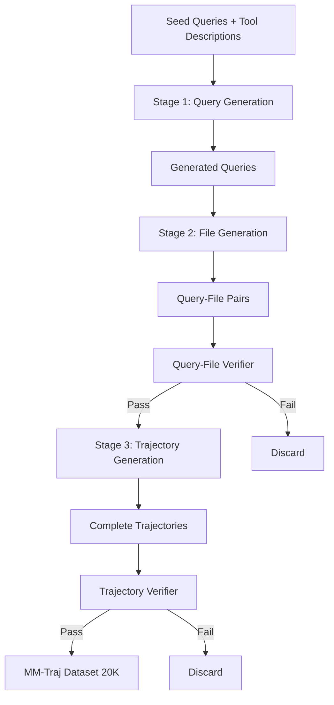

本記事は [Multi-modal Agent Tuning: Building a VLM-Driven Agent for Efficient Tool Usage](https://arxiv.org/abs/2412.15606)（Gao et al., ICLR 2025）の解説記事です。

## 論文概要（Abstract）

大規模言語モデル（LLM）の発展に伴い、外部ツールを呼び出すコントローラーとしてマルチモーダルエージェントを構築する研究が注目を集めている。本論文では、Vision-Language Model（VLM）をコントローラーとしてファインチューニングし、ツール使用推論を強化する手法を提案している。GPT-4o miniを用いて合成データを生成し、品質検証を経てMM-Trajデータセット（20,000タスク）を構築。このデータセットでVLMを訓練したT3-Agentは、GTAおよびGAIAベンチマークにおいて未訓練VLMに対して約20%の精度向上を達成したと著者らは報告している。

この記事は [Zenn記事: Gemini 2.5のマルチモーダル入力理解を活用した実践パターン4選](https://zenn.dev/0h_n0/articles/d1e65e3e69c087) の深掘りです。

## 情報源

- **会議名**: ICLR 2025（The 13th International Conference on Learning Representations）
- **年**: 2025
- **URL**: [https://arxiv.org/abs/2412.15606](https://arxiv.org/abs/2412.15606)
- **著者**: Zhi Gao, Bofei Zhang, Pengxiang Li, Xiaojian Ma, Tao Yuan et al.
- **発表形式**: Poster（ICLR 2025 Poster Session）
- **arXiv初版**: 2024年12月20日、v2: 2025年2月3日

## カンファレンス情報

**ICLRについて**: ICLR（International Conference on Learning Representations）は、表現学習・深層学習分野のトップカンファレンスの1つである。2025年のICLRはシンガポールで開催され、機械学習コミュニティにおいて高い影響力を持つ。本論文はPosterとして採択されており、VLMをエージェントコントローラーとして活用する手法の実用性が評価されたと考えられる。

## 背景と動機

### 従来手法の課題

LLMベースのエージェントは、ReActフレームワークに代表されるように、思考（Thought）と行動（Action）を反復しながら外部ツールを呼び出すアーキテクチャが確立されている。しかし、従来の研究には以下の課題が存在していた。

**テキスト限定のツール使用**: Toolformer（Schick et al., 2024）やGorilla（Patil et al., 2023）といった先行研究は、テキスト入力からのツール呼び出しに限定されていた。画像や動画などのマルチモーダル入力を受け取り、適切なツールを推論・実行するエージェントの訓練データは不足していた。

**クローズドソースモデルへの依存**: GTA（Wang et al., 2024b）やGAIA（Mialon et al., 2023）といったベンチマークでは、GPT-4oやGPT-4-turboのようなクローズドソースモデルが高い性能を示す一方、MiniCPM-VやQwen2-VLなどのオープンソースVLMはツール使用タスクで大幅に劣っていた。

**訓練データの欠如**: マルチモーダルなツール使用軌跡（trajectory）を含む高品質なデータセットが存在しなかった。人手でのデータ作成はコストが高く、スケーラビリティに欠ける。

### 本研究の位置づけ

著者らは、自動データ合成パイプラインを構築してMM-Trajデータセットを作成し、オープンソースVLMをファインチューニングすることで、上記の課題を同時に解決するアプローチを提案している。この研究は、Zenn記事で紹介されている「マルチモーダルFunction Calling」パターンの学術的基盤にあたる。画像入力からツール選択、実行までのエージェントループを、VLMの学習によって強化する手法を体系的に示した点に意義がある。

## 主要な貢献（Key Contributions）

- **MM-Trajデータセット**: 20,000タスクのマルチモーダルツール使用軌跡を含む合成データセット。9種類以上のファイル形式、16の知識ドメインをカバーする
- **T3-Agent**: Trajectory Tuning on VLMs for Tool usageにより、オープンソースVLMのツール使用能力を体系的に向上させるフレームワーク
- **Multi-stage Data Synthesis Pipeline**: クエリ生成、ファイル生成、軌跡生成の3段階パイプラインに、2種類の検証器（Query-File Verifier、Trajectory Verifier）を組み合わせたデータ品質保証機構

## 技術的詳細（Technical Details）

### エージェントアーキテクチャ

T3-AgentはReActフレームワークを基盤とし、各反復ステップ$i$において以下の最適化を行う。

$$
t_i^*, c_i^* = \arg\max P(t_i, c_i \mid F_{\text{opt}}, T, Q, h_i)
$$

ここで、
- $t_i$: ステップ$i$における思考（Thought）
- $c_i$: ステップ$i$における実行可能コード（Action）
- $F_{\text{opt}}$: オプションのマルチモーダルファイル（画像、PDF等）
- $T$: 利用可能なツールの記述
- $Q$: ユーザーからのクエリ
- $h_i$: 過去のステップの履歴 $\{(t_1, c_1, o_1), \ldots, (t_{i-1}, c_{i-1}, o_{i-1})\}$
- $o_i$: ツール実行の観測結果（Observation）

VLMがコントローラーとして、入力されたマルチモーダルファイルとクエリから適切なツールを推論し、Pythonコードとして実行命令を生成する。各ステップの出力（思考・コード・観測結果）は次のステップの入力に反映され、逐次的にタスクを解決する。

### Multi-stage Data Synthesis Pipeline

データ合成パイプラインは3段階で構成されている。



**Stage 1: クエリ生成**

GPT-4o miniに対して、シードクエリとツール記述をコンテキストとして与え、多様で実用的なクエリを生成させる。生成されたクエリは、複数のツールを組み合わせて解決する必要がある複合タスクとなるよう設計されている。

**Stage 2: ファイル生成**

画像ファイルについては、ChartQA、COCO、LLaVA、SAM、TextVQA、Web-Celebrity、Web-Landmark、WikiArtの8つのデータセットから収集した約93,000枚の画像キャプションペアを使用する。BGE埋め込みモデルを用いてクエリと意味的に類似した画像を検索・選択する。PDF、DOCX、XLSX、PPTXなどのファイルについては、GPT-4o miniがPythonコードを生成してファイルを作成する。

**Stage 3: 軌跡生成**

GPT-4o miniをゼロショットエージェントとして動作させ、生成されたクエリとファイルに対してタスクを解決させる。このプロセスで思考（$t_i$）、実行コード（$c_i$）、ツール観測結果（$o_i$）、最終回答（$A$）を収集する。

### 品質検証メカニズム

**Query-File Verifier**は以下の基準でクエリとファイルの整合性を評価する。

- クエリに対するファイルのシナリオ関連性
- タスク完了に必要な情報がファイルに含まれているか
- 利用可能なツールでタスクが解決可能か

**Trajectory Verifier**は軌跡の品質を以下の基準で検証する。

- ツール選択が目的に合致しているか
- ツール引数の正確性
- 観測結果からの回答要約の正確性
- 画像コンテンツとの整合性

初期生成の23,500データポイントから、2段階の検証を経て20,000データポイントが保持される。人手評価では、検証通過データのタスクスコアが8.32/10、軌跡スコアが8.67/10であるのに対し、検証不合格データはそれぞれ6.36/10、6.38/10であり、検証器の有効性が確認されている（論文Table 4より）。

### 訓練設定

VLMの訓練では、ビジョンエンコーダと視覚トークン圧縮器を凍結し、言語モデル部分のみをLoRAでファインチューニングする。

訓練損失関数は以下の交差エントロピー損失である。

$$
\min \mathbb{E}_{(F_{\text{opt}}, Q, T, C, O, A) \sim \mathcal{D}} \left[ -\sum_{i=1}^{n} \log P(t_i, c_i \mid F_{\text{opt}}, T, Q, h_i) \right]
$$

ここで$\mathcal{D}$はMM-Trajデータセット、$n$は軌跡の長さを表す。

**LoRA設定**:
- **ランク**: 64
- **適用箇所**: Self-Attentionのquery、key、value射影行列
- **エポック数**: 5
- **オプティマイザ**: AdamW（コサインアニーリング）
- **学習率**: 1e-6
- **バッチサイズ**: 2
- **コンテキストウィンドウ**: 10,240トークン

視覚能力と推論能力の劣化を防ぐため、MM-TrajにCauldronデータセット（視覚能力保持）とOpen-LLaVA-NeXT（推論能力保持）を混合して訓練を行う。

### ツールカテゴリ

T3-Agentが使用するツールは以下の9カテゴリに分類されている。

| カテゴリ | 具体的ツール |
|---------|------------|
| Web検索 | 情報検索、ページ閲覧、QA |
| 視覚認識 | 画像QA、セグメンテーション、物体位置特定、顔検出 |
| 画像操作 | 生成（Stable Diffusion）、編集（InstructPix2Pix） |
| 文書分析 | ファイル検査（PDF, DOCX, XLSX, PPTXの変換・解析） |
| プログラミング | Pythonパッケージ（pandas, numpy, matplotlib, OpenCV, scikit-learn等） |

## 実装のポイント

### エージェントループの実装パターン

T3-Agentのエージェントループは、Zenn記事で紹介されているGeminiのマルチモーダルFunction Callingパターンと構造的に対応している。以下はReActフレームワークに基づくエージェントループの擬似実装である。

```python
from dataclasses import dataclass
from typing import Any


@dataclass
class AgentStep:
    """エージェントの1ステップを表現するデータクラス"""
    thought: str
    code: str
    observation: str


def run_agent_loop(
    vlm_controller: Any,
    query: str,
    files: list[str],
    tools: dict[str, callable],
    max_steps: int = 8,
) -> str:
    """ReActフレームワークに基づくエージェントループ

    Args:
        vlm_controller: VLMコントローラー（MiniCPM-V or Qwen2-VL）
        query: ユーザークエリ
        files: マルチモーダルファイルのパスリスト
        tools: 利用可能なツール辞書
        max_steps: 最大ステップ数

    Returns:
        最終回答文字列
    """
    history: list[AgentStep] = []

    for step_idx in range(max_steps):
        # VLMが思考と実行コードを生成
        thought, code = vlm_controller.generate(
            query=query,
            files=files,
            tools=list(tools.keys()),
            history=history,
        )

        # 終了判定
        if "FINAL_ANSWER" in code:
            return extract_answer(code)

        # ツール実行と観測結果の取得
        observation = execute_code(code, tools)

        # 履歴に追加
        history.append(AgentStep(
            thought=thought,
            code=code,
            observation=observation,
        ))

    return "max_steps reached without answer"
```

### LoRAファインチューニングの実装

訓練時の注意点として、著者らは以下を報告している。

- **コンテキストウィンドウの設計**: 10,240トークンのコンテキストウィンドウは、複数ステップの軌跡を格納するために必要。GTAベンチマークでは大半のタスクが2-6ステップで完了するが、一部は7-8ステップに達する
- **データ混合比率**: MM-Trajのみで訓練すると視覚能力が劣化する。Cauldronデータセットの混合が視覚認識精度の維持に寄与する
- **メモリ使用量**: 20Kサンプルの訓練で約214GBのメモリを使用。6K、12Kサンプルでもメモリ使用量は同一であり、訓練時間のみがリニアにスケールする

### 画像モダリティの重要性

論文Table 8のアブレーション結果によると、画像を除外した場合のGTAベンチマーク精度は10.67%に低下する。画像ありの場合は52.56%であり、マルチモーダル入力が性能に約40ポイントの差をもたらす。この結果は、テキストのみのツール使用訓練では不十分であることを実証している。

## Production Deployment Guide

本論文の手法をプロダクション環境で活用する場合、VLMをエージェントコントローラーとして外部ツールを呼び出すアーキテクチャを構築する必要がある。以下にAWS上での実装パターンを示す。

### AWS実装パターン（コスト最適化重視）

T3-Agentのようなマルチモーダルエージェントをプロダクション環境で運用する場合、VLM推論とツール実行の2つのワークロードを考慮する必要がある。

**注意**: 以下のコスト試算は2026年8月時点のAWS ap-northeast-1（東京）リージョン料金に基づく概算値である。実際のコストはトラフィックパターン、リージョン、バースト使用量により変動する。最新料金はAWS料金計算ツールで確認を推奨する。

| 構成 | トラフィック | 推奨アーキテクチャ | 月額概算 |
|------|------------|------------------|---------|
| Small | ~100 req/日 | Lambda + Bedrock + DynamoDB | $50-150 |
| Medium | ~1,000 req/日 | ECS Fargate + Bedrock + ElastiCache | $300-800 |
| Large | 10,000+ req/日 | EKS + Spot GPU Instances + SageMaker Endpoint | $2,000-5,000 |

**Small構成（~100 req/日）**: Lambda関数でリクエストを受け付け、Amazon Bedrockを通じてClaude等のマルチモーダルLLMを呼び出す。ツール実行結果はDynamoDBに保存。月額$50-150程度で運用可能。

**Medium構成（~1,000 req/日）**: ECS Fargateでエージェントオーケストレーターをコンテナとして稼働。Bedrock呼び出しの結果をElastiCacheでキャッシュし、重複クエリのコストを削減。月額$300-800程度。

**Large構成（10,000+ req/日）**: EKSクラスタ上でSpot GPU Instances（g5.xlarge等）を活用し、オープンソースVLM（Qwen2-VL-7B等）を自前でホスティング。SageMaker Endpointによる推論サービング。Karpenterで自動スケーリング。月額$2,000-5,000程度。

**コスト削減テクニック**:
- Spot Instancesの活用でGPUインスタンスコストを最大90%削減
- Reserved Instances（1年コミット）で最大72%削減
- Bedrock Batch APIの使用でリアルタイム性が不要なタスクのコストを50%削減
- Prompt Cachingの有効化で繰り返しツール記述の入力コストを30-90%削減

### Terraformインフラコード

**Small構成（Serverless）**:

```hcl
# small_agent_infra.tf
# VLMエージェント - Serverless構成（Lambda + Bedrock + DynamoDB）

provider "aws" {
  region = "ap-northeast-1"
}

# --- IAM Role（最小権限原則） ---
resource "aws_iam_role" "agent_lambda_role" {
  name = "vlm-agent-lambda-role"
  assume_role_policy = jsonencode({
    Version = "2012-10-17"
    Statement = [{
      Action = "sts:AssumeRole"
      Effect = "Allow"
      Principal = { Service = "lambda.amazonaws.com" }
    }]
  })
}

resource "aws_iam_role_policy" "agent_lambda_policy" {
  name = "vlm-agent-lambda-policy"
  role = aws_iam_role.agent_lambda_role.id
  policy = jsonencode({
    Version = "2012-10-17"
    Statement = [
      {
        Effect   = "Allow"
        Action   = ["bedrock:InvokeModel", "bedrock:InvokeModelWithResponseStream"]
        Resource = "arn:aws:bedrock:ap-northeast-1::foundation-model/*"
      },
      {
        Effect   = "Allow"
        Action   = ["dynamodb:PutItem", "dynamodb:GetItem", "dynamodb:Query"]
        Resource = aws_dynamodb_table.agent_history.arn
      },
      {
        Effect = "Allow"
        Action = [
          "logs:CreateLogGroup", "logs:CreateLogStream", "logs:PutLogEvents"
        ]
        Resource = "arn:aws:logs:ap-northeast-1:*:*"
      }
    ]
  })
}

# --- DynamoDB（エージェント履歴保存） ---
resource "aws_dynamodb_table" "agent_history" {
  name         = "vlm-agent-history"
  billing_mode = "PAY_PER_REQUEST" # コスト最適化: On-Demand
  hash_key     = "session_id"
  range_key    = "step_index"

  attribute {
    name = "session_id"
    type = "S"
  }
  attribute {
    name = "step_index"
    type = "N"
  }

  server_side_encryption {
    enabled = true # KMS暗号化
  }

  point_in_time_recovery {
    enabled = true
  }
}

# --- Lambda関数 ---
resource "aws_lambda_function" "agent_handler" {
  function_name = "vlm-agent-handler"
  role          = aws_iam_role.agent_lambda_role.arn
  handler       = "agent_handler.lambda_handler"
  runtime       = "python3.12"
  timeout       = 900 # エージェントループは最大15分
  memory_size   = 1024

  filename         = "lambda_package.zip"
  source_code_hash = filebase64sha256("lambda_package.zip")

  environment {
    variables = {
      AGENT_MAX_STEPS  = "8"
      BEDROCK_MODEL_ID = "anthropic.claude-sonnet-4-20250514"
      DYNAMODB_TABLE   = aws_dynamodb_table.agent_history.name
    }
  }

  tracing_config {
    mode = "Active" # X-Ray有効化
  }
}

# --- CloudWatchアラーム ---
resource "aws_cloudwatch_metric_alarm" "agent_errors" {
  alarm_name          = "vlm-agent-error-rate"
  comparison_operator = "GreaterThanThreshold"
  evaluation_periods  = 2
  metric_name         = "Errors"
  namespace           = "AWS/Lambda"
  period              = 300
  statistic           = "Sum"
  threshold           = 5
  alarm_description   = "Agent Lambda error rate exceeded"

  dimensions = {
    FunctionName = aws_lambda_function.agent_handler.function_name
  }
}
```

**Large構成（Container）**:

```hcl
# large_agent_infra.tf
# VLMエージェント - Container構成（EKS + Karpenter + Spot GPU）

module "eks" {
  source          = "terraform-aws-modules/eks/aws"
  version         = "~> 20.0"
  cluster_name    = "vlm-agent-cluster"
  cluster_version = "1.31"

  vpc_id     = module.vpc.vpc_id
  subnet_ids = module.vpc.private_subnets

  cluster_endpoint_public_access = false # セキュリティ: プライベートのみ
}

# --- Karpenter Provisioner（Spot GPU優先） ---
resource "kubectl_manifest" "karpenter_nodepool" {
  yaml_body = yamlencode({
    apiVersion = "karpenter.sh/v1"
    kind       = "NodePool"
    metadata   = { name = "gpu-spot-pool" }
    spec = {
      template = {
        spec = {
          requirements = [
            { key = "karpenter.sh/capacity-type", operator = "In", values = ["spot", "on-demand"] },
            { key = "node.kubernetes.io/instance-type", operator = "In", values = ["g5.xlarge", "g5.2xlarge"] },
          ]
          nodeClassRef = { name = "default" }
        }
      }
      limits   = { cpu = "128", memory = "512Gi" }
      disruption = {
        consolidationPolicy = "WhenEmptyOrUnderutilized"
        consolidateAfter    = "30s"
      }
    }
  })
}

# --- Secrets Manager（モデル設定） ---
resource "aws_secretsmanager_secret" "model_config" {
  name        = "vlm-agent/model-config"
  description = "VLM agent model configuration"
}

# --- AWS Budgets（コストアラート） ---
resource "aws_budgets_budget" "agent_budget" {
  name         = "vlm-agent-monthly"
  budget_type  = "COST"
  limit_amount = "5000"
  limit_unit   = "USD"
  time_unit    = "MONTHLY"

  notification {
    comparison_operator       = "GREATER_THAN"
    threshold                 = 80
    threshold_type            = "PERCENTAGE"
    notification_type         = "ACTUAL"
    subscriber_email_addresses = ["ops-team@example.com"]
  }
}
```

### 運用・監視設定

**CloudWatch Logs Insights クエリ**（コスト異常検知）:

```
fields @timestamp, @message
| filter @message like /bedrock/
| stats sum(input_tokens) as total_input, sum(output_tokens) as total_output by bin(1h)
| sort @timestamp desc
| limit 24
```

**CloudWatch Logs Insights クエリ**（レイテンシ分析）:

```
fields @timestamp, duration_ms
| filter event = "agent_step_complete"
| stats avg(duration_ms) as avg_latency,
        percentile(duration_ms, 95) as p95,
        percentile(duration_ms, 99) as p99
  by bin(1h)
```

**CloudWatchアラーム設定（Python）**:

```python
import boto3

cloudwatch = boto3.client("cloudwatch", region_name="ap-northeast-1")

def create_token_usage_alarm(function_name: str, threshold: int = 100000) -> None:
    """Bedrockトークン使用量スパイク検知アラーム"""
    cloudwatch.put_metric_alarm(
        AlarmName=f"vlm-agent-token-spike-{function_name}",
        MetricName="InputTokenCount",
        Namespace="AWS/Bedrock",
        Statistic="Sum",
        Period=3600,
        EvaluationPeriods=1,
        Threshold=threshold,
        ComparisonOperator="GreaterThanThreshold",
        AlarmActions=["arn:aws:sns:ap-northeast-1:123456789:ops-alerts"],
    )
```

**X-Rayトレーシング設定（Python）**:

```python
from aws_xray_sdk.core import xray_recorder, patch_all

# boto3自動計装
patch_all()

@xray_recorder.capture("agent_loop")
def run_agent_with_tracing(query: str, files: list[str]) -> str:
    """X-Rayトレーシング付きエージェントループ"""
    subsegment = xray_recorder.current_subsegment()
    subsegment.put_annotation("query_length", len(query))
    subsegment.put_annotation("file_count", len(files))

    result = run_agent_loop(query=query, files=files)

    subsegment.put_metadata("result_length", len(result))
    return result
```

**Cost Explorer自動レポート（Python）**:

```python
import boto3
from datetime import datetime, timedelta

ce = boto3.client("ce", region_name="ap-northeast-1")
sns = boto3.client("sns", region_name="ap-northeast-1")

def daily_cost_report(sns_topic_arn: str, threshold: float = 100.0) -> None:
    """日次コストレポート取得。$100/日超過でSNS通知"""
    today = datetime.utcnow().strftime("%Y-%m-%d")
    yesterday = (datetime.utcnow() - timedelta(days=1)).strftime("%Y-%m-%d")

    response = ce.get_cost_and_usage(
        TimePeriod={"Start": yesterday, "End": today},
        Granularity="DAILY",
        Metrics=["UnblendedCost"],
        Filter={
            "Tags": {
                "Key": "Project",
                "Values": ["vlm-agent"],
            }
        },
        GroupBy=[{"Type": "DIMENSION", "Key": "SERVICE"}],
    )

    total = sum(
        float(g["Metrics"]["UnblendedCost"]["Amount"])
        for g in response["ResultsByTime"][0]["Groups"]
    )

    if total > threshold:
        sns.publish(
            TopicArn=sns_topic_arn,
            Subject=f"VLM Agent Cost Alert: ${total:.2f}/day",
            Message=f"Daily cost exceeded ${threshold}: ${total:.2f}",
        )
```

### コスト最適化チェックリスト

**アーキテクチャ選択**:
- [ ] トラフィック量に応じた構成選択（~100 req/日: Serverless、~1,000 req/日: Hybrid、10,000+ req/日: Container）
- [ ] VLM推論をBedrock APIで行うかセルフホスティングするかの判断

**リソース最適化**:
- [ ] EC2 GPUインスタンス: Spot Instances優先（g5.xlarge: 最大90%削減）
- [ ] Reserved Instances: 1年コミットで最大72%削減
- [ ] Savings Plans: Compute Savings Plansの検討
- [ ] Lambda: メモリサイズ最適化（1024MB推奨、Power Tuningで調整）
- [ ] ECS/EKS: Karpenterによるアイドル時自動スケールダウン

**LLMコスト削減**:
- [ ] Bedrock Batch API: 非リアルタイムタスクで50%削減
- [ ] Prompt Caching: ツール記述部分のキャッシュで30-90%削減
- [ ] モデル選択ロジック: 簡単なタスクはHaikuクラス、複雑なタスクはSonnetクラスを動的に切り替え
- [ ] トークン数制限: 最大出力トークンの制限とストリーミングによる早期停止

**監視・アラート**:
- [ ] AWS Budgets: 月額予算設定と80%/100%閾値アラート
- [ ] CloudWatch: Lambda実行時間・エラー率アラーム
- [ ] Cost Anomaly Detection: 自動異常検知の有効化
- [ ] 日次コストレポート: SNS通知による日次モニタリング

**リソース管理**:
- [ ] 未使用リソース削除: 定期的なStopped Instancesの確認
- [ ] タグ戦略: `Project=vlm-agent`タグの徹底
- [ ] ライフサイクルポリシー: S3/ECRイメージの自動削除
- [ ] 開発環境: 夜間・週末の自動停止スケジュール
- [ ] CloudTrail: API呼び出し監査の有効化

## 実験結果

### GTAベンチマーク

GTAベンチマークは229タスク・252画像で構成され、2-8ステップのツール使用を評価する。論文Table 2より、主要な結果を以下に示す。

| 手法 | コントローラー | AnsAcc | ToolAcc | CodeExec |
|------|-------------|--------|---------|----------|
| T3-Agent | MiniCPM-V-8.5B | 52.56% | 65.85% | 80.49% |
| T3-Agent | Qwen2-VL-7B | **53.85%** | 64.63% | **84.32%** |
| HF Agent | MiniCPM-V-8.5B | 33.97% | 36.59% | 56.10% |
| HF Agent | Qwen2-VL-7B | 42.31% | 44.85% | 65.19% |
| HF Agent | GPT-4o mini | 57.69% | 56.10% | 100.00% |
| Lego Agent | GPT-4o | 41.52% | -- | -- |

著者らによると、T3-AgentはMiniCPM-V-8.5Bにおいて未訓練時と比較してAnsAccで約18ポイント、ToolAccで約29ポイント、CodeExecで約24ポイントの改善を達成している。Qwen2-VL-7BのT3-Agentは、AnsAccでGPT-4o miniのHF Agentに迫る53.85%を記録しており、7Bパラメータのオープンソースモデルでもクローズドソースモデルに近い性能が得られることが示されている。

### GAIAベンチマーク

GAIAベンチマークは446タスク・109ファイルで構成され、3段階の難易度で評価する。論文Table 3より、Validation Setの結果を以下に示す。

| 手法 | コントローラー | Overall | Level 1 | Level 2 | Level 3 |
|------|-------------|---------|---------|---------|---------|
| T3-Agent | MiniCPM-V-8.5B | 15.15% | 26.42% | 11.63% | 3.84% |
| T3-Agent | Qwen2-VL-7B | 16.97% | 26.42% | 15.12% | 3.84% |
| HF Agent | Qwen2-VL-7B | 9.70% | 16.98% | 8.14% | 0.00% |
| Sibyl Agent | GPT-4-turbo | 29.70% | 43.40% | 27.90% | 7.70% |
| HF Agent | GPT-4o | 33.40% | 47.17% | 31.40% | 11.54% |

GAIAベンチマークでは、T3-Agentが未訓練のHF Agent（Qwen2-VL-7B）に対してOverallで約7ポイントの改善を示している。ただし、GPT-4oやGPT-4-turboとの間には依然として大きな差があり、著者らはクローズドソースモデルのスケールと訓練データの優位性が影響していると分析している。

### アブレーション結果

論文Table 5より、検証器の有効性を示す。MiniCPM-V-8.5Bでの結果を以下に示す。

| 設定 | GTA AnsAcc | GAIA Overall |
|------|-----------|-------------|
| 検証器なし | 50.00% | 13.33% |
| 検証器あり | 52.56% | 15.15% |

データセットスケーリングについて、論文Table 9より以下の傾向が報告されている。

| サンプル数 | GTA AnsAcc | メモリ使用量 |
|-----------|-----------|------------|
| 6K | 43.59% | 214GB |
| 12K | 48.08% | 214GB |
| 20K | 52.56% | 214GB |

データ量の増加に伴い精度が単調に向上しており、20K以上のスケーリングでさらなる改善が期待される。メモリ使用量は一定であり、訓練時間のみがリニアにスケールする。

## 実運用への応用

### Zenn記事との接続

本論文の手法は、Zenn記事「Gemini 2.5のマルチモーダル入力理解を活用した実践パターン4選」のパターン4「マルチモーダルFunction Calling」の学術的基盤にあたる。Zenn記事では、Gemini 2.5のAPIを直接利用して画像入力からツール呼び出しを行うパターンを実装しているが、T3-Agentの手法はオープンソースVLMに同様の能力を付与するためのファインチューニング手法を提供する。

### プロダクション適用のポイント

**セルフホスティング vs API利用**: 小規模なタスク（~100 req/日）ではGemini APIやBedrock経由のクローズドソースモデルが費用対効果に優れる。大規模な処理（10,000+ req/日）では、T3-Agentの手法でファインチューニングしたQwen2-VL-7BをSpot GPU上でホスティングする方がコスト効率が高い。

**ドメイン特化の訓練データ**: MM-Trajの合成パイプラインは汎用的な設計だが、プロダクション環境では特定ドメインのツール使用パターンに特化した訓練データを生成することで、さらなる精度向上が期待できる。

**制約と注意点**: 著者らが明示的に述べているように、現在のT3-Agentはクエリ内のマルチモーダル情報のみを考慮しており、軌跡中の中間的なマルチモーダルデータ（画像編集タスクの中間結果など）は扱えない。この制約は、画像生成や編集を含むエージェントワークフローでのボトルネックとなり得る。

## 関連研究

- **ReAct（Yao et al., 2023）**: 思考と行動を交互に実行するエージェントフレームワーク。T3-Agentの基盤アーキテクチャとして採用されている。テキストベースのReActをマルチモーダルに拡張した点がT3-Agentの独自性である
- **Toolformer（Schick et al., 2024）**: LLMにツール使用能力を付与する自己教師あり手法。テキスト入力に限定されており、マルチモーダル入力への対応がT3-Agentとの差異である
- **GTA Benchmark（Wang et al., 2024b）**: マルチモーダルエージェントのツール使用を評価するベンチマーク。T3-Agentの主要評価基盤の1つ
- **MATRIX（2025）**: T3-Agentの後続研究として、よりロバストなツール使用推論を目指すMAT（Multimodal Agent Tuning）の拡張データセット MMAT-1M（100万タスク規模）も提案されている

## まとめと今後の展望

本論文は、VLMをマルチモーダルエージェントのコントローラーとして訓練する体系的な手法を提案した。Multi-stage Data Synthesis Pipelineによる高品質な合成データ生成と、LoRAによる効率的なファインチューニングの組み合わせにより、7B-8.5Bパラメータのオープンソースモデルでも実用的なツール使用能力を獲得できることが示された。

今後の研究方向として、著者らは軌跡中のマルチモーダルデータの活用、動画モダリティへの拡張、データセットのさらなるスケーリングを挙げている。実務面では、ドメイン特化のMM-Trajを構築してプロダクション環境に特化したエージェントを訓練するアプローチが有望である。

## 参考文献

- **Conference URL**: [https://iclr.cc/virtual/2025/poster/31249](https://iclr.cc/virtual/2025/poster/31249)
- **arXiv**: [https://arxiv.org/abs/2412.15606](https://arxiv.org/abs/2412.15606)
- **Related Zenn article**: [https://zenn.dev/0h_n0/articles/d1e65e3e69c087](https://zenn.dev/0h_n0/articles/d1e65e3e69c087)
