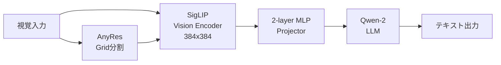
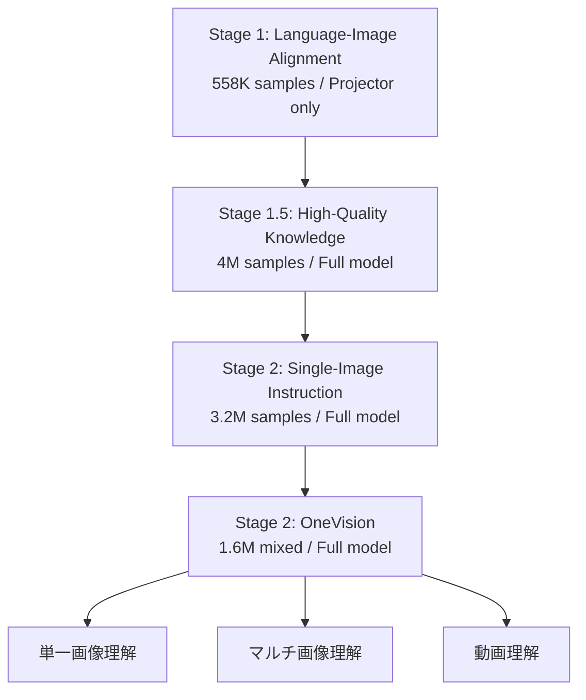

本記事は [LLaVA-OneVision: Easy Visual Task Transfer](https://arxiv.org/abs/2408.03326) の解説記事です。

## 論文概要（Abstract）

LLaVA-OneVisionは、単一画像・マルチ画像・動画の3つの視覚シナリオを単一モデルで統一的に処理するオープンソースの大規模マルチモーダルモデル（LMM）である。著者らは、LLaVA-NeXTシリーズで蓄積したデータ・モデル・視覚表現に関する知見を統合し、異なるモダリティ間での強力な転移学習を実現したと報告している。特に、画像理解で獲得した知識が動画理解へ転移する現象は、本研究の重要な発見の一つである。

この記事は [Zenn記事: Gemini 2.5のマルチモーダル入力理解を活用した実践パターン4選](https://zenn.dev/0h_n0/articles/d1e65e3e69c087) の深掘りです。

## 情報源

- **arXiv ID**: 2408.03326
- **URL**: [https://arxiv.org/abs/2408.03326](https://arxiv.org/abs/2408.03326)
- **著者**: Bo Li, Yuanhan Zhang, Dong Guo, Renrui Zhang, Feng Li, Hao Zhang, Kaichen Zhang, Peiyuan Zhang, Yanwei Li, Ziwei Liu, Chunyuan Li
- **発表年**: 2024年
- **分野**: cs.CV, cs.AI
- **ライセンス**: CC BY-NC-ND 4.0

## 背景と動機（Background & Motivation）

2024年時点で、GPT-4VやGeminiといった商用マルチモーダルモデルが画像・動画理解で高い性能を示す一方、オープンソースのVLM（Vision-Language Model）は個別のタスクに特化したモデルが多く、単一モデルで複数の視覚シナリオを横断的に処理できるものは存在しなかった。

従来のオープンソースVLMが抱えていた課題は主に3つある。第一に、単一画像・マルチ画像・動画を個別のモデルやアダプタで処理する必要があり、推論時のモデル管理コストが高いこと。第二に、画像理解で獲得した知識が動画理解に活かされず、モダリティ間の転移学習が不十分であること。第三に、高解像度画像の効率的な処理手法が確立されていなかったことである。

LLaVA-OneVisionはこれらの課題に対し、統一アーキテクチャと段階的訓練カリキュラムによるアプローチを提案している。

## 主要な貢献（Key Contributions）

- **貢献1**: オープンソースの単一モデルとして初めて、単一画像・マルチ画像・動画の3シナリオすべてで性能境界を同時に押し広げた
- **貢献2**: AnyRes戦略による可変解像度の視覚入力処理を実現し、単一画像では最大6x6グリッド（7290トークン）まで、動画では効率的なトークン削減による多フレーム処理を可能にした
- **貢献3**: 画像から動画への知識転移メカニズムを解明し、単一画像で訓練したモデルがゼロショットで動画理解能力を示すことを確認した
- **貢献4**: 段階的訓練カリキュラム（4段階）の設計指針を提示し、各段階での最適なデータ構成と訓練パラメータを明らかにした

## 技術的詳細（Technical Details）

### アーキテクチャ概要

LLaVA-OneVisionのアーキテクチャは、ビジョンエンコーダ、MLPプロジェクタ、言語モデルの3コンポーネントで構成される。



**ビジョンエンコーダ**: SigLIP（SO400M）を採用。入力解像度は384x384ピクセルをベースとし、1枚のクロップあたり729トークンの視覚特徴量を生成する。SigLIPの最終Transformerレイヤの前後からグリッド特徴量を抽出し、2層のMLPプロジェクタを通じてLLMの埋め込み空間にマッピングする。

**言語モデル**: Qwen-2を採用。0.5B、7B、72Bの3サイズを提供する。著者らは、公開されているLLMチェックポイントの中でQwen-2が強力な言語能力とスケーリング特性を持つことを選定理由として報告している。

**MLPプロジェクタ**: ビジョンエンコーダの出力をLLMの単語埋め込み次元に射影する2層のMLP。この比較的シンプルな設計は、LLaVAシリーズで一貫して採用されている。

### AnyRes戦略：可変解像度画像処理

AnyRes（Any Resolution）戦略は、LLaVA-OneVisionのアーキテクチャにおける重要な設計要素である。入力画像を固定サイズに強制リサイズするのではなく、画像のアスペクト比と解像度に応じて動的にグリッド分割を行う。

画像を $a \times b$ のグリッドに分割する場合、生成される総トークン数 $L$ は以下の式で計算される。

$$
L = (a \times b + 1) \times T
$$

ここで、
- $a$: 水平方向のグリッド数
- $b$: 垂直方向のグリッド数
- $T$: 1クロップあたりのトークン数（SigLIPでは729）
- $+1$: 全体をリサイズしたベース画像分

閾値 $\tau$ を設定し、$L > \tau$ の場合はバイリニア補間によるトークン削減を適用する。

**シナリオ別の解像度戦略**:

| シナリオ | グリッド構成 | 最大トークン数 | 備考 |
|---------|------------|-------------|------|
| 単一画像 | 最大6x6 | 729 x 10 | 高解像度クロップ有効 |
| マルチ画像 | 384x384ベースのみ | 729 x 画像数 | クロップなし（メモリ効率重視） |
| 動画 | 384x384ベース | 196 x フレーム数 | プーリングでトークン削減 |

動画入力では、各フレームのトークン数を196に削減することで、より多くのフレームを処理できるようにしている。これにより、限られた計算資源の中でフレーム数と解像度のトレードオフを最適化している。

### Gemini Dynamic Resolutionとの比較

Zenn記事で紹介されているGemini 2.5のDynamic Resolutionと、LLaVA-OneVisionのAnyRes戦略は類似した設計思想を持つ。

| 特徴 | LLaVA-OneVision AnyRes | Gemini Dynamic Resolution |
|------|----------------------|--------------------------|
| 設計思想 | グリッド分割 + トークン制御 | 内部的な適応的解像度処理 |
| 最大解像度 | 2304x2304（6x6グリッド） | 非公開（高解像度対応） |
| オープンソース | CC BY-NC-ND 4.0 | 商用API |
| 動画対応 | フレームごとにプーリング | ネイティブ動画入力 |
| カスタマイズ性 | 訓練・ファインチューニング可能 | API経由のみ |

両者とも「画像の解像度やアスペクト比に応じた動的処理」を実現するが、LLaVA-OneVisionはオープンソースであり、特定ドメインへのファインチューニングが可能な点で差別化される。

### 訓練カリキュラム

LLaVA-OneVisionの訓練は4段階のカリキュラムで構成される。各段階で異なるデータ構成、学習率、訓練対象パラメータを採用している。



**Stage 1: Language-Image Alignment（言語-画像アライメント）**

LCS-558Kデータセット（558K samples）を使用し、MLPプロジェクタのみを訓練する。解像度は384x384のベース画像のみで、729トークンを生成する。学習率はプロジェクタ・LLMともに $1 \times 10^{-3}$、バッチサイズ512で1エポック訓練する。この段階の目的は、ビジョンエンコーダの視覚特徴量をLLMの埋め込み空間に整合させることである。

**Stage 1.5: High-Quality Knowledge（高品質知識注入）**

4M samplesの高品質合成データを使用し、モデル全体を訓練する。データの内訳は以下の通りである。

- **リキャプション記述**: 3.5M（COCO118K、BLIP558K、CC3M等）
- **ドキュメント/OCR**: 1.1M（UReader、SynDOG）
- **中国語/多言語**: 235K（中国語キャプション92K、Evo-Instruct 143K）

著者らは、この段階のデータの99.8%が合成データであると報告している。解像度は384x384に加え、2x2、1x{2,3}、{2,3}x1のグリッド構成を導入し、最大729x5トークンまで拡張する。学習率はビジョンエンコーダ $2 \times 10^{-6}$、プロジェクタ/LLM $1 \times 10^{-5}$ である。

**Stage 2: Single-Image Instruction（単一画像指示追従）**

3.2M samplesの指示追従データを使用し、モデル全体を訓練する。データ構成は以下の通りである。

- 一般QA: 36.1%
- ドキュメント/チャート/スクリーン: 20.6%
- 数学/推論: 20.1%
- 一般OCR: 8.9%
- 言語: 14.3%

解像度は最大6x6グリッド構成（729x10トークン）まで拡張される。

**Stage 2: OneVision（統一ビジョン）**

1.6M samplesの混合モダリティデータで訓練する最終段階である。

- **単一画像**: 800K（31.2%、高品質データを選択）
- **マルチ画像**: 560K（43.0%、先行研究のデータを活用）
- **動画**: 350K（25.9%、新規収集データ）

この段階で初めてマルチ画像と動画データが導入される。著者らは、単一画像で訓練したモデルに動画データを追加することで、画像理解能力を維持しつつ動画理解能力を獲得できると報告している。

### 転移学習メカニズム：画像から動画へ

LLaVA-OneVisionの特筆すべき発見は、単一画像で訓練したモデルがゼロショットで動画理解能力を示すことである。著者らは、この現象を以下のように説明している。

1. **長系列表現の類似性**: 高解像度の単一画像をAnyRes戦略で処理すると、多数のトークンが連結された長い系列として表現される。これは動画の複数フレームを連結した表現と構造的に類似しており、モデルが長い視覚系列の処理方法を画像訓練で学習できる
2. **視覚指示の多様性**: 単一画像訓練で獲得した多様な視覚指示追従能力（チャート理解、OCR、空間推論など）が、動画の各フレーム分析に転用される
3. **段階的訓練の効果**: OneVision段階で動画データを追加することで、ゼロショット性能がさらに向上し、新しい創発的能力が出現する

著者らは、以下の9つの創発的能力を報告している。

1. 結合ダイアグラム/チャート理解（単一画像 → マルチ画像）
2. GUIエージェント理解（単一+マルチ画像）
3. Set-of-Markプロンプティング（単一画像構成）
4. 画像→動画編集指示（単一画像+動画）
5. 動画→動画差分検出（マルチ画像+動画）
6. マルチカメラ自動運転動画（単一+マルチ画像 → 動画）
7. 構成サブ動画理解（マルチ画像 → 動画）
8. 動画内ビジュアルプロンプティング（単一画像 → 動画）
9. 動画内画像参照（クロスモーダル理解）

## 実装のポイント（Implementation）

### Transformersライブラリによる推論

LLaVA-OneVisionはHugging Face Transformersライブラリに統合されており、以下のコードで推論を実行できる。

```python
from transformers import (
    LlavaOnevisionForConditionalGeneration,
    AutoProcessor,
)
from PIL import Image
import torch


def run_llava_onevision_inference(
    image_path: str,
    prompt: str,
    model_id: str = "lmms-lab/llava-onevision-qwen2-7b-ov",
) -> str:
    """LLaVA-OneVisionで画像に対する質問応答を実行する

    Args:
        image_path: 入力画像のパス
        prompt: ユーザーの質問テキスト
        model_id: 使用するモデルID

    Returns:
        モデルの応答テキスト
    """
    # モデルとプロセッサのロード
    model = LlavaOnevisionForConditionalGeneration.from_pretrained(
        model_id,
        torch_dtype=torch.float16,
        device_map="auto",
    )
    processor = AutoProcessor.from_pretrained(model_id)

    # 入力の構築
    image = Image.open(image_path).convert("RGB")
    conversation = [
        {
            "role": "user",
            "content": [
                {"type": "image"},
                {"type": "text", "text": prompt},
            ],
        }
    ]
    text = processor.apply_chat_template(
        conversation, add_generation_prompt=True
    )
    inputs = processor(
        text=[text], images=[image], return_tensors="pt"
    ).to(model.device)

    # 推論実行
    with torch.no_grad():
        output_ids = model.generate(**inputs, max_new_tokens=512)

    # デコード（入力トークンを除外）
    generated_ids = output_ids[:, inputs["input_ids"].shape[1]:]
    response = processor.batch_decode(
        generated_ids, skip_special_tokens=True
    )[0]
    return response
```

### 動画入力の処理

動画入力の場合、フレームをサンプリングして処理する。各フレームは196トークンにプーリングされるため、メモリ効率が高い。

```python
import av
import numpy as np
from typing import Generator


def read_video_frames(
    video_path: str,
    num_frames: int = 16,
) -> list[np.ndarray]:
    """動画からフレームを均等にサンプリングする

    Args:
        video_path: 動画ファイルのパス
        num_frames: サンプリングするフレーム数

    Returns:
        サンプリングされたフレームのリスト（RGB numpy配列）
    """
    container = av.open(video_path)
    stream = container.streams.video[0]
    total_frames = stream.frames

    # 均等間隔でフレームインデックスを計算
    indices = np.linspace(
        0, total_frames - 1, num_frames, dtype=int
    )

    frames: list[np.ndarray] = []
    for i, frame in enumerate(
        container.decode(video=0)
    ):
        if i in indices:
            frames.append(frame.to_ndarray(format="rgb24"))
        if len(frames) >= num_frames:
            break

    container.close()
    return frames
```

### 実装時の注意点

**メモリ要件**: 7Bモデルの推論には最低16GB VRAM（FP16）が必要であり、72Bモデルでは複数GPUが必要となる。vLLMやSGLangといった推論フレームワークを使用することで、メモリ効率とスループットを改善できる。

**AnyRes設定**: `anyres_max_9`モードでは単一画像あたり最大729x10 = 7290トークンが生成される。バッチ推論時にはOOMエラーに注意が必要である。マルチ画像入力時はベース解像度（384x384）のみ使用されるため、トークン数は729 x 画像数となる。

**量子化**: AWQ/GPTQ量子化モデルも提供されており、8bit量子化で約50%のメモリ削減が可能である。ただし、量子化による精度低下はベンチマークにより0.5-2%程度と報告されている。

## Production Deployment Guide

### AWS実装パターン（コスト最適化重視）

LLaVA-OneVision 7Bモデルをプロダクション環境にデプロイする場合、トラフィック量に応じた3つの構成を提案する。以下のコスト試算は2026年8月時点のAWS ap-northeast-1（東京）リージョン料金に基づく概算値であり、実際のコストはトラフィックパターンやバースト使用量により変動する。最新料金はAWS料金計算ツールで確認を推奨する。

| 構成 | トラフィック | インフラ | GPU | 月額概算 |
|------|-----------|---------|-----|---------|
| Small | ~100 req/日 | Lambda + SageMaker Serverless | なし（CPU推論） | $80-200 |
| Medium | ~1,000 req/日 | ECS Fargate + SageMaker | g5.xlarge x1 | $400-900 |
| Large | 10,000+ req/日 | EKS + vLLM + Spot | g5.2xlarge x2-4 | $2,500-5,000 |

**Small構成の詳細**: Lambda関数でリクエストを受信し、SageMaker Serverless Endpointで推論を実行する。GPU不要のCPU推論（量子化モデル使用）で低コストを実現するが、レイテンシは5-15秒と高い。

**Medium構成の詳細**: ECS Fargateでアプリケーション層を管理し、SageMaker Real-time Endpointでg5.xlargeインスタンス上にvLLMサーバを稼働させる。レイテンシは1-3秒程度。

**Large構成の詳細**: EKS上にvLLMをデプロイし、Karpenterによる自動スケーリングでSpot Instancesを優先的に使用する。g5.2xlargeのSpot Instancesでオンデマンドの最大70%削減を実現する。

**コスト削減テクニック**:
- Spot Instances活用: g5ファミリーでオンデマンド比最大70-90%削減
- Reserved Instances: 1年コミットで最大40%、3年コミットで最大60%削減
- SageMaker Savings Plans: ML推論向けで最大64%削減
- 推論最適化: vLLMのContinuous Batchingで同一GPUでのスループット3-5倍向上

### Terraformインフラコード

**Small構成（Serverless）**:

```hcl
# small_llava_infra.tf
# LLaVA-OneVision Small構成: Lambda + SageMaker Serverless

terraform {
  required_version = ">= 1.9"
  required_providers {
    aws = {
      source  = "hashicorp/aws"
      version = "~> 5.60"
    }
  }
}

provider "aws" {
  region = "ap-northeast-1"
}

# --- IAM ---
resource "aws_iam_role" "lambda_role" {
  name = "llava-ov-lambda-role"
  assume_role_policy = jsonencode({
    Version = "2012-10-17"
    Statement = [{
      Action    = "sts:AssumeRole"
      Effect    = "Allow"
      Principal = { Service = "lambda.amazonaws.com" }
    }]
  })
}

resource "aws_iam_role_policy_attachment" "lambda_basic" {
  role       = aws_iam_role.lambda_role.name
  policy_arn = "arn:aws:iam::aws:policy/service-role/AWSLambdaBasicExecutionRole"
}

resource "aws_iam_role_policy" "lambda_sagemaker" {
  name = "llava-ov-lambda-sagemaker"
  role = aws_iam_role.lambda_role.id
  policy = jsonencode({
    Version = "2012-10-17"
    Statement = [{
      Effect   = "Allow"
      Action   = ["sagemaker:InvokeEndpoint"]
      Resource = aws_sagemaker_endpoint.llava_endpoint.arn
    }]
  })
}

# --- DynamoDB (リクエストログ) ---
resource "aws_dynamodb_table" "request_log" {
  name         = "llava-ov-request-log"
  billing_mode = "PAY_PER_REQUEST"  # On-Demand: 低トラフィック向け
  hash_key     = "request_id"
  range_key    = "timestamp"

  attribute {
    name = "request_id"
    type = "S"
  }
  attribute {
    name = "timestamp"
    type = "S"
  }

  # KMS暗号化
  server_side_encryption {
    enabled = true
  }
}

# --- Lambda ---
resource "aws_lambda_function" "api_handler" {
  function_name = "llava-ov-api-handler"
  role          = aws_iam_role.lambda_role.arn
  handler       = "handler.lambda_handler"
  runtime       = "python3.12"
  timeout       = 60
  memory_size   = 256
  filename      = "lambda_package.zip"

  environment {
    variables = {
      SAGEMAKER_ENDPOINT = aws_sagemaker_endpoint.llava_endpoint.name
      DYNAMODB_TABLE     = aws_dynamodb_table.request_log.name
    }
  }
}

# --- CloudWatch アラーム (コスト監視) ---
resource "aws_cloudwatch_metric_alarm" "lambda_duration" {
  alarm_name          = "llava-ov-lambda-duration-high"
  comparison_operator = "GreaterThanThreshold"
  evaluation_periods  = 3
  metric_name         = "Duration"
  namespace           = "AWS/Lambda"
  period              = 300
  statistic           = "Average"
  threshold           = 30000  # 30秒
  alarm_description   = "Lambda実行時間が30秒を超過"
  dimensions = {
    FunctionName = aws_lambda_function.api_handler.function_name
  }
}
```

**Large構成（Container）**:

```hcl
# large_llava_infra.tf
# LLaVA-OneVision Large構成: EKS + Karpenter + Spot

# --- EKS Cluster ---
module "eks" {
  source  = "terraform-aws-modules/eks/aws"
  version = "~> 20.24"

  cluster_name    = "llava-ov-cluster"
  cluster_version = "1.30"

  vpc_id     = module.vpc.vpc_id
  subnet_ids = module.vpc.private_subnets

  # コントロールプレーンのみ（ノードはKarpenterが管理）
  cluster_endpoint_public_access = false

  # KMS暗号化
  cluster_encryption_config = {
    provider_key_arn = aws_kms_key.eks.arn
    resources        = ["secrets"]
  }
}

# --- Karpenter (Spot優先自動スケーリング) ---
resource "kubectl_manifest" "karpenter_nodepool" {
  yaml_body = yamlencode({
    apiVersion = "karpenter.sh/v1"
    kind       = "NodePool"
    metadata   = { name = "llava-gpu" }
    spec = {
      template = {
        spec = {
          requirements = [
            {
              key      = "karpenter.sh/capacity-type"
              operator = "In"
              values   = ["spot", "on-demand"]  # Spot優先
            },
            {
              key      = "node.kubernetes.io/instance-type"
              operator = "In"
              values   = ["g5.2xlarge", "g5.4xlarge"]
            }
          ]
          nodeClassRef = {
            group = "karpenter.k8s.aws"
            kind  = "EC2NodeClass"
            name  = "gpu-nodes"
          }
        }
      }
      limits = {
        cpu    = "64"
        memory = "256Gi"
      }
      disruption = {
        consolidationPolicy = "WhenEmptyOrUnderutilized"
        consolidateAfter    = "60s"
      }
    }
  })
}

# --- Secrets Manager (モデル設定) ---
resource "aws_secretsmanager_secret" "model_config" {
  name       = "llava-ov/model-config"
  kms_key_id = aws_kms_key.secrets.arn
}

resource "aws_secretsmanager_secret_version" "model_config" {
  secret_id = aws_secretsmanager_secret.model_config.id
  secret_string = jsonencode({
    model_id       = "lmms-lab/llava-onevision-qwen2-7b-ov"
    max_model_len  = 8192
    gpu_memory_util = 0.9
    tensor_parallel = 1
  })
}

# --- AWS Budgets (予算アラート) ---
resource "aws_budgets_budget" "monthly" {
  name         = "llava-ov-monthly"
  budget_type  = "COST"
  limit_amount = "5000"
  limit_unit   = "USD"
  time_unit    = "MONTHLY"

  notification {
    comparison_operator       = "GREATER_THAN"
    threshold                 = 80
    threshold_type            = "PERCENTAGE"
    notification_type         = "FORECASTED"
    subscriber_email_addresses = ["ops-team@example.com"]
  }
}
```

### 運用・監視設定

**CloudWatch Logs Insights クエリ**:

```
# コスト異常検知: 1時間あたりの推論リクエスト数スパイク
fields @timestamp, @message
| filter @message like /inference_request/
| stats count(*) as request_count by bin(1h)
| sort request_count desc
| limit 24
```

```
# レイテンシ分析 (P95, P99)
fields @timestamp, latency_ms
| filter @message like /inference_complete/
| stats avg(latency_ms) as avg_latency,
        percentile(latency_ms, 95) as p95,
        percentile(latency_ms, 99) as p99
  by bin(1h)
```

**CloudWatch アラーム設定（Python）**:

```python
import boto3


def create_inference_alarms(
    endpoint_name: str,
    sns_topic_arn: str,
) -> None:
    """SageMaker推論エンドポイントの監視アラームを作成する

    Args:
        endpoint_name: SageMakerエンドポイント名
        sns_topic_arn: 通知先SNSトピックARN
    """
    cw = boto3.client("cloudwatch", region_name="ap-northeast-1")

    # GPU使用率スパイク検知
    cw.put_metric_alarm(
        AlarmName=f"{endpoint_name}-gpu-util-high",
        MetricName="GPUUtilization",
        Namespace="/aws/sagemaker/Endpoints",
        Statistic="Average",
        Period=300,
        EvaluationPeriods=3,
        Threshold=90.0,
        ComparisonOperator="GreaterThanThreshold",
        Dimensions=[
            {"Name": "EndpointName", "Value": endpoint_name},
        ],
        AlarmActions=[sns_topic_arn],
    )

    # レイテンシ異常検知
    cw.put_metric_alarm(
        AlarmName=f"{endpoint_name}-latency-high",
        MetricName="ModelLatency",
        Namespace="AWS/SageMaker",
        Statistic="p99",
        Period=300,
        EvaluationPeriods=2,
        Threshold=10_000_000,  # 10秒（マイクロ秒単位）
        ComparisonOperator="GreaterThanThreshold",
        Dimensions=[
            {"Name": "EndpointName", "Value": endpoint_name},
        ],
        AlarmActions=[sns_topic_arn],
    )
```

**X-Ray トレーシング設定**:

```python
from aws_xray_sdk.core import xray_recorder, patch_all
from aws_xray_sdk.core import lambda_launcher  # noqa: F401

# boto3自動計装
patch_all()


def trace_inference(
    image_data: bytes,
    prompt: str,
) -> dict:
    """推論リクエストをX-Rayでトレーシングする

    Args:
        image_data: 入力画像のバイトデータ
        prompt: ユーザープロンプト

    Returns:
        推論結果とトレーシングメタデータ
    """
    subsegment = xray_recorder.begin_subsegment("llava_inference")
    subsegment.put_annotation("model", "llava-onevision-7b")
    subsegment.put_metadata("prompt_length", len(prompt))
    subsegment.put_metadata("image_size_bytes", len(image_data))

    try:
        result = invoke_sagemaker_endpoint(image_data, prompt)
        subsegment.put_metadata("response_tokens", result["token_count"])
        return result
    except Exception as e:
        subsegment.add_exception(e, stack=True)
        raise
    finally:
        xray_recorder.end_subsegment()
```

**Cost Explorer自動レポート（Python）**:

```python
import boto3
from datetime import datetime, timedelta


def get_daily_cost_report() -> dict:
    """日次コストレポートを取得しSNS通知を送信する

    Returns:
        サービス別コスト内訳
    """
    ce = boto3.client("ce", region_name="us-east-1")
    sns = boto3.client("sns", region_name="ap-northeast-1")

    today = datetime.utcnow().date()
    yesterday = today - timedelta(days=1)

    response = ce.get_cost_and_usage(
        TimePeriod={
            "Start": yesterday.isoformat(),
            "End": today.isoformat(),
        },
        Granularity="DAILY",
        Metrics=["UnblendedCost"],
        GroupBy=[
            {"Type": "DIMENSION", "Key": "SERVICE"},
        ],
        Filter={
            "Tags": {
                "Key": "Project",
                "Values": ["llava-onevision"],
            }
        },
    )

    costs = {}
    total = 0.0
    for group in response["ResultsByTime"][0]["Groups"]:
        service = group["Keys"][0]
        amount = float(group["Metrics"]["UnblendedCost"]["Amount"])
        costs[service] = amount
        total += amount

    # $100/日超過でSNS通知
    if total > 100.0:
        sns.publish(
            TopicArn="arn:aws:sns:ap-northeast-1:ACCOUNT:cost-alert",
            Subject="LLaVA-OV Daily Cost Alert",
            Message=f"Daily cost: ${total:.2f}\n{costs}",
        )

    return costs
```

### コスト最適化チェックリスト

**アーキテクチャ選択**:
- [ ] トラフィック量に応じた構成選択（Small: Serverless / Medium: Hybrid / Large: Container）
- [ ] GPU不要なユースケースではCPU量子化推論を検討
- [ ] バッチ処理可能なワークロードの分離

**リソース最適化**:
- [ ] EC2/EKS: Spot Instances優先（g5ファミリーで最大70-90%削減）
- [ ] Reserved Instances: 安定ワークロードに1年コミット（最大40%削減）
- [ ] Savings Plans: SageMaker ML推論向け（最大64%削減）
- [ ] Lambda: メモリサイズ最適化（Power Tuningツール活用）
- [ ] EKS: Karpenterでアイドル時60秒後自動スケールダウン
- [ ] SageMaker: Auto Scalingポリシーでゼロスケール設定

**推論コスト削減**:
- [ ] vLLM Continuous Batchingでスループット3-5倍向上
- [ ] AWQ/GPTQ量子化で同一GPUでの同時処理数向上
- [ ] PagedAttentionでGPUメモリの断片化を解消
- [ ] 入力画像のリサイズ/圧縮でトークン数を制御

**監視・アラート**:
- [ ] AWS Budgets: 月次予算設定と80%閾値アラート
- [ ] CloudWatch: GPU使用率・レイテンシ・エラー率アラーム
- [ ] Cost Anomaly Detection: ML検知による異常コスト検出
- [ ] 日次コストレポート: Cost Explorer APIで自動集計

**リソース管理**:
- [ ] 未使用のSageMakerエンドポイント・EBSボリューム定期削除
- [ ] タグ戦略: Project/Environment/Ownerタグを全リソースに適用
- [ ] S3ライフサイクルポリシー: 推論ログの30日後Glacier移行
- [ ] 開発環境: 夜間・週末の自動停止スケジュール設定
- [ ] ECRイメージ: ライフサイクルポリシーで古いイメージを自動削除

## 実験結果（Results）

### 単一画像ベンチマーク

論文Table 4より、LLaVA-OneVisionの各サイズにおける単一画像ベンチマーク結果を示す。

| ベンチマーク | LLaVA-OV-0.5B | LLaVA-OV-7B | LLaVA-OV-72B | GPT-4V | GPT-4o |
|------------|--------------|-------------|-------------|--------|--------|
| AI2D | — | 81.4 | 85.6 | 78.2 | 94.2 |
| ChartQA | — | 80.0 | 83.7 | 78.5 | 85.7 |
| DocVQA | — | 90.2 | 91.3 | 88.4 | 92.8 |
| MMMU val | — | 48.8 | 56.8 | 56.8 | 69.1 |
| MathVista | — | 63.2 | 67.5 | 49.9 | 63.8 |
| MMBench-EN | — | 80.8 | 85.9 | 75.0 | — |
| ScienceQA | — | — | 90.3 | 75.7 | — |

著者らは、72Bモデルが多くのベンチマークでGPT-4Vと同等以上の性能を示し、特にMathVista（67.5% vs 49.9%）とMMBench-EN（85.9% vs 75.0%）で大幅に上回ったと報告している。一方、MMMU valではGPT-4oとの差が12.3ポイントあり、複雑な推論タスクでは商用モデルとの差が残ることも示されている。

### 動画ベンチマーク

論文Table 6より、動画理解ベンチマークの結果を示す。

| ベンチマーク | LLaVA-OV-72B | GPT-4V | GPT-4o |
|------------|-------------|--------|--------|
| ActivityNet-QA | 62.3 | 57.0 | — |
| EgoSchema | 62.0 | — | — |
| VideoMME | 66.2 | 59.9 | 71.9 |
| MLVU | 68.0 | 49.2 | 64.6 |
| NextQA | 80.2 | — | — |
| PerceptionTest | 66.9 | — | — |

著者らは、LLaVA-OV-72Bが動画理解においてGPT-4Vを多くのベンチマークで上回り、ActivityNet-QA（+5.3ポイント）、VideoMME（+6.3ポイント）、MLVU（+18.8ポイント）で顕著な改善を示したと報告している。GPT-4oとの比較では、MLVUで3.4ポイント上回る一方、VideoMMEでは5.7ポイント下回っている。

### マルチ画像ベンチマーク

論文Table 5より、マルチ画像理解の結果を示す。

| ベンチマーク | LLaVA-OV-72B | GPT-4V |
|------------|-------------|--------|
| LLaVA-Interleave (out-domain) | 79.9 | 60.3 |
| MuirBench | 54.8 | 62.3 |
| Mantis | 77.6 | 62.7 |
| NLVR2 | 93.8 | 88.8 |

マルチ画像タスクでは、著者らはNLVR2（93.8% vs 88.8%）やMantis（77.6% vs 62.7%）でGPT-4Vを大幅に上回ったと報告している。ただし、MuirBench（54.8% vs 62.3%）ではGPT-4Vに劣っており、特定のマルチ画像推論タスクでは改善の余地がある。

## 実運用への応用（Practical Applications）

### Gemini 2.5のオープンソース代替として

Zenn記事で紹介されているGemini 2.5のマルチモーダル活用パターンは、LLaVA-OneVisionでも類似のアプローチで実現可能である。

**ドキュメント解析**: DocVQAで90.2%（7B）の性能を示しており、PDF/画像からのテキスト抽出・QAタスクにおいて、Geminiの代替として検討可能。オンプレミスやプライベートクラウドでの運用が求められるケースで有効である。

**動画解析**: ActivityNet-QAやVideoMMEでGPT-4Vを上回る性能を持ち、監視カメラ映像の分析や製造ラインの異常検知などの産業応用が考えられる。

**マルチ画像比較**: NLVR2で93.8%の高い性能を示しており、製品画像の差分検出や不良品判定などのマルチ画像比較タスクに適用できる。

**制約事項**: CC BY-NC-ND 4.0ライセンスであるため、商用利用には制限がある。商用プロダクトに組み込む場合は、ライセンス条件の確認が必須である。また、72Bモデルは推論コストが高く、7Bモデルとの精度・コストトレードオフを慎重に評価する必要がある。

## 関連研究（Related Work）

- **LLaVA-NeXT**: LLaVA-OneVisionの直接の前身。単一画像の高解像度処理やAnyRes戦略の基礎を確立した。LLaVA-OneVisionはこのシリーズの知見を統合・拡張したものである
- **InternVL2**: 同時期に開発されたオープンソースVLMで、同様に画像・動画の統一処理を目指している。LLaVA-OneVisionとはベンチマークで競合関係にあり、タスクによって優劣が分かれる
- **Qwen-VL**: Qwen-2を言語バックボーンとして共有するマルチモーダルモデル。LLaVA-OneVisionとはビジョンエンコーダ（SigLIP vs ViT）や訓練戦略の点で差別化される
- **LLaVA-OneVision-2**: 2025年に発表された後継モデル。コーデックベースの動画処理やフレームサンプリングの改善を導入し、さらなる性能向上を実現している

## まとめと今後の展望

LLaVA-OneVisionは、オープンソースの単一VLMで画像・マルチ画像・動画の3シナリオを統一的に処理する先駆的な研究である。SigLIP + Qwen-2のアーキテクチャに、AnyRes戦略と4段階訓練カリキュラムを組み合わせることで、商用モデルGPT-4Vに匹敵する性能をオープンソースで実現した。

実務への示唆として、データプライバシーの要件がある環境や、特定ドメインへのファインチューニングが必要なケースでは、Geminiの有力な代替候補となる。後継のLLaVA-OneVision-2ではコーデックベースの動画処理が導入されており、今後はフレームサンプリングの効率化と長時間動画理解のさらなる改善が期待される。

## 参考文献

- **arXiv**: [https://arxiv.org/abs/2408.03326](https://arxiv.org/abs/2408.03326)
- **Code**: [https://github.com/LLaVA-VL/LLaVA-NeXT](https://github.com/LLaVA-VL/LLaVA-NeXT)
- **Hugging Face**: [https://huggingface.co/lmms-lab/llava-onevision-qwen2-7b-ov](https://huggingface.co/lmms-lab/llava-onevision-qwen2-7b-ov)
- **Transformers Doc**: [https://huggingface.co/docs/transformers/en/model_doc/llava_onevision](https://huggingface.co/docs/transformers/en/model_doc/llava_onevision)
- **Related Zenn article**: [https://zenn.dev/0h_n0/articles/d1e65e3e69c087](https://zenn.dev/0h_n0/articles/d1e65e3e69c087)
