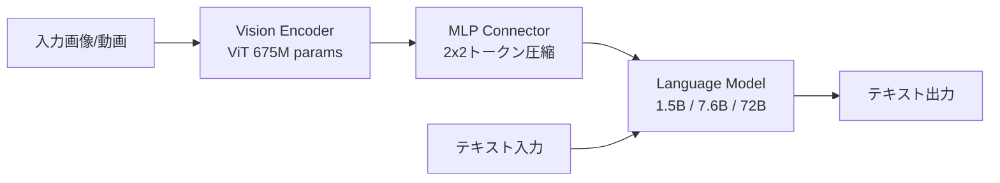

本記事は [Qwen2-VL: Enhancing Vision-Language Model's Perception of the World at Any Resolution (Wang, Bai et al., 2024)](https://arxiv.org/abs/2409.12191) の解説記事です。

## 論文概要（Abstract）

Qwen2-VLは、Alibaba GroupのQwenチームが開発したVision-Language Model（VLM）であり、従来のVLMが固定解像度で画像を処理するアプローチを根本から見直した。著者らは、画像を任意の解像度で受け取り解像度に応じた数の視覚トークンに動的に変換するNaive Dynamic Resolutionと、テキスト・画像・動画にまたがる位置情報を統合的に扱うMultimodal Rotary Position Embedding（M-RoPE）を提案している。2B、8B、72Bの3つのモデルサイズで提供され、72Bモデルは文書理解タスクのDocVQAで96.5を達成し、GPT-4oやClaude 3.5 Sonnetに匹敵する結果を報告している（論文Table 2より）。

この記事は [Zenn記事: Gemini 2.5のマルチモーダル入力理解を活用した実践パターン4選](https://zenn.dev/0h_n0/articles/d1e65e3e69c087) の深掘りです。

## 情報源

- **arXiv ID**: 2409.12191
- **URL**: [https://arxiv.org/abs/2409.12191](https://arxiv.org/abs/2409.12191)
- **著者**: Peng Wang, Shuai Bai, Junyang Lin et al.（Qwen Team, Alibaba Group）
- **発表年**: 2024年
- **分野**: cs.CV, cs.CL
- **コード**: [https://github.com/QwenLM/Qwen2-VL](https://github.com/QwenLM/Qwen2-VL)

## 背景と動機（Background & Motivation）

Vision-Language Model（VLM）の多くは、入力画像を固定解像度にリサイズしてからVision Transformer（ViT）に入力する設計を採用してきた。この固定解像度アプローチには2つの問題がある。第一に、高解像度画像をダウンサンプリングすると文書中の小さな文字や図表の詳細が失われる。第二に、低解像度の画像をアップサンプリングすると不要な計算コストが発生する。

さらに、従来のVLMは画像と動画を別々のパイプラインで処理するケースが多く、統一的なマルチモーダル処理が実現できていなかった。Qwen2-VLは「解像度に依存しない視覚トークン化」と「画像・動画を統一的に扱う位置エンベディング」という2つの技術革新でこれらの課題に応えている。

## 主要な貢献（Key Contributions）

- **Naive Dynamic Resolution**: 画像を元の解像度のまま処理し、解像度に応じた可変数の視覚トークンを生成する。従来の固定解像度アプローチを排除し、高解像度画像での文書理解性能を向上させた
- **Multimodal Rotary Position Embedding (M-RoPE)**: 1次元のRoPEを時間・高さ・幅の3次元に分解し、テキスト・画像・動画の位置情報を統一的に扱う位置エンベディング
- **スケーラブルなモデルファミリー**: 2B、8B、72Bの3サイズを提供し、エッジデバイスからクラウドまで幅広いデプロイメントシナリオに対応

## 技術的詳細（Technical Details）

### アーキテクチャ概要

Qwen2-VLはVision Encoder、Vision-Language Connector、Language Modelの3コンポーネントで構成される。



**Vision Encoder**: 675Mパラメータの ViT を全モデルサイズで共有する。パッチサイズは14で、従来の絶対位置エンベディングに代えて2D-RoPEを使用する。動画処理のために深度2の3D畳み込みを統合し、隣接2フレームの情報を結合してシーケンス長を抑制する。

**Vision-Language Connector**: ViTの出力に対してMLPレイヤーを適用し、2x2の隣接する視覚トークンを1つに圧縮する。224x224の画像はパッチサイズ14で256パッチとなり、3D畳み込みとMLP圧縮を経て最終的に66トークンとしてLLMに入力される。

**Language Model**: Qwen2シリーズのLLMを使用し、事前学習済みパラメータで初期化する。1.5B（2Bモデル）、7.6B（8Bモデル）、72B（72Bモデル）の3種類である。

### Naive Dynamic Resolution

Naive Dynamic Resolutionの核心は、入力画像を固定解像度にリサイズせず元の解像度に近い形で処理する点にある。入力画像の解像度$(H, W)$に基づきパッチサイズ$p=14$でトークン数を計算し、所定範囲内に収まるよう最小限のリサイズを適用する。

制約パラメータとして、最小トークン数は$100 \times 28 \times 28$ピクセル相当、最大トークン数は$16384 \times 28 \times 28$ピクセル相当に設定されている（論文Section 3.1より）。

著者らのablation study（論文Table 8）では、固定トークン数（1600, 2500, 3136トークン）と動的トークン数（平均1924トークン）を比較し、動的アプローチが固定アプローチを一貫して上回ることを報告している。

### Multimodal Rotary Position Embedding (M-RoPE)

M-RoPEは本論文における最も重要な技術革新である。標準的なRoPE（Su et al., 2024）が1次元の位置情報のみを扱うのに対し、M-RoPEは位置エンベディングを時間・高さ・幅の3成分に分解する。

#### 標準RoPEの復習

位置$m$にあるトークンの特徴ベクトル$\mathbf{x}$に対し、以下の回転を適用する。

$$
\text{RoPE}(\mathbf{x}, m) = \mathbf{x} \odot \cos(m\boldsymbol{\theta}) + \text{rotate}(\mathbf{x}) \odot \sin(m\boldsymbol{\theta})
$$

ここで、$\boldsymbol{\theta} = (\theta_1, \ldots, \theta_{d/2})$は周波数ベクトル（$\theta_i = b^{-2i/d}$、$b$は基数、通常10000）、$d$は特徴次元数、$\odot$は要素ごとの積を表す。

#### M-RoPEの定式化

M-RoPEでは特徴次元$d$を3グループに分割し、各グループに異なる次元の位置IDを割り当てる。

$$
\text{M-RoPE}(\mathbf{x}, p_t, p_h, p_w) = \text{RoPE}(\mathbf{x}_{1:d/3},\ p_t) \oplus \text{RoPE}(\mathbf{x}_{d/3+1:2d/3},\ p_h) \oplus \text{RoPE}(\mathbf{x}_{2d/3+1:d},\ p_w)
$$

ここで、
- $p_t$: 時間方向の位置ID
- $p_h$: 高さ方向の位置ID
- $p_w$: 幅方向の位置ID
- $\oplus$: チャネル方向の結合（concatenation）

| モダリティ | $p_t$（時間） | $p_h$（高さ） | $p_w$（幅） |
|-----------|-------------|-------------|-------------|
| テキスト | $m$ | $m$ | $m$ |
| 画像 | 定数（画像ごと固定） | パッチの行位置 | パッチの列位置 |
| 動画 | フレームインデックス | パッチの行位置 | パッチの列位置 |

テキストトークンでは3成分すべてに同一の位置ID $m$を使用するため、標準的な1D-RoPEと等価になる。画像トークンでは時間成分を固定し、高さ・幅にパッチの空間位置を割り当てる。動画トークンでは時間成分がフレームごとにインクリメントされ、3次元的な位置情報を表現する。

この設計により、訓練時の最大シーケンス長（16384トークン）を超える80Kトークンまでの長さ外挿が可能になると著者らは報告している。画像・動画では空間位置IDの最大値がシーケンス全長よりもはるかに小さく、位置IDの値域が訓練時の範囲内に収まるためである。

### 画像と動画の統一処理

Qwen2-VLは1枚の画像を「同一の2フレームからなる動画」として扱い、ViT内部の3D畳み込み（深度2）をそのまま適用する。動画は2fpsでサンプリングし最大768フレームまで処理可能で、動画全体のトークン数は訓練時に16384トークンを上限とする。

### 訓練プロセス

著者らは3段階の訓練を採用している（論文Section 3.3より）。Stage 1ではVision Encoderを約600Bトークンの画像-テキストペアで訓練する。Stage 2ではさらに800Bトークンを追加し全パラメータを訓練する。Stage 3ではChatMLフォーマットでInstruction Fine-tuningを行う。合計で約1.4兆トークンの事前学習データが使用されている。

## 実験結果（Results）

### 画像理解ベンチマーク（論文Table 2より）

| ベンチマーク | Qwen2-VL-72B | Qwen2-VL-7B | GPT-4o | Claude 3.5 Sonnet |
|------------|-------------|------------|--------|-------------------|
| RealWorldQA | 77.8 | 70.1 | 75.4 | 60.1 |
| MMStar | 68.3 | 60.7 | 63.9 | 62.2 |
| MMBench-EN | 86.5 | 83.0 | 83.4 | 79.7 |
| DocVQA | 96.5 | 94.5 | -- | -- |
| OCRBench | 877 | 866 | -- | -- |
| ChartQA | 88.3 | 83.0 | -- | -- |

文書理解タスクにおいてQwen2-VLは特に強力な性能を示しており、Naive Dynamic Resolutionにより高解像度の文書画像をそのまま処理できることが寄与していると考えられる。

### 動画理解ベンチマーク（論文Table 4より）

| ベンチマーク | Qwen2-VL-72B | GPT-4o | Gemini 1.5-Pro |
|------------|-------------|--------|----------------|
| EgoSchema | 77.9 | 72.2 | 63.2 |
| Video-MME（字幕なし） | 71.2 | 71.9 | 75.0 |
| Video-MME（字幕あり） | 77.8 | 77.2 | 81.3 |

EgoSchemaではGPT-4oを5.7ポイント上回る一方、Video-MMEではGemini 1.5-Proが優位であり、長時間動画理解に改善余地がある。

### エージェント能力（論文Table 5より）

UI操作タスク（AITZ）では、Qwen2-VL-72Bが型一致89.6%（GPT-4o: 70.0%）、完全一致72.1%（GPT-4o: 35.3%）と大幅に上回っている。多言語OCR（論文Table 3）でも、韓国語94.5（GPT-4o: 87.8）、日本語93.4（GPT-4o: 88.3）と多くの言語で優位を示している。

## 実装のポイント（Implementation）

Qwen2-VLはHugging Face Transformersから利用可能である。

```python
from transformers import Qwen2VLForConditionalGeneration, AutoProcessor
from qwen_vl_utils import process_vision_info
import torch

def run_inference(image_url: str, prompt: str) -> str:
    """Qwen2-VLによる画像理解推論"""
    model = Qwen2VLForConditionalGeneration.from_pretrained(
        "Qwen/Qwen2-VL-7B-Instruct",
        torch_dtype=torch.bfloat16,
        device_map="auto",
    )
    processor = AutoProcessor.from_pretrained("Qwen/Qwen2-VL-7B-Instruct")

    messages = [{"role": "user", "content": [
        {"type": "image", "image": image_url},
        {"type": "text", "text": prompt},
    ]}]

    text = processor.apply_chat_template(messages, tokenize=False, add_generation_prompt=True)
    image_inputs, video_inputs = process_vision_info(messages)
    inputs = processor(text=[text], images=image_inputs, videos=video_inputs,
                       padding=True, return_tensors="pt").to(model.device)

    generated_ids = model.generate(**inputs, max_new_tokens=1024)
    return processor.batch_decode(
        generated_ids[:, inputs.input_ids.shape[1]:], skip_special_tokens=True
    )[0]
```

実運用では`min_pixels`と`max_pixels`パラメータの調整が重要である。高解像度画像を制約なしに入力するとOOMが発生するため、`max_pixels`の明示的な設定が必須である。bfloat16での推論を推奨し、72Bモデルではfloat32で約280GB以上のVRAMを要する。

## Production Deployment Guide

### AWS実装パターン（コスト最適化重視）

以下のコスト試算は2026年8月時点のAWS ap-northeast-1（東京）リージョンの概算値であり、実際のコストはトラフィックパターン・リージョンにより変動する。

| 構成 | トラフィック | 主要サービス | 月額概算 |
|------|-----------|------------|---------|
| Small | ~100 req/日 | SageMaker Endpoint (2B, ml.g5.xlarge) | $140 |
| Medium | ~1000 req/日 | ECS Fargate + GPU (7B) | $570 |
| Large | 10000+ req/日 | EKS + Spot p4d.24xlarge (72B) | $3,360 |

コスト削減テクニック: Spot Instancesで最大70%削減、Reserved Instances（1年コミット）で最大40%削減、モデル量子化（AWQ/GPTQ）で小型GPUインスタンス利用可能。

### Terraformインフラコード（Small構成）

```hcl
resource "aws_sagemaker_model" "qwen2_vl" {
  name               = "qwen2-vl-2b-instruct"
  execution_role_arn = aws_iam_role.sagemaker_execution.arn
  primary_container {
    image          = "763104351884.dkr.ecr.ap-northeast-1.amazonaws.com/huggingface-pytorch-tgi-inference:2.1-optimized"
    model_data_url = "s3://${aws_s3_bucket.model.bucket}/qwen2-vl-2b/model.tar.gz"
    environment = {
      HF_MODEL_ID     = "Qwen/Qwen2-VL-2B-Instruct"
      MAX_INPUT_LENGTH = "4096"
      SM_NUM_GPUS      = "1"
    }
  }
}

resource "aws_sagemaker_endpoint_configuration" "qwen2_vl" {
  name = "qwen2-vl-2b-config"
  production_variants {
    variant_name           = "primary"
    model_name             = aws_sagemaker_model.qwen2_vl.name
    instance_type          = "ml.g5.xlarge"  # 1x A10G, 24GB VRAM
    initial_instance_count = 1
  }
}

resource "aws_sagemaker_endpoint" "qwen2_vl" {
  name                 = "qwen2-vl-2b-endpoint"
  endpoint_config_name = aws_sagemaker_endpoint_configuration.qwen2_vl.name
}

resource "aws_cloudwatch_metric_alarm" "latency" {
  alarm_name          = "qwen2-vl-high-latency"
  comparison_operator = "GreaterThanThreshold"
  evaluation_periods  = 2
  metric_name         = "ModelLatency"
  namespace           = "AWS/SageMaker"
  period              = 300
  statistic           = "p99"
  threshold           = 30000000  # 30s in microseconds
  alarm_actions       = [aws_sns_topic.alerts.arn]
  dimensions = { EndpointName = aws_sagemaker_endpoint.qwen2_vl.name }
}
```

### 運用・監視設定

**CloudWatch Logs Insights -- レイテンシ分析**:

```
fields @timestamp, @message
| filter @message like /inference_latency/
| stats p95(latency_ms) as p95, p99(latency_ms) as p99, avg(latency_ms) as avg_latency by bin(1h)
```

**Cost Explorer日次レポート（Python）**:

```python
import boto3
from datetime import datetime, timedelta

def get_daily_cost_report(sns_topic_arn: str, threshold: float = 100.0) -> dict:
    """日次コストレポート取得。閾値超過時にSNS通知"""
    ce = boto3.client("ce", region_name="us-east-1")
    today = datetime.utcnow().strftime("%Y-%m-%d")
    yesterday = (datetime.utcnow() - timedelta(days=1)).strftime("%Y-%m-%d")

    response = ce.get_cost_and_usage(
        TimePeriod={"Start": yesterday, "End": today},
        Granularity="DAILY", Metrics=["UnblendedCost"],
        Filter={"Tags": {"Key": "Project", "Values": ["qwen2-vl-inference"]}},
    )
    total = float(response["ResultsByTime"][0]["Total"]["UnblendedCost"]["Amount"])

    if total > threshold:
        boto3.client("sns", region_name="ap-northeast-1").publish(
            TopicArn=sns_topic_arn,
            Subject="Qwen2-VL Daily Cost Alert",
            Message=f"Daily cost ${total:.2f} exceeds ${threshold} threshold",
        )
    return {"date": yesterday, "total_cost": total}
```

### コスト最適化チェックリスト

**アーキテクチャ選択**: トラフィック量に応じた構成選択（Small: SageMaker / Medium: ECS / Large: EKS）、モデルサイズの適切な選定（文書OCR専用なら2Bで十分）

**リソース最適化**: Spot Instances優先（p4d.24xlarge Spotで最大70%削減）、Reserved Instances 1年コミットで最大40%削減、Savings Plans検討、SageMaker Auto Scalingポリシー設定、EKS Karpenter Consolidation有効化

**推論コスト削減**: モデル量子化（AWQ/GPTQ）でGPUメモリ削減、KVキャッシュ最適化（PagedAttention / vLLM統合）、バッチ推論の活用、`max_pixels`設定でトークン数制御

**監視・アラート**: AWS Budgets月次予算アラート、CloudWatch Alarmでレイテンシ・GPU使用率監視、Cost Anomaly Detection自動異常検知、日次コストレポート（Lambda + Cost Explorer API）

**リソース管理**: 未使用エンドポイントの自動停止（EventBridge + Lambda）、Project/Environment/Teamタグ必須、モデルアーティファクトのS3ライフサイクルポリシー、開発環境の夜間・週末自動停止、EBSスナップショットの定期削除

## 実運用への応用（Practical Applications）

Zenn記事で紹介されているGemini 2.5のマルチモーダル活用パターンと対比すると、Qwen2-VLは以下の点で異なるポジショニングを持つ。

**文書理解**: DocVQAで96.5を達成しており、請求書処理や契約書解析に特に適している。Naive Dynamic Resolutionにより高解像度の文書画像をそのまま処理できる。

**オンプレミスデプロイ**: オープンウェイトモデルであるため、データガバナンスの制約がある環境でもオンプレミスデプロイが可能である。医療画像や機密文書の処理など、外部APIへのデータ送信が許容されないユースケースで有利である。

**コスト効率とルーティング**: 2Bモデルは単一A10G GPU（24GB VRAM）で動作し、タスク難易度に応じてモデルサイズを動的選択するルーティング戦略で、コストと品質のバランスを最適化できる。

## 関連研究（Related Work）

- **LLaVA-NeXT (Liu et al., 2024)**: 動的解像度処理の先駆的研究。画像をサブ画像に分割して個別処理するアプローチを採用。Qwen2-VLのNaive Dynamic Resolutionは分割なしで任意解像度を直接処理する点で異なる
- **InternVL2 (Chen et al., 2024)**: InternViT-6Bを用いた大規模VLM。Qwen2-VLの72Bモデルは多くのベンチマークで競合する結果を示している
- **CogVLM (Wang et al., 2023)**: 物体検出・グラウンディングに強みを持つVLM。Qwen2-VLはRefCOCOシリーズでCogVLMと同等以上の性能を達成している（論文Table 6より）

## まとめと今後の展望

Qwen2-VLは、Naive Dynamic ResolutionとM-RoPEにより任意解像度の画像と動画を統一的に処理するVLMアーキテクチャを実現した。文書理解、多言語OCR、エージェント操作において強力な性能を示し、72Bモデルは多くのベンチマークでGPT-4oやClaude 3.5 Sonnetと競合する。オープンウェイトモデルとして公開されている点は、オンプレミスデプロイが必要な実務シナリオにおいて大きな利点である。今後は長時間動画理解の向上（Video-MMEでGemini 1.5-Proに劣後）やM-RoPEの長さ外挿能力のさらなる拡張が研究方向として考えられる。

## 参考文献

1. Wang, P., Bai, S., Tan, S., et al. (2024). Qwen2-VL: Enhancing Vision-Language Model's Perception of the World at Any Resolution. *arXiv:2409.12191*. [https://arxiv.org/abs/2409.12191](https://arxiv.org/abs/2409.12191)
2. Su, J., Ahmed, M., Lu, Y., et al. (2024). RoFormer: Enhanced Transformer with Rotary Position Embedding. *Neurocomputing*, 568, 127063.
3. Liu, H., Li, C., Li, Y., et al. (2024). LLaVA-NeXT: Improved Reasoning, OCR, and World Knowledge. [https://llava-vl.github.io/blog/2024-01-30-llava-next/](https://llava-vl.github.io/blog/2024-01-30-llava-next/)
4. Chen, Z., Wu, J., Wang, W., et al. (2024). InternVL: Scaling up Vision Foundation Models and Aligning for Generic Visual-Linguistic Tasks. *arXiv:2312.14238*.
5. **Code**: [https://github.com/QwenLM/Qwen2-VL](https://github.com/QwenLM/Qwen2-VL)
6. **Related Zenn article**: [https://zenn.dev/0h_n0/articles/d1e65e3e69c087](https://zenn.dev/0h_n0/articles/d1e65e3e69c087)
