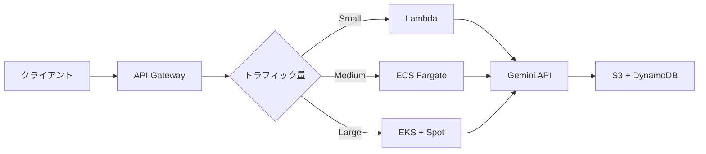

本記事は [Gemini 2.5: Pushing the Frontier with Advanced Reasoning, Multimodality, Long Context, and Next Generation Agentic Capabilities (Comanici et al., 2025)](https://arxiv.org/abs/2507.06261) の解説記事です。本記事は引用・解説であり、筆者自身が実験を行ったものではありません。

## 論文概要（Abstract）

Gemini 2.5は、Google DeepMindが開発した大規模マルチモーダルモデルファミリーである。著者らは、推論・マルチモーダル理解・長コンテキスト処理・エージェント能力の4つの軸で性能を向上させたと報告している。テキスト・画像・動画・音声・PDFの5種類の入力をネイティブに統合処理し、最大3時間の動画を単一リクエストで処理でき、1,048,576トークンのコンテキストウィンドウを備える。

この記事は [Zenn記事: Gemini 2.5のマルチモーダル入力理解を活用した実践パターン4選](https://zenn.dev/0h_n0/articles/d1e65e3e69c087) の深掘りです。

## 情報源

- **arXiv ID**: 2507.06261
- **URL**: [https://arxiv.org/abs/2507.06261](https://arxiv.org/abs/2507.06261)
- **著者**: Gheorghe Comanici, Eric Bieber, Mike Schaekermann et al.（Google DeepMind, 1000名以上の共著者）
- **発表年**: 2025年（初版: 7月7日、v6: 12月19日更新）
- **分野**: cs.CL, cs.AI

## 背景と動機（Background & Motivation）

大規模言語モデルは急速に進歩しているが、マルチモーダル理解、長コンテキスト処理、複雑な推論、エージェント的振る舞いの4能力を高水準で統合することは依然として課題であった。従来のモデルはテキスト処理に優れてもマルチモーダル入力が限定的であったり、マルチモーダル対応でもコンテキスト長に制約があった。

著者らは、実世界のタスクで求められる「動画を理解し、長い文書と照合し、推論して外部ツールで行動する」複合能力を単一モデルで実現することを目指している。Gemini 2.5ファミリーはPro, Flash, 2.0 Flash, Flash-Liteの4モデルで性能とコストのパレートフロンティアをカバーする。

## 主要な貢献（Key Contributions）

- **マルチモーダル統合**: MMMU 82.0%、Video-MME（AV）84.3%を達成（技術レポートのベンチマーク表より）
- **長コンテキスト**: LOFT 1Mで69.8%（従来47.1%から+22.7pt）
- **推論能力**: Thinkingモード（1,024-32,768トークン思考予算）でAIME 2025: 88.0%、GPQA Diamond: 86.4%
- **コーディング**: Aider Polyglot 82.2%（従来16.9%から約5倍）、SWE-bench Verified（複数試行）67.2%
- **コスト効率モデル**: FlashがMMU 79.7%をProの約1/4コストで達成
- **学習基盤**: TPUv5p 8,960チップポッドで93.4%計算利用効率

## 技術的詳細（Technical Details）

### アーキテクチャとマルチモーダルトークン化

Gemini 2.5はTransformerベースのアーキテクチャで、GLaM/PaLMの系譜からMoE要素を含むと推測される（パラメータ数は非公開）。各モダリティは以下のようにトークン化される。

| モダリティ | トークン消費量 | 備考 |
|-----------|-------------|------|
| 画像 | 約258 → 66トークン/枚 | v6で約4倍効率化 |
| 動画（標準） | 約300トークン/秒 | 1fpsサンプリング |
| 動画（低解像度） | 約100トークン/秒 | 最大3時間処理可能 |
| 音声 | 約32トークン/秒 | 200以上の言語対応 |

画像トークンの258→66削減により、1Mコンテキスト内で最大3時間の動画を処理可能になった。

### Thinkingモード

制御可能なThinkingモードは推論時に内部思考チェーンを生成する機構である。

$$
y = f_\theta(x, t)
$$

ここで$x$は入力、$t$は思考予算トークン数（1,024-32,768）、$y$は出力である。著者らは$t$増加に対する単調な性能向上を報告している。

```python
from google import genai
from google.genai import types

client = genai.Client(api_key="YOUR_API_KEY")

def generate_with_thinking(
    prompt: str,
    thinking_budget: int = 8192,
    model: str = "gemini-2.5-pro",
) -> str:
    """Thinkingモード制御付きでGemini 2.5を呼び出す

    Args:
        prompt: 入力プロンプト
        thinking_budget: 思考トークン数 (1024-32768)
        model: モデル名

    Returns:
        出力テキスト
    """
    response = client.models.generate_content(
        model=model,
        contents=prompt,
        config=types.GenerateContentConfig(
            thinking_config=types.ThinkingConfig(
                thinking_budget=thinking_budget,
            ),
        ),
    )
    return response.text
```

### 学習基盤

- **ハードウェア**: TPUv5p、複数8,960チップポッドでの同期データ並列学習
- **計算利用効率**: 93.4%、弾力性スループット97%（障害時）
- **サイレントデータ破損**: 0.25%ステップリプレイ率で検出・復旧

## 実装のポイント（Implementation）

### Pro/Flash使い分け

| 項目 | Pro | Flash |
|------|-----|-------|
| 入力コスト（≤200k） | $1.25/1M | $0.30/1M |
| 出力コスト | $10.00/1M | $2.50/1M |
| コンテキスト/出力上限 | 1M / 65K | 1M / 65K |
| MMMU / GPQA Diamond | 81.7% / 84.4% | 79.7% / 79.0% |
| AIME 2025 | 87.7% | 73.3% |

Flashの入力コストはProの約1/4で、MMMU差は2pt。定型データ抽出や大量画像処理にはFlash、複雑な推論にはProが適切である。

## Production Deployment Guide

Gemini APIをAWSから呼び出すマルチモーダル処理パイプラインの構成を示す。コスト試算は2026年8月時点のap-northeast-1料金に基づく概算値である。

### AWS実装パターン（コスト最適化重視）



| 構成 | トラフィック | 主要サービス | 月額概算 |
|------|------------|-------------|---------|
| Small | ~100 req/日 | Lambda + S3 + DynamoDB | ~$44 |
| Medium | ~1,000 req/日 | ECS Fargate + ElastiCache | ~$241 |
| Large | 10,000+ req/日 | EKS + Spot + CloudFront | ~$1,458 |

**コスト削減テクニック**: Spot Instances活用で最大90%削減、Reserved Instances 1年コミットで最大72%削減、Gemini Batch APIで50%削減、Prompt Caching有効化で30-90%削減。

### Terraformインフラコード（Small構成）

```hcl
terraform {
  required_version = ">= 1.9"
  required_providers {
    aws = { source = "hashicorp/aws", version = "~> 5.60" }
  }
}
provider "aws" { region = "ap-northeast-1" }

resource "aws_s3_bucket" "media" { bucket_prefix = "gemini-media-" }
resource "aws_s3_bucket_server_side_encryption_configuration" "media" {
  bucket = aws_s3_bucket.media.id
  rule { apply_server_side_encryption_by_default { sse_algorithm = "aws:kms" } }
}
resource "aws_s3_bucket_lifecycle_configuration" "media" {
  bucket = aws_s3_bucket.media.id
  rule { id = "cleanup"; status = "Enabled"; expiration { days = 7 } }
}

resource "aws_dynamodb_table" "results" {
  name = "gemini-results"; billing_mode = "PAY_PER_REQUEST"
  hash_key = "request_id"; range_key = "created_at"
  attribute { name = "request_id"; type = "S" }
  attribute { name = "created_at"; type = "S" }
  server_side_encryption { enabled = true }
  point_in_time_recovery { enabled = true }
}

resource "aws_secretsmanager_secret" "api_key" {
  name = "gemini-api-key"; description = "Gemini API Key"
}

resource "aws_iam_role" "lambda" {
  name = "gemini-lambda-role"
  assume_role_policy = jsonencode({
    Version = "2012-10-17"
    Statement = [{ Action = "sts:AssumeRole", Effect = "Allow",
      Principal = { Service = "lambda.amazonaws.com" } }]
  })
}

resource "aws_lambda_function" "processor" {
  function_name = "gemini-processor"; runtime = "python3.12"
  handler = "handler.lambda_handler"; role = aws_iam_role.lambda.arn
  timeout = 60; memory_size = 512
  environment {
    variables = {
      RESULTS_TABLE = aws_dynamodb_table.results.name
      MEDIA_BUCKET  = aws_s3_bucket.media.id
      SECRET_NAME   = aws_secretsmanager_secret.api_key.name
      GEMINI_MODEL  = "gemini-2.5-flash"
    }
  }
  filename = "lambda_package.zip"
}
```

#### Large構成（EKS + Karpenter）

```hcl
module "eks" {
  source = "terraform-aws-modules/eks/aws"; version = "~> 20.24"
  cluster_name = "gemini-processing"; cluster_version = "1.31"
  vpc_id = module.vpc.vpc_id; subnet_ids = module.vpc.private_subnets
  eks_managed_node_groups = {
    system = { instance_types = ["t3.medium"]; min_size = 1; max_size = 2 }
  }
}

resource "kubectl_manifest" "karpenter_nodepool" {
  yaml_body = yamlencode({
    apiVersion = "karpenter.sh/v1"; kind = "NodePool"
    metadata = { name = "gemini-workers" }
    spec = { template = { spec = { requirements = [
      { key = "karpenter.sh/capacity-type", operator = "In",
        values = ["spot", "on-demand"] },
      { key = "node.kubernetes.io/instance-type", operator = "In",
        values = ["c6i.xlarge", "c6i.2xlarge", "c7i.xlarge"] }
    ] } }, limits = { cpu = "32", memory = "64Gi" } }
  })
}

resource "aws_budgets_budget" "monthly" {
  name = "gemini-monthly"; budget_type = "COST"
  limit_amount = "2000"; limit_unit = "USD"; time_unit = "MONTHLY"
  notification {
    comparison_operator = "GREATER_THAN"; threshold = 80
    threshold_type = "PERCENTAGE"; notification_type = "ACTUAL"
    subscriber_email_addresses = ["ops@example.com"]
  }
}
```

### 運用・監視設定

```python
import boto3
from aws_xray_sdk.core import xray_recorder, patch_all

patch_all()  # boto3自動計装

def setup_monitoring(function_name: str, sns_arn: str = "") -> None:
    """CloudWatchアラームとX-Rayトレーシングを設定する

    Args:
        function_name: Lambda関数名
        sns_arn: 通知先SNSトピックARN
    """
    cw = boto3.client("cloudwatch", region_name="ap-northeast-1")
    cw.put_metric_alarm(
        AlarmName=f"{function_name}-high-invocations",
        MetricName="Invocations", Namespace="AWS/Lambda",
        Statistic="Sum", Period=86400, EvaluationPeriods=1,
        Threshold=500, ComparisonOperator="GreaterThanThreshold",
        AlarmActions=[sns_arn] if sns_arn else [],
        Dimensions=[{"Name": "FunctionName", "Value": function_name}],
    )

@xray_recorder.capture("gemini_process")
def process_request(media_type: str, s3_key: str) -> dict:
    """X-Rayトレーシング付きでリクエストを処理する

    Args:
        media_type: メディアタイプ ('image', 'video', 'pdf')
        s3_key: S3上のファイルキー

    Returns:
        処理結果
    """
    sub = xray_recorder.current_subsegment()
    sub.put_annotation("media_type", media_type)
    return {"status": "success"}
```

**CloudWatch Logs Insights**でのコスト異常検知クエリ:

```
fields @timestamp, @message
| filter @message like /gemini_api_call/
| stats count() as calls by bin(1h)
| sort calls desc | limit 24
```

### コスト最適化チェックリスト

**アーキテクチャ**: トラフィック100req/日未満→Lambda、100-5000→Fargate、5000+→EKS+Spot

**リソース最適化**: Spot優先(90%削減) / RI 1年(72%削減) / Savings Plans(66%削減) / Lambdaメモリ最適化 / アイドル時スケールダウン

**Gemini APIコスト**: Batch API(50%削減) / Prompt Caching(30-90%削減) / Flash/Pro動的切替 / max_output_tokens制限 / thinking_budget=0で思考無効化

**監視**: AWS Budgets / CloudWatchアラーム / Cost Anomaly Detection / 日次レポート / トークン使用量ダッシュボード

**リソース管理**: S3ライフサイクル(7日削除) / Projectタグ / Logs保持30日 / 開発環境夜間停止 / 週次コストレビュー

## 実験結果（Results）

技術レポートのベンチマーク表から、Gemini 1.5 Pro→2.5 Proの主要改善を示す。

| ベンチマーク | カテゴリ | 1.5 Pro | 2.5 Pro | 改善 |
|------------|---------|---------|---------|------|
| MMMU | マルチモーダル | 67.7% | 82.0% | +14.3pt |
| Video-MME (AV) | 動画理解 | 70.4% | 84.3% | +13.9pt |
| LOFT (1M) | 長コンテキスト | 47.1% | 69.8% | +22.7pt |
| AIME 2025 | 数学推論 | 17.5% | 88.0% | +70.5pt |
| GPQA Diamond | 科学推論 | 58.1% | 86.4% | +28.3pt |
| Aider Polyglot | コーディング | 16.9% | 82.2% | +65.3pt |
| SWE-bench (複数) | エージェント | 34.2% | 67.2% | +33.0pt |
| Global MMLU | 知識 | 80.8% | 89.2% | +8.4pt |

AIME 2025で+70.5pt、Aider Polyglotで+65.3ptの改善はThinkingモードに起因すると著者らは報告している。一方MRCR-V2 1Mは16.4%にとどまり、1Mトークン規模での情報検索には課題が残る。LMArena EloではPro +122pt、Flash +111ptの改善を記録した。

## 実運用への応用（Practical Applications）

Zenn記事の4パターン（動画解析・物体検出・PDF抽出・Function Calling）は本論文の能力を直接活用している。Video-MME 84.3%により会議録画の議事録生成が実用的精度で可能になり、1時間動画のFlash処理は約$0.33である。MMMU 82.0%は表・図を含むPDFからの構造化データ抽出に直結する。SWE-bench 67.2%はマルチモーダルFunction Callingのバックボーンとなるが、画像認識誤りの後続アクションへの波及リスクがあるため確認ステップの設計が推奨される。

## 関連研究（Related Work）

- **GPT-4o (OpenAI, 2024)**: テキスト・画像・音声のマルチモーダル処理。Gemini 2.5は動画処理と1Mコンテキストで差別化
- **Claude 3.5 Sonnet (Anthropic, 2024)**: コーディングベンチマークで高性能。Gemini 2.5 Proは推論ベンチマークで同等以上を報告
- **Qwen-VL (Alibaba, 2024)**: オープンソースのマルチモーダルモデル。MMMUで競争力ある性能を示す
- **GLaM / PaLM / Gemini 1.0-1.5 (Google)**: Gemini 2.5の直接的先行モデル。MoEの系譜を引き継ぎThinkingモードを追加

## まとめと今後の展望

Gemini 2.5はマルチモーダル理解・長コンテキスト・推論・エージェント能力を統合し、多くのベンチマークで当時の最高水準を達成した。Thinkingモードによる推論向上（AIME +70.5pt）とマルチモーダル進歩（MMMU +14.3pt）が顕著である。今後の課題として1Mコンテキストでの情報検索精度改善、ベンチマーク飽和への新評価手法、マルチモーダルエージェントの安全性向上が著者らにより指摘されている。

## 参考文献

- **arXiv**: [https://arxiv.org/abs/2507.06261](https://arxiv.org/abs/2507.06261)
- **Gemini 2.5 Pro Model Card**: [https://ai.google.dev/gemini-api/docs/models/gemini-2.5-pro](https://ai.google.dev/gemini-api/docs/models/gemini-2.5-pro)
- **Gemini API Pricing**: [https://ai.google.dev/gemini-api/docs/pricing](https://ai.google.dev/gemini-api/docs/pricing)
- **Related Zenn article**: [https://zenn.dev/0h_n0/articles/d1e65e3e69c087](https://zenn.dev/0h_n0/articles/d1e65e3e69c087)
