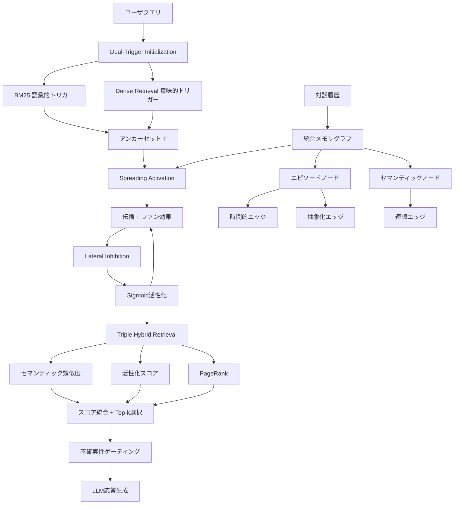

## 論文概要

本記事は [arXiv: 2601.02744](https://arxiv.org/abs/2601.02744) の解説記事です。

Synapseは、LLMエージェントのメモリを動的グラフとしてモデル化し、拡散活性化（Spreading Activation）によってクエリに応じた関連性を動的に導出するメモリアーキテクチャである。エピソード記憶とセマンティック記憶を統合グラフ上で表現し、横抑制（Lateral Inhibition）と時間減衰（Temporal Decay）を組み合わせることで、従来のベクトル検索では困難だった時間的推論やマルチホップ推論において高い性能を達成している。LoCoMoベンチマークにおいて、既存手法を上回る平均F1スコア40.5を記録したと著者らは報告している。

## 情報源

| 項目 | 内容 |
|------|------|
| arXiv ID | [2601.02744](https://arxiv.org/abs/2601.02744) |
| URL | [https://arxiv.org/abs/2601.02744](https://arxiv.org/abs/2601.02744) |
| 著者 | Hanqi Jiang, Junhao Chen, Yi Pan et al. |
| 発表年 | 2026年1月（改訂: 2026年2月） |
| 分野 | cs.CL（計算言語学） |

## 背景と動機

LLMエージェントが長期的な対話を行う際、過去の会話内容を適切に想起する仕組みが不可欠である。従来のRAG（Retrieval-Augmented Generation）ベースのメモリシステムは、ベクトル類似度による静的な検索に依存しており、以下の課題を抱えていた。

第一に、**文脈的孤立（Contextual Isolation）** の問題がある。意味的に類似していないが因果的に関連する記憶同士を結びつけることができない。例えば「先月の旅行で食べた料理」と「アレルギーの話題」はベクトル空間上では離れているが、対話文脈では密接に関連する。

第二に、**時間的推論の困難さ**がある。「最近の話題」と「以前の話題」の区別が静的な埋め込みでは困難であり、古い情報が新しい情報と同等に扱われてしまう。

第三に、**マルチホップ推論の限界**がある。複数の記憶を連鎖的にたどる必要がある質問に対し、単一のベクトル検索では対応できない。

著者らはこれらの課題に対し、神経科学の拡散活性化理論に着想を得た動的グラフベースのアプローチを提案している。

## 主要な貢献

著者らは以下の3つを主要な貢献として挙げている。

- **統合エピソード・セマンティックグラフ**: 対話履歴（エピソード記憶）と抽象概念（セマンティック記憶）を単一のグラフ構造に統合し、時間的エッジ・抽象化エッジ・連想エッジの3種類のエッジで接続するアーキテクチャを提案
- **拡散活性化に基づく動的検索**: クエリに応じてグラフ上で活性化信号を伝播させ、横抑制と時間減衰を適用することで、文脈に応じた関連記憶の動的な浮上を実現
- **Triple Hybrid Retrieval戦略**: セマンティック類似度・活性化スコア・PageRankの3信号を融合した検索手法により、既存手法と比較して95%のトークン削減を達成しつつ、LoCoMoベンチマークで最高性能を記録

## 技術的詳細

### メモリグラフの構築

Synapseのメモリは統合グラフ $G = (V, E)$ として表現される。ノード集合 $V$ はエピソードノード $V_E$ とセマンティックノード $V_S$ に分割される。

**エピソードノード** $v_i^e = (c_i, h_i, \tau_i)$ は個々の対話ターンを表す。$c_i$ はテキスト内容、$h_i \in \mathbb{R}^{384}$ は all-MiniLM-L6-v2 による密埋め込み、$\tau_i$ はタイムスタンプである。

**セマンティックノード** $v_j^s = (s, h_s)$ は抽象概念（エンティティ、ユーザの嗜好など）を表す。LLMにより $N=5$ ターンごとにエピソードから抽出され、埋め込み類似度 $\tau_{dup} = 0.92$ 以上の既存ノードとは重複排除される。

エッジは3種類で構成される。**時間的エッジ**は連続するエピソード間を接続する。**抽象化エッジ**はエピソードとそこから抽出された概念を双方向に接続する（重み0.8）。**連想エッジ**はセマンティックノード間の潜在的な概念相関をセマンティック類似度に基づいて接続する。

スケーラビリティのため、ノードあたりの入力エッジ数は $K=15$ に制限され、活性化が閾値 $\varepsilon = 0.01$ を $W=10$ ウィンドウにわたって下回るノードはガベージコレクションの対象となる。グラフ全体のノード数上限は $\|V\| \leq 10{,}000$ と設定されている。

### Spreading Activation（拡散活性化）

クエリが入力されると、まずBM25（語彙的トリガー）と密検索（意味的トリガー）の和集合によりアンカーセット $T$ が決定され、各アンカーノードの初期活性化が設定される。

$$a_i(0) = \begin{cases} \alpha \cdot \text{sim}(h_i, h_q) & \text{if } v_i \in T \\ 0 & \text{otherwise} \end{cases}$$

ここで $\alpha$ はスケーリングハイパーパラメータ、$\text{sim}(\cdot)$ はコサイン類似度である。

活性化信号は $T=3$ イテレーションにわたってグラフ上を伝播する。伝播式は以下の通りである。

$$u_i(t+1) = (1-\delta) \cdot a_i(t) + \sum_{j \in N(i)} \frac{S \cdot w_{ji} \cdot a_j(t)}{\text{fan}(j)}$$

$S = 0.8$ は拡散係数、$\delta = 0.5$ は減衰パラメータ、$\text{fan}(j) = \deg_{out}(j)$ はファン効果（出次数による正規化）を表す。エッジ重み $w_{ji}$ は、時間的エッジの場合 $w_{ji} = e^{-\rho \|\tau_i - \tau_j\|}$（$\rho = 0.01$）、セマンティックエッジの場合は埋め込み類似度となる。

### Lateral Inhibition（横抑制）

生物の神経系における横抑制を模倣し、活性化の高いノードが競合ノードを抑制する。

$$\hat{u}_i(t+1) = \max\left(0, \, u_i(t+1) - \beta \sum_{k \in T_M} \left(u_k(t+1) - u_i(t+1)\right) \cdot \mathbb{1}[u_k(t+1) > u_i(t+1)] \right)$$

$\beta = 0.15$ は抑制強度、$T_M$ は活性化ポテンシャル上位 $M=7$ のノード集合である。この機構により、密なグラフにおけるハブノードの爆発的活性化が抑制され、無関係なノードの信号が除去される。アブレーション実験では、横抑制を除去すると敵対的質問のF1が96.6から71.5に低下すると報告されている。

### Temporal Decay（時間減衰）

時間減衰はエッジ重みとして実装される。時間的エッジの重みは以下の指数減衰関数で計算される。

$$w_{ji} = e^{-\rho |\tau_i - \tau_j|}$$

$\rho = 0.01$ は時間減衰率である。これにより、長い時間間隔をまたぐエッジの重みが小さくなり、最近の情報が優先的に伝播する。

抑制後のポテンシャルにはシグモイド活性化関数が適用される。

$$a_i(t+1) = \sigma(\hat{u}_i(t+1)) = \frac{1}{1 + \exp(-\gamma(\hat{u}_i(t+1) - \theta))}$$

$\gamma = 5.0$ は急峻度、$\theta = 0.5$ は閾値パラメータである。

### Triple Hybrid Retrieval戦略

最終的な検索スコアは、3つの直交する信号を線形結合して算出される。

$$S(v_i) = \lambda_1 \cdot \text{sim}(h_i, h_q) + \lambda_2 \cdot a_i(T) + \lambda_3 \cdot \text{PageRank}(v_i)$$

各信号の役割と重みは以下の通りである。

| 信号 | 重み | 役割 |
|------|------|------|
| セマンティック類似度 | $\lambda_1 = 0.5$ | クエリとノードの密埋め込み類似度 |
| 活性化スコア | $\lambda_2 = 0.3$ | 拡散活性化によるクエリ固有の関連性 |
| PageRank | $\lambda_3 = 0.2$ | クエリに依存しないグラフ構造上のハブ重要度 |

上位 $k=30$ ノードが取得され、トポロジカル順序で再配置される。

### 不確実性ゲーティング

検索結果の信頼度がゲート閾値 $\tau_{gate} = 0.12$ を下回る場合、エージェントは回答を拒否し、明示的な確認プロンプトを生成する。著者らの報告では、$\tau_{gate} = 0.12$ において敵対的F1が96.6、誤拒否率が2.1%となる。

### アーキテクチャ全体像



## 実装のポイント

Synapseの実装において著者らが採用している設計判断を整理する。

**埋め込みモデルの選択**: all-MiniLM-L6-v2（384次元）を使用している。軽量なモデルを選択し、ノードあたりのメモリフットプリントを抑制している点が実用的である。

**統合（Consolidation）の頻度**: $N=5$ ターンごとにセマンティックノードの抽出と重複排除を実行する。毎ターン実行しない理由として、LLM呼び出しコストの抑制とグラフの安定性維持が挙げられる。

**拡散イテレーション数**: $T=3$ に固定されている。著者らのハイパーパラメータ感度分析では $T=2$--$4$ の範囲で安定した性能が得られると報告されている。

**エッジ剪定**: ノードあたりの入力エッジ数を $K=15$ に制限することで、グラフの密度が制御される。ファン効果（出次数による正規化）と組み合わせることで、ハブノードからの活性化信号の過剰な拡散を防いでいる。

**ガベージコレクション**: 活性化が $\varepsilon = 0.01$ を $W=10$ ウィンドウにわたって下回るノードを除去する。これにより、グラフサイズの上限 $\|V\| \leq 10{,}000$ が維持される。

## Production Deployment Guide

Synapseのアーキテクチャを本番環境に展開する際の設計パターンを、AWSサービスを中心に整理する。本セクションは論文の内容を基に筆者が検討した実装案であり、論文著者による推奨ではない点に留意されたい。

### メモリグラフのストレージ設計

Synapseのグラフ構造は、ノード属性（テキスト、埋め込み、タイムスタンプ）とエッジ（時間的・抽象化・連想）で構成される。本番環境では以下の2層構成が考えられる。

**グラフストア**: Amazon Neptune（グラフDB）をノードとエッジの永続化に使用する。Neptune は openCypher クエリに対応しており、エッジのトラバーサルや近傍ノードの取得に適している。ノードプロパティとしてテキスト内容・タイムスタンプを保持し、エッジプロパティとして重みとエッジ種別を保持する。

**ベクトルストア**: Amazon OpenSearch Serverless（ベクトル検索）を埋め込みベクトルのインデックスに使用する。Dual-Trigger Initialization における Dense Retrieval はベクトル検索で実行し、BM25 による語彙的トリガーも OpenSearch のテキスト検索機能で対応できる。

```python
from dataclasses import dataclass
from enum import Enum
from typing import Optional
import numpy as np


class EdgeType(Enum):
    TEMPORAL = "temporal"
    ABSTRACTION = "abstraction"
    ASSOCIATION = "association"


@dataclass(frozen=True)
class MemoryNode:
    """メモリグラフのノード表現."""

    node_id: str
    content: str
    embedding: np.ndarray  # shape: (384,)
    timestamp: float
    node_type: str  # "episodic" or "semantic"


@dataclass(frozen=True)
class MemoryEdge:
    """メモリグラフのエッジ表現."""

    source_id: str
    target_id: str
    edge_type: EdgeType
    weight: float


def compute_temporal_weight(
    tau_i: float, tau_j: float, rho: float = 0.01
) -> float:
    """時間減衰に基づくエッジ重みを計算する.

    Args:
        tau_i: ノードiのタイムスタンプ
        tau_j: ノードjのタイムスタンプ
        rho: 時間減衰率（論文デフォルト: 0.01）

    Returns:
        指数減衰によるエッジ重み
    """
    return float(np.exp(-rho * abs(tau_i - tau_j)))
```

### 拡散活性化の計算基盤

拡散活性化は $T=3$ イテレーションのグラフ上計算であり、ノード数上限が10,000であることから、単一リクエスト内でのレイテンシは比較的小さい（論文報告値: 1.9秒）。

**計算パターン**: AWS Lambda または ECS Fargate 上で活性化計算を実行する。グラフ全体をメモリに載せる場合、384次元 x 10,000ノード = 約15MBの埋め込み + グラフ構造であり、Lambda のメモリ制限（最大10GB）内に十分収まる。

**キャッシュ戦略**: 論文では PageRank やセマンティック類似度のキャッシュを統合（Consolidation）時にのみ更新すると述べられている（$N=5$ ターンごと）。Amazon ElastiCache（Redis）を用いて、ノードごとの PageRank スコアと事前計算済みの類似度行列をキャッシュすることで、リクエストごとの計算量を削減できる。

```python
import math


def spreading_activation(
    graph_nodes: dict[str, MemoryNode],
    adjacency: dict[str, list[tuple[str, float]]],
    anchor_ids: set[str],
    query_embedding: np.ndarray,
    s: float = 0.8,
    delta: float = 0.5,
    beta: float = 0.15,
    gamma: float = 5.0,
    theta: float = 0.5,
    m_top: int = 7,
    t_iterations: int = 3,
) -> dict[str, float]:
    """拡散活性化を実行する.

    Args:
        graph_nodes: ノードIDからMemoryNodeへのマッピング
        adjacency: ノードIDから(隣接ノードID, エッジ重み)リストへのマッピング
        anchor_ids: アンカーセットに含まれるノードID集合
        query_embedding: クエリの埋め込みベクトル
        s: 拡散係数
        delta: 減衰パラメータ
        beta: 横抑制強度
        gamma: シグモイド急峻度
        theta: シグモイド閾値
        m_top: 横抑制の上位ノード数
        t_iterations: 伝播イテレーション数

    Returns:
        ノードIDから最終活性化スコアへのマッピング
    """
    activations: dict[str, float] = {}
    for nid, node in graph_nodes.items():
        if nid in anchor_ids:
            sim = float(
                np.dot(node.embedding, query_embedding)
                / (np.linalg.norm(node.embedding) * np.linalg.norm(query_embedding) + 1e-8)
            )
            activations[nid] = max(0.0, sim)
        else:
            activations[nid] = 0.0

    for _t in range(t_iterations):
        potentials: dict[str, float] = {}
        for nid in graph_nodes:
            neighbors = adjacency.get(nid, [])
            propagated = sum(
                s * w * activations.get(jid, 0.0) / max(len(adjacency.get(jid, [])), 1)
                for jid, w in neighbors
            )
            potentials[nid] = (1 - delta) * activations[nid] + propagated

        # Lateral Inhibition
        sorted_nodes = sorted(potentials.items(), key=lambda x: x[1], reverse=True)
        top_m = {nid for nid, _ in sorted_nodes[:m_top]}
        top_m_vals = {nid: val for nid, val in sorted_nodes[:m_top]}

        inhibited: dict[str, float] = {}
        for nid, u_val in potentials.items():
            inhibition = sum(
                (top_m_vals[k] - u_val)
                for k in top_m
                if top_m_vals[k] > u_val
            )
            inhibited[nid] = max(0.0, u_val - beta * inhibition)

        # Sigmoid activation
        for nid, u_hat in inhibited.items():
            activations[nid] = 1.0 / (1.0 + math.exp(-gamma * (u_hat - theta)))

    return activations
```

### Terraformによるインフラ定義

```hcl
# Neptune クラスター（グラフストア）
resource "aws_neptune_cluster" "synapse_graph" {
  cluster_identifier  = "synapse-memory-graph"
  engine              = "neptune"
  instance_class      = "db.r6g.large"
  apply_immediately   = true
  skip_final_snapshot = false

  tags = {
    Service = "synapse-memory"
  }
}

# OpenSearch Serverless（ベクトル検索 + BM25）
resource "aws_opensearchserverless_collection" "synapse_vectors" {
  name = "synapse-vectors"
  type = "VECTORSEARCH"

  tags = {
    Service = "synapse-memory"
  }
}

# ElastiCache（PageRank / 類似度キャッシュ）
resource "aws_elasticache_replication_group" "synapse_cache" {
  replication_group_id = "synapse-activation-cache"
  description          = "Cache for PageRank and precomputed similarities"
  engine               = "redis"
  node_type            = "cache.r6g.large"
  num_cache_clusters   = 2

  tags = {
    Service = "synapse-memory"
  }
}
```

### 監視設計

Synapseの運用において監視すべきメトリクスを整理する。

**グラフ健全性メトリクス**:
- ノード数（上限10,000に対する使用率）
- ガベージコレクション実行回数とノード削除数
- Consolidation実行時のセマンティックノード抽出数

**検索品質メトリクス**:
- 不確実性ゲーティングによる拒否率（目標: 2%前後）
- 拡散活性化の計算レイテンシ（論文報告値: 1.9秒）
- 検索トークン数（論文報告値: 約814トークン）

**コストメトリクス**:
- クエリあたりのLLM API呼び出しコスト（論文報告値: $0.24/1kクエリ）
- Consolidation時のLLM呼び出しコスト

```python
import logging
import json
import time
from typing import Any


logger = logging.getLogger(__name__)


def log_activation_metrics(
    query_id: str,
    node_count: int,
    active_nodes: int,
    latency_ms: float,
    tokens_used: int,
    gating_rejected: bool,
) -> None:
    """拡散活性化の実行メトリクスを構造化ログとして出力する."""
    event: dict[str, Any] = {
        "event": "spreading_activation_completed",
        "level": "INFO",
        "ts": time.time(),
        "request_id": query_id,
        "duration_ms": latency_ms,
        "graph_node_count": node_count,
        "active_node_count": active_nodes,
        "tokens_used": tokens_used,
        "gating_rejected": gating_rejected,
        "node_utilization_pct": round(node_count / 10000 * 100, 1),
    }
    logger.info(json.dumps(event, ensure_ascii=False))
```

## 実験結果

### LoCoMoベンチマーク

著者らはLoCoMoベンチマーク（長期対話記憶の評価データセット）で実験を行っている。以下に論文のTable 2より主要なF1スコアを引用する。バックエンドLLMはGPT-4o-miniで統一されている。

| 手法 | マルチホップ | 時間的 | オープン | 単一ホップ | 敵対的 | 平均 |
|------|:-----------:|:------:|:--------:|:----------:|:------:|:----:|
| MemoryBank | 5.0 | 9.7 | 5.6 | 6.6 | 7.4 | 6.3 |
| GraphRAG | 16.5 | 22.4 | 10.1 | 24.5 | 15.2 | 18.3 |
| MemGPT | 26.7 | 25.5 | 9.2 | 41.0 | 43.3 | 28.0 |
| LangMem | 34.5 | 30.8 | 24.3 | 40.9 | 47.6 | 34.3 |
| A-Mem | 27.0 | 45.9 | 12.1 | 44.7 | 50.0 | 33.3 |
| Zep | 35.5 | 48.5 | 23.1 | 48.0 | 65.4 | 39.7 |
| **Synapse** | **35.7** | **50.1** | **25.9** | **48.9** | **96.6** | **40.5** |

Synapseは全カテゴリでランク1位を達成している。特に敵対的質問（存在しない情報について聞く質問）での96.6というF1スコアは、不確実性ゲーティング機構の有効性を示している。著者らは対数スケール t 検定（$N=500$, $p < 0.05$）により、2位のZepに対する統計的有意差を確認したと報告している。

### トークン効率

論文Table 4より、Synapseの検索に使用されるトークン数は約814トークンであり、フルコンテキスト手法（LoCoMo: 約16,910トークン、MemGPT: 約16,977トークン）と比較して約95%の削減を達成している。コスト効率は167.3（F1/コスト比）と報告されている。

### アブレーション実験

論文Table 3より、各メカニズムの寄与度を示す。

| 除去した要素 | 平均F1 | 低下率 |
|------------|:------:|:-----:|
| 完全版 | 40.5 | - |
| 横抑制なし | 39.4 | -2.7% |
| ファン効果なし | 36.1 | -10.9% |
| ノード減衰なし | 30.7 | -24.2% |
| 活性化ダイナミクスなし | 30.5 | -24.7% |
| グラフ構造なし | 32.9 | -18.8% |
| ベクトルのみ | 25.2 | -37.8% |

特にノード減衰の除去は時間的質問のF1を50.1から14.2に低下させ（72%減）、ファン効果の除去はオープンドメイン質問のF1を25.9から16.8に低下させる（35%減）と報告されている。

## 実運用への応用

Synapseの設計思想は、AWS Bedrock AgentCore Memoryにおけるセマンティック戦略とエピソード戦略の使い分けと密接に関連する。[関連Zenn記事](https://zenn.dev/0h_n0/articles/1dd52a7f22158b)で解説しているAgentCore Memoryでは、Semantic MemoryとEpisodic Memoryを独立した戦略として選択する設計だが、Synapseはこの2種類のメモリを統合グラフ上で動的に結合する点で一歩先を行く。

AgentCore MemoryのPreference戦略がユーザの嗜好を抽出・蓄積する静的なアプローチであるのに対し、Synapseの拡散活性化はクエリに応じて動的に嗜好の関連性を再評価する。例えば「旅行先のレストラン」というクエリに対し、Preference戦略では「好きな料理ジャンル」が固定的に返されるが、Synapseでは最近の旅行エピソードから食事制限の話題、さらにアレルギー情報へとマルチホップで関連記憶が活性化される。

本論文のアプローチは、AgentCore MemoryのようなマネージドサービスにSpreading Activation層を追加するハイブリッド構成の可能性を示唆している。

## 関連研究

著者らは関連研究を以下の3カテゴリに整理している。

- **メモリ割り当てシステム**: MemGPT、MemoryOS、LangMemなど。メモリの階層的管理に焦点を当てるが、検索時の動的な関連性導出は限定的であると著者らは指摘している
- **グラフベース構造化メモリ**: A-Mem、AriGraph、HippoRAG、GraphRAGなど。グラフ構造を用いるが、拡散活性化による動的な関連性伝播は行わない
- **セマンティック類似度/関係性検索**: 標準的なRAG、MemoryBank、ベクトルDBベースの手法。ベクトル類似度のみに依存し、文脈的孤立の問題を抱える

## まとめ

Synapseは、LLMエージェントのメモリを動的グラフとしてモデル化し、拡散活性化・横抑制・時間減衰を組み合わせることで、従来のベクトル検索の限界を克服するアーキテクチャである。LoCoMoベンチマークにおいて平均F1スコア40.5で既存手法を上回り、特に敵対的質問での96.6というスコアは不確実性ゲーティングの有効性を示している。95%のトークン削減により実用的なコスト効率も確保されており、長期対話エージェントのメモリ設計に新たな方向性を提示している。

著者らは制約として、コールドスタート問題（対話履歴が少ない初期段階での性能低下）、認知トンネリング（過度な横抑制による細部の見落とし）、テキストのみのモダリティ制限を挙げている。

## 参考文献

- Jiang, H., Chen, J., Pan, Y., et al. (2026). "SYNAPSE: Empowering LLM Agents with Episodic-Semantic Memory via Spreading Activation." arXiv:2601.02744. [https://arxiv.org/abs/2601.02744](https://arxiv.org/abs/2601.02744)
- Collins, A. M., & Loftus, E. F. (1975). "A spreading-activation theory of semantic processing." *Psychological Review*, 82(6), 407-428.
- Packer, C., et al. (2023). "MemGPT: Towards LLMs as Operating Systems." arXiv:2310.08560.
- Xu, B., et al. (2024). "AriGraph: Learning Knowledge Graph World Models with Episodic Memory for LLM Agents." arXiv:2407.04363.
- Microsoft Research. (2024). "GraphRAG: Graph-based Retrieval-Augmented Generation."
- Zep AI. (2024). "Zep: Long-Term Memory for AI Assistants." [https://www.getzep.com](https://www.getzep.com)
