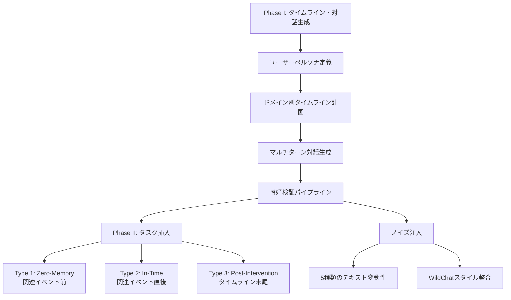
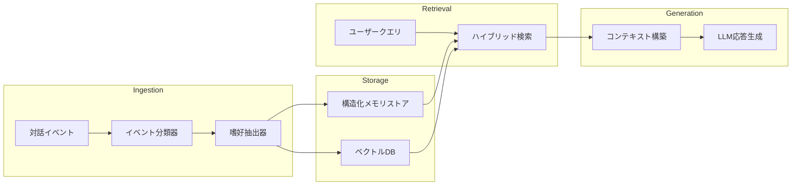

## 論文概要

本記事は [arXiv: 2603.23231](https://arxiv.org/abs/2603.23231) の解説記事です。

PERMAは、LLMエージェントが長期間にわたりユーザーのペルソナを一貫して維持できるかを評価するベンチマークである。従来のベンチマークがユーザー嗜好を静的な「Needle-in-a-Haystack」的想起タスクとして扱っていたのに対し、PERMAはイベント駆動型の対話を通じて嗜好が段階的に蓄積・変化する過程をモデル化している。10名のユーザー、20以上のドメイン、2,166件の嗜好詳細、約180万トークンの文脈を含む大規模ベンチマークであり、テキストの多様性や言語的揺らぎといった現実的な要素も組み込まれている。著者らは、構造化メモリシステムが効率と精度を改善する一方、時間的深さやクロスドメイン干渉の下でのペルソナ一貫性維持は依然として困難であると報告している。

## 情報源

| 項目 | 詳細 |
|------|------|
| arXiv ID | [2603.23231](https://arxiv.org/abs/2603.23231) |
| タイトル | PERMA: Benchmarking Personalized Memory Agents via Event-Driven Preference and Realistic Task Environments |
| 著者 | Shuochen Liu, Junyi Zhu, Long Shu, Junda Lin, Yuhao Chen, Haotian Zhang, Chao Zhang, Derong Xu, Jia Li, Bo Tang, Zhiyu Li, Feiyu Xiong, Enhong Chen, Tong Xu |
| 発表日 | 2026年3月24日（改訂: 2026年5月17日） |
| 分野 | cs.AI |
| リポジトリ | [https://github.com/PolarisLiu1/PERMA](https://github.com/PolarisLiu1/PERMA) |

## 背景と動機

パーソナライズドメモリの研究において、既存ベンチマークには3つの根本的な限界があった。

第一に、ユーザー嗜好が静的な記述として提示され、対話を通じた段階的な形成過程が無視されている点である。PrefEvalやPerLTQAのような初期フレームワークは、固定されたユーザープロファイルを前提としていた。第二に、PersonaMemのようなマルチセッション型ベンチマークでさえ、プロファイルを固定入力として扱い、セッション間の依存関係を捉えていなかった。第三に、評価がLLMの出力品質に焦点を当て、メモリ検索と生成品質を混同していた。

著者らは、現実のパーソナライゼーションではユーザー嗜好がイベント（対話、フィードバック、行動）を通じて時間的に進化する状態であり、これを適切に評価する枠組みが存在しないと指摘している。PERMAはこの課題に対して、時間的に順序付けられたイベント列を通じた嗜好の蓄積と合成を評価対象とする新たなパラダイムを提案している。

## 主要な貢献

著者らが報告しているPERMAの主要な貢献は以下の3点である。

1. **イベント駆動型嗜好モデリング**: 嗜好を静的な属性ではなく、Emergence（初出）、Supplement（補足・修正）、Task（評価クエリ）の3種類のイベントを通じて段階的に蓄積される動的状態としてモデル化した
2. **現実的なノイズと言語的多様性の導入**: コンテキストスイッチ、矛盾する嗜好、多言語混在、口語表現、情報欠落の5種類のテキスト変動性を注入し、WildChatデータセットから実際の対話パターンを取り込んだスタイル整合も実施している
3. **多面的評価プロトコル**: タスク性能（MCQ精度・対話成功率）、メモリ忠実度（BERT-f1・Memory Score）、効率性（コンテキストトークン数・検索遅延）の3軸で、単一ドメイン/マルチドメイン、クリーン/ノイズ、短期/長期の各条件を交差させた体系的な評価を可能にした

## 技術的詳細

### ベンチマーク構成

PERMAのデータ構築は2フェーズで行われる。



#### イベントの形式的定義

各インタラクションイベントは以下の4つ組で定義される。

$$e_t = (\tau_t, \text{dom}_t, C_t, \Phi_t)$$

ここで $$\tau_t$$ はイベントタイプ（Emergence / Supplement / Task）、$$\text{dom}_t$$ は関連ドメイン、$$C_t$$ はマルチターン対話、$$\Phi_t$$ は明示的・暗黙的嗜好を表す。

#### ペルソナ状態と一貫性目標

時刻 $$t$$ までの対話履歴からペルソナ状態を合成する関数 $$f$$ を用いて、以下の最適化目標が定義される。

$$a = \arg\max_{a'} P(a' \mid q_t, S_t^u) \quad \text{s.t.} \quad S_t^u = f(G_{u,\leq t})$$

メモリシステムの場合、$$f$$ は追加（Add）と検索（Search）の2つの操作で構成される。

$$S_t^u \leftarrow \text{Add}(M, G_{u,\leq t})$$

$$s_t \leftarrow \text{Search}(S_t^u, M, q_t, k)$$

#### 評価チェックポイント

タスクは3種類のチェックポイントに配置される。Type 1（Zero-Memory）は関連イベントの前に配置されベースライン制御として機能する。Type 2（In-Time）は全関連イベント直後に配置され最新情報の活用能力を測定する。Type 3（Post-Intervention）はタイムライン末尾で無関係セッション介入後に配置され、時間的深さと干渉への耐性を評価する。

#### テキスト変動性

著者らは5種類のノイズを定義している。情報欠落（不完全な参照）、コンテキストスイッチ（突然の話題転換）、嗜好矛盾（過去の嗜好との不整合）、多言語混在（言語間のコードスイッチング）、口語表現（スラングやくだけた表現）である。ノイズ注入後の対話は以下の式で生成される。

$$C_m^{\text{noise}} \sim P_g(\cdot \mid D_u, \Phi_m, \hat{e}_m, G_{u,m-1}^{\text{noise}}, Z_m)$$

#### データセット統計

論文Table 1より、基本データセットは10ユーザー、808イベント、3,500-3,600対話、324k-331kトークンで構成される。スタイル整合版は1,388イベント、9,158対話、1,165.4kトークンに拡張され、128kトークンのコンテキスト長に対応する。

### 評価メトリクス

評価は3つの軸で行われる。

**タスク性能**: MCQ精度（8カテゴリにわたる多肢選択精度）と対話成功率（Turn=1での即時成功率、Turn<=2での2ターン以内成功率）。対話評価ではLLMベースのユーザーシミュレータが補足フィードバックを提供する。

**メモリ忠実度**: BERT-f1（検索コンテキストと正解対話の類似度）とMemory Score（タスクカバレッジ、精度、嗜好一貫性のLLM判定評価、3点満点）。

**効率性**: コンテキストトークン数（クエリあたりの平均メモリトークン消費量）、検索遅延（ミリ秒）、ユーザートークン数（対話設定でのシミュレータ生成トークン総数）。

## 実装のポイント

PERMAのコードは[GitHub](https://github.com/PolarisLiu1/PERMA)で公開されている。評価対象のメモリシステムは大きく2つのデプロイ形態に分かれる。

クラウドベースAPI型（MemOS、Mem0、Memobase、Supermemory）はSaaS経由で利用する。ローカルデプロイ型（EverMemOS、LightMem）はMongoDBをストレージ、Milvusをベクトルデータベースとして構成する。RAGベースラインにはBGE-M3密検索器を用い、デフォルトのtop-kは10チャンクである。

ベンチマークの検証では、人間評価者がタスク精度97.75%、イベントカバレッジ1.99/2.0、ノイズ適合率98%を達成しており、データ品質の高さが確認されている。

## Production Deployment Guide

PERMAの知見を実運用のパーソナライズドメモリエージェントに適用する際の設計パターンを示す。

### アーキテクチャ概要



### イベント駆動型メモリ管理の実装

PERMAが示すイベント駆動型パラダイムに基づくメモリ管理の実装パターンを示す。

```python
from dataclasses import dataclass, field
from enum import Enum
from datetime import datetime


class EventType(Enum):
    """PERMAで定義されたイベントタイプ。

    Emergence: 嗜好の初出
    Supplement: 既存嗜好の補足・修正
    Task: 評価クエリ（嗜好活用時）
    """
    EMERGENCE = "emergence"
    SUPPLEMENT = "supplement"
    TASK = "task"


@dataclass(frozen=True)
class PreferenceEvent:
    """イベント駆動型の嗜好レコード。

    PERMAの定義 e_t = (tau_t, dom_t, C_t, Phi_t) に対応する。

    Attributes:
        event_type: イベントの種類
        domain: 関連ドメイン（例: "music", "travel"）
        preference_key: 嗜好の識別子
        preference_value: 嗜好の内容
        confidence: 嗜好の確信度（0.0-1.0）
        timestamp: イベント発生時刻
        source_turn_ids: 嗜好を導出した対話ターンのID群
    """
    event_type: EventType
    domain: str
    preference_key: str
    preference_value: str
    confidence: float
    timestamp: datetime
    source_turn_ids: list[str] = field(default_factory=list)


@dataclass
class PersonaState:
    """ユーザーのペルソナ状態。

    PERMAの S_t^u = f(G_{u,<=t}) に対応する。
    時間順に蓄積されたイベントから嗜好を合成する。
    """
    user_id: str
    preferences: dict[str, PreferenceEvent] = field(default_factory=dict)
    event_history: list[PreferenceEvent] = field(default_factory=list)

    def add_event(self, event: PreferenceEvent) -> None:
        """イベントを追加し、嗜好状態を更新する。

        Supplementイベントは既存嗜好を上書きする。
        """
        self.event_history.append(event)
        key = f"{event.domain}:{event.preference_key}"

        if event.event_type == EventType.SUPPLEMENT:
            existing = self.preferences.get(key)
            if existing and existing.timestamp > event.timestamp:
                return  # 古いイベントは無視
        self.preferences[key] = event

    def search(self, query_domain: str, top_k: int = 10) -> list[PreferenceEvent]:
        """ドメインに関連する嗜好を検索する。

        Args:
            query_domain: 検索対象ドメイン
            top_k: 返却する最大件数

        Returns:
            関連度と時間順でソートされた嗜好リスト
        """
        relevant = [
            p for p in self.preferences.values()
            if p.domain == query_domain
        ]
        return sorted(
            relevant,
            key=lambda p: (p.confidence, p.timestamp.timestamp()),
            reverse=True,
        )[:top_k]
```

### AWS上での構成例

PERMAの実験結果から、MemOSが性能と効率のバランスに優れることが示されている。実運用では以下のような構成が考えられる。

```hcl
# Terraform構成例: メモリエージェント基盤

resource "aws_dynamodb_table" "preference_store" {
  name         = "persona-preferences"
  billing_mode = "PAY_PER_REQUEST"
  hash_key     = "user_id"
  range_key    = "preference_key"

  attribute {
    name = "user_id"
    type = "S"
  }

  attribute {
    name = "preference_key"
    type = "S"
  }

  # TTLでペルソナ状態の自動期限管理
  ttl {
    attribute_name = "expires_at"
    enabled        = true
  }
}

resource "aws_opensearchserverless_collection" "vector_store" {
  name = "persona-embeddings"
  type = "VECTORSEARCH"
}
```

### 監視とコスト最適化

PERMAの評価指標体系は、実運用の監視設計にも示唆を与える。論文で定義された3軸（タスク性能・メモリ忠実度・効率性）に対応する監視メトリクスを設計する。

```python
from dataclasses import dataclass


@dataclass(frozen=True)
class MemoryAgentMetrics:
    """PERMAの評価軸に対応する運用メトリクス。

    Attributes:
        retrieval_latency_ms: 検索遅延（Search Duration相当）
        context_tokens: クエリあたりトークン消費量（Context Token相当）
        memory_score: 応答品質スコア（Memory Score相当）
        cache_hit_rate: キャッシュヒット率（コスト最適化指標）
    """
    retrieval_latency_ms: float
    context_tokens: int
    memory_score: float
    cache_hit_rate: float
```

論文Table 4より、MemOSの平均コンテキストトークン数は709.1であり、生対話の34,078.6トークンと比較して約98%の削減を達成している。実運用ではこのトークン圧縮率を監視し、圧縮率が低下した場合はメモリ統合の品質劣化を疑う指標として活用できる。

検索遅延についても、論文のスタイル整合設定（Table 8）ではMemOSが276.3-370.0ms、EverMemOSが10,419.0-13,258.1msと報告されており、SLOの設定基準として参考になる。実運用ではP99遅延500ms以下をターゲットとすることが妥当と考えられる。

コスト面では、DynamoDBのオンデマンド課金とOpenSearch Serverlessの組み合わせにより、ユーザー数に応じたスケーリングが可能となる。PERMAの10ユーザー規模のデータセット（808イベント、330kトークン）を基準に、1ユーザーあたり約80イベント、33kトークンの蓄積を想定した容量設計が推奨される。

## 実験結果

### 全体性能

論文Table 4（クリーン・単一ドメイン）より、主要な結果を示す。

| ベースライン | MCQ精度 | BERT-f1 | Memory Score | コンテキストトークン |
|-------------|---------|---------|--------------|-------------------|
| Kimi-K2.5 | 0.882 | - | - | 34,078.6 |
| Qwen3-32B | 0.870 | - | - | 34,078.6 |
| MemOS | 0.811 | 0.830 | 2.27 | 709.1 |
| RAG | 0.702 | 0.859 | 1.89 | 928.8 |
| Mem0 | 0.686 | 0.781 | 1.91 | 340.1 |
| LightMem | 0.657 | 0.792 | 1.83 | 297.3 |

推論特化モデル（Kimi-K2.5: 0.882）がチャットモデルを上回っている。メモリシステムではMemOSが最高のMCQ精度（0.811）とMemory Score（2.27/3.0）を達成し、トークン消費量を約98%削減している。一方、RAGはBERT-f1で最高値（0.859）を記録するが、断片的な検索結果によりMCQ精度は低下している。

### ノイズ環境での性能変化

論文Table 5（ノイズ・単一ドメイン）より、テキスト変動性を注入した環境ではMemOSのMCQ精度が0.811から0.853に向上したと報告されている。著者らはこれを、ノイズがユーザー嗜好を文脈的に強調する「意味的触媒」として機能するためと分析している。検索トークン量も709.1から1,486.7に増加しており、ノイズ環境でメモリシステムがより多くの文脈を活用していることがわかる。

### クロスドメインの課題

論文Table 6（クリーン・マルチドメイン）より、MemOSのMCQ精度は単一ドメインの0.811からマルチドメインの0.732に低下している。対話評価ではTurn=1成功率が0.548から0.306に急落しており、複数ドメインの嗜好を同時に統合する能力が不足していることが示されている。著者らは、MCQメトリクスが対話設定での品質劣化を覆い隠す傾向があると指摘している。

### 長文コンテキスト評価

論文Table 8（スタイル整合・116kトークン）より、GPT-4o-miniがMCQ精度0.0%を記録した一方、MemOSは0.813（単一ドメイン）を維持している。実際の対話パターンで文脈を拡張した場合、語彙的パターンに依存するモデルは壊滅的に失敗することが明らかになっている。

## 実運用への応用

PERMAの知見は、AWS Bedrock AgentCore Memoryを用いた顧客サポートシステムの設計に直接的な示唆を与える。

第一に、嗜好をイベント駆動型で蓄積する設計が重要である。PERMAが示すように、ユーザー嗜好は単一の対話からではなく、複数セッションにわたるイベント列から段階的に形成される。AgentCore MemoryのPreference戦略においても、1回の対話で嗜好を確定するのではなく、Emergence→Supplementの流れで確信度を段階的に高める設計が求められる。

第二に、クロスドメイン干渉への対策が必要である。論文の結果から、全てのメモリシステムがマルチドメインで性能低下することが示されている。顧客サポートでは「製品の好み」と「コミュニケーションの好み」など異なるドメインの嗜好が混在するため、ドメイン別のメモリパーティショニングが有効と考えられる。

第三に、時間的深さへの耐性を設計に組み込む必要がある。Type 3チェックポイントでの性能低下は、無関係な対話の介入後に過去の嗜好へアクセスする能力の限界を示している。定期的なメモリ統合（consolidation）により、重要な嗜好の保持を保証する仕組みが求められる。

## 関連研究

**PersonaMem / PersonaMem-v2**: マルチセッション対話履歴を用いたパーソナライゼーション評価だが、プロファイルを固定入力として扱い、嗜好の動的変化を捉えていない。

**MemOS**: ライフサイクル対応型のメモリサブシステムで、統合（consolidation）、強化（reinforcement）、減衰（decay）、再編成（reorganization）の操作を備える。PERMAの実験では最も高いバランスを示した。

**KnowMe-Bench**: 長文ナラティブからの推論を評価するが、著者らは対話管理というよりも推論タスクとしての性格が強いと指摘している。

## まとめと今後の展望

PERMAは、パーソナライズドメモリエージェントの評価をイベント駆動型の嗜好蓄積という現実的なパラダイムに移行させた重要なベンチマークである。実験結果から、構造化メモリシステム（特にMemOS）がトークン効率と性能のバランスに優れることが確認された一方、クロスドメイン干渉と時間的深さへの対応は依然として未解決の課題である。今後の研究方向として、タスク複雑度に応じた適応的検索メカニズム、嗜好ドリフトの時間的減衰モデリング、クロスドメイン制約充足フレームワークの開発が期待される。

## 参考文献

- Liu, S., Zhu, J., Shu, L., et al. (2026). PERMA: Benchmarking Personalized Memory Agents via Event-Driven Preference and Realistic Task Environments. arXiv:2603.23231. [https://arxiv.org/abs/2603.23231](https://arxiv.org/abs/2603.23231)
- GitHub リポジトリ: [https://github.com/PolarisLiu1/PERMA](https://github.com/PolarisLiu1/PERMA)
- 関連Zenn記事: [Bedrock AgentCore MemoryのPreference戦略で顧客サポートの応答精度を改善する](https://zenn.dev/0h_n0/articles/1dd52a7f22158b)
