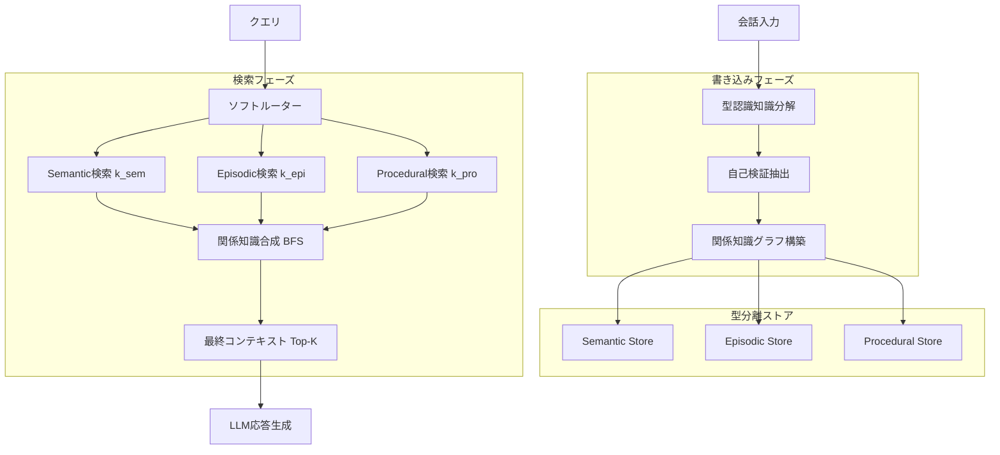

## 論文概要

本記事は [arXiv: 2605.28009](https://arxiv.org/abs/2605.28009) の解説記事です。

MemGuardは、長期メモリ拡張LLMにおける「異種メモリ汚染（heterogeneous memory contamination）」を防止するフレームワークである。文脈依存のエピソード記憶が事実的知識として過剰汎化される問題に対し、メモリを機能型（semantic / episodic / procedural）に分離して格納・検索する手法を提案している。著者らは、HaluMemベンチマークにおいて反ハルシネーション精度を28.27%改善し、LoCoMoベンチマークではトークン検索量を最大5.8倍削減したと報告している。

## 情報源

| 項目 | 内容 |
|------|------|
| arXiv ID | [2605.28009](https://arxiv.org/abs/2605.28009) |
| URL | [https://arxiv.org/abs/2605.28009](https://arxiv.org/abs/2605.28009) |
| 著者 | Hyeonjeong Ha, Jeonghwan Kim, Cheng Qian, Jiayu Liu, William M. Campbell, Yue Wu, Yuji Zhang, Kathleen McKeown, Dilek Hakkani-Tur, Heng Ji |
| 発表年 | 2026年5月 |
| 分野 | cs.CL, cs.AI, cs.LG |

## 背景と動機

長期メモリ拡張LLMでは、過去の会話内容をメモリに蓄積し、将来の応答に活用する。しかし、メモリシステムにおいて異なる機能型の情報が混在すると、深刻な品質劣化が生じる。

例えば、「ユーザーの友人がイブプロフェンを頭痛で服用して改善した」というエピソード記憶が、「イブプロフェンは頭痛に効果的である」という汎化された事実として格納されてしまう。喘息患者であるユーザーに対してこの誤った一般化に基づく推薦がなされれば、医学的に危険な応答となる。

著者らはLoCoMoベンチマークのエラー分析を通じて、検証不能エラー（根拠不十分にもかかわらず応答する誤り）の97.7%が書き込み時の汚染に、事実性エラー（正しい証拠が存在するのに誤答する誤り）の63.8%が検索時の汚染に起因すると報告している。既存のフラット型RAGメモリ、グラフベースメモリ、認知インスパイアド型メモリはいずれも、メモリの機能的境界を保持する仕組みを欠いており、この異種汚染に対して脆弱であった。

## 主要な貢献

著者らが主張する本論文の貢献は以下の3点である。

- **異種メモリ汚染の体系的分析**: 書き込み時・検索時・合成時の3段階における汚染メカニズムを特定し、エラーパターンとの定量的な関連付けを行った
- **機能型保存フレームワークの提案**: メモリの書き込みから検索までの全ライフサイクルにおいて、semantic / episodic / procedural の機能的境界を維持する型認識メモリ管理手法（MemGuard）を設計した
- **効率的な検索の実現**: 型ルーティングによる選択的検索で、精度を維持しつつ検索トークン量を大幅に削減した（LoCoMoにおいて最大5.8倍の削減）

## 技術的詳細

### 異種メモリ汚染の3段階

著者らは、メモリ汚染が以下の3段階で発生すると定義している。

**書き込み時汚染（Write-Time Contamination）**: メモリ構築時に、不完全・陳腐化・捏造・過剰汎化された知識が格納される。エピソード的な個別観察が、根拠なく一般的事実として書き込まれるケースが典型的である。

**検索時汚染（Retrieval-Time Contamination）**: 意味的に関連するが機能的に不適合なメモリが同時に検索される。クエリに対して本来必要な制約情報（semantic）が、無関係なエピソード記憶やprocedural推薦に埋もれてランク低下する。

**合成時失敗（Composition Failures）**: 汚染されたメモリの統合により、モデルが無関係な証拠に基づいて最終応答を歪める。

### 機能型メモリの定義

MemGuardでは3つの機能型を定義している。

| 機能型 | 定義 | 例 |
|--------|------|-----|
| Semantic | 安定した普遍的事実・制約 | 「イブプロフェンは喘息患者の症状を悪化させる」 |
| Episodic | 文脈依存のイベント・観察 | 「ユーザーの友人がイブプロフェンで改善した」 |
| Procedural | 行動指針・推薦 | 「頭痛には一般的な市販鎮痛剤を推薦する」 |

### アーキテクチャ概要

MemGuardの全体アーキテクチャを以下に示す。



### 書き込みフェーズ: 型認識知識分解

会話内容を原子的メモリ単位（atom）に分解する。各atomは以下のタプルで表現される。

$$
a_j = (\text{title}_j, \text{details}_j, \tau_j, t_j)
$$

ここで $\tau_j \in \{\text{semantic}, \text{episodic}, \text{procedural}\}$ は機能型、$t_j$ はタイムスタンプである。各atomには厳密に1つの機能型が割り当てられる。

初回抽出後、自己検証ステップにより未カバー情報を回復する。$\Delta(D, A)$ を回復された不足atomとすると、最終atom集合は以下となる。

$$
A' = A \cup \Delta(D, A)
$$

さらに、atom間の関係を有向型付きグラフ $\mathcal{G} = (\mathcal{V}, \mathcal{E})$ として構築する。ノード $\mathcal{V} = \{v_j \mid v_j \equiv a_j, a_j \in A'\}$ はatomに対応し、エッジ $\mathcal{E} = \{(v_i, v_j, r) \mid v_i, v_j \in \mathcal{V}, r \in \mathcal{R}\}$ は型付き意味関係を符号化する。各atomは対応する型別ストア $\mathcal{M}_{\tau_j}$ にルーティングされ、同一型ストア内のTop-20関連メモリとのみ比較される。書き込み操作はADD（新規挿入）、UPDATE（同一型内の既存改訂）、SKIP（冗長破棄）の3種である。

### 検索フェーズ: 動的型ルーティング

クエリ $q$ に対し、ソフトルーターが型別の関連度分布を推定する。

$$
\mathbf{w} = \rho_{\text{soft}}(q), \quad \sum_{\tau} w_\tau = 1
$$

型別の検索予算は以下で割り当てられる。

$$
k_\tau = \lfloor w_\tau K \rfloor
$$

ここで $K$ は総検索予算である。各型ストアからコサイン類似度に基づくTop-$k_\tau$ 検索を行う。

$$
P_\tau = \text{Top}_{k_\tau}(\mathcal{M}_\tau, \text{sim}(q, m))
$$

埋め込みモデルにはOpenAIのtext-embedding-3-smallが使用されている。

### 関係知識合成

検索された各プライマリ結果 $p_i \in P$ に対し、関係グラフ上でBFS探索を行い関連atomを収集する。

$$
\mathcal{N}_i = \{(v', r, d) \mid v' \in \text{BFS}(v_i, h_{\max}), d \leq h_{\max}\}
$$

関係認識エントリを合成し、ホップ減衰付きスコアで最終ランキングを行う。

$$
\text{score}(c_{i,d,v'}) = \text{sim}(q, c_{i,d,v'}) \cdot \lambda^{(d-1)}
$$

ここで $\lambda = 0.85$（ホップ減衰係数）、$h_{\max} = 2$（最大探索深度）である。最終コンテキストはスコア上位 $K$ 件で構成される。

## 実装のポイント

MemGuardを実装する際の重要な設計判断として、以下の点が挙げられる。

**型分類の正確性**: atom抽出時の機能型分類がシステム全体の性能を左右する。著者らの実験では、LLMベースの分類器（GPT-4.1-mini / GPT-4o-mini）を使用しており、分類精度がボトルネックとなりうる。実運用では分類結果の検証機構を設けることが望ましい。

**ストア間の独立性**: 各型ストアは独立したベクトルインデックスとして管理される。UPDATE操作は同一型ストア内でのみ許可され、型を跨ぐ更新は設計上禁止されている。この制約がメモリ汚染防止の核心である。

**検索予算の配分**: ソフトルーターによる動的配分は、クエリの性質に応じた適応的検索を可能にする。ただし、予算配分の誤りは検索品質に直結するため、ルーターの精度とフォールバック戦略の設計が重要となる。

**関係グラフの管理**: $h_{\max} = 2$、$\lambda = 0.85$ はベンチマークでの最適値であるが、ドメインやメモリ規模によって調整が必要である。グラフの肥大化に対するpruning戦略も実運用では検討すべきである。

## Production Deployment Guide

### メモリ保護のAWSアーキテクチャ

MemGuardの設計原則をプロダクション環境に適用する場合、型分離ストア・ソフトルーター・関係グラフの3コンポーネントをマネージドサービス上に構築することが現実的である。以下にAWS上での実装パターンを示す。

### 全体アーキテクチャ

```mermaid
flowchart TD
    Client[クライアント] --> APIGW[API Gateway]
    APIGW --> Lambda_Router[Lambda: ソフトルーター]
    Lambda_Router --> OS_Sem[OpenSearch: Semantic Store]
    Lambda_Router --> OS_Epi[OpenSearch: Episodic Store]
    Lambda_Router --> OS_Pro[OpenSearch: Procedural Store]

    Lambda_Writer[Lambda: 型認識書き込み] --> Bedrock[Bedrock: 型分類]
    Lambda_Writer --> Neptune[Neptune: 関係グラフ]
    Lambda_Writer --> OS_Sem
    Lambda_Writer --> OS_Epi
    Lambda_Writer --> OS_Pro

    OS_Sem --> Lambda_Compose[Lambda: 関係合成]
    OS_Epi --> Lambda_Compose
    OS_Pro --> Lambda_Compose
    Neptune --> Lambda_Compose
    Lambda_Compose --> Bedrock_Gen[Bedrock: 応答生成]

    subgraph 型分離ベクトルストア
        OS_Sem
        OS_Epi
        OS_Pro
    end

    subgraph メモリ書き込みパイプライン
        Lambda_Writer
        Bedrock
        Neptune
    end

    subgraph 検索・合成パイプライン
        Lambda_Router
        Lambda_Compose
        Bedrock_Gen
    end
```

### 型分離ストアの実装

OpenSearch Serverlessを使用し、機能型ごとに独立したコレクションを作成する。各コレクションはk-NNベクトル検索を有効にし、型の境界を物理的に分離する。

```python
import boto3
from opensearchpy import OpenSearch, RequestsHttpConnection
from pydantic import BaseModel, Field
from enum import Enum
from typing import Literal


class MemoryType(str, Enum):
    SEMANTIC = "semantic"
    EPISODIC = "episodic"
    PROCEDURAL = "procedural"


class MemoryAtom(BaseModel):
    """MemGuardのatomic memory unit."""
    title: str
    details: str
    memory_type: MemoryType
    timestamp: str
    embedding: list[float] = Field(default_factory=list)


# 型別コレクション名のマッピング
COLLECTION_MAP: dict[MemoryType, str] = {
    MemoryType.SEMANTIC: "memguard-semantic",
    MemoryType.EPISODIC: "memguard-episodic",
    MemoryType.PROCEDURAL: "memguard-procedural",
}


def write_memory(
    client: OpenSearch,
    atom: MemoryAtom,
) -> dict:
    """型分離ストアへのメモリ書き込み。

    同一型ストア内のTop-20と比較し、ADD/UPDATE/SKIPを判定する。
    """
    collection = COLLECTION_MAP[atom.memory_type]

    # 同一型ストア内でのみ類似検索（型境界の保持）
    similar = client.search(
        index=collection,
        body={
            "size": 20,
            "query": {
                "knn": {
                    "embedding": {
                        "vector": atom.embedding,
                        "k": 20,
                    }
                }
            },
        },
    )

    # 重複判定とADD/UPDATE/SKIP決定のロジック
    operation = _determine_write_operation(atom, similar["hits"]["hits"])

    if operation == "SKIP":
        return {"action": "SKIP", "reason": "redundant"}

    if operation == "UPDATE":
        doc_id = similar["hits"]["hits"][0]["_id"]
        return client.update(
            index=collection,
            id=doc_id,
            body={"doc": atom.model_dump(exclude={"embedding"})},
        )

    return client.index(
        index=collection,
        body={**atom.model_dump(), "embedding": atom.embedding},
    )
```

### ソフトルーターの実装

Amazon Bedrockを利用して、クエリに対する型別関連度を推定するソフトルーターを構築する。

```python
import json
import boto3
from pydantic import BaseModel


class TypeWeights(BaseModel):
    """ソフトルーターの出力: 型別検索予算配分。"""
    semantic: float
    episodic: float
    procedural: float


def soft_router(
    query: str,
    total_budget: int = 30,
) -> dict[str, int]:
    """クエリの性質に基づき型別の検索予算を動的配分する。

    MemGuard論文のρ_soft(q)に対応する実装。
    """
    bedrock = boto3.client("bedrock-runtime", region_name="us-east-1")

    response = bedrock.converse(
        modelId="us.anthropic.claude-sonnet-4-20250514",
        messages=[{
            "role": "user",
            "content": [{
                "text": f"""Analyze this query and estimate relevance weights
for each memory type. Return JSON only.

Query: {query}

Memory types:
- semantic: stable facts, constraints, definitions
- episodic: context-specific events, personal observations
- procedural: behavioral guidance, recommendations

Return: {{"semantic": 0.X, "episodic": 0.X, "procedural": 0.X}}
Weights must sum to 1.0.""",
            }],
        }],
    )

    weights = TypeWeights.model_validate_json(
        response["output"]["message"]["content"][0]["text"]
    )

    # k_τ = floor(w_τ * K)
    return {
        "semantic": int(weights.semantic * total_budget),
        "episodic": int(weights.episodic * total_budget),
        "procedural": int(weights.procedural * total_budget),
    }
```

### 関係グラフの構築（Amazon Neptune）

atom間の関係をNeptune（グラフDB）に格納し、BFS探索による関係知識合成を実現する。

```python
from gremlin_python.process.graph_traversal import __
from gremlin_python.process.traversal import T
from pydantic import BaseModel


class RelationEdge(BaseModel):
    source_id: str
    target_id: str
    relation_type: str


def build_relation_graph(
    g,  # Gremlin traversal source
    atoms: list[MemoryAtom],
    edges: list[RelationEdge],
) -> None:
    """MemGuardの関係知識グラフ G = (V, E) を構築する。"""
    for atom in atoms:
        g.addV("memory_atom").property(
            T.id, atom.title
        ).property(
            "memory_type", atom.memory_type.value
        ).property(
            "details", atom.details
        ).next()

    for edge in edges:
        # 双方向エッジ（逆方向も格納）
        g.V(edge.source_id).addE(
            edge.relation_type
        ).to(g.V(edge.target_id)).next()

        g.V(edge.target_id).addE(
            f"inv_{edge.relation_type}"
        ).to(g.V(edge.source_id)).next()


def bfs_compose(
    g,
    primary_id: str,
    h_max: int = 2,
    decay: float = 0.85,
) -> list[dict]:
    """BFS探索による関係知識合成。

    score(c) = sim(q, c) * λ^(d-1) に基づくホップ減衰。
    """
    neighbors = (
        g.V(primary_id)
        .repeat(__.both().simplePath())
        .until(__.loops().is_(h_max))
        .emit()
        .path()
        .by(__.valueMap(True))
        .toList()
    )

    composed = []
    for path in neighbors:
        depth = len(path) - 1
        hop_score = decay ** (depth - 1) if depth > 0 else 1.0
        composed.append({
            "atom": path[-1],
            "depth": depth,
            "hop_score": hop_score,
            "relation_path": path,
        })

    return composed
```

### Terraformによるインフラ定義

型分離ストアとグラフDBの基盤をIaCで管理する。

```hcl
# OpenSearch Serverless - 型別コレクション
resource "aws_opensearchserverless_collection" "memguard" {
  for_each = toset(["semantic", "episodic", "procedural"])

  name        = "memguard-${each.key}"
  type        = "VECTORSEARCH"
  description = "MemGuard ${each.key} memory store"
}

resource "aws_opensearchserverless_security_policy" "encryption" {
  for_each = toset(["semantic", "episodic", "procedural"])

  name = "memguard-${each.key}-enc"
  type = "encryption"

  policy = jsonencode({
    Rules = [{
      Resource     = ["collection/memguard-${each.key}"]
      ResourceType = "collection"
    }]
    AWSOwnedKey = true
  })
}

# Amazon Neptune - 関係グラフ
resource "aws_neptune_cluster" "memguard_graph" {
  cluster_identifier                  = "memguard-relation-graph"
  engine                              = "neptune"
  backup_retention_period             = 7
  preferred_backup_window             = "03:00-04:00"
  skip_final_snapshot                 = false
  iam_database_authentication_enabled = true
  storage_encrypted                   = true
}

resource "aws_neptune_cluster_instance" "memguard_graph" {
  count              = 2
  cluster_identifier = aws_neptune_cluster.memguard_graph.id
  instance_class     = "db.r6g.large"
  engine             = "neptune"
}

# CloudWatch - メモリ汚染検知アラーム
resource "aws_cloudwatch_metric_alarm" "contamination_rate" {
  alarm_name          = "memguard-contamination-rate-high"
  comparison_operator = "GreaterThanThreshold"
  evaluation_periods  = 3
  metric_name         = "ContaminationRate"
  namespace           = "MemGuard"
  period              = 300
  statistic           = "Average"
  threshold           = 0.1
  alarm_description   = "メモリ汚染率が10%を超過"
  alarm_actions       = [aws_sns_topic.memguard_alerts.arn]
}
```

### 監視とメトリクス

メモリの品質を継続的に監視するため、以下のメトリクスをCloudWatchに送信する。

```python
import boto3
from datetime import datetime, timezone


def emit_memguard_metrics(
    write_operation: str,
    memory_type: str,
    retrieval_tokens: int,
    type_routing_weights: dict[str, float],
) -> None:
    """MemGuard運用メトリクスをCloudWatchに送信する。"""
    cloudwatch = boto3.client("cloudwatch")

    metrics = [
        {
            "MetricName": "WriteOperation",
            "Dimensions": [
                {"Name": "Operation", "Value": write_operation},
                {"Name": "MemoryType", "Value": memory_type},
            ],
            "Timestamp": datetime.now(tz=timezone.utc),
            "Value": 1,
            "Unit": "Count",
        },
        {
            "MetricName": "RetrievalTokens",
            "Dimensions": [
                {"Name": "MemoryType", "Value": memory_type},
            ],
            "Timestamp": datetime.now(tz=timezone.utc),
            "Value": retrieval_tokens,
            "Unit": "Count",
        },
    ]

    # 型ルーティングの偏り検知
    for mem_type, weight in type_routing_weights.items():
        metrics.append({
            "MetricName": "TypeRouterWeight",
            "Dimensions": [
                {"Name": "MemoryType", "Value": mem_type},
            ],
            "Timestamp": datetime.now(tz=timezone.utc),
            "Value": weight,
            "Unit": "None",
        })

    cloudwatch.put_metric_data(
        Namespace="MemGuard",
        MetricData=metrics,
    )
```

## 実験結果

### HaluMemベンチマーク（論文Table 1より）

メモリ抽出・更新・生成の各段階におけるハルシネーション評価結果を示す。

| メトリクス | MemGuard | 最良ベースライン | 差分 |
|------------|----------|-----------------|------|
| 反ハルシネーション精度 | **89.53%** | 61.26% | **+28.27%** |
| 抽出Recall | 90.47% | — | — |
| 加重Recall | 93.95% | — | — |
| ターゲット精度 | 98.13% | — | — |
| F1 | 94.15% | — | — |
| 更新正確率 | 70.79% | — | — |

### LoCoMoベンチマーク（論文Table 2より）

長期対話メモリにおけるQA精度とトークン効率の比較を示す。

| 設定 | 平均精度 | 検索トークン数 | 敵対的精度 |
|------|----------|---------------|-----------|
| MemGuard (GPT-4o-mini) | 75.53% | 1,297 | **89.46%** |
| MemOS (GPT-4o-mini) | 75.80% | 1,589 | — |
| A-Mem (GPT-4o-mini) | — | — | 68.83% |
| MemGuard (GPT-4.1-mini) | **77.29%** | 1,605 | 75.11% |
| A-Mem (GPT-4.1-mini) | — | 7,244 | 64.35% |

著者らは、MemGuardがA-Memと比較して検索トークン量を最大5.8倍削減しつつ、敵対的クエリにおいて10-20ポイントの精度向上を達成したと報告している（論文Table 2より）。

### アブレーション分析（論文Table 3より）

型ルーティングと関係合成の各コンポーネントの寄与を示す。

| 構成 | LoCoMo | PerltQA | LongMemEval |
|------|--------|---------|-------------|
| 両方あり | **77.29%** | **79.44%** | **73.50%** |
| ルーティングのみ | 75.53% | 74.18% | 70.50% |
| 両方なし | 68.83% | 69.71% | 60.75% |

両コンポーネントを除去した場合に8.46-12.75ポイントの精度低下が生じ、型ルーティングと関係合成の双方が必要であることが確認されている。

## 実運用への応用

### AgentCore MemoryのConsolidation/SkipMemoryとの対比

関連するZenn記事「[Bedrock AgentCore MemoryのPreference戦略で顧客サポートの応答精度を改善する](https://zenn.dev/0h_n0/articles/1dd52a7f22158b)」で解説されているAWS Bedrock AgentCore Memoryにおいても、メモリ汚染は重要な課題である。

AgentCore MemoryのConsolidation機能はSkipMemoryを通じてPII（個人識別情報）や有害コンテンツのフィルタリングを行うが、これは主に「何を記憶しないか」のゲートキーパーとして機能する。一方、MemGuardは「記憶したものをどのように分類・管理するか」に焦点を当てており、両者は相補的な関係にある。

MemGuardの知見をAgentCore Memoryに適用する場合、以下の点が実用的である。

- **Preference / Semantic情報の分離**: ユーザーの好みの表明（episodic）と確認された制約（semantic）を明示的に区別して格納する
- **SkipMemoryの拡張**: 有害コンテンツの排除に加え、過剰汎化されたatomの検出と排除をConsolidationルールに追加する
- **型認識検索**: Memory検索時にクエリの性質に応じた検索対象の絞り込みを行い、不要なコンテキスト混入を防ぐ

## 関連研究

著者らは既存のメモリシステムを4つのパラダイムに分類している。**フラット型意味メモリ**（Mem0, Memobase）はRAGによるベクトル検索を行うが機能型の区別がない。**構造化/グラフベース**（Mem0-Graph, Zep, Supermemory）はエンティティ間関係をモデル化するが、エピソード的ノードと意味的ノードが混在して検索される。**認知インスパイアド型**（MIRIX, MemOS）は人間の記憶区分を模倣するが静的な型割り当てに依存する。**エージェント型**（A-Mem）は文脈適応的な判断を行うが、機能的境界の明示的保持を欠いている。MemGuardはこれらすべてのパラダイムに共通する機能的境界の欠如を、ライフサイクル全体にわたる型保存メカニズムで解決したと著者らは主張している。

## まとめ

MemGuardは、長期メモリ拡張LLMにおける異種メモリ汚染という、エピソード記憶の過剰汎化に起因する根本的な信頼性問題に取り組んだフレームワークである。書き込み時の型認識分解と検索時の動的型ルーティングにより、メモリの機能的境界をライフサイクル全体で保持する。著者らは、反ハルシネーション精度の28.27%改善と検索トークン量の5.8倍削減を報告しており、精度と効率の両立が可能であることを示している。ただし、生成時の合成制御やLLMベースの実装コストなど、今後の課題も残されている。

## 参考文献

1. Ha, H., Kim, J., Qian, C., Liu, J., Campbell, W.M., Wu, Y., Zhang, Y., McKeown, K., Hakkani-Tur, D., & Ji, H. (2026). MemGuard: Preventing Memory Contamination in Long-Term Memory-Augmented Large Language Models. arXiv:2605.28009. [https://arxiv.org/abs/2605.28009](https://arxiv.org/abs/2605.28009)
2. Mem0. [https://github.com/mem0ai/mem0](https://github.com/mem0ai/mem0)
3. A-Mem: Agentic Memory for LLM Agents. [https://github.com/agentic-memory/a-mem](https://github.com/agentic-memory/a-mem)
4. MemOS: An Operating System for Memory-Augmented LLMs. (2025).
5. LoCoMo: Long Conversational Memory Benchmark. (2024).
