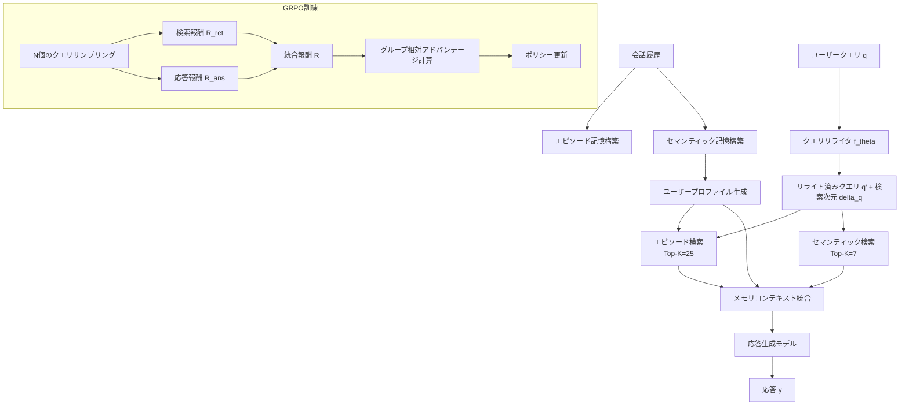
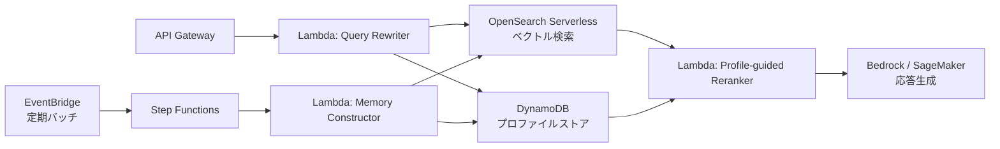

## 論文概要

本記事は [arXiv: 2607.00017](https://arxiv.org/abs/2607.00017) の解説記事です。

会話エージェントが過去のやりとりから関連情報を正確に検索する能力は、長期的な対話品質を左右する。本論文では、ユーザープロファイルを活用して検索をパーソナライズするフレームワーク **PPRO（Profile-guided Personalized Retrieval Optimization）** を提案している。エピソード記憶とセマンティック記憶の二層メモリバンクを構築し、プロファイル誘導型のランキングとGRPO（Group Relative Policy Optimization）で訓練されたクエリリライタにより、検索品質と応答品質の双方を最適化する。LoCoMoベンチマークにおいて既存手法を上回る性能を達成したと報告されている。

## 情報源

| 項目 | 内容 |
|------|------|
| arXiv ID | [2607.00017](https://arxiv.org/abs/2607.00017) |
| タイトル | Learning User-Aware Recall: Personalized Retrieval in Long-Term Conversational Memory |
| 著者 | ZhiShu Jiang, Haibo Liu, Xin Shen, Guanqiang QI, Chenxi Miao, Weikang Li, Liwei Qian, Xin Pei, Jizhou Huang |
| 公開日 | 2026年5月28日（改訂: 2026年7月2日） |
| 分野 | cs.IR, cs.AI, cs.CL |

## 背景と動機

長期会話において、エージェントが過去のやりとりから適切な情報を検索する能力は実用上の重要課題である。既存手法には以下の限界がある。

**FullContext方式**の問題として、全会話履歴をコンテキストに含める方式は、セッション数が増えるとLLMのコンテキスト長制限に達し、計算コストも増大する。**RAGベース方式**の問題として、MemGPTやA-Memなどの検索拡張型メモリシステムは、クエリと記憶の表層的な類似度に依存しており、ユーザー固有の文脈（嗜好、習慣、関心の変遷）を考慮できていない。

著者らは、同じクエリ「おすすめのレストランは？」でも、ユーザーの食の好みや過去の会話内容によって検索すべき記憶が異なる点を指摘し、**ユーザーを意識した検索（user-aware retrieval）** の必要性を論じている。さらに、既存のクエリリライタは検索精度のみを最適化しており、最終的な応答品質との整合性が保証されていないという課題も挙げている。

## 主要な貢献

著者らは以下の貢献を報告している。

- **二層メモリバンク**: 個別のやりとりを保持するエピソード記憶と、対話横断で集約されたセマンティック記憶を組み合わせた構造化メモリの構築
- **プロファイル誘導型パーソナライズドランキング**: ユーザープロファイルのベクトル表現を検索スコアに組み込み、ユーザー固有の関連性を反映するランキング手法
- **GRPO訓練によるクエリリライタ**: 検索精度（F1）と応答品質（BLEU-1）の双方を報酬とするGroup Relative Policy Optimizationでクエリリライタを最適化
- **体系的な評価**: LoCoMoおよびLongMemEval-Sベンチマークにおける包括的な実験と、各コンポーネントの寄与を検証するアブレーション分析

## 技術的詳細

### アーキテクチャ全体像

PPROはオフラインのメモリ構築フェーズとオンラインの検索・応答生成フェーズから構成される。



### メモリバンクの設計

**エピソード記憶**は、個々の会話ターンから抽出された事実的な記述を保持する。各記憶ユニットは以下のように定義される。

$$
e = (c, \delta) \in \mathcal{M}^{E}_{u,t}
$$

ここで $c$ はテキスト内容、$\delta$ は検索次元（時制・主観性・確実性）を表す。エピソード記憶バンクは生成モデル $\mathcal{G}$ により構築される。

$$
\mathcal{M}^{E}_{u,t} = \mathcal{G}(d_t, u)
$$

**セマンティック記憶**は、エピソード記憶をコサイン類似度に基づいてクラスタリングし、対話横断の抽象的知識として集約したものである。

$$
\text{sim}(e_i, e_j) = \cos(\mathcal{E}(e_i), \mathcal{E}(e_j))
$$

閾値 $\tau_c = 0.85$ を超えるペアをグループ $C_g$ にまとめ、セマンティック記憶 $s = \mathcal{G}(C_g)$ を生成する。

**ユーザープロファイル**は、セマンティック記憶バンク全体を要約して構築される。

$$
\mathcal{P}_u = \mathcal{G}(\mathcal{M}^{S}_u), \quad \mathbf{p}_u = \mathcal{E}(\mathcal{P}_u)
$$

### プロファイル誘導型ランキング

エピソード記憶の検索スコアは、クエリ関連性とプロファイル関連性を線形結合する。

$$
\sigma(e) = \lambda \sigma_q(e) + (1 - \lambda) \sigma_p(e) + b_\delta(e)
$$

各項は以下の通りである。

- $\sigma_q(e) = \cos(\mathcal{E}(q'), \mathcal{E}(e))$: クエリ-記憶間のコサイン類似度
- $\sigma_p(e) = \cos(\mathbf{p}_u, \mathcal{E}(e))$: プロファイル-記憶間のコサイン類似度
- $b_\delta(e)$: 検索次元の一致ボーナス（一致あたり0.05、最大0.15）
- $\lambda = 0.8$: 最適なクエリ-プロファイル混合比率

### GRPO訓練

クエリリライタ $f_\theta$ をポリシー $\pi_\theta$ として扱い、状態をクエリ $q$ と対話コンテキスト $C$、行動をリライト済みクエリ $q'$ として定式化する。$N$ 個のサンプル $\{q'_1, \ldots, q'_N\}$ を生成し、以下の統合報酬を計算する。

$$
R_i = \alpha \tilde{R}_{ans,i} + (1 - \alpha) \tilde{R}_{ret,i}
$$

ここで $\alpha = 0.2$ であり、検索報酬を重視する設計となっている。検索報酬 $R_{ret,i}$ はアノテーション済みエビデンスターンと検索結果のF1スコアで定義される。

$$
R_{ret,i} = \frac{2 P_i \cdot \text{Rec}_i}{P_i + \text{Rec}_i}
$$

応答報酬 $R_{ans,i}$ はBLEU-1スコアで定義される。各報酬はEMA（指数移動平均）で正規化され、グループ相対アドバンテージを計算する。

$$
\hat{A}_i = \frac{R_i - \text{mean}(\{R_j\}_{j=1}^N)}{\text{std}(\{R_j\}_{j=1}^N) + \epsilon}
$$

最終的な損失関数は以下のPPOスタイルのクリッピング損失となる。

$$
\mathcal{L}_{GRPO}(\theta) = -\mathbb{E}_{i,t}\left[\min\left(r_{i,t}\hat{A}_i, \text{clip}(r_{i,t}, 1-\varepsilon, 1+\varepsilon)\hat{A}_i\right) - \mu D_{KL}\right]
$$

ここで $\varepsilon = 0.2$（クリップ比率）、$\mu = 0.001$（KL係数）、$r_{i,t}$ は新旧ポリシーの確率比である。

## 実装のポイント

PPROの実装において注目すべき技術的詳細を整理する。

**エンベディング**: bge-large-en（335Mパラメータ）を使用しており、エピソード記憶・セマンティック記憶・ユーザープロファイルの全てを同一ベクトル空間上で表現している。

**メモリ構築の自動化**: オフラインのメモリ構築にはDeepSeek-V3.2（8B）を使用し、検索次元（時制・主観性・確実性）の自動付与も含めた統合的な処理パイプラインを実現している。

**GRPO訓練の設定**: 学習率 $1 \times 10^{-6}$、バッチサイズ64、30エポック、グループサイズ $N = 8$ で訓練を行い、NVIDIA A800 80GB GPU 2台で約15時間（計30 GPU時間）を要したと報告されている。VERLフレームワーク上で実装されている。

**検索パラメータの選定**: エピソード記憶の検索件数はTop-25、セマンティック記憶はTop-7に設定されている。著者らはFigure 5において、セマンティック記憶はアイテムあたりの情報密度が高く、少数でも大きな寄与を持つことを示している。

## Production Deployment Guide

PPROの知見をプロダクション環境に適用する際のAWS実装パターンを解説する。

### アーキテクチャ設計

PPROの二層メモリバンクとプロファイル誘導型ランキングを実現するには、ベクトルストア・プロファイルストア・リランキングサービスの3層が必要となる。



### ベクトル検索層（エピソード記憶 + セマンティック記憶）

OpenSearch Serverlessを使用し、エピソード記憶とセマンティック記憶を別コレクションとして管理する。PPROのTop-K=25（エピソード）とTop-K=7（セマンティック）のデュアルパス検索に対応する。

```python
import boto3
from opensearchpy import OpenSearch, RequestsHttpConnection
from requests_aws4auth import AWS4Auth
from pydantic import BaseModel, Field

class EpisodicMemory(BaseModel):
    """PPROのエピソード記憶ユニット."""

    memory_id: str
    user_id: str
    content: str
    tense: str = Field(description="時制: past/present/future")
    subjectivity: str = Field(description="主観性: subjective/objective")
    certainty: str = Field(description="確実性: certain/uncertain")
    embedding: list[float]
    session_id: str
    created_at: str


class DualPathRetriever:
    """PPROの二段階デュアルパス検索."""

    def __init__(
        self,
        opensearch_endpoint: str,
        region: str = "ap-northeast-1",
        episodic_k: int = 25,
        semantic_k: int = 7,
        profile_weight: float = 0.2,
    ) -> None:
        credentials = boto3.Session().get_credentials()
        awsauth = AWS4Auth(
            credentials.access_key,
            credentials.secret_key,
            region,
            "aoss",
            session_token=credentials.token,
        )
        self.client = OpenSearch(
            hosts=[{"host": opensearch_endpoint, "port": 443}],
            http_auth=awsauth,
            use_ssl=True,
            connection_class=RequestsHttpConnection,
        )
        self.episodic_k = episodic_k
        self.semantic_k = semantic_k
        self.lambda_weight = 1.0 - profile_weight  # 論文のlambda=0.8

    def retrieve(
        self,
        query_embedding: list[float],
        profile_embedding: list[float],
        retrieval_dimensions: dict[str, str],
        user_id: str,
    ) -> dict:
        """エピソード検索 + セマンティック検索のデュアルパス実行."""
        episodic_results = self._episodic_search(
            query_embedding, profile_embedding,
            retrieval_dimensions, user_id,
        )
        semantic_results = self._semantic_search(
            query_embedding, user_id,
        )
        return {
            "episodic": episodic_results,
            "semantic": semantic_results,
        }

    def _episodic_search(
        self,
        query_emb: list[float],
        profile_emb: list[float],
        dimensions: dict[str, str],
        user_id: str,
    ) -> list[dict]:
        """プロファイル誘導型エピソード検索.

        sigma(e) = lambda * sigma_q(e) + (1-lambda) * sigma_p(e) + b_delta(e)
        """
        # Stage 1: クエリベースの候補取得（Top-K * 3で広めに取得）
        candidates = self.client.search(
            index="episodic-memories",
            body={
                "size": self.episodic_k * 3,
                "query": {
                    "bool": {
                        "must": [
                            {"term": {"user_id": user_id}},
                            {
                                "knn": {
                                    "embedding": {
                                        "vector": query_emb,
                                        "k": self.episodic_k * 3,
                                    }
                                }
                            },
                        ]
                    }
                },
            },
        )

        # Stage 2: プロファイル誘導型リランキング
        reranked = []
        for hit in candidates["hits"]["hits"]:
            source = hit["_source"]
            sigma_q = hit["_score"]  # クエリ類似度

            # プロファイル類似度の計算
            sigma_p = self._cosine_similarity(
                profile_emb, source["embedding"],
            )

            # 検索次元ボーナス（一致あたり0.05、最大0.15）
            b_delta = sum(
                0.05
                for dim in ["tense", "subjectivity", "certainty"]
                if dimensions.get(dim) == source.get(dim)
            )

            # 統合スコア
            score = (
                self.lambda_weight * sigma_q
                + (1 - self.lambda_weight) * sigma_p
                + b_delta
            )
            reranked.append({**source, "score": score})

        reranked.sort(key=lambda x: x["score"], reverse=True)
        return reranked[: self.episodic_k]

    def _semantic_search(
        self, query_emb: list[float], user_id: str,
    ) -> list[dict]:
        """セマンティック記憶検索（コサイン類似度のみ）."""
        return self.client.search(
            index="semantic-memories",
            body={
                "size": self.semantic_k,
                "query": {
                    "bool": {
                        "must": [
                            {"term": {"user_id": user_id}},
                            {
                                "knn": {
                                    "embedding": {
                                        "vector": query_emb,
                                        "k": self.semantic_k,
                                    }
                                }
                            },
                        ]
                    }
                },
            },
        )["hits"]["hits"]

    @staticmethod
    def _cosine_similarity(a: list[float], b: list[float]) -> float:
        dot = sum(x * y for x, y in zip(a, b))
        norm_a = sum(x * x for x in a) ** 0.5
        norm_b = sum(x * x for x in b) ** 0.5
        if norm_a == 0 or norm_b == 0:
            return 0.0
        return dot / (norm_a * norm_b)
```

### プロファイルストア（DynamoDB）

ユーザープロファイルはセマンティック記憶を要約したテキストとそのエンベディングを保持する。DynamoDBに格納し、TTL付きでキャッシュする。

```python
import json
import time

import boto3
from pydantic import BaseModel


class UserProfile(BaseModel):
    """PPROのユーザープロファイル."""

    user_id: str
    profile_text: str
    profile_embedding: list[float]
    updated_at: int
    ttl: int


class ProfileStore:
    """DynamoDBベースのプロファイル管理."""

    def __init__(
        self,
        table_name: str = "user-profiles",
        ttl_hours: int = 24,
    ) -> None:
        self.table = boto3.resource("dynamodb").Table(table_name)
        self.ttl_seconds = ttl_hours * 3600

    def get_profile(self, user_id: str) -> UserProfile | None:
        """プロファイル取得（TTL期限内のもののみ）."""
        response = self.table.get_item(Key={"user_id": user_id})
        item = response.get("Item")
        if item is None:
            return None
        if item["ttl"] < int(time.time()):
            return None
        return UserProfile(
            user_id=item["user_id"],
            profile_text=item["profile_text"],
            profile_embedding=json.loads(item["profile_embedding"]),
            updated_at=item["updated_at"],
            ttl=item["ttl"],
        )

    def put_profile(self, profile: UserProfile) -> None:
        """プロファイル更新."""
        now = int(time.time())
        self.table.put_item(
            Item={
                "user_id": profile.user_id,
                "profile_text": profile.profile_text,
                "profile_embedding": json.dumps(profile.profile_embedding),
                "updated_at": now,
                "ttl": now + self.ttl_seconds,
            }
        )
```

### Terraform構成

```hcl
# OpenSearch Serverless（ベクトル検索用）
resource "aws_opensearchserverless_collection" "memory_store" {
  name = "ppro-memory-store"
  type = "VECTORSEARCH"

  tags = {
    Environment = "production"
    System      = "ppro-retrieval"
  }
}

resource "aws_opensearchserverless_security_policy" "encryption" {
  name = "ppro-encryption"
  type = "encryption"
  policy = jsonencode({
    Rules = [{
      ResourceType = "collection"
      Resource      = ["collection/ppro-memory-store"]
    }]
    AWSOwnedKey = true
  })
}

# DynamoDB（プロファイルストア）
resource "aws_dynamodb_table" "user_profiles" {
  name         = "ppro-user-profiles"
  billing_mode = "PAY_PER_REQUEST"
  hash_key     = "user_id"

  attribute {
    name = "user_id"
    type = "S"
  }

  ttl {
    attribute_name = "ttl"
    enabled        = true
  }

  point_in_time_recovery {
    enabled = true
  }

  tags = {
    Environment = "production"
    System      = "ppro-retrieval"
  }
}

# Lambda（クエリリライタ + リランカー）
resource "aws_lambda_function" "query_rewriter" {
  function_name = "ppro-query-rewriter"
  runtime       = "python3.12"
  handler       = "handler.lambda_handler"
  timeout       = 30
  memory_size   = 512

  filename         = "lambda/query_rewriter.zip"
  source_code_hash = filebase64sha256("lambda/query_rewriter.zip")
  role             = aws_iam_role.lambda_role.arn

  environment {
    variables = {
      OPENSEARCH_ENDPOINT = aws_opensearchserverless_collection.memory_store.collection_endpoint
      PROFILE_TABLE       = aws_dynamodb_table.user_profiles.name
      EPISODIC_K          = "25"
      SEMANTIC_K          = "7"
      LAMBDA_WEIGHT       = "0.8"
    }
  }
}
```

### 監視設計

PPROの検索品質を継続的に監視するため、以下のメトリクスをCloudWatchに送信する。

```python
import time

import boto3
from pydantic import BaseModel


class RetrievalMetrics(BaseModel):
    """検索品質メトリクス."""

    user_id: str
    query_rewrite_latency_ms: float
    episodic_search_latency_ms: float
    semantic_search_latency_ms: float
    reranking_latency_ms: float
    total_latency_ms: float
    episodic_results_count: int
    semantic_results_count: int
    top1_score: float
    profile_cache_hit: bool


class PPROMonitor:
    """CloudWatchベースの監視."""

    def __init__(self, namespace: str = "PPRO/Retrieval") -> None:
        self.cloudwatch = boto3.client("cloudwatch")
        self.namespace = namespace

    def emit(self, metrics: RetrievalMetrics) -> None:
        """メトリクスをCloudWatchに送信."""
        dimensions = [{"Name": "UserId", "Value": metrics.user_id}]
        self.cloudwatch.put_metric_data(
            Namespace=self.namespace,
            MetricData=[
                {
                    "MetricName": "TotalLatency",
                    "Value": metrics.total_latency_ms,
                    "Unit": "Milliseconds",
                    "Dimensions": dimensions,
                },
                {
                    "MetricName": "Top1Score",
                    "Value": metrics.top1_score,
                    "Unit": "None",
                    "Dimensions": dimensions,
                },
                {
                    "MetricName": "ProfileCacheHit",
                    "Value": 1.0 if metrics.profile_cache_hit else 0.0,
                    "Unit": "Count",
                    "Dimensions": dimensions,
                },
            ],
        )
```

監視のポイントとして、以下のアラーム設計を推奨する。

| メトリクス | 閾値 | アクション |
|-----------|------|-----------|
| TotalLatency p99 | 500ms超過 | PagerDuty通知 |
| Top1Score 平均 | 0.3未満 | Slack通知 + プロファイル再構築トリガー |
| ProfileCacheHit率 | 50%未満 | TTL設定の見直し |
| EpisodicResultsCount | 0件が継続 | メモリ構築パイプラインの点検 |

## 実験結果

### LoCoMoベンチマーク

著者らはLoCoMoデータセット（10件のマルチセッション対話、1,307件のQAペア）で評価を行っている。以下は論文Table 1より抜粋した結果である。

**Training-Freeベースラインとの比較（GPT-4o使用）:**

| 手法 | SingleHop F1 | Temporal F1 | OpenDomain F1 | MultiHop F1 | Overall F1 |
|------|-------------|-------------|---------------|-------------|------------|
| SimpleMem | 45.41 | 56.71 | 18.23 | 35.89 | 40.87 |
| PPRO (w/o GRPO) | 45.67 | 59.68 | 27.06 | 47.00 | 48.16 |

**Training-Basedベースラインとの比較（Qwen2.5-7B、テスト分割）:**

| 手法 | SingleHop F1 | Temporal F1 | OpenDomain F1 | MultiHop F1 | Overall F1 | BLEU-1 |
|------|-------------|-------------|---------------|-------------|------------|--------|
| MemAgent | 34.84 | 21.09 | 23.44 | 46.64 | 37.97 | 33.11 |
| PPRO | 39.39 | 52.50 | 24.00 | 43.34 | 43.20 | 36.68 |

PPROはOverall F1でSimpleMemを7.29ポイント（Training-Free設定）、MemAgentを5.23ポイント（Training-Based設定）上回っている。特にTemporal（時系列推論）カテゴリでの改善が顕著である。

### LongMemEval-Sベンチマーク

500ターン以上の超長期対話を含むLongMemEval-Sにおいても、著者らは改善を報告している（論文Table 2より）。

| 手法 | Temporal | Multi-Session | K-Update | Overall |
|------|---------|--------------|---------|---------|
| SimpleMem | 83.5 | 60.9 | 79.5 | 75.9 |
| PPRO (w/o GRPO) | 89.3 | 74.4 | 80.8 | 81.5 |

### アブレーション分析

論文Table 3に基づくアブレーション結果は、各コンポーネントの寄与を明確に示している。

| 除去コンポーネント | F1 | F1変化 | BLEU-1変化 |
|------------------|-----|--------|-----------|
| Full Model | 43.20 | - | - |
| w/o エピソード記憶 | 34.34 | -8.86 | -7.70 |
| w/o セマンティック記憶 | 37.63 | -5.57 | -5.04 |
| w/o プロファイル注入 | 40.79 | -2.41 | -1.01 |
| w/o 検索次元 | 41.23 | -1.97 | -1.30 |
| w/o GRPO訓練 | 41.32 | -1.88 | -1.86 |

エピソード記憶の除去が最大の性能低下（-8.86 F1）を引き起こし、これが一次的なエビデンスソースであることを示している。論文Table 6では、プロファイル注入がOpenDomainカテゴリで-4.85 F1、検索次元がTemporalカテゴリで-4.88 F1と、カテゴリ別に異なる効果を持つことも報告されている。

## 実運用への応用

### Bedrock AgentCore MemoryのRetrievalConfigとの関連

[関連Zenn記事](https://zenn.dev/0h_n0/articles/1dd52a7f22158b)で扱っているBedrock AgentCore MemoryのRetrievalConfigは、`top_k`と`relevance_score`パラメータで検索を制御する。PPROの知見は以下の点で直接的に応用可能である。

**top_kの設計**: PPROはエピソード記憶にTop-25、セマンティック記憶にTop-7と、記憶の種類によって異なるTop-Kを設定している。AgentCore MemoryのPreference戦略においても、ユーザー嗜好に関する記憶と事実的な記憶で異なるtop_kを設定することが検索精度の向上につながる可能性がある。

**relevance_scoreの閾値**: PPROでは類似度閾値0.6を採用している。AgentCore MemoryのRetrievalConfigでrelevance_scoreを設定する際の参考値となる。

**プロファイル活用**: PPROのプロファイル誘導型ランキング（$\lambda = 0.8$）は、AgentCore MemoryのPreference機能を検索ランキングに反映させる設計パターンとして参考になる。クエリ類似度を主（80%）、プロファイル類似度を従（20%）とするバランスは、過度なパーソナライズを避けつつ関連性を高める実用的な指針と言える。

## 関連研究

- **MemGPT** (Packer et al., 2023): OS風の仮想コンテキスト管理により、LLMのコンテキスト長制限を回避する手法。PPROはこれを発展させ、構造化メモリとパーソナライズドランキングを導入している。
- **SimpleMem** (Liu et al., 2026): セマンティックロスレス圧縮とマルチビューインデキシングによる記憶管理。PPROの主要ベースラインであり、Overall F1で7.29ポイントの差が報告されている。
- **HippoRAG** (Gutierrez et al., 2025): 海馬の記憶構造に着想を得た長期記憶フレームワーク。神経科学的なアプローチによりRAGの検索品質を向上させる。
- **Memory-R1** (Yan et al., 2025): GRPOを用いてメモリのCRUD操作を強化学習で最適化する手法。PPROと同様にGRPOを採用しているが、PPROはクエリリライタの訓練に特化している。
- **SynapticRAG** (Kim & Jang, 2025): 生物学的なシナプス伝搬メカニズムに着想を得た時系列スコアリング手法。

## まとめ

PPROは、ユーザープロファイルを活用した検索ランキングとGRPOベースのクエリリライタ訓練を統合し、長期会話メモリからのパーソナライズド検索を実現するフレームワークである。LoCoMoベンチマークでOverall F1 43.20（Qwen2.5-7B）を達成し、既存のTraining-Based手法を上回る性能が報告されている。アブレーション分析により、エピソード記憶・セマンティック記憶・プロファイル注入の各コンポーネントが相補的に機能することが示されており、会話エージェントのメモリ検索設計に対して実践的な指針を提供している。

## 参考文献

1. Jiang, Z. et al. (2026). "Learning User-Aware Recall: Personalized Retrieval in Long-Term Conversational Memory." arXiv:2607.00017.
2. Packer, C. et al. (2023). "MemGPT: Towards LLMs as Operating Systems." arXiv:2310.08560.
3. Liu, H. et al. (2026). "SimpleMem: Semantic Lossless Compression with Multi-view Indexing."
4. Gutierrez, B. J. et al. (2025). "HippoRAG: Neurobiologically Inspired Long-Term Memory for Large Language Models." arXiv:2405.14831.
5. Yan, Y. et al. (2025). "Memory-R1: RL for Memory CRUD Operations via GRPO."
6. Kim, J. & Jang, Y. (2025). "SynapticRAG: Biologically-Inspired Synaptic Propagation for Temporal Scoring."
7. Zhu, Y. et al. (2025). "PRIME: Cognitive Dual-Memory Theory for LLM Personalization."
