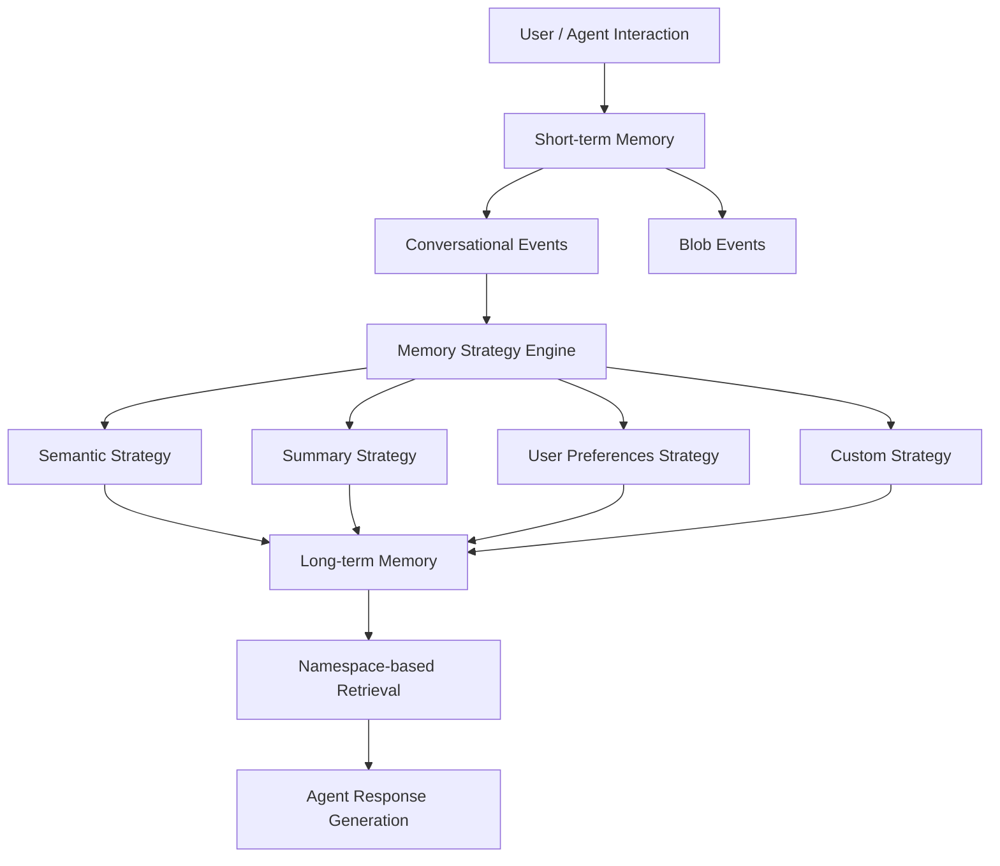

## ブログ概要

本記事は [AWS公式ブログ「Amazon Bedrock AgentCore Memory: Building context-aware agents」](https://aws.amazon.com/blogs/machine-learning/amazon-bedrock-agentcore-memory-building-context-aware-agents/) の解説記事です。LLMベースのAIエージェントが抱える「ステートレス性」の課題に対し、Amazon Bedrock AgentCore Memoryが提供するShort-term Memory（短期記憶）とLong-term Memory（長期記憶）の2層アーキテクチャ、3つのビルトイン戦略（Semantic・Summary・User Preferences）、さらにBranching・Checkpointingなどの高度な機能について、コード例を交えて解説する。

## 情報源

| 項目 | 内容 |
|------|------|
| 種別 | 企業公式テックブログ |
| URL | [Amazon Bedrock AgentCore Memory: Building context-aware agents](https://aws.amazon.com/blogs/machine-learning/amazon-bedrock-agentcore-memory-building-context-aware-agents/) |
| 組織 | Amazon Web Services (AWS) |
| 著者 | Akarsha Sehwag, Dani Mitchell, Gopikrishnan Anilkumar, Mani Khanuja, Noor Randhawa |
| 発表日 | 2025年8月13日 |

## 技術的背景

LLMを活用したAIエージェントは、本質的にステートレスであり、過去の対話履歴や利用者の嗜好を保持しない。これはカスタマーサポートや金融アドバイザリーのように、長期的な関係構築が求められるユースケースにおいて大きな制約となる。

学術的には、この課題はCognitive Architecture（認知アーキテクチャ）における作業記憶（Working Memory）と長期記憶（Long-term Memory）の分離に対応する。人間の認知システムではAtkinson-Shiffrinモデルが短期記憶と長期記憶の相互作用を記述しているが、LLMエージェントにも同様の記憶階層を持たせることで、コンテキストに応じた適応的な応答を実現できる。

また、コンテキストウィンドウの有限性も実務上の制約である。セッションが長くなるにつれ全履歴をプロンプトに含めることは非現実的であり、重要な情報を構造化して永続化するメカニズムが不可欠である。AgentCore Memoryはこの問題に対し、マネージドサービスとしての解を提供している。

## 実装アーキテクチャ

ブログでは、AgentCore Memoryのアーキテクチャを3つの主要コンポーネントで構成されると説明している。

### Memory Resource

Memory Resourceは、生のイベントデータと処理済みの長期記憶を包含する論理コンテナである。設定項目として、イベント保持期間（最大365日）、暗号化設定（AWSマネージドキーまたはカスタマーマネージドKMSキー）、および階層的な名前空間による整理構造が含まれる。

### Short-term Memory（短期記憶）

会話中のインタラクションデータを不変（immutable）なイベントとして時系列で記録する。イベントタイプには2種類が存在する。

- **Conversational**: USER / ASSISTANT / TOOL のメッセージ型。通常の会話やツール呼び出し結果を記録する
- **Blob**: バイナリコンテンツ型。チェックポイントやエージェントの内部状態を格納し、長期記憶への抽出対象からは除外される

### Long-term Memory（長期記憶）

Short-term Memoryから非同期に抽出・統合されたインサイトを格納する。ブログでは「長期記憶の抽出と統合は非同期プロセスである」と明記されている。名前空間に基づくセマンティック検索により、関連する記憶を効率的に取得できる。

以下にアーキテクチャの全体構成を示す。



イベント作成に必要な3つの識別子は以下の通りである。

| 識別子 | 説明 | 用途 |
|--------|------|------|
| `memoryId` | Memory Resource作成時に自動生成 | メモリストア全体の識別 |
| `actorId` | ユーザー、エージェント、プロジェクトなどを識別 | エンティティ単位の分離 |
| `sessionId` | 関連イベントのグルーピング | セッション単位の管理 |

## メモリ戦略の詳細

AgentCore Memoryは3つのビルトイン戦略と、カスタム戦略の定義機能を提供している。

### 3つのビルトイン戦略の比較

| 戦略 | 抽出対象 | スコープ | 名前空間の例 | ユースケース |
|------|----------|----------|-------------|-------------|
| **Semantic** | 会話中の事実・知識 | Actor横断 | `/customer/{actorId}/facts/` | 顧客企業の従業員数や拠点情報の記録 |
| **Summary** | セッション全体の要約 | Session単位 | `/customer/{actorId}/{sessionId}/summary/` | 会議の主要論点・決定事項の記録 |
| **User Preferences** | 利用者の嗜好・スタイル | Actor単位 | `/customer/{actorId}/preferences/` | 「技術的な詳細説明を好む」等の記録 |

### Semantic Strategy

ブログでは、「会話中に言及された事実と知識を将来の参照のために保存する」と説明されている。抽出例として「顧客の会社はシアトル、オースティン、ボストンの3拠点に500名の従業員がいる」といった構造化された事実が挙げられている。

### Summary Strategy

「会話の要約を維持し、主要なポイントと決定事項を捉える」戦略であり、セッションにスコープされる。抽出例として「顧客がエンタープライズ価格について問い合わせ、導入タイムラインの要件を議論し、フォローアップデモを依頼した」が示されている。

### User Preferences Strategy

「ユーザーの好み、選択、スタイルを保存する」戦略である。抽出例として「ユーザーは高レベルの概要よりも詳細な技術的説明を好む」「ユーザーは開発にPythonを好む」が挙げられている。

### カスタム戦略

ビルトイン戦略でカバーできないドメイン固有の要件に対して、カスタム戦略を定義できる。ブログでは「特定のLLMを選択し、抽出と統合のプロンプトをドメインやユースケースに合わせてオーバーライドできる」と説明されている。医療記録からの症状抽出や法的文書の条項整理など、専門領域に特化した抽出ロジックを実装可能である。

### 名前空間（Namespace）による整理

名前空間は動的プレースホルダ変数をサポートし、階層的なメモリ整理を可能にする。

| プレースホルダ | 説明 |
|----------------|------|
| `{actorId}` | イベントのアクター識別子 |
| `{sessionId}` | イベントのセッション識別子 |
| `{strategyId}` | 戦略の識別子 |

マルチテナント環境では `/org_id/user_id/preferences/` のようなパターンでテナント間のデータ分離を実現できる。全戦略がデフォルトでPII（個人識別情報）を長期記憶から除外する設計は、プライバシー要件の厳しい環境で重要な特性である。

## 高度な機能

### Branching（分岐）

Branchingは、会話の特定時点から代替パスを作成する機能である。ブログでは以下のユースケースが挙げられている。

- **メッセージ編集**: 元の会話フローを保持したまま修正パスを生成
- **What-ifシナリオ探索**: 異なるアプローチの結果を比較
- **複数解決策の並行管理**: 複数の解決パスを同時に維持

Branchingには `branch.name`（分岐名）と `rootEventId`（分岐元のイベントID）の指定が必要である。これにより、ツリー構造の会話履歴が構築される。

### Checkpointing（チェックポイント）

Checkpointingは、特定の会話状態を保存・マーキングし、後から再開可能にする機能である。以下のシナリオが想定されている。

- **マルチセッション作業の継続**: 数日から数週間にわたるタスクの中断・再開
- **ワークフロー復帰**: 保存地点からの処理再開
- **意思決定ポイントのブックマーク**: 重要な判断時点の記録

実装にはBlob型ペイロードを用いた`CreateEvent` APIが使用される。

## コード例の解説

### Memory Resourceの作成とイベント記録

Memory Resourceの作成は`create_memory` APIで行う。`eventExpiryDuration`でイベントの保持日数を制御し、暗号化にはKMSキーのARNを指定できる。イベントの記録には`create_event`を使用し、`eventTimestamp`はミリ秒単位のUnixタイムスタンプであることに注意が必要である。

```python
import boto3
import time


def store_user_message(
    client: boto3.client,
    memory_id: str,
    actor_id: str,
    session_id: str,
    message: str,
) -> dict:
    """ユーザーメッセージをShort-term Memoryに記録する。

    Args:
        client: AgentCore クライアント
        memory_id: メモリリソースID
        actor_id: アクター識別子
        session_id: セッション識別子
        message: ユーザーのメッセージ本文

    Returns:
        イベント作成の応答辞書
    """
    return client.create_event(
        memoryId=memory_id,
        actorId=actor_id,
        sessionId=session_id,
        eventTimestamp=int(time.time() * 1000),
        payload=[
            {
                "conversational": {
                    "content": {"text": message},
                    "role": "USER",
                }
            }
        ],
    )
```

### 戦略付きMemory Resourceの構成

複数の戦略を組み合わせたMemory Resourceを作成する例を以下に示す。名前空間テンプレートにより、各戦略の記憶データが論理的に分離される。

```python
def create_memory_with_strategies(
    client: boto3.client,
    name: str,
    description: str,
) -> dict:
    """3つのビルトイン戦略を全て有効化したMemory Resourceを作成する。

    Args:
        client: AgentCore クライアント
        name: メモリリソース名
        description: 説明

    Returns:
        作成されたメモリリソースの応答辞書
    """
    strategies: list[dict] = [
        {
            "semanticMemoryStrategy": {
                "name": "semantic-facts",
                "namespaceTemplate": ["/customer/{actorId}/facts/"],
            },
            "summaryMemoryStrategy": {
                "name": "conversation-summary",
                "namespaceTemplate": [
                    "/customer/{actorId}/{sessionId}/summary/"
                ],
            },
            "userPreferenceMemoryStrategy": {
                "name": "user-preferences",
                "namespaceTemplate": ["/customer/{actorId}/preferences/"],
            },
        }
    ]
    return client.create_memory(
        name=name,
        description=description,
        eventExpiryDuration=30,
        memoryStrategies=strategies,
    )
```

### Long-term Memoryのセマンティック検索

`retrieve_memory_records`により、名前空間を指定してセマンティック検索を実行する。`topK`パラメータで返却件数を制御する。

```python
def search_long_term_memory(
    client: boto3.client,
    memory_id: str,
    namespace: str,
    query: str,
    top_k: int = 5,
) -> dict:
    """Long-term Memoryからセマンティック検索で記憶を取得する。

    Args:
        client: AgentCore クライアント
        memory_id: メモリリソースID
        namespace: 検索対象の名前空間
        query: 検索クエリ（自然言語）
        top_k: 返却する最大件数

    Returns:
        検索結果の応答辞書
    """
    return client.retrieve_memory_records(
        memoryId=memory_id,
        namespace=namespace,
        searchCriteria={
            "searchQuery": query,
            "topK": top_k,
        },
    )
```

## Production Deployment Guide

### AWS実装パターン

AgentCore Memoryを本番環境に導入する際の主要パターンを以下にまとめる。

| パターン | 構成 | 適用規模 | 特徴 |
|----------|------|----------|------|
| Single Strategy | Semantic or Preferences 1戦略のみ | 小規模（~1K users） | 構成が単純。PoC向き |
| Multi-Strategy | Semantic + Summary + Preferences | 中規模（~10K users） | 標準的な本番構成 |
| Multi-Strategy + Custom | ビルトイン3戦略 + ドメイン特化戦略 | 大規模（10K+ users） | 業界固有の抽出ロジック |
| Multi-Tenant Isolation | 名前空間によるテナント分離 | SaaS | `/org/{tenantId}/...` パターン |

### Terraform構成（Small構成）

小規模環境向けの基本的なTerraform構成例を示す。AgentCore MemoryはマネージドサービスであるためEC2やコンテナの管理は不要だが、IAMポリシー設定が必須となる。

```hcl
# Small構成: 単一戦略、AWSマネージドキー暗号化
# 対象: PoC・開発環境（~1K users）

resource "aws_iam_role" "agentcore_memory_role" {
  name = "agentcore-memory-small"
  assume_role_policy = jsonencode({
    Version = "2012-10-17"
    Statement = [{
      Action    = "sts:AssumeRole"
      Effect    = "Allow"
      Principal = { Service = "bedrock.amazonaws.com" }
    }]
  })
}

resource "aws_iam_role_policy" "agentcore_memory_policy" {
  name = "agentcore-memory-access"
  role = aws_iam_role.agentcore_memory_role.id
  policy = jsonencode({
    Version = "2012-10-17"
    Statement = [{
      Effect   = "Allow"
      Action   = [
        "bedrock:CreateMemory", "bedrock:GetMemory",
        "bedrock:CreateEvent",  "bedrock:ListEvents",
        "bedrock:RetrieveMemoryRecords"
      ]
      Resource = "arn:aws:bedrock:us-east-1:*:memory/*"
    }]
  })
}

resource "aws_cloudwatch_log_group" "agentcore_memory_logs" {
  name              = "/aws/agentcore/memory-small"
  retention_in_days = 30
}
```

### Terraform構成（Large構成）

大規模本番環境向けの構成では、カスタマーマネージドKMSキー、VPCエンドポイント、詳細なCloudWatch設定を追加する。

```hcl
# Large構成: マルチ戦略、カスタマーマネージドKMS、VPCエンドポイント
# 対象: 本番環境（10K+ users）

resource "aws_kms_key" "agentcore_memory_key" {
  description             = "AgentCore Memory encryption key"
  deletion_window_in_days = 30
  enable_key_rotation     = true
}

resource "aws_vpc_endpoint" "bedrock" {
  vpc_id              = var.vpc_id
  service_name        = "com.amazonaws.us-east-1.bedrock-runtime"
  vpc_endpoint_type   = "Interface"
  subnet_ids          = var.private_subnet_ids
  security_group_ids  = [aws_security_group.bedrock_endpoint.id]
  private_dns_enabled = true
}

resource "aws_security_group" "bedrock_endpoint" {
  name_prefix = "agentcore-bedrock-ep-"
  vpc_id      = var.vpc_id
  ingress {
    from_port   = 443
    to_port     = 443
    protocol    = "tcp"
    cidr_blocks = var.application_cidrs
  }
}

resource "aws_iam_role" "agentcore_memory_role_prod" {
  name = "agentcore-memory-prod"
  assume_role_policy = jsonencode({
    Version = "2012-10-17"
    Statement = [{
      Action    = "sts:AssumeRole"
      Effect    = "Allow"
      Principal = { Service = "bedrock.amazonaws.com" }
      Condition = {
        StringEquals = { "aws:SourceAccount" = var.account_id }
      }
    }]
  })
}

resource "aws_iam_role_policy" "agentcore_memory_policy_prod" {
  name = "agentcore-memory-access-prod"
  role = aws_iam_role.agentcore_memory_role_prod.id
  policy = jsonencode({
    Version = "2012-10-17"
    Statement = [
      {
        Effect   = "Allow"
        Action   = [
          "bedrock:CreateMemory", "bedrock:GetMemory",
          "bedrock:DeleteMemory", "bedrock:CreateEvent",
          "bedrock:ListEvents",   "bedrock:RetrieveMemoryRecords"
        ]
        Resource = "arn:aws:bedrock:us-east-1:${var.account_id}:memory/*"
      },
      {
        Effect   = "Allow"
        Action   = ["kms:Decrypt", "kms:GenerateDataKey", "kms:DescribeKey"]
        Resource = aws_kms_key.agentcore_memory_key.arn
      }
    ]
  })
}

resource "aws_cloudwatch_log_group" "agentcore_memory_logs_prod" {
  name              = "/aws/agentcore/memory-prod"
  retention_in_days = 90
  kms_key_id        = aws_kms_key.agentcore_memory_key.arn
}
```

### CloudWatch / X-Ray 設定

AgentCore Memoryの監視には、API呼び出しのレイテンシ、エラー率、およびメモリ抽出の成功率を追跡することが重要である。推奨する主要アラームは以下の通りである。

| アラーム | メトリクス | 閾値例 | 説明 |
|----------|-----------|--------|------|
| API エラー率 | `5xxError` (Sum) | 5分間で10件超 | Memory API側の障害検知 |
| 検索レイテンシ | `Latency` (p99) | 2000ms超（3期間連続） | `RetrieveMemoryRecords`の性能劣化検知 |
| イベント作成エラー | `4xxError` (Sum) | 5分間で50件超 | クライアント側の設定ミス検知 |

X-Rayによるトレーシングでは、エージェントのリクエストからMemory API呼び出し、LLMによる記憶抽出までのエンドツーエンドの処理時間を可視化できる。AgentCore Observabilityとの統合により、メモリの利用パターンと効果を継続的にモニタリングすることが推奨される。

### コスト最適化チェックリスト

AgentCore Memoryの運用コストを最適化するためのチェックリストを以下に示す。

- [ ] **イベント保持期間の適正化**: `eventExpiryDuration`をユースケースに応じた最小値に設定する。全てのケースで365日は不要であり、多くの場合30-90日で十分である
- [ ] **名前空間の粒度設計**: 細かすぎる名前空間は管理コストを増加させる。`/org/{tenantId}/{actorId}/` レベルが標準的
- [ ] **`topK`パラメータの最適化**: セマンティック検索の`topK`を必要最小限に設定する。デフォルト値が大きすぎないか定期的に検証する
- [ ] **不要なMemory Resourceの削除**: 開発・テスト用が本番アカウントに残存していないか確認する
- [ ] **戦略の選択的有効化**: 3戦略全てを有効化する必要があるか検討する。不要な戦略の無効化によりLLM呼び出しコストを削減できる
- [ ] **リージョン選択**: レイテンシとコストのバランスを考慮し、エンドユーザーに近いリージョンを選択する
- [ ] **KMSキーの管理**: カスタマーマネージドKMSキーが必要な場合のみ使用する。AWSマネージドキーの方が管理負荷が低い
- [ ] **CloudWatch Logsの保持期間**: 環境ごとに設定（開発: 7日、ステージング: 30日、本番: 90日）

## パフォーマンス最適化

ブログではAgentCore Memoryの設計原則として「大量のデータを効率的に処理し、低レイテンシでの取得を実現するスケーラビリティとパフォーマンス」が挙げられている。以下の最適化ポイントを考慮すべきである。

**レイテンシ最適化**:
- 名前空間を適切に設計し、検索対象を絞り込む。`/customer/{actorId}/preferences/` のように具体的なパスを指定することで、不要なデータのスキャンを回避できる
- `topK`を必要最小限に設定する。過大な値はレスポンスサイズの増大とLLMプロンプトの肥大化を招く
- Short-term Memoryの`list_events`とLong-term Memoryの`retrieve_memory_records`を用途に応じて使い分ける

**スループット最適化**:
- 長期記憶の抽出は非同期で実行されるため、イベント記録直後の検索では最新の記憶が反映されていない可能性がある。アプリケーション設計においてこの非同期性を考慮する必要がある
- 複数セッションからの同時アクセスでは、`actorId`ベースの名前空間設計によりアクセスパターンを分散させる

## 運用での学び

ブログで示されたベストプラクティスと、実運用で留意すべき点を整理する。

**設計時の推奨事項**:
- 名前空間の階層構造を意図的に設計する。後からの変更は既存の記憶データに影響するため、初期設計の段階で将来の拡張性を考慮する
- TTL設定をプライバシーポリシーおよびデータ保持ポリシーと整合させる
- 取得手法を使い分ける：生コンテキストには`list_events`、セッション要約には`summaryStrategy`の結果、長期知識には`retrieve_memory_records`のセマンティック検索を使用する

**セキュリティ上の注意点**:
- ブログでは「IAMベースのアクセス制御で最小権限アクセスを実装する」ことが推奨されている
- 機密データにはカスタマーマネージドKMSキーを使用する
- プロンプトインジェクションやメモリポイズニングを防ぐためのガードレールを実装する。悪意のあるユーザーが意図的に誤った情報を記憶させ、他のセッションで誤った応答を誘発するリスクがある

**運用上の落とし穴**:
- 長期記憶の非同期抽出を見落とし、記録直後に最新の記憶が取得できないことを不具合と誤認するケース
- 名前空間の設計不備により、マルチテナント環境でテナント間のデータ漏洩が発生するリスク
- PII除外のデフォルト動作を過信し、ドメイン固有の機密情報（社内コード名、非公開プロジェクト名等）が長期記憶に残存するケース

## 学術研究との関連

AgentCore Memoryの設計は、LLMエージェントの記憶管理に関する学術研究と共通する課題意識を持つ。Zhong et al.による「MemoryBank」（2024）はLLMに長期記憶を付与する手法を提案しており、Semantic Strategyと類似のアプローチである。Park et al.の「Generative Agents」（2023）は記憶ストリームとリフレクションによる高次知見抽出を示しており、Summary Strategyと概念的に対応する。PII除外のデフォルト動作は記憶汚染攻撃への防御研究とも関連する。

## まとめと実践への示唆

Amazon Bedrock AgentCore Memoryは、LLMエージェントの記憶管理をマネージドサービスとして提供し、2層メモリ構造、3つのビルトイン戦略、名前空間による論理的整理、BranchingとCheckpointingを実現している。PII除外やKMS暗号化がデフォルトで組み込まれている点は実務的に価値が高い。導入にあたっては、名前空間の初期設計と非同期抽出の特性を理解した上で、段階的にスケールさせるアプローチが推奨される。

## 参考文献

- [Amazon Bedrock AgentCore Memory: Building context-aware agents](https://aws.amazon.com/blogs/machine-learning/amazon-bedrock-agentcore-memory-building-context-aware-agents/) - AWS Machine Learning Blog, 2025年8月13日
- [Amazon Bedrock AgentCore Documentation](https://docs.aws.amazon.com/bedrock/latest/userguide/agentcore.html) - AWS公式ドキュメント
- [Amazon Bedrock AgentCore Samples](https://github.com/aws-samples/amazon-bedrock-agentcore-samples) - AWS Samples GitHub
- [Bedrock AgentCore MemoryのPreference戦略で顧客サポートの応答精度を改善する](https://zenn.dev/0h_n0/articles/1dd52a7f22158b) - 関連Zenn記事
- Park, J. S., et al. "Generative Agents: Interactive Simulacra of Human Behavior." *UIST 2023*.
- Zhong, W., et al. "MemoryBank: Enhancing Large Language Models with Long-Term Memory." *AAAI 2024*.
