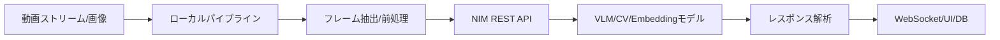
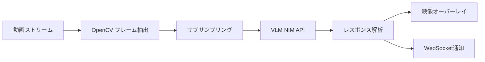
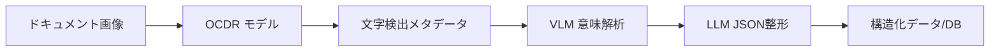
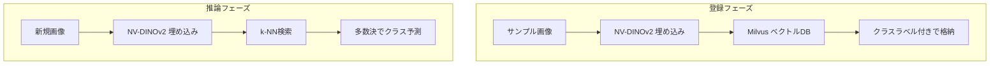

## ブログ概要（Summary）

本記事は [Build Multimodal Visual AI Agents Powered by NVIDIA NIM](https://developer.nvidia.com/blog/build-multimodal-visual-ai-agents-powered-by-nvidia-nim/) の解説記事です。NVIDIAが公開したこのテックブログでは、NIMマイクロサービスを活用して4種類のマルチモーダルVisual AIエージェントを構築するパターンを紹介している。VLM（Vision Language Model）をクラウドで実行し、動画ストリーミングパイプラインをローカルで実行するモジュラーアーキテクチャにより、GPUを持たない環境でも開発・プレビューが可能な設計となっている。

この記事は [Zenn記事: Gemini 2.5のマルチモーダル入力理解を活用した実践パターン4選](https://zenn.dev/0h_n0/articles/d1e65e3e69c087) の深掘りです。

## 情報源

- **種別**: 企業テックブログ
- **URL**: [https://developer.nvidia.com/blog/build-multimodal-visual-ai-agents-powered-by-nvidia-nim/](https://developer.nvidia.com/blog/build-multimodal-visual-ai-agents-powered-by-nvidia-nim/)
- **組織**: NVIDIA（Developer Technical Blog）
- **リファレンス実装**: [NVIDIA/metropolis-nim-workflows](https://github.com/NVIDIA/metropolis-nim-workflows)

## 技術的背景（Technical Background）

### マルチモーダルAIエージェントの課題

従来の画像認識パイプラインでは、タスクごとに専用のCNNモデルを訓練し、ラベル付きデータセットを大量に用意する必要があった。例えば「配達物の検知」と「火災の検知」は別のモデルとして開発・運用しなければならず、新しいタスクへの対応にはデータ収集から再訓練までのサイクルが発生していた。

VLMの登場により、自然言語プロンプトで視覚タスクを指示できるようになったが、実運用レベルでの課題が残っている。

1. **GPU依存**: 大規模VLMの推論には高性能GPUが必要で、開発・テストの敷居が高い
2. **モデル選定の複雑さ**: 用途に応じて最適なモデルサイズ・アーキテクチャが異なる
3. **パイプライン統合**: VLMだけでは完結せず、OCR・物体検出・埋め込みモデル等との組み合わせが必要

NVIDIAのNIMマイクロサービスは、これらのモデルを標準的なREST APIとして提供し、`build.nvidia.com`でGPUなしのプレビューAPIを無料で利用できる仕組みを構築している。新規アカウントには5,000クレジットが付与され、開発初期の検証コストを抑えられる設計となっている。

## 実装アーキテクチャ（Architecture）

### モジュラーアーキテクチャの全体像

ブログが提示するアーキテクチャの核心は、**VLMの推論をクラウドにオフロードし、動画ストリーミングパイプラインをローカルで実行する分離設計**にある。この分離により、開発者のローカルマシンにGPUがなくても動作する。



### 利用可能なモデル群

NIMで提供されるモデルは3つのカテゴリに分類される。

#### Vision Language Models（VLM）

| モデル | 開発元 | パラメータ数 | 特徴 |
|--------|--------|-------------|------|
| NVIDIA VILA | NVIDIA | 40B | SigLIP + Yi ベースの汎用マルチモーダルモデル |
| NVIDIA Neva | NVIDIA | 22B | NVGPT + CLIP統合の中規模モデル |
| Meta Llama 3.2 | Meta | 90B / 11B | 高解像度ビジョン対応の初のLlama Visionモデル |
| Microsoft Phi-3.5-vision | Microsoft | 4.2B | OCR特化の軽量モデル、複数画像処理対応 |
| Microsoft Florence-2 | Microsoft | 0.7B | キャプション・物体検出・セグメンテーションのマルチタスクモデル |

#### Embeddingモデル

| モデル | 用途 | 特徴 |
|--------|------|------|
| NV-CLIP | テキスト/画像マルチモーダル埋め込み | 7億枚の独自画像で訓練されたNVIDIA版CLIP。テキストと画像を同一ベクトル空間にマッピング |
| NV-DINOv2 | 高解像度画像埋め込み | 詳細な画像分析向け。少数サンプルでの欠陥検出に適する |

#### Computer Visionモデル

| モデル | タスク | 用途 |
|--------|--------|------|
| Grounding Dino | オープンボキャブラリ物体検出 | テキストプロンプトで任意の物体を検出 |
| OCDRNet | 光学文字検出・認識 | ドキュメントからの文字検出とメタデータ抽出 |
| ChangeNet | ピクセルレベル変化検出 | 欠陥検出、衛星画像分析 |

### API統合パターン

すべてのNIMマイクロサービスはOpenAI互換のREST APIを公開しており、`POST /v1/chat/completions`エンドポイントで統一的にアクセスできる。ストリーミングレスポンスも`"stream": true`パラメータで対応する。

```python
import httpx
from typing import Any


def call_nim_vlm(
    api_key: str,
    model: str,
    image_b64: str,
    prompt: str,
    *,
    max_tokens: int = 512,
    stream: bool = False,
) -> dict[str, Any]:
    """NIM VLM APIにリクエストを送信する

    Args:
        api_key: NIM APIキー（nvapi-xxx形式）
        model: 使用するモデル名（例: nvidia/vila-40b）
        image_b64: Base64エンコードされた画像データ
        prompt: VLMに送信するテキストプロンプト
        max_tokens: 最大トークン数
        stream: ストリーミングレスポンスの有効化

    Returns:
        APIレスポンスのJSONデータ
    """
    url = "https://integrate.api.nvidia.com/v1/chat/completions"
    headers = {
        "Authorization": f"Bearer {api_key}",
        "Content-Type": "application/json",
    }
    payload = {
        "model": model,
        "messages": [
            {
                "role": "user",
                "content": [
                    {
                        "type": "image_url",
                        "image_url": {"url": f"data:image/jpeg;base64,{image_b64}"},
                    },
                    {"type": "text", "text": prompt},
                ],
            }
        ],
        "max_tokens": max_tokens,
        "stream": stream,
    }
    response = httpx.post(url, headers=headers, json=payload, timeout=60.0)
    response.raise_for_status()
    return response.json()
```

## 4つのアプリケーションパターン

### パターン1: VLMストリーミング動画アラート

動画ストリームをリアルタイムに監視し、特定のイベント（荷物の配達、森林火災、不正アクセス等）を検出してアラートを発報するパターンである。

**処理フロー**:



1. **フレーム抽出**: OpenCVで動画ストリームまたはファイルをデコードし、フレームをサブサンプリングする。全フレームをVLMに送信するとAPI呼び出しコストが膨大になるため、一定間隔でのサンプリングが重要となる
2. **REST API制御**: FastAPIでコントロールエンドポイントを構築し、ユーザーがカスタムプロンプトを入力できるようにする。「この映像に人が映っているか」「煙が見えるか」といった自然言語で監視条件を動的に変更できる
3. **VLMラッパークラス**: VLM APIへのリクエスト形成とレスポンス解析を担当するラッパークラスを実装する。モデルの切り替え（VILA 40B、Llama 3.2 90B等）もこのレイヤーで吸収する
4. **結果の出力**: VLMのレスポンスを入力動画にオーバーレイし、OpenCVでリアルタイム表示する。同時にWebSocketサーバー経由で検出イベントを外部サービスに通知する

```python
import cv2
import asyncio
from dataclasses import dataclass


@dataclass
class AlertConfig:
    """アラート設定

    Attributes:
        prompt: VLMに送信する監視条件プロンプト
        sample_interval: フレームサンプリング間隔（秒）
        model: 使用するVLMモデル名
    """
    prompt: str
    sample_interval: float = 2.0
    model: str = "nvidia/vila-40b"


async def process_video_stream(
    video_source: str | int,
    config: AlertConfig,
    api_key: str,
) -> None:
    """動画ストリームを処理してVLMアラートを生成する

    Args:
        video_source: 動画ファイルパスまたはカメラデバイスID
        config: アラート設定
        api_key: NIM APIキー
    """
    cap = cv2.VideoCapture(video_source)
    if not cap.isOpened():
        raise RuntimeError(f"動画ソースを開けません: {video_source}")

    fps = cap.get(cv2.CAP_PROP_FPS)
    frame_interval = int(fps * config.sample_interval)
    frame_count = 0

    try:
        while cap.isOpened():
            ret, frame = cap.read()
            if not ret:
                break

            frame_count += 1
            if frame_count % frame_interval != 0:
                continue

            # フレームをBase64エンコードしてVLM APIに送信
            _, buffer = cv2.imencode(".jpg", frame)
            image_b64 = buffer.tobytes()
            # VLM API呼び出しとアラート判定をここに実装
            await asyncio.sleep(0)  # イベントループに制御を返す
    finally:
        cap.release()
```

**適用場面**: 倉庫の荷物到着検知、工場の安全監視、交通モニタリング。イタリア・パレルモ市では、K2K社がNIMマイクロサービスとVLMを統合し、交通カメラのリアルタイム分析を実現している。

### パターン2: 構造化テキスト抽出

写真付き身分証明書やレシートなど、非定型フォーマットのドキュメントから構造化データを抽出するパイプラインである。OCRモデル単体では文字の検出位置は得られるが、フィールドの意味解釈（「この文字列は名前なのか住所なのか」）ができない。VLMを組み合わせることでこの意味的な解釈を実現する。

**処理フロー**:



1. **OCR処理**: ドキュメント画像をOCDRNet（またはFlorence-2）に送信し、検出された全文字のメタデータ（位置座標、認識テキスト）を取得する
2. **VLM解析**: ユーザーのプロンプト（抽出したいフィールドの指定）とOCRのメタデータをVLMに送信する。VLMはOCRが検出した文字情報を活用して、より正確なフィールド抽出を行う
3. **JSON整形**: VLMの出力をLLMに渡してJSON形式に整形する。これにより下流のシステム（データベース、API等）で直接利用可能な構造化データを得る

```python
from pydantic import BaseModel


class ExtractedDocument(BaseModel):
    """ドキュメントから抽出された構造化データ

    Attributes:
        name: 氏名
        document_id: 書類番号
        issue_date: 発行日
        expiry_date: 有効期限
        raw_ocr_text: OCR生テキスト
    """
    name: str
    document_id: str
    issue_date: str | None = None
    expiry_date: str | None = None
    raw_ocr_text: str = ""


def build_extraction_prompt(fields: list[str]) -> str:
    """フィールド抽出用のVLMプロンプトを構築する

    Args:
        fields: 抽出対象のフィールド名リスト

    Returns:
        構築されたプロンプト文字列
    """
    field_list = ", ".join(fields)
    return (
        f"この画像からドキュメント情報を読み取ってください。"
        f"以下のフィールドを抽出してください: {field_list}。"
        f"抽出できないフィールドは null としてください。"
        f"結果はJSON形式で返してください。"
    )
```

**適用場面**: KYC（本人確認）プロセスの自動化、請求書処理、医療記録のデジタル化。OCDRNetは手書き文字にも対応しており、Phi-3.5-vision（4.2B）はOCRタスクに特化した軽量モデルとしてコスト効率が高い。

### パターン3: Few-Shot分類（NV-DINOv2）

ラベル付きデータが少数しかない場合でも画像分類を実現するパターンである。従来のCNN分類器では数百～数千枚のラベル付き画像とファインチューニングが必要だったが、NV-DINOv2の埋め込みとベクトルDBを組み合わせることで、数枚のサンプル画像から分類器を構築できる。

**処理フロー**:



1. **クラス定義と登録**: ユーザーが分類カテゴリを定義し、各カテゴリに数枚のサンプル画像をアップロードする。NV-DINOv2が各画像の埋め込みベクトルを生成し、クラスラベルとともにMilvusベクトルデータベースに格納する
2. **推論**: 新しい画像がアップロードされると、NV-DINOv2が埋め込みを生成し、Milvus内の格納済み埋め込みとk-NN（k-Nearest Neighbors）アルゴリズムで比較する。最も近い$k$個のサンプルの多数決クラスが予測結果となる

k-NNの分類判定は以下の数式で表現される。

$$
\hat{y} = \arg\max_{c \in \mathcal{C}} \sum_{i=1}^{k} \mathbb{1}[y_i = c]
$$

ここで、
- $\hat{y}$: 予測クラス
- $\mathcal{C}$: 定義されたクラスの集合
- $k$: 最近傍数
- $y_i$: $i$番目の最近傍サンプルのクラスラベル
- $\mathbb{1}[\cdot]$: 指示関数（条件が真なら1、偽なら0）

NV-DINOv2の埋め込み間の類似度はコサイン類似度で計算される。

$$
\text{sim}(\mathbf{u}, \mathbf{v}) = \frac{\mathbf{u} \cdot \mathbf{v}}{\|\mathbf{u}\| \|\mathbf{v}\|}
$$

ここで、$\mathbf{u}$はクエリ画像の埋め込みベクトル、$\mathbf{v}$は格納済みサンプルの埋め込みベクトルである。

```python
from pymilvus import MilvusClient


def create_few_shot_classifier(
    milvus_client: MilvusClient,
    collection_name: str,
    dimension: int = 768,
) -> None:
    """Few-Shot分類用のMilvusコレクションを作成する

    Args:
        milvus_client: Milvusクライアントインスタンス
        collection_name: コレクション名
        dimension: 埋め込みベクトルの次元数（NV-DINOv2デフォルト: 768）
    """
    milvus_client.create_collection(
        collection_name=collection_name,
        dimension=dimension,
        metric_type="COSINE",
    )


def classify_image(
    milvus_client: MilvusClient,
    collection_name: str,
    query_embedding: list[float],
    k: int = 5,
) -> str:
    """k-NNによるFew-Shot分類を実行する

    Args:
        milvus_client: Milvusクライアントインスタンス
        collection_name: コレクション名
        query_embedding: クエリ画像の埋め込みベクトル
        k: 最近傍数

    Returns:
        予測クラスラベル
    """
    results = milvus_client.search(
        collection_name=collection_name,
        data=[query_embedding],
        limit=k,
        output_fields=["class_label"],
    )
    # 多数決でクラス予測
    labels = [hit["entity"]["class_label"] for hit in results[0]]
    return max(set(labels), key=labels.count)
```

**適用場面**: 製造業の欠陥検出（良品/不良品分類）、小売業の商品分類。NV-DINOv2は高解像度画像の細部を捉えるため、微細な欠陥の検出に適している。なお、NV-DINOv2の各API呼び出しは1 NIMクレジットを消費する点に留意が必要である。

### パターン4: マルチモーダル検索（NV-CLIP）

テキストクエリで画像を検索するパターンである。NV-CLIPはテキストと画像を同一のベクトル空間にマッピングするため、「赤い車」というテキストクエリで赤い車の画像を直接検索できる。

NV-CLIPはNVIDIAがOpenAIのCLIPアーキテクチャを拡張し、7億枚の独自画像データセットで訓練した商用版モデルである。Zero-ShotおよびFew-Shot推論をサポートし、再訓練やファインチューニングなしで画像分類・検索が可能である。

**処理フロー**:

1. **インデックス構築**: 画像フォルダをアップロードし、NV-CLIPで全画像の埋め込みを生成してベクトルDBに格納する
2. **検索実行**: テキストクエリをNV-CLIPでベクトル化し、ベクトルDB上で類似度検索を実行する。テキストと画像が同一空間にあるため、クロスモーダルな検索が実現する

マルチモーダル埋め込みの検索は以下のように定式化される。

$$
\mathcal{R}(q) = \text{top-}k \left\{ \text{sim}(f_\text{text}(q), f_\text{image}(x_i)) \mid x_i \in \mathcal{X} \right\}
$$

ここで、
- $q$: テキストクエリ
- $\mathcal{X}$: インデックス済み画像集合
- $f_\text{text}$: テキストエンコーダ（NV-CLIP）
- $f_\text{image}$: 画像エンコーダ（NV-CLIP）
- $\text{sim}$: コサイン類似度

**適用場面**: 大規模画像アーカイブの検索、ECサイトの商品検索、監視映像からの特定シーン検索。Zenn記事で紹介されているGemini 2.5のマルチモーダル理解と比較すると、NV-CLIPは埋め込みベースの検索に特化しており、VLMの逐次推論よりも大量画像の高速検索に適している。

## Production Deployment Guide

ブログで紹介されている4つのパターンをAWS上で本番運用する場合の構成を示す。VLM推論はNVIDIA NIM APIを外部サービスとして利用するため、AWS側ではパイプラインの実行基盤・ベクトルDB・監視を構築する。

### AWS実装パターン（コスト最適化重視）

**トラフィック量別の推奨構成**:

| 規模 | 構成 | 月額コスト概算 | 用途 |
|------|------|-------------|------|
| Small (~100 req/日) | Lambda + S3 + NIM API | $50-150 | PoC・小規模バッチ処理 |
| Medium (~1,000 req/日) | ECS Fargate + ElastiCache + NIM API | $300-800 | 中規模リアルタイム処理 |
| Large (10,000+ req/日) | EKS + Spot + Milvus on EC2 + NIM API | $2,000-5,000 | 大規模ストリーミング処理 |

**Small構成（~100 req/日）**:
- **Lambda**: 画像前処理（リサイズ・Base64エンコード）とNIM API呼び出しを実行。メモリ512MB、タイムアウト60秒。月額約$5
- **S3**: 入力画像・処理結果の保存。月額約$3
- **NIM API**: build.nvidia.comのホステッドAPI。5,000クレジット無料、追加はNVIDIA AI Enterprise契約
- **DynamoDB**: 抽出結果・アラート履歴の保存。On-Demandモードで月額約$10
- **CloudWatch**: ログ・メトリクス。月額約$5

**Medium構成（~1,000 req/日）**:
- **ECS Fargate**: OpenCV動画処理パイプラインをコンテナ化。vCPU 1、メモリ 2GB x 2タスク。月額約$120
- **ElastiCache (Redis)**: フレーム処理状態・アラート閾値のキャッシュ。cache.t3.micro。月額約$15
- **ALB**: WebSocketサポート付きロードバランサー。月額約$20
- **Milvus on EC2**: Few-Shot分類・マルチモーダル検索用。t3.medium。月額約$35

**Large構成（10,000+ req/日）**:
- **EKS**: 動画処理パイプラインをKubernetesで管理。コントロールプレーン月額$73
- **Spot Instances**: c6i.xlarge（vCPU 4、メモリ 8GB）でOpenCVパイプライン実行。Spot活用で最大90%削減
- **Milvus on EC2 (GPU)**: g5.xlarge（NVIDIA A10G）でベクトル検索を高速化。月額約$800
- **Kinesis Data Streams**: 複数カメラからの動画ストリーム集約。月額約$50

**コスト削減テクニック**:
- **NIM APIクレジット管理**: フレームサブサンプリングでAPI呼び出し回数を削減（30fps -> 0.5fpsで60倍削減）
- **Spot Instances**: 動画処理ワーカーはステートレスなためSpot Instancesに適する。中断時はKinesisバッファから再処理
- **モデル選択の最適化**: OCRタスクにはPhi-3.5-vision（4.2B）を使用し、汎用タスクにはVILA（40B）を使い分けることでクレジット消費を最適化
- **Reserved Instances**: Milvus専用EC2は1年コミットで最大72%削減

**コスト試算の注意事項**: 上記は2026年8月時点のAWS ap-northeast-1（東京）リージョン料金に基づく概算値である。実際のコストはトラフィックパターン、NIM APIの利用量、バースト使用量により変動する。最新料金は[AWS料金計算ツール](https://calculator.aws/)で確認を推奨する。

### Terraformインフラコード

**Small構成（Serverless）: Lambda + S3 + DynamoDB**

```hcl
# NIM Visual AI Pipeline - Small構成
# Lambda + S3 + DynamoDB（GPUなし、NIM APIをクラウドで利用）

terraform {
  required_version = ">= 1.9"
  required_providers {
    aws = {
      source  = "hashicorp/aws"
      version = "~> 5.60"
    }
  }
}

provider "aws" {
  region = "ap-northeast-1"
}

# --- S3: 入力画像・処理結果保存 ---
resource "aws_s3_bucket" "images" {
  bucket_prefix = "nim-visual-ai-"
  force_destroy = true
}

resource "aws_s3_bucket_server_side_encryption_configuration" "images" {
  bucket = aws_s3_bucket.images.id
  rule {
    apply_server_side_encryption_by_default {
      sse_algorithm = "aws:kms"
    }
  }
}

resource "aws_s3_bucket_public_access_block" "images" {
  bucket                  = aws_s3_bucket.images.id
  block_public_acls       = true
  block_public_policy     = true
  ignore_public_acls      = true
  restrict_public_buckets = true
}

# --- DynamoDB: 抽出結果・アラート履歴 ---
resource "aws_dynamodb_table" "results" {
  name         = "nim-visual-ai-results"
  billing_mode = "PAY_PER_REQUEST"  # On-Demand: 低トラフィックでコスト最適
  hash_key     = "request_id"
  range_key    = "created_at"

  attribute {
    name = "request_id"
    type = "S"
  }
  attribute {
    name = "created_at"
    type = "S"
  }

  server_side_encryption {
    enabled = true
  }

  point_in_time_recovery {
    enabled = true
  }
}

# --- Secrets Manager: NIM APIキー ---
resource "aws_secretsmanager_secret" "nim_api_key" {
  name        = "nim-visual-ai/api-key"
  description = "NVIDIA NIM API Key"
}

# --- IAMロール: Lambda用（最小権限） ---
resource "aws_iam_role" "lambda" {
  name = "nim-visual-ai-lambda"
  assume_role_policy = jsonencode({
    Version = "2012-10-17"
    Statement = [{
      Action = "sts:AssumeRole"
      Effect = "Allow"
      Principal = { Service = "lambda.amazonaws.com" }
    }]
  })
}

resource "aws_iam_role_policy" "lambda" {
  name = "nim-visual-ai-lambda-policy"
  role = aws_iam_role.lambda.id
  policy = jsonencode({
    Version = "2012-10-17"
    Statement = [
      {
        Effect = "Allow"
        Action = ["s3:GetObject", "s3:PutObject"]
        Resource = "${aws_s3_bucket.images.arn}/*"
      },
      {
        Effect   = "Allow"
        Action   = ["dynamodb:PutItem", "dynamodb:Query"]
        Resource = aws_dynamodb_table.results.arn
      },
      {
        Effect   = "Allow"
        Action   = ["secretsmanager:GetSecretValue"]
        Resource = aws_secretsmanager_secret.nim_api_key.arn
      },
      {
        Effect = "Allow"
        Action = [
          "logs:CreateLogGroup",
          "logs:CreateLogStream",
          "logs:PutLogEvents"
        ]
        Resource = "arn:aws:logs:*:*:*"
      }
    ]
  })
}

# --- Lambda関数 ---
resource "aws_lambda_function" "processor" {
  function_name = "nim-visual-ai-processor"
  role          = aws_iam_role.lambda.arn
  handler       = "handler.lambda_handler"
  runtime       = "python3.12"
  timeout       = 60
  memory_size   = 512
  filename      = "lambda.zip"  # デプロイパッケージ

  environment {
    variables = {
      NIM_SECRET_ARN = aws_secretsmanager_secret.nim_api_key.arn
      TABLE_NAME     = aws_dynamodb_table.results.name
      BUCKET_NAME    = aws_s3_bucket.images.id
    }
  }

  tracing_config {
    mode = "Active"  # X-Rayトレーシング有効化
  }
}

# --- CloudWatch アラーム: コスト監視 ---
resource "aws_cloudwatch_metric_alarm" "lambda_duration" {
  alarm_name          = "nim-visual-ai-lambda-duration"
  comparison_operator = "GreaterThanThreshold"
  evaluation_periods  = 3
  metric_name         = "Duration"
  namespace           = "AWS/Lambda"
  period              = 300
  statistic           = "Average"
  threshold           = 30000  # 30秒超過でアラート
  alarm_description   = "Lambda実行時間が30秒を超過"

  dimensions = {
    FunctionName = aws_lambda_function.processor.function_name
  }
}
```

**Large構成（Container）: EKS + Karpenter + Spot**

```hcl
# NIM Visual AI Pipeline - Large構成
# EKS + Karpenter（Spot優先） + Milvus

module "eks" {
  source  = "terraform-aws-modules/eks/aws"
  version = "~> 20.24"

  cluster_name    = "nim-visual-ai"
  cluster_version = "1.31"

  vpc_id     = module.vpc.vpc_id
  subnet_ids = module.vpc.private_subnets

  # Karpenter用のIAMロール
  enable_cluster_creator_admin_permissions = true

  cluster_endpoint_public_access = false  # プライベートアクセスのみ
}

# --- Karpenter: Spot優先オートスケーリング ---
resource "kubectl_manifest" "karpenter_nodepool" {
  yaml_body = <<-YAML
    apiVersion: karpenter.sh/v1
    kind: NodePool
    metadata:
      name: video-pipeline
    spec:
      template:
        spec:
          requirements:
            - key: karpenter.sh/capacity-type
              operator: In
              values: ["spot", "on-demand"]  # Spot優先
            - key: node.kubernetes.io/instance-type
              operator: In
              values: ["c6i.xlarge", "c6i.2xlarge", "c7i.xlarge"]
          nodeClassRef:
            group: karpenter.k8s.aws
            kind: EC2NodeClass
            name: default
      limits:
        cpu: "64"
        memory: "128Gi"
      disruption:
        consolidationPolicy: WhenEmptyOrUnderutilized
        consolidateAfter: 60s
  YAML
}

# --- AWS Budgets: 月次予算アラート ---
resource "aws_budgets_budget" "monthly" {
  name         = "nim-visual-ai-monthly"
  budget_type  = "COST"
  limit_amount = "5000"
  limit_unit   = "USD"
  time_unit    = "MONTHLY"

  notification {
    comparison_operator       = "GREATER_THAN"
    threshold                 = 80
    threshold_type            = "PERCENTAGE"
    notification_type         = "ACTUAL"
    subscriber_email_addresses = ["alert@example.com"]
  }
}
```

### 運用・監視設定

**CloudWatch Logs Insights クエリ**:

```
# NIM API呼び出しのレイテンシ分析（P95/P99）
fields @timestamp, @message
| filter @message like /nim_api_call/
| stats percentile(duration_ms, 95) as p95,
        percentile(duration_ms, 99) as p99,
        avg(duration_ms) as avg_ms
  by bin(1h) as hour

# NIM APIクレジット消費量の追跡
fields @timestamp, @message
| filter @message like /nim_credit/
| stats sum(credits_used) as total_credits by bin(1h) as hour
| sort hour desc
```

**CloudWatch アラーム設定（Python）**:

```python
import boto3


def create_nim_monitoring_alarms(function_name: str, sns_topic_arn: str) -> None:
    """NIM Visual AIパイプライン用のCloudWatchアラームを作成する

    Args:
        function_name: Lambda関数名
        sns_topic_arn: 通知先SNSトピックARN
    """
    cw = boto3.client("cloudwatch", region_name="ap-northeast-1")

    # Lambda実行時間の異常検知
    cw.put_metric_alarm(
        AlarmName=f"{function_name}-duration-anomaly",
        MetricName="Duration",
        Namespace="AWS/Lambda",
        Statistic="p99",
        Period=300,
        EvaluationPeriods=3,
        Threshold=45000,  # 45秒
        ComparisonOperator="GreaterThanThreshold",
        Dimensions=[{"Name": "FunctionName", "Value": function_name}],
        AlarmActions=[sns_topic_arn],
        AlarmDescription="NIM API応答遅延の可能性",
    )

    # Lambdaエラー率の監視
    cw.put_metric_alarm(
        AlarmName=f"{function_name}-error-rate",
        MetricName="Errors",
        Namespace="AWS/Lambda",
        Statistic="Sum",
        Period=300,
        EvaluationPeriods=2,
        Threshold=5,
        ComparisonOperator="GreaterThanThreshold",
        Dimensions=[{"Name": "FunctionName", "Value": function_name}],
        AlarmActions=[sns_topic_arn],
        AlarmDescription="NIM API呼び出しエラーの増加",
    )
```

**X-Ray トレーシング設定**:

```python
from aws_xray_sdk.core import xray_recorder, patch_all

# boto3・httpxの自動計装
patch_all()


@xray_recorder.capture("nim_vlm_inference")
def traced_nim_call(image_b64: str, prompt: str) -> dict:
    """X-Rayトレース付きNIM API呼び出し

    Args:
        image_b64: Base64エンコード画像
        prompt: VLMプロンプト

    Returns:
        VLMレスポンス
    """
    subsegment = xray_recorder.current_subsegment()
    subsegment.put_annotation("model", "nvidia/vila-40b")
    subsegment.put_metadata("prompt_length", len(prompt))

    result = call_nim_vlm(
        api_key="from-secrets-manager",
        model="nvidia/vila-40b",
        image_b64=image_b64,
        prompt=prompt,
    )
    subsegment.put_metadata("response_tokens", len(str(result)))
    return result
```

**Cost Explorer 日次レポート**:

```python
import boto3
from datetime import datetime, timedelta


def get_daily_nim_pipeline_cost() -> dict[str, float]:
    """NIM Visual AIパイプラインの日次コストを取得する

    Returns:
        サービス別コストの辞書
    """
    ce = boto3.client("ce", region_name="us-east-1")
    today = datetime.now().strftime("%Y-%m-%d")
    yesterday = (datetime.now() - timedelta(days=1)).strftime("%Y-%m-%d")

    response = ce.get_cost_and_usage(
        TimePeriod={"Start": yesterday, "End": today},
        Granularity="DAILY",
        Metrics=["UnblendedCost"],
        Filter={
            "Tags": {
                "Key": "Project",
                "Values": ["nim-visual-ai"],
            }
        },
        GroupBy=[{"Type": "DIMENSION", "Key": "SERVICE"}],
    )

    costs: dict[str, float] = {}
    for group in response["ResultsByTime"][0]["Groups"]:
        service = group["Keys"][0]
        amount = float(group["Metrics"]["UnblendedCost"]["Amount"])
        if amount > 0:
            costs[service] = amount
    return costs
```

### コスト最適化チェックリスト

**アーキテクチャ選択**:
- [ ] トラフィック ~100 req/日 → Serverless (Lambda + S3)
- [ ] トラフィック ~1,000 req/日 → Hybrid (ECS Fargate + ElastiCache)
- [ ] トラフィック 10,000+ req/日 → Container (EKS + Karpenter)

**リソース最適化**:
- [ ] 動画処理ワーカーにSpot Instances適用（最大90%削減）
- [ ] Milvus専用EC2にReserved Instances適用（最大72%削減）
- [ ] Savings Plans検討（1年/3年コミット）
- [ ] Lambda メモリサイズ最適化（AWS Lambda Power Tuningで検証）
- [ ] ECS/EKS アイドル時スケールダウン（最小タスク数0）
- [ ] NAT Gatewayの代替としてVPCエンドポイント活用

**NIM APIコスト削減**:
- [ ] フレームサブサンプリングでAPI呼び出し削減（30fps -> 0.5fps）
- [ ] タスク別モデル選択（OCR: Phi-3.5-vision 4.2B、汎用: VILA 40B）
- [ ] バッチ処理可能なタスクはまとめてリクエスト
- [ ] NIM APIレスポンスのキャッシュ（同一画像の再処理防止）
- [ ] NIMクレジット消費量の日次モニタリング

**監視・アラート**:
- [ ] AWS Budgets: 月次予算アラート（80%/100%閾値）
- [ ] CloudWatch アラーム: Lambda実行時間・エラー率
- [ ] Cost Anomaly Detection: 異常コスト検知
- [ ] 日次コストレポート: サービス別コスト自動送信
- [ ] NIM APIクレジット残量監視

**リソース管理**:
- [ ] 未使用S3オブジェクトのライフサイクルポリシー（90日でGlacier移行）
- [ ] タグ戦略: Project / Environment / Owner タグ必須
- [ ] CloudWatch Logsの保持期間設定（30日）
- [ ] 開発環境のEKSノード夜間停止（Karpenter consolidation設定）
- [ ] 処理済み画像の自動アーカイブ

## パフォーマンス最適化（Performance）

### フレームサブサンプリング戦略

ブログが提示するパイプラインにおいて、パフォーマンスとコストのボトルネックはVLM API呼び出しの頻度にある。30fpsの動画ストリームを全フレーム処理すると、1分間に1,800回のAPI呼び出しが発生する。

実用的なサブサンプリング戦略として、以下のアプローチが考えられる。

| 戦略 | フレームレート | API呼び出し/分 | 適用場面 |
|------|-------------|--------------|---------|
| 固定間隔 | 0.5 fps | 30 | 一般的な監視 |
| 動き検出トリガー | 可変 | 5-50 | 間欠的なイベント検出 |
| キーフレーム抽出 | 可変 | 10-30 | 録画済み動画の分析 |

### モデル選定の最適化

ブログで紹介されている5つのVLMは、パラメータ数が0.7Bから90Bまで幅広い。タスクの要求精度とレイテンシ・コストのトレードオフを考慮し、適切なモデルを選定することが重要である。

- **高精度が必要な場合**: Llama 3.2 90BまたはVILA 40B
- **OCR特化タスク**: Phi-3.5-vision 4.2B（コスト効率が高い）
- **リアルタイム性重視**: Florence-2 0.7B（最小レイテンシ）

## 運用での学び（Production Lessons）

### GPU不要開発の利点と制約

ブログが強調する「GPUなしでプレビュー可能」という設計は、開発初期のプロトタイピングを加速する。`build.nvidia.com`の無料クレジット（5,000クレジット/アカウント）で主要な動作検証が完了するため、GPU調達前にパイプラインの設計を固められる。

ただし、以下の制約に留意する必要がある。

1. **レイテンシ**: クラウドAPI経由のため、ローカルGPU推論と比較してネットワークレイテンシが加算される。リアルタイム性が重要な用途（自動運転等）ではローカルデプロイ（NVIDIA AI Enterpriseライセンス）の検討が必要
2. **データプライバシー**: 画像・動画データがNVIDIAのAPIエンドポイントに送信される。機密性の高いデータを扱う場合は、オンプレミスでのNIMデプロイが推奨される
3. **クレジット管理**: API呼び出しごとにクレジットを消費するため、フレームサブサンプリングやキャッシュ戦略が運用コストに直結する

### ベクトルDB運用の考慮事項

Few-Shot分類やマルチモーダル検索でMilvusを使用する場合、以下の運用ポイントが挙げられる。

- **インデックス更新**: 新しいサンプル画像追加時のインデックス再構築コスト
- **スケーリング**: 画像数が数百万件を超える場合、GPU対応のMilvus（NVIDIA A10G等）が必要
- **Milvus-Liteの制約**: 開発用のMilvus-LiteはWindowsをサポートしていない（WSL/macOS/Linuxが必要）

## 学術研究との関連（Academic Connection）

ブログで使用されているモデルと技術は、以下の学術研究に基づいている。

- **CLIP** (Radford et al., 2021): NV-CLIPの基盤となったマルチモーダル対照学習。テキストと画像を同一埋め込み空間にマッピングするアプローチを確立した
- **DINOv2** (Oquab et al., 2023): NV-DINOv2の基盤。自己教師あり学習による汎用的な画像特徴抽出を実現し、Few-Shot学習での高い転移性能を示した
- **Grounding DINO** (Liu et al., 2023): テキストプロンプトによるオープンボキャブラリ物体検出。DINO検出器とGrounded Pre-Trainingを統合した手法
- **Florence-2** (Xiao et al., 2024): Microsoft Researchによるマルチタスクビジョンモデル。0.7Bパラメータでキャプション・検出・セグメンテーションを統合

Zenn記事で扱われているGemini 2.5のマルチモーダル入力理解は、単一のエンドツーエンドモデルによるアプローチであるのに対し、NVIDIAのブログはNIMマイクロサービスとして複数の専門モデルを組み合わせるモジュラーアプローチを採用している。前者は開発の簡便さ、後者はモデルの柔軟な選定と最適化に優位性がある。

## まとめと実践への示唆

NVIDIAのブログは、NIMマイクロサービスを活用した4つのVisual AIエージェント構築パターン（VLMストリーミング・構造化抽出・Few-Shot分類・マルチモーダル検索）を、GPUなしの開発環境から本番デプロイまで一貫して実装できるアーキテクチャとして提示している。標準的なREST API経由でVLM・CV・Embeddingモデルにアクセスできるため、既存のWebアプリケーションやデータパイプラインへの統合が容易である。リファレンス実装は[NVIDIA/metropolis-nim-workflows](https://github.com/NVIDIA/metropolis-nim-workflows)で公開されており、Jupyter Notebookで各パターンを即座に試行できる。

## 参考文献

- **Blog URL**: [Build Multimodal Visual AI Agents Powered by NVIDIA NIM](https://developer.nvidia.com/blog/build-multimodal-visual-ai-agents-powered-by-nvidia-nim/)
- **GitHub**: [NVIDIA/metropolis-nim-workflows](https://github.com/NVIDIA/metropolis-nim-workflows)
- **NIM for Developers**: [https://developer.nvidia.com/nim](https://developer.nvidia.com/nim)
- **NIM VLM API Reference**: [https://docs.nvidia.com/nim/vision-language-models/latest/api-reference.html](https://docs.nvidia.com/nim/vision-language-models/latest/api-reference.html)
- **NV-CLIP Model Card**: [https://build.nvidia.com/nvidia/nvclip/modelcard](https://build.nvidia.com/nvidia/nvclip/modelcard)
- **Related Zenn article**: [Gemini 2.5のマルチモーダル入力理解を活用した実践パターン4選](https://zenn.dev/0h_n0/articles/d1e65e3e69c087)
