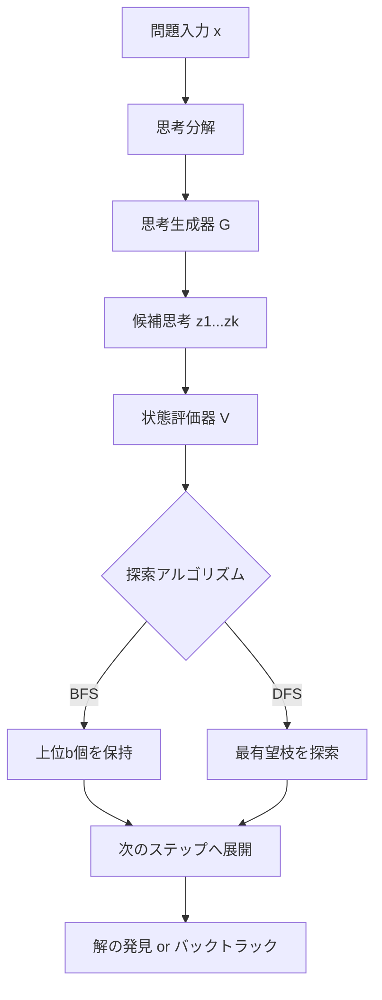

本記事は [https://arxiv.org/abs/2305.10601](https://arxiv.org/abs/2305.10601) の解説記事です。

## 論文概要（Abstract）

Tree of Thoughts（ToT）は、Chain of Thought（CoT）プロンプティングを一般化した推論フレームワークである。Yao et al.は、従来の線形的なトークンレベルの意思決定プロセスを「思考（thought）」と呼ばれる一貫したテキスト単位を中間ステップとする木構造探索に拡張することを提案している。このフレームワークにより、言語モデルが複数の推論経路を生成・評価し、バックトラックを行い、戦略的な先読みを実行することが可能となる。Game of 24タスクにおいてGPT-4の成功率を4%から74%に引き上げた結果が報告されている（論文Table 2より）。

この記事は [Zenn記事: Tree of Thoughts x Structured Outputs：型安全な推論木をPythonで実装する](https://zenn.dev/0h_n0/articles/1b1f92f0a382bd) の深掘りです。

## 情報源

- **arXiv ID**: 2305.10601
- **URL**: [arXiv:2305.10601](https://arxiv.org/abs/2305.10601)
- **著者**: Shunyu Yao, Dian Yu, Jeffrey Zhao, Izhak Shafran, Thomas L. Griffiths, Yuan Cao, Karthik Narasimhan
- **発表年**: 2023年（NeurIPS 2023採択）
- **分野**: Computation and Language (cs.CL), Artificial Intelligence (cs.AI), Machine Learning (cs.LG)
- **コード**: [princeton-nlp/tree-of-thought-llm](https://github.com/princeton-nlp/tree-of-thought-llm)

## 背景と動機（Background & Motivation）

### 従来のLLM推論の限界

LLMによる推論は、トークンレベルの左から右への自己回帰的生成に基づいている。Chain of Thought（CoT）プロンプティング（Wei et al., 2022）は中間推論ステップを導入したが、依然として線形的な推論パスに制約されている。著者らは以下の2つの問題を指摘している。

1. **局所的な意思決定**: 各トークンの生成は直前のコンテキストのみに基づく。一度誤った方向に進むと修正が困難である
2. **探索の欠如**: 古典的AI（Newell, Shaw, & Simon, 1959）で確立された「探索（search）」の概念がLLM推論に欠如している。人間の問題解決では、複数の選択肢を比較検討し、行き詰まればバックトラックを行う

著者らは、Newell-Shaw-Simonのフレームワークにおける問題解決の2つの要素、すなわち「問題空間の表現」と「問題空間内の探索」をLLMに統合することで、より計画的な問題解決が可能になると主張している。

### なぜこの研究が重要か

CoTプロンプティングの限界は、単純な算術推論や制約充足問題で顕著になる。著者らの誤り分析によれば、CoTでGame of 24タスクに失敗したケースの60%が最初の推論ステップで発生しており（論文Section 4.1より）、左から右への線形的デコードの根本的な制約を示している。ToTはこの問題に対し、木構造探索によって複数の推論パスを並行して評価するアプローチを提供する。

## 主要な貢献（Key Contributions）

1. **Tree of Thoughtsフレームワーク**: LLMの推論を木構造探索として定式化する汎用的フレームワーク。思考の分解・生成・評価・探索の4つのモジュールで構成
2. **LMによる自己評価機構**: 外部のreward modelを使わず、LM自身が推論状態の有望度を評価する仕組みを導入
3. **3つのタスクでの実証**: Game of 24（算術推論）、Creative Writing（創造的執筆）、Mini Crosswords（制約充足）の3タスクで、IO/CoT/CoT-SCベースラインを大幅に上回る性能を報告

## 技術的詳細（Technical Details）

### フレームワーク概要

ToTは以下の4つの設計要素で構成される。



### 1. 思考分解（Thought Decomposition）

著者らは、推論プロセスを「思考（thought）」と呼ぶ中間ステップの列に分解する。問題の入力を$x$、思考を$z_i$とすると、解は思考の列$[z_1, z_2, \ldots, z_T]$として表現される。

思考のサイズ設定について、著者らは以下のように述べている: 「LMが有望で多様なサンプルを生成できるほど小さく、かつ問題解決への見通しを評価できるほど大きい」サイズが望ましい（論文Section 2.1より）。

具体的なサイズはタスクに依存する:
- **Game of 24**: 1つの算術式（例: `4 + 9 = 13`）
- **Creative Writing**: 1つの計画文（約5語のコヒーレントプラン）
- **Mini Crosswords**: 1つの単語（行または列の1エントリ）

### 2. 思考生成器 $G(p_\theta, s, k)$

状態$s = [x, z_{1..i}]$（入力$x$とこれまでの思考の列）から、$k$個の候補思考を生成する。著者らは2つの戦略を提案している。

**(a) i.i.d.サンプリング**

CoTプロンプトからの独立サンプリング:

$$
z^{(j)} \sim p_\theta^{\text{CoT}}(z_{i+1} \mid s), \quad j = 1, \ldots, k
$$

思考空間が豊かで多様性が重要な場合（例: Creative Writing）に適している。

**(b) 逐次提案（Sequential Proposal）**

専用の「propose prompt」を用いて、1回のLM呼び出しで$k$個の候補を順次生成する:

$$
[z^{(1)}, \ldots, z^{(k)}] \sim p_\theta^{\text{propose}}(z_{i+1}^{(1..k)} \mid s)
$$

思考空間が制約されている場合（例: Game of 24の各ステップは有限個の算術式）に適している。

### 3. 状態評価器 $V(p_\theta, S)$

状態集合$S$の各状態の有望度を評価する。著者らは2つのアプローチを提案している。

**(a) 独立価値評価（Value）**

各状態$s$を独立に評価し、スカラースコアまたはカテゴリカルな分類（sure / maybe / impossible）を生成する:

$$
V(s) = p_\theta^{\text{value}}(\text{class} \mid s), \quad \text{class} \in \{\text{sure, maybe, impossible}\}
$$

Game of 24では、各中間状態から24を作れるかどうかをLMに判定させる。

**(b) 比較投票（Vote）**

複数の状態を同時に比較し、最も有望なものに投票する:

$$
V^{\text{vote}}(s) = \sum_{j=1}^{n} \mathbb{1}[s = \arg\max_{s' \in S} p_\theta^{\text{vote}}(s' \mid S)]
$$

ここで$n$は投票回数。Creative Writingのように独立評価が難しい場合に有効である。

### 4. 探索アルゴリズム

#### BFS（幅優先探索）

```
Algorithm 1: ToT-BFS
Input: x (入力), G (生成器), V (評価器), T (ステップ数), b (ビーム幅)
S_0 = {x}
for t = 1 to T:
    S_t' = {}
    for s in S_{t-1}:
        for z in G(s, k):
            S_t' = S_t' ∪ {[s, z]}
    V_t = V(S_t')
    S_t = top_b(S_t', V_t)   # 上位b個の状態を保持
return G(s_best)
```

各ステップで全てのフロンティア状態を展開し、上位$b$個に枝刈りする。$b$はビーム幅で、探索の広さを制御するハイパーパラメータである。浅い木構造（ステップ数$T$が小さい）に適している。

#### DFS（深さ優先探索）

```
Algorithm 2: ToT-DFS
Input: x (入力), G (生成器), V (評価器), T (ステップ数), v_th (閾値)
function DFS(s, t):
    if t > T: return  # 深さ上限
    for z in G(s, k):
        s' = [s, z]
        if V(s') > v_th:     # 閾値を超える状態のみ探索
            DFS(s', t + 1)   # 再帰的に探索
        else:
            prune s'          # 枝刈り
DFS(x, 1)
```

最も有望な枝を再帰的に探索し、評価値が閾値$v_{\text{th}}$を下回った時点でバックトラックする。深い木構造や解が少ない問題に適している。

### Pythonによる実装例

以下は、ToT-BFSの型安全な実装例である。Pydanticによるバリデーションを含む。

```python
from __future__ import annotations

from pydantic import BaseModel, Field


class Thought(BaseModel):
    """推論の中間ステップを表す1つの思考ノード。

    Attributes:
        content: 思考の内容（例: "4 + 9 = 13"）
        value: 状態評価器による評価スコア
        step: 推論ステップ番号（0-indexed）
    """

    content: str
    value: float = Field(default=0.0, ge=0.0, le=1.0)
    step: int = Field(default=0, ge=0)


class ThoughtState(BaseModel):
    """推論の現在の状態を表すノード。

    Attributes:
        input_problem: 元の問題入力
        thoughts: これまでの思考の列
        children: 子ノード（次のステップの候補）
    """

    input_problem: str
    thoughts: list[Thought] = Field(default_factory=list)
    children: list[ThoughtState] = Field(default_factory=list)

    @property
    def depth(self) -> int:
        """現在の探索深さを返す。"""
        return len(self.thoughts)

    def to_prompt(self) -> str:
        """LMへの入力プロンプトを構成する。

        Returns:
            思考の履歴を含むプロンプト文字列
        """
        lines = [f"Problem: {self.input_problem}"]
        for t in self.thoughts:
            lines.append(f"Step {t.step + 1}: {t.content}")
        return "\n".join(lines)


def tot_bfs(
    problem: str,
    generate_fn: callable,
    evaluate_fn: callable,
    max_steps: int = 3,
    beam_width: int = 5,
    num_candidates: int = 5,
) -> ThoughtState:
    """Tree of Thoughts BFS探索を実行する。

    Args:
        problem: 解くべき問題の記述
        generate_fn: 状態から候補思考リストを生成する関数
        evaluate_fn: 思考の有望度を0-1のスコアで評価する関数
        max_steps: 最大探索ステップ数（木の深さ上限）
        beam_width: 各ステップで保持する上位状態の数
        num_candidates: 各状態から生成する候補思考の数

    Returns:
        最も評価の高い最終状態
    """
    # 初期状態
    frontier: list[ThoughtState] = [
        ThoughtState(input_problem=problem)
    ]

    for step in range(max_steps):
        candidates: list[ThoughtState] = []

        for state in frontier:
            # 候補思考を生成
            new_thoughts = generate_fn(
                state.to_prompt(), k=num_candidates
            )

            for thought_content in new_thoughts:
                thought = Thought(
                    content=thought_content,
                    step=step,
                )
                # 新しい状態を構築
                new_state = ThoughtState(
                    input_problem=problem,
                    thoughts=[*state.thoughts, thought],
                )
                # 評価スコアを付与
                score = evaluate_fn(new_state.to_prompt())
                new_state.thoughts[-1].value = score
                candidates.append(new_state)

        # 上位b個を選択（ビーム探索）
        candidates.sort(
            key=lambda s: s.thoughts[-1].value,
            reverse=True,
        )
        frontier = candidates[:beam_width]

    # 最も評価の高い状態を返す
    return frontier[0] if frontier else ThoughtState(
        input_problem=problem
    )
```

## 実装のポイント（Implementation）

### 思考サイズの設計

著者らの実験に基づくと、思考のサイズ設計がToTの性能に直結する。過度に細かい分解ではLMが文脈を失い、粗すぎる分解では探索空間が不十分になる。Game of 24では「1つの算術式」という粒度が最適であったと報告されている。

### プロンプト設計の重要性

思考生成と状態評価の両方がプロンプトに依存する。著者らの公開コードでは、タスクごとに専用のプロンプトテンプレートを設計している。特に状態評価器のプロンプトでは、「sure / maybe / impossible」の3段階分類を用いることで、LMの判定精度を高めている。

### APIコスト管理

ToTは1問あたり複数回のLM呼び出しを必要とする。著者らはGPT-4を用いた場合のコストを報告しており（論文Table 4より）、beam width $b = 5$のBFS探索で1ケースあたり約$0.74である。これはIO（best of 100）の$0.13/ケースやCoT（best of 100）の$0.47/ケースと比較して高コストだが、成功率（74% vs 9.0%）を考慮すると、コスト効率は良好といえる。

### バッチ処理とキャッシング

実装上の工夫として、同一ステップの候補思考生成や状態評価をバッチ処理することで、APIレイテンシを削減できる。また、同一状態に対する評価結果をキャッシュすることで、重複呼び出しを回避できる。

## Production Deployment Guide

ToTフレームワークを本番環境にデプロイする際のAWS構成、Terraformコード、監視設定、コスト最適化のガイドを以下に示す。コスト試算は2026年8月時点のAWS ap-northeast-1（東京）リージョン料金に基づく概算値であり、実際のコストはトラフィックパターンやバースト使用量により変動する。最新料金はAWS料金計算ツールで確認を推奨する。

### AWS実装パターン（コスト最適化重視）

ToTは1リクエストあたり複数回のLLM呼び出しを行うため、通常のLLMアプリケーションよりもコスト・レイテンシ両面で考慮が必要である。

| 構成 | トラフィック | サービス | 月額概算 |
|------|-------------|---------|---------|
| Small | ~100 req/日 | Lambda + Bedrock + DynamoDB | $50-150 |
| Medium | ~1,000 req/日 | ECS Fargate + Bedrock + ElastiCache | $300-800 |
| Large | 10,000+ req/日 | EKS + Spot + Bedrock Batch | $2,000-5,000 |

**Small構成（~100 req/日）**:
- Lambda（1024MB、タイムアウト300秒）: ToTの探索ステップ数に応じてタイムアウトを長めに設定
- Bedrock（Claude 3.5 Sonnet）: 1リクエストあたり約5-15回のLM呼び出し
- DynamoDB（On-Demand）: 探索木と中間結果のキャッシュ
- 月額内訳: Lambda $5-10 / Bedrock $30-100 / DynamoDB $5-15 / CloudWatch $5-10

**Medium構成（~1,000 req/日）**:
- ECS Fargate（2 vCPU, 4GB RAM x 2タスク）: 長時間の探索をサポート
- Bedrock + ElastiCache（Redis）: 状態評価結果のキャッシュで重複呼び出しを削減
- 月額内訳: Fargate $80-120 / Bedrock $150-500 / ElastiCache $50-80 / その他 $20-100

**Large構成（10,000+ req/日）**:
- EKS + Karpenter + Spot Instances: GPU推論が必要な場合はg5.xlargeインスタンスを活用
- Bedrock Batch API: 非同期処理可能なリクエストは50%コスト削減
- 月額内訳: EKS $200-400 / Spot Instances $500-1500 / Bedrock $800-2500 / その他 $200-600

**コスト削減テクニック**:
- **Prompt Caching**: ToTの探索では共通のシステムプロンプトを繰り返し使うため、Bedrock Prompt Cachingで30-90%削減
- **Spot Instances**: Large構成ではSpot Instancesを活用し最大90%削減
- **状態評価キャッシュ**: 同一状態の再評価をElastiCacheで回避（LLM呼び出し20-40%削減）
- **Batch API**: 非リアルタイム処理はBedrock Batch APIで50%削減

### Terraformインフラコード

**Small構成（Serverless）**:

```hcl
# ToT Small構成: Lambda + Bedrock + DynamoDB
# コスト最適化: NAT Gateway不使用、DynamoDB On-Demand

terraform {
  required_version = ">= 1.9"
  required_providers {
    aws = {
      source  = "hashicorp/aws"
      version = "~> 5.60"
    }
  }
}

provider "aws" {
  region = "ap-northeast-1"
}

# IAMロール（最小権限）
resource "aws_iam_role" "tot_lambda" {
  name = "tot-lambda-execution"
  assume_role_policy = jsonencode({
    Version = "2012-10-17"
    Statement = [{
      Action = "sts:AssumeRole"
      Effect = "Allow"
      Principal = { Service = "lambda.amazonaws.com" }
    }]
  })
}

resource "aws_iam_role_policy" "tot_bedrock" {
  name = "tot-bedrock-access"
  role = aws_iam_role.tot_lambda.id
  policy = jsonencode({
    Version = "2012-10-17"
    Statement = [
      {
        Effect   = "Allow"
        Action   = ["bedrock:InvokeModel"]
        Resource = "arn:aws:bedrock:ap-northeast-1::foundation-model/anthropic.claude-3-5-sonnet-*"
      },
      {
        Effect   = "Allow"
        Action   = ["dynamodb:GetItem", "dynamodb:PutItem", "dynamodb:Query"]
        Resource = aws_dynamodb_table.tot_cache.arn
      },
      {
        Effect   = "Allow"
        Action   = ["logs:CreateLogGroup", "logs:CreateLogStream", "logs:PutLogEvents"]
        Resource = "arn:aws:logs:ap-northeast-1:*:*"
      }
    ]
  })
}

# DynamoDB（状態評価キャッシュ）
resource "aws_dynamodb_table" "tot_cache" {
  name         = "tot-state-cache"
  billing_mode = "PAY_PER_REQUEST"  # コスト最適化: On-Demand
  hash_key     = "state_hash"
  range_key    = "step"

  attribute {
    name = "state_hash"
    type = "S"
  }
  attribute {
    name = "step"
    type = "N"
  }

  ttl {
    attribute_name = "expires_at"
    enabled        = true
  }

  server_side_encryption {
    enabled = true  # KMS暗号化
  }
}

# Lambda関数
resource "aws_lambda_function" "tot_solver" {
  function_name = "tot-solver"
  runtime       = "python3.12"
  handler       = "handler.lambda_handler"
  role          = aws_iam_role.tot_lambda.arn
  timeout       = 300  # ToT探索は時間がかかるため長めに設定
  memory_size   = 1024

  environment {
    variables = {
      CACHE_TABLE    = aws_dynamodb_table.tot_cache.name
      BEAM_WIDTH     = "5"
      MAX_STEPS      = "3"
      MODEL_ID       = "anthropic.claude-3-5-sonnet-20241022-v2:0"
    }
  }

  tracing_config {
    mode = "Active"  # X-Ray有効化
  }

  filename         = "lambda.zip"
  source_code_hash = filebase64sha256("lambda.zip")
}

# CloudWatchアラーム（コスト監視）
resource "aws_cloudwatch_metric_alarm" "tot_invocation_spike" {
  alarm_name          = "tot-invocation-spike"
  comparison_operator = "GreaterThanThreshold"
  evaluation_periods  = 1
  metric_name         = "Invocations"
  namespace           = "AWS/Lambda"
  period              = 3600
  statistic           = "Sum"
  threshold           = 200  # 1時間200回超でアラート
  alarm_actions       = []   # SNS ARN設定

  dimensions = {
    FunctionName = aws_lambda_function.tot_solver.function_name
  }
}
```

**Large構成（Container）**:

```hcl
# ToT Large構成: EKS + Karpenter + Spot Instances
# コスト最適化: Spot優先、Karpenter自動スケーリング

module "eks" {
  source          = "terraform-aws-modules/eks/aws"
  version         = "~> 20.24"
  cluster_name    = "tot-production"
  cluster_version = "1.31"

  vpc_id     = module.vpc.vpc_id
  subnet_ids = module.vpc.private_subnets

  # パブリックアクセス最小化
  cluster_endpoint_public_access = false

  eks_managed_node_groups = {
    system = {
      instance_types = ["m7i.large"]
      min_size       = 2
      max_size       = 3
      desired_size   = 2
    }
  }
}

# Karpenter Provisioner（Spot優先）
resource "kubectl_manifest" "karpenter_provisioner" {
  yaml_body = yamlencode({
    apiVersion = "karpenter.sh/v1"
    kind       = "NodePool"
    metadata   = { name = "tot-workers" }
    spec = {
      template = {
        spec = {
          requirements = [
            { key = "karpenter.sh/capacity-type", operator = "In", values = ["spot", "on-demand"] },
            { key = "node.kubernetes.io/instance-type", operator = "In", values = ["m7i.xlarge", "m6i.xlarge", "c7i.xlarge"] },
          ]
          nodeClassRef = { name = "default" }
        }
      }
      limits   = { cpu = "100", memory = "400Gi" }
      disruption = {
        consolidationPolicy = "WhenEmptyOrUnderutilized"
        consolidateAfter    = "30s"
      }
    }
  })
}

# Secrets Manager（Bedrock設定）
resource "aws_secretsmanager_secret" "tot_config" {
  name                    = "tot/bedrock-config"
  recovery_window_in_days = 7
}

# AWS Budgets（予算アラート）
resource "aws_budgets_budget" "tot_monthly" {
  name         = "tot-monthly-budget"
  budget_type  = "COST"
  limit_amount = "5000"
  limit_unit   = "USD"
  time_unit    = "MONTHLY"

  notification {
    comparison_operator       = "GREATER_THAN"
    threshold                 = 80
    threshold_type            = "PERCENTAGE"
    notification_type         = "FORECASTED"
    subscriber_email_addresses = ["ops-team@example.com"]
  }
}
```

### 運用・監視設定

**CloudWatch Logs Insights クエリ**（コスト異常検知）:

```
# 1時間あたりのBedrock呼び出し回数とトークン使用量
fields @timestamp, @message
| filter @message like /bedrock_invoke/
| stats count() as invocations,
        sum(input_tokens) as total_input_tokens,
        sum(output_tokens) as total_output_tokens,
        avg(latency_ms) as avg_latency
  by bin(1h)
| sort @timestamp desc
```

**CloudWatch Logs Insights クエリ**（レイテンシ分析）:

```
# ToT探索のP95/P99レイテンシ
fields @timestamp, latency_ms, beam_width, steps
| filter @message like /tot_solve_complete/
| stats percentile(latency_ms, 95) as p95,
        percentile(latency_ms, 99) as p99,
        avg(latency_ms) as avg_latency,
        count() as requests
  by bin(1h)
```

**CloudWatchアラーム設定（Python）**:

```python
import boto3


def create_tot_alarms(function_name: str, sns_topic_arn: str) -> None:
    """ToT Lambda関数のCloudWatchアラームを設定する。

    Args:
        function_name: Lambda関数名
        sns_topic_arn: 通知先SNSトピックARN
    """
    cw = boto3.client("cloudwatch", region_name="ap-northeast-1")

    # Bedrock呼び出しスパイク検知
    cw.put_metric_alarm(
        AlarmName=f"{function_name}-bedrock-spike",
        MetricName="Invocations",
        Namespace="AWS/Lambda",
        Statistic="Sum",
        Period=3600,
        EvaluationPeriods=1,
        Threshold=500,
        ComparisonOperator="GreaterThanThreshold",
        AlarmActions=[sns_topic_arn],
        Dimensions=[
            {"Name": "FunctionName", "Value": function_name},
        ],
    )

    # Lambda実行時間異常検知（ToTは長時間実行のためP95で監視）
    cw.put_metric_alarm(
        AlarmName=f"{function_name}-duration-p95",
        MetricName="Duration",
        Namespace="AWS/Lambda",
        ExtendedStatistic="p95",
        Period=300,
        EvaluationPeriods=3,
        Threshold=250000,  # 250秒（300秒タイムアウトの83%）
        ComparisonOperator="GreaterThanThreshold",
        AlarmActions=[sns_topic_arn],
        Dimensions=[
            {"Name": "FunctionName", "Value": function_name},
        ],
    )
```

**X-Rayトレーシング設定（Python）**:

```python
from aws_xray_sdk.core import xray_recorder, patch_all


# boto3自動計装
patch_all()


@xray_recorder.capture("tot_solve")
def solve_with_tracing(problem: str, beam_width: int = 5) -> dict:
    """X-Rayトレーシング付きのToT探索を実行する。

    Args:
        problem: 解くべき問題
        beam_width: ビーム幅

    Returns:
        探索結果と統計情報
    """
    segment = xray_recorder.current_subsegment()
    segment.put_annotation("beam_width", beam_width)
    segment.put_metadata("problem", problem, "tot")

    result = tot_bfs(problem, beam_width=beam_width)

    segment.put_annotation("steps_taken", result.depth)
    segment.put_metadata("solution", result.to_prompt(), "tot")
    return {"solution": result, "steps": result.depth}
```

**Cost Explorer自動レポート（Python）**:

```python
import datetime

import boto3


def daily_cost_report(sns_topic_arn: str, threshold: float = 100.0) -> None:
    """日次コストレポートを取得し、閾値超過時にSNS通知する。

    Args:
        sns_topic_arn: 通知先SNSトピックARN
        threshold: 日次コスト閾値（USD）
    """
    ce = boto3.client("ce", region_name="us-east-1")
    sns = boto3.client("sns", region_name="ap-northeast-1")

    today = datetime.date.today()
    yesterday = today - datetime.timedelta(days=1)

    response = ce.get_cost_and_usage(
        TimePeriod={
            "Start": yesterday.isoformat(),
            "End": today.isoformat(),
        },
        Granularity="DAILY",
        Metrics=["UnblendedCost"],
        Filter={
            "Or": [
                {"Dimensions": {"Key": "SERVICE", "Values": ["Amazon Bedrock"]}},
                {"Dimensions": {"Key": "SERVICE", "Values": ["AWS Lambda"]}},
                {"Dimensions": {"Key": "SERVICE", "Values": ["Amazon EKS"]}},
            ]
        },
    )

    total_cost = sum(
        float(r["Total"]["UnblendedCost"]["Amount"])
        for r in response["ResultsByTime"]
    )

    if total_cost > threshold:
        sns.publish(
            TopicArn=sns_topic_arn,
            Subject=f"ToT Cost Alert: ${total_cost:.2f}/day",
            Message=f"Daily cost ${total_cost:.2f} exceeded threshold ${threshold:.2f}",
        )
```

### コスト最適化チェックリスト

**アーキテクチャ選択**:
- [ ] トラフィック量に応じた構成を選択（~100 req/日: Serverless / ~1,000 req/日: Hybrid / 10,000+ req/日: Container）
- [ ] ToTの探索パラメータ（beam_width, max_steps）をコストとのトレードオフで決定

**リソース最適化**:
- [ ] EC2: Spot Instances優先（最大90%削減）
- [ ] Reserved Instances: 1年コミットで最大72%削減
- [ ] Savings Plans: Compute Savings Plansを検討
- [ ] Lambda: メモリサイズ最適化（Power Tuningツール使用）
- [ ] ECS/EKS: アイドル時にKarpenterでスケールダウン

**LLMコスト削減**:
- [ ] Bedrock Prompt Caching: ToTのシステムプロンプト共通化で30-90%削減
- [ ] Bedrock Batch API: 非リアルタイム処理で50%削減
- [ ] モデル選択ロジック: 評価ステップにはHaikuを使い、生成ステップにはSonnetを使う階層的モデル選択
- [ ] トークン数制限: 思考の最大長を設定してトークン浪費を防止
- [ ] 状態評価キャッシュ: 同一状態の重複評価をDynamoDB/ElastiCacheで回避

**監視・アラート**:
- [ ] AWS Budgets: 月額予算アラート設定
- [ ] CloudWatch: Bedrock呼び出し数・トークン使用量の監視
- [ ] Cost Anomaly Detection: 異常コスト検知の有効化
- [ ] 日次コストレポート: Cost Explorer APIで自動レポート

**リソース管理**:
- [ ] 未使用リソース削除: 定期的なリソース棚卸し
- [ ] タグ戦略: 全リソースにProject/Environment/Ownerタグを付与
- [ ] ライフサイクルポリシー: DynamoDBのTTL設定でキャッシュ自動削除
- [ ] 開発環境夜間停止: EKSワーカーノードの夜間スケールダウン
- [ ] ログ保持期間: CloudWatch Logsの保持期間を30日に設定

## 実験結果（Results）

### Game of 24

著者らは、4つの数字から四則演算で24を作る算術パズル（Game of 24）で評価を行っている。以下は論文Table 2より引用した結果である。

| 手法 | 成功率 |
|------|--------|
| IO prompt | 7.3% |
| CoT prompt | 4.0% |
| CoT-SC (k=100) | 9.0% |
| **ToT (b=5)** | **74%** |

ToTはCoT-SCの約8倍の成功率を達成している。著者らの誤り分析によると、CoTの失敗ケースの60%が最初の推論ステップで発生しており、左から右への線形デコードでは不適切な初手からのリカバリが困難であることを示している（論文Section 4.1より）。一方、ToTでは複数の初手候補を評価し、最も有望なものを選択できるため、この問題を回避できる。

### Creative Writing

4つの段落から成る一貫した文章を生成するタスクで、GPT-4による自動スコア（10点満点）は以下の通りである（論文Table 3より）。

| 手法 | GPT-4スコア |
|------|------------|
| IO prompt | 6.19 |
| CoT prompt | 6.93 |
| **ToT** | **7.56** |

人間評価では、100ペアの比較において、ToTが41回選好されたのに対しCoTは21回であった（論文Section 4.2より）。

### Mini Crosswords（5x5）

5x5のクロスワードパズルでの結果は以下の通りである（論文Table 5より）。

| 手法 | 文字精度 | 単語成功率 | 完全正解 |
|------|---------|----------|---------|
| IO prompt | 38.7% | 14.0% | 0% |
| CoT prompt | 40.6% | 15.6% | 1% |
| **ToT (DFS)** | **78%** | **60%** | **20%** |

Mini CrosswordsではDFS探索が使用されている。制約充足問題の特性上、深さ優先で解を探索し、矛盾が生じた時点でバックトラックする戦略が有効である。

### コスト分析

著者らはGame of 24タスクにおけるAPIコストを報告している（論文Table 4より）。

| 手法 | コスト/ケース |
|------|-------------|
| IO (best of 100) | $0.13 |
| CoT (best of 100) | $0.47 |
| ToT (b=5) | $0.74 |

ToTは1ケースあたり$0.74と最もコストが高いが、成功率74%を考慮すると、成功1件あたりのコストは$1.00である。一方、CoT-SC（k=100）は成功率9.0%であり、成功1件あたりのコストは$5.22となる。

## 実運用への応用（Practical Applications）

### 適用に向いているタスク

著者らが指摘しているように、GPT-4がすでに優れているタスクでは、ToTのような慎重な探索は必要ない場合がある（論文Section 6より）。ToTが有効なのは以下のようなケースである。

- **制約充足問題**: パズル、スケジューリング、コード生成のように、解が特定の制約を満たす必要があるタスク
- **多段階推論**: 各ステップの判断が後続に大きく影響し、バックトラックが有効なタスク
- **計画生成**: プロジェクト計画、旅行計画のように、複数の選択肢を比較検討するタスク

### Zenn記事との連携

関連するZenn記事「Tree of Thoughts x Structured Outputs：型安全な推論木をPythonで実装する」では、PydanticとStructured Outputsを活用した型安全なToT実装パターンを紹介している。本論文の知見を踏まえると、以下の設計判断が重要となる。

1. **思考のサイズ設計**: タスクの特性に応じて思考の粒度を調整する。Zenn記事のPydanticモデル設計がこの粒度制御に対応する
2. **評価戦略の選択**: 独立価値評価と比較投票の使い分け。構造化された評価が可能なタスクでは前者、創造的タスクでは後者を選択する
3. **探索アルゴリズムの選択**: BFSは浅く広い探索に、DFSは深い制約充足問題に適している

### スケーリング上の留意点

ToTの計算コストは$O(b \cdot k \cdot T)$回のLM呼び出しに比例する（$b$: ビーム幅、$k$: 候補数、$T$: ステップ数）。大規模運用では、以下のトレードオフを考慮する必要がある。

- **beam_widthの削減**: $b = 3$でも多くのタスクで十分な性能が得られる場合がある
- **階層的モデル選択**: 評価ステップに小型モデル（Haiku）、生成ステップに大型モデル（Sonnet）を使い分ける
- **早期終了条件**: 確信度の高い解が見つかった時点で探索を打ち切る

## 関連研究（Related Work）

- **Chain of Thought (Wei et al., 2022)**: 線形的な中間推論ステップを導入。ToTはこれを木構造に一般化
- **Self-Consistency (Wang et al., 2022)**: 複数のCoTパスをサンプリングし多数決で回答。ToTは探索の途中で評価・枝刈りを行う点で異なる
- **Reflexion (Shinn et al., 2023)**: 自己反省による推論改善。ToTは事前の探索・評価であり、事後の反省とは相補的
- **RAP (Hao et al., 2023)**: MCTSベースのLLM推論。ToTはBFS/DFSに焦点を当てており、報酬モデルの設計が異なる
- **Newell-Shaw-Simon (1959)**: 古典的AIの問題解決フレームワーク。著者らはToTをこの伝統的アプローチとLLMの能力の統合として位置づけている

## まとめと今後の展望

Tree of Thoughtsは、LLMの推論を古典的AI探索と融合させた重要な研究である。Yao et al.は、「思考」を単位とする木構造探索により、Game of 24で74%、Mini Crosswordsで文字精度78%という成果を報告している。

今後の研究方向として、著者らは以下を示唆している。
- 探索アルゴリズムの拡張（MCTSやA*探索との統合）
- ファインチューニングとの組み合わせ（探索なしでもToT的な推論を獲得）
- より大規模で実用的なタスクへの適用

本論文の手法は、LLMの推論能力を引き上げるための汎用的なフレームワークとして、今後のエージェント設計やコード生成タスクにおいても応用が期待される。

## 参考文献

- **arXiv**: [https://arxiv.org/abs/2305.10601](https://arxiv.org/abs/2305.10601)
- **Code**: [https://github.com/princeton-nlp/tree-of-thought-llm](https://github.com/princeton-nlp/tree-of-thought-llm)
- **NeurIPS 2023 Proceedings**: [https://proceedings.neurips.cc/paper_files/paper/2023/hash/271db9922b8d1f4dd7aaef84ed5ac703-Abstract-Conference.html](https://proceedings.neurips.cc/paper_files/paper/2023/hash/271db9922b8d1f4dd7aaef84ed5ac703-Abstract-Conference.html)
- **Related Zenn article**: [https://zenn.dev/0h_n0/articles/1b1f92f0a382bd](https://zenn.dev/0h_n0/articles/1b1f92f0a382bd)

---

*本記事はAIによって生成されました。内容の正確性には注意を払っていますが、最新の情報については原論文を参照してください。*
