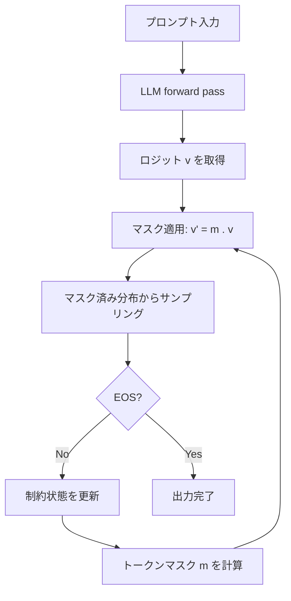

本記事は [https://arxiv.org/abs/2501.10868](https://arxiv.org/abs/2501.10868) の解説記事です。

## 論文概要（Abstract）

JSONSchemaBenchは、LLMの構造化出力における制約付きデコーディング技術を体系的に評価するベンチマークである。Geng et al.は、10,000件の実世界JSONスキーマで6つのフレームワーク（Guidance、Outlines、Llamacpp、XGrammar、OpenAI、Gemini）を**効率性**・**カバレッジ**・**品質**の3次元で評価している。著者らは、制約付きデコーディングが非制約生成比で最大50%の高速化と下流タスク精度の最大4%改善を実現するケースがあると報告している。

この記事は [Zenn記事: Tree of Thoughts x Structured Outputs：型安全な推論木をPythonで実装する](https://zenn.dev/0h_n0/articles/1b1f92f0a382bd) の深掘りです。

## 情報源

- **arXiv ID**: 2501.10868
- **URL**: [https://arxiv.org/abs/2501.10868](https://arxiv.org/abs/2501.10868)
- **著者**: Saibo Geng, Hudson Cooper, Michal Moskal et al.
- **発表年**: 2025年（v3: 2025年2月27日）
- **分野**: cs.CL, cs.AI

## 背景と動機（Background & Motivation）

LLMの出力をJSON等の構造化フォーマットに準拠させる技術は、API連携、データ抽出、関数呼び出しなど多くの実用シナリオで不可欠になっている。制約付きデコーディング（Constrained Decoding）は、生成時にトークンレベルで制約を強制する手法として広く採用されているが、2025年時点でこの技術の体系的な評価基盤は存在しなかった。

従来の課題は主に3つある。第一に、各フレームワークが独自のベンチマークやスキーマセットで評価しており、公平な比較が困難であったこと。第二に、単純なスキーマ（`{"type": "object", "properties": {...}}`程度）でのテストが中心で、`allOf`/`anyOf`/`$ref`といった高度なJSON Schema機能への対応状況が不明確であったこと。第三に、制約付きデコーディングが生成品質に与える影響（トークンマスキングによる分布のシフト）が定量的に評価されていなかったことである。

JSONSchemaBenchはこれらの課題に対し、実世界で使用されている10,000件のスキーマを収集し、統一的な評価フレームワークを提供することで解決を図っている。

## 主要な貢献（Key Contributions）

- **貢献1**: 10,000件の実世界JSONスキーマを10のデータセット（GlaiveAI、GitHub 5段階、Snowplow、Kubernetes、Washington Post、JSONSchemaStore）に体系的に分類したベンチマークの構築
- **貢献2**: 効率性・カバレッジ・品質の3次元評価フレームワークの確立。カバレッジを宣言カバレッジ・経験的カバレッジ・コンプライアンス率に細分化した点が特に重要
- **貢献3**: 6つの主要フレームワーク（Guidance、Outlines、Llamacpp、XGrammar、OpenAI、Gemini）のオープンソース/プロプライエタリ横断比較
- **貢献4**: 制約付きデコーディングが下流タスク品質を最大4%改善し、Guidanceのfast-forwarding機構により非制約生成より50%高速化できることの実証

## 技術的詳細（Technical Details）

### 制約付きデコーディングの仕組み

制約付きデコーディングは、LLMのトークン生成ループに**トークンマスク**を挿入することで、JSON Schemaに準拠しない不正なトークンの生成を防ぐ手法である。論文のAlgorithm 1に基づく処理の流れを以下に示す。



論文Algorithm 1の擬似コードを以下に示す。

```python
def constrained_decode(
    constraint: Constraint, llm: LanguageModel, prompt: str
) -> list[int]:
    """Algorithm 1: Constrained Decoding Loop"""
    output_tokens: list[int] = []
    while True:
        constraint.update(output_tokens)          # 制約状態を更新
        mask = constraint.compute_mask()           # 有効トークンのマスク
        logits = llm.forward(prompt + output_tokens)
        masked_logits = mask * logits              # 無効トークンは確率0
        token = sample(masked_logits)
        if token == EOS:
            break
        output_tokens.append(token)
    return output_tokens
```

**文法コンパイルのアプローチ**は2つに大別される。Guidance/Llamacppは動的計算方式で、コンパイル時間は最小（Guidance: 0.00s、Llamacpp: 0.05s）だが各トークン生成時に制約を計算する。一方、Outlines/XGrammarはJSON SchemaをRegexやGGML BNF（Context-Free Grammar）に事前変換し、有限オートマトンを構築する。Outlinesの文法コンパイル時間（GCT）は3.48〜8.05sと報告されている（論文Table 2より）。

### ベンチマークの設計

10,000件のスキーマは10データセットに分類されている。GlaiveAI-2K（1,707件、関数呼び出し）、GitHubコレクション（5,767件、Trivial/Easy/Medium/Hard/Ultraの5段階）、Snowplow（403件、イベント分析）、Kubernetes（1,064件、コンテナ設定）、Washington Post（125件、ANS仕様）、JSONSchemaStore（492件、本番用スキーマ集）である。GitHubコレクションの複雑度分類は、JSON Schemaキーワードの種類と再帰的`$ref`の深度に基づいている。

### 評価メトリクスの定義

#### カバレッジ（Coverage）

著者らは、カバレッジを3段階の指標に分解している。

**宣言カバレッジ（Declared Coverage）** $\mathcal{C}_{\text{Declared}}$: フレームワークがスキーマをコンパイルエラーなしに処理できた割合。

**経験的カバレッジ（Empirical Coverage）** $\mathcal{C}_{\text{Empirical}}$: 生成された出力が実際にJSON Schemaの検証に通過した割合。

**コンプライアンス率（Compliance Rate）**: フレームワークの信頼性を測る指標。

$$
\text{Compliance Rate} = \frac{\mathcal{C}_{\text{Empirical}}}{\mathcal{C}_{\text{Declared}}}
$$

宣言カバレッジは経験的カバレッジおよび真のカバレッジの上界であり、コンプライアンス率が1.0に近いほど「受理したスキーマに対して正しく制約を適用できている」ことを意味する。

#### 効率性（Efficiency）

3つの時間指標で測定される。

- $\text{GCT}$（Grammar Compilation Time）: スキーマから内部表現への変換時間
- $\text{TTFT}$（Time to First Token）: 入力から最初のトークン出力までの遅延
- $\text{TPOT}$（Time per Output Token）: 出力トークン1つあたりの生成時間

#### 品質（Quality）

トークンマスキングは理論上「不正トークンを除外するだけ」だが、確率分布のシフトにより下流タスクの精度に影響する可能性がある。この影響を、Last Letter（文字列連結推論）、Shuffle Objects（分類）、GSM8K（算術推論）の3タスクで定量評価している。

### Guidanceのfast-forwarding機構

Guidanceが他フレームワークを大幅に上回る効率性を示す要因が**fast-forwarding（高速転送）**である。制約文法上、次のトークンが一意に決定される場合（例: JSONキー名`"name":`の途中トークン列）、LMのforward passをスキップして直接トークンを出力する。

論文Table 13によると、fast-forwardingによるスキップトークン数はGlaiveAIデータセットで平均15.70トークン、GitHub Mediumで31.42トークンに達している。これにより、TPOT 6.37msという非制約生成（15.40ms）の半分以下の速度を実現している。

## 実装のポイント（Implementation）

JSONSchemaBenchのデータセットはHugging Faceで公開されており、`load_dataset("epfl-dlab/JSONSchemaBench")`で既存の評価パイプラインに組み込める。生成結果の検証には`jsonschema.validate()`によるpost-validationが推奨される。

実装上の注意点として、以下がある。

- **コンパイル時間のトレードオフ**: Outlinesはスキーマを正規表現に変換するため初回コンパイルに数秒かかるが、同一スキーマの繰り返し利用ではキャッシュが効く。バッチ処理向きの設計である
- **under-constrained vs over-constrained**: XGrammarはコンパイルエラーが3件と少ないが、under-constrained（スキーマに違反するJSON出力を許容）が38件と多い。本番利用では出力のpost-validation（`jsonschema.validate`等）が必須である
- **大規模スキーマへの対応**: KubernetesやJSONSchemaStoreのような再帰的`$ref`を多用するスキーマでは、全フレームワークで性能が劣化する。Guidanceでも経験的カバレッジが30%前後まで低下する（論文Table 4より）

## Production Deployment Guide

構造化出力をプロダクション環境で運用する際のAWS構成を、トラフィック規模別に整理する。JSONSchemaBenchの知見を踏まえ、フレームワーク選定からインフラ設計まで実装例を示す。

### AWS実装パターン（コスト最適化重視）

| 構成 | トラフィック | 推奨アーキテクチャ | 月額概算 |
|---|---|---|---|
| Small | ~100 req/日 | Lambda + Bedrock (Claude/Nova) | $50-150 |
| Medium | ~1,000 req/日 | ECS Fargate + vLLM + XGrammar | $400-900 |
| Large | 10,000+ req/日 | EKS + Karpenter + Spot (GPU) + vLLM | $2,500-6,000 |

**Small構成**: Amazon Bedrockの構造化出力機能（`response_format`パラメータ）を利用し、Lambda関数から呼び出す。Bedrockは内部的にllguidance相当の制約付きデコーディングを実装しており、スキーマ複雑度がGitHub Easy以下であれば十分なカバレッジが得られる。DynamoDBでスキーマキャッシュと生成結果を保持する。

**Medium構成**: ECS Fargateでvllmコンテナを実行し、XGrammar（vLLMのデフォルト構造化出力バックエンド）を利用する。XGrammarのTPOTは論文Table 2でHugging Face backend時66.78msだが、vLLM統合環境では40マイクロ秒/トークン以下まで最適化されている（2026年3月時点）。ALBでヘルスチェックとリクエスト分散を行う。

**Large構成**: EKS上でKarpenterを用いたGPUノードの動的スケーリングを行う。Spot Instancesを優先し、p4d.24xlargeまたはg5.xlargeインスタンスを使用する。vLLMのguided_jsonパラメータでリクエスト単位のスキーマ指定が可能。

**コスト削減テクニック**:
- Spot Instances活用でGPUコストを最大90%削減（g5.xlarge: On-Demand $1.006/h → Spot $0.30/h前後）
- Reserved Instances（1年コミット）でBedrockオンデマンド料金から最大40%削減
- Bedrock Batch APIで非同期処理を50%割引
- Prompt Caching有効化でBedrockトークンコスト30-90%削減

注: コスト試算は2026年8月時点のAWS ap-northeast-1（東京）リージョン料金に基づく概算値であり、実際のコストはトラフィックパターン、バースト使用量、リージョンにより変動する。最新料金はAWS料金計算ツールで確認を推奨する。

### Terraformインフラコード

**Small構成（Serverless: Lambda + Bedrock + DynamoDB）**:

```hcl
# --- Small構成: Lambda + Bedrock ---
resource "aws_lambda_function" "structured_output" {
  function_name = "structured-output-generator"
  runtime       = "python3.12"
  handler       = "handler.lambda_handler"
  role          = aws_iam_role.structured_output_lambda.arn
  timeout       = 60       # Bedrockレスポンス待ち考慮
  memory_size   = 512      # jsonschema検証用メモリ
  filename      = "lambda.zip"

  environment {
    variables = {
      SCHEMA_CACHE_TABLE = aws_dynamodb_table.schema_cache.name
      BEDROCK_MODEL_ID   = "anthropic.claude-sonnet-4-20250514"
    }
  }
}

# スキーマキャッシュ（On-Demand: 低トラフィック向け低コスト）
resource "aws_dynamodb_table" "schema_cache" {
  name         = "structured-output-schemas"
  billing_mode = "PAY_PER_REQUEST"
  hash_key     = "schema_hash"
  attribute { name = "schema_hash"; type = "S" }
  server_side_encryption { enabled = true }
}
```

**Large構成（Container: EKS + Karpenter + Spot）**:

```hcl
# --- Large構成: EKS + vLLM + Spot GPU ---
module "eks" {
  source          = "terraform-aws-modules/eks/aws"
  version         = "~> 20.0"
  cluster_name    = "structured-output-cluster"
  cluster_version = "1.31"
  vpc_id          = module.vpc.vpc_id
  subnet_ids      = module.vpc.private_subnets
  cluster_endpoint_public_access = false
}

# Karpenter: Spot優先GPUノード自動スケーリング
resource "kubectl_manifest" "karpenter_nodepool" {
  yaml_body = yamlencode({
    apiVersion = "karpenter.sh/v1"
    kind       = "NodePool"
    metadata   = { name = "gpu-spot" }
    spec = {
      template = {
        spec = {
          requirements = [
            { key = "karpenter.sh/capacity-type", operator = "In",
              values = ["spot", "on-demand"] },
            { key = "node.kubernetes.io/instance-type", operator = "In",
              values = ["g5.xlarge", "g5.2xlarge"] },
          ]
        }
      }
      limits = { cpu = "128", memory = "512Gi" }
      disruption = { consolidationPolicy = "WhenEmptyOrUnderutilized" }
    }
  })
}
```

### 運用・監視設定

**CloudWatch Logs Insights: スキーマ準拠率監視**:

```
fields @timestamp, schema_id, compliance, latency_ms
| filter event = "structured_output_generated"
| stats avg(latency_ms) as avg_latency,
        sum(case when compliance = "pass" then 1 else 0 end) / count(*) * 100 as compliance_rate
  by bin(1h)
```

**X-Ray トレーシング + CloudWatchアラーム（Python）**:

```python
import boto3
from aws_xray_sdk.core import xray_recorder, patch_all

patch_all()  # boto3自動計装

cloudwatch = boto3.client("cloudwatch")

# スキーマ準拠率低下アラーム
cloudwatch.put_metric_alarm(
    AlarmName="structured-output-compliance-drop",
    MetricName="ComplianceRate",
    Namespace="StructuredOutput",
    Statistic="Average",
    Period=3600,
    EvaluationPeriods=2,
    Threshold=95.0,
    ComparisonOperator="LessThanThreshold",
    AlarmActions=["arn:aws:sns:ap-northeast-1:ACCOUNT:alerts"],
)

@xray_recorder.capture("validate_schema")
def validate_and_generate(schema: dict, prompt: str) -> dict:
    """構造化出力生成をX-Rayでトレース"""
    subsegment = xray_recorder.current_subsegment()
    subsegment.put_annotation("schema_complexity", classify_schema(schema))
    subsegment.put_metadata("schema", schema, "input")
    # ... Bedrock呼び出し + jsonschema検証
    return result
```

### コスト最適化チェックリスト

**アーキテクチャ選択**: トラフィック量（~100: Serverless / ~1,000: Hybrid / 10,000+: Container）とスキーマ複雑度（Easy以下: Bedrock / Hard以上: vLLM+XGrammar）で判断する。

**リソース最適化**: EC2/EKSでSpot Instances優先、安定ワークロードにReserved Instances（1年コミット）、Lambda Power Tuningでメモリ最適化、Karpenter `consolidationPolicy`でアイドルノード自動回収。

**LLMコスト削減**: Bedrock Batch APIで非リアルタイム処理を50%割引、Prompt Cachingで繰り返しスキーマ指示をキャッシュ（30-90%削減）、モデル選択ロジック（単純スキーマにはHaiku/Nova Lite、複雑スキーマにはSonnet）、max_tokensを出力サイズに応じて制限。

**監視・アラート**: AWS Budgets月次上限、CloudWatchスキーマ準拠率アラーム、Cost Anomaly Detection、日次コストレポートSNS通知。

**リソース管理**: 未使用リソース削除、タグ戦略（`Project`/`Environment`/`CostCenter`）、S3ライフサイクルポリシー、開発環境夜間停止、ECRイメージ自動削除。

## 実験結果（Results）

### フレームワーク効率性比較

論文Table 2より、Llamacppバックエンド上でLlama 3.1-8B-Instructを使用した効率性の比較を示す。

| フレームワーク | GCT (s) | TPOT (ms) | 特記事項 |
|---|---|---|---|
| LM only（非制約） | N/A | 15.40 | ベースライン |
| Guidance | 0.00 | 6.37 | fast-forwarding加速 |
| Outlines | 3.48 | 30.33 | 文法コンパイルが重い |
| Llamacpp | 0.05 | 29.98 | 低コンパイル時間 |

GuidanceのTPOT 6.37msは非制約生成の15.40msを下回っている。著者らは、fast-forwardingにより「制約付きデコーディングが非制約より高速になりうる」という直感に反する結果を報告している。

### カバレッジ比較

論文Table 4より、Llama 3.2-1Bでの経験的カバレッジを示す。

| データセット | Guidance | Llamacpp | Outlines | XGrammar | OpenAI | Gemini |
|---|---|---|---|---|---|---|
| GlaiveAI | 0.96 | 0.95 | 0.95 | -- | 0.89 | -- |
| GitHub Easy | 0.86 | 0.75 | 0.59 | 0.79 | 0.29 | 0.07 |
| GitHub Medium | 0.69 | 0.57 | 0.29 | -- | 0.12 | -- |
| GitHub Hard | 0.41 | 0.39 | 0.03 | -- | 0.09 | -- |

単純なスキーマ（GlaiveAI）では全フレームワークが90%以上のカバレッジを達成するが、GitHub Hard以上の複雑なスキーマではGuidanceとLlamacppでも40%前後まで低下する。JSONSchemaStoreではGuidance 30%、Llamacpp 38%と報告されており（論文Table 4より）、本番環境で複雑なスキーマを使用する際にはpost-validationの実装が必須である。

### JSON Schema Test Suite

公式JSON Schema Test Suite（45カテゴリ）でのカバレッジを論文Table 5より示す。

| 基準 | Guidance | Llamacpp | XGrammar | Outlines |
|---|---|---|---|---|
| 100%カバレッジ | 13カテゴリ | 1 | 1 | 0 |
| 75%以上 | 17 | 2 | 1 | 0 |
| 50%以上 | 21 | 5 | 3 | 2 |

Guidanceが45カテゴリ中13で完全カバレッジを達成し、JSON Schema仕様への準拠度で他を大きく引き離している。

### 品質への影響

論文Table 8より、Llama 3.1-8B-Instructでの下流タスク精度を示す。

| タスク | LM only | Guidance | Llamacpp | Outlines |
|---|---|---|---|---|
| Last Letter | 50.7% | 54.0% (+3.3) | 52.0% (+1.3) | 53.3% (+2.6) |
| Shuffle Objects | 52.6% | 55.9% (+3.3) | 52.6% (0.0) | 53.0% (+0.4) |
| GSM8K | 80.1% | 83.8% (+3.7) | 82.4% (+2.3) | 81.6% (+1.5) |

制約付きデコーディングは全タスクで精度を維持または改善している。著者らは、トークンマスキングが不正フォーマットのトークン（余分な空白、引用符の欠落等）を排除することで、モデルが推論に集中できるようになると分析している。

### 失敗モード分析

論文Table 6より、各フレームワークの失敗パターンを示す。

| 失敗タイプ | Outlines | Llamacpp | XGrammar | Guidance |
|---|---|---|---|---|
| コンパイルエラー | 42 | 37 | 3 | 25 |
| 過制約（over-constrained） | 16 | 18 | 5 | 7 |
| 不足制約（under-constrained） | 8 | 7 | 38 | 1 |

XGrammarはコンパイルエラーが少ない（3件）代わりにunder-constrainedが多く（38件）、スキーマ違反の出力を許容する傾向がある。Guidanceはunder-constrainedが1件のみで、最も厳密な制約適用を実現している。

## 実運用への応用（Practical Applications）

### フレームワーク選定指針

- **関数呼び出し（GlaiveAI相当）**: 全フレームワークでカバレッジ90%以上。APIプロバイダの組み込み機能で十分
- **中程度の複雑度（GitHub Easy〜Medium）**: Guidance（86-69%）またはXGrammar/vLLM統合（79%）を推奨
- **高複雑度（GitHub Hard、Kubernetes）**: Guidance（41%）/Llamacpp（39%）に限定。post-validationとリトライ必須

### Zenn記事との関連

関連Zenn記事「Tree of Thoughts x Structured Outputs」では、Pydanticモデルを用いた型安全な推論木の実装が紹介されている。JSONSchemaBenchの知見は、このようなStructured Outputs利用時のフレームワーク選定とスキーマ設計の最適化に直接活用できる。特に、複雑なネスト構造を持つ推論木スキーマでは、GitHub Hard相当の複雑度になる可能性があり、Guidanceまたはvllm+XGrammarの選定と、生成後のPydanticバリデーション（post-validation）の組み合わせが有効である。

## 関連研究（Related Work）

- **Outlines (Willard & Louf, 2023)**: JSON SchemaをRegexに変換し有限状態オートマトンで制約を強制する先駆的研究。JSONSchemaBenchではコンパイル時間とカバレッジの課題が指摘されている
- **XGrammar (Dong et al., 2024)**: 語彙トークンをcontext-independent/dependentに分類し事前計算を最大化。vLLM/SGLang/TensorRT-LLMのデフォルトバックエンド
- **llguidance (Microsoft, 2025)**: Rust実装のEarleyパーサベース制約エンジン。約50us/tokenで動作し、OpenAIがStructured Outputsの基盤技術として言及

## まとめと今後の展望

JSONSchemaBenchは、LLMの構造化出力における制約付きデコーディング技術を初めて体系的に評価したベンチマークである。Geng et al.の評価により、以下の知見が得られている。(1) Guidanceがカバレッジ・効率性・品質の全次元で最高水準を示す、(2) fast-forwardingにより制約付きデコーディングが非制約生成より高速化しうる、(3) 複雑なスキーマでは全フレームワークのカバレッジが大幅に低下する、(4) 制約付きデコーディングは下流タスク品質を劣化させず、むしろ改善する傾向がある。

今後の研究方向として、著者らは高複雑度スキーマへのカバレッジ向上、コンパイル時間の削減、そしてより大規模なモデル（70B以上）での評価を挙げている。JSONSchemaBenchはEleutherAIのlm-evaluation-harnessにも統合されており、構造化出力技術の標準的な評価基盤として今後の発展が期待される。

## 参考文献

- **arXiv**: [https://arxiv.org/abs/2501.10868](https://arxiv.org/abs/2501.10868)
- **Code**: [https://github.com/guidance-ai/jsonschemabench](https://github.com/guidance-ai/jsonschemabench)
- **Dataset**: [https://huggingface.co/datasets/epfl-dlab/JSONSchemaBench](https://huggingface.co/datasets/epfl-dlab/JSONSchemaBench)
- **Related Zenn article**: [https://zenn.dev/0h_n0/articles/1b1f92f0a382bd](https://zenn.dev/0h_n0/articles/1b1f92f0a382bd)
