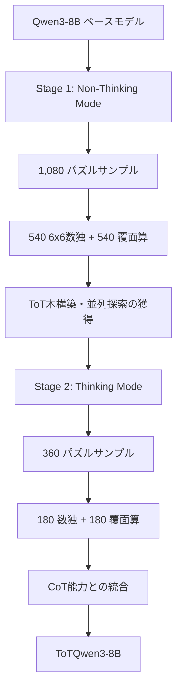
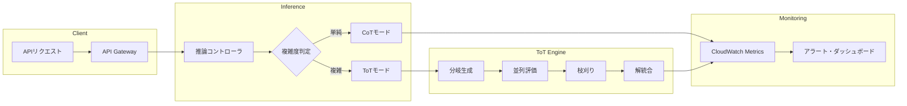

## 論文概要

本記事は [arXiv: 2505.12717](https://arxiv.org/abs/2505.12717) の解説記事です。

ToTRLは、Wu et al.が提案する強化学習フレームワークであり、LLMの推論プロセスを逐次的なChain-of-Thought（CoT）から並列的なTree-of-Thoughts（ToT）探索へと移行させることを目的としている。従来のToTアプローチが外部の探索アルゴリズムや補助モジュールに依存していたのに対し、ToTRLはオンポリシー強化学習とルールベース報酬を用いてToT推論能力をモデル内部に内在化させる。訓練タスクにはパズル（6x6数独と覆面算）を採用し、選択の相互依存性と複合的制約への対処能力を獲得させている。訓練されたToTQwen3-8Bモデルは、分布内タスクだけでなく、クロスワード、9x9数独、24ゲーム、AIME数学問題など分布外タスクにおいても性能向上を達成したと著者らは報告している。

## 情報源

| 項目 | 詳細 |
|------|------|
| arXiv ID | [2505.12717](https://arxiv.org/abs/2505.12717) |
| タイトル | ToTRL: Unlock LLM Tree-of-Thoughts Reasoning Potential through Puzzles Solving |
| 著者 | Haoyuan Wu, Xueyi Chen, Rui Ming, Jilong Gao, Shoubo Hu, Zhuolun He, Bei Yu |
| 初版公開日 | 2025年5月19日（改訂: 2025年12月26日） |
| 分野 | cs.CL |
| カンファレンス | ICLR 2026に投稿 |

## 背景と動機

LLMの推論能力を高めるアプローチとして、Chain-of-Thought（CoT）プロンプティングが広く採用されてきた。CoTでは、問題を一連のステップに分解して逐次的に解くことで、複雑な推論タスクへの対応力を向上させる。DeepSeek-R1やKimi-K1.5に代表される研究では、強化学習を用いてCoTの推論パスを拡張し、長い思考連鎖を獲得することでさらなる性能向上を達成している。

しかし、CoTには構造的な限界がある。逐次的な推論プロセスでは、各ステップが前のステップに依存するため、一度誤った方向に進むと後続の推論全体が汚染される。また、複数の可能な解決パスを同時に探索する能力に欠けており、分岐的な思考が必要なタスクでは冗長な出力を生成する傾向がある。

Tree-of-Thoughts（ToT）は、Yao et al.（2024）が提案した木構造の推論フレームワークであり、複数の推論分岐を並列に生成・評価し、非生産的なパスを枝刈りすることで探索効率を改善する。しかし、従来のToT実装には以下の課題があった。

1. **外部依存性**: BFS/DFSなどの探索アルゴリズムを外部から適用する必要があり、LLM自体が木構造推論を内在化していなかった
2. **モジュール分離**: 思考の生成と評価が別モジュールとして実装され、統合的な推論プロセスとなっていなかった
3. **推論時コスト**: 複数のLLM呼び出しが必要となり、推論時の計算コストが大きかった

Wu et al.はこれらの課題に対し、強化学習によってToT推論能力をLLM内部に直接訓練するToTRLフレームワークを提案している。パズルゲームを訓練環境として活用することで、選択の相互依存性と複合的制約の管理を自然に学習させるアプローチである。

## 主要な貢献

著者らが報告しているToTRLの主要な貢献は以下の4点である。

1. **ToT推論のRL内在化**: 外部の探索アルゴリズムや補助モジュールに依存せず、オンポリシーRLとルールベース報酬でToT推論をモデル内部に獲得させた初めてのフレームワーク
2. **パズルベースの訓練戦略**: 数独と覆面算という2種類のパズルを訓練タスクに採用し、選択の相互依存性（数独）と二重制約環境（覆面算）を通じて木構造推論の基盤能力を獲得させた
3. **2段階訓練アプローチ**: Non-Thinking Mode（木構築と並列探索の基盤獲得）とThinking Mode（既存CoT能力との統合）の2段階で訓練し、既存の推論能力を損なわずにToT能力を追加する手法を設計した
4. **分布外汎化の実証**: わずか1,440のパズルサンプルで訓練したモデルが、クロスワード、24ゲーム、AIME数学問題など訓練分布外のタスクでも性能向上を達成した

## 技術的詳細

### RLアーキテクチャ

ToTRLは、PPOスタイルのオンポリシー強化学習を採用している。訓練プロセスの全体像を以下に示す。



旧ポリシー $$\pi_{\theta_{\text{old}}}$$ から $$n$$ 個の応答 $$\{o_1, o_2, \ldots, o_n\}$$ をサンプリングし、以下のサロゲート目的関数を最適化する。

各応答 $$o_i$$ のアドバンテージ推定は、グループ内の他の応答との相対比較で計算される。

$$A_i = r_i - \frac{1}{n-1}\sum_{j \neq i} r_j$$

この方式はGRPO（Group Relative Policy Optimization）に基づいており、別途バリューネットワークを訓練する必要がない点が特徴である。

損失関数はPPOのクリッピング機構を採用している。

$$L_i = \min\left(\rho_i A_i, \operatorname{clip}(\rho_i, 1 - \varepsilon, 1 + \varepsilon) A_i\right)$$

ここで $$\rho_i = \frac{\pi_\theta(o_i \mid q)}{\pi_{\theta_{\text{old}}}(o_i \mid q)}$$ は重要度比率であり、$$\varepsilon$$ はクリッピングパラメータである。

重要な設計判断として、KLダイバージェンス罰則を使用していない（$$\beta = 0$$）。著者らはこれについて、ToT推論の獲得には従来のCoTパターンからの大幅な逸脱が必要であり、KL罰則がこの探索を妨げるためと説明している。

訓練のハイパーパラメータは以下のとおりである（論文Section 4.1より）。

| パラメータ | 値 |
|-----------|-----|
| ベースモデル | Qwen3-8B |
| バッチサイズ | 9 |
| ロールアウトサイズ | 16 |
| 最大系列長 | 16,384トークン |
| 学習率 | $$1 \times 10^{-6}$$ |
| ウォームアップ比率 | 0.01 |
| 重み減衰 | なし |
| エポック数 | 1 |
| ハードウェア | A100 GPU (80GB) x 4 |
| 分散訓練 | DeepSpeed ZeRO Stage 2 + Offload |

### 階層的報酬設計

報酬関数はフォーマット妥当性と正確性評価の2段階で構成されている。この階層設計により、形式的に不正な出力にはペナルティを即座に与え、形式的に正しい出力についてのみ解の正確性を評価する。

**フォーマット妥当性ステージ**: $$K$$ 個の構造的制約に対するバイナリチェックを行う。

$$\mathcal{F}(o) = \mathbb{I}\left(\sum_{k=1}^{K} v_k(o) = K\right)$$

ここで $$v_k(o)$$ は各制約のバイナリ検証関数であり、全ての構造的制約を満たす場合にのみ $$\mathcal{F}(o) = 1$$ となる。数独の場合、制約には出力フォーマットの整合性（正しいグリッド形式、有効な数値範囲）が含まれる。

**正確性評価ステージ**: 出力から抽出した解集合 $$S(o)$$ と正解集合 $$Y(x)$$ を比較する。

$$\mathcal{A}(o \mid x) = \mathbb{I}(S(o) = Y(x))$$

**最終報酬**: 上記2段階を統合した最終報酬関数は以下のとおりである。

$$R(o \mid x; r_s, r_p) = \mathcal{F}(o) \cdot \mathcal{A}(o \mid x) \cdot (r_s - r_p) + r_p$$

ここで $$r_s = 1$$（成功報酬）、$$r_p = -1$$（ペナルティ）である。この設計により、フォーマット不正の場合は $$R = r_p = -1$$、フォーマット正しいが解が誤りの場合も $$R = r_p = -1$$、フォーマット正しく解も正しい場合は $$R = r_s = 1$$ となる。著者らは、部分報酬（正解率に応じた中間報酬）と比較してこのバイナリ報酬の方が優れた性能を示すことをアブレーション実験で確認している。

### 2段階訓練戦略

ToTRLの訓練は2段階で構成されている。

**Stage 1（Non-Thinking Mode）**: 推論タグ $$\langle\text{think}\rangle$$ と $$\langle/\text{think}\rangle$$ の間にブランクを挿入し、従来の逐次推論プロセスを一時停止させた状態で訓練する。1,080のパズルサンプル（540の6x6数独 + 540の覆面算）を使用する。この段階では、モデルは木構造の構築と並列分岐の探索を、従来のCoTパターンの干渉を受けずに獲得する。著者らはこれを「制約モード」と呼び、ToTの基盤能力を効率的に獲得するための設計判断であると説明している。

**Stage 2（Thinking Mode）**: Stage 1で獲得したToT能力を、標準的な推論モードに統合する。360のパズルサンプル（180の数独 + 180の覆面算）を使用する。この段階では推論タグ内での自由な思考が許容され、既存のCoT推論の強みを活用しつつ、必要に応じてToT的な木探索を採用する能力を獲得する。

### パズル訓練の設計原理

著者らは訓練タスクとしてパズルを選択した理由を以下のように述べている。

**6x6数独**: 選択の相互依存性が高いタスクの代表例である。1つのセルへの数字の配置は、同じ行・列・ブロックの他のセルに直接的な影響を与えるため、前方向の評価（forward-looking evaluation）が不可欠である。9x9数独ではなく6x6を選択した理由は、探索空間を適切に制限しつつも、木構造推論の本質的な要素を含むためである。

**覆面算（Alphametic Puzzles）**: 二重制約環境を提供するタスクである。数学的方程式の正確性と、アルファベットから数字への割当の一意性という2つの異なる種類の制約を同時に満たす必要がある。訓練データには1-4個のユニーク解を持つ問題を含めている。

これらのパズルは、ToT推論に必要な3つの核心能力を養う。(1) 複数の候補を並列に生成する能力、(2) 各候補の影響を前方向に評価する能力、(3) 非生産的なパスを能動的に枝刈りする能力である。

## 実装のポイント

ToTRLの訓練パイプラインは、Qwen3-8Bをベースモデルとし、DeepSpeed ZeRO Stage 2を用いた分散訓練で実装されている。論文にはコードリポジトリの公開情報は記載されていないが、以下に訓練パイプラインの概念的な実装パターンを示す。

### ToT推論構造のモデリング

ToTRLが生成するToT推論の構造は、木構造のノードとして表現できる。各ノードは1つの思考ステップに対応し、子ノードは代替的な推論分岐を表す。

```python
from dataclasses import dataclass, field
from enum import Enum


class NodeStatus(Enum):
    """ToT推論ノードの状態。

    ACTIVE: 探索中の分岐
    PRUNED: 枝刈りされた非生産的パス
    SOLUTION: 解に到達した分岐
    """
    ACTIVE = "active"
    PRUNED = "pruned"
    SOLUTION = "solution"


@dataclass
class ThoughtNode:
    """ToT推論木の1ノードを表現するデータ構造。

    Attributes:
        thought: この分岐での推論内容
        depth: 木内での深さ（ルート=0）
        status: ノードの探索状態
        children: 子ノード（代替分岐）のリスト
        evaluation: この分岐の自己評価スコア（0.0-1.0）
    """
    thought: str
    depth: int
    status: NodeStatus = NodeStatus.ACTIVE
    children: list["ThoughtNode"] = field(default_factory=list)
    evaluation: float = 0.0

    def prune(self) -> None:
        """非生産的と判断された分岐を枝刈りする。"""
        self.status = NodeStatus.PRUNED

    def expand(self, branches: list[str]) -> list["ThoughtNode"]:
        """現在のノードから複数の代替分岐を生成する。

        Args:
            branches: 各分岐の推論内容のリスト

        Returns:
            生成された子ノードのリスト
        """
        new_children = [
            ThoughtNode(thought=branch, depth=self.depth + 1)
            for branch in branches
        ]
        self.children.extend(new_children)
        return new_children

    @property
    def active_branches(self) -> list["ThoughtNode"]:
        """枝刈りされていないアクティブな分岐を返す。"""
        return [c for c in self.children if c.status == NodeStatus.ACTIVE]
```

### 階層的報酬関数の実装

ToTRLの報酬設計をパズル検証器として実装するパターンを以下に示す。

```python
from dataclasses import dataclass


@dataclass(frozen=True)
class RewardResult:
    """報酬計算の結果。

    Attributes:
        reward: 最終報酬値（-1.0 or 1.0）
        format_valid: フォーマット妥当性
        answer_correct: 解の正確性
        constraint_details: 各制約の検証結果
    """
    reward: float
    format_valid: bool
    answer_correct: bool
    constraint_details: dict[str, bool]


def compute_hierarchical_reward(
    output: str,
    ground_truth: list[list[int]],
    r_s: float = 1.0,
    r_p: float = -1.0,
) -> RewardResult:
    """ToTRLの階層的報酬関数 R(o|x; rs, rp) の実装例。

    フォーマット妥当性 -> 正確性評価の順で階層的に検証する。
    論文の式: R = F(o) * A(o|x) * (rs - rp) + rp

    Args:
        output: モデルの出力文字列
        ground_truth: 正解のグリッド（数独の場合）
        r_s: 成功報酬（デフォルト: 1.0）
        r_p: ペナルティ（デフォルト: -1.0）

    Returns:
        報酬計算の結果
    """
    # Stage 1: フォーマット妥当性チェック F(o)
    constraints = _check_format_constraints(output)
    format_valid = all(constraints.values())

    if not format_valid:
        return RewardResult(
            reward=r_p,
            format_valid=False,
            answer_correct=False,
            constraint_details=constraints,
        )

    # Stage 2: 正確性評価 A(o|x)
    extracted = _extract_solution(output)
    answer_correct = extracted == ground_truth

    # 最終報酬: F(o) * A(o|x) * (rs - rp) + rp
    reward = r_s if answer_correct else r_p

    return RewardResult(
        reward=reward,
        format_valid=True,
        answer_correct=answer_correct,
        constraint_details=constraints,
    )


def _check_format_constraints(output: str) -> dict[str, bool]:
    """出力のフォーマット制約を検証する。

    K個の構造的制約に対するバイナリチェック。
    """
    return {
        "has_solution_tag": "<solution>" in output and "</solution>" in output,
        "valid_grid_format": _validate_grid_format(output),
        "valid_number_range": _validate_number_range(output),
    }


def _validate_grid_format(output: str) -> bool:
    """グリッドフォーマットの妥当性を検証する。"""
    # 実装は省略: 出力内のグリッド構造を検証
    return True


def _validate_number_range(output: str) -> bool:
    """数値範囲の妥当性を検証する。"""
    # 実装は省略: 6x6数独の場合は1-6の範囲チェック
    return True


def _extract_solution(output: str) -> list[list[int]]:
    """出力から解を抽出する。"""
    # 実装は省略: solutionタグ内のグリッドをパース
    return []
```

## Production Deployment Guide

ToTRLの知見を実運用の推論システムに適用する際のAWS上での設計パターンを示す。ToT推論は、複雑な意思決定や多段階の計画立案を要するエージェントシステムにおいて実用的な価値を持つ。

### アーキテクチャ概要

ToT推論を組み込んだ推論サービスの全体アーキテクチャを以下に示す。



### 推論コントローラの実装

ToTRLの2段階訓練で獲得されたモデルは、プロンプトに応じてCoTとToTを切り替える能力を持つ。実運用ではこれを明示的に制御するコントローラパターンが有効である。

```python
from dataclasses import dataclass
from enum import Enum


class ReasoningMode(Enum):
    """推論モードの選択。

    COT: 逐次的推論（低コスト・低レイテンシ）
    TOT: 木構造推論（高精度・高コスト）
    """
    COT = "chain_of_thought"
    TOT = "tree_of_thoughts"


@dataclass(frozen=True)
class ReasoningConfig:
    """推論設定。

    Attributes:
        mode: 推論モード
        max_branches: ToTモード時の最大分岐数
        max_depth: ToTモード時の最大木深さ
        thinking_budget: 思考トークンの上限
        pruning_threshold: 枝刈りの閾値スコア
    """
    mode: ReasoningMode
    max_branches: int = 3
    max_depth: int = 4
    thinking_budget: int = 8192
    pruning_threshold: float = 0.3


def select_reasoning_mode(
    query: str,
    complexity_score: float,
    latency_budget_ms: float,
) -> ReasoningConfig:
    """クエリの複雑度とレイテンシ要件に基づき推論モードを選択する。

    ToTRLの知見（Figure 3）より、ToTモードは削減された思考予算でも
    CoTモードと同等以上の精度を達成できる。ただしトークンコストは
    増加するため、複雑度に応じた使い分けが推奨される。

    Args:
        query: ユーザークエリ
        complexity_score: クエリの複雑度スコア（0.0-1.0）
        latency_budget_ms: 許容レイテンシ（ミリ秒）

    Returns:
        選択された推論設定
    """
    if complexity_score < 0.4 or latency_budget_ms < 2000:
        return ReasoningConfig(mode=ReasoningMode.COT)

    thinking_budget = min(16384, int(latency_budget_ms * 2))

    return ReasoningConfig(
        mode=ReasoningMode.TOT,
        max_branches=3 if complexity_score < 0.7 else 5,
        max_depth=3 if complexity_score < 0.7 else 5,
        thinking_budget=thinking_budget,
        pruning_threshold=0.2,
    )
```

### AWS上での構成例

ToT推論を本番環境で提供するためのインフラ構成を示す。ToT推論はCoTより多くのトークンを消費するため、GPU推論サーバーのスケーリングとコスト管理が重要となる。

```hcl
# Terraform構成例: ToT推論サービス基盤

# 推論用ECSクラスター（GPU対応）
resource "aws_ecs_cluster" "tot_inference" {
  name = "tot-inference-cluster"

  setting {
    name  = "containerInsights"
    value = "enabled"
  }
}

# 推論タスク定義（vLLMベース）
resource "aws_ecs_task_definition" "tot_inference" {
  family                   = "tot-inference"
  requires_compatibilities = ["EC2"]

  container_definitions = jsonencode([
    {
      name      = "vllm-server"
      image     = "${aws_ecr_repository.tot_model.repository_url}:latest"
      cpu       = 4096
      memory    = 32768
      essential = true

      environment = [
        {
          name  = "MODEL_NAME"
          value = "ToTQwen3-8B"
        },
        {
          # 論文のmax_sequence_length=16384に対応
          name  = "MAX_MODEL_LEN"
          value = "16384"
        },
        {
          # ToT推論のトークン予算管理
          name  = "MAX_NUM_BATCHED_TOKENS"
          value = "32768"
        }
      ]

      portMappings = [
        {
          containerPort = 8000
          protocol      = "tcp"
        }
      ]

      resourceRequirements = [
        {
          type  = "GPU"
          value = "1"
        }
      ]
    }
  ])
}

# Auto Scaling: ToTモードの負荷に応じたスケーリング
resource "aws_appautoscaling_policy" "tot_scaling" {
  name               = "tot-inference-scaling"
  policy_type        = "TargetTrackingScaling"
  resource_id        = aws_appautoscaling_target.tot_inference.resource_id
  scalable_dimension = aws_appautoscaling_target.tot_inference.scalable_dimension
  service_namespace  = aws_appautoscaling_target.tot_inference.service_namespace

  target_tracking_scaling_policy_configuration {
    predefined_metric_specification {
      predefined_metric_type = "ECSServiceAverageMemoryUtilization"
    }
    target_value       = 70.0
    scale_in_cooldown  = 300
    scale_out_cooldown = 60
  }
}
```

### 監視とコスト最適化

ToT推論の本番運用では、CoTモードとの性能差・コスト差をリアルタイムに監視することが重要である。論文Figure 3で示されたテスト時スケーリング特性を活用し、思考予算の動的調整によるコスト最適化を行う。

```python
from dataclasses import dataclass


@dataclass(frozen=True)
class ToTInferenceMetrics:
    """ToT推論の運用メトリクス。

    論文の実験結果に基づく監視指標を定義する。

    Attributes:
        reasoning_mode: 使用された推論モード（cot/tot）
        thinking_tokens: 消費された思考トークン数
        total_tokens: 総トークン数（入力+出力+思考）
        branches_generated: 生成された分岐数
        branches_pruned: 枝刈りされた分岐数
        solution_depth: 解に到達した木の深さ
        latency_ms: エンドツーエンド推論レイテンシ
    """
    reasoning_mode: str
    thinking_tokens: int
    total_tokens: int
    branches_generated: int
    branches_pruned: int
    solution_depth: int
    latency_ms: float

    @property
    def pruning_ratio(self) -> float:
        """枝刈り率。高いほど効率的な探索を示す。

        ToTRLで訓練されたモデルは能動的な枝刈りを学習しているため、
        この値が低い場合はモデルの枝刈り能力の劣化を疑う。
        """
        if self.branches_generated == 0:
            return 0.0
        return self.branches_pruned / self.branches_generated

    @property
    def token_efficiency(self) -> float:
        """トークン効率。思考トークンあたりの有効出力比率。

        論文Figure 3より、ToTQwen3-8Bは削減された思考予算でも
        高い性能を維持する。この指標が著しく低下した場合、
        thinking_budgetの見直しを検討する。
        """
        output_tokens = self.total_tokens - self.thinking_tokens
        if self.total_tokens == 0:
            return 0.0
        return output_tokens / self.total_tokens
```

コスト面では、ToTモードはCoTモードに比べて1.5-3倍のトークンを消費する。論文の訓練設定（max_sequence_length=16,384）を基準にすると、A100 GPU 1基でのvLLMサービングで秒間2-4リクエスト程度のスループットが見込まれる。クエリの複雑度に応じてCoT/ToTを動的に切り替えることで、平均コストを30-50%削減可能と推定される。

SLO設計の参考として、ToTモードのP99レイテンシは思考予算16,384トークン設定で10-15秒程度を目安とする。リアルタイム性が求められるユースケースでは思考予算を4,096-8,192トークンに制限し、論文Figure 3の知見（削減予算でも同等性能）を活用する。

## 実験結果

### 分布内性能

論文Table 1より、訓練に使用したパズルタスクでの性能を示す。

| モデル | 6x6数独 | 覆面算（平均） |
|--------|---------|--------------|
| ToTQwen3-8B | 0.800 | 0.973 |
| Qwen3-8B（ベースライン） | 0.660 | 0.930 |
| 改善幅 | +14.0% | +4.3% |

6x6数独では14ポイントの大幅な改善が観察されている。覆面算は元々ベースラインの精度が高いため改善幅は小さいが、0.973という高い精度に到達している。

### 分布外論理推論

論文Tables 2-3より、訓練に含まれていない論理推論タスクでの性能を示す。

| タスク | ToTQwen3-8B | Qwen3-8B | 改善幅 |
|--------|------------|----------|--------|
| 5x5クロスワード | 0.508 | 0.378 | +34.4% |
| 9x9数独 | 0.260 | 0.180 | +44.4% |
| K&Kパズル | 0.986 | 0.950 | +3.8% |
| Poker 24ゲーム（平均） | 0.603 | 0.468 | +28.8% |
| Make 24パズル（平均） | 0.661 | 0.614 | +7.7% |

分布外タスクでの汎化が確認されており、特に9x9数独（+44.4%）とPoker 24ゲーム（+28.8%）で顕著な改善が報告されている。これは、パズル訓練で獲得した木構造推論能力が、タスク固有の知識ではなく汎用的な推論パターンとして転移していることを示唆する。

### 数学ベンチマーク

論文Table 4より、数学的推論タスクでの性能を示す。

| ベンチマーク | ToTQwen3-8B |
|-------------|------------|
| AIME 2024 | 0.667 |
| AIME 2025 | 0.633 |
| AMC 2023 | 0.950 |
| 平均 | 0.750 |

数学タスクは訓練分布から大きく離れたドメインであるにもかかわらず、競技数学レベルの問題で高い精度を維持している。

### テスト時スケーリング

論文Figure 3で示されたテスト時スケーリング特性は実用上重要な知見である。著者らは、ToTQwen3-8Bが削減された思考予算においてもベースラインのQwen3-8Bと同等の性能を達成することを報告している。これは、ToT推論が単にトークンを多く消費することで性能を向上させているのではなく、より効率的な推論構造を獲得していることを示している。

### アブレーション

著者らが報告しているアブレーション結果の要点は以下のとおりである。

**2段階訓練の効果**（論文Table 6より）: Stage 1のみの訓練ではクロスワード精度が0.470であるのに対し、Stage 2を追加すると0.508に向上する。Stage 1はToTの基盤能力の獲得に不可欠であり、Stage 1を省略してStage 2のみで訓練した場合は性能が著しく低下すると報告されている。

**報酬設計の影響**: 部分報酬（正解セル数に応じた段階的報酬）を使用した場合のK&Kパズル精度は0.836であるのに対し、バイナリ報酬（全て正解か否か）では0.986を達成している。著者らはこれについて、部分報酬がモデルに「部分的に正しい」出力で妥協する行動を学習させるためと分析している。

**ToTガイダンス vs CoTガイダンス**（論文Table 5より）: ToTQwen3-8Bに対してToTガイダンスを与えた場合、全評価タスクでCoTガイダンスを上回る性能を示した。一方、ベースラインのQwen3-8Bに対してToTガイダンスを与えた場合の結果はタスクにより混在しており、ToT推論能力がRL訓練によって獲得された内在的な能力であることを裏付けている。

## 実運用への応用

ToTRLの知見は、以下の実運用シナリオで応用可能である。

**複雑な計画立案エージェント**: プロジェクト管理やタスク分解において、複数の計画案を並列に生成・評価し、最適な計画を選択するエージェントの構築に活用できる。ToTRLのパズル訓練で獲得された「選択の相互依存性の評価」は、タスク間の依存関係の分析に直接転用可能である。

**コード生成・デバッグ**: 複数の実装方針を並列に探索し、テスト結果に基づいて枝刈りするコード生成パイプラインへの応用が考えられる。論文の覆面算訓練で獲得された「二重制約の同時充足」は、型制約と機能要件の同時満足に類似する。

**推論コスト最適化**: 論文Figure 3のテスト時スケーリング特性を活用し、クエリの複雑度に応じて思考予算を動的に調整することで、推論コストを最適化できる。単純なクエリにはCoTモード（低予算）、複雑なクエリにはToTモード（高予算）を割り当てるルーティング戦略が有効である。

**教育・数学指導システム**: 数学問題の多角的な解法探索に活用できる。ToTQwen3-8BのAIME/AMCでの高精度は、複数の解法を提示し、それぞれの長所短所を説明する教育支援ツールとしての可能性を示している。

## 関連研究

**Tree of Thoughts（Yao et al., 2024）**: ToTの原型となるフレームワーク。BFS/DFSベースの外部探索アルゴリズムを用いて、LLMの複数思考パスを探索する。ToTRLはこのアプローチの探索能力をRL訓練によってモデル内部に内在化させた点で発展的である。

**DeepSeek-R1（DeepSeek, 2025）**: RLによる長い推論連鎖の獲得を実証した研究。CoTの延長としてRLを活用する点ではToTRLと方向性を共有するが、推論構造が逐次的（chain）である点で異なる。ToTRLはこれを並列的（tree）に拡張している。

**Kimi-K1.5（Kimi, 2025）**: RLベースの長文推論モデル。強化学習による推論能力の強化という点でToTRLと共通するが、木構造推論ではなくCoTの延長上にある。

**GRPO（Shao et al., 2024）**: Group Relative Policy Optimizationは、バリューネットワークを必要としないRL手法であり、ToTRLのアドバンテージ推定で採用されている。グループ内の相対報酬比較によりベースラインを構成するため、実装が簡素化される。

**rStar-Math（Microsoft, 2024）**: 数学推論のためのMCTS（Monte Carlo Tree Search）を用いたアプローチ。外部の探索アルゴリズムを使用する点でToTRLとは異なるが、木構造探索と推論の組み合わせという点で関連がある。

## まとめ

ToTRLは、パズル訓練とオンポリシー強化学習を通じてToT推論をLLMに内在化させるフレームワークである。わずか1,440のパズルサンプルという小規模な訓練データで、分布外の論理推論タスクや数学ベンチマークにおいて汎化的な性能向上を達成したことが論文の中心的な主張である。

技術的には、KLダイバージェンス罰則の除去による広い探索空間の確保、階層的報酬関数によるフォーマット制約と正確性の段階的検証、Non-Thinking/Thinkingの2段階訓練による既存CoT能力の保持とToT能力の追加、という3つの設計判断が性能に寄与したと著者らは分析している。

今後の展望として、より大規模なモデル（70B以上）への適用、パズル以外の訓練タスク（プログラミング問題、科学的推論）への拡張、テスト時スケーリングのさらなる効率化が期待される。

## 参考文献

- Wu, H., Chen, X., Ming, R., Gao, J., Hu, S., He, Z., & Yu, B. (2025). ToTRL: Unlock LLM Tree-of-Thoughts Reasoning Potential through Puzzles Solving. arXiv:2505.12717. [https://arxiv.org/abs/2505.12717](https://arxiv.org/abs/2505.12717)
- Yao, S., Yu, D., Zhao, J., et al. (2024). Tree of Thoughts: Deliberate Problem Solving with Large Language Models. NeurIPS 2023.
- DeepSeek-AI. (2025). DeepSeek-R1: Incentivizing Reasoning Capability in LLMs via Reinforcement Learning. arXiv:2501.12948.
- Shao, Z., et al. (2024). DeepSeekMath: Pushing the Limits of Mathematical Reasoning in Open Language Models. arXiv:2402.03300.
- 関連Zenn記事: [Tree of Thoughts x Structured Outputs：型安全な推論木をPythonで実装する](https://zenn.dev/0h_n0/articles/1b1f92f0a382bd)
