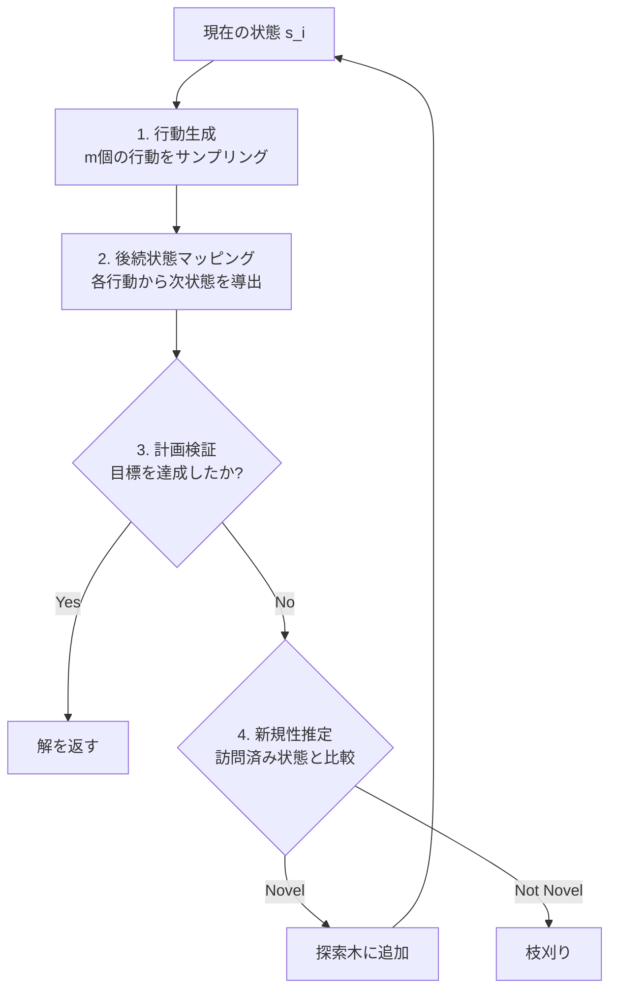

## 論文概要

本記事は [arXiv: 2605.06040](https://arxiv.org/abs/2605.06040) の解説記事です。

Hamm and Ajanovic (2026) は、幅ベース探索（width-based search）の「新規性（novelty）」概念をLLMのTree-of-Thought（ToT）推論に導入する手法を提案している。LLMの事前学習知識を活用して探索木内の各状態の一意性をバイナリ分類し、冗長な枝を刈り取ることで探索木全体のサイズを削減する。適切な構成においてはトークンコストを最大20倍削減できることが報告されている。Blocksworld、Logistics、Game of 24、MATH（Level 5）の4ドメインで評価が行われ、特にBlocksworldのDFS + Direct + Thinking構成で330kから18kトークンへの大幅削減が確認されている。

この記事は [Zenn記事: Tree of Thoughts x Structured Outputs：型安全な推論木をPythonで実装する](https://zenn.dev/0h_n0/articles/1b1f92f0a382bd) の深掘りです。

## 情報源

| 項目 | 詳細 |
|------|------|
| arXiv ID | [2605.06040](https://arxiv.org/abs/2605.06040) |
| タイトル | Novelty-based Tree-of-Thought Search for LLM Reasoning and Planning |
| 著者 | Leon Hamm, Zlatan Ajanovic |
| 発表日 | 2026年5月7日 |
| 分野 | cs.AI, cs.CL |

## 背景と動機

Tree-of-Thought（ToT）探索は、Yao et al. (2023) が提案したLLM推論フレームワークであり、複数の推論パスを木構造で探索することで大幅な性能向上を実現した。しかし、ToTには**計算コストの爆発**（単一CoTの100倍以上）と**冗長な探索パス**（意味的に類似した状態の繰り返し展開）という2つの課題が存在する。

一方、古典的AI計画では、Lipovetzky and Geffner (2012) のIterated Width（IW）アルゴリズムが「新規性」に基づく枝刈りで多項式時間の計画を実現していた。多くの計画問題の幅が2以下に収まるという経験的事実がその基盤である。著者らは、この知見がLLMの言語ベース推論にも転用可能であるという仮説のもと本研究を進めている。

## 主要な貢献

著者らが報告している主要な貢献は以下の4点である。

1. **幅ベース探索の新規性概念をLLM推論に適用**: IWアルゴリズムの枝刈り原理を、PDDL記述不要のバイナリ分類としてToTに導入
2. **4つのサブタスクへの体系的分解**: 行動生成・後続状態マッピング・計画検証・新規性推定を独立に評価
3. **DFS/BFS両戦略での枝刈り効果の実証**: DFS + Thinking構成で最大20倍のトークン削減を達成
4. **Game of 24による理論的基盤の検証**: 平均有効幅1.74、枝刈り可能状態88.2%を確認し、LLM推論問題の低幅構造仮説を裏付け

## 技術的詳細

### 古典的な新規性の定義

幅ベース計画（Lipovetzky and Geffner, 2012）において、状態 $s$ の新規性 $w(s)$ は以下のように定義される。

$$
w(s) = \min \{ |T| : T \subseteq \Phi(s), \forall s' \in \mathcal{V}, T \not\subseteq \Phi(s') \}
$$

ここで、
- $\Phi(s)$: 状態 $s$ の特徴集合
- $\mathcal{V}$: これまでに訪問した全状態の集合
- $T$: $\Phi(s)$ の部分集合

直感的には、新規性 $w(s)$ は「$s$ を過去の全状態と区別するために必要な最小の特徴サブセットのサイズ」を表す。$\text{IW}(k)$ アルゴリズムは $w(s) > k$ の状態を枝刈りし、$k$ が小さければ多項式時間で探索が完了する。

### LLMベースの新規性推定

古典的な定義をそのままLLMに適用することは困難である。LLMは新規性の差異を整数値にマッピングすることに苦労するためである。著者らは以下のバイナリ分類アプローチを採用している。

$$
\text{novelty}(s, \mathcal{V}) = p^{\text{novel}}(s \mid \mathcal{V}) \in \{0, 1\}
$$

ここで、
- $s$: 評価対象の新しい状態（自然言語テキスト）
- $\mathcal{V}$: 訪問済み状態のリスト
- $p^{\text{novel}}$: LLMによる新規性判定関数（yes/noの二値出力）

具体的なプロンプトは以下の形式で構成される。

```text
Is 'new_state' a novel state compared to this list of states
'previous_states_str'?
Respond with 'yes' or 'no'. Do not add any other text.
```

この設計の仮定として、状態 $s$ は潜在的な特徴表現 $\Phi(s)$ を持つが、LLMの事前学習知識に暗黙的に含まれるものとして明示的に抽出しない。LLMは意味的な類似性を自然言語レベルで判断する。

### アルゴリズムアーキテクチャ

ToT探索は以下の4つのサブタスクに分解される。



4つのサブタスクの詳細は以下の通りである。

**行動生成**: 状態 $s_i$ から $m$ 個の行動を独立にサンプリング: $a^j_{i+1} \sim p^{\text{sample}}(a_{i+1} \mid s_i)$。$m$ は分岐係数を制御する。

**後続状態マッピング**: 各行動から次状態を導出: $s_{i+1} = f(a_{i+1}, s_i)$。著者らはDirect方式（行動と状態を単一クエリで統合、高性能）とESA方式（分離クエリ、エラー連鎖しやすい）の2戦略を比較している。

**計画検証**: 目標条件の達成を判定。論文Table 1より、LLMが最も得意なサブタスク（標準形式で47/50）である。

**新規性推定**: 冗長な状態を枝刈り。Thinking有効時には精度50/50に到達する（論文Table 1より）。

### DFS/BFS両対応の探索戦略

著者らはDFS（深さ優先、逐次的LLM呼び出しに適する）とBFS（幅優先、枝刈りなしでは指数的に増大するが新規性枝刈りで抑制可能）の両戦略で評価を実施している。以下にDFS版の実装例を示す。

```python
from __future__ import annotations
from dataclasses import dataclass, field
from typing import Protocol


class LLMBackend(Protocol):
    """LLM呼び出しの抽象インターフェース"""
    def generate_actions(self, state: str) -> list[str]: ...
    def successor(self, state: str, action: str) -> str: ...
    def is_goal(self, state: str, goal: str) -> bool: ...
    def is_novel(self, state: str, visited: list[str]) -> bool: ...


@dataclass
class SearchNode:
    state: str
    actions: list[str] = field(default_factory=list)
    depth: int = 0


def novelty_pruned_dfs(
    llm: LLMBackend,
    initial_state: str,
    goal: str,
    max_depth: int = 8,
    branch_factor: int = 2,
) -> list[str] | None:
    """新規性枝刈り付きDFS探索"""
    visited_states: list[str] = [initial_state]
    stack: list[SearchNode] = [SearchNode(state=initial_state)]

    while stack:
        node = stack.pop()
        if node.depth >= max_depth:
            continue
        for action in llm.generate_actions(node.state)[:branch_factor]:
            next_state = llm.successor(node.state, action)
            if llm.is_goal(next_state, goal):
                return node.actions + [action]
            # 新規性判定による枝刈り
            if llm.is_novel(next_state, visited_states):
                visited_states.append(next_state)
                stack.append(SearchNode(
                    state=next_state,
                    actions=node.actions + [action],
                    depth=node.depth + 1,
                ))
    return None
```

### プロンプト設計の影響

著者らは3つの状態表現形式を比較している。**標準PDDL形式**（論理式表現、行動生成1/50と低性能）、**自然言語形式**（後続状態マッピングで15/50から34/50に改善）、**Thinking付き**（推論トークン有効化、行動生成48/50・新規性枝刈り50/50と全サブタスクで劇的改善）。Thinking機能の有無が最も支配的な性能因子である。

## 実装のポイント

**プロンプトエンジニアリング**: 行動生成における「pick-upとunstackの混同」を手動修正で23/50から40/50に改善、few-shotで12/50から27/50に改善と報告されている。プロンプト設計への強い依存があるため、各ドメインでの調整が必要である。

**Thinking機能の必須性**: Thinking無しでは枝刈りが性能を悪化させるケースが多い。Thinking有りでは枝刈りがトークン削減と性能維持を両立するため、推論トークンをサポートするモデルの使用が前提となる。

**Direct方式の優位性**: ESA方式はエラーの連鎖の影響を受けやすく、Thinking付き構成ではDirect方式が一貫して優位である。

**訪問済み状態リスト管理**: 状態数増加でコンテキストウィンドウを圧迫するため、状態の要約や圧縮が必要になる場合がある。

## Production Deployment Guide

### AWS実装パターン（コスト最適化重視）

本論文の新規性枝刈りToTは、LLMへの複数回のプロンプト呼び出しを含む探索ベースの推論パイプラインである。以下にトラフィック量別のAWS推奨構成を示す。

以下は2026年8月時点のAWS ap-northeast-1料金に基づく概算値である。実際のコストはトラフィックやリージョンにより変動するため、最新料金はAWS料金計算ツールで確認を推奨する。

| 構成 | トラフィック | 主要サービス | 月額目安 |
|------|-------------|-------------|---------|
| Small | ~100 req/日 | Lambda (256MB) + Bedrock + DynamoDB | $50-150 |
| Medium | ~1,000 req/日 | ECS Fargate (0.5vCPU) + Bedrock + ElastiCache | $300-800 |
| Large | 10,000+ req/日 | EKS + Karpenter Spot + Bedrock Batch | $2,000-5,000 |

**コスト削減テクニック**: Spot Instances (最大90%削減) / Reserved Instances 1年コミット (最大72%削減) / Bedrock Batch API (50%削減) / Prompt Caching (30-90%削減、訪問済み状態リストの共通プレフィックスキャッシュ)

### Terraformインフラコード

#### Small構成（Serverless: Lambda + Bedrock + DynamoDB）

```hcl
# DynamoDB: 探索状態の永続化 (On-Demandでコスト最適化)
resource "aws_dynamodb_table" "tot_states" {
  name         = "tot-novelty-states"
  billing_mode = "PAY_PER_REQUEST"
  hash_key     = "session_id"
  range_key    = "state_hash"

  attribute { name = "session_id"; type = "S" }
  attribute { name = "state_hash"; type = "S" }

  server_side_encryption { enabled = true }  # KMS暗号化
  ttl { attribute_name = "expires_at"; enabled = true }
}

# IAMロール: Bedrock + DynamoDB + CloudWatch Logsの最小権限
resource "aws_iam_role_policy" "lambda_tot_policy" {
  role = aws_iam_role.lambda_tot.id
  policy = jsonencode({
    Version = "2012-10-17"
    Statement = [
      { Effect = "Allow", Action = ["bedrock:InvokeModel"],
        Resource = "arn:aws:bedrock:ap-northeast-1::foundation-model/anthropic.claude-sonnet-*" },
      { Effect = "Allow", Action = ["dynamodb:PutItem", "dynamodb:GetItem", "dynamodb:Query"],
        Resource = aws_dynamodb_table.tot_states.arn },
    ]
  })
}

# Lambda: 探索ループ駆動 (5分タイムアウト, 256MB)
resource "aws_lambda_function" "tot_search" {
  function_name = "tot-novelty-search"
  runtime       = "python3.12"
  handler       = "handler.lambda_handler"
  role          = aws_iam_role.lambda_tot.arn
  timeout       = 300
  memory_size   = 256
  environment {
    variables = {
      DYNAMODB_TABLE = aws_dynamodb_table.tot_states.name
      MAX_DEPTH = "8"; BRANCH_FACTOR = "2"
      MODEL_ID  = "anthropic.claude-sonnet-4-20250514"
    }
  }
}
```

#### Large構成（Container: EKS + Karpenter + Spot）

```hcl
module "eks" {
  source  = "terraform-aws-modules/eks/aws"
  version = "~> 20.24"
  cluster_name    = "tot-novelty-cluster"
  cluster_version = "1.31"
  vpc_id     = module.vpc.vpc_id
  subnet_ids = module.vpc.private_subnets
  cluster_endpoint_public_access = false
}

# Karpenter NodePool: Spot優先で最大90%コスト削減
resource "kubectl_manifest" "karpenter_nodepool" {
  yaml_body = yamlencode({
    apiVersion = "karpenter.sh/v1"
    kind       = "NodePool"
    metadata   = { name = "tot-workers" }
    spec = {
      template.spec = {
        requirements = [
          { key = "karpenter.sh/capacity-type", operator = "In",
            values = ["spot", "on-demand"] },
          { key = "node.kubernetes.io/instance-type", operator = "In",
            values = ["c7g.medium", "c7g.large", "c6g.medium", "c6g.large"] },
        ]
        nodeClassRef = { group = "karpenter.k8s.aws", kind = "EC2NodeClass", name = "default" }
      }
      limits = { cpu = "32", memory = "64Gi" }
      disruption = { consolidationPolicy = "WhenEmptyOrUnderutilized", consolidateAfter = "30s" }
    }
  })
}

# AWS Budgets: 月額$5,000で80%到達時アラート
resource "aws_budgets_budget" "tot_monthly" {
  name = "tot-novelty-monthly"; budget_type = "COST"
  limit_amount = "5000"; limit_unit = "USD"; time_unit = "MONTHLY"
  notification {
    comparison_operator = "GREATER_THAN"; threshold = 80
    threshold_type = "PERCENTAGE"; notification_type = "ACTUAL"
    subscriber_email_addresses = ["alerts@example.com"]
  }
}
```

### 運用・監視設定

**CloudWatch Logs Insights クエリ**:

```text
# トークン使用量とコスト異常検知
fields @timestamp, session_id, total_tokens, pruned_nodes, explored_nodes
| stats sum(total_tokens) as hourly_tokens,
        avg(pruned_nodes / explored_nodes) as avg_prune_ratio by bin(1h)
| filter hourly_tokens > 100000

# 枝刈り率別のレイテンシ分析
fields @timestamp, duration_ms, prune_ratio
| stats percentile(duration_ms, 95) as p95, percentile(duration_ms, 99) as p99 by bin(15m)
```

**CloudWatch アラーム + X-Ray トレーシング**:

```python
import boto3
from aws_xray_sdk.core import xray_recorder, patch_all

patch_all()  # boto3自動計装

cloudwatch = boto3.client("cloudwatch", region_name="ap-northeast-1")

# Bedrockトークン使用量スパイク検知
cloudwatch.put_metric_alarm(
    AlarmName="tot-bedrock-token-spike",
    MetricName="InputTokenCount", Namespace="AWS/Bedrock",
    Statistic="Sum", Period=3600, EvaluationPeriods=1,
    Threshold=500_000, ComparisonOperator="GreaterThanThreshold",
    AlarmActions=["arn:aws:sns:ap-northeast-1:ACCOUNT:tot-alerts"],
    Dimensions=[{"Name": "ModelId", "Value": "anthropic.claude-sonnet-4-20250514"}],
)

@xray_recorder.capture("novelty_check")
def check_novelty(state: str, visited: list[str]) -> bool:
    """新規性判定をX-Rayでトレース"""
    subsegment = xray_recorder.current_subsegment()
    subsegment.put_annotation("visited_count", len(visited))
    result = llm_novelty_query(state, visited)
    subsegment.put_annotation("is_novel", result)
    return result
```

**Cost Explorer日次レポート**: `Project=tot-novelty-pruning`タグでフィルタし、日次コストが$100を超過した場合にSNS通知を発行する。Cost Anomaly Detectionも併用してベースラインからの逸脱を自動検知する。

### コスト最適化チェックリスト

| カテゴリ | チェック項目 |
|---------|------------|
| **アーキテクチャ** | トラフィック量で構成選択 (Serverless/Hybrid/Container) / 探索深度に応じたタイムアウト設定 |
| **リソース最適化** | Spot Instances優先 (Karpenter自動フォールバック) / Reserved Instances 1年コミット / Savings Plans / Lambda メモリ最適化 (256-512MB) / アイドル時スケールダウン |
| **LLMコスト削減** | Bedrock Batch API (50%削減) / Prompt Caching (30-90%削減) / モデル選択: 新規性判定はHaiku、行動生成はSonnet / トークン数制限 |
| **監視・アラート** | AWS Budgets (80%アラート) / CloudWatch アラーム / Cost Anomaly Detection / 日次コストレポート |
| **リソース管理** | DynamoDB TTL / 全リソースタグ付与 / CloudWatch Logs保持30日 / 開発環境夜間停止 / KMS暗号化 |

## 実験結果

### サブタスク性能評価

著者らは各サブタスクの性能をBlocksworldドメイン（Qwen 14B、50インスタンス）で個別に評価している（論文Table 1より）。

| サブタスク | 標準PDDL | 自然言語 | Thinking付き |
|---|---|---|---|
| 行動生成（全候補正解） | 1/50 | 1/50 | 48/50 |
| 後続状態マッピング | 15/50 | 34/50 | 44/50 |
| 目標検証 | 47/50 | 48/50 | 47/50 |
| 新規性枝刈り | 31/50 | 26/50 | 50/50 |

Thinking機能の効果は顕著であり、特に行動生成（1/50から48/50）と新規性枝刈り（31/50から50/50）で劇的な改善が報告されている。

### Blocksworld DFS結果

論文Table 2より、DFS探索における枝刈りの効果を以下に示す。

| 構成 | ベース性能 | ベーストークン | 枝刈り性能 | 枝刈りトークン | トークン削減率 |
|---|---|---|---|---|---|
| Direct + Normal | 7/50 | 231k | 5/50 | 146k | 37% |
| Direct + Thinking | 47/50 | 330k | 42/50 | **18k** | **95%** |
| ESA + Normal | 7/50 | 438k | 5/50 | 1,038k | 増加 |
| ESA + Thinking | 45/50 | 686k | 33/50 | 43k | 94% |

Direct + Thinking構成で枝刈りはトークンを330kから18kへ約18倍削減している。性能は47/50から42/50へ若干低下し、情報損失のトレードオフが存在する。ESA + Normal構成では枝刈りがトークン量を増加させており、構成選択の重要性が示されている。

### Logistics DFS結果

論文Table 3より、Logisticsドメインでの結果を示す。

| 構成 | ベース性能 | ベーストークン | 枝刈り性能 | 枝刈りトークン |
|---|---|---|---|---|
| Direct + Normal | 24/50 | 101k | 19/50 | 12k |
| Direct + Thinking | 47/50 | 69k | 48/50 | **9k** |

Direct + Thinking構成で枝刈り後に性能が向上（47/50から48/50）しつつトークンが7.7倍削減されており、Logisticsドメインと新規性枝刈りの高い親和性を示唆している。

### Game of 24の理論的分析

著者らはGame of 24の全状態空間を網羅的に分析し、以下の結果を報告している。

| 指標 | 値 |
|------|-----|
| 平均有効幅 | 1.74 |
| 最大幅 | 3 |
| 枝刈り可能状態の割合 | 88.2% |
| 平均状態木サイズ | 約3,698状態/インスタンス |

平均有効幅1.74は古典的計画問題の典型的な幅（2以下）と整合し、LLM推論問題の低幅構造仮説を裏付けている。88.2%の状態が枝刈り可能であり、大幅なトークン削減の余地がある。

## 実運用への応用

**コスト最適化**: ToTベースのバッチ処理パイプラインにおいて、新規性枝刈りはAPIコストの直接的な削減手段となる。状態キャッシュとPrompt Cachingの併用で効果が最大化される。

**リアルタイム応答の制約**: 新規性判定の追加LLM呼び出しによるレイテンシ増加があるため、リアルタイムアプリケーションでは判定の並列化やキャッシュ設計が必要となる。Thinking機能有効化が前提であるため、推論トークンをサポートするモデルの選定も重要である。

**ドメイン適応**: 手法の効果はドメインとプロンプト構成に強く依存する。新ドメインへの適用時には、サブタスクの個別評価で行動生成・状態マッピング・新規性推定のボトルネックを特定してから統合することが推奨される。

**Zenn記事との関連**: 関連Zenn記事「Tree of Thoughts x Structured Outputs」のPydanticベースのToT実装に新規性枝刈りロジックを追加することで、構造化出力を維持しつつトークンコストを削減する拡張が可能である。

## 関連研究

- **Tree of Thoughts (Yao et al., 2023)**: LLM推論を木構造探索として定式化。本論文はこのフレームワークに新規性枝刈りを追加する拡張である
- **Width-based Planning (Lipovetzky and Geffner, 2012)**: IWアルゴリズムで多項式時間の計画を実現。本論文の理論的基盤
- **LLMs for Planning (Valmeekam et al., 2023)**: LLMの計画能力の限界を指摘。本論文は外部探索構造で限界を緩和

## まとめと今後の展望

Hamm and Ajanovic (2026) は、幅ベース探索の新規性概念をToT探索に導入し、適切な構成下でトークンコストを最大20倍削減できることを実証した。一方、効果はプロンプト設計・Thinking機能・ドメイン特性に強く依存し、Thinking無しでは逆効果になるケースも多い。モデルの新規性判断が「重複検出」に偏るという課題も残されている。今後の研究方向として、多段階の新規性推定器やより大規模なモデルでの評価が著者らにより示唆されている。

## 参考文献

- **arXiv**: [https://arxiv.org/abs/2605.06040](https://arxiv.org/abs/2605.06040)
- **Related Zenn article**: [https://zenn.dev/0h_n0/articles/1b1f92f0a382bd](https://zenn.dev/0h_n0/articles/1b1f92f0a382bd)
- **Tree of Thoughts (Yao et al., 2023)**: [https://arxiv.org/abs/2305.10601](https://arxiv.org/abs/2305.10601)
- **Width-based Planning (Lipovetzky and Geffner, 2012)**: [https://www.researchgate.net/publication/272741411](https://www.researchgate.net/publication/272741411_Width-based_Algorithms_for_Classical_Planning_New_Results)
