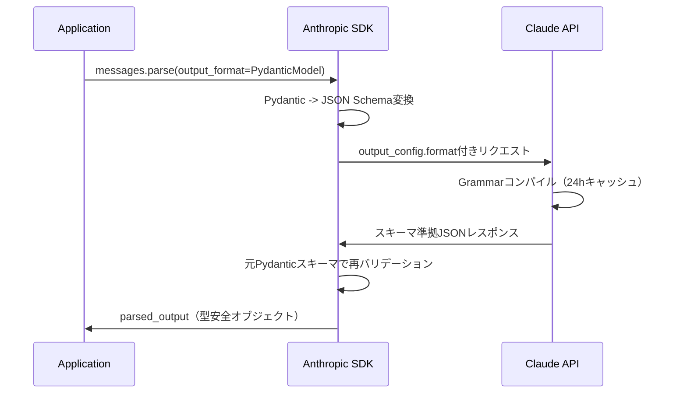

## ブログ概要

本記事は [https://claude.com/blog/structured-outputs-on-the-claude-developer-platform](https://claude.com/blog/structured-outputs-on-the-claude-developer-platform) の解説記事です。

Anthropicは2026年2月4日、Claude Developer PlatformにおけるStructured Outputs機能の一般提供（GA）を発表した。APIレスポンスがユーザー定義のJSONスキーマまたはツール定義に確実に準拠することを保証する機能であり、パースエラーやリトライの削減、フェイルオーバーロジックの簡素化が実現できるとブログでは説明されている。

この記事は [Zenn記事: Tree of Thoughts x Structured Outputs：型安全な推論木をPythonで実装する](https://zenn.dev/0h_n0/articles/1b1f92f0a382bd) の深掘りです。

## 情報源

| 項目 | 内容 |
|------|------|
| 種別 | 企業テックブログ |
| URL | [Structured outputs on the Claude Developer Platform](https://claude.com/blog/structured-outputs-on-the-claude-developer-platform) |
| 組織 | Anthropic |
| 初公開日 | 2025年11月14日（Public Beta） |
| GA日 | 2026年2月4日 |

## 技術的背景

LLMの出力は本質的に自由形式テキストであり、下流システムとの統合で構造化された応答を得ることが課題となる。従来はプロンプトにJSON出力を指示し正規表現やパーサーで後処理していたが、不正JSON、スキーマ不準拠、リトライ・フォールバック実装のコストが問題であった。

学術的にはConstrained Decoding（制約付き復号）として研究されてきた分野であり、Willard & Louf (2023) のFSMベーストークンマスキングやXGrammar (Dong et al., 2024) のBPEサブワードレベル文法制約が代表的である。AnthropicのStructured Outputsは、これらの制約付き復号技術をマネージドAPIとして提供するものである。ブログではマルチエージェントシステムにおけるエージェント間通信の一貫性確保も主要ユースケースとして挙げている。

## 実装アーキテクチャ

Structured Outputsは2つの相補的なメカニズムで提供される。

### JSON Mode（output_config.format）

`output_config.format`パラメータに`json_schema`型のオブジェクトを渡し、レスポンス全体をスキーマに準拠させる方式である。

```python
from anthropic import Anthropic

client = Anthropic()
response = client.messages.create(
    model="claude-sonnet-4-6",
    max_tokens=1024,
    messages=[{"role": "user", "content": "東京の天気を教えて"}],
    output_config={
        "format": {
            "type": "json_schema",
            "schema": {
                "type": "object",
                "properties": {
                    "city": {"type": "string"},
                    "weather": {"type": "string"},
                    "temperature_celsius": {"type": "number"},
                    "confidence": {"type": "string", "enum": ["high", "medium", "low"]},
                },
                "required": ["city", "weather", "temperature_celsius", "confidence"],
                "additionalProperties": False,
            },
        }
    },
)
```

スキーマでは`additionalProperties: false`の明示的な指定が必須である。

### Tools Mode（strict: true）

ツール定義に`strict: true`フラグを追加することで、モデルのツール呼び出しがスキーマに厳密に準拠することを保証する。JSON Modeと組み合わせて使用することも可能である。ツール定義の`input_schema`に対して`"strict": True`と`"additionalProperties": False`を指定するだけで有効化される。

### Pydantic連携（messages.parse）

Python SDKでは`client.messages.parse()`メソッドにより、PydanticモデルをそのままスキーマとしてAPIに渡し、型安全なオブジェクトとして取得できる。

```python
from pydantic import BaseModel, Field
from anthropic import Anthropic

class ThoughtEvaluation(BaseModel):
    """Tree of Thoughtsにおける思考ノードの評価結果"""
    score: float = Field(description="評価スコア（0.0-1.0）")
    reasoning: str = Field(description="評価理由")
    is_terminal: bool = Field(description="終端ノードかどうか")
    next_actions: list[str] = Field(description="次の候補アクション")

client = Anthropic()
response = client.messages.parse(
    model="claude-sonnet-4-6",
    max_tokens=1024,
    output_format=ThoughtEvaluation,
    messages=[{"role": "user", "content": "次の思考を評価してください: ..."}],
)
evaluation: ThoughtEvaluation = response.parsed_output  # 型安全
```

SDKは内部的に (1) PydanticモデルからJSON Schemaを抽出し非対応制約をdescriptionに移動、(2) APIにリクエスト送信、(3) レスポンス受信後に元のPydanticスキーマ（制約付き）で再バリデーション、という二段階構成を採用している。



### 対応モデルとプラットフォーム

公式ドキュメントによると、2026年8月時点でClaude Opus 5/4.8/4.7/4.6、Claude Sonnet 5/4.6/4.5、Claude Opus 4.5、Claude Haiku 4.5がStructured Outputsに対応している。プラットフォームはClaude Developer Platform（直接API）、Amazon Bedrock、Google Cloud、Microsoft Foundryで利用可能である。

### JSON Schemaの制約事項

Structured Outputsが対応するJSON Schema機能と非対応機能を整理する。

対応機能は基本型、`enum`、`const`、`anyOf`/`allOf`（制限付き）、内部`$ref`、文字列フォーマット（`date-time`, `email`, `uri`等）である。

一方、**再帰スキーマ**（自己参照）、**数値制約**（`minimum`, `maximum`）、**文字列制約**（`minLength`, `maxLength`）、外部`$ref`は非対応である。`additionalProperties`は`false`のみ許可される。

再帰スキーマの非対応はTree of Thoughtsのような木構造データに影響する。Zenn記事で解説されている推論木の再帰的なノード定義では、スキーマのフラット化やネスト深度の上限設定が必要となる。

## Production Deployment Guide

### AWS実装パターン（コスト最適化重視）

トラフィック量別推奨構成を示す（2026年8月時点、東京リージョン概算値。実際のコストはトラフィックパターンにより変動）。

| 構成 | トラフィック | アーキテクチャ | 月額概算 |
|------|-------------|--------------|---------|
| Small | ~100 req/日 | Lambda + Bedrock + DynamoDB | $50-150 |
| Medium | ~1,000 req/日 | ECS Fargate + Bedrock + ElastiCache | $300-800 |
| Large | 10,000+ req/日 | EKS + Karpenter + Spot + Bedrock | $2,000-5,000 |

**コスト削減テクニック**: Bedrock Batch APIで50%削減、Prompt Cachingでキャッシュ読み取り90%削減（書き込みは1.25倍）、Spot Instances（EKS構成時）で最大90%のコンピュート費削減。Bedrock上ではConverse/InvokeModel両APIに対応し、Batch InferenceおよびCross-Region Inferenceも追加設定なしで利用可能である。

### Terraformインフラコード

#### Small構成（Serverless: Lambda + Bedrock + DynamoDB）

```hcl
# --- IAMロール（最小権限: Bedrock InvokeModelのみ許可） ---
resource "aws_iam_role" "lambda_role" {
  name = "structured-output-lambda-role"
  assume_role_policy = jsonencode({
    Version = "2012-10-17"
    Statement = [{
      Effect = "Allow", Principal = { Service = "lambda.amazonaws.com" }
      Action = "sts:AssumeRole"
    }]
  })
}

resource "aws_iam_role_policy" "bedrock_invoke" {
  name = "bedrock-invoke-policy"
  role = aws_iam_role.lambda_role.id
  policy = jsonencode({
    Version = "2012-10-17"
    Statement = [{
      Effect   = "Allow"
      Action   = ["bedrock:InvokeModel", "bedrock:InvokeModelWithResponseStream"]
      Resource = "arn:aws:bedrock:ap-northeast-1::foundation-model/anthropic.claude-sonnet-4-6*"
    }]
  })
}

# --- Lambda関数 ---
resource "aws_lambda_function" "structured_output" {
  function_name = "structured-output-handler"
  runtime       = "python3.12"
  handler       = "handler.lambda_handler"
  role          = aws_iam_role.lambda_role.arn
  timeout       = 30
  memory_size   = 256

  environment {
    variables = {
      BEDROCK_MODEL_ID = "anthropic.claude-sonnet-4-6"
      DYNAMODB_TABLE   = aws_dynamodb_table.cache.name
    }
  }
}

# --- DynamoDB（On-Demand + KMS暗号化 + TTL） ---
resource "aws_dynamodb_table" "cache" {
  name         = "structured-output-cache"
  billing_mode = "PAY_PER_REQUEST"
  hash_key     = "request_id"
  attribute { name = "request_id"; type = "S" }
  server_side_encryption { enabled = true }
  ttl { attribute_name = "expires_at"; enabled = true }
}
```

#### Large構成（Container: EKS + Karpenter + Spot）

```hcl
# --- EKSクラスタ（プライベートエンドポイントのみ） ---
module "eks" {
  source  = "terraform-aws-modules/eks/aws"
  version = "~> 20.0"
  cluster_name    = "structured-output-cluster"
  cluster_version = "1.31"
  vpc_id     = aws_vpc.main.id
  subnet_ids = aws_subnet.private[*].id
  cluster_endpoint_public_access = false
}

# --- Karpenter NodePool（Spot優先、自動スケーリング） ---
resource "kubectl_manifest" "karpenter_nodepool" {
  yaml_body = yamlencode({
    apiVersion = "karpenter.sh/v1"
    kind       = "NodePool"
    metadata   = { name = "default" }
    spec = {
      template.spec.requirements = [
        { key = "karpenter.sh/capacity-type", operator = "In", values = ["spot", "on-demand"] },
        { key = "node.kubernetes.io/instance-type", operator = "In",
          values = ["m6i.xlarge", "m6i.2xlarge", "m7i.xlarge", "m7i.2xlarge"] },
      ]
      limits     = { cpu = "100", memory = "400Gi" }
      disruption = { consolidationPolicy = "WhenEmptyOrUnderutilized", consolidateAfter = "30s" }
    }
  })
}

# --- AWS Budgets（月$5,000で80%アラート） ---
resource "aws_budgets_budget" "monthly" {
  name = "structured-output-monthly"
  budget_type = "COST"
  limit_amount = "5000"
  limit_unit   = "USD"
  time_unit    = "MONTHLY"
  notification {
    comparison_operator        = "GREATER_THAN"
    threshold                  = 80
    threshold_type             = "PERCENTAGE"
    notification_type          = "ACTUAL"
    subscriber_email_addresses = ["ops-team@example.com"]
  }
}
```

### 運用・監視設定

#### CloudWatch Logs Insightsクエリ

```
# Bedrockトークン使用量の1時間あたり集計（コスト異常検知）
fields @timestamp, input_tokens, output_tokens
| stats sum(input_tokens) as total_input, sum(output_tokens) as total_output,
        count(*) as request_count
  by bin(1h)
| filter total_output > 100000

# Structured Outputs レイテンシ分析（P95, P99）
fields @timestamp, duration_ms, model_id, schema_cached
| stats percentile(duration_ms, 95) as p95,
        percentile(duration_ms, 99) as p99,
        avg(duration_ms) as avg_latency
  by model_id, schema_cached
```

#### CloudWatchアラーム設定

```python
import boto3

cloudwatch = boto3.client("cloudwatch", region_name="ap-northeast-1")

cloudwatch.put_metric_alarm(
    AlarmName="bedrock-token-spike",
    MetricName="OutputTokenCount",
    Namespace="Custom/Bedrock",
    Statistic="Sum",
    Period=3600,
    EvaluationPeriods=1,
    Threshold=500000,
    ComparisonOperator="GreaterThanThreshold",
    AlarmActions=["arn:aws:sns:ap-northeast-1:123456789012:alerts"],
)
```

#### X-Rayトレーシング設定

```python
from aws_xray_sdk.core import xray_recorder, patch_all

patch_all()  # boto3自動計装

@xray_recorder.capture("structured_output_request")
def invoke_bedrock_structured(prompt: str, schema: dict) -> dict:
    """Bedrock Structured Outputsの呼び出しをトレーシング"""
    subsegment = xray_recorder.current_subsegment()
    subsegment.put_annotation("model_id", "anthropic.claude-sonnet-4-6")
    subsegment.put_metadata("schema_keys", list(schema.get("properties", {}).keys()))
    response = bedrock_client.invoke_model(
        modelId="anthropic.claude-sonnet-4-6",
        body=json.dumps({
            "anthropic_version": "bedrock-2023-05-31",
            "messages": [{"role": "user", "content": [{"type": "text", "text": prompt}]}],
            "max_tokens": 1024,
            "output_config": {"format": {"type": "json_schema", "schema": schema}},
        }),
    )
    return json.loads(response["body"].read())
```

#### Cost Explorer日次レポート

```python
import boto3
from datetime import date, timedelta

def daily_cost_report() -> dict:
    """日次コストレポート取得、$100/日超過でSNS通知"""
    ce = boto3.client("ce", region_name="us-east-1")
    today, yesterday = date.today(), date.today() - timedelta(days=1)
    result = ce.get_cost_and_usage(
        TimePeriod={"Start": str(yesterday), "End": str(today)},
        Granularity="DAILY", Metrics=["UnblendedCost"],
        Filter={"Or": [
            {"Dimensions": {"Key": "SERVICE", "Values": [svc]}}
            for svc in ["Amazon Bedrock", "AWS Lambda", "Amazon Elastic Kubernetes Service"]
        ]},
    )
    total = float(result["ResultsByTime"][0]["Total"]["UnblendedCost"]["Amount"])
    if total > 100.0:
        boto3.client("sns", region_name="ap-northeast-1").publish(
            TopicArn="arn:aws:sns:ap-northeast-1:123456789012:cost-alerts",
            Subject=f"Cost Alert: ${total:.2f}/day",
            Message=f"Daily cost exceeded $100: ${total:.2f}",
        )
    return {"date": str(yesterday), "total_cost": total}
```

### コスト最適化チェックリスト

**アーキテクチャ選択**:
- [ ] トラフィック~100 req/日: Serverless（Lambda + Bedrock）
- [ ] トラフィック~1,000 req/日: Hybrid（ECS Fargate + Bedrock）
- [ ] トラフィック10,000+ req/日: Container（EKS + Spot + Bedrock）

**リソース最適化**: Spot Instances優先（最大90%削減）、Reserved Instances 1年コミット（最大72%削減）、Savings Plans検討、Lambda Power Tuningによるメモリ最適化、Karpenterアイドル時スケールダウン

**LLMコスト削減**: Bedrock Batch API（50%削減）、Prompt Caching（90%削減）、モデル選択ロジック（Haiku/Sonnet/Opus使い分け）、max_tokens制限、Structured Outputsによるリトライ排除

**監視・アラート**: AWS Budgets月次アラート、CloudWatchトークン使用量監視、Cost Anomaly Detection、日次SNSコストレポート

**リソース管理**: 未使用リソース定期削除、Environment/Service/Teamタグ戦略、DynamoDB TTL設定、開発環境夜間停止、CloudWatch Logs保持期間30日

## パフォーマンス最適化

AnthropicのドキュメントによるとStructured Outputsでは、初回リクエスト時にスキーマからGrammarへのコンパイルが発生し追加レイテンシが生じる。コンパイル済みGrammarは24時間キャッシュされ、キャッシュ済みリクエストでは通常の推論と同等のレイテンシとなる。ブログでは「モデル性能に影響なし」と説明されている。

キャッシュはスキーマの構造変更やツールセット変更で無効化されるが、name/descriptionの変更では維持される。また、Structured Outputsは追加のシステムプロンプトを注入するため入力トークン数が若干増加する。`output_config.format`の変更はPrompt Cacheも無効化するため、スキーマを固定して運用することでPrompt Cachingの効果を最大化できる。

## 運用での学び

Structured Outputs導入前のLLMアプリケーションでは、JSON.parseの失敗リトライ、スキーマバリデーション失敗時のフォールバック、部分的JSONの修復ロジックが必要であった。Structured Outputsによりこれらは完全に排除される。OpenRouterのCOOは「Structured outputsはエージェントAIスタックにおいて非常に価値あるパーツになった」とコメントしている。

Bedrock上ではConverse APIとInvokeModel APIの両方で利用可能だが、`bedrock-mantle`エンドポイント経由では`output_config.format`が400エラーとなる。また、citations機能との併用は不可である。

運用上のスキーマ設計指針として、(1) フラットな構造を優先しGrammarコンパイルコストを抑制、(2) 分類タスクではenumで選択肢を制約、(3) optionalフィールドは`anyOf: [{"type": "string"}, {"type": "null"}]`で表現、(4) 木構造はネスト深度を固定してフラット化、が重要である。

## 学術研究との関連

Structured Outputsの基盤技術であるConstrained Decodingは活発な研究分野である。Willard & Louf (2023) はOutlinesライブラリとしてFSMベースのトークンマスキングをOSS化し、Dong et al. (2024) のXGrammarはBPEトークナイザとの整合性を考慮した効率的な文法制約エンジンを提案している。Geng et al. (2024) のGrammar-Aligned Decodingは、文法制約がモデルの出力分布に与える歪みを最小化する手法を示した。AnthropicのStructured Outputsは、これらの研究成果をAPI利用者が意識することなく利用できるマネージドサービスとして提供するものである。

## まとめと実践への示唆

AnthropicのStructured Outputs機能は、LLMの出力をJSONスキーマに確実に準拠させることでプロダクション環境での信頼性を向上させる。再帰スキーマの非対応など制約は存在するが、スキーマ設計の工夫により多くのユースケースに対応可能である。Tree of Thoughtsのような推論木構造においても、ネスト深度の固定によりStructured Outputsの恩恵を受けることができる。

## 参考文献

- **Blog URL**: [https://claude.com/blog/structured-outputs-on-the-claude-developer-platform](https://claude.com/blog/structured-outputs-on-the-claude-developer-platform)
- **Documentation**: [https://platform.claude.com/docs/en/build-with-claude/structured-outputs](https://platform.claude.com/docs/en/build-with-claude/structured-outputs)
- **AWS Bedrock Structured Outputs**: [https://docs.aws.amazon.com/bedrock/latest/userguide/structured-output.html](https://docs.aws.amazon.com/bedrock/latest/userguide/structured-output.html)
- **Related Papers**:
  - Willard & Louf (2023). [arXiv:2307.09702](https://arxiv.org/abs/2307.09702) - Efficient Guided Generation for LLMs
  - Dong et al. (2024). [arXiv:2411.15100](https://arxiv.org/abs/2411.15100) - XGrammar
  - Geng et al. (2024). [arXiv:2405.21047](https://arxiv.org/abs/2405.21047) - Grammar-Aligned Decoding
- **Related Zenn article**: [https://zenn.dev/0h_n0/articles/1b1f92f0a382bd](https://zenn.dev/0h_n0/articles/1b1f92f0a382bd)
