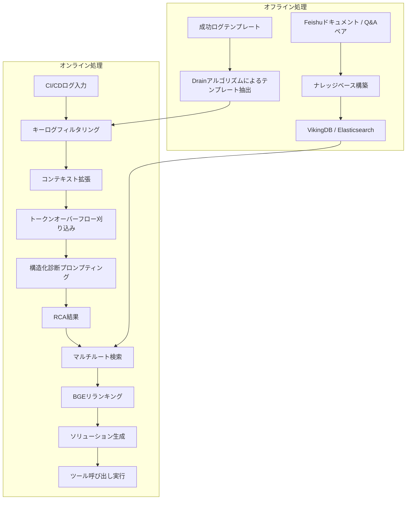

## 論文概要（Abstract）

本記事は [LogSage: An LLM-Based Framework for CI/CD Failure Detection and Remediation with Industrial Validation](https://arxiv.org/abs/2506.03691) の解説記事です。

LogSageは、CI/CDパイプラインの障害に対してLLMを活用した根本原因分析（RCA）と自動修復を実現するエンドツーエンドのフレームワークである。トークン効率の高いログ前処理パイプラインでノイズを除去し、構造化された診断プロンプティングによってRCAを行う。さらに、RAGによる過去の修正履歴の再利用とLLMツール呼び出しによる自動修復を組み合わせている。著者らは、367件のGitHub CI/CD障害ベンチマークでRCA精度98%超、ByteDanceでの1年間の本番運用で107万件以上を処理し、エンドツーエンド精度80%超を達成したと報告している。

この記事は [Zenn記事: FastMCPで自作MCPサーバーをCI/CDログ調査エージェントに統合する実装手法](https://zenn.dev/0h_n0/articles/90a694ce3da46f) の深掘りです。

## 情報源

- **arXiv ID**: 2506.03691
- **URL**: [https://arxiv.org/abs/2506.03691](https://arxiv.org/abs/2506.03691)
- **著者**: Weiyuan Xu, Juntao Luo, Tao Huang et al.（ByteDance）
- **発表年**: 2025年（初版: 2025年6月4日、改訂版: 2025年10月6日）
- **分野**: cs.SE（Software Engineering）

## 背景と動機（Background & Motivation）

CI/CDパイプラインは現代のソフトウェア開発において不可欠なインフラだが、その障害の診断と解決は依然として複雑かつ労力のかかる作業である。CI/CDのビルドログは数千行から数万行に及ぶことが一般的で、エンジニアはその大量のログの中からエラーの根本原因を手動で特定しなければならない。

従来のアプローチには以下の課題があった。第一に、テンプレートベースのログ異常検知手法（DeepLog、LogAnomaly等）はCI/CDログの多様性に十分対応できなかった。第二に、LLMを直接ログ分析に適用する手法（LogPrompt、LogGPT等）はログ全体をそのまま入力するため、トークン消費が膨大になり（15万トークン超）、かつ精度も限定的だった。第三に、RCAと修復を統合したエンドツーエンドのフレームワークが存在しなかった。

著者らは、CI/CDログの構造的特性に着目し、トークン効率とRCA精度を両立するログ前処理パイプラインの設計、さらにRAGとツール呼び出しによる自動修復までを統合した初のフレームワークとしてLogSageを提案している。

## 主要な貢献（Key Contributions）

- **トークン効率の高いログ前処理パイプライン**: キーログフィルタリング、コンテキスト拡張、トークンオーバーフロー刈り込みの3段階で、ベースライン比で約85%のトークン削減を実現（論文Table III: LogSage 17,853トークン vs LogPrompt 152,615トークン）
- **構造化診断プロンプティング**: タスクタイプ識別とエラーログ分析を組み合わせた体系的なRCA手法により、98%超の精度を達成
- **RAG+ツール呼び出しによる自動修復**: 1,206件のFeishuドキュメントと23,344件のQ&Aペアからなるナレッジベースを構築し、過去の修正履歴を再利用する仕組みを実装
- **新規ベンチマークの構築**: 76リポジトリから収集した367件のGitHub CI/CD障害データセット（117件の訓練データ、250件のテストデータ）
- **大規模産業検証**: ByteDanceにおいて1年間で107万件以上の実行を処理し、36,845名の開発者にサービスを提供

## 技術的詳細（Technical Details）

### アーキテクチャ

LogSageはオフライン処理とオンライン処理の2フェーズで構成される（論文Figure 1より）。



### ログ前処理パイプライン（論文Section III-B）

ログ前処理は以下の3段階で構成される。

**段階1: キーログフィルタリング（Section III-B1）**

3つの戦略を組み合わせてエラー関連行を抽出する。

1. **ログ差分（Log Diff）**: Drainアルゴリズムで成功ログからテンプレートを抽出し、失敗ログと比較して差分を特定する。成功時には出現しない行がエラー候補となる
2. **キーワードマッチング**: `fatal`、`fail`、`panic`、`error`、`exit`等のキーワードでエラー行を検出
3. **ログ末尾優先**: ログの末尾部分にエラー情報が集中する傾向を活用し、末尾の行を優先的に抽出

これら3戦略の候補プールを統合し、重複を排除する（論文Algorithm 1）。

**段階2: コンテキスト拡張（Section III-B2）**

各キー行の前後を非対称に拡張し、コンテキストを保持する。具体的には、各キー行の前方$m=4$行、後方$n=6$行を含める。後方を多く取る理由は、エラーの詳細情報（スタックトレース等）が後続行に記録されることが多いためである。

**段階3: トークンオーバーフロー刈り込み（Section III-B3）**

LLMの入力トークン制限（22,000トークン）内に収めるため、重み付きランキングによる適応的な刈り込みを行う。

初期重みは候補プール密度に基づいて適応的に割り当てられる（論文Equation 1）。パターンベースの強化により、特定のエラーパターンには最大10の重みを付与する。コンテキストウィンドウの拡張は閾値$\theta$により制御される（論文Equation 2）。最終的に、各ログブロックの重み密度を以下のように計算する（論文Equation 3）:

$$
\text{density}(B_j) = \frac{\sum w_i}{e_j - s_j + 1}
$$

ここで$B_j$はログブロック、$w_i$はブロック内各行の重み、$s_j$と$e_j$はブロックの開始行と終了行である。密度の高いブロックからトークン制限内で貪欲に選択する。

### RAGベースのソリューション生成（論文Section III-C）

ナレッジベースは1,206件のFeishuドキュメント（3,000トークンチャンク）と23,344件のQ&Aペアから構成される。

検索には8つの粗粒度検索ルートを使用する（論文Section III-C1）。これらはデータベースインフラ（VikingDB、Elasticsearch）、マッチング粒度（query2doc、query2query）、類似度指標（BM25、KNN）を組み合わせたものである。検索結果はBGEモデルによりリランキングされ、上位10件が保持される。

### LLMツール呼び出し（論文Section III-C3）

4種類の自動修復ツールが実装されている:

- `lint_fix`: リンティング問題の自動修正
- `image_fix`: コンテナイメージの不整合解消
- `clean_cache`: ビルド/依存関係キャッシュのクリア
- `apply_resource`: 内部リソースの申請

LLMがRCA結果に基づいて適切なツールを選択し、構造化プロンプトを介して実行する。

## 実装のポイント（Implementation）

### トークン効率の設計

LogSageの最も重要な設計判断は、ログ全体をLLMに入力するのではなく、前処理でノイズを除去してからRCAに渡すアプローチである。論文Table IIIによると、平均トークン消費量はLogSageが17,853トークン、LogPromptが152,615トークン、LogGPTが122,353トークンであり、LogSageは約85-88%のトークン削減を達成している。

### Drainアルゴリズムの活用

ログテンプレートの抽出にはDrainアルゴリズムを使用している。これはオンラインのログパーシングアルゴリズムで、固定深さの木構造を用いてログメッセージからテンプレートを効率的に抽出する。成功ログのテンプレートをオフラインで構築しておき、失敗時のログとの差分を取ることで、障害固有の行を特定する。

### ハイパーパラメータの推奨値

著者らは以下のデフォルト設定を報告している（論文Section IVより）:

- 直近の成功ログ数: $x = 3$
- フィルタリングの重みパラメータ: $\alpha = 0.7$
- ログ差分の上限行数: $\beta = 500$
- キーワードマッチングの上限行数: $\gamma = 500$
- LLMの温度パラメータ: $\text{temperature} = 0.1$（全モデル共通）
- トークン制限: 22,000トークン

温度を0.1と低く設定している点は、RCAの再現性と安定性を重視した設計判断である。

## Production Deployment Guide

LogSageの設計思想をAWSサービスで再現する実装パターンを示す。CI/CDログの収集、前処理、LLMによるRCA、RAGベースの修復提案までのパイプラインを構築する。以下のコスト試算は2026年8月時点のAWS ap-northeast-1（東京）リージョン料金に基づく概算値であり、実際のコストはトラフィックパターンやバースト使用量により変動する。最新料金はAWS料金計算ツールで確認を推奨する。

### AWS実装パターン（コスト最適化重視）

**トラフィック量別の推奨構成**:

| 構成 | 規模 | サービス構成 | 月額概算 |
|------|------|-------------|---------|
| Small | ~100件/日 | Lambda + Bedrock + DynamoDB | $80-200 |
| Medium | ~1,000件/日 | ECS Fargate + Bedrock + OpenSearch Serverless | $500-1,200 |
| Large | 10,000件+/日 | EKS + Karpenter + Spot + OpenSearch | $3,000-8,000 |

Small構成はGitHub ActionsのWebhookをAPI Gateway経由でLambdaに送信し、Bedrock（Claude Sonnet）でRCAを行う。Medium構成はECS Fargate + OpenSearch Serverlessでナレッジベースを構築する。Large構成はEKS + Karpenter + Spot Instancesで大規模運用に対応する。

**コスト削減テクニック**:
- Spot Instances活用で最大90%削減
- Bedrock Batch APIで50%削減（非リアルタイム分析向け）
- Prompt Caching有効化で30-90%削減（類似ログパターン）

### Terraformインフラコード

**Small構成（Serverless）**: Lambda + Bedrock + DynamoDB

```hcl
# LogSage-style CI/CD Log Analyzer - Small構成
terraform {
  required_version = ">= 1.5"
  required_providers {
    aws = {
      source  = "hashicorp/aws"
      version = "~> 5.0"
    }
  }
}

provider "aws" {
  region = "ap-northeast-1"
}

# DynamoDB: RCA結果と修正履歴の格納
resource "aws_dynamodb_table" "rca_history" {
  name         = "logsage-rca-history"
  billing_mode = "PAY_PER_REQUEST"
  hash_key     = "repo_id"
  range_key    = "failure_id"

  attribute {
    name = "repo_id"
    type = "S"
  }

  attribute {
    name = "failure_id"
    type = "S"
  }

  ttl {
    attribute_name = "expires_at"
    enabled        = true
  }
}

# IAMロール: Lambda実行用（最小権限）
resource "aws_iam_role" "lambda_role" {
  name = "logsage-lambda-role"
  assume_role_policy = jsonencode({
    Version = "2012-10-17"
    Statement = [{
      Action    = "sts:AssumeRole"
      Effect    = "Allow"
      Principal = { Service = "lambda.amazonaws.com" }
    }]
  })
}

resource "aws_iam_role_policy" "lambda_policy" {
  name = "logsage-lambda-policy"
  role = aws_iam_role.lambda_role.id
  policy = jsonencode({
    Version = "2012-10-17"
    Statement = [
      {
        Effect   = "Allow"
        Action   = ["bedrock:InvokeModel"]
        Resource = "arn:aws:bedrock:ap-northeast-1::foundation-model/anthropic.claude-sonnet-4-20250514"
      },
      {
        Effect = "Allow"
        Action = ["dynamodb:PutItem", "dynamodb:GetItem", "dynamodb:Query"]
        Resource = aws_dynamodb_table.rca_history.arn
      }
    ]
  })
}

# Lambda関数: ログ前処理 + RCA
resource "aws_lambda_function" "log_analyzer" {
  function_name = "logsage-log-analyzer"
  runtime       = "python3.12"
  handler       = "handler.lambda_handler"
  role          = aws_iam_role.lambda_role.arn
  timeout       = 120
  memory_size   = 512

  filename         = "lambda_package.zip"
  source_code_hash = filebase64sha256("lambda_package.zip")

  environment {
    variables = {
      DYNAMODB_TABLE   = aws_dynamodb_table.rca_history.name
      BEDROCK_MODEL_ID = "anthropic.claude-sonnet-4-20250514"
      TOKEN_LIMIT      = "22000"
      TEMPERATURE      = "0.1"
    }
  }
}

# API Gateway: GitHub Webhookの受信
resource "aws_apigatewayv2_api" "webhook" {
  name          = "logsage-webhook"
  protocol_type = "HTTP"
}
```

**Large構成（Container）**: EKS + Karpenter + Spot Instances

```hcl
# LogSage-style CI/CD Log Analyzer - Large構成
module "eks" {
  source  = "terraform-aws-modules/eks/aws"
  version = "~> 20.0"

  cluster_name    = "logsage-cluster"
  cluster_version = "1.31"
  vpc_id          = module.vpc.vpc_id
  subnet_ids      = module.vpc.private_subnets
  cluster_addons  = { karpenter = { most_recent = true } }
}

# Karpenter NodePool: Spot優先
resource "kubectl_manifest" "karpenter_nodepool" {
  yaml_body = yamlencode({
    apiVersion = "karpenter.sh/v1"
    kind       = "NodePool"
    metadata   = { name = "logsage-workers" }
    spec = {
      template = {
        spec = {
          requirements = [
            { key = "karpenter.sh/capacity-type", operator = "In", values = ["spot", "on-demand"] },
            { key = "node.kubernetes.io/instance-type", operator = "In",
              values = ["m6i.xlarge", "m6a.xlarge", "m5.xlarge", "c6i.xlarge"] }
          ]
        }
      }
      limits     = { cpu = "100", memory = "400Gi" }
      disruption = { consolidationPolicy = "WhenEmptyOrUnderutilized", consolidateAfter = "30s" }
    }
  })
}

# OpenSearch: ナレッジベース（RAG用ベクトルDB）
resource "aws_opensearch_domain" "knowledge_base" {
  domain_name    = "logsage-kb"
  engine_version = "OpenSearch_2.13"
  cluster_config {
    instance_type          = "r6g.large.search"
    instance_count         = 2
    zone_awareness_enabled = true
  }
  ebs_options { ebs_enabled = true; volume_size = 100; volume_type = "gp3" }
}

# Cost Explorer アラート
resource "aws_budgets_budget" "logsage_budget" {
  name         = "logsage-monthly"
  budget_type  = "COST"
  limit_amount = "8000"
  limit_unit   = "USD"
  time_unit    = "MONTHLY"
  notification {
    comparison_operator        = "GREATER_THAN"
    threshold                  = 80
    threshold_type             = "PERCENTAGE"
    notification_type          = "ACTUAL"
    subscriber_email_addresses = ["ops-team@example.com"]
  }
}
```

### 運用・監視設定

**CloudWatch Logs Insights クエリ: コスト異常検知**

```
fields @timestamp, @message
| filter @message like /bedrock/
| stats sum(input_tokens) as total_input, sum(output_tokens) as total_output by bin(1h)
| sort @timestamp desc
```

**X-Ray トレーシング設定**

```python
from aws_xray_sdk.core import xray_recorder, patch_all

patch_all()  # boto3自動計装

@xray_recorder.capture("log_preprocessing")
def preprocess_log(raw_log: str, success_templates: list[str]) -> str:
    """LogSageスタイルのログ前処理"""
    subsegment = xray_recorder.current_subsegment()
    subsegment.put_annotation("log_lines", len(raw_log.splitlines()))
    subsegment.put_metadata("token_count", estimate_tokens(raw_log))
    # フィルタリング・拡張・刈り込み処理
    return filtered_log
```

### コスト最適化チェックリスト

**アーキテクチャ選択**: CI/CD障害の発生頻度に応じて構成を選択する。日次100件以下ならServerless（Lambda）、1,000件前後ならHybrid（Fargate）、10,000件超ならContainer（EKS + Spot）が適切である。

**リソース最適化**: KarpenterのSpot優先設定でEC2コストを最大90%削減できる。ログ前処理はCPUバウンドのためGPUは不要である。

**LLMコスト削減**: LogSageのトークン効率設計（22,000トークン制限）をそのまま適用する。Bedrock Prompt CachingとBatch APIを活用する。

**監視・アラート**: AWS Budgetsで月次コスト上限を設定し、CloudWatch Logs Insightsでトークン使用量の異常を検知する。

**リソース管理**: DynamoDBのTTL設定で古いRCA結果を自動削除し、CloudWatch Logsの保持期間を30日に制限する。

## 実験結果（Results）

### ベンチマーク評価（論文Section IV, Table IIより）

著者らは76リポジトリから収集した367件のGitHub CI/CD障害（250件のテストデータ）で評価を行い、以下の結果を報告している。

| 手法 | モデル | Precision | Recall | F1 |
|------|--------|-----------|--------|----|
| LogSage | GPT-4o | 97.98% | 100% | 98.98% |
| LogSage | Claude 3.7 | 98.37% | 99.18% | 98.78% |
| LogSage | DeepSeek V3 | 98.38% | 99.59% | 98.98% |
| LogPrompt | GPT-4o | 48.73% | 79.10% | 60.31% |
| LogGPT | GPT-4o | 53.33% | 39.67% | 45.50% |

LogSageはF1値で38ポイント以上の改善を達成している（論文Section IV-Cより）。

### トークン効率（論文Table IIIより）

| 手法 | 平均トークン数 | 平均クエリ数 |
|------|--------------|------------|
| LogSage | 17,853 | 1.0 |
| LogPrompt | 152,615 | 31.7 |
| LogGPT | 122,353 | 89.4 |

LogSageはベースラインと比較して約85-88%のトークン削減を実現しており、LLM APIコストの大幅な削減に直結する。

### ByteDance本番運用（論文Section Vより）

著者らは2024年5月からの1年間の運用実績として以下を報告している:

- 処理した障害数: 1,070,613件
- サービスを提供した開発者数: 36,845名
- 週間アクティブユーザー: 5,000名以上
- RCA精度: 85%超（2024年10月以降）
- エンドツーエンド精度: 80%超
- ツールカバレッジ: 平均22.4%
- 再実行成功率: 平均47.4%
- ユーザー満足度: 7.97/10

## 実運用への応用（Practical Applications）

LogSageの設計思想は、Zenn記事「[FastMCPで自作MCPサーバーをCI/CDログ調査エージェントに統合する実装手法](https://zenn.dev/0h_n0/articles/90a694ce3da46f)」で紹介されているMCPベースのCI/CDログ分析エージェントと密接に関連している。

LogSageの3段階ログ前処理パイプライン（フィルタリング、コンテキスト拡張、刈り込み）は、MCPサーバーのツールとして実装できる。例えば、FastMCPで`filter_log`、`expand_context`、`prune_tokens`の3つのツールを定義し、LLMエージェントがこれらを順次呼び出すことで、LogSageと同等のログ前処理を実現できる。

また、LogSageのRAGによる過去の修正履歴の再利用は、MCPのリソース機能で実装できる。過去のRCA結果と修正コマンドをベクトルDBに格納し、MCPリソースとしてエージェントに提供することで、類似障害の修復を加速できる。

LogSageの4種類の自動修復ツール（lint_fix、image_fix、clean_cache、apply_resource）は、MCPツールとしてそのまま実装可能であり、LLMのツール呼び出し機能と組み合わせることで、人間の介入なしに障害の修復まで自動化できる。

## 関連研究（Related Work）

著者らは関連研究を3つの領域に分類している（論文Section IIより）。

第一に、テスト予測に基づく従来のML手法（SVM、ランダムフォレスト等）は、ビルド成功/失敗の予測に焦点を当てており、ランタイム障害の分析には対応していなかった。第二に、ログ異常検知の分野ではDeepLog、LogAnomaly等のテンプレートベース・深層学習手法が提案されてきたが、CI/CDログの多様性への対応には限界があった。第三に、クラウドインシデント診断でのLLM活用（RCACopilot等）は進展しているものの、CI/CD障害に特化したエンドツーエンドのフレームワークはLogSageが初めてであると著者らは主張している。

## まとめと今後の展望

LogSageは、CI/CD障害の診断と修復をLLMで自動化する初のエンドツーエンドフレームワークとして、学術的なベンチマークと大規模産業環境の両方で有効性が検証されている。特に、トークン効率の高いログ前処理パイプラインにより、LLMのAPIコストを大幅に削減しつつ高い精度を維持する設計は、実運用において重要な貢献である。

今後の展望として、現在のツールカバレッジ（22.4%）の向上、より多様なCI/CDプラットフォームへの対応、およびマルチモーダルなログ分析（スクリーンショット、グラフ等を含む）への拡張が考えられる。また、MCPプロトコルとの統合により、LogSageの各コンポーネントをモジュラーなツールとして再利用可能にするアプローチも有望である。

## 参考文献

- Xu, W., Luo, J., Huang, T., et al. (2025). "LogSage: An LLM-Based Framework for CI/CD Failure Detection and Remediation with Industrial Validation." arXiv:2506.03691. [https://arxiv.org/abs/2506.03691](https://arxiv.org/abs/2506.03691)
- He, P., Zhu, J., Zheng, Z., & Lyu, M. R. (2017). "Drain: An Online Log Parsing Approach with Fixed Depth Tree." ICWS 2017.
- Chen, X., et al. (2024). "RCACopilot: Automated Root Cause Analysis with LLMs for Cloud Incidents."
- Zenn記事: [FastMCPで自作MCPサーバーをCI/CDログ調査エージェントに統合する実装手法](https://zenn.dev/0h_n0/articles/90a694ce3da46f)
