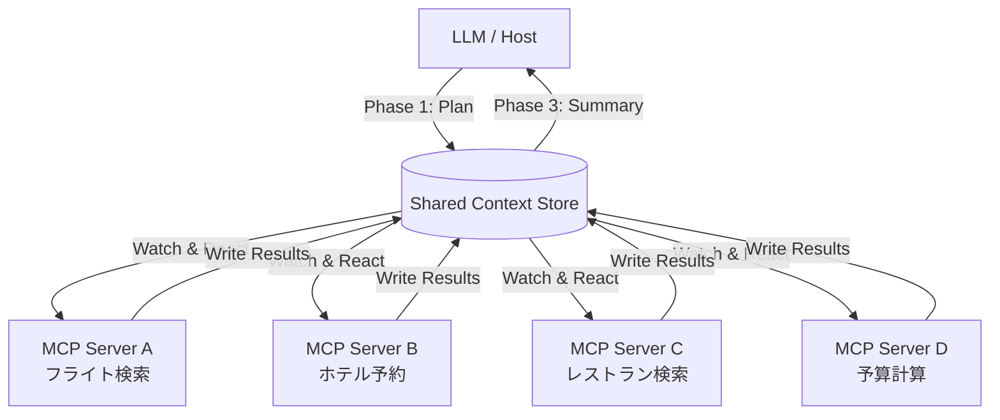

## 論文概要（Abstract）

本記事は [Enhancing Model Context Protocol (MCP) with Context-Aware Server Collaboration](https://arxiv.org/abs/2601.11595) の解説記事です。

本論文は、Model Context Protocol（MCP）の拡張としてContext-Aware MCP（CA-MCP）を提案している。従来のMCPではLLMがすべてのツール呼び出しを逐次的にオーケストレーションする必要があり、レイテンシとコストの両面でボトルネックとなっていた。CA-MCPではShared Context Store（SCS）と呼ばれる共有ブラックボードを導入し、MCPサーバー群がLLMの継続的な介在なしに自律的に連携できるアーキテクチャを実現する。著者らは、Planning・Autonomous Execution・Summarizationの3フェーズモデルにより、LLM呼び出しを最小2回に削減し、TravelPlannerベンチマークで実行時間67.8%短縮、タスク完全性30.9%向上を達成したと報告している。

この記事は [Zenn記事: FastMCPで自作MCPサーバーをCI/CDログ調査エージェントに統合する実装手法](https://zenn.dev/0h_n0/articles/90a694ce3da46f) の深掘りです。

## 情報源

- **arXiv ID**: 2601.11595
- **URL**: [https://arxiv.org/abs/2601.11595](https://arxiv.org/abs/2601.11595)
- **著者**: Meenakshi Amulya Jayanti, X.Y. Han
- **発表年**: 2026年（v1: 2026年1月6日、v2: 2026年1月22日）
- **分野**: cs.DC（分散コンピューティング）, cs.LG（機械学習）, cs.SE（ソフトウェア工学）

## 背景と動機（Background & Motivation）

Model Context Protocol（MCP）は、LLMと外部ツール・データソースを接続する標準プロトコルとして広く普及している。しかし、従来のMCPアーキテクチャには構造的な課題がある。LLMがすべてのツール呼び出しにおいて中心的なオーケストレーターとして機能するため、複数のMCPサーバーが関与するタスクでは、各ステップごとにLLMへのラウンドトリップが発生する。

具体的には、旅行計画のようなマルチステップタスクを考える。フライト検索、ホテル予約、レストラン予約、予算計算といった各ステップでLLMが介在し、前のステップの結果を受け取り、次のツール呼び出しを決定する。著者らはこの構造を「hub-and-spoke」パターンと表現している。サーバーが5つあれば5回のLLM呼び出しが必要になり、レイテンシの累積とトークンコストの増大は避けられない。

この課題は、CI/CDパイプラインのような複数ツールを横断的に利用するエージェントシステムにおいて顕著となる。各MCPサーバーは互いの状態を知らず、LLMが唯一の調整役であるため、サーバー間の直接的なデータ受け渡しができない。この非効率性を解消するために、著者らはサーバー間で共有されるコンテキストストアを導入するCA-MCPを提案した。

## 主要な貢献（Key Contributions）

- **Shared Context Store（SCS）の設計**: MCPサーバー間の共有ブラックボードとして機能する集中型データストアを提案。タスクの状態、中間結果、依存関係を単一の真実のソース（single source of truth）として管理する
- **3フェーズ実行モデル**: Planning（LLMによる計画生成）、Autonomous Execution（サーバー群の自律実行）、Summarization（LLMによる結果集約）の3段階に分離し、LLM呼び出しを最小2回に削減
- **Stateful Reactorパターン**: MCPサーバーを「状態を持つリアクター」として再定義。SCSの変更を監視し、依存関係が充足された時点で自律的にタスクを実行する
- **定量的ベンチマーク評価**: TravelPlanner（500クエリ）とREALM-Bench Wedding Logisticsの2つのベンチマークで統計的に有意な改善を実証（p < 1e-8）

## 技術的詳細（Technical Details）

### CA-MCPアーキテクチャ

CA-MCPの中核は、MCPサーバー群がSCSを介して自律的に連携するアーキテクチャである。



### 3フェーズモデルの詳細

**Phase 1: Planning** -- LLMはユーザーのリクエストを受け取り、タスクの依存関係グラフ（DAG）を生成する。このDAGはSCSに書き込まれる。LLMの関与はこのフェーズで1回目の呼び出しとなる。

タスクDAGは以下のような構造で表現される。

$$
G = (V, E) \quad \text{where} \quad V = \{t_1, t_2, \ldots, t_n\}, \quad E \subseteq V \times V
$$

ここで、$V$ はタスク集合、$E$ は依存関係を表す有向辺の集合である。$(t_i, t_j) \in E$ は「タスク $t_i$ が完了しないとタスク $t_j$ を開始できない」ことを意味する。

**Phase 2: Autonomous Execution** -- 各MCPサーバーはStateful Reactorとして動作する。SCSの状態変化を監視し、自身が担当するタスクの前提条件が満たされた時点で自律的に実行を開始する。

```python
from dataclasses import dataclass
from typing import Any


@dataclass
class TaskState:
    """SCS上のタスク状態"""
    task_id: str
    status: str  # "pending" | "running" | "completed" | "failed"
    dependencies: list[str]
    result: Any = None


def stateful_reactor_loop(
    server_id: str,
    scs: "SharedContextStore",
    assigned_tasks: list[str],
) -> None:
    """Stateful Reactorのメインループ

    Args:
        server_id: このサーバーの識別子
        scs: Shared Context Storeへの参照
        assigned_tasks: このサーバーに割り当てられたタスクID一覧
    """
    while not scs.all_tasks_completed():
        for task_id in assigned_tasks:
            task = scs.get_task(task_id)
            if task.status != "pending":
                continue
            deps_met = all(
                scs.get_task(dep).status == "completed"
                for dep in task.dependencies
            )
            if deps_met:
                scs.update_status(task_id, "running")
                result = execute_task(task, scs)
                scs.write_result(task_id, result)
                scs.update_status(task_id, "completed")
```

依存関係のないタスク（DAGの根ノード）は並列に実行可能であり、これがレイテンシ削減の主な要因となる。

**Phase 3: Summarization** -- すべてのタスクが完了すると、LLMがSCSから全結果を取得し、ユーザー向けの最終応答を生成する。これが2回目のLLM呼び出しである。

### 従来MCPとCA-MCPの比較

| 特性 | 従来MCP | CA-MCP |
|------|---------|--------|
| LLMの役割 | 全ステップのオーケストレーター | 計画者＋要約者 |
| LLM呼び出し回数 | タスク数に比例（N回） | 固定2回（計画＋要約） |
| サーバー間通信 | LLM経由の間接通信 | SCS経由の直接共有 |
| 並列実行 | 不可（逐次的） | DAG依存関係に基づき可能 |
| サーバーの状態 | ステートレス | ステートフル（SCS監視） |
| スケーラビリティ | LLMがボトルネック | サーバー追加で水平拡張可能 |

## 実装のポイント（Implementation）

CA-MCPのアーキテクチャをFastMCPベースのシステムに導入する際の要点を整理する。

**SCSの実装選択肢**: SCSはブラックボードパターンの実装であり、要件に応じて複数の選択肢がある。プロトタイプ段階ではRedisのPub/Sub機能が適している。タスク状態の書き込みはRedis Hashで管理し、状態変更通知はRedis StreamsまたはPub/Subで各サーバーに伝播させる。本番環境ではDynamoDB + DynamoDB Streamsの組み合わせが耐久性と可用性の面で有利である。

**依存関係の管理**: タスクDAGの定義はLLMの計画フェーズで生成されるため、LLMプロンプトにDAG構造のスキーマを明示的に含める必要がある。JSON SchemaまたはStructured Outputsを使い、タスクID・担当サーバー・依存関係リストを強制的に出力させることで、計画の品質を担保する。

**エラーハンドリング**: 個別サーバーの障害時にはSCS上の当該タスクを `failed` 状態に遷移させ、依存するダウンストリームタスクの実行を抑止する。この障害伝播のロジックはSCSレイヤーに組み込むことで、各サーバーの実装をシンプルに保てる。

## Production Deployment Guide

CA-MCPをAWS上で本番運用する実装パターンを示す。以下は2026年8月時点のAWS東京リージョン（ap-northeast-1）料金に基づく概算値であり、実際のコストはトラフィックパターンにより変動する。最新料金はAWS料金計算ツールで確認を推奨する。

### AWS実装パターン（コスト最適化重視）

| 構成 | トラフィック | アーキテクチャ | 月額概算 |
|------|-------------|---------------|---------|
| Small | ~100 req/日 | Lambda + DynamoDB + SQS | $50-150 |
| Medium | ~1,000 req/日 | ECS Fargate + ElastiCache Redis | $300-800 |
| Large | 10,000+ req/日 | EKS + ElastiCache Redis Cluster | $2,000-5,000 |

**Small構成**: 各MCPサーバーをLambda関数として実装し、SCSにDynamoDB（On-Demandモード）を使用する。DynamoDB Streamsでタスク状態の変更をトリガーし、依存タスクのLambdaを起動する。月額内訳: Lambda $5-15、DynamoDB $10-30、Bedrock $30-80、CloudWatch $5-25。

**Medium構成**: MCPサーバーをECS Fargateタスクとして常駐させ、SCSにElastiCache Redis（cache.t4g.micro）を使用する。Redisの低レイテンシにより、Stateful Reactorのポーリング間隔を100msに設定可能。月額内訳: ECS Fargate $80-200、ElastiCache $50-100、Bedrock $100-350、ALB + NAT $70-150。

**Large構成**: EKS上でMCPサーバーポッドを運用し、ElastiCache Redis ClusterでシャーディングされたSCSを構成する。Karpenter + Spot Instancesで最大90%のコンピュート費削減が見込める。月額内訳: EKS $75、EC2 Spot $200-400、ElastiCache $300-600、Bedrock $800-2,500。

**コスト削減テクニック**: Spot Instancesで最大90%削減、ElastiCache Reserved Instancesで最大40%削減、Bedrock Batch APIで50%削減、Prompt Cachingで30-90%のトークンコスト削減。

### Terraformインフラコード

#### Small構成（Serverless）

```hcl
# CA-MCP Small構成: Lambda + DynamoDB (2026年8月 ap-northeast-1)

resource "aws_dynamodb_table" "scs" {
  name         = "ca-mcp-scs"
  billing_mode = "PAY_PER_REQUEST"
  hash_key     = "session_id"
  range_key    = "task_id"

  attribute {
    name = "session_id"
    type = "S"
  }
  attribute {
    name = "task_id"
    type = "S"
  }

  stream_enabled   = true
  stream_view_type = "NEW_AND_OLD_IMAGES"

  server_side_encryption { enabled = true }
  point_in_time_recovery { enabled = true }
  ttl {
    attribute_name = "expires_at"
    enabled        = true
  }
}

resource "aws_lambda_function" "mcp_reactor" {
  function_name = "ca-mcp-reactor"
  runtime       = "python3.12"
  handler       = "handler.lambda_handler"
  role          = aws_iam_role.mcp_server_lambda.arn
  timeout       = 300
  memory_size   = 512

  environment {
    variables = {
      SCS_TABLE_NAME = aws_dynamodb_table.scs.name
    }
  }
  tracing_config { mode = "Active" }
}

# DynamoDB Streams -> Lambda: タスク完了時に依存タスクを起動
resource "aws_lambda_event_source_mapping" "scs_stream" {
  event_source_arn  = aws_dynamodb_table.scs.stream_arn
  function_name     = aws_lambda_function.mcp_reactor.arn
  starting_position = "LATEST"
  batch_size        = 10

  filter_criteria {
    filter {
      pattern = jsonencode({
        eventName = ["MODIFY"]
        dynamodb  = { NewImage = { status = { S = ["completed"] } } }
      })
    }
  }
}
```

#### Large構成（Container）

```hcl
# CA-MCP Large構成: EKS + Karpenter + Spot (2026年8月 ap-northeast-1)

module "eks" {
  source          = "terraform-aws-modules/eks/aws"
  version         = "~> 20.24"
  cluster_name    = "ca-mcp-cluster"
  cluster_version = "1.31"
  vpc_id          = module.vpc.vpc_id
  subnet_ids      = module.vpc.private_subnets
  cluster_endpoint_public_access = false
}

# Karpenter: Spot優先の自動スケーリング
resource "kubectl_manifest" "karpenter_nodepool" {
  yaml_body = yamlencode({
    apiVersion = "karpenter.sh/v1"
    kind       = "NodePool"
    metadata   = { name = "ca-mcp-spot" }
    spec = {
      template = {
        spec = {
          requirements = [
            { key = "karpenter.sh/capacity-type", operator = "In",
              values = ["spot", "on-demand"] },
            { key = "node.kubernetes.io/instance-type", operator = "In",
              values = ["m6i.xlarge", "m6a.xlarge", "m5.xlarge"] },
          ]
          nodeClassRef = { group = "karpenter.k8s.aws", kind = "EC2NodeClass", name = "default" }
        }
      }
      limits     = { cpu = "48", memory = "192Gi" }
      disruption = { consolidationPolicy = "WhenEmptyOrUnderutilized", consolidateAfter = "30s" }
    }
  })
}

resource "aws_budgets_budget" "ca_mcp_monthly" {
  name         = "ca-mcp-monthly-budget"
  budget_type  = "COST"
  limit_amount = "5000"
  limit_unit   = "USD"
  time_unit    = "MONTHLY"

  notification {
    comparison_operator        = "GREATER_THAN"
    threshold                  = 80
    threshold_type             = "PERCENTAGE"
    notification_type          = "ACTUAL"
    subscriber_email_addresses = ["alerts@example.com"]
  }
}
```

### 運用・監視設定

**CloudWatch Logs Insights クエリ**

```
# コスト異常検知: 1時間あたりのトークン使用量
fields @timestamp, @message
| filter @message like /bedrock/
| stats sum(token_count) as total_tokens by bin(1h)
| sort total_tokens desc

# レイテンシ分析
fields @timestamp, duration_ms, server_id
| filter event = "task_completed"
| stats avg(duration_ms) as avg_ms, pct(duration_ms, 95) as p95_ms by server_id
```

**CloudWatch アラーム + X-Ray + Cost Explorer（Python）**

```python
import datetime
from typing import Any

import boto3
from aws_xray_sdk.core import patch_all, xray_recorder

patch_all()  # boto3自動計装


def create_bedrock_token_alarm(cw: Any, sns_arn: str, threshold: int = 100000) -> dict:
    """Bedrockトークン使用量スパイク検知アラーム"""
    return cw.put_metric_alarm(
        AlarmName="ca-mcp-bedrock-token-spike",
        MetricName="InputTokenCount", Namespace="AWS/Bedrock",
        Statistic="Sum", Period=3600, EvaluationPeriods=1,
        Threshold=threshold, ComparisonOperator="GreaterThanThreshold",
        AlarmActions=[sns_arn],
    )


def get_daily_cost(ce: Any) -> float:
    """日次コスト取得。$100/日超過でSNS通知"""
    today = datetime.date.today()
    resp = ce.get_cost_and_usage(
        TimePeriod={"Start": (today - datetime.timedelta(1)).isoformat(), "End": today.isoformat()},
        Granularity="DAILY", Metrics=["UnblendedCost"],
        Filter={"Tags": {"Key": "Project", "Values": ["ca-mcp"]}},
    )
    total = sum(float(g["Metrics"]["UnblendedCost"]["Amount"])
                for r in resp["ResultsByTime"] for g in r["Groups"])
    if total > 100.0:
        boto3.client("sns").publish(
            TopicArn="arn:aws:sns:ap-northeast-1:123456789012:ca-mcp-alerts",
            Subject="CA-MCP Cost Alert", Message=f"Daily cost: ${total:.2f}",
        )
    return total
```

### コスト最適化チェックリスト

**アーキテクチャ選択**
- [ ] トラフィック量に応じた構成を選択（Small: Serverless / Medium: Hybrid / Large: Container）
- [ ] SCSのストレージ選択が負荷特性に合致（DynamoDB vs ElastiCache Redis）
- [ ] MCPサーバー数に応じたスケーリング戦略を定義

**リソース最適化**
- [ ] EC2/EKSワーカーノードでSpot Instances優先使用（最大90%削減）
- [ ] ElastiCache Redisに1年Reserved Instance適用（最大40%削減）
- [ ] Savings Plans検討（Fargate/Lambda向け）
- [ ] Lambda: メモリサイズをPower Tuningで最適化
- [ ] ECS/EKS: アイドル時のスケールダウン設定（Karpenter consolidation）
- [ ] NAT Gatewayの利用最小化（VPCエンドポイント活用）

**LLMコスト削減**
- [ ] Bedrock Batch API使用（非リアルタイム計画生成で50%削減）
- [ ] Prompt Caching有効化（類似DAG生成で30-90%削減）
- [ ] モデル選択ロジック（単純タスクにはHaiku、複雑タスクにはSonnet/Opus）
- [ ] トークン数制限（DAG出力の最大トークン数を設定）
- [ ] CA-MCPの本質的効果: LLM呼び出し回数のN回→2回削減

**監視・アラート**
- [ ] AWS Budgets設定（月額予算の80%/100%でアラート）
- [ ] CloudWatch アラーム（Bedrockトークンスパイク、Lambda実行時間）
- [ ] Cost Anomaly Detection有効化
- [ ] 日次コストレポート（SNS通知付き）
- [ ] X-Rayトレーシングでボトルネック可視化

**リソース管理**
- [ ] 未使用リソースの定期削除（Lambda旧バージョン、未使用ENI等）
- [ ] タグ戦略の適用（Project、Environment、CostCenterタグ必須）
- [ ] DynamoDB TTLによるセッションデータの自動削除
- [ ] CloudWatch Logsのライフサイクルポリシー（30日保持）
- [ ] 開発環境の夜間・週末停止（EventBridge Scheduler）

## 実験結果（Results）

著者らは2つのベンチマークでCA-MCPの有効性を評価している。

### TravelPlanner（500クエリ）

| 指標 | 従来MCP | CA-MCP | 改善率 |
|------|---------|--------|--------|
| 実行時間 | 42.0s | 13.5s | 67.8%短縮 |
| タスク完全性 | 0.764 | 1.000 | +30.9% |
| LLM呼び出し回数 | 5 | 2 | 60%削減 |

TravelPlannerは旅行計画タスク（フライト・ホテル・レストラン・アクティビティ・予算管理の5要素）を500クエリで評価するベンチマークである。著者らは、従来MCPでは各ツール呼び出しにLLMが介在するため平均42.0秒を要していたのに対し、CA-MCPではSCS経由の自律連携により13.5秒に短縮されたと報告している。タスク完全性が0.764から1.000に向上した点は、LLMの逐次判断におけるエラー伝播がCA-MCPでは発生しにくいことを示唆している。

### REALM-Bench Wedding Logistics

| 指標 | 従来MCP | CA-MCP | 改善率 |
|------|---------|--------|--------|
| メイクスパン | 330 min | 180 min | 45.5%短縮 |
| 実行時間 | 8.52s | 2.26s | 73.5%短縮 |
| LLM呼び出し回数 | 2 | 1 | 50%削減 |

REALM-Bench Wedding Logisticsはより複雑な実世界シナリオのベンチマークであり、メイクスパン（全タスク完了までの論理的所要時間）で45.5%の改善が確認されている。著者らは、すべての結果が統計的に有意（p < 1e-8）であると報告している。

両ベンチマークに共通する傾向として、CA-MCPの性能向上はタスク間の並列実行可能性に大きく依存している。タスク間の依存関係が密なシナリオでは、並列化の余地が限られるため改善幅は小さくなると考えられる。

## 実運用への応用（Practical Applications）

CA-MCPのアーキテクチャは、Zenn記事で取り上げたCI/CDログ調査エージェントのようなマルチツール連携シナリオに直接適用できる。

CI/CDパイプラインの障害調査を例に取ると、従来のMCPベースエージェントでは、GitHub Actionsログ取得 → エラーパース → テスト結果解析 → 関連コミット特定 → 修正提案という各ステップでLLMが介在する。CA-MCPを適用すれば、LLMが最初に調査計画（DAG）を生成した後、各MCPサーバーがSCS経由で自律的にデータ収集・解析を行い、最後にLLMが統合レポートを生成する。

FastMCPで実装したCI/CDログ調査サーバーに対しては、SCSとしてRedisを導入し、各サーバー（GitHub MCP、Docker MCP、テスト結果MCP等）をStateful Reactorパターンで拡張するアプローチが考えられる。並列実行可能なタスク（ログ取得とテスト結果取得など）が多いCI/CD調査シナリオでは、論文のベンチマーク結果から推測して、応答時間の大幅な短縮が期待できる。

ただし、CA-MCPの導入にはSCSの運用コストと設計の複雑さが伴う。サーバー数が5台以上、かつタスク間の並列性が高いシナリオでCA-MCPの効果が顕著になると筆者は考える。

## 関連研究（Related Work）

- **Model Context Protocol (MCP)**: Anthropicが提唱したLLMと外部ツールの接続プロトコル。CA-MCPはこの標準プロトコルの拡張として位置づけられる
- **Blackboard Architecture**: AI分野の古典的な協調問題解決アーキテクチャ。SCSはこのパターンの現代的な再解釈である
- **Multi-Agent Systems**: AutoGen、CrewAI等はエージェント間の直接通信を提供するが、MCPサーバーレベルでの自律連携はCA-MCP独自のアプローチである
- **DAG-based Orchestration**: Apache Airflow等と類似するが、CA-MCPではLLMが動的にDAGを生成する点が異なる

## まとめと今後の展望

CA-MCPは、MCPサーバー間の自律連携をSCSとStateful Reactorパターンで実現し、LLM呼び出しをタスク数に依存しない固定2回に削減するアーキテクチャである。TravelPlannerで67.8%の実行時間短縮、REALM-Benchで73.5%の実行時間短縮が報告されており、マルチツール連携シナリオにおいて実用的な改善を示している。

今後の展望として、多様なドメインでの有効性検証、SCSの分散構成（マルチリージョン対応）、タスクDAGの動的再計画が研究課題として挙げられる。MCPエコシステムの拡大に伴い、サーバー間連携パターンの需要は増加すると考えられる。

## 参考文献

- **arXiv**: [https://arxiv.org/abs/2601.11595](https://arxiv.org/abs/2601.11595)
- **Model Context Protocol**: [https://modelcontextprotocol.io/](https://modelcontextprotocol.io/)
- **Related Zenn article**: [https://zenn.dev/0h_n0/articles/90a694ce3da46f](https://zenn.dev/0h_n0/articles/90a694ce3da46f)
