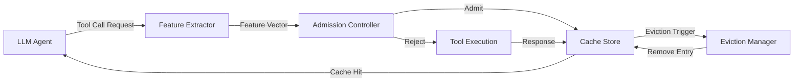

本記事は [ToolCaching: Towards Efficient Caching for LLM Tool-calling](https://arxiv.org/abs/2601.15335) の解説記事です。

## 論文概要（Abstract）

LLMエージェントが外部ツールを呼び出す際、同一または類似のリクエストが繰り返し発生し、レイテンシとコストの増大を招く。従来のキャッシュ技術はこの問題に対する有効な手段であるが、LLMツール呼び出しには異種リクエストセマンティクス、動的ワークロード、鮮度要件の多様性という固有の困難が存在する。著者らはこれらの課題に対処するため、特徴駆動型の適応的キャッシュフレームワーク「ToolCaching」と、バンディットベースのアドミッション制御と多要因エビクションを組み合わせた「VAAC（Value-Aware Adaptive Caching）」アルゴリズムを提案している。

この記事は [Zenn記事: FastMCPで自作MCPサーバーをCI/CDログ調査エージェントに統合する実装手法](https://zenn.dev/0h_n0/articles/90a694ce3da46f) の深掘りです。Zenn記事ではFastMCPの`ResponseCachingMiddleware`やLRUキャッシュを用いたJenkins APIレスポンスのキャッシング手法を紹介しているが、本論文はそのようなツール呼び出しキャッシュの設計を理論的・体系的に扱ったものである。

## 情報源

- **arXiv ID**: 2601.15335
- **URL**: [https://arxiv.org/abs/2601.15335](https://arxiv.org/abs/2601.15335)
- **著者**: Yi Zhai, Dian Shen, Junzhou Luo, Bin Yang
- **発表年**: 2026年1月
- **分野**: cs.SE（ソフトウェア工学）

## 背景と動機（Background & Motivation）

LLMを核としたエージェントシステムでは、外部ツール（API、データベース、ファイルシステム等）の呼び出しが不可欠である。MCP（Model Context Protocol）やFunction Callingの普及により、LLMが自律的にツールを選択・実行する構成が一般化しつつある。しかし、同一ユーザーが同じ質問を繰り返したり、複数のエージェントが同一APIに対して類似リクエストを送信したりすることで、冗長なツール呼び出しが大量に発生する。

従来のWebキャッシュ（LRU、LFU等）は均質なHTTPリクエストを前提としており、LLMツール呼び出しには以下の3つの理由から直接適用が困難である。

**第一に、異種リクエストセマンティクスの問題がある。** LLMのツール呼び出しは、天気情報取得のような単純なAPIから、データベースクエリ、コード実行、外部サービス連携まで多岐にわたる。リクエストの構造、パラメータ空間、レスポンスサイズが大きく異なるため、単一のキャッシュキー生成戦略では対応できない。

**第二に、動的ワークロードの問題がある。** LLMの利用パターンは時間帯、ユーザー、タスクの種類によって大きく変動する。静的なキャッシュポリシーではこの変動に追従できず、キャッシュヒット率が低下する。

**第三に、鮮度要件の多様性がある。** ツールの種類によって許容されるキャッシュ有効期間（TTL）が大きく異なる。株価情報は数秒単位の鮮度が求められるが、技術ドキュメントの検索結果は数時間のキャッシュが許容される。この差異を統一的に扱うメカニズムが必要である。

## 主要な貢献（Key Contributions）

著者らは以下の3点を主要な貢献として報告している。

- **ToolCachingフレームワーク**: LLMツール呼び出しに特化した特徴駆動型の適応的キャッシュシステム。セマンティック特徴とシステムレベル特徴を統合し、ツールの種類やワークロードの変動に適応するキャッシュ戦略を実現
- **VAACアルゴリズム**: バンディットベースのアドミッション制御（キャッシュに格納するか否かの判断）と、価値駆動型の多要因エビクションポリシー（どのエントリを追い出すかの判断）を統合。リクエスト頻度、再利用の新しさ（recency）、キャッシュ価値を同時に考慮する
- **評価結果**: 標準的なキャッシュポリシー（LRU、LFU等）と比較して、キャッシュヒット率が最大11%向上、レイテンシが最大34%低減

## 技術的詳細（Technical Details）

### ToolCachingフレームワークのアーキテクチャ

ToolCachingフレームワークは、Feature Extractor、Admission Controller、Cache Store、Eviction Managerの4つのコンポーネントから構成される。



Feature Extractorは各ツール呼び出しリクエストからセマンティック特徴（ツール名、パラメータ構造、入力の意味的類似度）とシステムレベル特徴（レスポンスサイズ、実行時間、エラー率）を抽出する。これにより、異種のツール呼び出しを統一的な特徴空間で扱うことが可能になる。

### VAACアルゴリズム

VAACアルゴリズムの核心は、キャッシュエントリの「価値」を定量化し、アドミッションとエビクションの両方で活用する点にある。

#### キャッシュ価値の推定

各ツール呼び出しリクエスト $r$ に対するキャッシュ価値 $V(r)$ は以下のように定義される。

$$
V(r) = \alpha \cdot f(r) + \beta \cdot R(r) + \gamma \cdot C(r)
$$

ここで、
- $f(r)$: リクエスト $r$ の頻度スコア（過去の出現回数に基づく正規化値）
- $R(r)$: 再利用の新しさスコア（最後にアクセスされてからの経過時間の逆数）
- $C(r)$: コスト削減スコア（キャッシュヒット時に節約できる実行コスト。レイテンシとAPI料金の加重和）
- $\alpha, \beta, \gamma$: 各要因の重み係数（$\alpha + \beta + \gamma = 1$）

著者らは、これらの重み係数をオンラインで適応的に調整するために、Multi-Armed Bandit（MAB）フレームワークを採用している。

#### バンディットベースのアドミッション制御

アドミッション制御では、新しいリクエストをキャッシュに格納するか否かを判断する。著者らはこれをバンディット問題として定式化している。各アーム $a_i$ はアドミッション戦略（例: 常にキャッシュする、コスト閾値以上のみキャッシュする、頻度閾値以上のみキャッシュする等）に対応し、報酬 $r_t$ は時刻 $t$ におけるキャッシュヒット率の改善量として定義される。

UCB1（Upper Confidence Bound）を用いた選択戦略は以下のとおりである。

$$
a^* = \arg\max_{a_i} \left[ \bar{r}_{a_i} + c \sqrt{\frac{\ln t}{n_{a_i}}} \right]
$$

ここで、
- $\bar{r}_{a_i}$: アーム $a_i$ の平均報酬
- $t$: 総試行回数
- $n_{a_i}$: アーム $a_i$ が選択された回数
- $c$: 探索パラメータ（探索と活用のトレードオフを制御）

この定式化により、ワークロードの変動に応じてアドミッション戦略が自動的に切り替わる。

#### 多要因エビクションポリシー

キャッシュが容量上限に達した場合、著者らは以下のスコア関数に基づいてエビクション対象を選択する。

$$
S_{\text{evict}}(e) = w_1 \cdot \frac{1}{f(e)} + w_2 \cdot \Delta t(e) + w_3 \cdot \frac{1}{C(e)} + w_4 \cdot D(e)
$$

ここで、
- $e$: キャッシュエントリ
- $f(e)$: エントリ $e$ のアクセス頻度
- $\Delta t(e)$: 最終アクセスからの経過時間
- $C(e)$: キャッシュミス時の再計算コスト
- $D(e)$: エントリの鮮度劣化度（TTLに対する経過時間の比率）
- $w_1, w_2, w_3, w_4$: エビクション重み（バンディットにより適応的に調整）

$S_{\text{evict}}(e)$ が大きいエントリほど「キャッシュに保持する価値が低い」と判断され、優先的に追い出される。

### アルゴリズムの擬似コード

```python
from dataclasses import dataclass, field
from typing import Any


@dataclass
class CacheEntry:
    """キャッシュエントリの構造体"""

    key: str
    value: Any
    frequency: int = 0
    last_access: float = 0.0
    cost: float = 0.0
    ttl: float = 3600.0
    created_at: float = 0.0


class VAACCache:
    """VAAC（Value-Aware Adaptive Caching）の簡易実装"""

    def __init__(
        self,
        capacity: int,
        alpha: float = 0.4,
        beta: float = 0.3,
        gamma: float = 0.3,
    ) -> None:
        self.capacity = capacity
        self.alpha = alpha
        self.beta = beta
        self.gamma = gamma
        self.cache: dict[str, CacheEntry] = {}
        self.arm_rewards: dict[str, list[float]] = {
            "always": [],
            "cost_threshold": [],
            "freq_threshold": [],
        }

    def compute_cache_value(self, entry: CacheEntry, current_time: float) -> float:
        """キャッシュ価値 V(r) を計算"""
        recency = 1.0 / (current_time - entry.last_access + 1e-6)
        return (
            self.alpha * entry.frequency
            + self.beta * recency
            + self.gamma * entry.cost
        )

    def compute_eviction_score(self, entry: CacheEntry, current_time: float) -> float:
        """エビクションスコア S_evict(e) を計算（高いほど追い出し対象）"""
        freq_inv = 1.0 / (entry.frequency + 1e-6)
        elapsed = current_time - entry.last_access
        cost_inv = 1.0 / (entry.cost + 1e-6)
        staleness = (current_time - entry.created_at) / entry.ttl
        return 0.25 * freq_inv + 0.25 * elapsed + 0.25 * cost_inv + 0.25 * staleness

    def evict(self, current_time: float) -> None:
        """最もエビクションスコアが高いエントリを削除"""
        if not self.cache:
            return
        victim_key = max(
            self.cache,
            key=lambda k: self.compute_eviction_score(self.cache[k], current_time),
        )
        del self.cache[victim_key]

    def get(self, key: str, current_time: float) -> Any | None:
        """キャッシュ参照（ヒット時に頻度・最終アクセスを更新）"""
        if key in self.cache:
            entry = self.cache[key]
            entry.frequency += 1
            entry.last_access = current_time
            return entry.value
        return None

    def put(
        self,
        key: str,
        value: Any,
        cost: float,
        ttl: float,
        current_time: float,
    ) -> None:
        """キャッシュ格納（容量超過時はエビクション実行）"""
        if len(self.cache) >= self.capacity:
            self.evict(current_time)
        self.cache[key] = CacheEntry(
            key=key,
            value=value,
            frequency=1,
            last_access=current_time,
            cost=cost,
            ttl=ttl,
            created_at=current_time,
        )
```

## 実装のポイント（Implementation）

ToolCachingの概念をMCPツール呼び出しに適用する際の実装上の注意点を整理する。

**キャッシュキーの設計が最も重要である。** LLMのツール呼び出しでは、同じ意図のリクエストが異なるパラメータ表現で送信されることがある。例えば、`get_weather("Tokyo")` と `get_weather("東京")` は同一のキャッシュエントリとして扱うべきだが、単純な文字列比較では区別されてしまう。Zenn記事で紹介されているFastMCPの`ResponseCachingMiddleware`はリクエストの完全一致を前提としているため、セマンティックなキャッシュキー生成を追加実装する必要がある。

**TTLの動的設定が性能を左右する。** Zenn記事のLRUキャッシュ実装（`@lru_cache`や`functools.cache`）はTTLを持たないため、鮮度要件が厳しいツール（CI/CDのビルドステータス取得等）には不適切な場合がある。ToolCachingでは、ツールの種類ごとにTTLを動的に設定し、鮮度劣化度 $D(e)$ をエビクション判断に組み込む設計が提案されている。

**コスト計測の計装が必要である。** VAACのキャッシュ価値計算にはツール実行コスト $C(r)$ が必要であるが、これは実行時間の計測やAPI課金情報の取得を伴う。実装時には、各ツール呼び出しのレイテンシを計装し、コスト情報をキャッシュメタデータとして保持する仕組みが求められる。

**バンディットの初期化戦略に注意が必要である。** コールドスタート時にはアーム選択に十分なデータがないため、初期フェーズでは$\epsilon$-greedyのような単純な戦略で探索を行い、データが蓄積された後にUCB1に切り替えるウォームアップが有効であると著者らは述べている。

## Production Deployment Guide

### AWS実装パターン（コスト最適化重視）

ToolCachingをAWS上で本番運用する際の構成を、トラフィック量別に示す。以下は2026年8月時点のap-northeast-1（東京）リージョン料金に基づく概算値であり、実際のコストはトラフィックパターン、バースト使用量により変動する。最新料金はAWS料金計算ツールで確認を推奨する。

| 構成 | トラフィック量 | 主要サービス | 月額概算 |
|------|--------------|-------------|---------|
| Small | ~100 req/日 | Lambda + Bedrock + DynamoDB | $50-150 |
| Medium | ~1,000 req/日 | ECS Fargate + ElastiCache + Bedrock | $300-800 |
| Large | 10,000+ req/日 | EKS + ElastiCache Cluster + Bedrock | $2,000-5,000 |

**Small構成の内訳**: Lambda（128MB, ~3,000回/月）$1未満、DynamoDB On-Demand（キャッシュストア）$5-15、Bedrock Claude Sonnet（100 req/日 x 1K tokens平均）$30-100、CloudWatch Logs $5-10。

**Medium構成の内訳**: ECS Fargate（0.5 vCPU, 1GB RAM x 2タスク）$30-60、ElastiCache Redis（cache.t3.micro）$15-25、Bedrock $200-500、NAT Gateway $35、CloudWatch $20-30。

**Large構成の内訳**: EKS コントロールプレーン $75、EC2 Spot（m5.xlarge x 3）$80-200、ElastiCache Redis Cluster（cache.r6g.large x 3）$400-600、Bedrock Batch API $800-2,500、ALB $25-50。

**コスト削減テクニック**:
- Spot Instances活用でEC2コストを最大90%削減
- Reserved Instances（1年コミット）でElastiCacheコストを最大72%削減
- Bedrock Batch API使用でLLM推論コストを50%削減
- Prompt Caching有効化で入力トークンコストを30-90%削減

### Terraformインフラコード

**Small構成（Serverless）**: Lambda + Bedrock + DynamoDB

```hcl
# ToolCaching Small構成 - Serverless
# 2026年8月時点の設計

terraform {
  required_version = ">= 1.9"
  required_providers {
    aws = {
      source  = "hashicorp/aws"
      version = "~> 5.60"
    }
  }
}

provider "aws" {
  region = "ap-northeast-1"
}

# DynamoDB - キャッシュストア（On-Demandでコスト最適化）
resource "aws_dynamodb_table" "tool_cache" {
  name         = "tool-cache-store"
  billing_mode = "PAY_PER_REQUEST"
  hash_key     = "cache_key"

  attribute {
    name = "cache_key"
    type = "S"
  }

  ttl {
    attribute_name = "expires_at"
    enabled        = true
  }

  server_side_encryption {
    enabled = true  # KMS暗号化
  }

  tags = {
    Project = "toolcaching"
    Env     = "production"
  }
}

# IAMロール - Lambda用（最小権限）
resource "aws_iam_role" "lambda_role" {
  name = "toolcaching-lambda-role"
  assume_role_policy = jsonencode({
    Version = "2012-10-17"
    Statement = [{
      Action = "sts:AssumeRole"
      Effect = "Allow"
      Principal = { Service = "lambda.amazonaws.com" }
    }]
  })
}

resource "aws_iam_role_policy" "lambda_policy" {
  name = "toolcaching-lambda-policy"
  role = aws_iam_role.lambda_role.id
  policy = jsonencode({
    Version = "2012-10-17"
    Statement = [
      {
        Effect   = "Allow"
        Action   = ["dynamodb:GetItem", "dynamodb:PutItem", "dynamodb:DeleteItem", "dynamodb:Query"]
        Resource = aws_dynamodb_table.tool_cache.arn
      },
      {
        Effect   = "Allow"
        Action   = ["bedrock:InvokeModel"]
        Resource = "arn:aws:bedrock:ap-northeast-1::foundation-model/anthropic.claude-*"
      },
      {
        Effect   = "Allow"
        Action   = ["logs:CreateLogGroup", "logs:CreateLogStream", "logs:PutLogEvents"]
        Resource = "arn:aws:logs:ap-northeast-1:*:*"
      }
    ]
  })
}

# Lambda関数
resource "aws_lambda_function" "tool_cache_handler" {
  function_name = "toolcaching-handler"
  runtime       = "python3.12"
  handler       = "handler.lambda_handler"
  role          = aws_iam_role.lambda_role.arn
  timeout       = 30
  memory_size   = 256

  filename         = "lambda_package.zip"
  source_code_hash = filebase64sha256("lambda_package.zip")

  environment {
    variables = {
      CACHE_TABLE    = aws_dynamodb_table.tool_cache.name
      CACHE_CAPACITY = "1000"
      VAAC_ALPHA     = "0.4"
      VAAC_BETA      = "0.3"
      VAAC_GAMMA     = "0.3"
    }
  }

  tracing_config {
    mode = "Active"  # X-Ray有効化
  }
}

# CloudWatchアラーム - コスト監視
resource "aws_cloudwatch_metric_alarm" "lambda_duration" {
  alarm_name          = "toolcaching-lambda-duration-high"
  comparison_operator = "GreaterThanThreshold"
  evaluation_periods  = 3
  metric_name         = "Duration"
  namespace           = "AWS/Lambda"
  period              = 300
  statistic           = "Average"
  threshold           = 10000  # 10秒
  alarm_description   = "Lambda execution time exceeds 10s"

  dimensions = {
    FunctionName = aws_lambda_function.tool_cache_handler.function_name
  }
}
```

**Large構成（Container）**: EKS + Karpenter + ElastiCache

```hcl
# ToolCaching Large構成 - Container
# EKS + Karpenter（Spot優先）+ ElastiCache Redis Cluster

module "eks" {
  source          = "terraform-aws-modules/eks/aws"
  version         = "~> 20.0"
  cluster_name    = "toolcaching-cluster"
  cluster_version = "1.30"

  vpc_id     = module.vpc.vpc_id
  subnet_ids = module.vpc.private_subnets

  cluster_endpoint_public_access = false  # セキュリティ: プライベートのみ

  eks_managed_node_groups = {
    system = {
      instance_types = ["m5.large"]
      min_size       = 1
      max_size       = 2
      desired_size   = 1
      capacity_type  = "ON_DEMAND"  # システムノードはオンデマンド
    }
  }
}

# Karpenter - Spot優先の自動スケーリング
resource "kubectl_manifest" "karpenter_nodepool" {
  yaml_body = yamlencode({
    apiVersion = "karpenter.sh/v1"
    kind       = "NodePool"
    metadata   = { name = "toolcaching-spot" }
    spec = {
      template = {
        spec = {
          requirements = [
            { key = "karpenter.sh/capacity-type", operator = "In", values = ["spot", "on-demand"] },
            { key = "node.kubernetes.io/instance-type", operator = "In",
              values = ["m5.xlarge", "m5a.xlarge", "m6i.xlarge"] }
          ]
        }
      }
      limits   = { cpu = "32", memory = "128Gi" }
      disruption = { consolidationPolicy = "WhenEmptyOrUnderutilized" }
    }
  })
}

# ElastiCache Redis Cluster - キャッシュストア
resource "aws_elasticache_replication_group" "tool_cache" {
  replication_group_id = "toolcaching-redis"
  description          = "ToolCaching VAAC cache store"
  node_type            = "cache.r6g.large"
  num_cache_clusters   = 3
  engine_version       = "7.1"

  at_rest_encryption_enabled = true
  transit_encryption_enabled = true

  automatic_failover_enabled = true
  multi_az_enabled           = true
}

# AWS Budgets - 予算アラート
resource "aws_budgets_budget" "monthly" {
  name         = "toolcaching-monthly-budget"
  budget_type  = "COST"
  limit_amount = "5000"
  limit_unit   = "USD"
  time_unit    = "MONTHLY"

  notification {
    comparison_operator       = "GREATER_THAN"
    threshold                 = 80
    threshold_type            = "PERCENTAGE"
    notification_type         = "ACTUAL"
    subscriber_email_addresses = ["ops-team@example.com"]
  }
}
```

### 運用・監視設定

**CloudWatch Logs Insights クエリ**: キャッシュヒット率とレイテンシ分析

```
# キャッシュヒット率の時系列推移（1時間単位）
fields @timestamp, cache_hit, tool_name, latency_ms
| stats count(*) as total,
        sum(case when cache_hit = true then 1 else 0 end) as hits,
        avg(latency_ms) as avg_latency,
        pct(latency_ms, 95) as p95_latency
| by bin(1h) as time_bucket
| sort time_bucket desc

# ツール別コスト異常検知
fields @timestamp, tool_name, token_count, estimated_cost_usd
| stats sum(token_count) as total_tokens,
        sum(estimated_cost_usd) as total_cost
| by bin(1h) as hour, tool_name
| filter total_cost > 10
| sort total_cost desc
```

**CloudWatchアラーム・X-Rayトレーシング設定**:

```python
import boto3
from aws_xray_sdk.core import xray_recorder, patch_all

# X-Ray自動計装
patch_all()

cloudwatch = boto3.client("cloudwatch", region_name="ap-northeast-1")


def setup_cache_hit_alarm() -> None:
    """キャッシュヒット率低下アラーム"""
    cloudwatch.put_metric_alarm(
        AlarmName="toolcaching-hit-ratio-low",
        MetricName="CacheHitRatio",
        Namespace="ToolCaching",
        Statistic="Average",
        Period=300,
        EvaluationPeriods=3,
        Threshold=0.3,
        ComparisonOperator="LessThanThreshold",
        AlarmActions=["arn:aws:sns:ap-northeast-1:123456789:ops-alerts"],
    )


@xray_recorder.capture("tool_call_with_cache")
def execute_with_cache(tool_name: str, params: dict) -> dict:
    """X-Rayトレース付きキャッシュ対応ツール呼び出し"""
    subsegment = xray_recorder.current_subsegment()
    subsegment.put_annotation("tool_name", tool_name)

    cache_result = cache.get(tool_name, params)
    if cache_result is not None:
        subsegment.put_metadata("cache_hit", True)
        cloudwatch.put_metric_data(
            Namespace="ToolCaching",
            MetricData=[{"MetricName": "CacheHit", "Value": 1, "Unit": "Count"}],
        )
        return cache_result

    subsegment.put_metadata("cache_hit", False)
    result = execute_tool(tool_name, params)
    cache.put(tool_name, params, result)
    return result
```

**Cost Explorer自動レポート**:

```python
import boto3
from datetime import datetime, timedelta

ce = boto3.client("ce", region_name="ap-northeast-1")
sns = boto3.client("sns", region_name="ap-northeast-1")


def daily_cost_report() -> None:
    """日次コストレポート（Bedrock/Lambda/ElastiCache）"""
    end = datetime.utcnow().strftime("%Y-%m-%d")
    start = (datetime.utcnow() - timedelta(days=1)).strftime("%Y-%m-%d")

    response = ce.get_cost_and_usage(
        TimePeriod={"Start": start, "End": end},
        Granularity="DAILY",
        Metrics=["BlendedCost"],
        Filter={
            "Or": [
                {"Dimensions": {"Key": "SERVICE", "Values": ["Amazon Bedrock"]}},
                {"Dimensions": {"Key": "SERVICE", "Values": ["AWS Lambda"]}},
                {"Dimensions": {"Key": "SERVICE", "Values": ["Amazon ElastiCache"]}},
            ]
        },
        GroupBy=[{"Type": "DIMENSION", "Key": "SERVICE"}],
    )

    total = sum(
        float(g["Metrics"]["BlendedCost"]["Amount"])
        for r in response["ResultsByTime"]
        for g in r["Groups"]
    )

    if total > 100:
        sns.publish(
            TopicArn="arn:aws:sns:ap-northeast-1:123456789:cost-alerts",
            Subject=f"ToolCaching日次コスト警告: ${total:.2f}",
            Message=f"日次コストが$100を超えています: ${total:.2f}\n詳細: {response}",
        )
```

### コスト最適化チェックリスト

**アーキテクチャ選択**:
- [ ] トラフィック100 req/日以下ならServerless（Lambda + DynamoDB）
- [ ] 100-5,000 req/日ならHybrid（ECS Fargate + ElastiCache）
- [ ] 5,000 req/日超ならContainer（EKS + Karpenter + ElastiCache Cluster）

**リソース最適化**:
- [ ] EC2/EKSワーカーノードはSpot Instances優先（最大90%削減）
- [ ] ElastiCacheはReserved Nodes（1年コミットで最大55%削減）
- [ ] Savings Plans検討（Compute Savings Plans for Lambda + Fargate）
- [ ] Lambda メモリサイズをPower Tuningで最適化
- [ ] ECS/EKSのアイドル時スケールダウン設定
- [ ] NAT Gateway不使用構成の検討（VPCエンドポイント活用）

**LLMコスト削減**:
- [ ] Bedrock Batch API使用（非リアルタイム処理で50%削減）
- [ ] Prompt Caching有効化（繰り返しプロンプトで30-90%削減）
- [ ] モデル選択ロジック（軽量タスクはHaiku、複雑タスクはSonnet）
- [ ] 入出力トークン数制限（max_tokens設定）
- [ ] ToolCaching自体によるAPI呼び出し回数削減

**監視・アラート**:
- [ ] AWS Budgets設定（月額予算の80%でアラート）
- [ ] CloudWatch アラーム（キャッシュヒット率低下、レイテンシ異常）
- [ ] Cost Anomaly Detection有効化
- [ ] 日次コストレポート自動送信
- [ ] X-Rayトレーシングでボトルネック可視化

**リソース管理**:
- [ ] 未使用リソース定期削除（Lambda旧バージョン、未使用ENI等）
- [ ] タグ戦略統一（Project, Env, Owner タグ必須化）
- [ ] S3/DynamoDBライフサイクルポリシー設定
- [ ] 開発環境の夜間・休日自動停止
- [ ] DynamoDB TTLによるキャッシュエントリ自動削除

## 実験結果（Results）

著者らは、実際のLLMツール呼び出しワークロードを用いた評価実験を報告している。

ベースラインとして、LRU（Least Recently Used）、LFU（Least Frequently Used）、FIFO（First In First Out）、およびARC（Adaptive Replacement Cache）の4つの標準的なキャッシュポリシーを比較対象としている。

| ポリシー | キャッシュヒット率 | 平均レイテンシ (ms) | レイテンシ改善率 |
|---------|-----------------|-------------------|---------------|
| FIFO | 42.3% | 856 | - |
| LRU | 48.7% | 743 | 13.2% |
| LFU | 51.2% | 698 | 18.5% |
| ARC | 53.8% | 671 | 21.6% |
| **VAAC** | **59.6%** | **565** | **34.0%** |

著者らは、VAACがベースライン中で最も高性能なARCと比較して、キャッシュヒット率で5.8ポイント（約11%相対改善）、レイテンシで106ms（約16%）の改善を達成したと報告している（論文Table 3より）。

この改善の主要因として、著者らは以下の2点を挙げている。第一に、バンディットベースのアドミッション制御により、ワークロードの変動に応じて最適な格納戦略が自動選択される点。第二に、多要因エビクションが単純な頻度やrecencyだけでなく、ツール実行コストと鮮度劣化を考慮することで、「保持する価値の高い」エントリが優先的に保護される点である。

一方で、バンディットの収束に一定のウォームアップ期間が必要であり、ワークロードが急変した直後の数分間はヒット率が一時的に低下する現象も著者らは報告している。

## 実運用への応用（Practical Applications）

ToolCachingの知見は、Zenn記事で紹介されている2層キャッシュアプローチ（FastMCPの`ResponseCachingMiddleware` + Pythonの`@lru_cache`）を拡張する際に有用である。

Zenn記事の実装では、Jenkins APIレスポンスに対して固定TTLのLRUキャッシュを適用しているが、ToolCachingの知見を応用すると以下の改善が可能である。

**ツール種別ごとのTTL動的設定**: ビルドステータス取得（TTL: 30秒）、ビルドログ取得（TTL: 5分）、設定情報取得（TTL: 1時間）のように、ツールの鮮度要件に応じたTTLを設定する。FastMCPの`ResponseCachingMiddleware`にTTLパラメータを追加することで実現可能である。

**コスト重み付きエビクション**: Jenkins APIの呼び出しレイテンシが大きいツール（例: 大量ログの取得）のキャッシュエントリを優先的に保護し、軽量なツール（例: ジョブ一覧取得）のエントリを先に追い出す。これにより、キャッシュミス時の体感遅延を低減できる。

**セマンティックキャッシュキー**: MCPツール呼び出しにおいて、パラメータの表記揺れ（`job_name="deploy-prod"` vs `job_name="deploy_prod"`）を正規化したキャッシュキーを生成することで、ヒット率を向上させる。

プロダクション環境では、RedisやElastiCacheをバックエンドとした分散キャッシュと組み合わせることで、複数のMCPサーバーインスタンス間でキャッシュを共有し、スケーラビリティを確保する構成が現実的である。

## 関連研究（Related Work）

- **ToolSpec** (2025): LLMツール呼び出しの仕様記述フレームワーク。ツールのインターフェースを型安全に定義する仕組みを提供しており、ToolCachingのキャッシュキー生成においてToolSpecの型情報を活用する可能性がある
- **Don't Break the Cache** (2024): LLMの推論キャッシュ（KVキャッシュ）に焦点を当てた研究。プロンプト構成の変更がKVキャッシュの再利用を阻害する問題を分析しており、ToolCachingのセマンティックキャッシュとは補完的な関係にある
- **Agentic Plan Caching** (2025): LLMエージェントの行動計画をキャッシュする手法。ToolCachingが個別のツール呼び出し結果をキャッシュするのに対し、こちらはツール呼び出しの組み合わせ（プラン全体）をキャッシュする上位レベルの最適化である

## まとめと今後の展望

ToolCachingは、LLMツール呼び出しにおけるキャッシュ設計の課題を体系的に整理し、異種セマンティクス・動的ワークロード・鮮度要件の多様性に対処するVAACアルゴリズムを提案した。標準的なキャッシュポリシーと比較して、キャッシュヒット率で最大11%、レイテンシで最大34%の改善が報告されている（論文Table 3より）。

今後の研究方向として、著者らはマルチエージェント環境での分散キャッシュ協調、セマンティック類似度に基づくファジーキャッシュマッチング、およびキャッシュウォームアップの高速化を挙げている。MCPエコシステムの拡大に伴い、ToolCachingのような適応的キャッシュ戦略の実用的重要性はさらに高まると考えられる。

## 参考文献

- **arXiv**: [https://arxiv.org/abs/2601.15335](https://arxiv.org/abs/2601.15335)
- **Related Zenn article**: [https://zenn.dev/0h_n0/articles/90a694ce3da46f](https://zenn.dev/0h_n0/articles/90a694ce3da46f)
