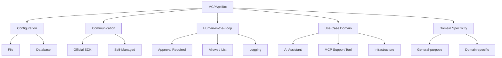

本記事は [An Empirical Study of Model Context Protocol Applications](https://arxiv.org/abs/2607.25635) の解説記事です。

## 論文概要

Majeed・Mahmoud・Nadi（2026）は、GitHub上の1,723のMCPアプリケーション（MCPApp）を対象に、外部ツール統合の実態を大規模に分析した実証研究である。著者らは、MCPサーバーの設定方法・SDK利用状況・人間による監視機構（Human-in-the-Loop）の3つの観点から体系的な分類法「MCPAppTax」を構築し、LLM支援パイプラインにより全データセットを分類した。その結果、ファイルベース設定（85.2%）や公式SDK利用（81.1%）では収束が見られる一方、設定ファイルの命名規則や人間監視メカニズムには標準化の欠如が明らかになった。とくに、ツール実行前にユーザー承認を必要とするアプリケーションは全体の37.2%にとどまり、セキュリティ上の懸念が浮き彫りとなった。

関連するZenn記事: [FastMCPで自作MCPサーバーをCI/CDログ調査エージェントに統合する実装手法](https://zenn.dev/0h_n0/articles/90a694ce3da46f)

## 情報源

- **論文**: Majeed, M.H.A., Mahmoud, M., & Nadi, S. (2026). "An Empirical Study of Model Context Protocol Applications." arXiv:2607.25635 [cs.SE].
- **データセット**: [https://figshare.com/s/1dc2ea96aca29038d99e](https://figshare.com/s/1dc2ea96aca29038d99e)
- **arXiv**: [https://arxiv.org/abs/2607.25635](https://arxiv.org/abs/2607.25635)

## 背景と動機

Model Context Protocol（MCP）は、2024年後半にAnthropicが導入したオープン標準であり、LLMを搭載したAIシステムが外部ツール・データソース・サービスと接続するための汎用インターフェースを定義する。JSON-RPC 2.0プロトコルに基づき、AIアプリケーションと外部リソースを疎結合にすることで、サードパーティライブラリの再利用と同様のエコシステムを実現する。

しかし、MCPサーバー側の研究（Toeppe et al., 2026; Hasan et al., 2025; Lin et al., 2025）が進む一方で、MCPサーバーを「依存関係」として利用するアプリケーション側（ホスト側）の実態は十分に調査されていなかった。著者らは、従来のパッケージマネージャー（npm、pip、Maven）のような標準化された規約がMCPエコシステムには存在せず、開発者がMCPサーバーを統合する際に「設定・通信・人間による監視に関する慣例がない」という問題を指摘している。

この背景から、著者らは「MCPAppはどのようにMCPサーバーを設定し利用しているのか」という主要リサーチクエスチョンを設定し、以下の3つのサブクエスチョンに分解して調査を行った。

- **RQ1**: MCPAppはMCPサーバーをどのように設定するか（設定ファイル vs データベース）
- **RQ2**: MCPAppはMCPサーバーとの通信をどのように管理するか（公式SDK vs 自前実装）
- **RQ3**: MCPAppはツール実行にどのようなHuman-in-the-Loopの制御を設けているか

## 主要な貢献

著者らは以下の4点を本研究の貢献として報告している。

- **大規模データセット（MCPAppDS）の構築**: GitHub上の21,355のリポジトリ候補から、46の検索クエリとフィルタリングを経て1,723のMCPアプリケーションを同定。LLM分類パイプラインの精度は96.7%と報告されている
- **MCPAppTax分類法の提案**: 設定方法（Configuration）・通信方式（Communication）・人間監視（HITL）の3次元に加え、ユースケースドメイン・ドメイン特化性の補助次元を持つ体系的な分類法を構築
- **エコシステムの実態解明**: ファイルベース設定（85.2%）やSDK利用（81.1%）では収束傾向が見られるが、設定ファイル命名（mcp.jsonは30.7%のみ）やHITL制御には大きなばらつきが存在することを実証
- **セキュリティ上のギャップの特定**: ツール実行前の承認ゲートを持たないアプリケーションが62.8%に達し、プロンプトインジェクションやツールポイズニング攻撃に対する脆弱性を指摘

## 技術的詳細

### MCPAppTax分類法の構造

著者らが構築したMCPAppTax分類法は、MCPアプリケーションを多次元的に特徴づけるための体系である。50のランダムサンプルに対する手動分析（2名の独立アノテーター、Krippendorfのα=0.82）から導出された。



### 分析手法

著者らのデータ収集・分析パイプラインは以下の手順で構成される。

1. **候補収集**: 17のリポジトリ検索クエリと29のコード検索クエリ（SDK import文やトランスポートパターン）をGitHubに対して実行し、21,355のリポジトリを取得
2. **フィルタリング**: 2024年1月以降の更新、10スター以上、10KB以上のサイズ条件を適用し、6,994候補に絞り込み
3. **手動アノテーション**: 68のリポジトリを層化無作為抽出し（信頼度90%、誤差幅10%）、2名の独立アノテーターが分類。MCPAppは21/68（30.9%）
4. **LLM分類**: gpt-5を用いてリポジトリをMCPApp・MCP Server・SDK・Documentation・Non-MCP-relevantの5カテゴリに分類。検証精度96.7%（29/30が正答）
5. **分類法適用**: gpt-5-miniを用いて1,723のMCPAppに対しMCPAppTaxの各次元を分類。全体精度98.3%

### 主要な定量結果

著者らが報告した主要な統計結果を以下に示す。

#### RQ1: 設定方式の分布（n=1,687）

| 設定方式 | 件数 | 割合 |
|---------|------|------|
| ファイルのみ | 1,290 | 76.5% |
| ファイル＋データベース | 148 | 8.8% |
| データベースのみ | 249 | 14.8% |
| **ファイル利用合計** | **1,438** | **85.2%** |

著者らは、設定ファイルを使用するリポジトリのうち69.1%がファイル名に「mcp」を含むと報告しているが、最も多い単一パターンであるmcp.jsonでも30.7%にとどまり、mcp_servers.json（12.8%）、mcp_config.jsonなど命名が分散している。この状況は、package.json（JavaScript）やpom.xml（Maven/Java）のような統一的な命名規則がMCPエコシステムにはまだ確立されていないことを示している。

#### RQ2: 通信方式の分布（n=1,710）

| 通信方式 | 件数 | 割合 |
|---------|------|------|
| 公式SDK | 1,386 | 81.1% |
| 自前実装（Self-Managed） | 324 | 18.9% |

公式SDKはTypeScript、Python、Java、Kotlin、C#、Swift、Rustの7言語に対応しており、大多数のアプリケーションがこれを利用している。一方、18.9%のアプリケーションはJSON-RPC 2.0メッセージの構築やトランスポートの初期化を独自に実装しており、仕様からの逸脱リスクを著者らは指摘している。

#### RQ3: Human-in-the-Loopメカニズム

| メカニズム | 実装あり | 実装なし | n | 実装率 |
|-----------|---------|---------|-----|-------|
| Logging | 1,557 | 157 | 1,714 | 90.8% |
| Allowed List | 1,325 | 392 | 1,717 | 77.2% |
| Approval Required | 638 | 1,076 | 1,714 | 37.2% |

3つのメカニズムの組み合わせについて、著者らは以下のように報告している（n=1,703）。

| 組み合わせ | 割合 |
|-----------|------|
| 3つすべて実装 | 32.3% |
| Logging＋Allowed List（承認なし） | 40.0% |
| アクティブゲートなし（LoggingのみまたはHITLなし） | 20.0% |
| HITLメカニズム一切なし | 3.5% |

#### ユースケースドメインの分布

著者らはMCPAppのユースケースドメインについても分類を行い、AIアシスタント（68.7%）が最多であり、MCP開発支援ツール（21.6%）、インフラストラクチャ（9.7%）が続くと報告している。ドメイン特化性については、汎用（59.5%）が最多で、ソフトウェア開発（15.8%）、セキュリティ（3.2%）、研究（1.9%）、金融（1.5%）と続く。

## 実装のポイント

本論文の知見から、MCPアプリケーション開発におけるベストプラクティスを以下に整理する。

### 1. 公式SDKの採用

著者らの調査では81.1%のアプリケーションが公式SDKを利用しており、これがデファクトスタンダードとなっている。自前実装（18.9%）はJSON-RPC 2.0仕様からの逸脱リスクがあるため、特段の理由がない限り公式SDKの利用が推奨される。TypeScript・Pythonに加え、Java・Kotlin・C#・Swift・Rustにも公式SDKが提供されている。

### 2. 設定ファイルの標準化

85.2%がファイルベースの設定を採用しているが、命名に統一性がない。mcp.json（30.7%）が最も一般的だが、今後のエコシステム標準化を見据えてmcp.jsonまたはプロジェクトに合致した一貫性のある命名を選択することが望ましい。

### 3. Human-in-the-Loopの実装

本論文で最も重要な知見の一つは、62.8%のアプリケーションがツール実行前の承認ゲートを持たないという事実である。著者らは、LLMがランタイムでツール呼び出しを決定する特性上、従来の静的解析可能なライブラリ依存関係とは異なり、ツール呼び出し時点が唯一の介入ポイントであると指摘している。プロンプトインジェクションやツールポイズニング攻撃を考慮すると、以下の3層の防御を実装することが推奨される。

- **Logging**（90.8%が実装済み）: 最低限のINFOレベルロギングで接続ライフサイクルとツール呼び出しを記録
- **Allowed List**（77.2%が実装済み）: サーバー・ツールの有効化/無効化制御を事前設定
- **Approval Required**（37.2%のみ実装）: ツール実行をブロックし、ユーザーの明示的な承認を要求

## 本番環境でのMCPアプリケーション構築ガイド

本論文の知見を踏まえ、AWSを活用した本番環境向けMCPアプリケーションの構築パターンを解説する。

### アーキテクチャ概要

本論文が指摘する「設定の標準化」「SDK採用」「Human-in-the-Loop」の3要素を満たす本番アーキテクチャとして、以下の2パターンを示す。

#### パターン1: サーバーレス構成（Lambda + Bedrock）

小〜中規模のMCPアプリケーション向け。MCPサーバーをLambda関数として実装し、BedrockをLLMバックエンドとして使用する構成である。

```hcl
# Terraform: Lambda + Bedrock MCP Application
# 2026年8月時点の構成例

resource "aws_lambda_function" "mcp_server" {
  function_name = "mcp-server-cicd-logs"
  runtime       = "python3.12"
  handler       = "main.handler"
  timeout       = 300
  memory_size   = 512

  environment {
    variables = {
      MCP_TRANSPORT    = "streamable-http"
      LOG_LEVEL        = "INFO"
      APPROVAL_MODE    = "blocking"  # 論文の知見: 承認ゲート必須
      ALLOWED_TOOLS    = "query_logs,get_build_status,list_pipelines"
    }
  }

  tracing_config {
    mode = "Active"  # X-Ray トレーシング有効化
  }
}

resource "aws_lambda_function_url" "mcp_endpoint" {
  function_name      = aws_lambda_function.mcp_server.function_name
  authorization_type = "AWS_IAM"

  cors {
    allow_origins = ["https://app.example.com"]
    allow_methods = ["POST"]
  }
}

# Bedrock モデルアクセス
resource "aws_iam_role_policy" "bedrock_access" {
  name = "bedrock-mcp-app-policy"
  role = aws_iam_role.mcp_app_role.id

  policy = jsonencode({
    Version = "2012-10-17"
    Statement = [
      {
        Effect = "Allow"
        Action = [
          "bedrock:InvokeModel",
          "bedrock:InvokeModelWithResponseStream"
        ]
        Resource = "arn:aws:bedrock:us-east-1::foundation-model/anthropic.claude-sonnet-4-20250514"
      }
    ]
  })
}

# CloudWatch Logs（論文の知見: 90.8%がLogging実装）
resource "aws_cloudwatch_log_group" "mcp_logs" {
  name              = "/aws/lambda/mcp-server-cicd-logs"
  retention_in_days = 30
}

# 承認ゲート用 DynamoDB（論文の知見: Approval Required）
resource "aws_dynamodb_table" "approval_queue" {
  name         = "mcp-approval-queue"
  billing_mode = "PAY_PER_REQUEST"
  hash_key     = "request_id"
  range_key    = "created_at"

  attribute {
    name = "request_id"
    type = "S"
  }

  attribute {
    name = "created_at"
    type = "S"
  }

  ttl {
    attribute_name = "expires_at"
    enabled        = true
  }
}
```

#### パターン2: コンテナ構成（EKS + Karpenter）

大規模・高可用性が求められるMCPアプリケーション向け。複数のMCPサーバーをPodとしてデプロイし、Karpenterで自動スケーリングを行う。主要な構成要素は以下の通りである。

- **EKSクラスタ**: terraform-aws-modules/eks/awsモジュール（v20系）でクラスタバージョン1.31を構築。システムノードグループにm7i.largeを2〜4台配置
- **Karpenter NodePool**: MCPサーバーPod用にon-demand/spotのm7i.medium〜xlarge範囲で自動プロビジョニング。CPU上限100コア、メモリ上限200GiB。consolidationPolicyをWhenEmptyOrUnderutilizedに設定し、30秒後に未使用ノードを統合

### 規模別コスト見積もり（2026年8月時点）

以下は、MCPアプリケーションの規模別月額コスト概算である。us-east-1リージョンの2026年8月時点の公開料金に基づく推定値であり、実際の利用状況により変動する。

| 構成要素 | Small（Lambda） | Medium（ECS） | Large（EKS+Karpenter） |
|---------|----------------|--------------|----------------------|
| コンピュート | $25/月 | $150/月 | $800/月 |
| | Lambda 100万リクエスト | Fargate 2タスク常時 | EKS 4ノード |
| LLMバックエンド | $50/月 | $300/月 | $2,000/月 |
| | Bedrock 従量課金 | Bedrock 従量課金 | Bedrock Provisioned |
| ストレージ・DB | $5/月 | $30/月 | $100/月 |
| | DynamoDB On-Demand | RDS db.t4g.micro | RDS db.r7g.large |
| モニタリング | $10/月 | $50/月 | $200/月 |
| | CloudWatch基本 | CloudWatch+X-Ray | Prometheus+Grafana |
| 承認ゲート | $2/月 | $10/月 | $30/月 |
| | DynamoDB+SNS | SQS+Step Functions | カスタムワークフロー |
| **月額合計** | **約$92/月** | **約$540/月** | **約$3,130/月** |

### モニタリング設定

本論文でLoggingが90.8%のアプリケーションで実装されていると報告されているように、MCPアプリケーションの可観測性は重要である。CloudWatchベースのモニタリングでは、以下の3つのメトリクスを中心にダッシュボードを構成することが推奨される。

- **Tool Invocations per Minute**: MCPツール呼び出し頻度の監視。カスタムメトリクス（`MCPApp/Production`名前空間）で1分間隔のSum統計を取得
- **Approval Latency (p99)**: 承認ゲートの応答時間。5分間隔のp99統計でボトルネックを検出
- **Blocked Approvals Count**: ユーザーが拒否したツール呼び出しの回数。異常な増加はプロンプトインジェクションの兆候となりうる

CloudWatch Alarmは、ツール呼び出しエラーが5分間で10回を超過した場合にSNSトピックへ通知する設定が基本となる。

### コスト最適化チェックリスト

本番環境でMCPアプリケーションを運用する際のコスト最適化ポイントを、本論文の知見と合わせて整理する。

- **コンピュート最適化**: Lambda関数のメモリサイズとタイムアウトを実測に基づいて調整する。EKS構成ではKarpenterのconsolidationPolicyを活用し、未使用ノードを自動的に削減する
- **LLMコスト管理**: Bedrockのキャッシュ機能を活用し、同一プロンプトパターンのコストを削減する。トークン使用量のモニタリングとアラートを設定し、予期しないコスト増加を防止する
- **Allowed List（77.2%が実装）の活用**: 不要なツールを無効化することで、LLMの誤ったツール呼び出しによる不要なコンピュートコストを削減する
- **Logging最適化**: 全ツール呼び出しのログを保持しつつ、CloudWatch Logsの保持期間（retention）を適切に設定する。低頻度アクセスのログはS3 Glacier Deep Archiveへの移行を検討する
- **Spot活用**: EKS構成でKarpenterのcapacity-typeにspotを含めることで、非クリティカルなMCPサーバーPodのコストを削減する

## 実験結果

### データセット構築の精度

著者らは、LLMベースの分類パイプラインの精度を複数の段階で検証している。リポジトリ分類では68件の手動アノテーションに対してMCPAppの適合率（precision）1.000、再現率（recall）0.905、F1スコア0.950と報告されている。分類法の適用精度は、50件の手動分析に対して全体98.3%（次元別では95.8%〜100.0%）、追加検証の30件に対して96.5%（次元別では93.1%〜100%）と報告されている。

### エコシステムの収束と分散

著者らは、MCPエコシステムにおいて「収束が見られる領域」と「分散が残る領域」を明確に区別している。

**収束（標準化が進行中）**:
- ファイルベース設定: 85.2%が採用
- 公式SDK利用: 81.1%が採用
- Logging: 90.8%が実装

**分散（標準化が不足）**:
- 設定ファイル命名: mcp.jsonは30.7%のみ。mcp_servers.json（12.8%）、mcp_config.jsonなど多数の変種が存在
- 自前実装: 18.9%がJSON-RPC 2.0を独自実装しており、仕様準拠性の検証が必要
- 承認ゲート: 62.8%がツール実行前の承認を要求しない

### セキュリティリスクの定量化

著者らは、HITLメカニズムの組み合わせ分析から、20.0%のアプリケーションがAllowed ListもApproval Requiredも持たない（アクティブゲートなし）ことを報告している。そのうち3.5%はLoggingすら実装していない。従来のライブラリ依存関係であれば静的解析や脆弱性データベースによる事前スクリーニングが可能だが、MCPではLLMがランタイムでツール呼び出しを決定するため、ツール呼び出し時点が唯一の介入ポイントとなる。この構造的差異が、承認ゲートの重要性を高めていると著者らは指摘している。

## 実運用への応用

本論文の知見は、MCPアプリケーションの実運用に直接的な示唆を与える。関連するZenn記事「[FastMCPで自作MCPサーバーをCI/CDログ調査エージェントに統合する実装手法](https://zenn.dev/0h_n0/articles/90a694ce3da46f)」で解説されているFastMCPベースのMCPサーバー実装と組み合わせることで、以下の改善が考えられる。

**設定の標準化**: FastMCPで構築したCI/CDログ調査サーバーの設定ファイルをmcp.json形式で標準化し、他のMCPアプリケーションからの統合を容易にする。本論文の調査では69.1%がファイル名に「mcp」を含むパターンを採用しており、この慣例に従うことでエコシステムとの互換性が向上する。

**承認ゲートの実装**: CI/CDパイプラインのデータにアクセスするMCPサーバーでは、ツール実行前の承認ゲートが重要である。本論文では62.8%のアプリケーションが承認ゲートを持たないことが報告されているが、本番環境のCI/CDデータを扱う場合はブロッキング承認を必須とすべきである。FastMCPのミドルウェア機構を活用し、ツール呼び出し前にユーザー承認を要求するインターセプターを実装することが推奨される。

**Logging強化**: 本論文で90.8%が実装済みと報告されているLoggingは最低限の可観測性を提供するが、構造化ログ（JSON形式）でツール名・引数・実行結果・レイテンシを記録し、CloudWatchやDatadogなどの集中ログ基盤に送信することで、運用品質をさらに高められる。

## 関連研究

MCPに関する実証研究は急速に増加している。Toeppe et al.（2026）は2,297のGitHubリポジトリを対象にMCP実装のデータセットを構築したが、サーバー側に焦点を当てており、アプリケーション側の統合パターンは調査していない。Lin et al.（2025）のMCPCorpusは約14,000のMCPサーバーと300のクライアントを含むが、主にレジストリ（mcp.so）をソースとしており、ソースコードマイニングによるアプリケーション分析は限定的である。Guo et al.（2025）は8,060のMCPサーバーと341のクライアントを分析し、stdioが支配的なトランスポートであることを報告しているが、設定・通信・HITLの詳細は扱っていない。

セキュリティの観点では、Hou et al.（2025）がMCPのセキュリティ脅威を体系化し、Huang et al.（2026）がSTRIDE/DREADモデルによる脅威分析を7つのMCPApp（Claude Desktop、Cursor、Cline等）に対して実施している。Stein（2026）は177,436のMCPツールを分析し、外部環境を直接変更するアクションツールの割合が27%から65%に増加したと報告しており、承認ゲートの必要性が時間とともに高まっていることを示唆している。

## まとめと今後の展望

本論文は、GitHub上の1,723のMCPアプリケーションを対象とした大規模実証分析であり、MCPエコシステムの実態を定量的に明らかにした重要な研究である。ファイルベース設定（85.2%）と公式SDK利用（81.1%）では収束が見られる一方、設定ファイル命名の標準化と承認ゲートの普及が今後の課題として浮き彫りになった。

とりわけ、62.8%のアプリケーションがツール実行前の承認を必要としないという知見は、MCPエコシステムの安全性に関する警鐘として重要である。LLMによるランタイムのツール選択という特性上、従来のパッケージマネージャーのような静的な依存関係管理では対応できない新たなセキュリティ課題が存在する。今後は、MCPの設定ファイル命名の標準化、パッケージマネージャーに相当する依存関係管理インフラの整備、そして承認ゲートの標準化が必要とされるだろう。

## 参考文献

1. Majeed, M.H.A., Mahmoud, M., & Nadi, S. (2026). "An Empirical Study of Model Context Protocol Applications." arXiv:2607.25635 [cs.SE]. [https://arxiv.org/abs/2607.25635](https://arxiv.org/abs/2607.25635)
2. Anthropic. (2024). "Model Context Protocol." [https://modelcontextprotocol.io/](https://modelcontextprotocol.io/)
3. Toeppe, K., et al. (2026). "A large-scale dataset of MCP implementations on GitHub."
4. Lin, Y., et al. (2025). "A Large-Scale Evolvable Dataset for Model Context Protocol Ecosystem and Security Analysis."
5. Guo, Z., et al. (2025). "A Measurement Study of Model Context Protocol."
6. Hasan, M., et al. (2025). "Model Context Protocol (MCP) at First Glance: Studying the Security and Maintainability of MCP Servers."
7. Hou, X., et al. (2025). "Model Context Protocol (MCP): Landscape, Security Threats, and Future Research Directions."
8. Huang, S., et al. (2026). "Model Context Protocol Threat Modeling and Analysis of Vulnerabilities to Prompt Injection with Tool Poisoning."
9. Stein, G. (2026). "How are AI agents used? Evidence from 177,000 MCP tools."
10. Singh, A., et al. (2025). "A Survey of the Model Context Protocol (MCP): Standardizing Context to Enhance Large Language Models (LLMs)."
