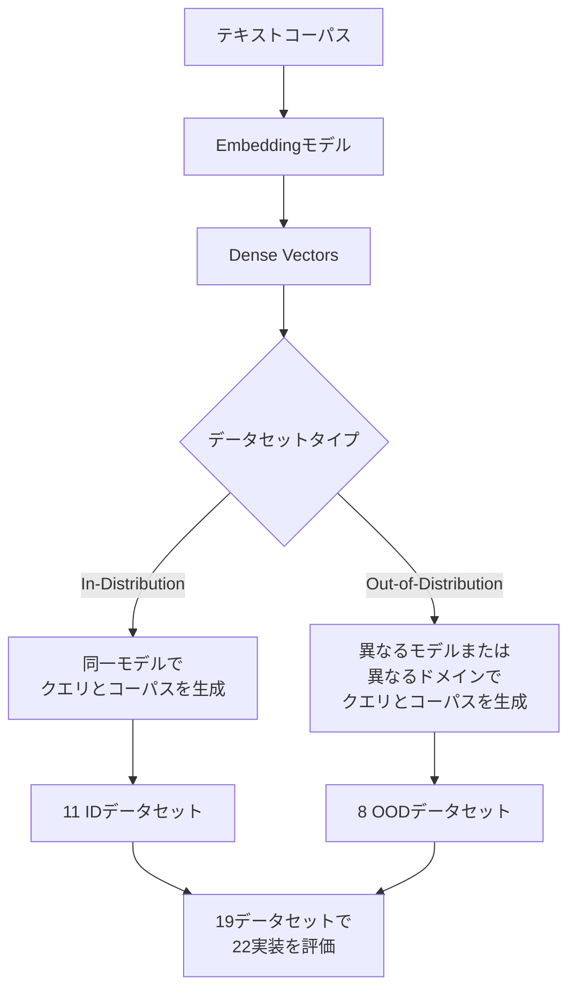

本記事は [arXiv:2505.17810](https://arxiv.org/abs/2505.17810) の解説記事です。

## 論文概要（Abstract）

「VIBE: Vector Index Benchmark for Embeddings」は、近似最近傍（ANN）検索のベンチマーク手法を現代のEmbeddingモデルに対応させるために設計されたオープンソースフレームワークである。VecDB@VLDB2026ワークショップで発表された。著者らは、既存ベンチマーク（ANN-Benchmarks等）のデータセットが現代のANNアプリケーション（特にRAG）を代表していない問題を指摘し、最新のdense embeddingモデルで生成されたデータセット、およびクエリとコーパスの分布が異なるOOD（Out-of-Distribution）データセットを含む新たなベンチマークを提案している。22種のオープンソースベクトルインデックス実装を19データセット（11 in-distribution + 8 OOD）で評価した包括的な分析を報告している。

この記事は [Zenn記事: サーバーレスベクトルDB選定2026：5サービスの課金・性能・コスト比較](https://zenn.dev/0h_n0/articles/bc0d17d1fe8b8a) の深掘りです。

## 情報源

- **arXiv ID**: 2505.17810
- **URL**: [https://arxiv.org/abs/2505.17810](https://arxiv.org/abs/2505.17810)
- **著者**: Elias Jääsaari, Ville Hyvönen, Matteo Ceccarello, Teemu Roos, Martin Aumüller
- **発表年**: 2025（初版）/ 2026（改訂版、VLDB 2026ワークショップ）
- **分野**: cs.LG（機械学習）、cs.IR（情報検索）
- **コード**: [https://github.com/vector-index-bench/vibe](https://github.com/vector-index-bench/vibe)

## 背景と動機（Background & Motivation）

ANN検索は、ベクトルデータベースの中核技術であり、RAGパイプラインやレコメンドシステムの検索性能に直接影響する。しかし、広く使われているANN-Benchmarksのデータセットは、GloVe（2014年）やFashion-MNIST（2017年）など古い時代のものが多く、現代のEmbeddingモデル（OpenAI text-embedding-3、Cohere embed-v3、BGE-M3等）が生成する768-3072次元のベクトルとは特性が大きく異なる。

著者らが指摘する具体的な問題は3つある：

1. **次元数のミスマッチ**: ANN-Benchmarksの主要データセットは25-960次元だが、2024年以降のEmbeddingモデルは768-3072次元が主流
2. **分布の違い**: 古いデータセットは均一な分布を持つが、RAG用途のEmbeddingはドメイン固有の偏りを持つ
3. **OODシナリオの欠如**: 実運用ではクエリとコーパスの分布が異なる（例: ユーザーの質問文 vs 技術文書のEmbedding）ケースが一般的だが、既存ベンチマークはin-distribution前提

## 主要な貢献（Key Contributions）

- **貢献1**: 現代のdense embeddingモデルを用いたベンチマークデータセット生成パイプラインを構築し、RAGアプリケーションに直結するデータセットを提供した
- **貢献2**: クエリとコーパスの分布が異なるOODデータセット（マルチモーダル検索、MIPS、近似Attention計算等）を体系的に整備した
- **貢献3**: 22種のオープンソースベクトルインデックス実装を19データセットで評価し、インデックス特性とデータセット特性の交互作用を明らかにした

## 技術的詳細（Technical Details）

### ベンチマークデータセットの設計

VIBEのデータセット生成パイプラインは、以下の構成をとる：



#### In-Distribution（ID）データセット（11種）

同一のEmbeddingモデルでクエリとコーパスの両方を生成する。モデルには2024-2025年の主要なモデルが使用されており、以下のような次元数・距離指標のバリエーションを含む：

- **コサイン類似度**: 768-3072次元、正規化済みベクトル
- **内積（MIPS）**: 非正規化ベクトルでの最大内積検索
- **L2距離**: ユークリッド距離での最近傍検索

#### Out-of-Distribution（OOD）データセット（8種）

OODデータセットは実運用でより重要となるシナリオをカバーする：

1. **マルチモーダル検索**: テキストクエリで画像コーパスを検索（CLIPモデル等）。クエリとコーパスのEmbedding分布が根本的に異なる
2. **MIPS（Maximum Inner Product Search）**: 非正規化ベクトルでの検索。Attention計算の近似やmulti-vector検索の還元に使用される
3. **近似Attention計算**: Transformerの自己注意機構を近似するためのANN検索。クエリ（Q）とキー（K）の分布特性が異なる

### 評価指標

VIBEでは以下の指標でベクトルインデックスを評価する：

$$
\text{Recall}@k = \frac{|S_{\text{approx}}(q, k) \cap S_{\text{exact}}(q, k)|}{k}
$$

ここで、$S_{\text{approx}}(q, k)$はANN検索で返された上位$k$件、$S_{\text{exact}}(q, k)$は正確な最近傍$k$件である。

スループット（QPS: Queries Per Second）とRecall@kのトレードオフ曲線が主要な評価軸となる。パラメータを変化させて得られるパレートフロント（Pareto front）が、各インデックスの実力を示す。

$$
\text{Pareto Front} = \{(r, q) \mid \nexists (r', q') : r' \geq r \land q' > q\}
$$

ここで$r$はRecall@k、$q$はQPSである。

### 評価対象の22実装

著者らは22種のオープンソースベクトルインデックス実装を評価している。主要なカテゴリと代表的な実装：

| カテゴリ | 実装例 | 主なアルゴリズム |
|---------|--------|---------------|
| グラフ系 | hnswlib, Vamana, Glass, PyNNDescent | HNSW, Vamana, NSW |
| IVF系 | FAISS-IVF, ScaNN | IVF-PQ, IVF-Flat |
| ツリー系 | Annoy | ランダム射影ツリー |
| 量子化系 | FAISS-PQ, RaBitQ | Product Quantization |
| ハイブリッド | FAISS-IVF-PQ, cuVS | IVF + PQ + GPU |

### 主要な実験結果

著者らの評価から得られた重要な知見：

**IDデータセットでの傾向:**

グラフ系インデックス（特にhnswlib、Glass）がRecall-QPSのパレートフロントで一貫して上位に位置する。高次元（1024-3072dim）になるほどこの傾向が強まる。IVF系は中程度の次元数（256-768dim）で競争力がある。

**OODデータセットでの傾向:**

OODデータセットでは、IDデータセットで観測された性能ランキングが大きく変動することが報告されている。特にマルチモーダル検索では、クエリ分布に適応できないインデックスの性能が大幅に低下する。この知見は、ベクトルDBの選定時に自社データでのベンチマークが不可欠であることを示唆している。

**量子化の影響:**

Product Quantization（PQ）を併用した場合、メモリ使用量を大幅に削減できるが、Recallへの影響はデータセットによって異なる。高次元データではPQのRecall低下が小さく、低次元データでは相対的に大きい。

**MIPS vs コサイン類似度:**

MIPS（Maximum Inner Product Search）は、ベクトルが非正規化の場合にコサイン類似度への変換（正規化→内積）では対応できないケースがある。著者らは、MIPSを直接サポートするインデックス（ScaNN等）がこのシナリオで優位であることを報告している。

```python
import numpy as np

def cosine_to_mips_transform(vectors: np.ndarray) -> np.ndarray:
    """コサイン類似度用ベクトルをMIPS用に変換する

    論文の知見: この変換は非正規化ベクトルでは精度が低下する場合がある。
    MIPSが必要な場合はネイティブMIPSサポートのインデックスを推奨。

    Args:
        vectors: 正規化済みベクトル (n, d)

    Returns:
        MIPS用に拡張されたベクトル (n, d+1)
    """
    norms = np.linalg.norm(vectors, axis=1, keepdims=True)
    max_norm = np.max(norms)

    extra_dim = np.sqrt(max_norm**2 - norms**2)
    transformed = np.hstack([vectors, extra_dim])
    return transformed
```

## 実装のポイント（Implementation）

VIBEフレームワークを用いた自社データでのベンチマーク実施手順を示す。

```python
from typing import Protocol

import numpy as np


class VectorIndex(Protocol):
    """VIBEのベクトルインデックスインターフェース"""

    def build(self, vectors: np.ndarray, **params: object) -> None: ...
    def query(self, queries: np.ndarray, k: int) -> np.ndarray: ...


def evaluate_recall_at_k(
    index: VectorIndex,
    queries: np.ndarray,
    ground_truth: np.ndarray,
    k: int = 10,
) -> float:
    """Recall@kを計算する

    Args:
        index: 評価対象のベクトルインデックス
        queries: クエリベクトル (n_queries, dim)
        ground_truth: 正確な最近傍のインデックス (n_queries, k)
        k: 評価する上位件数

    Returns:
        平均Recall@k値
    """
    results = index.query(queries, k)
    recalls = []
    for i in range(len(queries)):
        gt_set = set(ground_truth[i, :k])
        result_set = set(results[i, :k])
        recalls.append(len(gt_set & result_set) / k)
    return float(np.mean(recalls))


def run_pareto_sweep(
    index_class: type,
    corpus: np.ndarray,
    queries: np.ndarray,
    ground_truth: np.ndarray,
    param_grid: list[dict],
    k: int = 10,
) -> list[tuple[float, float]]:
    """パレートフロントを生成するためのパラメータスイープ

    Args:
        index_class: ベクトルインデックスクラス
        corpus: コーパスベクトル
        queries: クエリベクトル
        ground_truth: 正確な最近傍
        param_grid: パラメータの組み合わせリスト
        k: 評価上位件数

    Returns:
        (recall, qps)のリスト
    """
    import time

    results = []
    for params in param_grid:
        index = index_class()
        index.build(corpus, **params)

        start = time.perf_counter()
        _ = index.query(queries, k)
        elapsed = time.perf_counter() - start
        qps = len(queries) / elapsed

        recall = evaluate_recall_at_k(index, queries, ground_truth, k)
        results.append((recall, qps))

    return results
```

ベンチマーク実施時の注意点として、著者らは以下を強調している：

- **データセット選択**: 自社のEmbeddingモデルと同じモデルで生成されたデータセットを使用すること。VIBEのパイプラインで自社データを変換することも可能
- **OOD評価の重要性**: RAGシステムではクエリ（ユーザーの質問）とコーパス（文書のEmbedding）の分布が異なるため、ID評価だけでは不十分
- **再現性**: VIBEの結果はすべてオープンソースコードで再現可能。ベンダー公称値ではなく独立検証が推奨される

## 実運用への応用（Practical Applications）

VIBEの知見は、Zenn記事で比較した5つのサーバーレスベクトルDBの選定に直接活用できる。

**ベンチマーク選択への影響**: Zenn記事で言及したVDBBenchは主にマネージドサービスのコスト・スループットを評価するが、VIBEはインデックスアルゴリズムレベルの性能を評価する。両者を組み合わせることで、アルゴリズム特性（VIBE）とサービス運用コスト（VDBBench）の両面から選定が可能になる

**OODシナリオの実務的意味**: RAGシステムを構築する場合、ユーザーのクエリ文と知識ベースの文書は分布が異なる。VIBEの知見によれば、IDベンチマークで上位のインデックスがOODで大幅に順位を落とすケースがある。自社のRAGパイプラインで実際のクエリ・文書ペアを使ったベンチマークが不可欠である

**インデックスアルゴリズムの選択**: グラフ系（hnswlib）が多くのデータセットでパレートフロントの上位を占めるが、メモリ制約がある場合はIVF-PQ系が有力。量子化による精度低下は高次元データで相対的に小さいため、1536次元以上のEmbeddingモデルを使用する場合はPQ併用の影響が限定的である

## 関連研究（Related Work）

- **ANN-Benchmarks (Aumüller et al., 2020)**: VIBEの前身となるベンチマークフレームワーク。著者の一部が共通しており、VIBEはANN-Benchmarksの方法論を現代のEmbeddingモデルに拡張したものと位置づけられる
- **Big-ANN-Benchmarks (NeurIPS 2023 Competition)**: 大規模ANN検索の競技型ベンチマーク。フィルタ検索・ストリーミング検索・OOD検索などの特化トラックを含む
- **VDBBench (Zilliz, 2026)**: マネージドベクトルDBのコスト・性能を評価するオープンソースベンチマーク。VIBEがアルゴリズムレベル、VDBBenchがサービスレベルの評価を担う相補的な関係にある

## まとめと今後の展望

VIBEは、ベクトルインデックスのベンチマークを現代のAIアプリケーション（特にRAG）の要求に合わせて再設計したフレームワークである。OODデータセットの導入により、実運用環境でのインデックス性能を予測する精度が向上する。サーバーレスベクトルDBの選定においては、ベンダーの公称ベンチマーク値だけでなく、VIBEやVDBBenchのようなオープンソースツールを用いた自社データでの独立検証が、コストと性能の最適なバランスを見つけるために不可欠である。

## 参考文献

- **arXiv**: [https://arxiv.org/abs/2505.17810](https://arxiv.org/abs/2505.17810)
- **Code**: [https://github.com/vector-index-bench/vibe](https://github.com/vector-index-bench/vibe)
- **Related Zenn article**: [https://zenn.dev/0h_n0/articles/bc0d17d1fe8b8a](https://zenn.dev/0h_n0/articles/bc0d17d1fe8b8a)
