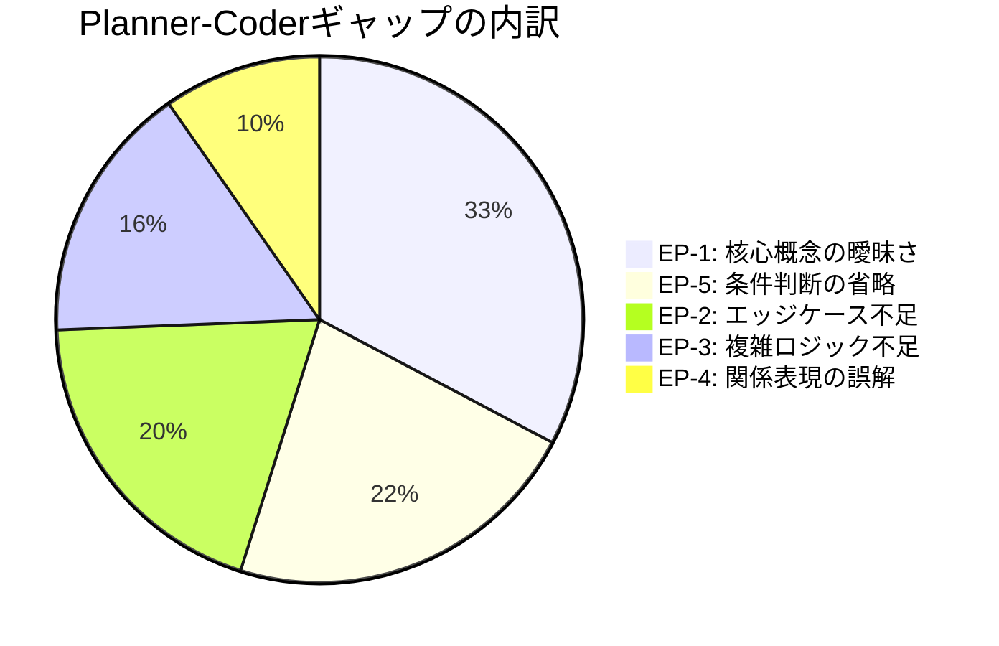
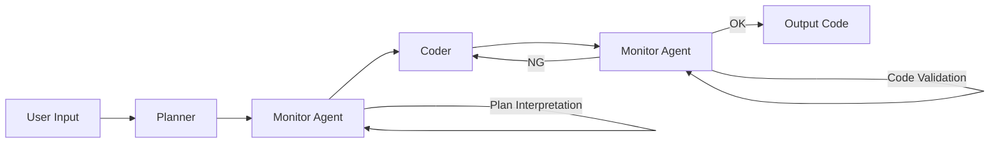

本記事は [Understanding and Bridging the Planner-Coder Gap: A Systematic Study on the Robustness of Multi-Agent Systems for Code Generation (arXiv:2510.10460)](https://arxiv.org/abs/2510.10460) の解説記事です。

## 論文概要（Abstract）

本論文は、マルチエージェントシステム（MAS）によるコード生成において、意味的に等価な入力の変形が性能に大幅な低下を引き起こす**頑健性の脆弱性**を実証した研究である。著者らは変異ベーステスト手法を用いて、3つのMAS（SCCG, MetaGPT, PairCoder）を4つのデータセットで評価し、7.9%〜83.3%の性能低下を発見した。失敗の75.3%は「Planner-Coderギャップ」——計画エージェントが生成する不十分な計画を実装エージェントが誤解釈する情報損失——に起因すると報告している。

この記事は [Zenn記事: Claude Codeサブエージェント設計パターン：3層マルチエージェントの実装手法](https://zenn.dev/0h_n0/articles/0c54d57a86a4a6) の深掘りです。

## 情報源

- **arXiv ID**: 2510.10460
- **URL**: [https://arxiv.org/abs/2510.10460](https://arxiv.org/abs/2510.10460)
- **著者**: Zongyi Lyu, Songqiang Chen, Zhenlan Ji, Liwen Wang, Shuai Wang, Daoyuan Wu, Wenxuan Wang, Shing-Chi Cheung
- **発表年**: 2025（v1: 2025年10月、v2: 2026年1月改訂）
- **分野**: cs.SE, cs.AI

## 背景と動機（Background & Motivation）

Zenn記事で紹介されている「計画・生成・評価」3分離パターンでは、Plannerが「何を」「なぜ」を決定し、Generatorがそれに基づいて実装する。この分離は、Anthropicが推奨するコンテキスト汚染の防止策として有効だが、計画と実装の間で**情報が失われる**リスクがある。

本論文はこの問題を初めて体系的に調査したものである。従来のマルチエージェントコード生成研究が「最終的なコードの品質」に焦点を当てていたのに対し、著者らは「入力の言い換えに対する頑健性」と「エージェント間の情報伝達の忠実度」に注目している。

## 主要な貢献（Key Contributions）

- **変異ベーステスト手法の導入**: 意味を保持しつつ表現を変化させる4つの変異オペレータ（Rephrase、Insert、Expand、Condense）を設計し、99.2%の意味保持率を達成
- **Planner-Coderギャップの特定と分類**: 失敗の75.3%がこのギャップに起因し、5つのエラーパターンに分類
- **修復手法の提案と評価**: マルチプロンプト生成とモニターエージェント挿入により、40.0%〜88.9%の修復率を達成

## 技術的詳細（Technical Details）

### 変異ベースファジング

著者らは意味的に等価な入力バリアントを生成する4つの変異オペレータを設計した：

| オペレータ | 機能 | 例 |
|-----------|------|-----|
| **Rephrase** | 代替語彙で文を書き換え | 「配列をソートせよ」→「リストを昇順に並べよ」|
| **Insert** | 文脈に関連する文を追加 | 「数を返す」→「数を返す。なお入力は正の整数」|
| **Expand** | 1文を2文に分割 | 「AしてBする」→「まずAする。次にBする」|
| **Condense** | 連続する文を接続詞で統合 | 「Aする。Bする。」→「Aし、次にBする」|

手動検証で99.2%の意味保持率、自動計測で98.4%の意味類似度を達成している。

### 適応度関数

著者らは変異の選択に新しい2成分報酬関数を使用する：

$$
R = R_{\text{code}} + \alpha \cdot R_{\text{plan}}
$$

ここで、
- $R_{\text{code}}$: 元の問題と変異問題のPass率の差分（変異による性能低下が大きいほど高スコア）
- $R_{\text{plan}}$: 埋め込み空間における中間計画の意味的ドリフト（計画の変化度合い）
- $\alpha$: バランス係数

### Planner-Coderギャップの5つのエラーパターン

著者らは700以上の失敗事例から20%をサンプリングし（Cohen's Kappa = 0.88）、以下の5パターンを特定した（論文Table 3より）：



| パターン | 割合 | 説明 | 具体例 |
|---------|------|------|--------|
| **EP-1**: 核心概念の曖昧さ | 32.7% | 計画内の用語が曖昧 | 「重複を除去」の定義が不明確 |
| **EP-2**: エッジケース不足 | 19.5% | 処理仕様の不足 | 空入力・境界値の扱い未定義 |
| **EP-3**: 複雑ロジック不足 | 15.9% | 具体的説明の欠如 | 再帰的処理の展開が不明 |
| **EP-4**: 関係表現の誤解 | 9.7% | 量・空間関係の誤読 | 「最大3つまで」の解釈ずれ |
| **EP-5**: 条件判断の省略 | 22.1% | ロジックパスの省略 | if-else分岐の一方が未定義 |

### 性能低下の実測値

3つのMASを4つのデータセットで評価した結果（論文Table 1-2より）：

| MAS | バックエンドLLM | MBPP | HumanEval | CodeContest | CoderEval |
|-----|---------------|------|-----------|-------------|-----------|
| SCCG | GPT-3.5 | -32.1% | -47.2% | -75.0% | -83.3% |
| SCCG | GPT-4o | -18.5% | -28.6% | -50.0% | -61.1% |
| MetaGPT | GPT-3.5 | -25.3% | -38.9% | -66.7% | -72.2% |
| PairCoder | GPT-4o | -7.9% | -14.3% | -33.3% | -44.4% |

複雑なデータセット（CodeContest、CoderEval）ほど性能低下が大きい傾向がある。

## 修復手法の提案

### コンポーネント1: マルチプロンプト生成

$k=2$の意味的等価な代替表現を生成し、オリジナルと合わせて$k+1=3$パターンの入力でMASを実行する。各バリアントに$n/(k+1)$回の実行を割り当て、複数の解釈パスを探索する。

### コンポーネント2: モニターエージェント

Plannerと Coderの間にMonitorエージェントを挿入し、2つのタスクを遂行する：

**計画解釈（Plan Interpretation）**:
- 核心概念の明確化（EP-1対策）
- エッジケースの例示（EP-2対策）
- 詳細なロジックフローの提供（EP-3対策）
- 関係表現の解釈（EP-4対策）
- 条件分岐の明示（EP-5対策）

**コード検証（Code Validation）**:
- 解釈された計画とコードの意味的整合性を検証
- 不整合検出時は再生成を要求
- 動的実行ではなく静的検査を使用



### 修復効果

著者らが報告する修復率（論文Table 4より）：

| MAS | HumanEval | MBPP | CodeContest |
|-----|-----------|------|-------------|
| SCCG | 81.8% | 75.0% | 78.6% |
| MetaGPT | 88.9% | 55.6% | 66.7% |
| PairCoder | 75.0% | 40.9% | 57.1% |

エラーパターン別では80.0%〜100.0%の修復率を達成しており、特にEP-1（核心概念の曖昧さ）に対する効果が高いと報告されている。

### アブレーション研究

各コンポーネントの寄与（論文Table 5より）：

- **Plan Interpretation除去**: 抽象的な計画を生成するMetaGPTで性能低下が顕著
- **Multi-prompt除去**: 明確な計画を生成するPairCoderで性能低下が顕著
- **Code Check除去**: 全体の約40%の能力を喪失

### 計算オーバーヘッド

HumanEvalでGPT-3.5を使用した場合の時間コスト（論文Section 6.3より）：

- オリジナルMAS: 10.9〜16.4秒
- 修復手法適用後: 13.6〜20.1秒
- モニターエージェントの追加コスト: 2.7〜3.7秒

## 実装のポイント（Implementation）

### Claude Codeの「計画・生成・評価」パターンへの示唆

本論文の知見は、Zenn記事で紹介されている3分離パターンに直接的な改善指針を提供する：

1. **Plannerの出力仕様を厳格化する**: EP-1（32.7%）が最大の失敗原因であることから、計画ファイルの出力フォーマットでは曖昧な用語を排除し、各操作の入出力を明示する

```yaml
# ❌ 曖昧な計画
- action: "重複を除去"
  target: "リスト"

# ✅ 明確な計画（EP-1対策）
- action: "連続する同一要素を1つに集約"
  target: "sorted_list: list[int]"
  input_type: "ソート済み整数リスト"
  output_type: "連続重複を除去した整数リスト"
  edge_cases:
    - "空リスト → 空リストを返す"
    - "全要素同一 → 要素1つのリストを返す"
```

2. **Evaluatorにモニター機能を組み込む**: 本論文のMonitorエージェントは、計画と実装の間に挿入されるが、Claude Codeの3分離パターンではEvaluatorにこの検証機能を統合できる。Evaluatorのシステムプロンプトに「計画ファイルの各項目と実装の対応を検証する」指示を追加する

3. **フィードバックループの上限を設定する**: 著者らの修復手法は最大3ラウンドの再生成を許容しており、これはZenn記事のGeneratorとEvaluator間の「最大3回」制限と一致する

### モニターエージェントの実装例

```python
from dataclasses import dataclass


@dataclass
class PlanItem:
    """計画の1ステップ"""
    action: str
    target: str
    input_type: str
    output_type: str
    edge_cases: list[str]


def monitor_plan_interpretation(
    raw_plan: str,
    original_requirement: str,
) -> list[PlanItem]:
    """計画の曖昧さを検出し、明確化する（Plan Interpretation）

    EP-1〜EP-5の各エラーパターンに対応する検証を実施する。
    """
    raise NotImplementedError


def monitor_code_validation(
    interpreted_plan: list[PlanItem],
    generated_code: str,
) -> tuple[bool, str]:
    """実装が解釈済み計画と意味的に整合しているか検証する

    Returns:
        (is_valid, feedback): 整合していればTrue、
        不整合の場合はFalseと具体的なフィードバック
    """
    raise NotImplementedError
```

## 実運用への応用（Practical Applications）

本論文の知見を実運用に適用する際の主なポイント：

- **入力の多様性テスト**: 意味的に等価な入力バリアントでシステムをテストし、頑健性を検証する手法は、CI/CDパイプラインに組み込める
- **計画品質メトリクスの導入**: 計画エージェントの出力品質を、後続のコード生成成功率だけでなく、5つのエラーパターンの発生率で評価する
- **モデル選択の指針**: GPT-4oはGPT-3.5に比べて全データセットで頑健性が高い。Claude Codeのサブエージェント設計でも、`model`フィールドの選択が頑健性に影響する可能性がある

### 制約と注意事項

著者らが指摘する制限として：
- 評価対象はSCCG、MetaGPT、PairCoderの3システムのみ。Claude Codeのサブエージェントシステムでの結果は未検証
- 変異オペレータは英語の自然言語入力に最適化されており、日本語や他の言語での効果は未検証
- 修復手法はマルチプロンプト生成により計算コストが約1.3倍に増加する

## 再ファジング検証（Re-fuzzing Results）

著者らは修復手法を適用した後、再度ファジングを実施して頑健性の改善を検証している（論文Table 6より）：

| MAS | データセット | 修復前の失敗数 | 修復後の失敗数 | 失敗削減率 |
|-----|-----------|------------|------------|----------|
| SCCG | HumanEval | 14 | 10 | 28.6% |
| MetaGPT | HumanEval | 7 | 2 | 71.4% |
| PairCoder | HumanEval | 7 | 1 | 85.7% |
| SCCG | MBPP | 21 | 14 | 33.3% |
| MetaGPT | MBPP | 12 | 6 | 50.0% |

PairCoderのHumanEvalで85.7%の失敗削減が達成されており、ナビゲーター機構を持つシステムほど修復効果が高い傾向が見られる。

## 関連研究（Related Work）

- **MetaGPT** (Hong et al., 2024): ソフトウェアエンジニアリングワークフローを持つマルチエージェントフレームワーク。本論文でPlanner-Coderギャップが最も深刻と報告
- **PairCoder** (Zhang et al., 2024): ナビゲーター機構による計画選択を持つMAS。本論文で最も頑健と評価
- **DACS** (Patel, 2026): コンテキスト汚染の解決手法。Planner-Coderギャップとは異なる問題を扱うが、エージェント間通信の品質向上という共通テーマを持つ

## まとめと今後の展望

本論文は、マルチエージェントコード生成システムの根本的な脆弱性——Planner-Coderギャップ——を初めて体系的に特定し、定量化した研究である。

1. **ギャップの深刻度**: 失敗の75.3%がPlanner-Coderギャップに起因し、意味的に等価な入力で7.9%〜83.3%の性能低下
2. **5つのエラーパターン**: 核心概念の曖昧さ（32.7%）が最大の原因
3. **修復手法の有効性**: マルチプロンプト生成とモニターエージェントにより40.0%〜88.9%の修復率

Claude Codeの「計画・生成・評価」3分離パターンを実装する際は、Plannerの出力仕様の厳格化とEvaluatorへのモニター機能統合が、Planner-Coderギャップの緩和に有効と考えられる。

## 参考文献

- **arXiv**: [https://arxiv.org/abs/2510.10460](https://arxiv.org/abs/2510.10460)
- **Related Zenn article**: [https://zenn.dev/0h_n0/articles/0c54d57a86a4a6](https://zenn.dev/0h_n0/articles/0c54d57a86a4a6)
